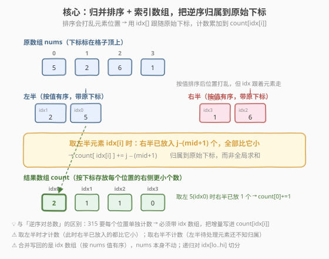
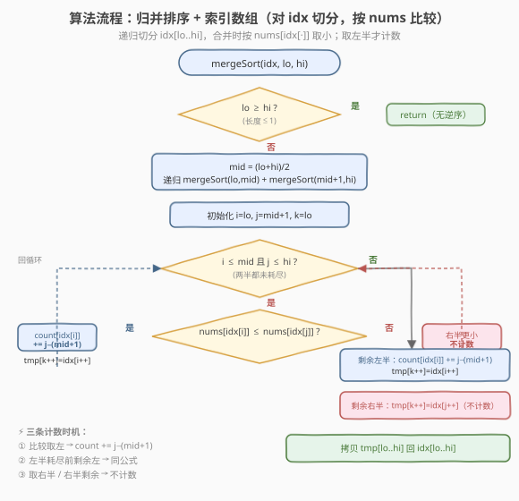

# 计算右侧小于当前元素的个数

- **题目名称**：计算右侧小于当前元素的个数
- **链接**：[315. 计算右侧小于当前元素的个数](https://leetcode.cn/problems/count-of-smaller-numbers-after-self/)
- **难度**：困难
- **标签**：数组、分治、归并排序、树状数组

## 1. 题目概述

给定一个整数数组 `nums`，返回一个新数组 `counts`，其中 `counts[i]` 表示 `nums[i]` 右侧**严格小于** `nums[i]` 的元素个数。

**示例 1**：

```text
输入：nums = [5,2,6,1]
输出：[2,1,1,0]
解释：
  5 的右侧有 2,6,1，严格小于 5 的有 2、1 → 2 个
  2 的右侧有 6,1，严格小于 2 的有 1 → 1 个
  6 的右侧有 1，严格小于 6 的有 1 → 1 个
  1 的右侧无元素 → 0 个
```

**示例 2**：

```text
输入：nums = [-1]
输出：[0]
```

**示例 3**：

```text
输入：nums = [-1,-1]
输出：[0,0]
解释：两个 -1 相等，不构成「严格小于」
```

**约束条件**：

- `1 <= nums.length <= 10^5`
- `-10^4 <= nums[i] <= 10^4`

> 💡 这是 [剑指 Offer 51. 数组中的逆序对](../0101-0200/LCOF51_数组中的逆序对.md) 的**进阶版**：逆序对只求「总数」，而本题要求「每个位置右侧更小的个数」。解法骨架同为归并排序，但必须额外维护一个**索引数组**，把逆序归属到原始下标。面试中本题是字节、腾讯、Google、Meta 的高频题，几乎是「归并排序能干什么」的代表题。

---

## 2. 解题思路

### 2.1 暴力思路：双重循环逐个比较

最直观的做法：对每个 `i`，扫描它右边的所有 `j`，统计 `nums[j] < nums[i]` 的个数。

```text
for i in range(n):
    for j in range(i+1, n):
        if nums[j] < nums[i]:
            count[i] += 1
```

> ⚠️ **致命缺陷**：$n \le 10^5$ 时，数对总数达 $\binom{n}{2} \approx 5 \times 10^9$，双重循环必然超时。和逆序对一样，必须找到能「批量统计」的方法。

### 2.2 核心观察：归并排序 + 索引数组，把逆序归属到原始下标



关键洞察仍来自归并排序的**合并阶段**：合并两段已有序的子数组时，当右半元素比左半元素小，由于左半有序，可一次性确定「左半从 `i` 到 `mid` 的所有元素都比这个右半元素大」。这与逆序对的思路完全一致。

**但本题有一个本质不同**：题目要求**每个位置单独的计数**，而非一个总数。归并排序会**打乱元素位置**——排序后我们不再知道某个值原本在第几位。因此必须引入一个**索引数组 `idx`**：

- `idx[]` 初始为 `[0, 1, 2, ..., n-1]`，记录每个元素的**原始下标**。
- 归并排序对 `idx[]` 切分、合并，比较时用 `nums[idx[·]]` 而非 `nums[·]`。
- 合并时，每当**取走一个左半元素** `idx[i]`，此时右半已经放入 `j - (mid + 1)` 个元素（它们都严格小于 `nums[idx[i]]`），把这 `j - (mid + 1)` 个累加到 `count[idx[i]]`——**归属到原始下标**。

> 💡 **为什么是「取左半时才计数」？** 取走左半元素 `idx[i]` 的那一刻，右半已经放入的元素全部确定比它小（合并是按值升序取的，右半放入的必然 $<$ `nums[idx[i]]`）。而取走右半元素时，左半待处理的元素还没归属，无从计数——它们会在自己被取走时再统计。所以**计数只发生在取左半元素的两个时机**：循环内取左、以及左半剩余收尾。

> ⚠️ **相等元素不计数**：比较用 `nums[idx[i]] <= nums[idx[j]]` 取左半。当两值相等时取左半，此时右半那个相等元素尚未放入（`j` 没动），不会被计入 `j - (mid + 1)`。这保证「严格小于」语义，同时维持归并稳定性。

### 2.3 算法流程图



**完整步骤**：

1. **初始化**：`idx = [0..n-1]`，`count = [0]*n`，辅助数组 `tmp`。
2. **递归切分**：`mergeSort(lo, hi)`，若 `lo >= hi` 返回（长度 $\le 1$ 无逆序）。
3. **分治**：`mid = (lo + hi) / 2`，递归左右半。
4. **合并**（对 `idx` 操作，按 `nums[idx[·]]` 比较）：
   - `i = lo, j = mid+1, k = lo`
   - 若 `nums[idx[i]] <= nums[idx[j]]`：`count[idx[i]] += j - (mid+1)`，`tmp[k++] = idx[i++]`
   - 否则：`tmp[k++] = idx[j++]`（取右半，不计数）
   - 左半剩余：每个都 `count[idx[i]] += j - (mid+1)`（此时 `j = hi+1`，即右半全部个数）
   - 右半剩余：直接复制，不计数
   - 拷贝 `tmp[lo..hi]` 回 `idx[lo..hi]`

### 2.4 示例演算

以 `nums = [5, 2, 6, 1]` 为例，完整演示索引数组的演化与 `count` 的累加。

![示例演算：[5,2,6,1] → [2,1,1,0]](../images/count_smaller_walkthrough.svg)

**递归树（自底向上）**：

| 层级 | 合并对象 | 比较与取法 | count 增量 | 合并后 idx 段 |
|------|----------|------------|-----------|---------------|
| 1a | `[0]`(值5) · `[1]`(值2) | 5>2 取右，再取左 idx0 | `count[0] += 2-1 = 1` | `[1, 0]`（值 2,5） |
| 1b | `[2]`(值6) · `[3]`(值1) | 6>1 取右，再取左 idx2 | `count[2] += 4-3 = 1` | `[3, 2]`（值 1,6） |
| 0 | `[1,0]`(值2,5) · `[3,2]`(值1,6) | 见下表 | `count[1]+=1`, `count[0]+=1` | `[3,1,0,2]`（值 1,2,5,6） |

**第 0 层合并细节**（`lo=0, mid=1, hi=3`）：

| 步骤 | i→(idx,值) | j→(idx,值) | 比较 | 取 | count 增量 | tmp(idx) |
|------|-----------|-----------|------|------|-----------|----------|
| 1 | 0,(1,2) | 2,(3,1) | 2 > 1 | 右 idx3 | 不计数 | `[3,_,_,_]` |
| 2 | 0,(1,2) | 3,(2,6) | 2 ≤ 6 | 左 idx1 | `count[1] += 3-2 = 1` | `[3,1,_,_]` |
| 3 | 1,(0,5) | 3,(2,6) | 5 ≤ 6 | 左 idx0 | `count[0] += 3-2 = 1` | `[3,1,0,_]` |
| 4 | 左耗尽 | 3,(2,6) | — | 右 idx2 | 不计数 | `[3,1,0,2]` ✓ |

最终 `count = [1+1, 0+1, 1, 0] = [2, 1, 1, 0]`，与示例一致。

> 💡 **跨层累加**：元素 `5`（原下标 0）在第 1a 层被取左时累加 1（对应右侧的 2），在第 0 层被取左时再累加 1（对应右侧的 1），总和 2 = 右侧全部更小元素。一个元素在多层合并中可能被多次「取左」，每次累加该层右半已放入数，总和恰好覆盖它右侧所有更小元素——分治保证不重不漏。

---

## 3. 参考代码

### C++

```cpp
class Solution {
    vector<int> idx;
    vector<int> tmp;
    vector<int> count;
  public:
    vector<int> countSmaller(vector<int>& nums) {
        int n = nums.size();
        idx.resize(n);
        tmp.resize(n);
        count.assign(n, 0);
        for (int i = 0; i < n; i++) idx[i] = i;
        mergeSort(nums, 0, n - 1);
        return count;
    }

  private:
    void mergeSort(vector<int>& nums, int lo, int hi) {
        if (lo >= hi) return;
        int mid = lo + (hi - lo) / 2;
        mergeSort(nums, lo, mid);
        mergeSort(nums, mid + 1, hi);
        merge(nums, lo, mid, hi);
    }

    void merge(vector<int>& nums, int lo, int mid, int hi) {
        int i = lo, j = mid + 1, k = lo;
        while (i <= mid && j <= hi) {
            if (nums[idx[i]] <= nums[idx[j]]) {
                count[idx[i]] += j - (mid + 1);
                tmp[k++] = idx[i++];
            } else {
                tmp[k++] = idx[j++];
            }
        }
        while (i <= mid) {
            count[idx[i]] += j - (mid + 1);
            tmp[k++] = idx[i++];
        }
        while (j <= hi) {
            tmp[k++] = idx[j++];
        }
        for (int p = lo; p <= hi; p++) idx[p] = tmp[p];
    }
};
```

### Python

```python
class Solution:
    def countSmaller(self, nums: List[int]) -> List[int]:
        n = len(nums)
        idx = list(range(n))
        tmp = [0] * n
        count = [0] * n

        def merge_sort(lo: int, hi: int) -> None:
            if lo >= hi:
                return
            mid = lo + (hi - lo) // 2
            merge_sort(lo, mid)
            merge_sort(mid + 1, hi)
            merge(lo, mid, hi)

        def merge(lo: int, mid: int, hi: int) -> None:
            i, j, k = lo, mid + 1, lo
            while i <= mid and j <= hi:
                if nums[idx[i]] <= nums[idx[j]]:
                    count[idx[i]] += j - (mid + 1)
                    tmp[k] = idx[i]
                    i += 1
                else:
                    tmp[k] = idx[j]
                    j += 1
                k += 1
            while i <= mid:
                count[idx[i]] += j - (mid + 1)
                tmp[k] = idx[i]
                i += 1
                k += 1
            while j <= hi:
                tmp[k] = idx[j]
                j += 1
                k += 1
            for p in range(lo, hi + 1):
                idx[p] = tmp[p]

        merge_sort(0, n - 1)
        return count
```

> 💡 **Python 栈深**：$n = 10^5$ 时递归深度约 $\log_2 n \approx 17$，远低于默认限制 1000，无需 `setrecursionlimit`。但 Python 递归常数较大，$n = 10^5$ 时可能接近时限，必要时可改为迭代式归并。

---

## 4. 复杂度分析

| 维度 | 复杂度 | 说明 |
|------|--------|------|
| **时间复杂度** | $O(n \log n)$ | 归并树共 $O(\log n)$ 层，每层合并合计扫描 $O(n)$ 个元素；计数在取左半时 $O(1)$ 累加 |
| **空间复杂度** | $O(n)$ | `idx`、`tmp`、`count` 各 $O(n)$；递归栈 $O(\log n)$，主导项为三个数组 |

---

## 5. 扩展：树状数组解法

与 [逆序对](../0101-0200/LCOF51_数组中的逆序对.md) 一样，**树状数组**（BIT）也能 $O(n \log n)$ 解决本题，且思路更「在线」：从右往左遍历，对每个元素查询「已插入元素中比它严格小的个数」。

**思路**：

1. **离散化**：把 `nums` 的值域压缩到 $[1, m]$（$m$ 为不同值的个数），消除负数与大值域。
2. **从右往左**遍历：对 `nums[i]`，查询 BIT 中严格小于它的已插入元素个数（即右侧更小个数），写入 `count[i]`，再把 `nums[i]` 插入 BIT。

```cpp
class BIT {
    vector<int> tree;
    int n;
  public:
    BIT(int n) : tree(n + 1), n(n) {}
    void update(int i, int delta) {
        for (; i <= n; i += i & (-i)) tree[i] += delta;
    }
    int query(int i) {
        int sum = 0;
        for (; i > 0; i -= i & (-i)) sum += tree[i];
        return sum;
    }
};

class Solution {
  public:
    vector<int> countSmaller(vector<int>& nums) {
        // 离散化：排序 + 去重，得到 1-indexed 的 rank
        vector<int> sorted(nums);
        sort(sorted.begin(), sorted.end());
        sorted.erase(unique(sorted.begin(), sorted.end()), sorted.end());
        int m = sorted.size();
        BIT bit(m);
        vector<int> count(nums.size(), 0);
        for (int i = (int)nums.size() - 1; i >= 0; --i) {
            int rank = lower_bound(sorted.begin(), sorted.end(), nums[i])
                       - sorted.begin() + 1;       // 1-indexed
            count[i] = bit.query(rank - 1);       // 严格更小：查 < rank 的前缀和
            bit.update(rank, 1);
        }
        return count;
    }
};
```

> 💡 **归并 vs 树状数组**：
> - **归并排序**：一次遍历搞定，不需离散化，代码结构清晰，面试默写首选。缺点是改动原数组顺序（本题用 `idx` 间接排序规避了）。
> - **树状数组**：需离散化预处理，但思路「在线」——元素逐个从右往左插入，天然适合「右侧更小个数」这类**逐位置查询**。也是 [327. 区间和的个数](https://leetcode.cn/problems/count-of-range-sum/)、[493. 翻转对](https://leetcode.cn/problems/reverse-pairs/) 的备选解法。

---

## 6. 面试要点

1. **本题和逆序对的区别在哪？为什么要索引数组？**

   - 逆序对只求总数，归并时维护一个全局 `count` 即可；本题要求**每个位置单独的计数**。归并排序会打乱元素位置，排序后无法知道某值原本在第几位。引入 `idx[]` 让原始下标「跟着元素走」，合并时把增量累加到 `count[idx[i]]`，归属到题目要的输出位置。

2. **为什么取左半元素时才计数？公式 `j - (mid + 1)` 怎么来的？**

   - 合并按值升序取元素。取走左半 `idx[i]` 时，右半已经放入的元素都严格小于 `nums[idx[i]]`（否则它们不会被先取）。`j` 从 `mid+1` 出发，每放入一个右半元素 `j++`，所以「右半已放入数」= `j - (mid + 1)`，这恰好是本层右半中比 `nums[idx[i]]` 小的元素个数。

3. **相等元素如何处理？为什么用 `<=` 而非 `<`？**

   - 用 `nums[idx[i]] <= nums[idx[j]]` 取左半。两值相等时取左半，此时右半那个相等元素尚未放入（`j` 没动），不计入 `j - (mid + 1)`。这保证「严格小于」语义——相等不算更小。同时维持归并稳定性。

4. **一个元素的「右侧更小个数」会在多层合并中被多次累加，会重复吗？**

   - 不会。分治把数组切成多层，每层合并只统计**跨段**的逆序（左半元素 vs 右半元素）。一个左半元素在某层被取左时，累加的是「该层右半中比它小的个数」；不同层的右半对应原数组的不同区段，互不重叠。所有层累加的总和 = 它右侧全部更小元素，由分治的不重不漏保证。

5. **归并和树状数组各自的适用场景？**

   - 归并排序：**离线**一次性统计，不需离散化，结构清晰，面试首选。
   - 树状数组：**在线**逐个插入查询，天然适合逐位置输出；但需离散化预处理，且支持动态场景（元素随时插入/删除时仍可查询）。本题两者均可，归并更易默写。

---

## 7. 同类练习题

- [剑指 Offer 51. 数组中的逆序对](https://leetcode.cn/problems/shu-zu-zhong-de-ni-xu-dui-lcof/)（[题解](../0101-0200/LCOF51_数组中的逆序对.md)）：本题的简化版——只求逆序对总数，掌握归并计数后本题只需加一个 `idx` 数组
- [327. 区间和的个数](https://leetcode.cn/problems/count-of-range-sum/)：归并排序 + 前缀和统计区间个数，分治计数的进阶应用，也可用树状数组
- [493. 翻转对](https://leetcode.cn/problems/reverse-pairs/)：归并框架不变，合并时统计 `nums[i] > 2*nums[j]` 的对数，需额外双指针独立计数
- [912. 排序数组](https://leetcode.cn/problems/sort-an-array/)（[题解](../0901-1000/912_排序数组.md)）：归并排序母题，掌握 merge 模板后本题只需在取左半时加一行计数
