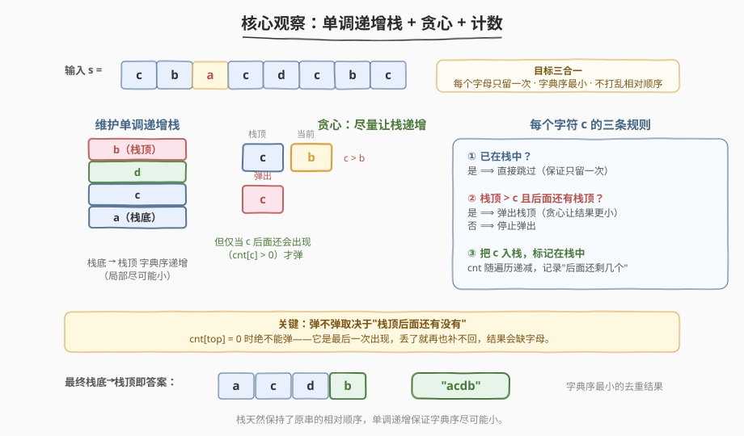
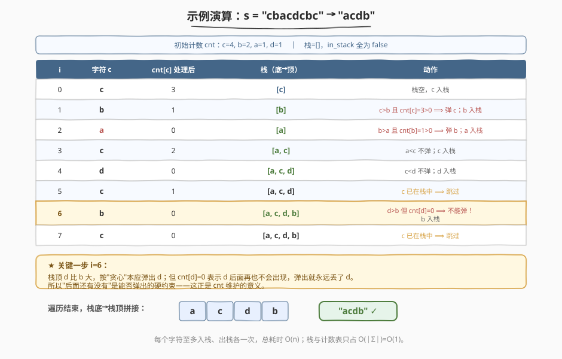

# LeetCode 去除重复字母 题解

## 1. 题目概述

- **标题 / 题号**：去除重复字母（#316，medium）
- **链接**：https://leetcode.cn/problems/remove-duplicate-letters/
- **难度**：中等
- **标签**：栈、单调栈、贪心、字符串、哈希表

**题意**：给你一个字符串 `s`，请你去除字符串中重复的字母，使得**每个字母只出现一次**。需保证返回结果的**字典序最小**，且**不能打乱其他字符的相对位置**。

**示例 1**：

```text
输入：s = "bcabc"
输出："abc"
解释：b/c/a 各出现一次，字典序最小的去重结果为 "abc"。
```

**示例 2**：

```text
输入：s = "cbacdcbc"
输出："acdb"
解释：a/c/d/b 各保留一次，"acdb" 是满足相对顺序且字典序最小的结果。
```

**约束**：

- $1 \leq \text{s.length} \leq 10^4$
- `s` 由小写英文字母组成
- **进阶**：能在 $O(n)$ 时间、$O(1)$ 空间下完成吗？（字符集 $\lvert\Sigma\rvert=26$ 视为常数）

> 💡 这是一道"三合一"的经典题：**去重 + 字典序最小 + 保持相对顺序**。三个要求互相牵制，直接排序会破坏相对顺序，直接去重又难保证字典序最小。它的最优解法是**单调递增栈 + 贪心 + 计数**——一次学透一个模板，能直接迁移到「不同字符的最小子序列」「拼接最大数」等同构题。

## 2. 解题思路

### 2.1 暴力思路：回溯枚举

对每个字母"留 / 不留"做回溯，在所有合法（每个字母恰好留一次、相对顺序不变）的方案里挑字典序最小者。但每个字母至多两次选择、且要保证最终每个字母都留下，搜索空间巨大，$n=10^4$ 直接超时。

> ⚠️ 暴力的核心痛点是「局部贪心不安全」：看到当前字母比栈顶小就想替换，但万一栈顶后面再不出现了呢？所以需要一条信息来回答「栈顶后面还有没有」——这正是**计数 `cnt`** 的用武之地。

### 2.2 核心观察：单调递增栈 + 贪心 + 计数



把答案想象成从左到右逐位"选字母"。为了让字典序尽量小，我们希望**靠前的位置尽量放小字母**——这天然对应**单调递增栈**：当新字母比栈顶更小时，把栈顶弹掉、让小字母靠前，结果会更优。

但弹栈有个**硬约束**：被弹的栈顶字母后面必须**还会出现**，否则它就永远丢失了，违反"每个字母恰好留一次"。所以需要：

- **`cnt[c]`**：记录每个字母在**当前位置之后**还剩多少个（随遍历递减），用来判断"栈顶后面还有没有"；
- **`in_stack[c]`**：标记字母是否已在栈中，避免重复入栈。

于是对每个字符 `c`，套三条规则：

1. **已在栈中** → 直接跳过（保证每个字母只留一次）；
2. **栈顶 `> c` 且 `cnt[栈顶] > 0`** → 弹出栈顶（贪心让结果更小），循环判断新栈顶；
3. **把 `c` 入栈**，标记 `in_stack[c] = true`。

> ⚠️ 规则 ② 是贪心的灵魂，但 `cnt[栈顶] > 0` 是它的"安全带"：栈顶再大，只要后面没了就**绝不能弹**——丢了就补不回。最终栈从底到顶的拼接即为答案（栈天然保持了原串的相对顺序）。

### 2.3 算法流程图


维护变量：

- `cnt[26]`：各字母剩余出现次数，遍历时先 `cnt[c]--` 再处理；
- `in_stack[26]`：布尔数组，标记字母是否在栈中；
- `stack`：字符栈，自底向顶保持字典序递增。

**主流程**：

1. 预处理 `cnt`，统计每个字母的总出现次数。
2. 顺序遍历 `s`，对每个 `c`：
   1. `cnt[c] -= 1`；
   2. 若 `in_stack[c]` 为真，`continue`；
   3. `while` 栈非空 且 `c < 栈顶` 且 `cnt[栈顶] > 0`：弹出栈顶，`in_stack[栈顶] = false`；
   4. `c` 入栈，`in_stack[c] = true`。
3. 栈底→栈顶拼接成字符串返回。

> 💡 **顺序细节**：先 `cnt[c]--` 再判断，保证 `cnt[栈顶]` 反映的是"当前及之后"还剩几个；而 `cnt[c]` 此时已是"当前位置之后"的剩余数，正用于判断 `c` 自己能否被未来的同类替换。

### 2.4 示例演算

以 `s = "cbacdcbc"` 为例（初始 `cnt：c=4, b=2, a=1, d=1`）：



逐字符过程：

| i | 字符 c | cnt[c] 处理后 | 栈（底→顶） | 动作 |
|---|--------|--------------|-------------|------|
| 0 | c | 3 | `[c]` | 栈空，c 入栈 |
| 1 | b | 1 | `[b]` | c&gt;b 且 cnt[c]=3&gt;0 ⟹ 弹 c；b 入栈 |
| 2 | a | 0 | `[a]` | b&gt;a 且 cnt[b]=1&gt;0 ⟹ 弹 b；a 入栈 |
| 3 | c | 2 | `[a, c]` | a&lt;c 不弹；c 入栈 |
| 4 | d | 0 | `[a, c, d]` | c&lt;d 不弹；d 入栈 |
| 5 | c | 1 | `[a, c, d]` | c 已在栈中 ⟹ 跳过 |
| 6 | b | 0 | `[a, c, d, b]` | d&gt;b **但 cnt[d]=0 不能弹**；b 入栈 |
| 7 | c | 0 | `[a, c, d, b]` | c 已在栈中 ⟹ 跳过 |

> ⚠️ **关键一步 i=6**：栈顶 `d` 比 `b` 大，按贪心本应弹出 `d`；但 `cnt[d]=0` 表示 `d` 后面再也不会出现，弹出就永远丢了 `d`。所以"后面还有没有"是能否弹出的硬约束。最终栈拼接为 `"acdb"` ✓。

## 3. 参考代码

### C++（单调栈 + 计数，$O(n)$ / $O(1)$）

```cpp
class Solution {
  public:
    string removeDuplicateLetters(string s) {
        int cnt[26] = {0};
        bool in_stack[26] = {false};
        for (char c : s) cnt[c - 'a']++;            // 统计每个字母总数

        string stack;                                // 当作字符栈
        for (char c : s) {
            int idx = c - 'a';
            cnt[idx]--;                              // 当前位置之后还剩几个
            if (in_stack[idx]) continue;             // 规则①：已在栈中跳过

            // 规则②：栈顶更大 且 后面还会出现 ⟹ 弹出
            while (!stack.empty() && c < stack.back() && cnt[stack.back() - 'a'] > 0) {
                in_stack[stack.back() - 'a'] = false;
                stack.pop_back();
            }
            // 规则③：入栈
            stack.push_back(c);
            in_stack[idx] = true;
        }
        return stack;
    }
};
```

### Python

```python
class Solution:
    def removeDuplicateLetters(self, s: str) -> str:
        cnt = collections.Counter(s)                 # 各字母剩余出现次数
        in_stack = set()                             # 当前在栈中的字母
        stack = []

        for c in s:
            cnt[c] -= 1
            if c in in_stack:                        # 规则①：已在栈中跳过
                continue
            # 规则②：栈顶更大 且 后面还会出现 ⟹ 弹出
            while stack and c < stack[-1] and cnt[stack[-1]] > 0:
                in_stack.remove(stack.pop())
            # 规则③：入栈
            stack.append(c)
            in_stack.add(c)
        return "".join(stack)
```

> 💡 两种写法只是数据结构差异：C++ 用 `int cnt[26]` + `bool in_stack[26]`；Python 用 `Counter` + `set`。逻辑完全一致。注意 Python 的 `cnt` 在 `Counter` 上做减法会自然到 0，判断 `cnt[stack[-1]] > 0` 即可。

## 4. 复杂度分析

| 维度 | 复杂度 | 说明 |
|------|--------|------|
| 时间复杂度 | $O(n)$ | 每个字符至多入栈一次、出栈一次，总操作数 $\le 2n$ |
| 空间复杂度 | $O(\lvert\Sigma\rvert) = O(1)$ | 栈、`cnt`、`in_stack` 都只存字母表（26 个小写字母），与 $n$ 无关；若把输出栈算进去则 $O(\lvert\Sigma\rvert)$ |

> ⚠️ 时间为何是 $O(n)$ 而非 $O(n^2)$？虽然有个 `while` 嵌套在 `for` 里，但每个字符一生只入栈、出栈各一次，**摊还分析**下每次循环均摊 $O(1)$，总线性。

## 5. 扩展：递归贪心法

除单调栈外，还有一条思路——**递归选最小前缀**：

1. 找到当前使"右侧字母种类齐全"的最小位置 `pos`（即 `pos` 之后每种剩余字母都还至少有一个）；
2. 在 `s[0..pos]` 中挑**字典序最小的字母** `c` 作为结果首位；
3. 删掉 `c` 及其左侧所有字符，对 `c` 右侧、去掉所有 `c` 的子串递归。

```cpp
class Solution {
  public:
    string removeDuplicateLetters(string s) {
        vector<int> pos(26, -1);
        for (int i = 0; i < s.size(); ++i) pos[s[i] - 'a'] = i;   // 每个字母最后位置
        int ch = 0;                                  // 选哪个字母
        for (int i = 0; i < s.size(); ++i) {
            if (s[i] < s[ch]) ch = i;                // 维护最小字母
            if (i == pos[s[i] - 'a']) break;         // 再往后该字母就没了，必须在此处或之前定
        }
        string first(1, s[ch]);
        string rest;
        for (int i = ch + 1; i < s.size(); ++i)
            if (s[i] != s[ch]) rest += s[i];          // 去掉已选字母
        return s.size() == 1 ? first : first + removeDuplicateLetters(rest);
    }
};
```

两种方法对比：

| 方法 | 时间 | 空间 | 特点 |
|------|------|------|------|
| 单调栈 + 计数 | $O(n)$ | $O(1)$ | **推荐**，一次遍历、可读性强、易迁移 |
| 递归贪心 | $O(n \cdot \lvert\Sigma\rvert)$ | $O(n)$ 递归栈 | 思路直观（"选最小首位"），但常数大、易写错 |

> 💡 面试推荐单调栈：它把"贪心"和"安全弹栈"压缩成一个 `while`，模板化、好背、好迁移。

## 6. 面试要点

1. **为什么用单调递增栈？**
   - 字典序比较是从左到右的，**靠前的位置越小整体越小**。维护一个递增栈意味着"只要能把大字母换小就换"，让结果前缀尽量小。栈同时保留了遍历顺序，天然满足"不打乱相对顺序"。

2. **弹栈时为什么要判断 `cnt[栈顶] > 0`？**
   - 这是"安全带"。若 `cnt[栈顶] = 0`，说明该字母**后面再也不会出现**，一旦弹出就永久丢失，结果会少一个字母、违反"每个字母恰好留一次"。所以"栈顶更大"是贪心动机，"后面还有"是可行性约束，两者缺一不可。

3. **为什么需要 `in_stack`？它和 `cnt` 的职责区别？**
   - `cnt` 回答"后面还有没有"，`in_stack` 回答"现在栈里有没有"。同字母第二次出现时若已在栈中，直接跳过——既保证"只留一次"，又避免重复入栈破坏单调性（若再次入栈，弹栈时 `cnt` 已为 0 会导致逻辑混乱）。

4. **先 `cnt[c]--` 再判断有什么影响？**
   - 让 `cnt[x]` 始终表示"**当前位置之后**还剩几个 x"。这样弹栈判断 `cnt[栈顶] > 0` 准确反映"栈顶在后面还会不会出现"，而不会被当前正在处理的 `c` 干扰。

5. **本题和 [1081. 不同字符的最小子序列](https://leetcode.cn/problems/smallest-subsequence-of-distinct-characters/) 是什么关系？**
   - **完全等价**，题意、数据范围、解法一模一样，LeetCode 把它们作为同一模板的两个题号。会一道就会另一道，单调栈代码可原样套用。

## 同类练习题

| # | 题目 | 与本题的关联 |
|---|------|-------------|
| 1081 | [不同字符的最小子序列](https://leetcode.cn/problems/smallest-subsequence-of-distinct-characters/) | 与本题完全同构，单调栈模板原样套用，强化记忆 |
| 402 | [移掉 K 位数字](https://leetcode.cn/problems/remove-k-digits/) | 同为"单调栈 + 贪心让结果最小"，但不要求去重、改为"恰好删 k 个"，对比约束差异 |
| 321 | [拼接最大数](https://leetcode.cn/problems/create-maximum-number/) | 单调栈求"最大序列"的进阶，需在两个数组间分配长度并合并，难度更高 |
| 739 | [每日温度](https://leetcode.cn/problems/daily-temperatures/)（[题解](../0701-0800/739_每日温度.md)） | 单调栈入门题，对比"递减栈找右侧更大"与本题"递增栈找左侧更小"的方向区别 |
| 496 | [下一个更大元素 I](https://leetcode.cn/problems/next-greater-element-i/) | 单调栈找"下一个更大"，巩固单调栈的基本用法 |
