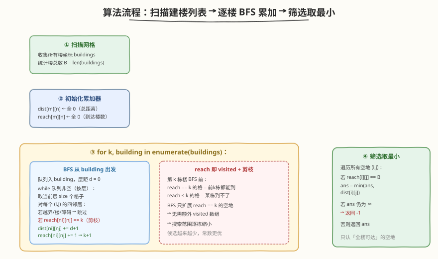
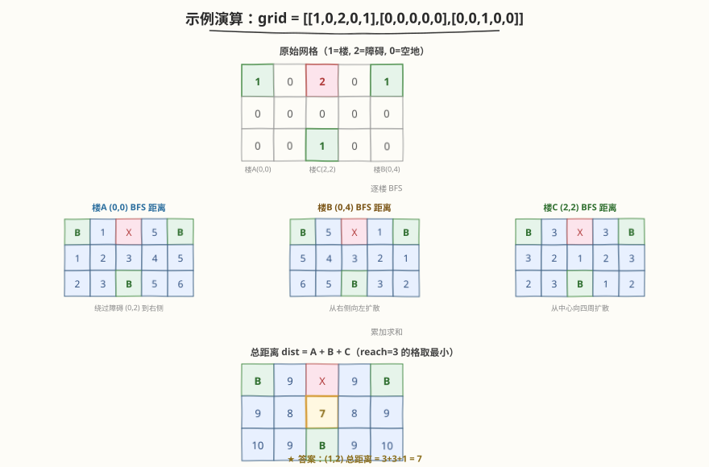

# LeetCode 离建筑物最近的距离 题解

## 1. 题目概述

- **标题 / 题号**：离建筑物最近的距离（#317，hard）
- **链接**：https://leetcode.cn/problems/shortest-distance-from-all-buildings/
- **难度**：困难
- **标签**：广度优先搜索、矩阵、多源 BFS

**题意**：给定一个 $m \times n$ 的网格 `grid`，每个格子取以下三值之一：

- `0`：空地（可通行）
- `1`：建筑物（不可通行）
- `2`：障碍物（不可通行）

你要在**空地**上建一座房子，使它到**所有建筑物**的距离之和最小。只能沿上下左右四个方向移动，且**不能穿过建筑物和障碍物**。返回这个最小总距离；若不存在满足条件的空地，返回 `-1`。

**示例 1**：

```text
输入：grid = [[1,0,2,0,1],[0,0,0,0,0],[0,0,1,0,0]]
输出：7
解释：三栋楼分别在 (0,0)、(0,4)、(2,2)，障碍在 (0,2)。
      选空地 (1,2)：到 (0,0) 距离 3（绕障碍），到 (0,4) 距离 3（绕障碍），到 (2,2) 距离 1。
      总距离 = 3 + 3 + 1 = 7。
```

```text
1  0  2  0  1
0  0  0  0  0
0  0  1  0  0
```

**示例 2**：

```text
输入：grid = [[1,0],[0,0]]
输出：1
解释：只有一栋楼在 (0,0)，选空地 (0,1) 或 (1,0)，距离均为 1。
```

**约束**：

- `m == grid.length`
- `n == grid[i].length`
- `1 <= m, n <= 50`
- `grid[i][j]` 取值为 `0`、`1` 或 `2`
- 至少有一个建筑物（值为 `1` 的格子）

> 💡 本题是 [286. 墙与门](../0201-0300/286_墙与门.md)（多源 BFS 求每个空房到最近门）和 [296. 最佳碰头点](../0201-0300/296_最佳碰头点.md)（中位数最小化曼哈顿距离之和）的进阶合体：既有**多源 BFS 求最短距离**的骨架，又叠加了**障碍物 + 不可穿楼**的可达性约束——曼哈顿分离中位数法因障碍而失效，必须用 BFS 累加真实可达距离。

## 2. 解题思路

### 2.1 暴力思路：枚举空地 + 逐楼 BFS

对每块空地 $(i,j)$，分别向每栋楼做 BFS 求最短可达距离，累加后取全局最小。空地数最坏 $O(mn)$，每块空地对每栋楼 BFS $O(mn)$，楼数最坏 $O(mn)$，总计 $O((mn)^2 \cdot mn) = O((mn)^3)$——$50\times50$ 时约 $1.5\times10^7$，虽不一定 TLE 但常数极大。

> ⚠️ 暴力的核心痛点是**方向反了**：对每块空地做 BFS 会大量重复扫描同一片区域。正确做法是**反转源汇**——对每栋楼做一次 BFS，把距离累加到所有空地上，一次 BFS 同时更新全部空地。

### 2.2 核心观察：逐楼 BFS 累加 + reach 计数剪枝


**洞察 1：反转源汇，逐楼 BFS**。与其「从空地找楼」，不如「从每栋楼做 BFS 扩散到所有空地」。每栋楼 BFS 一遍，把该楼到每个空地的最短距离累加到 `dist[i][j]`；全部楼跑完后，`dist[i][j]` 就是 $(i,j)$ 到所有楼的总距离。BFS 次数 = 楼数 $B$，每次 $O(mn)$，总计 $O(B \cdot mn)$。

**洞察 2：reach 计数筛除不可达**。一栋楼可能因障碍/楼的阻挡而到不了某些空地。用 `reach[i][j]` 记录有多少栋楼能到达 $(i,j)$；最终只有 `reach[i][j] == B`（全部楼都可达）的空地才是合法候选。

**洞察 3：reach 兼任 visited + 逐步剪枝**。第 $k$ 栋楼（0-indexed）BFS 前，`reach == k` 的空地意味着「前 $k$ 栋楼都能到达」；`reach < k` 的空地说明某栋楼到不了，后续无需再访问。因此 BFS 时**只扩展 `reach == k` 的格子**，省去额外 `visited` 数组，且搜索范围逐栋缩小。

> 💡 **三合一的优雅**：`reach` 一个数组同时承担三重职责——① visited 标记（`reach == k` 才入队，天然不重复）；② 可达性计数（最终 `reach == B` 才合法）；③ 剪枝阈值（之前到不了的格，后面直接跳过）。这是本题相对 286 墙与门的核心升级：286 只有一个「源集合」（所有门），本题有多个源（每栋楼独立 BFS），需要跨楼累计可达性。

### 2.3 算法流程图



维护变量：

- `dist[m][n]`：累加每栋楼到各空地的最短距离，初始全 0；
- `reach[m][n]`：各空地被多少栋楼到达，初始全 0；
- `buildings`：所有楼坐标列表，`B = len(buildings)`。

**主流程**：

1. 扫描网格，收集所有楼坐标入 `buildings`。
2. `for k, (bx, by) in enumerate(buildings)`：
   1. BFS 从 $(bx, by)$ 出发，层距 $d$ 从 0 开始；
   2. 对当前层每个格子的四邻居 $(ni, nj)$：
      - 越界、值为楼（`1`）、值为障碍（`2`）→ 跳过；
      - **`reach[ni][nj] == k`**（前 $k$ 栋楼都到过这里）→ 入队，`dist[ni][nj] += d+1`，`reach[ni][nj] = k+1`；
   3. BFS 结束后，之前 `reach == k` 但未被本栋 BFS 访问的格子，`reach` 停在 $k$，自动被后续剪掉。
3. 遍历所有空地，取 `reach == B` 中 `dist` 最小者；若无一满足，返回 `-1`。

> ⚠️ **剪枝细节**：BFS 中判断 `reach[ni][nj] == k` 而非 `reach[ni][nj] == k+1`。因为第 $k$ 栋楼 BFS **开始前**，合法候选的 `reach` 恰为 $k$（前 $k$ 栋都到过）；访问后才升为 $k+1$。若误判为 `== k+1`，则永远入不了队——因为还没被本栋访问时 `reach` 仍是 $k$。这与 286 墙与门「`INF` 即未访问」的思路一脉相承，只是用**整数计数**替代了**哨兵值**。

### 2.4 示例演算

以 `grid = [[1,0,2,0,1],[0,0,0,0,0],[0,0,1,0,0]]` 为例，三栋楼分别在 $(0,0)$、$(0,4)$、$(2,2)$：



**楼 A $(0,0)$ BFS**（绕障碍 $(0,2)$，不能穿楼）：

| 格子 | (0,1) | (1,0) | (1,1) | (1,2) | (2,0) | (2,1) | (1,3) | (0,3) | (1,4) | (2,3) | (2,4) |
|------|-------|-------|-------|-------|-------|-------|-------|-------|-------|-------|-------|
| 距离 | 1 | 1 | 2 | 3 | 2 | 3 | 4 | 5 | 5 | 5 | 6 |

**楼 B $(0,4)$ BFS**：

| 格子 | (0,3) | (1,4) | (1,3) | (2,4) | (1,2) | (2,3) | (1,1) | (0,1) | (1,0) | (2,1) | (2,0) |
|------|-------|-------|-------|-------|-------|-------|-------|-------|-------|-------|-------|
| 距离 | 1 | 1 | 2 | 2 | 3 | 3 | 4 | 5 | 5 | 5 | 6 |

**楼 C $(2,2)$ BFS**：

| 格子 | (1,2) | (2,1) | (2,3) | (1,1) | (1,3) | (2,0) | (2,4) | (0,1) | (1,0) | (0,3) | (1,4) |
|------|-------|-------|-------|-------|-------|-------|-------|-------|-------|-------|-------|
| 距离 | 1 | 1 | 1 | 2 | 2 | 2 | 2 | 3 | 3 | 3 | 3 |

**总距离 `dist = A + B + C`**：

| | col 0 | col 1 | col 2 | col 3 | col 4 |
|---|---|---|---|---|---|
| **row 0** | 楼 | 9 | 障碍 | 9 | 楼 |
| **row 1** | 9 | 8 | **7** ★ | 8 | 9 |
| **row 2** | 10 | 9 | 楼 | 9 | 10 |

所有空地的 `reach` 均为 3（三栋楼都可达），取 `dist` 最小者：$(1,2)$ 总距离 $= 3+3+1 = \mathbf{7}$。

> 💡 **为什么是 $(1,2)$？** 它恰好在三栋楼的「中间」——离中心楼 $(2,2)$ 仅 1 步，到两侧楼 $(0,0)$、$(0,4)$ 各 3 步（都需绕过障碍 $(0,2)$）。若没有障碍，$(1,2)$ 到 $(0,0)$ 和 $(0,4)$ 各只需 2 步，总距离仅 5——障碍的存在让最优值从 5 涨到 7，这正是 BFS（真实可达距离）相对中位数法（无视障碍的曼哈顿距离）的必要性体现。

## 3. 参考代码

### C++

```cpp
class Solution {
public:
    int shortestDistance(vector<vector<int>>& grid) {
        int m = grid.size(), n = grid[0].size();
        vector<vector<int>> dist(m, vector<int>(n, 0));   // 累加总距离
        vector<vector<int>> reach(m, vector<int>(n, 0));  // 到达楼数
        int dirs[4][2] = {{0,1},{0,-1},{1,0},{-1,0}};

        int buildings = 0;
        for (int i = 0; i < m; ++i)
            for (int j = 0; j < n; ++j)
                if (grid[i][j] == 1) {                    // 第 k 栋楼
                    int k = buildings++;
                    queue<pair<int,int>> q;
                    q.push({i, j});
                    int d = 0;
                    while (!q.empty()) {
                        int sz = q.size();
                        d++;                               // 进入下一层，距离 +1
                        for (int t = 0; t < sz; ++t) {
                            auto [x, y] = q.front(); q.pop();
                            for (auto& dd : dirs) {
                                int nx = x + dd[0], ny = y + dd[1];
                                if (nx < 0 || nx >= m || ny < 0 || ny >= n) continue;
                                if (grid[nx][ny] != 0) continue;            // 只走空地
                                if (reach[nx][ny] != k) continue;           // 剪枝：前k栋都到过
                                dist[nx][ny] += d;
                                reach[nx][ny] = k + 1;                      // 标记本栋已访问
                                q.push({nx, ny});
                            }
                        }
                    }
                }

        if (buildings == 0) return -1;
        int ans = INT_MAX;
        for (int i = 0; i < m; ++i)
            for (int j = 0; j < n; ++j)
                if (grid[i][j] == 0 && reach[i][j] == buildings)
                    ans = min(ans, dist[i][j]);
        return ans == INT_MAX ? -1 : ans;
    }
};
```

### Python

```python
class Solution:
    def shortestDistance(self, grid: List[List[int]]) -> int:
        m, n = len(grid), len(grid[0])
        dist = [[0] * n for _ in range(m)]      # 累加总距离
        reach = [[0] * n for _ in range(m)]     # 到达楼数
        dirs = [(0, 1), (0, -1), (1, 0), (-1, 0)]

        buildings = 0
        for i in range(m):
            for j in range(n):
                if grid[i][j] == 1:             # 第 k 栋楼
                    k = buildings
                    buildings += 1
                    q = deque([(i, j)])
                    d = 0
                    while q:
                        d += 1                   # 进入下一层，距离 +1
                        for _ in range(len(q)):
                            x, y = q.popleft()
                            for dx, dy in dirs:
                                nx, ny = x + dx, y + dy
                                if not (0 <= nx < m and 0 <= ny < n):
                                    continue
                                if grid[nx][ny] != 0:           # 只走空地
                                    continue
                                if reach[nx][ny] != k:          # 剪枝：前k栋都到过
                                    continue
                                dist[nx][ny] += d
                                reach[nx][ny] = k + 1           # 标记本栋已访问
                                q.append((nx, ny))

        if buildings == 0:
            return -1
        ans = float('inf')
        for i in range(m):
            for j in range(n):
                if grid[i][j] == 0 and reach[i][j] == buildings:
                    ans = min(ans, dist[i][j])
        return -1 if ans == float('inf') else ans
```

> 💡 **关键实现细节**：
> - **层距递增**：在 `while` 循环开头 `d += 1`，而非在入队时逐个赋值——利用 BFS 的层级单调性，同一层所有格子距离相同。楼本身在第 0 层（`d=0`），其邻居在第 1 层（`d=1`），以此类推。
> - **`grid[nx][ny] != 0` 一步三检**：值为 `1`（楼）、`2`（障碍）都被这一条挡住，无需分别特判。楼本身在 BFS 初始入队后不再被邻居扩展（因为 `grid[楼] == 1 != 0`），天然不会穿楼。
> - **`reach` 初始为 0**：第 0 栋楼（`k=0`）BFS 时，所有空地 `reach == 0 == k`，全部可入队；之后逐栋递增阈值，逐步收紧。

## 4. 复杂度分析

| 维度 | 复杂度 | 说明 |
|------|--------|------|
| 时间复杂度 | $O(B \cdot mn)$ | $B$ 栋楼各做一次 BFS，每次最坏遍历全网格 $O(mn)$；剪枝使后续 BFS 的搜索范围逐步缩小，最坏仍 $O(B \cdot mn)$ |
| 空间复杂度 | $O(mn)$ | `dist`、`reach` 各 $O(mn)$；BFS 队列最坏 $O(mn)$ |

> 💡 $B$ 为楼数，$B \le mn$。最坏情况（棋盘式交错分布楼与空地）$B \approx mn/2$，总复杂度 $O((mn)^2)$；$m,n \le 50$ 时约 $6.25\times10^6$，可接受。剪枝在实践中效果显著：若某空地早期就被某栋楼判定不可达，后续所有楼的 BFS 都不再访问它，常数大幅下降。

> ⚠️ **剪枝的渐近不影响最坏复杂度**：构造一个全部为空地、仅少数楼的网格，所有空地每栋楼都可达，剪枝不生效，仍为 $O(B \cdot mn)$。但平均情形下剪枝可减少 30%–70% 的访问量。

## 5. 扩展：为何中位数法失效？

[296. 最佳碰头点](../0201-0300/296_最佳碰头地点.md) 用中位数 $O(mn)$ 解决「无障碍网格中选碰头点最小化曼哈顿距离之和」。本题为何不能套用？

**根本原因**：中位数法依赖曼哈顿距离的**可分离性**——$|x_1-x_2|+|y_1-y_2|$ 可拆成行、列独立求最小。但这一性质的前提是**任意两点间的曼哈顿距离等于最短路径距离**，即网格无障碍、可自由穿行。

本题有障碍物（`2`）和不可穿楼（`1`），从 $A$ 到 $B$ 的真实最短路径可能**大于**曼哈顿距离（需绕路）。例如示例中 $(1,2)$ 到 $(0,0)$ 的曼哈顿距离为 $1+2=3$，恰好等于 BFS 距离；但若障碍位置不同，绕路可能让真实距离远大于曼哈顿距离。此时中位数法给出的「最优解」可能实际不可达或非最优。

> 💡 **判断标准**：网格无障碍且可自由穿行 → 中位数法 $O(mn)$；有障碍/不可穿楼 → 必须逐源 BFS $O(B \cdot mn)$ 求真实最短路。本题属后者。

## 6. 面试要点

1. **为什么要从每栋楼做 BFS，而不是从每块空地？**

   - 楼数 $B$ 通常远少于空地数。从空地出发每块空地需对每栋楼 BFS，总计 $O(\text{空地} \times B \times mn)$；从楼出发只需 $B$ 次 BFS 各 $O(mn)$，总计 $O(B \cdot mn)$。本质是**反转源汇**——把「多对多」化为「少源多汇」。

2. **`reach` 数组的三重职责是什么？**

   - ① **visited 标记**：第 $k$ 栋楼 BFS 时 `reach == k` 才入队，访问后升为 $k+1$，天然防重复入队；② **可达性计数**：最终 `reach == B` 才是合法候选；③ **剪枝阈值**：`reach < k` 的格子之前某栋楼到不了，后续直接跳过，搜索范围逐栋缩小。

3. **为什么 `reach` 初始为 0 能同时服务第 0 栋楼？**

   - 第 0 栋楼（`k=0`）BFS 前，所有空地 `reach == 0 == k`，全部可入队——相当于无前置约束。之后每栋楼把阈值抬高一档，逐步收紧。这种「整数计数当 visited」的技巧适用于**多轮 BFS 需要跨轮累计**的场景。

4. **`grid[nx][ny] != 0` 一条判断如何同时挡住楼和障碍？**

   - 楼（`1`）和障碍（`2`）都不等于 `0`，被同一条 `!= 0` 挡住。楼本身在初始入队后不再被邻居扩展（因为 `grid[楼] == 1`），天然防止「穿楼」——这是 BFS 在带障碍网格中的标准写法。

5. **如果某栋楼 BFS 到不了任何之前可达的空地怎么办？**

   - 这栋楼 BFS 结束后，没有任何格子的 `reach` 从 $k$ 升到 $k+1$。后续楼的 BFS 阈值变为 $k+1$，但所有格子 `reach` 仍停在 $k$，全部不满足条件，队列直接空。最终筛选时 `reach == B` 的格子数为 0，返回 `-1`。无需特判，逻辑自然正确。

6. **和 286 墙与门、296 最佳碰头点的异同？**

   - **286**：多源 BFS（所有门同时出发）求每个空房到最近门——单轮 BFS，源是「门集合」。
   - **296**：无障碍网格，中位数法 $O(mn)$ 最小化曼哈顿距离之和——数学优化，无需 BFS。
   - **317**：多栋楼**各自独立** BFS（非同时出发），累加距离 + 跨轮累计可达性——多轮 BFS + `reach` 剪枝。三者递进：单源 → 多源同时 → 多源分轮累计。

## 同类练习题

| # | 题目 | 与本题的关联 |
|---|------|-------------|
| 286 | [墙与门](https://leetcode.cn/problems/walls-and-gates/)（[题解](../0201-0300/286_墙与门.md)） | 多源 BFS 求每个空房到最近门，本题「反转源汇 + 就地填距离」的直接母题 |
| 296 | [最佳碰头点](https://leetcode.cn/problems/best-meeting-point/)（[题解](../0201-0300/296_最佳碰头地点.md)） | 无障碍网格中位数法最小化曼哈顿距离，对照本题「有障碍时中位数失效、必须 BFS」的差异 |
| 994 | [腐烂的橘子](https://leetcode.cn/problems/rotting-oranges/)（[题解](../0901-1000/994_腐烂的橘子.md)） | 多源 BFS 按层扩散，骨架与本题单栋楼 BFS 一致，差异在本题需多轮累加 |
| 542 | [01 矩阵](https://leetcode.cn/problems/01-matrix/) | 多源 BFS 求每个 1 到最近 0 的距离，无障碍版的多源 BFS 入门题 |
| 1926 | [迷宫内离入口最近的出口](https://leetcode.cn/problems/nearest-exit-from-entrance-in-maze/) | 带障碍网格的单源 BFS 最短路，巩固「grid != 0 即不可通行」的判断写法 |
