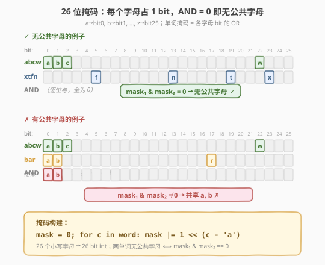
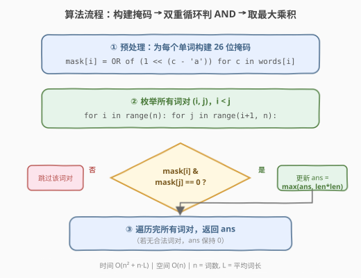
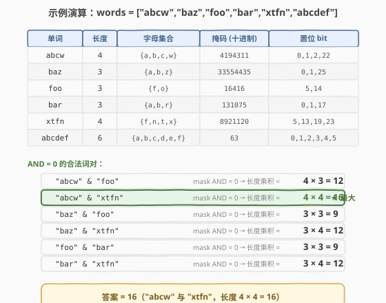

# 最大单词长度乘积

- **题目名称**：最大单词长度乘积
- **链接**：[318. 最大单词长度乘积](https://leetcode.cn/problems/maximum-product-of-word-lengths/)
- **难度**：中等
- **标签**：位运算、数组、哈希表

## 1. 题目概述

给定一个字符串数组 `words`，找出并返回 `length(words[i]) * length(words[j])` 的最大值，且这两个单词**不含有任何公共字母**。如果不存在这样的两个单词，返回 `0`。

**示例 1**：

```text
输入：words = ["abcw","baz","foo","bar","xtfn","abcdef"]
输出：16
解释："abcw" 和 "xtfn" 没有公共字母，长度乘积 = 4 × 4 = 16。
```

**示例 2**：

```text
输入：words = ["a","ab","abc","d","cd","bcd","abcd"]
输出：4
解释："ab" 和 "cd" 没有公共字母，长度乘积 = 2 × 2 = 4。
```

**示例 3**：

```text
输入：words = ["a","aa","aaa","aaaa"]
输出：0
解释：所有单词都含字母 'a'，任意两词都有公共字母，返回 0。
```

**约束条件**：

- `2 <= words.length <= 1000`
- `1 <= words[i].length <= 1000`
- `words[i]` 仅包含小写字母

> 💡 本题的关键词是「**不含公共字母**」——等价于两个单词的**字母集合之交为空**。判断集合交为空最优雅的方式是**位掩码**：26 个小写字母恰好塞进一个 32 位 `int`，两个掩码做按位与（AND），结果为 0 即说明无公共字母。这是「字符集大小 $\le 32$ → 用 bit 位编码集合」的经典招牌题。

---

## 2. 解题思路

### 2.1 暴力思路：逐字符交集

最直观的做法：对每个词对 `(i, j)`，用双重循环或集合求交判断是否有公共字母。若无公共字母，则计算长度乘积并更新全局最大值。

```cpp
int maxProduct(vector<string>& words) {
    int n = words.size();
    int ans = 0;
    for (int i = 0; i < n; i++) {
        for (int j = i + 1; j < n; j++) {
            // 检查 words[i] 和 words[j] 是否有公共字母
            bool share = false;
            for (char c : words[i])
                if (words[j].find(c) != string::npos) { share = true; break; }
            if (!share)
                ans = max(ans, (int)(words[i].size() * words[j].size()));
        }
    }
    return ans;
}
```

时间复杂度 $O(n^2 \cdot L^2)$：$n$ 个词两两配对 $O(n^2)$，每对最坏逐字符查找 $O(L^2)$（$L$ 为词长）。$n = 1000$、$L = 1000$ 时约 $10^{12}$ 次操作，必然 TLE。

> ⚠️ 暴力的核心痛点是**重复计算**：每次判断词对是否有公共字母时，都要从头扫描字符。但每个单词的字母集合是**固定不变**的——可以预处理一次，后续 $O(1)$ 判断。更进一步，26 个小写字母天然适合用一个 `int` 的 26 个 bit 来表示。

### 2.2 核心观察：26 位掩码 + AND 判等



关键洞察分两步：

**第一步：字母 → bit 位。** 26 个小写字母 `a`–`z` 恰好对应一个 32 位 `int` 的 26 个 bit：`a` → bit 0，`b` → bit 1，…，`z` → bit 25。每个字母占且仅占 1 个 bit 位，这是信息论的下界——$2^{26}$ 种字母组合状态刚好编码完 26 个字母的子集。

**第二步：单词掩码 = 各字母 bit 的 OR。** 对单词 `word` 的每个字符 `c`，计算 `mask |= 1 << (c - 'a')`。遍历完整单词后，`mask` 的每个置位 bit 代表「该单词包含对应字母」。两个单词无公共字母 $\iff$ 它们的掩码按位与为 0：

$$\text{mask}_1 \;\&\; \text{mask}_2 = 0 \quad \Longleftrightarrow \quad \text{words[1]} \cap \text{words[2]} = \emptyset$$

> 💡 **为什么 AND = 0 等价于无公共字母？** 按位与的规则是「两个 bit 都为 1 时结果才为 1」。如果两个掩码在某一位上 AND 结果为 1，说明两个单词都包含该字母 → 有公共字母。反之，如果 AND 结果全为 0，说明没有任何一位同时为 1 → 两个单词的字母集合不相交。这是一个 $O(1)$ 的整数运算，替代了暴力法 $O(L^2)$ 的字符扫描。

### 2.3 算法流程图



整体三步：

1. **预处理掩码**：遍历每个单词，对每个字符做 `mask |= 1 << (c - 'a')`，得到 $n$ 个掩码存入数组 `masks[]`。同时记录每个单词的长度 `lens[]`。耗时 $O(n \cdot L)$。
2. **双重循环枚举词对**：`for i, for j > i`，检查 `masks[i] & masks[j] == 0`。若成立，计算 `lens[i] * lens[j]` 并更新 `ans`。
3. **返回 `ans`**：若无合法词对，`ans` 保持初始值 0。

> ⚠️ **枚举顺序**：`j` 从 `i + 1` 开始，避免重复枚举 `(i, j)` 和 `(j, i)`——乘积满足交换律，只需枚举上三角 $\frac{n(n-1)}{2}$ 对。

### 2.4 示例演算

以 `words = ["abcw","baz","foo","bar","xtfn","abcdef"]` 为例：



**预处理掩码**：

| 单词 | 长度 | 字母集合 | 掩码（十进制） | 置位 bit |
|------|------|----------|---------------|----------|
| `abcw` | 4 | {a,b,c,w} | 4194311 | 0,1,2,22 |
| `baz` | 3 | {a,b,z} | 33554435 | 0,1,25 |
| `foo` | 3 | {f,o} | 16416 | 5,14 |
| `bar` | 3 | {a,b,r} | 131075 | 0,1,17 |
| `xtfn` | 4 | {f,n,t,x} | 8921120 | 5,13,19,23 |
| `abcdef` | 6 | {a,b,c,d,e,f} | 63 | 0,1,2,3,4,5 |

**枚举合法词对**（AND = 0）：

| 词对 | 掩码 AND | 乘积 | 备注 |
|------|----------|------|------|
| `abcw` & `xtfn` | 0 | **16** ★ | bit 集合不相交：{0,1,2,22} ∩ {5,13,19,23} = ∅ |
| `abcw` & `foo` | 0 | 12 | {0,1,2,22} ∩ {5,14} = ∅ |
| `baz` & `xtfn` | 0 | 12 | {0,1,25} ∩ {5,13,19,23} = ∅ |
| `bar` & `xtfn` | 0 | 12 | {0,1,17} ∩ {5,13,19,23} = ∅ |
| `baz` & `foo` | 0 | 9 | {0,1,25} ∩ {5,14} = ∅ |
| `foo` & `bar` | 0 | 9 | {5,14} ∩ {0,1,17} = ∅ |

其余词对（如 `abcw` & `bar`）的掩码 AND $\ne 0$（共享 bit 0,1 即字母 a,b），被跳过。

最终最大乘积 $= 4 \times 4 = \mathbf{16}$，由 `"abcw"` 与 `"xtfn"` 贡献。

> 💡 **观察**：`xtfn` 与 4 个单词的掩码 AND 都为 0，因为它用的字母 {f,n,t,x} 分布在 bit 5/13/19/23，与前几个含 a/b/c 的单词完全不重叠。这说明**字母分布越分散的单词，越容易找到无公共字母的配对**——这是位掩码可视化后才能直观感受到的。

---

## 3. 参考代码

### C++

```cpp
class Solution {
public:
    int maxProduct(vector<string>& words) {
        int n = words.size();
        vector<int> masks(n, 0);
        vector<int> lens(n);
        for (int i = 0; i < n; i++) {
            lens[i] = words[i].size();
            for (char c : words[i]) {
                masks[i] |= 1 << (c - 'a');    // 字母 -> bit 位
            }
        }
        int ans = 0;
        for (int i = 0; i < n; i++) {
            for (int j = i + 1; j < n; j++) {
                if ((masks[i] & masks[j]) == 0) {  // 无公共字母
                    ans = max(ans, lens[i] * lens[j]);
                }
            }
        }
        return ans;
    }
};
```

### Python

```python
class Solution:
    def maxProduct(self, words: List[str]) -> int:
        n = len(words)
        masks = [0] * n
        lens = [len(w) for w in words]
        for i, w in enumerate(words):
            for c in w:
                masks[i] |= 1 << (ord(c) - ord('a'))   # 字母 -> bit 位
        ans = 0
        for i in range(n):
            for j in range(i + 1, n):
                if masks[i] & masks[j] == 0:            # 无公共字母
                    ans = max(ans, lens[i] * lens[j])
        return ans
```

> 💡 两版骨架一致：先 $O(n \cdot L)$ 预处理掩码，再 $O(n^2)$ 双重循环判 AND。核心判断 `(masks[i] & masks[j]) == 0` 是一次 $O(1)$ 整数按位与运算，替代了暴力法每次 $O(L^2)$ 的字符扫描——这正是位掩码的威力所在。

> ⚠️ **运算符优先级**：C++ 中 `&` 的优先级低于 `==`，必须写 `(masks[i] & masks[j]) == 0` 而非 `masks[i] & masks[j] == 0`，否则会被解析为 `masks[i] & (masks[j] == 0)`，逻辑错误。Python 中 `&` 优先级高于 `==`，但加括号是好习惯，两语言都建议显式括号。

---

## 4. 复杂度分析

| 维度 | 复杂度 | 说明 |
|------|--------|------|
| 时间复杂度 | $O(n^2 + n \cdot L)$ | 预处理 $O(n \cdot L)$（$L$ 为平均词长）+ 双重循环 $O(n^2)$ 判 AND |
| 空间复杂度 | $O(n)$ | `masks` 和 `lens` 各 $O(n)$ |

> 💡 $n \le 1000$，$n^2 = 10^6$ 次整数 AND 运算在现代 CPU 上约 $1\text{ms}$ 级别，远优于暴力法的 $10^{12}$。预处理 $O(n \cdot L)$ 在 $L = 1000$ 时为 $10^6$，同样可接受。

> ⚠️ **最坏情形**：所有单词字母集合互不相交（如每个单词只用一个不同的字母），则 $\frac{n(n-1)}{2}$ 对全部合法，双重循环无法提前终止。但 $n \le 1000$ 时 $10^6$ 次仍在时限内。

---

## 5. 扩展：哈希表去重掩码优化

当多个单词的字母集合相同时（如 `"abc"` 和 `"abcabc"` 掩码相同），只需保留**最长**的那个——较短的同类对答案无贡献。用哈希表 `mask → max_length` 去重：

```cpp
class Solution {
public:
    int maxProduct(vector<string>& words) {
        unordered_map<int, int> maskLen;    // mask -> 该掩码下的最大单词长度
        for (const string& w : words) {
            int mask = 0;
            for (char c : w) mask |= 1 << (c - 'a');
            maskLen[mask] = max(maskLen[mask], (int)w.size());
        }
        int ans = 0;
        for (auto& [m1, l1] : maskLen) {
            for (auto& [m2, l2] : maskLen) {
                if ((m1 & m2) == 0) ans = max(ans, l1 * l2);
            }
        }
        return ans;
    }
};
```

| 维度 | 原始版本 | 哈希去重版本 |
|------|----------|-------------|
| 预处理 | $O(n \cdot L)$ | $O(n \cdot L)$ |
| 双重循环 | $O(n^2)$ | $O(U^2)$，$U$ = 不同掩码数 |
| 最坏 $U$ | — | $\min(n, 2^{26})$，但实际远小于 $n$ |
| 优势 | 代码简洁 | 字母集合相同的单词自动合并，常数更优 |

> 💡 **何时有收益？** 当输入中存在大量字母集合相同的单词时（如 `"a"`、`"aa"`、`"aaa"` 掩码均为 1），去重效果显著。极端情况 $n = 1000$ 个单词全是 `"a"` 的重复，原始版本仍 $O(n^2)$，去重版本 $U = 1$，$O(1)$ 即可判定无合法词对（唯一的掩码与自身 AND $\ne 0$），返回 0。

> ⚠️ **双重循环枚举哈希表**：上面代码对 `maskLen` 做了 $U^2$ 次全枚举（包括 $m_1 = m_2$ 的情况，此时 $m_1 \& m_2 \ne 0$ 自然被跳过）。也可以只枚举 $m_1 < m_2$ 的组合，但哈希表无序，不如数组方便。$U$ 通常很小，全枚举的开销可忽略。

---

## 6. 面试要点

1. **为什么用 26 位掩码而不是哈希集合？**

   > 26 个小写字母恰好能塞进一个 32 位 `int`，每个字母占 1 bit。两个掩码的按位与是 $O(1)$ 整数运算，比哈希集合求交（$O(|\Sigma|)$）更快且无额外内存开销。更关键的是，掩码天然支持「集合不相交」的判定——AND = 0 即不相交，这是位运算对集合运算的完美映射。

2. **`(masks[i] & masks[j]) == 0` 中的括号能省吗？**

   > C++ 中不能省。`&` 的优先级低于 `==`，`a & b == 0` 会被解析为 `a & (b == 0)`，即先判断 `b == 0` 得到 `bool`（0 或 1），再与 `a` 按位与——逻辑完全错误。Python 中 `&` 优先级高于 `==`，语法上可以省，但加括号是跨语言的好习惯。

3. **预处理掩码的时间 $O(n \cdot L)$ 会不会成为瓶颈？**

   > $n \le 1000$、$L \le 1000$，$n \cdot L \le 10^6$，与双重循环的 $n^2 = 10^6$ 同量级。实际中预处理通常比双重循环快——前者是顺序内存访问（遍历字符串），后者是随机访问 `masks` 数组。两者都不是瓶颈。

4. **哈希表去重版本的优势和适用场景？**

   > 当多个单词字母集合相同时，只需保留最长者。例如 `"a"`、`"aa"`、`"aaa"` 掩码均为 1，去重后只保留长度 3。极端情况（所有单词字母集合相同）从 $O(n^2)$ 降到 $O(1)$。适用场景：输入中存在大量字母集合重复的单词。但若所有单词字母集合互不相同，去重无收益，且哈希表常数略大于数组。

5. **如果字符集扩大到大小写字母（52 个）或 Unicode，怎么处理？**

   > 52 个字符仍可用 64 位 `long long` 掩码。超过 64 个不同字符时，位掩码不再适用，需改用哈希集合（`unordered_set<char>`）求交，判断 `set1` 和 `set2` 是否不相交需 $O(|\Sigma|)$。此时预处理仍是 $O(n \cdot L)$，但词对判定从 $O(1)$ 退化为 $O(|\Sigma|)$，总复杂度变为 $O(n^2 \cdot |\Sigma|)$。

> 💡 **一句话总结**：本题的灵魂是「**26 个小写字母 = 26 bit = 一个 int**」——把每个单词的字母集合压缩成一个整数掩码，用按位与 $O(1)$ 判定集合不相交，将暴力法的 $O(n^2 \cdot L^2)$ 降到 $O(n^2)$。这是「字符集 $\le 32$ → 位掩码编码集合」范式的经典应用。

---

## 7. 同类练习题

- [187. 重复的 DNA 序列](https://leetcode.cn/problems/repeated-dna-sequences/)（[题解](../0101-0200/187_重复的DNA序列.md)）：4 种碱基用 2 bit 编码，10-mer 压成 20 bit int，同为「字符集小 → 位编码」的招牌题
- [191. 位 1 的个数](https://leetcode.cn/problems/number-of-1-bits/)（[题解](../0001-0100/191_位1的个数.md)）：`n & (n-1)` 消最低位 1，位运算基础题，理解 bit 操作的 prerequisite
- [231. 2 的幂](https://leetcode.cn/problems/power-of-two/)（[题解](../0201-0300/231_2的幂.md)）：`n & (n-1) == 0` 判单 bit，位掩码判定技巧的入门题
- [371. 两整数之和](https://leetcode.cn/problems/sum-of-two-integers/)（[题解](../0301-0400/371_两整数之和.md)）：位运算模拟加法，进一步熟悉按位运算的逻辑组合
- [526. 优美的排列](https://leetcode.cn/problems/beautiful-arrangement/)（[题解](../0501-0600/526_优美的排列.md)）：状态压缩 DP，用 bitmask 记录「已放置的数字集合」，与本题「bitmask 记录字母集合」思路一致
