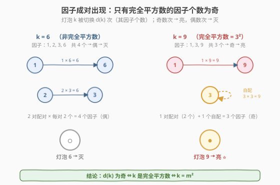
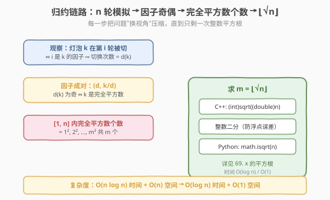
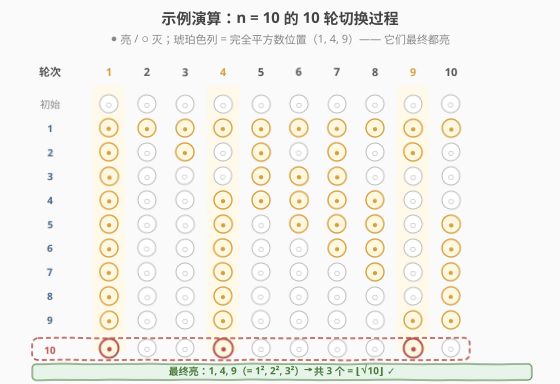

# 灯泡开关

- **题目名称**：灯泡开关
- **链接**：[319. 灯泡开关](https://leetcode.cn/problems/bulb-switcher/)
- **难度**：中等
- **标签**：数学、数论、脑筋急转弯

## 1. 题目概述

房间里有 `n` 个灯泡，编号 `1..n`，初始全部**关闭**。进行 `n` 轮操作：

- 第 `1` 轮：切换每个灯泡（全部打开）。
- 第 `2` 轮：每 `2` 个灯泡切换一次（即第 2、4、6…个）。
- 第 `i` 轮：每 `i` 个灯泡切换一次。
- 第 `n` 轮：只切换最后一个灯泡（第 `n` 个）。

"切换"指开变关、关变开。返回 `n` 轮后**亮着的灯泡数量**。

**示例 1**：

```text
输入：n = 3
输出：1
解释：
  初始：        [关, 关, 关]
  第 1 轮（切 1,2,3）：[开, 开, 开]
  第 2 轮（切 2）：    [开, 关, 开]
  第 3 轮（切 3）：    [开, 关, 关]
  → 仅灯泡 1 亮着，答案 1。
```

**示例 2**：

```text
输入：n = 0
输出：0
```

**示例 3**：

```text
输入：n = 1
输出：1
```

**约束条件**：

- `0 <= n <= 2^31 - 1`

> 💡 这是一道经典的**数学脑筋急转弯**题。`n` 可达 $2^{31}-1 \approx 2.1 \times 10^9$，任何"模拟切换"的做法都会爆时间爆内存。必须从**因子个数的奇偶性**入手，把问题归约为"求 `[1, n]` 内的完全平方数个数"，最终答案即 $\lfloor \sqrt n \rfloor$。

---

## 2. 解题思路

### 2.1 暴力思路：模拟 n 轮切换

最直觉的做法：开一个长度 `n` 的布尔数组 `bulb[1..n]` 初值 `false`，对 `i = 1..n` 依次把下标为 `i, 2i, 3i, …` 的灯泡翻转，最后统计 `true` 的个数。

```text
bulb = [false] * (n + 1)
for i in 1..n:
    for j in i, 2*i, 3*i, ..., n:   # 步长 i
        bulb[j] = !bulb[j]
return count(bulb == true)
```

时间复杂度是 $\sum_{i=1}^{n} \frac{n}{i} = O(n \log n)$（调和级数），空间 $O(n)$。当 $n = 2^{31}-1$ 时操作量约 $4.6 \times 10^{10}$、内存约 256 MB，必然超时超内存。

> ⚠️ 暴力法的瓶颈在于"逐个模拟开关动作"。换视角：不必关心过程，只问**灯泡 `k` 最终亮/灭取决于什么**——从"过程模拟"切换到"结果判定"。

### 2.2 核心观察：灯泡亮灭 = 因子个数的奇偶性



**关键一步**：灯泡 `k` 在第 `i` 轮被切换，当且仅当 `i` 是 `k` 的因子（即 $i \mid k$）。所以：

- 灯泡 `k` 一共被切换的次数 = **`k` 的正因子个数** $d(k)$。
- 灯泡 `k` 最终**亮着** $\iff$ 它被切换了**奇数次** $\iff$ $d(k)$ 是**奇数**。

那么：哪些数的因子个数是奇数？

**因子成对原理**：对任意 `k`，它的因子可两两配对成 $(d, k/d)$——比如 `k=12` 的因子 `1,2,3,4,6,12` 配成 `(1,12)、(2,6)、(3,4)` 三对。配对中两个数**相等**（$d = k/d$，即 $d^2 = k$）当且仅当 `k` 是**完全平方数**。此时这对"自配"只贡献一个因子，使总数为奇数。

| `k` | 因子 | 配对 | $d(k)$ | 奇偶 | 最终 |
|-----|------|------|--------|------|------|
| 6 | 1, 2, 3, 6 | (1,6)、(2,3) | 4 | 偶 | 灭 |
| 10 | 1, 2, 5, 10 | (1,10)、(2,5) | 4 | 偶 | 灭 |
| 12 | 1, 2, 3, 4, 6, 12 | (1,12)、(2,6)、(3,4) | 6 | 偶 | 灭 |
| 9 | 1, 3, 9 | (1,9)、(3,3) | 3 | **奇** | **亮** |
| 16 | 1, 2, 4, 8, 16 | (1,16)、(2,8)、(4,4) | 5 | **奇** | **亮** |

**结论**：$d(k)$ 为奇 $\iff$ $k$ 是完全平方数。于是题目等价于：

$$\text{亮着的灯泡数} = \left|\{\, k \in [1, n] : k \text{ 是完全平方数} \,\}\right| = \lfloor \sqrt n \rfloor$$

> 💡 **从"模拟过程"到"判定结果"的视角转换**是本题灵魂。一旦意识到"灯泡 `k` 的最终状态只取决于 $d(k)$ 的奇偶"，整个 $O(n \log n)$ 的模拟就被一个 $O(1)$ 的数学公式替代——这正是数论题常见的"降维打击"。

### 2.3 算法流程图



归约链路：

1. 灯泡 `k` 最终亮 $\iff$ $d(k)$ 为奇数。
2. $d(k)$ 为奇 $\iff$ $k$ 是完全平方数。
3. `[1, n]` 内完全平方数恰为 $1^2, 2^2, \dots, \lfloor\sqrt n\rfloor^2$，共 $\lfloor \sqrt n \rfloor$ 个。
4. 求 $\lfloor \sqrt n \rfloor$：库函数 `sqrt` 或整数二分 / 牛顿迭代（见 [69. x 的平方根](../0001-0100/69_x的平方根.md)）。

> ⚠️ $n$ 可达 $2^{31}-1$，`sqrt((double)n)` 在 `double` 53 位尾数下精度足够，但为避免浮点误差把"刚好是完全平方数"的边界算错，**推荐用整数二分**做防御性实现。

### 2.4 示例演算



以 `n = 10` 为例，跟踪每轮后灯泡状态（`●` 亮、`○` 灭）：

| 轮次 | 切换的灯泡 | 状态（灯泡 1..10） | 亮的灯泡 |
|------|-----------|-------------------|----------|
| 初始 | — | ○○○○○○○○○○ | — |
| 1 | 1,2,…,10 | ●●●●●●●●●● | 全部 |
| 2 | 2,4,6,8,10 | ●○●○●○●○●○ | 1,3,5,7,9 |
| 3 | 3,6,9 | ●○○○●●●○○○ | 1,5,6,7 |
| 4 | 4,8 | ●○○●●●●●○○ | 1,4,5,6,7,8 |
| 5 | 5,10 | ●○○●○●●●○● | 1,4,6,7,8,10 |
| 6 | 6 | ●○○●○○●●○● | 1,4,7,8,10 |
| 7 | 7 | ●○○●○○○●○● | 1,4,8,10 |
| 8 | 8 | ●○○●○○○○○● | 1,4,10 |
| 9 | 9 | ●○○●○○○○●● | 1,4,9,10 |
| 10 | 10 | ●○○●○○○○●○ | **1, 4, 9** |

最终亮着的灯泡是 `1, 4, 9`，共 `3` 个 ⭐。验证公式：$\lfloor \sqrt{10} \rfloor = 3$ ✓。

注意 `1=1²、4=2²、9=3²` 恰好是 `[1, 10]` 内的全部完全平方数——这正是核心观察的直接体现。

---

## 3. 参考代码

### C++（库函数 sqrt）

```cpp
class Solution {
  public:
    int bulbSwitch(int n) {
        return (int)std::sqrt((double)n);
    }
};
```

### C++（整数二分，防浮点误差）

```cpp
class Solution {
  public:
    int bulbSwitch(int n) {
        long long lo = 0, hi = (long long)n;
        while (lo <= hi) {
            long long mid = lo + (hi - lo) / 2;
            if (mid * mid <= n) lo = mid + 1;   // mid² ≤ n，答案至少为 mid
            else hi = mid - 1;                  // mid 太大
        }
        return (int)hi;   // hi 是满足 hi*hi ≤ n 的最大整数
    }
};
```

### Python

```python
import math

class Solution:
    def bulbSwitch(self, n: int) -> int:
        return math.isqrt(n)   # Python 3.8+，整数平方根，无浮点误差
```

> 💡 **为什么用 `math.isqrt` 而非 `int(math.sqrt(n))`？** `math.sqrt` 返回浮点数，对超大 `n` 存在精度隐患；`math.isqrt` 是 Python 3.8 引入的**纯整数平方根**，直接返回 $\lfloor \sqrt n \rfloor$，对任意大整数都精确。

---

## 4. 复杂度分析

| 维度 | 复杂度 | 说明 |
|------|--------|------|
| 时间复杂度 | $O(\log n)$ | 整数二分求 $\lfloor\sqrt n\rfloor$，迭代 $\log_2 n$ 次；若用库函数 `sqrt` 则 $O(1)$ |
| 空间复杂度 | $O(1)$ | 仅用常数变量 |

> 💡 相比暴力的 $O(n \log n)$ 时间 + $O(n)$ 空间，数学归约带来**指数级降本**——`n = 2^31-1` 时二分仅约 31 次比较。这正是"先想清楚再写代码"的价值。

---

## 5. 扩展：因子个数函数 $d(k)$ 与积性函数

本题本质是研究**因子个数函数** $d(k)$（也叫 $\tau(k)$）的奇偶性。$d(k)$ 是一个**积性函数**：对互质的 $a, b$，$d(ab) = d(a) \cdot d(b)$。由唯一分解定理 $k = p_1^{a_1} p_2^{a_2} \cdots p_m^{a_m}$，可得：

$$d(k) = (a_1 + 1)(a_2 + 1) \cdots (a_m + 1)$$

$d(k)$ 为奇 $\iff$ 每个 $a_i + 1$ 都是奇 $\iff$ 每个 $a_i$ 都是偶 $\iff$ $k$ 是完全平方数。这是核心观察的另一种（更代数化）证明，与"因子配对"的直观论证殊途同归。

**变体题**：若把规则改为"第 `i` 轮只切换第 `p_i` 个灯泡"（`p_i` 为第 `i` 个质数），则灯泡 `k` 被切换次数 = `k` 的**质因子个数**（计重数），亮灯条件变为"质因数指数之和为奇"——可联想 [204 计数质数](../0201-0300/204_计数质数.md) 的筛法预处理。

---

## 6. 面试要点

1. **为什么灯泡 `k` 最终是否亮取决于因子个数的奇偶？**

   - 灯泡 `k` 在第 `i` 轮被切换 $\iff$ $i \mid k$。所以 `k` 被切换的总次数 = $d(k)$（`k` 的正因子个数）。奇数次切换 = 亮，偶数次 = 灭。

2. **为什么只有完全平方数的因子个数是奇数？**

   - 因子可配对成 $(d, k/d)$。配对中两数相等 $\iff$ $d = k/d \iff k = d^2$。此时这对"自配"只算一个因子，使总数变奇；非完全平方数的因子全部两两配对，总数为偶。

3. **为什么答案直接是 $\lfloor \sqrt n \rfloor$？**

   - `[1, n]` 内的完全平方数恰为 $1^2, 2^2, \dots, m^2$，其中 $m$ 满足 $m^2 \le n < (m+1)^2$，即 $m = \lfloor \sqrt n \rfloor$。共 `m` 个。

4. **`int(sqrt(n))` 在大 `n` 下会出错吗？怎么写更稳？**

   - $n \le 2^{31}-1$ 时 `double` 的 53 位尾数足以精确表示 `n` 和 `sqrt(n)` 的整数部分，绝大多数情况下 `(int)sqrt((double)n)` 正确。但浮点实现可能对**刚好是完全平方数**的边界（如 $n = 2147395600 = 46340^2$）返回 $46339$，建议用**整数二分**或 Python 的 `math.isqrt` 做防御性实现。

5. **如果题目改成"只切换前 `m` 轮"而非 `n` 轮，怎么做？**

   - 灯泡 `k` 被切换次数 = `k` 的不超过 `m` 的因子个数。亮 $\iff$ 该数为奇。没有闭式公式，但可对每个 `k` 用 $O(\sqrt k)$ 数因子，总复杂度 $O(n \sqrt n)$；或离线筛因子。这是 319 的**非平凡变体**，面试中常作为追问。

---

## 7. 同类练习题

- [69. x 的平方根](https://leetcode.cn/problems/sqrtx/)（[站内题解](../0001-0100/69_x的平方根.md)）：求 $\lfloor\sqrt n\rfloor$ 的母题，319 归约后的最后一步
- [172. 阶乘后的零](https://leetcode.cn/problems/factorial-trailing-zeroes/)：数论归约题，把"末尾零个数"归约到"因子 5 的个数"，与本题"亮灯数→完全平方数个数"思路同构
- [204. 计数质数](https://leetcode.cn/problems/count-primes/)（[站内题解](../0201-0300/204_计数质数.md)）：数论筛法题，因子分解的兄弟应用
- [29. 两数相除](https://leetcode.cn/problems/divide-two-integers/)（[站内题解](../0001-0100/29_两数相除.md)）：用位运算/二分把"除法"归约到"减法"，同样体现"换视角降复杂度"
- [877. 石子游戏](https://leetcode.cn/problems/stone-game/)（[站内题解](../0801-0900/877_石子游戏.md)）：博弈题中"看似要模拟、实则数学公式秒杀"的同类脑筋急转弯
