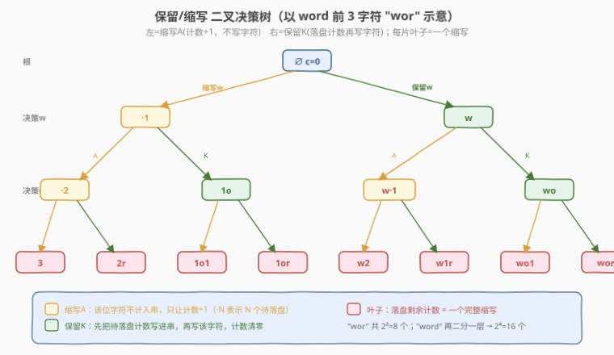
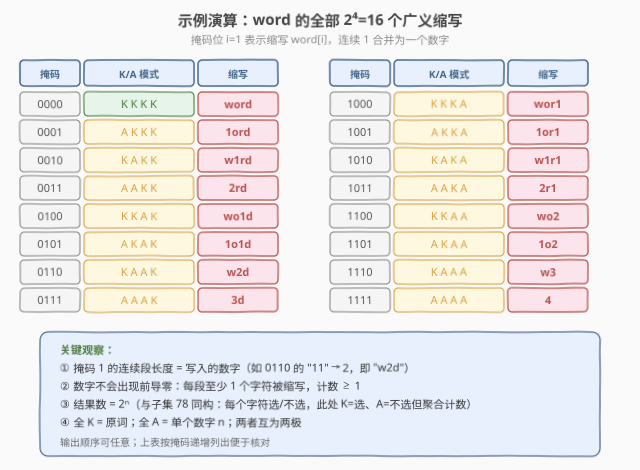

# 列举单词的全部缩写

- **题目名称**：列举单词的全部缩写
- **链接**：[320. 列举单词的全部缩写](https://leetcode.cn/problems/generalized-abbreviation/)
- **难度**：中等
- **标签**：位运算、字符串、回溯

## 1. 题目概述

给定一个单词 `word`，返回它的**所有广义缩写**。广义缩写的构造规则是：把单词中**任意若干个互不重叠的子串**替换为**该子串的长度**（数字），剩余字符原样保留。要求：

- 被替换的子串可以是任意长度（包括整个单词）；
- **数字不能有前导零**（例如不能把 `"word"` 缩写成 `"03d"`，但 `"3d"` 合法）；
- 两个数字**不能相邻**（因为相邻会被合并成一个更大的数字，本质就是同一连续段的一次替换）。

> ⚠️ 本题为 LeetCode **会员锁题**。题面要求实现 `generateAbbreviations(word: str) -> List[str]`，返回所有合法缩写，顺序不限。

**示例 1**：

```text
输入：word = "word"
输出：["word","1ord","w1rd","wo1d","wor1","2rd","w2d","wo2",
       "1o1d","1or1","w1r1","1o2","2r1","3d","w3","4"]
```

解释：长度为 4 的 `"word"` 共有 `2^4 = 16` 个广义缩写。两个极端是「全保留」`"word"` 和「全缩写」`"4"`。

**示例 2**：

```text
输入：word = "a"
输出：["a","1"]
```

**约束条件**：

- `1 <= word.length <= 15`
- `word` 由小写英文字母组成

> 💡 这是 **"选/不选"二叉决策树** 的招牌题，与 [78. 子集](../0001-0100/78_子集.md) 同构。区别在于：子集里"不选"的元素直接丢弃；本题里"不选"（即缩写）的字符**并非消失，而是被累计成一个数字**——连续若干个"缩写"决策会**合并成同一个长度数字**。这个"计数落盘"机制是本题相对于子集的唯一新增点。

---

## 2. 解题思路

### 2.1 暴力思路：枚举所有替换方案再过滤

最朴素的联想是：对长度为 `n` 的单词，枚举所有"切分位置"的子集（在 `n-1` 个间隔里选若干切开），每段决定保留或替换……但这种切分视角既会重复计数（同一段可有不同切法），又难以天然避免"前导零/相邻数字"。

> ⚠️ 切分视角的坑：它把"连续缩写段"和"切分边界"混为一谈——实际上一个数字代表的是**一整段连续被缩写的字符**，无需在段内再切分。正确的视角应当是**逐字符决策**，让"连续缩写"自然涌现为同一段。

### 2.2 核心观察：逐字符「保留 K / 缩写 A」二叉决策

关键直觉：**把"构造一个缩写"看作对每个字符做一次"保留 / 缩写"决策**。

- **保留（Keep，记 K）**：把当前字符原样追加到结果串；
- **缩写（Abbreviate，记 A）**：不写字符，只让一个**计数器 +1**，表示"末尾又攒了一个待落盘的字符"。

**落盘规则**：计数器里的字符何时变成数字？——每当遇到一个 K（保留）决策，或到达串末尾时，就把累计的计数 `cnt` 写成数字（若 `cnt > 0`），然后写该字符（如果是 K），并把 `cnt` 清零。这样**连续的 A 决策天然合并成同一个数字**，从根本上杜绝了"相邻数字"和"前导零"（`cnt` 至少为 1 才会落盘）。

`n` 个字符 → `n` 层决策 → 每层 2 个分支 → `2^n` 条根到叶子路径 → `2^n` 个缩写。



与子集 (78) 的对比：

| 维度 | 子集 (78) | 列举缩写 (320) |
|------|-----------|----------------|
| 决策内容 | 每个元素选还是不选 | 每个字符保留 K 还是缩写 A |
| 分支数 | 恒为 2 | 恒为 2 |
| "不选"的语义 | 元素直接丢弃 | 字符被**计数**，连续合并成一个数字 |
| 收集时机 | 每个节点（含内部） | **只在叶子**（决策完所有字符后落盘） |
| 结果数 | $2^n$ | $2^n$ |
| 剪枝需求 | 无 | 无 |

> 💡 **本题 vs 子集的根本差异**：子集不关心"被丢弃的元素之间的关系"；本题里"被缩写的字符"必须按连续段聚合成一个数字。所以子集在每个节点都能收集一个子集（半成品即合法），而本题必须等到叶子、把末尾的计数落盘后，才得到一个完整缩写——**只在叶子收集**。

#### 等价的另一种视角：位掩码枚举

`n` 个字符的"K/A"决策恰好编码为一个 `n` 位二进制数：第 `i` 位为 `1` 表示缩写 `word[i]`（A），`0` 表示保留（K）。枚举 `0` 到 `2^n - 1` 的每个掩码，**扫描时累计连续的 1**，遇到 0 就落盘计数并写字符，即可构造对应缩写。这与子集的位运算法完全同构。

### 2.3 算法流程图

![回溯流程：dfs(pos, path, cnt)，对 word[pos] 二选一](../images/genabbr_algorithm_flow.svg)

**回溯版完整步骤**（状态 `(pos, path, cnt)`）：

1. **终止条件**：`pos == n`（所有字符决策完毕）。把末尾剩余的 `cnt`（若 `> 0`）落盘为数字追加到 `path`，将 `path` 存入答案，`return`。
2. **分支 A（缩写 `word[pos]`）**：不修改 `path`，递归 `dfs(pos + 1, path, cnt + 1)`。
3. **分支 K（保留 `word[pos]`）**：先把 `cnt` 落盘（若 `> 0`，`path += str(cnt)`），再 `path += word[pos]`，递归 `dfs(pos + 1, path, 0)`；递归返回后**撤销**这两次追加，恢复 `path` 原长度。

> ⚠️ **撤销的细节**：分支 A 不改 `path`，无需撤销；分支 K 改了 `path`（追加数字串 + 字符），需要在递归后用 `path.resize(oldLen)`（C++）或对应 `pop` 次数（Python）精确还原。数字可能是多位（如 `cnt=12`），所以**记录旧长度**比"弹一次"更稳。

### 2.4 示例演算

以 `word = "word"` 为例，掩码从 `0000` 到 `1111` 共 16 种，每种对应一个缩写：



| 掩码 | K/A 模式 | 缩写 | 说明 |
|------|----------|------|------|
| `0000` | K K K K | `word` | 全保留，原词 |
| `0001` | A K K K | `1ord` | 缩 w |
| `0011` | A A K K | `2rd` | 缩 wo（连续 2 个 A 合并） |
| `0101` | A K A K | `1o1d` | 缩 w、缩 r，两段各 1 |
| `0111` | A A A K | `3d` | 缩 wor（连续 3 个 A 合并） |
| `1011` | A A K A | `2r1` | 缩 wo（2）、留 r、缩 d（1） |
| `1111` | A A A A | `4` | 全缩写，单个数字 n |

> 💡 **观察掩码的连续 1 段**：每段连续的 `1` 直接对应结果串里的一个数字，段长即数字值。`0` 的位置则原样保留对应字符。这就是"连续 A 合并为一个数字"的二进制体现，也是位运算法的实现依据。

---

## 3. 参考代码

### C++（回溯：逐字符 K/A 决策）

```cpp
// 320_列举单词的全部缩写.cpp —— 回溯：逐字符「保留K / 缩写A」二叉决策
// 编译: g++ -O2 -std=c++17 320_列举单词的全部缩写.cpp -o genabbr
#include <string>
#include <vector>
using namespace std;

class Solution {
  public:
    vector<string> generateAbbreviations(string word) {
        vector<string> ans;
        string path;
        dfs(word, 0, 0, path, ans);
        return ans;
    }

  private:
    // pos: 当前决策到 word[pos]；cnt: 末尾连续缩写了多少个字符（尚未落盘）
    void dfs(const string& word, int pos, int cnt,
             string& path, vector<string>& ans) {
        int n = (int)word.size();
        if (pos == n) {
            // 落盘末尾剩余计数
            string tmp = path;
            if (cnt > 0) tmp += to_string(cnt);
            ans.push_back(tmp);
            return;
        }
        // 分支 A：缩写 word[pos]（计数 +1，不写字符）
        dfs(word, pos + 1, cnt + 1, path, ans);
        // 分支 K：保留 word[pos]（先落盘计数，再写字符）
        int oldLen = (int)path.size();
        if (cnt > 0) path += to_string(cnt);
        path.push_back(word[pos]);
        dfs(word, pos + 1, 0, path, ans);
        path.resize(oldLen); // 撤销：还原 path 长度
    }
};
```

**位掩码枚举版（等价，无递归）**：

```cpp
class Solution {
  public:
    vector<string> generateAbbreviations(string word) {
        int n = (int)word.size();
        vector<string> ans;
        for (int mask = 0; mask < (1 << n); mask++) {
            string s;
            int cnt = 0;
            for (int i = 0; i < n; i++) {
                if (mask >> i & 1) {
                    cnt++;               // 缩写 word[i]
                } else {
                    if (cnt > 0) { s += to_string(cnt); cnt = 0; }
                    s.push_back(word[i]); // 保留 word[i]
                }
            }
            if (cnt > 0) s += to_string(cnt); // 末尾落盘
            ans.push_back(s);
        }
        return ans;
    }
};
```

### Python

```python
class Solution:
    def generateAbbreviations(self, word: str) -> list[str]:
        ans: list[str] = []
        n = len(word)

        def dfs(pos: int, path: list[str], cnt: int) -> None:
            if pos == n:
                if cnt > 0:
                    path.append(str(cnt))   # 末尾落盘
                ans.append("".join(path))
                if cnt > 0:
                    path.pop()               # 撤销末尾落盘
                return
            # 分支 A：缩写 word[pos]
            dfs(pos + 1, path, cnt + 1)
            # 分支 K：保留 word[pos]，先落盘计数
            appended = 0
            if cnt > 0:
                path.append(str(cnt))
                appended += 1
            path.append(word[pos])
            appended += 1
            dfs(pos + 1, path, 0)
            for _ in range(appended):        # 撤销：弹出本次追加的所有片段
                path.pop()

        dfs(0, [], 0)
        return ans
```

**位掩码版**：

```python
class Solution:
    def generateAbbreviations(self, word: str) -> list[str]:
        n = len(word)
        ans = []
        for mask in range(1 << n):
            s: list[str] = []
            cnt = 0
            for i in range(n):
                if mask >> i & 1:
                    cnt += 1
                else:
                    if cnt > 0:
                        s.append(str(cnt))
                        cnt = 0
                    s.append(word[i])
            if cnt > 0:
                s.append(str(cnt))
            ans.append("".join(s))
        return ans
```

> ⚠️ **Python 回溯版的撤销要点**：`cnt` 落盘时追加的是 `str(cnt)`，可能是多位字符串（如 `"12"`），但它作为一个 `list` 元素整体压入，`pop()` 一次即可弹掉；字符也是一个元素。所以用 `appended` 计数器记录本次压入了几次（0、1 或 2），递归后弹相应次数即可。若把 `path` 写成 `str` 拼接，多位数字的撤销就要靠记录旧长度——这正是 C++ 版用 `resize(oldLen)` 的原因。

---

## 4. 复杂度分析

| 维度 | 回溯 | 位掩码枚举 |
|------|------|-----------|
| **时间复杂度** | $O(n \cdot 2^n)$ | $O(n \cdot 2^n)$ |
| **空间复杂度** | $O(n)$（递归栈 + path，不计结果） | $O(n)$（构造临时串） |
| **结果数** | $2^n$ | $2^n$ |
| **代码量** | 中 | 短 |
| **可剪枝性** | 可（若加约束，如"最多缩写 k 段"） | 否 |

> ⚠️ 时间 $O(n \cdot 2^n)$ 的来源：共 $2^n$ 个缩写，每个构造/拷贝需 $O(n)$。这是**本题的理论下界**——答案本身就有 $2^n$ 个、每个长度可达 $n$，无法更快。空间 $O(n)$ 指递归深度（最大 $n$ 层），结果数组 $O(n \cdot 2^n)$ 不计入。`n ≤ 15` 时 $2^{15} = 32768$，完全可接受。

---

## 5. 扩展：与子集族问题的统一视角

### 5.1 「选/不选」决策树的三姐妹

| 题号 | 题目 | "不选"的语义 | 收集时机 | 结果数 |
|------|------|-------------|----------|--------|
| 78 | 子集 | 元素直接丢弃 | 每个节点 | $2^n$ |
| 320 | 列举单词的全部缩写 | 字符被计数、连续合并成数字 | 只在叶子 | $2^n$ |
| 401 | 二进制手表 | 亮灯位置枚举（组合数 $\binom{n}{k}$） | 只在叶子 | $\binom{n}{k}$ |

三者底层都是"对每个槽位做二选一决策"，差异仅在于**如何把决策序列编码成结果**。子集直接取"被选的元素集合"；320 把"被缩写的位置"按连续段聚合成数字；401 在固定亮灯数 `k` 下枚举组合。掌握这个统一框架，遇到任何"逐位二选一"的枚举题都能迅速建模。

### 5.2 位掩码：二叉决策的扁平编码

`n` 位二进制数 ↔ `n` 层二叉决策树的一条根到叶子路径。第 `i` 位为 `1`/`0` 对应"在第 `i` 层走 A/K 分支"。本题位掩码版的 `cnt` 累计的就是"当前连续 1 段的长度"——遇到 `0`（K）就落盘，这和回溯版"遇到 K 就把 `cnt` 写出"完全一致。**位掩码不是另一种算法，而是同一决策树的非递归遍历**。

### 5.3 变体提示

- **要求缩写中数字不超过 k 个**：回溯时多传一个"已落盘数字数"参数，超限即剪枝；
- **要求字典序最小的缩写**：在叶子收集时维护最小值，或按"先 K 后 A"的分支顺序保证 DFS 首个结果即字典序最小（全保留 = 原词，字典序最小）；
- **大词性能**：`n > 20` 时 $2^n$ 爆炸，需改为"按段长 DP"或改问"是否存在合法缩写满足某条件"等判定型问题。

> 💡 **一句话总结**：320 是"选/不选二叉决策树"在字符串缩写场景的应用——每个字符 K/A 二选一，连续 A 合并为一个数字，只在叶子落盘收集。与子集 (78) 仅差一个"计数落盘"机制，结果数同为 $2^n$，时间是理论下界 $O(n \cdot 2^n)$。

---

## 6. 面试要点

1. **广义缩写为什么恰好有 $2^n$ 个？**

   - 每个字符有且仅有"保留 / 缩写"两种选择，`n` 个字符的决策序列总数为 $2^n$。
   - 关键是"连续缩写会合并成一个数字"——这只影响**结果的字符串形态**，不改变决策序列数：任何一条 K/A 序列都唯一对应一个合法缩写（合并连续 A 段），且不同序列对应不同缩写（保留的字符位置不同）。所以是双射，结果数恰为 $2^n$。

2. **为什么"只在叶子收集"，而不能像子集那样在每个节点收集？**

   - 子集的半成品（任意一些元素）本身就是合法子集；而缩写的半成品可能末尾带一个**尚未落盘的计数** `cnt`，它只有在 K 决策或串末尾才会变成数字。若在内部节点收集，会得到一个"末尾悬空计数"的不完整串，并非合法缩写。
   - 解决办法有二：① 只在叶子收集，叶子处强制落盘 `cnt`；② 在状态里把 `cnt` 显式维护（不写进 `path`），收集时再落盘。两者等价，本文采用 ①。

3. **回溯版如何正确撤销 `path`？数字可能是多位的怎么办？**

   - C++：进入分支 K 前记录 `oldLen = path.size()`，递归后 `path.resize(oldLen)`。无论落盘了几个字符的数字串 + 一个字母，都能一次性还原。
   - Python：把 `path` 维护为 `list[str]`，每次追加一个**片段**（数字串或单字符）作为一个元素，用计数器 `appended` 记录本次压入了几次，递归后弹相应次数。避免直接用 `str` 拼接导致多位数字难以撤销。
   - 分支 A 不修改 `path`，无需撤销。

4. **位掩码法和回溯法时间复杂度相同，该写哪个？**

   - 渐近复杂度都是 $O(n \cdot 2^n)$（下界）。位掩码版代码短、无递归开销，且**直接体现"连续 1 段 = 一个数字"的几何直觉**，纯枚举题优先。
   - 回溯版**可剪枝**：若追加约束（如"最多 k 个数字""数字总和不超过 S"），回溯能在分支处提前 return，位掩码做不到。
   - 面试策略：先讲二叉决策树说清本质，再写位掩码版展示编码直觉，最后提一句回溯版以便应对变体追问。

5. **为什么不会出现前导零（如 `"03d"`）？**

   - 数字只来自"连续 A 段的长度"，段长至少为 1（至少缩写了 1 个字符才会产生数字）。我们只在 `cnt > 0` 时落盘，且 `cnt` 是真实字符计数，不涉及补零。
   - 位掩码版同理：`cnt` 累加的是真实的 `1` 的个数，遇 `0` 才落盘，落盘值 $\geq 1$，无前导零问题。

> 💡 **一句话总结**：320 与 78 子集同构——逐字符 K/A 二选一，连续 A 合并为数字，只在叶子落盘收集，结果 $2^n$ 个，时间 $O(n \cdot 2^n)$ 为下界。回溯版可剪枝、位掩码版最简，两者通过"决策树 ↔ 二进制数"的映射统一。

---

## 7. 同类练习题

- [78. 子集](https://leetcode.cn/problems/subsets/)（[题解](../0001-0100/78_子集.md)）：同构的"选/不选"二叉决策树母题，对照"每个节点收集"与"只在叶子收集"的差异
- [401. 二进制手表](https://leetcode.cn/problems/binary-watch/)：固定亮灯数 k 的组合枚举，位掩码 + popcount 的另一应用
- [288. 单词的唯一缩写](https://leetcode.cn/problems/unique-word-abbreviation/)（[题解](../0201-0300/288_单词的唯一缩写.md)）：缩写规则的另一面——给定单词求其**唯一**缩写（首字母+中间长度+尾字母），与本题"枚举所有缩写"互补
- [408. 有效单词缩写](https://leetcode.cn/problems/valid-word-abbreviation/)：判定一个缩写串是否匹配某单词，双指针校验数字与字符
- [46. 全排列](https://leetcode.cn/problems/permutations/)（[题解](../0001-0100/46_全排列.md)）：对照"循环枚举候选"的多叉决策树，理解为何子集/缩写用二叉树而排列用多叉树
