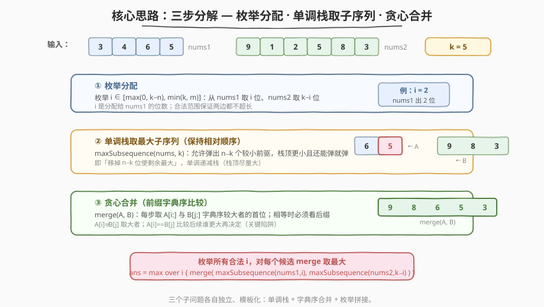
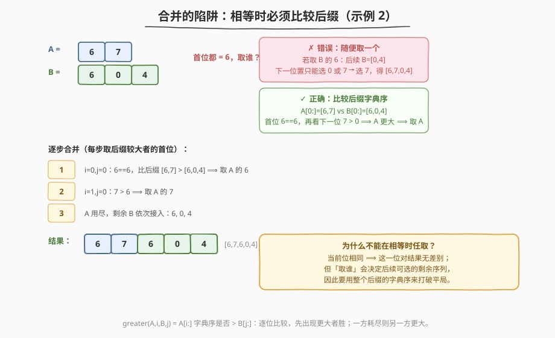
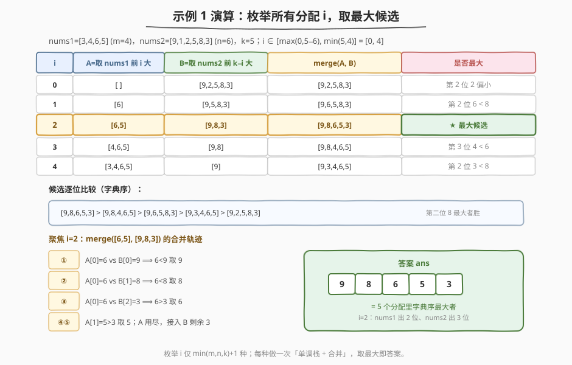

# LeetCode 拼接最大数 题解

## 1. 题目概述

- **标题 / 题号**：拼接最大数（#321，hard）
- **链接**：https://leetcode.cn/problems/create-maximum-number/
- **难度**：困难
- **标签**：单调栈、贪心、数组、分治

**题意**：给你两个整数数组 `nums1`、`nums2`（长度分别为 `m`、`n`）和一个整数 `k`（$1 \le k \le m+n$）。请利用这两个数组中的数字**拼接**出一个长度为 `k` 的最大数。要求：**同一数组中数字的相对顺序必须保持不变**。返回代表答案的长度为 `k` 的数组。

**示例 1**：

```text
输入：nums1 = [3,4,6,5], nums2 = [9,1,2,5,8,3], k = 5
输出：[9,8,6,5,3]
解释：从 nums1 取 [6,5]，从 nums2 取 [9,8,3]，合并为 [9,8,6,5,3]。
```

**示例 2**：

```text
输入：nums1 = [6,7], nums2 = [6,0,4], k = 5
输出：[6,7,6,0,4]
解释：两数组全部用上；合并时首位都是 6，需比较后缀决定取谁。
```

**示例 3**：

```text
输入：nums1 = [3,9], nums2 = [8,9], k = 3
输出：[9,8,9]
解释：从 nums1 取 [9]，从 nums2 取 [8,9]，合并为 [9,8,9]。
```

**约束**：

- $1 \le m, n \le 500$
- $0 \le \text{nums1[i]}, \text{nums2[i]} \le 9$
- $1 \le k \le m + n$
- `nums1` 和 `nums2` 没有前导 0

> 💡 这是一道"三合一"的困难题：**枚举分配 + 单调栈取最大子序列 + 字典序合并**。三个子问题各自都是经典模板，组合起来就成了 321。会做 [402. 移掉 K 位数字](https://leetcode.cn/problems/remove-k-digits/) 和 [316. 去除重复字母](https://leetcode.cn/problems/remove-duplicate-letters/) 的单调栈，本题就啃下一半；剩下的一半在「合并时相等怎么办」这个陷阱里。

## 2. 解题思路

### 2.1 暴力思路：枚举所有交错

最朴素的想法：从 `nums1` 选一个保序子序列、从 `nums2` 选一个保序子序列，二者长度和为 `k`，再枚举所有合法的"交错方式"拼成长度为 `k` 的序列，取字典序最大者。但子序列选择有 $\binom{m}{i}\binom{n}{k-i}$ 种、交错有 $\binom{k}{i}$ 种，组合数爆炸，$m,n=500$ 完全不可行。

> ⚠️ 暴力的核心痛点有两个：① 子序列选法太多；② 即便选定了两段子序列，交错方式仍然太多。要砍掉这两层冗余，需要两个贪心：**每段内部用单调栈选最大子序列**（局部最优即全局最优，因为段内顺序固定、只看选哪些位），**段间用字典序贪心合并**（每步取后缀较大者的首位）。

### 2.2 核心观察：三步分解



把问题拆成三个**独立、可模板化**的子问题：

1. **枚举分配**：设从 `nums1` 取 `i` 位、从 `nums2` 取 `k-i` 位。`i` 的合法范围是 $\big[\max(0, k-n),\ \min(k, m)\big]$——下界保证 `nums2` 够长，上界保证 `nums1` 够长。枚举这区间内每个 `i`，对每个 `i` 求一个候选，最后取所有候选的最大值。

2. **单调栈取最大子序列** `maxSubsequence(nums, k)`：在保持相对顺序的前提下，从 `nums` 中选 `k` 位使字典序最大。等价于「移掉 `n-k` 位使剩余最大」——**单调递减栈**（栈顶尽量大）：遍历每个数字 `x`，当栈非空、还能弹（已弹数 `< n-k`）、且 `栈顶 < x` 时弹栈，最后把 `x` 入栈。栈中元素即所求（栈天然保序）。这与 [402. 移掉 K 位数字](https://leetcode.cn/problems/remove-k-digits/) 是同一模板，只是 402 求最小用递增栈、本题求最大用递减栈。

3. **贪心合并** `merge(A, B)`：把两个保序子序列合成字典序最大的长度 `k` 序列。每步在 `A[i]`、`B[j]` 中选一个接上：若 `A[i] ≠ B[j]` 取大者；**若相等**，必须比较 `A[i:]` 与 `B[j:]` 的字典序，从更大的一方取首位（详见 2.3）。

> ⚠️ 三个子问题为什么可以独立最优？因为「分配长度 `i`」一旦固定，`nums1` 这 `i` 位怎么选**只影响 A 自身字典序**，与 B 无关——A 越大，merge 出的结果不会更差（合并是逐位取大）。同理 B。所以每段独立取最大子序列是正确的贪心。

### 2.3 合并的陷阱：相等时比较后缀



合并时最容易踩的坑：当 `A[i] == B[j]`，**不能随便取一个**。当前位相同，这一位对结果无差别，但「取谁」会决定后续可选的剩余序列。看示例 2：`A=[6,7]`、`B=[6,0,4]`，首位都为 6。

- 若取 `B` 的 6：下一步在 `A=[6,7]` 与 `B=[0,4]` 中选，首位 6 > 0 取 6，再取 7、0、4 → `[6,6,7,0,4]`；
- 若取 `A` 的 6：下一步在 `A=[7]` 与 `B=[6,0,4]` 中选，首位 7 > 6 取 7，再取 6,0,4 → `[6,7,6,0,4]`。

后者字典序更大（第二位 7 > 6）。正确做法：比较整个后缀 `A[i:]` 与 `B[j:]` 的字典序，从更大的一方取首位。等价地，写一个 `greater(A, i, B, j)` 判定 `A[i:]` 是否字典序大于 `B[j:]`：

- 逐位比较，先出现更大者胜；
- 一方先耗尽，则另一方更大（剩余长的更大）；
- 完全相等则任取（返回 false 取 B 即可）。

> 💡 **直观记忆**：合并像「两个字典里翻到同一页，要比下一页谁厚」。当前页一样，就看后面谁先出现更大的数字；如果一方直接翻完了，那另一方"还有货"自然更大。

### 2.4 示例演算

以示例 1 为例：`nums1=[3,4,6,5]`（m=4）、`nums2=[9,1,2,5,8,3]`（n=6）、`k=5`。`i` 的范围是 $[\max(0,5-6), \min(5,4)] = [0, 4]$，共 5 种分配。



逐 `i` 求候选：

| i | A=maxSubsequence(nums1, i) | B=maxSubsequence(nums2, 5−i) | merge(A, B) | 备注 |
|---|---|---|---|---|
| 0 | `[]` | `[9,2,5,8,3]` | `[9,2,5,8,3]` | 第 2 位 2 偏小 |
| 1 | `[6]` | `[9,5,8,3]` | `[9,6,5,8,3]` | 第 2 位 6 < 8 |
| **2** | **`[6,5]`** | **`[9,8,3]`** | **`[9,8,6,5,3]`** | **★ 最大候选** |
| 3 | `[4,6,5]` | `[9,8]` | `[9,8,4,6,5]` | 第 3 位 4 < 6 |
| 4 | `[3,4,6,5]` | `[9]` | `[9,3,4,6,5]` | 第 2 位 3 < 8 |

5 个候选按字典序排序：`[9,8,6,5,3] > [9,8,4,6,5] > [9,6,5,8,3] > [9,3,4,6,5] > [9,2,5,8,3]`。最大者 `[9,8,6,5,3]` 即答案 ✓。

> ⚠️ **观察**：`i=2` 之所以胜出，是因为它让 `nums2` 贡献了 `[9,8]` 两位大数（而非被 `i=3,4` 挤占），同时 `nums1` 贡献的 `[6,5]` 在合并第三位时压过了 `nums2` 的 `3`。分配的本质是**在两个数组间平衡"大数密度"**——枚举所有合法 `i` 正是为了不漏掉这个最优点。

## 3. 参考代码

### C++（枚举 + 单调栈 + 字典序合并）

```cpp
class Solution {
  public:
    // 取 nums 中长度为 k 的最大子序列（保序），单调递减栈
    vector<int> maxSubsequence(vector<int>& nums, int k) {
        int n = nums.size();
        int toPop = n - k;                 // 最多可弹 n-k 个
        vector<int> st;
        for (int x : nums) {
            while (toPop > 0 && !st.empty() && st.back() < x) {
                st.pop_back();
                --toPop;
            }
            st.push_back(x);
        }
        st.resize(k);                      // 可能没弹够，截到 k 位
        return st;
    }

    // 判断 A[i:] 是否字典序 > B[j:]（合并时挑较大者首位）
    bool greater(const vector<int>& A, int i, const vector<int>& B, int j) {
        int m = A.size(), n = B.size();
        while (i < m && j < n) {
            if (A[i] != B[j]) return A[i] > B[j];
            ++i; ++j;
        }
        return i < m;                      // A 还有剩余 ⟹ A 更大；都走完返回 false（相等任取）
    }

    // 贪心合并两段保序子序列为最大数
    vector<int> merge(const vector<int>& A, const vector<int>& B) {
        vector<int> res;
        int i = 0, j = 0, m = A.size(), n = B.size();
        while (i < m || j < n) {
            if (greater(A, i, B, j)) res.push_back(A[i++]);
            else                      res.push_back(B[j++]);
        }
        return res;
    }

    vector<int> maxNumber(vector<int>& nums1, vector<int>& nums2, int k) {
        int m = nums1.size(), n = nums2.size();
        vector<int> ans;
        for (int i = max(0, k - n); i <= min(k, m); ++i) {
            vector<int> A = maxSubsequence(nums1, i);
            vector<int> B = maxSubsequence(nums2, k - i);
            vector<int> cand = merge(A, B);
            if (ans.empty() || cand > ans) ans = cand;
        }
        return ans;
    }
};
```

### Python

```python
class Solution:
    def maxNumber(self, nums1: List[int], nums2: List[int], k: int) -> List[int]:
        def max_subsequence(nums, k):
            to_pop = len(nums) - k
            stack = []
            for x in nums:
                while to_pop > 0 and stack and stack[-1] < x:
                    stack.pop()
                    to_pop -= 1
                stack.append(x)
            return stack[:k]

        def greater(A, i, B, j):
            """A[i:] 是否字典序 > B[j:]"""
            la, lb = len(A), len(B)
            while i < la and j < lb:
                if A[i] != B[j]:
                    return A[i] > B[j]
                i += 1
                j += 1
            return i < la

        def merge(A, B):
            res = []
            i = j = 0
            while i < len(A) or j < len(B):
                if greater(A, i, B, j):
                    res.append(A[i]); i += 1
                else:
                    res.append(B[j]); j += 1
            return res

        m, n = len(nums1), len(nums2)
        ans = []
        for i in range(max(0, k - n), min(k, m) + 1):
            cand = merge(max_subsequence(nums1, i), max_subsequence(nums2, k - i))
            if cand > ans:
                ans = cand
        return ans
```

> 💡 Python 版若追求极简，`greater` 可用 `A[i:] > B[j:]`（列表原生字典序比较）一行替代，但每次切片 $O(k)$、最坏 $O(k^2)$；上文的索引版 `greater` 不创建新列表、同样 $O(k)$ 单次比较且常数更小。两种写法逻辑等价。

## 4. 复杂度分析

| 维度 | 复杂度 | 说明 |
|------|--------|------|
| 时间复杂度 | $O\big(k\,(m+n) + k^2\,s\big)$，$s = \min(m,n,k)+1$ | 枚举 $s$ 种分配；每次 `maxSubsequence` 共 $O(m+n)$（两段合计，单调栈摊还线性）；每次 `merge` 最坏 $O(k^2)$（每步 `greater` 比较最坏 $O(k)$，共 $k$ 步）。$m,n \le 500$、$k \le 1000$，实际运行很快 |
| 空间复杂度 | $O(k)$ | `maxSubsequence` 的栈、`merge` 的结果、候选 `cand`、`ans` 均不超过 $k$；不计输入与输出则 $O(k)$ 辅助空间 |

> ⚠️ `merge` 的 $O(k^2)$ 来自 `greater` 的后缀比较。最坏情形是 `A`、`B` 全等（每步比到尾），但 LeetCode 测试集非此类极端对抗；若要严格 $O(k)$ 合并，可用后缀数组/DC3 预处理 `A#B` 的 rank，但实现复杂度远超收益，面试不要求。

## 5. 扩展：合并的 $O(k)$ 优化思路

若追求理论最优，`merge` 可做到 $O(k)$：

1. 把 `A` 与 `B` 拼成 `S = A + [-1] + B`（`-1` 作分隔符，小于所有 0–9 数字）；
2. 对 `S` 构建后缀数组 `sa` 与 rank 表（DC3 算法 $O(|S|)$，或 SA-IS）；
3. 合并时 `greater(A, i, B, j)` 等价于比较 `S` 中从 `i` 起的后缀与从 `m+1+j` 起的后缀的 rank，$O(1)$ 比较；
4. 于是 `merge` 退化为 $O(k)$，总复杂度 $O(m+n + k\,s)$。

实操中后缀数组常数大、代码长，对本题 $k \le 1000$ 收益为负。**面试推荐 $O(k^2)$ 合并**：思路清晰、易写对、跑得够快。后缀数组版仅作为"知道上限在哪"的理论参考。

> 💡 还有一个工程小技巧：`greater` 比较时若 `A[i:]` 与 `B[j:]` 共享长公共前缀，可记录上次比较的进展做跳跃——但同样不建议在面试写，徒增出错面。

## 6. 面试要点

1. **为什么枚举 `i` 的范围是 `[max(0, k-n), min(k, m)]`？**
   - 从 `nums1` 取 `i` 位、`nums2` 取 `k-i` 位。`i ≤ m` 保证 `nums1` 够长；`k-i ≤ n` 即 `i ≥ k-n` 保证 `nums2` 够长；同时 `i ≥ 0`、`i ≤ k`。四者取交即 `[max(0, k-n), min(k, m)]`。少枚举一种分配就可能漏掉最优解。

2. **`maxSubsequence` 为什么用单调递减栈？和 402 的区别？**
   - 字典序比较从左到右，**靠前的位置越大整体越大**。维护递减栈（栈顶尽量大）=「只要能把小栈顶换成更大的当前值就换」。402 求"移掉 k 位后最小"用递增栈（栈顶尽量小）；本题求"留 k 位后最大"用递减栈。方向相反，模板同一。约束 `toPop = n-k` 控制"最多弹几个"，弹够即停。

3. **合并时 `A[i] == B[j]` 为什么不能任取？**
   - 当前位相同对结果无差别，但「取谁」决定后续可选的剩余序列。例 2 中 `A=[6,7]`、`B=[6,0,4]`，首位都 6：取 `A` 的后续是 `[7,6,0,4]`，取 `B` 的后续是 `[6,7,0,4]`，前者第二位 7 > 6 胜出。必须比较 `A[i:]` 与 `B[j:]` 整体字典序，从更大方取首位，才能保证后续位置尽量大。

4. **`greater` 函数中"一方先耗尽则另一方更大"为什么对？**
   - 若 `A[i:]` 是 `B[j:]` 的前缀（`A` 先走完），则 `B[j:]` 在相等前缀后还多出若干位——这些位 ≥ 0，使 `B[j:]` 字典序 ≥ `A[i:]`。当多出的位非空时 `B` 严格更大；完全相等时返回 false 取 B 不影响结果。这正是字典序的"短前缀更小"规则。

5. **本题和 [402. 移掉 K 位数字](https://leetcode.cn/problems/remove-k-digits/) / [316. 去除重复字母](https://leetcode.cn/problems/remove-duplicate-letters/) 的关系？**
   - 三题共享"单调栈 + 贪心"骨架。402 是单数组求最小（递增栈 + 删 k 个）；316 是单数组求最小且去重（递增栈 + `cnt` 安全弹栈 + `in_stack` 去重）；321 是双数组求最大（递减栈 + 字典序合并 + 枚举分配）。会 402/316 的栈模板，321 只需再啃"合并"这一新点。

## 同类练习题

| # | 题目 | 与本题的关联 |
|---|------|-------------|
| 402 | [移掉 K 位数字](https://leetcode.cn/problems/remove-k-digits/) | 单调栈求"移掉 k 位后最小"，与本题 `maxSubsequence` 同模板、方向相反（递增栈），巩固单调栈选子序列 |
| 316 | [去除重复字母](https://leetcode.cn/problems/remove-duplicate-letters/)（[题解](../0301-0400/316_去除重复字母.md)） | 单调栈 + 计数 + 去重，单数组求字典序最小，对比本题求最大的方向差异 |
| 1673 | [找出最具竞争力的子序列](https://leetcode.cn/problems/find-the-most-competitive-subsequence/) | 与本题 `maxSubsequence` 完全同构（单数组取 k 位使字典序最小/最有竞争力），可直接套同一单调栈 |
| 2030 | [含特定字母的最小子序列](https://leetcode.cn/problems/smallest-subsequence-with-distinct-characters/) | 单调栈 + 字符种类约束的进阶，316 的扩展版 |
| 179 | [最大数](https://leetcode.cn/problems/largest-number/) | 同为"拼接成最大数"思想，但比较的是字符串拼接顺序（`a+b` vs `b+a`）而非保序合并，对比两种"字典序"语义 |
