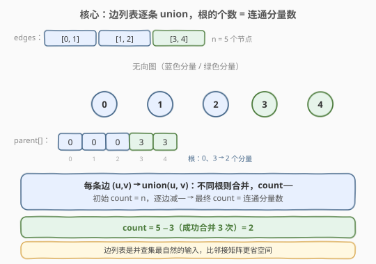
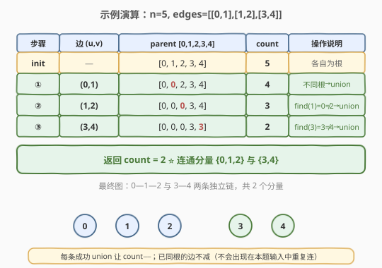

# LeetCode 无向图中连通分量的数量 题解

## 1. 题目概述

- **标题 / 题号**：无向图中连通分量的数量（#323，medium）
- **链接**：https://leetcode.cn/problems/number-of-connected-components-in-an-undirected-graph/
- **难度**：中等
- **标签**：并查集、深度优先搜索、广度优先搜索、图

**题意**：给定一个由 `n` 个节点（编号 `0` 到 `n - 1`）组成的无向图，以及一个边列表 `edges`，其中 `edges[i] = [ai, bi]` 表示节点 `ai` 与 `bi` 之间存在一条无向边。

返回该图中**连通分量的数量**。

**示例 1**：

```text
输入：n = 5, edges = [[0, 1], [1, 2], [3, 4]]
输出：2
解释：节点 0、1、2 互相可达，构成一个连通分量；节点 3、4 构成另一个；共 2 个。
```

**示例 2**：

```text
输入：n = 5, edges = [[0, 1], [1, 2], [2, 3], [3, 4]]
输出：1
解释：所有节点串成一条链 0—1—2—3—4，整体为一个连通分量。
```

**约束**：

- `1 <= n <= 200`
- `0 <= edges.length <= n * (n - 1) / 2`
- `edges[i].length == 2`
- `0 <= ai, bi < n`
- `ai != bi`
- 无重复边

## 2. 解题思路

### 2.1 暴力思路

把 `edges` 转成邻接表，对每个未访问节点做一次 DFS/BFS 把整个连通分量标记掉，统计需要几次遍历就能覆盖所有节点即为答案。时间复杂度 $O(n + m)$（$m$ 为边数），空间 $O(n + m)$。这能过，但**没有学到新模板**——本题是并查集「边列表求连通分量」的母题，比 [547. 省份数量](../0501-0600/547_省份数量.md) 的邻接矩阵版本更通用。

### 2.2 核心观察：并查集



并查集用一个**森林**维护若干不相交集合：

- 每个节点初始自成一棵树，`parent[i] = i`，即自己是根，此时连通分量数 `count = n`。
- `find(x)`：沿 `parent` 指针一路向上找到 `x` 所在树的**根**（即该集合的代表）。
- `union(x, y)`：分别找 `x`、`y` 的根，若不同就把一棵挂到另一棵下，**集合数 `-1`**。

本题输入是**边列表**而非邻接矩阵——这恰是并查集最自然的输入形式：逐条读边，每条边 `(u, v)` 表示「`u`、`v` 应在同一集合」，做一次 `union`。所有边处理完后，`count` 即为连通分量数。

> 💡 关键直觉：连通分量数 = 节点数 − 成功合并次数。初始每个节点独立成 `n` 个分量；每条连接两个**不同**分量的边都会让分量数 `-1`。所以只需遍历边、对成功 `union` 计数减一即可，无需最后再扫一遍 `parent` 数根。

### 2.3 find 路径压缩 + union 按秩合并

朴素 `find` 会退化成链表。两个标准优化让均摊复杂度逼近常数：

- **路径压缩（Path Compression）**：`find` 递归向上找根时，顺手把路径上所有节点**直接挂到根**下，树高瞬间压平。
- **按秩合并（Union by Rank）**：合并时让**矮树挂到高树**下，`rank` 近似树高，保证 `rank` 只在两棵等高树合并时才 `+1`，树高被控制在对数级别。

两者搭配后，单次操作的均摊复杂度为 $O(\alpha(n))$（阿克曼函数的反函数），在 $n \le 10^{80}$ 范围内 $\alpha(n) < 5$，**实际可视为常数**。

### 2.4 算法流程图


### 2.5 示例演算



以 `n = 5, edges = [[0, 1], [1, 2], [3, 4]]` 为例：

- 初始 `parent = [0, 1, 2, 3, 4]`，`count = 5`。
- 加 `(0, 1)`：`find(0)=0`、`find(1)=1`，不同根 → `union`，`parent[1]=0`，`count=4`。
- 加 `(1, 2)`：`find(1)=0`、`find(2)=2`，不同根 → `union`，`parent[2]=0`，`count=3`。
- 加 `(3, 4)`：`find(3)=3`、`find(4)=4`，不同根 → `union`，`parent[4]=3`，`count=2`。
- 最终 `count = 2`，即 2 个连通分量 `{0,1,2}` 与 `{3,4}`。

## 3. 参考代码

### C++（并查集 + 路径压缩 + 按秩合并）

```cpp
class UnionFind {
  public:
    vector<int> parent;
    vector<int> rank_;
    int count;

    UnionFind(int n) : count(n) {
        parent.resize(n);
        rank_.assign(n, 0);
        for (int i = 0; i < n; i++) parent[i] = i;
    }

    int find(int x) {
        if (parent[x] != x) parent[x] = find(parent[x]); // 路径压缩
        return parent[x];
    }

    void unite(int x, int y) {
        int rx = find(x), ry = find(y);
        if (rx == ry) return;                              // 已同根，跳过
        if (rank_[rx] < rank_[ry]) parent[rx] = ry;       // 按秩合并
        else if (rank_[rx] > rank_[ry]) parent[ry] = rx;
        else { parent[ry] = rx; rank_[rx]++; }
        count--;
    }
};

class Solution {
  public:
    int countComponents(int n, vector<vector<int>>& edges) {
        UnionFind uf(n);
        for (auto& e : edges) uf.unite(e[0], e[1]);        // 逐条加边
        return uf.count;
    }
};
```

### Python（并查集 + 路径压缩 + 按秩合并）

```python
class Solution:
    def countComponents(self, n: int, edges: List[List[int]]) -> int:
        parent = list(range(n))
        rank_ = [0] * n
        count = n

        def find(x):
            while parent[x] != x:
                parent[x] = parent[parent[x]]              # 隔代压缩
                x = parent[x]
            return x

        for u, v in edges:
            ru, rv = find(u), find(v)
            if ru == rv:
                continue                                   # 已同根，跳过
            if rank_[ru] < rank_[rv]:
                parent[ru] = rv
            elif rank_[ru] > rank_[rv]:
                parent[rv] = ru
            else:
                parent[rv] = ru
                rank_[ru] += 1
            count -= 1
        return count
```

### 扩展写法：DFS（邻接表）

```cpp
class Solution {
  public:
    int countComponents(int n, vector<vector<int>>& edges) {
        vector<vector<int>> g(n);
        for (auto& e : edges) {
            g[e[0]].push_back(e[1]);
            g[e[1]].push_back(e[0]);                      // 无向边加两次
        }
        vector<int> vis(n, 0);
        int ans = 0;
        for (int i = 0; i < n; i++) {
            if (!vis[i]) { dfs(g, vis, i); ans++; }
        }
        return ans;
    }
    void dfs(vector<vector<int>>& g, vector<int>& vis, int u) {
        vis[u] = 1;
        for (int v : g[u])
            if (!vis[v]) dfs(g, vis, v);
    }
};
```

## 4. 复杂度分析

| 维度 | 复杂度 | 说明 |
|------|--------|------|
| 时间复杂度 | $O(n + m \, \alpha(n))$ | 初始化 $O(n)$；处理 $m$ 条边，每条两次 `find` + 至多一次 `union`，均摊 $O(\alpha(n))$ |
| 空间复杂度 | $O(n)$ | `parent` 与 `rank` 数组各 $O(n)$ |

> 💡 由于 $\alpha(n) \le 5$（本题 $n \le 200$ 范围内），实际等同于 $O(n + m)$，与 DFS 同阶，但并查集换来一个可复用的「动态加边」模板——边可以**逐条加入并随时查询连通性**，DFS 做不到。

## 5. 扩展：动态加边与邻接矩阵版对照

1. **与 [547. 省份数量](../0501-0600/547_省份数量.md) 的对照**：547 给的是 $n \times n$ 邻接矩阵 `isConnected`，需双重循环枚举所有点对（$O(n^2)$）；323 给的是**稀疏边列表**，只需 $O(m)$ 遍历边。当图稀疏（$m \ll n^2$）时边列表版明显更优；稠密时两者接近。并查集模板本身完全一致，只是「遍历边」的来源不同。

2. **动态加边查询**：若题目改为「边按时间逐条给出，期间穿插查询两点是否连通」，并查集可**在线**支持——每条边 `union` 一次、每次查询 `find(a) == find(b)`，都是 $O(\alpha)$。DFS/BFS 需要每次重建图，无法应对在线场景。

3. **按 size 合并**：用集合大小 `size` 代替 `rank`，把小树挂大树，效果类似，还能顺手统计每个连通分量的节点数（`size[find(x)]` 即 `x` 所在分量的大小）。

## 6. 面试要点

1. **连通分量数和并查集 `count` 的关系是什么？**

   - 初始每个节点独立，`count = n`。每条连接两个**不同**分量的边都会让分量数 `-1`（成功 `union` 即减一）；连接同一分量的边（已同根）不减。所以「`count` = `n` − 成功合并次数」就是最终连通分量数。

2. **本题和 547 省份数量的并查集用法有何异同？**

   - 模板完全相同（`find` + `union` + 路径压缩 + 按秩合并）。区别在**输入形式**：547 是邻接矩阵，需 $O(n^2)$ 枚举点对；323 是边列表，只需 $O(m)$ 遍历边。稀疏图下 323 的边列表形式更高效、也更贴近实际图的存储方式。

3. **为什么不最后再扫一遍 `parent` 数 `parent[i] == i`？**

   - 路径压缩后 `parent[i] == i` 的仍是根，数根也正确；但维护 `count` 在每次成功 `union` 时 `--`，最后直接返回，省一次 $O(n)$ 扫描，且语义清晰（「合并一次少一个分量」）。

4. **并查集相比 DFS/BFS 的优势在哪？什么时候必须用它？**

   - DFS/BFS 适合**静态图**一次性求连通分量，需先建邻接表 $O(n + m)$；并查集擅长**动态加边**、**反复查询两点是否连通**（如冗余连接、账户合并）。当边是逐条给出且伴随查询时，并查集更优。本题是静态图，两者皆可，但并查集代码更短、模板更通用。

5. **路径压缩和按秩合并为什么需要？只用一个行不行？**

   - 二者都在压低树高。只用路径压缩，均摊复杂度已是 $O(\log n)$ 级别；只用按秩合并也是 $O(\log n)$；**两者同时使用**才能达到 $O(\alpha(n))$ 近似常数。面试中通常一起写，但只写路径压缩也常被接受。

## 同类练习题

| # | 题目 | 与本题的关联 |
|---|------|-------------|
| 547 | [省份数量](https://leetcode.cn/problems/number-of-provinces/)（[题解](../0501-0600/547_省份数量.md)） | 同一并查集模板，输入换成邻接矩阵，$O(n^2)$ 枚举点对，与本题边列表版对照 |
| 200 | [岛屿数量](https://leetcode.cn/problems/number-of-islands/) | DFS/BFS 求二维网格连通分量，可与并查集解法对照 |
| 684 | [冗余连接](https://leetcode.cn/problems/redundant-connection/)（[题解](../0601-0700/684_冗余连接.md)） | 同样边列表 + 并查集，但用「union 失败」判环边，与本题「数合并次数」用法对照 |
| 1319 | [连通网络的操作次数](https://leetcode.cn/problems/number-of-operations-to-make-network-connected/) | 并查集数连通分量，求最少接线数使全网连通（连通分量数 − 1） |
| 721 | [账户合并](https://leetcode.cn/problems/accounts-merge/) | 并查集合并字符串键（邮箱），模板进阶到「哈希映射 + 并查集」 |
