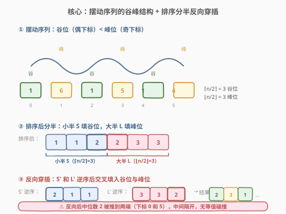
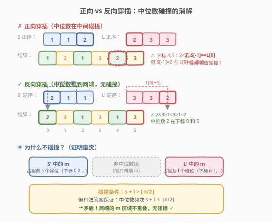
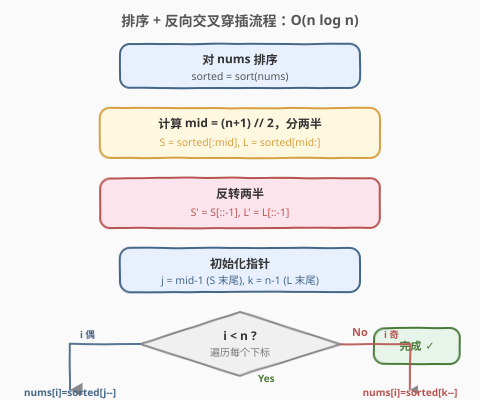
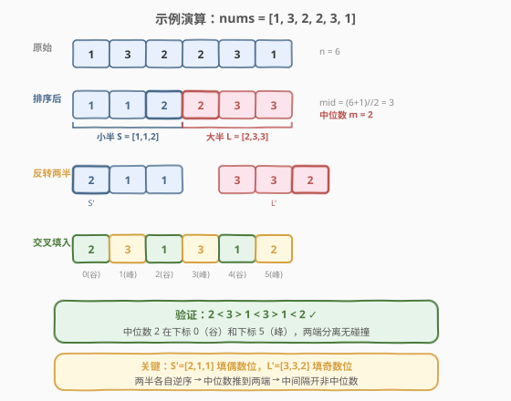

# LeetCode 摆动排序II 题解

## 1. 题目概述

- **标题 / 题号**：摆动排序II（#324，medium）
- **链接**：https://leetcode.cn/problems/wiggle-sort-ii/
- **难度**：中等
- **标签**：数组、排序、分治

**题意**：给你一个整数数组 `nums`，将其重新排列成 `nums[0] < nums[1] > nums[2] < nums[3]...` 的摆动顺序。**保证所有输入都存在有效答案**，要求**原地修改**。

**示例 1**：

```text
输入：nums = [1,5,1,1,6,4]
输出：[1,6,1,5,1,4]
解释：1 < 6 > 1 < 5 > 1 < 4，满足摆动序列。
```

**示例 2**：

```text
输入：nums = [1,3,2,2,3,1]
输出：[2,3,1,3,1,2]
解释：2 < 3 > 1 < 3 > 1 < 2，满足摆动序列。
```

**约束**：

- $1 \le \text{nums.length} \le 5 \times 10^4$
- $0 \le \text{nums}[i] \le 5000$
- 保证存在有效答案

> 💡 **有效答案的存在条件**：数组中出现次数最多的元素其频次不超过 $\lfloor n/2 \rfloor$。若某元素出现超过 $\lfloor n/2 \rfloor$ 次，则它必然同时占据「谷位」（偶数下标）和「峰位」（奇数下标），而相邻谷峰不能相等，故无解。题目保证此条件成立。

> ⚠️ **进阶要求**：实现 $O(n)$ 时间和/或 $O(1)$ 额外空间的原地解法。

## 2. 解题思路

### 2.1 暴力思路

- **全排列枚举**：生成所有排列，逐个检查是否满足 `a[0] < a[1] > a[2] < ...`。时间 $O(n! \cdot n)$，完全不可行。
- **排序 + 正向交叉穿插**：将数组排序后分成「小半」`S = nums[0..mid-1]` 和「大半」`L = nums[mid..n-1]`，依次把 `S` 放偶数下标、`L` 放奇数下标。但当 `S` 末尾与 `L` 开头存在相同元素（中位数重复）时，相邻谷峰会撞上等值，导致失败。

> ⚠️ 突破口：排序分半的思路方向正确，但需要**反向穿插**来规避中位数在谷峰边界上的等值碰撞。

### 2.2 核心观察：排序 + 反向交叉穿插



**摆动序列的结构**：下标 $0, 2, 4, \ldots$ 是「谷位」（局部小），下标 $1, 3, 5, \ldots$ 是「峰位」（局部大）。谷位共 $\lceil n/2 \rceil$ 个，峰位共 $\lfloor n/2 \rfloor$ 个。

**排序分半**：

| 半区 | 范围 | 大小 | 放置位置 |
|------|------|------|----------|
| 小半 `S` | `sorted[0..mid-1]` | $\lceil n/2 \rceil$ | 偶数下标（谷位） |
| 大半 `L` | `sorted[mid..n-1]` | $\lfloor n/2 \rfloor$ | 奇数下标（峰位） |

其中 `mid = (n + 1) // 2`（小半的大小，向上取整保证谷位足够）。

**反向穿插**：将 `S` 和 `L` 各自**逆序**后，再交叉填入结果数组。即 `S` 的末尾（最大的小半元素）填入下标 0，`L` 的末尾（最大的大半元素）填入下标 1，依次类推。

> 💡 **为什么反向？** 正向穿插时，`S` 的最大值 `S[-1]` 与 `L` 的最小值 `L[0]`（可能相等，即中位数）会被放在**靠中间的相邻谷峰位**，造成等值碰撞。反向后，`S[-1]` 被推到**最前的谷位**（下标 0），`L[0]` 被推到**最后的峰位**（下标 $n-1$ 或 $n-2$），两者被拉到数组两端，中间隔开了非中位数元素，碰撞被消解。

### 2.3 关键难点：为什么反向能消解等值碰撞？



设排序后中位值为 $m$，它在 `S` 中出现 $s$ 次（位于 `S` 的末尾），在 `L` 中出现 $l$ 次（位于 `L` 的开头），总频次 $s + l \le \lfloor n/2 \rfloor$（有效答案保证）。

**反向后**：
- `S` 中的 $m$ 逆序到 `S'` 的**开头**，占据前 $s$ 个谷位（下标 $0, 2, \ldots, 2(s{-}1)$）。
- `L` 中的 $m$ 逆序到 `L'` 的**末尾**，占据后 $l$ 个峰位（下标 $n{-}1, n{-}3, \ldots$ 附近）。

**碰撞条件**：某对相邻谷峰 $(2j, 2j{+}1)$ 同时为 $m$，即 `S'[j] == L'[j] == m`。这要求 $j < s$（`S'` 前 $s$ 个是 $m$）且 $j \ge \lfloor n/2 \rfloor - l$（`L'` 后 $l$ 个是 $m$），即 $\lfloor n/2 \rfloor - l \le j < s$，需要 $s + l > \lfloor n/2 \rfloor$。但有效答案保证 $s + l \le \lfloor n/2 \rfloor$，矛盾！

> ⚠️ 因此反向穿插对**所有有效输入**都不会产生等值碰撞。核心在于：中位数被分散到数组两端的谷位和峰位，中间被非中位数隔开，而中位数总数不超过峰位个数，两端的 $m$ 区域不会重叠。

### 2.4 算法流程图



### 2.5 示例演算

以 `nums = [1, 3, 2, 2, 3, 1]` 为例：



| 步骤 | 操作 | 数组状态 |
|------|------|----------|
| 1 | 排序 | `[1, 1, 2, 2, 3, 3]` |
| 2 | 分半 `mid=3` | `S = [1,1,2]`, `L = [2,3,3]` |
| 3 | 反转两半 | `S' = [2,1,1]`, `L' = [3,3,2]` |
| 4 | 交叉填入 | 下标 0,2,4 ← `S'`；下标 1,3,5 ← `L'` |
| 5 | 结果 | `[2, 3, 1, 3, 1, 2]` |

验证：$2 < 3 > 1 < 3 > 1 < 2$ ✓

> 💡 **注意**：中位数 $m = 2$ 在 `S` 中出现 1 次（`S[-1]`），在 `L` 中出现 1 次（`L[0]`），总频次 $1+1=2 \le 3 = \lfloor 6/2 \rfloor$。反向后 `S'` 开头的 2 在下标 0，`L'` 末尾的 2 在下标 5，两端分离，无碰撞。

## 3. 参考代码

### C++

```cpp
class Solution {
public:
    void wiggleSort(vector<int>& nums) {
        int n = nums.size();
        vector<int> sorted(nums);
        sort(sorted.begin(), sorted.end());
        int mid = (n + 1) / 2;
        int j = mid - 1, k = n - 1;
        for (int i = 0; i < n; i++) {
            if (i % 2 == 0) {
                nums[i] = sorted[j--];
            } else {
                nums[i] = sorted[k--];
            }
        }
    }
};
```

### Python

```python
class Solution:
    def wiggleSort(self, nums: List[int]) -> None:
        n = len(nums)
        s = sorted(nums)
        mid = (n + 1) // 2
        nums[::2] = s[:mid][::-1]
        nums[1::2] = s[mid:][::-1]
```

> 💡 **Python 切片一行流**：`nums[::2]` 取所有偶数下标，`nums[1::2]` 取所有奇数下标。`s[:mid][::-1]` 取小半并反转，`s[mid:][::-1]` 取大半并反转。赋值直接覆盖原数组对应位置，原地完成。

> ⚠️ **C++ 用副本**：C++ 排序会破坏原数组顺序，故先拷贝 `sorted`，再从 `sorted` 的两半末尾（`j = mid-1`、`k = n-1`）倒序取值填入 `nums`。`mid = (n+1)/2` 保证小半多一个元素（谷位比峰位多一个），整数除法自动向下取整无需额外处理。

## 4. 复杂度分析

| 维度 | 复杂度 | 说明 |
|------|--------|------|
| 时间复杂度 | $O(n \log n)$ | 排序为主，交叉穿插 $O(n)$ |
| 空间复杂度 | $O(n)$ | 排序副本 + 切片临时数组 |

> 💡 此解法简洁高效，面试首选。若面试官追问 $O(n)$ 时间或 $O(1)$ 空间，见第 5 节扩展。

## 5. 扩展：$O(n)$ 时间 + $O(1)$ 空间原地解法

进阶要求 $O(n)$ 时间和 $O(1)$ 额外空间，需要三步组合：**快速选择找中位数 + 虚拟下标映射 + 三向分区（荷兰国旗）**。

### 5.1 快速选择找中位数

用 `nth_element`（C++）或手写 quickselect 在 $O(n)$ 时间内找到第 $\lfloor n/2 \rfloor$ 小的元素（中位数 $m$），无需完整排序。

### 5.2 虚拟下标映射

定义映射 $A(i) = (2i + 1) \bmod (n \mid 1)$，其中 $n \mid 1$ 表示 $n$ 为奇数时取 $n$，为偶数时取 $n+1$。

该映射将物理下标 $0, 1, 2, \ldots$ 重映射为「先峰位后谷位」的虚拟顺序：

| $n=6$ 时 | $i$ | 0 | 1 | 2 | 3 | 4 | 5 |
|-----------|-----|---|---|---|---|---|---|
| $A(i)$ | | 1 | 3 | 5 | 0 | 2 | 4 |

即虚拟下标 $i = 0, 1, 2$ 映射到峰位 $1, 3, 5$，$i = 3, 4, 5$ 映射到谷位 $0, 2, 4$。这样三向分区时，大于 $m$ 的元素自然排到峰位区，小于 $m$ 的排到谷位区，等于 $m$ 的留在中间。

### 5.3 三向分区

以 $m$ 为基准，对虚拟下标序列做荷兰国旗三向分区：

- `nums[A(j)] > m`：交换到左侧「大于区」
- `nums[A(j)] < m`：交换到右侧「小于区」
- `nums[A(j)] == m`：留在中间「等于区」

```cpp
class Solution {
public:
    void wiggleSort(vector<int>& nums) {
        int n = nums.size();
        auto A = [n](int i) { return (2 * i + 1) % (n | 1); };
        nth_element(nums.begin(), nums.begin() + n / 2, nums.end());
        int m = nums[n / 2];
        int i = 0, j = 0, k = n - 1;
        while (j <= k) {
            if (nums[A(j)] > m) {
                swap(nums[A(j)], nums[A(i)]);
                i++; j++;
            } else if (nums[A(j)] < m) {
                swap(nums[A(j)], nums[A(k)]);
                k--;
            } else {
                j++;
            }
        }
    }
};
```

| 维度 | 复杂度 | 说明 |
|------|--------|------|
| 时间复杂度 | $O(n)$ | quickselect $O(n)$ + 三向分区 $O(n)$，均摊 |
| 空间复杂度 | $O(1)$ | 原地交换，仅常数变量 |

> ⚠️ 此解法虽达理论最优，但实现复杂、边界微妙，面试中说出思路即可。实际工程中排序解法更稳妥。注意 `nth_element` 后 `nums[n/2]` 即中位数，但数组已被部分打乱，需先取中位数值再做三向分区。

## 6. 面试要点

1. **为什么小半大小是 $\lceil n/2 \rceil$ 而非 $\lfloor n/2 \rfloor$？**
   - 谷位（偶数下标）有 $\lceil n/2 \rceil$ 个，峰位（奇数下标）有 $\lfloor n/2 \rfloor$ 个。小半元素填谷位，故需 $\lceil n/2 \rceil$ 个。若 $n$ 为奇数，谷位比峰位多一个，小半须多一个元素。

2. **为什么必须反向穿插，正向不行？**
   - 正向穿插时，`S` 末尾与 `L` 开头的中位数会被放到相邻的谷峰位，造成等值碰撞。反向后，中位数被推到数组两端的谷位和峰位，中间隔开非中位数，且中位数总数 $\le \lfloor n/2 \rfloor$ 保证两端不重叠。

3. **有效答案的存在条件是什么？**
   - 出现次数最多的元素频次 $\le \lfloor n/2 \rfloor$。否则该元素必然同时占据谷位和峰位，而相邻谷峰不能相等，无解。题目保证此条件成立。

4. **虚拟下标映射 $A(i) = (2i+1) \bmod (n \mid 1)$ 的直觉是什么？**
   - 它把物理数组重排为「先所有峰位、再所有谷位」的虚拟顺序，使三向分区天然把大值放峰位、小值放谷位。$n \mid 1$ 保证奇偶 $n$ 下映射都是双射（不漏不重覆盖 $0..n{-}1$）。

5. **与 280 题（摆动排序 I）的区别？**
   - 280 题要求 `nums[0] <= nums[1] >= nums[2] <= ...`（非严格），一次遍历交换即可，无需排序。324 题要求**严格**不等（`<` 和 `>`），必须排序分半避免等值相邻，难度更高。

## 同类练习题

| # | 题目 | 与本题的关联 |
|---|------|-------------|
| 280 | [摆动排序](https://leetcode.cn/problems/wiggle-sort/) | 非严格摆动（`<=`/`>=`），一次遍历交换即可，对比 324 的严格不等 |
| 376 | [摆动序列](https://leetcode.cn/problems/wiggle-subsequence/) | 贪心维护峰谷状态求最长摆动子序列，与本题摆动结构相关 |
| 215 | [数组中的第K个最大元素](https://leetcode.cn/problems/kth-largest-element-in-an-array/)（[题解](../0201-0300/215_数组中的第K个最大元素.md)） | 快速选择找第 k 大，扩展中 quickselect 的基础 |
| 75 | [颜色分类](https://leetcode.cn/problems/sort-colors/)（[题解](../0001-0100/75_颜色分类.md)） | 荷兰国旗三向分区，扩展中原地分区的核心套路 |
| 347 | [前 K 个高频元素](https://leetcode.cn/problems/top-k-frequent-elements/)（[题解](../0301-0400/347_前K个高频元素.md)） | 快速选择 / 桶排序求 Top-K，与 quickselect 思路互通 |
