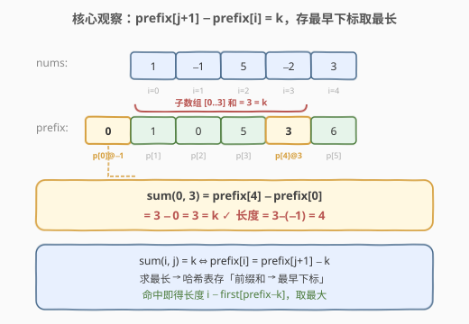
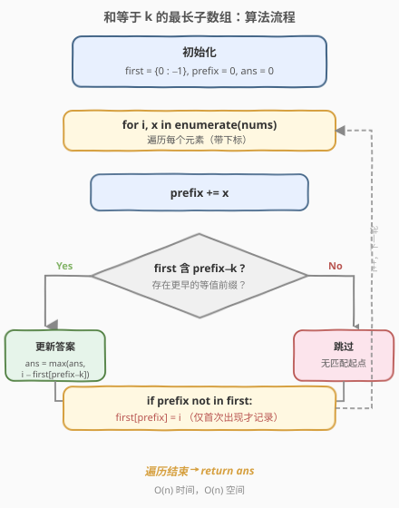
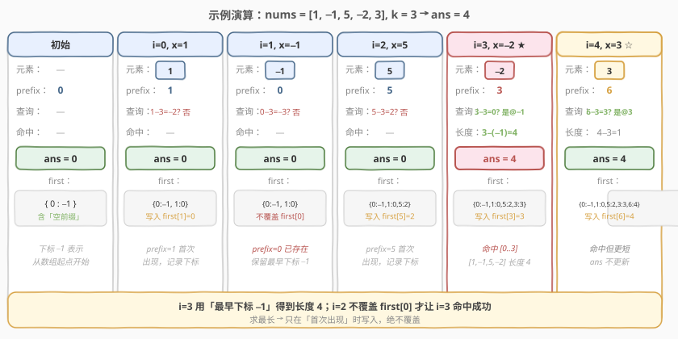

# LeetCode 和等于 k 的最长子数组长度 题解

## 1. 题目概述

- **标题 / 题号**：和等于 k 的最长子数组长度（#325，medium）
- **链接**：https://leetcode.cn/problems/maximum-size-subarray-sum-equals-k/
- **难度**：中等
- **标签**：数组、哈希表、前缀和

**题意**：给定一个整数数组 `nums` 和一个整数 `k`，请找出并返回和为 `k` 的**最长连续子数组**的长度。若不存在这样的子数组，返回 `0`。

**示例 1**：

```text
输入：nums = [1, -1, 5, -2, 3], k = 3
输出：4
解释：子数组 [1, -1, 5, -2] 的和为 3，长度为 4，是最长的满足条件的子数组。
```

**示例 2**：

```text
输入：nums = [-2, -1, 2, 1], k = 1
输出：2
解释：子数组 [-1, 2] 的和为 1，长度为 2。
```

**约束**：

- `1 <= nums.length <= 2 * 10^5`
- `-10^4 <= nums[i] <= 10^4`
- `-10^9 <= k <= 10^9`

> ⚠️ 注意：求的是「**最长长度**」而非个数；子数组必须**连续**；数组元素可能为**负数**，因此不能用滑动窗口（窗口和没有单调性）；数据规模到 `2 * 10^5`，要求 `O(n)` 级别解法。

## 2. 解题思路

### 2.1 暴力思路

枚举所有子数组 `[i, j]`，逐个求和判断是否等于 `k`，维护最长长度。两重循环 + 求和共 `O(n^2)`；若用前缀和优化到 `O(n^2)` 但仍需枚举所有起点，在 `n = 2 * 10^5` 时约 `4 * 10^{10}` 次操作，严重超时。需要找到「一次扫描就能判断」的增量方法。

### 2.2 核心观察：前缀和差 + 存最早下标



定义前缀和 `prefix[i]` 为 `nums[0..i-1]` 的和（`prefix[0] = 0`），则子数组 `nums[i..j]` 的和为：

$$
\text{sum}(i, j) = \text{prefix}[j+1] - \text{prefix}[i]
$$

要让该和等于 `k`，即：

$$
\text{prefix}[j+1] - \text{prefix}[i] = k \quad\Longleftrightarrow\quad \text{prefix}[i] = \text{prefix}[j+1] - k
$$

> 💡 **关键转化**：对每个结束位置 `j`，问题变成——**之前是否存在一个起点 `i` 的前缀和恰好等于 `当前前缀和 - k`**，且要让 `j - i` 最大。

既然求的是「最长」，相同前缀和值出现得**越早**，能配出的区间越长。因此哈希表应记录每个前缀和**首次出现**的下标，后续再遇到相同值时**绝不覆盖**——直接用最早下标计算长度才能取到最大。

### 2.3 算法流程图



一次遍历即可：

1. 维护哈希表 `first`，记录每个前缀和**首次出现**的下标；初始 `first = {0 : -1}`（前缀和 `0` 在「空前缀」处即下标 `-1` 出现，对应从数组起点开始的子数组）。
2. 维护当前前缀和 `prefix`（初值 `0`）与答案 `ans`（初值 `0`）。
3. 对每个下标 `i`：`prefix += nums[i]`。
   - 若 `prefix - k` 已在 `first` 中：说明从 `first[prefix - k] + 1` 到 `i` 这一段和为 `k`，更新 `ans = max(ans, i - first[prefix - k])`。
   - 若 `prefix` 不在 `first` 中：`first[prefix] = i`，首次出现才记录；已存在**绝不覆盖**，保留最早下标才能取到最长。
4. 遍历结束，`ans` 即答案。

> ⚠️ **与 [560. 和为 K 的子数组](../0501-0600/560_和为K的子数组.md) 的关键区别**：560 求「个数」，哈希表存的是**频次**，每次 `count[S] += 1`；本题求「最长长度」，哈希表存的是**最早下标**，且只在「首次出现」时写入——已存在绝不覆盖。两题共享同一前缀和等式，但哈希表的语义截然不同。

### 2.4 示例演算

以 `nums = [1, -1, 5, -2, 3], k = 3` 为例（子数组 `[1, -1, 5, -2]` 和为 `3`，答案应为 `4`）：



| 步骤 | 元素 | prefix | 查询 prefix−k | 命中长度 | ans | first 更新 |
|------|------|--------|---------------|----------|-----|------------|
| 初始 | — | 0 | — | — | 0 | {0:−1} |
| i=0 | 1 | 1 | 1−3=−2? 否 | — | 0 | 写入 {1:0} |
| i=1 | −1 | 0 | 0−3=−3? 否 | — | 0 | 不覆盖 first[0] |
| i=2 | 5 | 5 | 5−3=2? 否 | — | 0 | 写入 {5:2} |
| i=3 | −2 | 3 | 3−3=0? 是@−1 | 3−(−1)=4 | 4 | 写入 {3:3} |
| i=4 | 3 | 6 | 6−3=3? 是@3 | 4−3=1 | 4 | 写入 {6:4} |

最终答案 `4`，对应子数组 `[1, -1, 5, -2]`（下标 0–3）。

> 💡 **看 i=3 这一步**：此时 `prefix=3`，查询 `3-3=0`，命中 `first[0] = -1`（最早下标），得到长度 `3-(-1)=4`。再看 **i=1**：此时 `prefix=0` 与 `first` 中已有的 `0` 重复，但我们**没有覆盖**——正因保留了 `−1`，`i=3` 才能命中并得到最长长度 `4`。这就是「只存首次下标、不覆盖」的根本原因。

> 💡 **看 i=4 这一步**：`prefix=6`，查询 `6-3=3`，命中 `first[3]=3`，长度仅 `4-3=1`，**不足以更新** `ans`。这说明并非每次命中都能改进答案——但 `O(1)` 的查询代价极低，总体仍为 `O(n)`。

## 3. 参考代码

### C++

```cpp
class Solution {
  public:
    int maxSubArrayLen(vector<int>& nums, int k) {
        unordered_map<int, int> first;
        first[0] = -1;
        int ans = 0, prefix = 0;
        for (int i = 0; i < (int)nums.size(); ++i) {
            prefix += nums[i];
            auto it = first.find(prefix - k);
            if (it != first.end()) {
                ans = max(ans, i - it->second);
            }
            if (!first.count(prefix)) {
                first[prefix] = i;
            }
        }
        return ans;
    }
};
```

### Python

```python
class Solution:
    def maxSubArrayLen(self, nums: List[int], k: int) -> int:
        first = {0: -1}
        ans = prefix = 0
        for i, x in enumerate(nums):
            prefix += x
            if prefix - k in first:
                ans = max(ans, i - first[prefix - k])
            if prefix not in first:
                first[prefix] = i
        return ans
```

> ⚠️ **两个判断的顺序无关**：先查 `prefix - k` 还是先写 `first[prefix]` 都不影响正确性——因为 `prefix - k == prefix` 仅在 `k == 0` 时成立，此时查询的是「之前是否存在相同前缀和」，而写入条件是「首次出现」，二者互不干扰。但为代码清晰，建议**先查后写**，与 [560](../0501-0600/560_和为K的子数组.md) 的「先查再写」习惯保持一致。

## 4. 复杂度分析

| 维度 | 复杂度 | 说明 |
|------|--------|------|
| 时间复杂度 | O(n) | 只遍历数组一次，每次哈希表查询 / 写入均摊 O(1) |
| 空间复杂度 | O(n) | 最坏情况下每个前缀和都不同，哈希表存 n+1 个键 |

> 💡 本题前缀和取值范围较大（`nums[i]` 可达 `±10^4`，累积前缀和可达 `±2 * 10^9`），不适合用数组代替哈希表；哈希表方案对值域无要求，是面试首选。

## 5. 扩展：560 与 525 的完美融合

本题是「前缀和 + 哈希」家族中承上启下的关键一题，它同时融合了两道经典题的核心思想：

| 题目 | 目标 | 哈希表存什么 | 已存在时是否覆盖 | 查询键 |
|------|------|--------------|------------------|--------|
| 560. 和为 K 的子数组 | **计数** | 前缀和的**频次** | 不覆盖，频次 +1 | `prefix - k` |
| 525. 连续数组 | **最长长度** | 前缀和的**最早下标** | **不覆盖**，保留最早 | `prefix`（k=0 特例） |
| **325. 本题** | **最长长度** | 前缀和的**最早下标** | **不覆盖**，保留最早 | `prefix - k` |

> 💡 **一句话总结**：325 = 560 的等式 `prefix[i] = prefix[j+1] - k` + 525 的存 earliest index 策略。525 是 325 在 `k = 0` 时的特例（把 0 变 −1 后，目标和为 0 即 0/1 数量相等）；560 与 325 共享同一等式，但一个求个数（存频次）、一个求最长（存最早下标）。

**口诀**：求个数存频次，求最长存最早；频次可累加，最早不覆盖。

## 6. 面试要点

1. **为什么哈希表要初始化 `{0: -1}`？**

   当某个从下标 0 开始的子数组和恰为 `k` 时，需要 `prefix[0] = 0` 作为可匹配的「空前缀」。此时区间起点应是「数组起点之前」即下标 `-1`，长度为 `i - (-1) = i + 1`。不初始化会漏掉所有「从头开始」的合法子数组。

2. **遇到已存在的前缀和时，为什么不更新哈希表？**

   本题求最长长度，相同前缀和的**最早**下标能配出最大区间；若用新下标覆盖，后续再匹配时算出的长度只会更短。

3. **数组含负数会有什么影响？**

   前缀和不再单调，同一前缀和值可能出现多次（对应多个起点），这正是哈希表要存「最早下标」而非单个最新下标的原因。同时，负数的存在也使得滑动窗口不可用——窗口和没有单调性，无法据 `k` 决定指针移动方向。

4. **能否返回该最长子数组本身？**

   可以。命中时记录 `(first[prefix - k] + 1, i)` 作为候选区间，最终取最长的那对端点即可，`nums[first+1 .. i]` 即为答案子数组，时间复杂度仍为 `O(n)`。

5. **如果 `k = 0`，本题退化为哪道题？**

   当 `k = 0` 时，查询键 `prefix - k = prefix`，即找「之前是否有相同前缀和」——这正是 [525. 连续数组](../0501-0600/525_连续数组.md) 的核心（525 把 0 当 −1 后目标和为 0）。525 是 325 在 `k = 0` 时的特例。

## 同类练习题

| # | 题目 | 与本题的关联 |
|---|------|-------------|
| 560 | [和为 K 的子数组](https://leetcode.cn/problems/subarray-sum-equals-k/)（[题解](../0501-0600/560_和为K的子数组.md)） | 共享同一前缀和等式，对比「求个数存频次」vs「求最长存最早」 |
| 525 | [连续数组](https://leetcode.cn/problems/contiguous-array/)（[题解](../0501-0600/525_连续数组.md)） | 325 在 `k = 0` 时的特例，0 当 −1 转换后目标和为 0 |
| 974 | [和可被 K 整除的子数组](https://leetcode.cn/problems/subarray-sums-divisible-by-k/)（[题解](../0901-1000/974_和可被K整除的子数组.md)） | 前缀和改为前缀余数，同余即相减为 K 的倍数，求计数 |
| 523 | [连续的子数组和](https://leetcode.cn/problems/continuous-subarray-sum/) | 前缀和 + 同余，且要求子数组长度至少为 2 |
| 209 | [长度最小的子数组](https://leetcode.cn/problems/minimum-size-subarray-sum/)（[题解](../0201-0300/209_长度最小的子数组.md)） | 全正数场景求「最短」，对比滑动窗口何时可用 |
