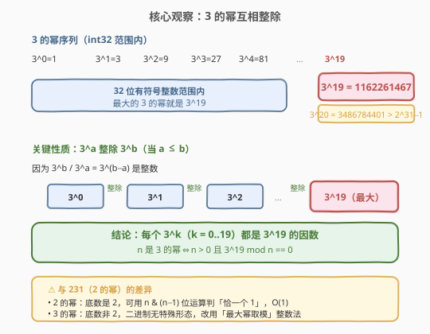
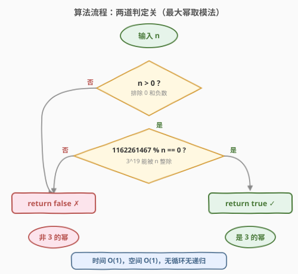
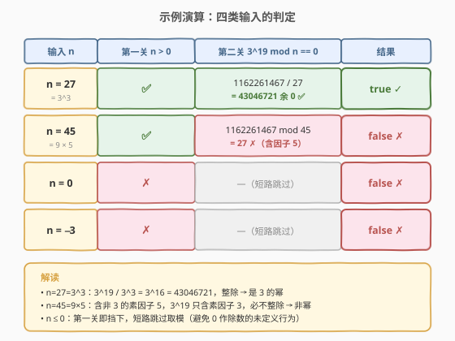

# 3 的幂

- **题目名称**：3 的幂
- **链接**：[326. 3 的幂](https://leetcode.cn/problems/power-of-three/)
- **难度**：简单
- **标签**：递归、数学

## 1. 题目概述

给定一个整数 `n`，判断它是否为 **3 的幂**——即是否存在整数 `x` 使得 $n = 3^x$。是则返回 `true`，否则返回 `false`。

**示例 1**：

```text
输入：n = 27
输出：true
解释：3^3 = 27
```

**示例 2**：

```text
输入：n = 0
输出：false
```

**示例 3**：

```text
输入：n = 9
输出：true
解释：3^2 = 9
```

**约束条件**：

- $-2^{31} \le n \le 2^{31} - 1$

> 💡 **进阶**：不使用循环 / 递归完成？答案是「最大幂取模」——用 int32 范围内最大的 3 的幂 $3^{19} = 1162261467$ 对 $n$ 取模，$O(1)$ 无循环。它与 [231. 2 的幂](../0201-0300/231_2的幂.md) 是同一系列题：231 靠位运算 $n \& (n-1)$（底数为 2 才有「单一 1」的二进制形态），326 底数为 3 不具备此特性，改用整数取模法。两法都归于「在范围内取一个最大幂，所有更小的幂都是它的因数」这一思想。

---

## 2. 解题思路

### 2.1 暴力思路：反复除 3

3 的幂满足：不断除以 3 最终会到 1，且过程中始终能被 3 整除（除 1 外）。故：

```text
若 n <= 0：返回 false
while n % 3 == 0：
    n //= 3
返回 n == 1
```

时间 $O(\log n)$（除到 1 最多 $\log_3 n$ 次），空间 $O(1)$。能 AC，但**用了循环**——不满足进阶的「无循环」要求，且对大数（如 $n = 3^{19}$）要循环 19 次。

> 💡 转机：能否像 [231](../0201-0300/231_2的幂.md) 那样用一次位运算判定？答案是不能——3 的幂的二进制没有「单一 1」的特殊形态（$3=11_2$、$9=1001_2$、$27=11011_2$…毫无规律）。但「2 的幂互相整除」这条性质可以推广：**3 的幂也互相整除**，于是改用整数取模。

### 2.2 核心观察：3 的幂互相整除



列出 3 的幂序列（int32 范围内）：

| $k$ | $3^k$ | 是否 $\le 2^{31}-1$ |
|-----|-------|---------------------|
| 0 | 1 | ✅ |
| 1 | 3 | ✅ |
| 2 | 9 | ✅ |
| … | … | … |
| **19** | **1162261467** | ✅ ← 最大 |
| 20 | 3486784401 | ✗ 溢出 |

规律：$3^{19} = 1162261467$ 是 32 位有符号整数范围内**最大的 3 的幂**（$3^{20} = 3486784401 > 2^{31}-1 = 2147483647$）。

**关键性质**：$3^a$ 整除 $3^b$（当 $a \le b$），因为 $3^b / 3^a = 3^{b-a}$ 是整数。故范围内每个 $3^k$（$k = 0, 1, \ldots, 19$）都是 $3^{19}$ 的**因数**。

> 💡 **关键转化**：判定「$n$ 是 3 的幂」$\iff$ 判定「$n > 0$ 且 $3^{19} \bmod n = 0$」。后者是一次整数取模，$O(1)$ 无循环。这把 [231. 2 的幂](../0201-0300/231_2的幂.md) 第 5.2 节的「$(1 \ll 30) \bmod n = 0$」模板从底数 2 推广到了底数 3。

### 2.3 核心解法：`n > 0 && 1162261467 % n == 0`

把上面的观察直接翻译成代码：

- 若 `n` 是 3 的幂（$3^0, 3^1, \ldots, 3^{19}$ 之一），它必整除 $3^{19}$，故 `1162261467 % n == 0`；
- 若 `n` 不是 3 的幂（含非 3 的素因子，或超出范围），$3^{19}$ 只含素因子 3，不可能被 $n$ 整除，故 `1162261467 % n != 0`。

**为什么还要加 `n > 0`？** 两个边界：

1. **`n = 0`**：`1162261467 % 0` 是**未定义行为**（除以零）。必须用 `n > 0` 先排除，短路求值避免触发。
2. **`n < 0`**：负数不是 3 的幂（$3^x > 0$ 恒成立）。`n > 0` 一刀切排除。

> ⚠️ **C++ 的溢出安全**：先判 `n > 0` 再算取模。`n > 0` 时 $n \ge 1$，除数非零，安全。短路求值保证 `n <= 0` 时根本不计算 `% n`。注意 `$3^{19} = 1162261467$` 本身 $\le 2^{31}-1$，用 `int` 字面量即可，无需 `long long`。

### 2.4 算法流程图



算法是**两道串联的判定关**，缺一不可：

1. **第一关 `n > 0`**：排除 `0` 和负数（3 的幂恒正，且防除零）。
2. **第二关 `1162261467 % n == 0`**：判定 $n$ 是否整除 $3^{19}$。

两关都过 → `true`；任一关不过 → `false`。整个判定**无循环、无递归**，一次比较 + 一次取模即完成。

### 2.5 示例演算

以四类典型输入为例（正幂、正非幂、零、负数）：



| 输入 | 第一关 `n > 0` | 第二关 `1162261467 % n == 0` | 结果 |
|------|---------------|------------------------------|------|
| `n = 27` | ✅ | `1162261467 / 27 = 43046721 余 0` ✅ | `true` |
| `n = 45` | ✅ | `1162261467 mod 45 = 27` ✗ | `false` |
| `n = 0` | ✗ | —（短路跳过，防除零） | `false` |
| `n = -3` | ✗ | —（短路跳过） | `false` |

注意 `n = 45 = 9 \times 5`：虽然含因子 9（是 3 的幂），但还含素因子 5，而 $3^{19}$ 只含素因子 3，必然不整除 → 非幂。这正是「取模法」的精髓：**$3^{19}$ 的全部素因子都是 3，只有 3 的幂才能整除它**。

---

## 3. 参考代码

### C++

```cpp
class Solution {
  public:
    bool isPowerOfThree(int n) {
        return n > 0 && 1162261467 % n == 0;
    }
};
```

### Python

```python
class Solution:
    def isPowerOfThree(self, n: int) -> bool:
        return n > 0 and 1162261467 % n == 0
```

> 💡 **一行即终**。`1162261467 % n == 0` 判定「$n$ 整除 $3^{19}$」，`n > 0` 排除 `0`（防除零）与负数（$3^x > 0$）。两者合起来等价于「$n$ 是 int32 范围内的 3 的幂」。Python 整数无限精度，但题目范围已限定 int32，故无需担心更大的 3 的幂；若题目改成任意大整数，需先算出「不超过 $n$ 的最大 3 的幂」再取模，逻辑更复杂。

---

## 4. 复杂度分析

| 维度 | 最大幂取模法 | 暴力除法 |
|------|-------------|---------|
| **时间复杂度** | $O(1)$ | $O(\log n)$ |
| **空间复杂度** | $O(1)$ | $O(1)$ |
| **无循环** | ✅ 满足进阶 | ✗ 用 while 循环 |

> ⚠️ 最大幂取模法的时间严格是 $O(1)$：一次比较、一次取模、一次等于比较，固定 3 步，与 $n$ 大小无关。对 32 位整数，取模是单条 CPU 指令。

---

## 5. 扩展：其他判定 3 的幂的写法

### 5.1 暴力除法（循环）

最朴素的写法，$O(\log_3 n)$：

```cpp
bool isPowerOfThree(int n) {
    if (n <= 0) return false;
    while (n % 3 == 0) n /= 3;
    return n == 1;
}
```

> 💡 能 AC 但用了循环，不满足进阶。在面试中可作为「先讲暴力再优化」的起点。

### 5.2 递归

把循环改成递归，本质相同，$O(\log n)$ 时间 + $O(\log n)$ 递归栈：

```cpp
bool isPowerOfThree(int n) {
    if (n <= 0) return false;
    if (n == 1) return true;
    if (n % 3 != 0) return false;
    return isPowerOfThree(n / 3);
}
```

### 5.3 对数法（⚠️ 不推荐）

数学上 $n$ 是 3 的幂 $\iff$ $\log_3 n$ 是整数。用换底公式：

```cpp
bool isPowerOfThree(int n) {
    if (n <= 0) return false;
    double d = log10(n) / log10(3);
    return fabs(d - round(d)) < 1e-10;
}
```

> ⚠️ **浮点精度陷阱**：`log10(243) / log10(3)` 在某些编译器/平台上得到 `4.9999999...` 而非精确 `5`，需要用 `1e-10` 容差。不同平台 `double` 实现不同，**容易误判**，面试不推荐。最大幂取模法是纯整数运算，无精度问题。

### 5.4 各写法对比

| 写法 | 核心思想 | 时间 | 与其他题的联系 |
|------|---------|------|----------------|
| **`3^19 % n == 0`** | 3 的幂互相整除 | $O(1)$ | [231](../0201-0300/231_2的幂.md) 5.2 节整数取模模板 |
| 暴力除法 | 反复除 3 到 1 | $O(\log n)$ | [231](../0201-0300/231_2的幂.md) 2.1 节暴力同构 |
| 递归 | 除 3 子问题 | $O(\log n)$ | 与暴力同构，加栈开销 |
| 对数法 | $\log_3 n$ 为整数 | $O(1)$ | ⚠️ 浮点精度不可靠 |

面试首推 `3^19 % n == 0`——纯整数、$O(1)$、无循环无递归，直接满足进阶。

---

## 6. 面试要点

1. **为什么 `3^19 % n == 0` 能判定 3 的幂？**

   - int32 范围内最大的 3 的幂是 $3^{19} = 1162261467$（$3^{20} = 3486784401 > 2^{31}-1$ 溢出）。
   - 3 的幂互相整除：$3^a \mid 3^b$（$a \le b$），因为 $3^b / 3^a = 3^{b-a}$ 是整数。
   - 故范围内每个 $3^k$（$k = 0..19$）都是 $3^{19}$ 的因数；非 3 的幂（含其他素因子）则不能整除 $3^{19}$（其唯一素因子是 3）。

2. **为什么不能像 231 那样用位运算？**

   - 2 的幂二进制恰一个 `1`（$2^x$ = 「1 后跟 $x$ 个 0」），可用 `n & (n-1)` 判定。
   - 3 的幂二进制无特殊形态：$3 = 11_2$、$9 = 1001_2$、$27 = 11011_2$…素因子 3 不对应任何二进制位模式。
   - 故改用整数取模法——底数非 2 的「$N$ 的幂」判定通用此法。

3. **为什么必须加 `n > 0`？**

   - `n = 0`：`1162261467 % 0` 是**未定义行为**（除以零），C++ 中触发异常 / 崩溃。必须短路排除。
   - `n < 0`：负数不是 3 的幂（$3^x > 0$ 恒成立）。
   - `n > 0` 一刀切排除这两类，且靠短路求值保证 `n <= 0` 时根本不计算 `% n`。

4. **如何推广到「判定 $n$ 是否为 $b$ 的幂」（$b$ 任意）？**

   - 找到 int32 范围内最大的 $b$ 的幂 $B_{\max} = b^{\lfloor \log_b (2^{31}-1) \rfloor}$。
   - 判定 `n > 0 && B_max % n == 0`。
   - 仅当 $b$ 是素数时此法**充要**（$B_{\max}$ 唯一素因子是 $b$）；若 $b$ 是合数（如 4、6），需额外条件。例如 [342. 4 的幂](https://leetcode.cn/problems/power-of-four/) 用 $4^{15} \bmod n = 0$ 加「唯一 1 落在偶数位」`n & 0x55555555` 双重判定。

5. **最大幂取模法和 231 的「$(1 \ll 30) \bmod n == 0$」有何异同？**

   - 同：都用「范围内最大幂」对 $n$ 取模，$O(1)$ 无循环。
   - 异：231 的 $2^{30}$ 可用位运算 `1 << 30` 生成（底数 2）；326 的 $3^{19}$ 只能写字面量 `1162261467`（底数非 2，无位运算生成法）。
   - 231 还有更优的位运算 `n & (n-1)`，326 没有——这正是底数是否为 2 的本质差异。

> 💡 **一句话总结**：3 的幂底数非 2，无位运算捷径，改用「最大幂取模」——int32 范围内 $3^{19} = 1162261467$ 最大，所有 3 的幂都是它的因数，一行 `n > 0 && 1162261467 % n == 0` 即终。与 [231. 2 的幂](../0201-0300/231_2的幂.md) 共用「最大幂取模」整数模板，差异仅在底数是否为 2 决定能否用位运算。

---

## 7. 同类练习题

- [231. 2 的幂](https://leetcode.cn/problems/power-of-two/)（[题解](../0201-0300/231_2的幂.md)）：底数为 2，可用位运算 `n & (n-1)` 判「单一 1」，对照本题底数非 2 改用取模法
- [342. 4 的幂](https://leetcode.cn/problems/power-of-four/)：底数为 4（合数），在 231 基础上加判「唯一 1 落在偶数位」`n & 0x55555555`，本题的合数底数进阶
- [50. Pow(x, n)](https://leetcode.cn/problems/powx-n/)：实现 $x^n$，快速幂二分拆解，与本题「判定是否为幂」互为正逆问题
- [204. 计数质数](https://leetcode.cn/problems/counting-primes/)（[题解](../0001-0100/204_计数质数.md)）：素数判定与筛法，本题依赖「3 是素数 → $3^{19}$ 唯一素因子为 3」这一性质
