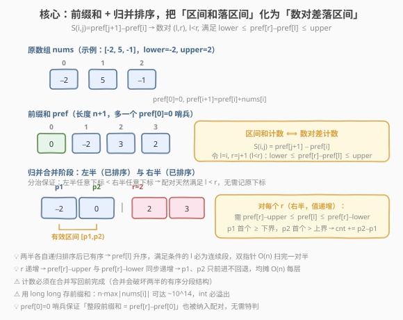
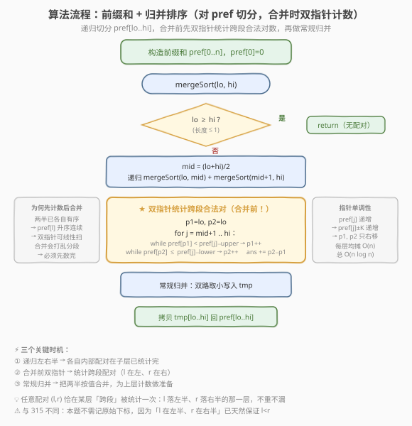

# LeetCode 区间和的个数 题解

## 1. 题目概述

- **标题 / 题号**：区间和的个数（#327，hard）
- **链接**：https://leetcode.cn/problems/count-of-range-sum/
- **难度**：困难
- **标签**：数组、分治、归并排序、树状数组、前缀和

**题意**：给定一个整数数组 `nums` 以及两个整数 `lower` 和 `upper`，求数组中**满足区间和落在 `[lower, upper]` 内的子区间个数**。

形式化地，定义 $S(i, j) = \sum_{k=i}^{j} \text{nums}[k]$（$0 \le i \le j < n$），求满足 $lower \le S(i, j) \le upper$ 的数对 $(i, j)$ 的个数。

**示例 1**：

```text
输入：nums = [-2,5,-1], lower = -2, upper = 2
输出：3
解释：满足条件的区间和有三个：
  S(0,0) = -2         ∈ [-2, 2] ✓
  S(0,2) = -2+5+(-1)=2 ∈ [-2, 2] ✓
  S(2,2) = -1         ∈ [-2, 2] ✓
  其余区间和：S(0,1)=3, S(1,1)=5, S(1,2)=4 均超出 [-2,2]
```

**示例 2**：

```text
输入：nums = [0], lower = 0, upper = 0
输出：1
解释：S(0,0)=0 ∈ [0,0] ✓
```

**约束**：

- $1 \le \text{nums.length} \le 10^5$
- $-2^{31} \le \text{nums}[i], \text{lower}, \text{upper} \le 2^{31}-1$
- 题目保证结果在 32 位有符号整数范围内

> 💡 本题是 [315. 计算右侧小于当前元素的个数](315_计算右侧小于当前元素的个数.md) 的「**前缀和版**」姊妹题：315 在归并合并时统计「右半比左半小」的数对，327 则统计「右半减左半落在某区间」的数对。两者骨架同为**归并排序 + 合并阶段双指针计数**，是分治计数家族的核心成员，字节、Google、Meta 高频。

## 2. 解题思路

### 2.1 暴力思路：双重循环枚举所有区间

最直观做法：枚举所有 $0 \le i \le j < n$，逐个求 $S(i,j)$ 并判定。

```text
for i in range(n):
    s = 0
    for j in range(i, n):
        s += nums[j]
        if lower <= s <= upper:
            ans += 1
```

> ⚠️ **致命缺陷**：$n \le 10^5$ 时区间总数达 $\binom{n+1}{2} \approx 5 \times 10^9$，必然超时。需要找到「**批量统计**」数对的方法，思路与逆序对、315 一脉相承——用**归并排序**在合并阶段一次性结算跨段配对。

### 2.2 核心观察：前缀和 + 归并排序，把「区间和落区间」化为「数对差落区间」



**第一步：前缀和降维**。引入长度 $n+1$ 的前缀和数组 $\text{pref}[0..n]$，其中 $\text{pref}[0]=0$，$\text{pref}[i+1] = \text{pref}[i] + \text{nums}[i]$。则任意区间和可表为两式之差：

$$S(i, j) = \text{pref}[j+1] - \text{pref}[i], \quad 0 \le i \le j < n$$

令 $l = i$，$r = j+1$，则 $0 \le l < r \le n$。**区间和计数问题**转化为：

> 统计满足 $l < r$ 且 $lower \le \text{pref}[r] - \text{pref}[l] \le upper$ 的数对 $(l, r)$ 个数。

把关于 $r$ 的不等式变形，得到 $\text{pref}[l]$ 的取值范围：

$$\text{pref}[r] - upper \le \text{pref}[l] \le \text{pref}[r] - lower$$

> 💡 **哨兵 $\text{pref}[0]=0$** 的作用：它把「整段前缀和 $S(0,j)=\text{pref}[j+1]$」也纳入 $(l=0, r=j+1)$ 的配对形式，无需特判从下标 0 开始的区间。

**第二步：归并排序 + 合并阶段双指针计数**。对 $\text{pref}[0..n]$ 做归并排序。在合并左半 $\text{pref}[lo..mid]$ 与右半 $\text{pref}[mid+1..hi]$ 时，统计**跨段配对**——$l$ 落在左半、$r$ 落在右半且满足差式条件的对数。

关键洞察有三：

1. **跨段天然满足 $l < r$**：分治切分按下标区间，左半任意下标 $<$ 右半任意下标。因此跨段配对自动满足 $l < r$，**无需像 315 那样维护索引数组**——只需对值排序、对值计数。
2. **两半已有序 → 合法 $l$ 是连续段**：递归完成后，左半、右半各自按值升序。对固定的 $r$，满足 $\text{pref}[r]-upper \le \text{pref}[l] \le \text{pref}[r]-lower$ 的 $\text{pref}[l]$ 在升序数组中是连续区间，可用两个指针 $p1, p2$ 定位：$p1$ 指向首个 $\ge \text{pref}[r]-upper$ 的位置，$p2$ 指向首个 $> \text{pref}[r]-lower$ 的位置，个数 $= p2 - p1$。
3. **$r$ 递增 → 两指针只前进**：$\text{pref}[r]$ 在右半升序，故 $\text{pref}[r]-upper$ 与 $\text{pref}[r]-lower$ 同步递增，$p1, p2$ 单调右移，均摊 $O(n)$ 每层。

> ⚠️ **为什么不需要索引数组（与 315 的关键区别）**：315 要求「**每个位置**单独的右侧更小个数」，必须把计数归属到原始下标，故需 `idx[]` 跟随；本题只求「**满足条件的配对总数**」，且 $l < r$ 已由分治跨段结构天然保证，无需归属——直接对排好序的值用双指针数出个数即可。

### 2.3 算法流程图



**完整步骤**：

1. **构造前缀和**：`pref[0..n]`，`pref[0]=0`，`pref[i+1] = pref[i] + nums[i]`。注意用 `long long`，因为 $n \cdot \max|\text{nums}[i]|$ 可达 $\sim 10^{14}$，`int` 必溢出。
2. **递归切分**：`mergeSort(lo, hi)`，若 `lo >= hi` 返回（长度 $\le 1$ 无配对）。
3. **分治**：`mid = (lo + hi) / 2`，递归左右半——子层会各自统计完「段内配对」。
4. **跨段计数**（在合并**之前**，此时两半仍各自有序）：
   - `p1 = lo, p2 = lo`
   - 对每个 `j` 从 `mid+1` 到 `hi`（右半值 `pref[j]` 递增）：
     - `while p1 <= mid && pref[p1] < pref[j] - upper: ++p1`（首个 $\ge$ 下界）
     - `while p2 <= mid && pref[p2] <= pref[j] - lower: ++p2`（首个 $>$ 上界）
     - `ans += p2 - p1`
5. **常规归并**：双路取小写入 `tmp`，拷回 `pref[lo..hi]`——为上层计数准备有序分段。
6. **返回** `ans`。

> 💡 **为何先计数后合并**：合并会重写 `pref[lo..hi]`，破坏「左半、右半各自有序」的分段结构，双指针的连续段假设就失效了。所以计数必须在合并之前完成。

### 2.4 示例演算

以 `nums = [-2, 5, -1]`，`lower = -2`，`upper = 2` 为例，完整演示归并树每层的双指针计数。

![示例演算：[-2,5,-1] → 3](../images/count_range_sum_walkthrough.svg)

**前缀和**：$\text{pref} = [0, -2, 3, 2]$（长度 $n+1 = 4$，递归区间 $[0, 3]$）。

**合法配对预览**（$l < r$，差 $\in [-2, 2]$）：

| 配对 $(l, r)$ | $\text{pref}[r] - \text{pref}[l]$ | 是否合法 |
|---------------|-----------------------------------|----------|
| $(0, 1)$ | $-2 - 0 = -2$ | ✓ |
| $(0, 2)$ | $3 - 0 = 3$ | ✗ |
| $(0, 3)$ | $2 - 0 = 2$ | ✓ |
| $(1, 2)$ | $3 - (-2) = 5$ | ✗ |
| $(1, 3)$ | $2 - (-2) = 4$ | ✗ |
| $(2, 3)$ | $2 - 3 = -1$ | ✓ |

共 3 个合法配对。

**递归树（自底向上）**：

| 层级 | 合并对象 | 计数结果 | 合并后 pref 段 |
|------|----------|----------|----------------|
| 1a | `merge(0,0,1)`：左=[0] 右=[−2] | `ans += 1`（配对 (0,1)） | `[−2, 0]` |
| 1b | `merge(2,2,3)`：左=[3] 右=[2] | `ans += 1`（配对 (2,3)） | `[2, 3]` |
| 0 | `merge(0,1,3)`：左=[−2,0] 右=[2,3] | `ans += 1`（配对 (0,3)） | `[−2, 0, 2, 3]` |

**第 0 层双指针细节**（`lo=0, mid=1, hi=3`，左半升序 `[−2, 0]`，右半升序 `[2, 3]`）：

| j | pref[j] | [下界, 上界] = [pref[j]−upper, pref[j]−lower] | p1 扫描 | p2 扫描 | ans += | 命中配对 |
|---|---------|-----------------------------------------------|---------|---------|--------|----------|
| 2 | 2 | [0, 4] | pref[0]=−2 < 0 → p1=1；pref[1]=0 ≥ 0 停 | pref[0]=−2 ≤ 4 → p2=1；pref[1]=0 ≤ 4 → p2=2 | 2−1 = 1 | (0,3): 2−0=2 ✓ |
| 3 | 3 | [1, 5] | pref[1]=0 < 1 → p1=2（超 mid 停） | p2=2 超 mid 停 | 2−2 = 0 | 无 |

最终 `ans = 1 + 1 + 1 = 3`，与示例一致。

> 💡 **跨层不重不漏**：任意配对 $(l, r)$ 在递归树中恰被统计一次——在「$l$ 落左半、$r$ 落右半」的那一层。段内配对在更深层已被统计，跨段配对在本层统计，递归结构天然保证每个 $l < r$ 配对划归到唯一跨段层。

## 3. 参考代码

### C++

```cpp
class Solution {
    int lower_;
    int upper_;
    vector<long long> tmp_;
    int ans_;
  public:
    int countRangeSum(vector<int>& nums, int lower, int upper) {
        lower_ = lower;
        upper_ = upper;
        int n = nums.size();
        vector<long long> pref(n + 1, 0);
        for (int i = 0; i < n; ++i) pref[i + 1] = pref[i] + nums[i];
        tmp_.assign(n + 1, 0);
        ans_ = 0;
        mergeSort(pref, 0, n);
        return ans_;
    }

  private:
    void mergeSort(vector<long long>& pref, int lo, int hi) {
        if (lo >= hi) return;
        int mid = lo + (hi - lo) / 2;
        mergeSort(pref, lo, mid);
        mergeSort(pref, mid + 1, hi);
        countCross(pref, lo, mid, hi);
        merge(pref, lo, mid, hi);
    }

    void countCross(vector<long long>& pref, int lo, int mid, int hi) {
        int p1 = lo, p2 = lo;
        for (int j = mid + 1; j <= hi; ++j) {
            long long lo_bound = pref[j] - upper_;  // 需 pref[l] >= lo_bound
            long long hi_bound = pref[j] - lower_;  // 需 pref[l] <= hi_bound
            while (p1 <= mid && pref[p1] < lo_bound) ++p1;
            while (p2 <= mid && pref[p2] <= hi_bound) ++p2;
            ans_ += p2 - p1;
        }
    }

    void merge(vector<long long>& pref, int lo, int mid, int hi) {
        int i = lo, j = mid + 1, k = lo;
        while (i <= mid && j <= hi) {
            if (pref[i] <= pref[j]) tmp_[k++] = pref[i++];
            else                     tmp_[k++] = pref[j++];
        }
        while (i <= mid) tmp_[k++] = pref[i++];
        while (j <= hi)  tmp_[k++] = pref[j++];
        for (int p = lo; p <= hi; ++p) pref[p] = tmp_[p];
    }
};
```

### Python

```python
class Solution:
    def countRangeSum(self, nums: List[int], lower: int, upper: int) -> int:
        n = len(nums)
        pref = [0] * (n + 1)
        for i in range(n):
            pref[i + 1] = pref[i] + nums[i]
        tmp = [0] * (n + 1)
        ans = 0

        def merge_sort(lo: int, hi: int) -> None:
            nonlocal ans
            if lo >= hi:
                return
            mid = lo + (hi - lo) // 2
            merge_sort(lo, mid)
            merge_sort(mid + 1, hi)

            # 跨段双指针计数（合并前，两半各自有序）
            p1 = lo
            p2 = lo
            for j in range(mid + 1, hi + 1):
                lo_bound = pref[j] - upper
                hi_bound = pref[j] - lower
                while p1 <= mid and pref[p1] < lo_bound:
                    p1 += 1
                while p2 <= mid and pref[p2] <= hi_bound:
                    p2 += 1
                ans += p2 - p1

            # 常规归并
            i, j, k = lo, mid + 1, lo
            while i <= mid and j <= hi:
                if pref[i] <= pref[j]:
                    tmp[k] = pref[i]; i += 1
                else:
                    tmp[k] = pref[j]; j += 1
                k += 1
            while i <= mid:
                tmp[k] = pref[i]; i += 1; k += 1
            while j <= hi:
                tmp[k] = pref[j]; j += 1; k += 1
            for p in range(lo, hi + 1):
                pref[p] = tmp[p]

        merge_sort(0, n)
        return ans
```

> 💡 **Python 栈深**：$n = 10^5$ 时递归深度约 $\log_2(n+1) \approx 17$，远低于默认限制 1000，无需 `setrecursionlimit`。但 Python 递归常数较大，$n = 10^5$ 时可能接近时限，必要时可改为迭代式归并（自底向上逐层合并）。

> ⚠️ **`long long` 不可省**：约束 $-2^{31} \le \text{nums}[i] \le 2^{31}-1$，$n \le 10^5$，故 $|\text{pref}[i]|$ 可达 $2^{31} \times 10^5 \approx 2 \times 10^{14}$，超出 32 位 `int` 范围。Python 无此问题（大整数自动扩展），C++ 必须用 `long long`。

## 4. 复杂度分析

| 维度 | 复杂度 | 说明 |
|------|--------|------|
| **时间复杂度** | $O(n \log n)$ | 归并树共 $O(\log n)$ 层；每层跨段计数双指针均摊 $O(n)$（$p1, p2$ 单调右移，总计 $\le n + n$），合并亦 $O(n)$ |
| **空间复杂度** | $O(n)$ | `pref` $O(n)$、`tmp` $O(n)$；递归栈 $O(\log n)$，主导项为两个数组 |

> ⚠️ 双指针的 `while` 嵌在 `for` 里，看似 $O(n^2)$，但 $p1, p2$ 在一层内**只前进不回退**，合计位移 $\le 2 \cdot (\text{mid}-\text{lo}+1) \le 2n$。均摊到每个 $j$ 为 $O(1)$，整层 $O(n)$。

## 5. 扩展：树状数组解法

与 [315](315_计算右侧小于当前元素的个数.md)、[LCOF 51 逆序对](../0101-0200/LCOF51_数组中的逆序对.md) 一样，**树状数组**（BIT）也能 $O(n \log n)$ 解决本题，思路更「在线」：

1. **前缀和**：同样构造 $\text{pref}[0..n]$。
2. **离散化**：把所有需要查询/插入的值——即 $\{\text{pref}[i]\} \cup \{\text{pref}[i] - \text{upper}\} \cup \{\text{pref}[i] - \text{lower}\}$——排序去重，映射到 $1$-indexed 的 `rank`。
3. **从左往右**遍历 $i = 0 \dots n$：对每个 $\text{pref}[i]$，查询 BIT 中已插入的、值落在 $[\text{pref}[i] - \text{upper}, \text{pref}[i] - \text{lower}]$ 内的个数（即「以 $i$ 为右端点的合法区间和个数」），累加到答案；再把 $\text{pref}[i]$ 插入 BIT。

```cpp
class BIT {
    vector<int> tree;
    int n;
  public:
    BIT(int n) : tree(n + 1), n(n) {}
    void update(int i, int delta) {
        for (; i <= n; i += i & (-i)) tree[i] += delta;
    }
    int query(int i) {              // 前缀和 [1, i]
        int sum = 0;
        for (; i > 0; i -= i & (-i)) sum += tree[i];
        return sum;
    }
};

class Solution {
  public:
    int countRangeSum(vector<int>& nums, int lower, int upper) {
        int n = nums.size();
        vector<long long> pref(n + 1, 0);
        for (int i = 0; i < n; ++i) pref[i + 1] = pref[i] + nums[i];

        // 离散化：收集所有可能查询的值
        vector<long long> vals;
        vals.reserve(3 * (n + 1));
        for (int i = 0; i <= n; ++i) {
            vals.push_back(pref[i]);
            vals.push_back(pref[i] - upper);   // 下界
            vals.push_back(pref[i] - lower);   // 上界
        }
        sort(vals.begin(), vals.end());
        vals.erase(unique(vals.begin(), vals.end()), vals.end());
        auto rank = [&](long long v) {
            return (int)(lower_bound(vals.begin(), vals.end(), v) - vals.begin() + 1);
        };

        BIT bit((int)vals.size());
        int ans = 0;
        for (int i = 0; i <= n; ++i) {
            int r_lo = rank(pref[i] - upper);          // 第一个 >= pref[i]-upper 的 rank
            int r_hi = rank(pref[i] - lower);          // 第一个 >= pref[i]-lower 的 rank
            // 需 pref[l] <= pref[i]-lower，等价于 rank <= r_hi_upper
            // 用 upper_bound 找严格大于 pref[i]-lower 的第一个 rank
            int r_hi_excl = (int)(upper_bound(vals.begin(), vals.end(), pref[i] - lower)
                                  - vals.begin()) + 1;  // 第一个 > 上界的 rank（不含）
            ans += bit.query(r_hi_excl - 1) - bit.query(r_lo - 1);
            bit.update(rank(pref[i]), 1);
        }
        return ans;
    }
};
```

> 💡 **归并 vs 树状数组**：
> - **归并排序**：一次分治搞定，不需离散化，常数小，面试默写首选。缺点是改动原数组（本题直接对 `pref` 排序，原始下标不再需要，无副作用）。
> - **树状数组**：需离散化预处理（值集合要包含 `pref[i]` 及其 ±upper/±lower 平移），但思路「在线」——逐个从左往右插入查询，天然适合「以 $i$ 为右端点」的逐位置统计。也是 [315](315_计算右侧小于当前元素的个数.md)、[493. 翻转对](https://leetcode.cn/problems/reverse-pairs/) 的备选解法。

> ⚠️ 上例中查询区间为 $[\text{pref}[i]-\text{upper}, \text{pref}[i]-\text{lower}]$ **闭区间**，用 `lower_bound` 取下界 rank、`upper_bound` 取「上界 + 1」rank 转半开区间，再 `query(r_hi_excl - 1) - query(r_lo - 1)` 求和。务必注意闭/半开区间的转换，这是 BIT 解法最常见的 off-by-one 错误源。

## 6. 面试要点

1. **为什么用前缀和把区间和转化为数对差？**

   - 区间和 $S(i,j)$ 直接枚举是 $O(n^2)$。引入前缀和后 $S(i,j) = \text{pref}[j+1] - \text{pref}[i]$，问题变成「统计满足 $lower \le \text{pref}[r] - \text{pref}[l] \le upper$ 且 $l < r$ 的数对」——这是经典的**数对差计数**结构，可用归并排序或树状数组 $O(n \log n)$ 解决。

2. **为什么本题不需要像 315 那样维护索引数组？**

   - 315 要求「**每个位置**的右侧更小个数」，必须把计数归属到原始下标，故需 `idx[]` 跟随。本题只求「满足条件的配对**总数**」，且 $l < r$ 的下标条件已由分治的跨段结构天然保证（左半下标全 $<$ 右半下标）——直接对排好序的值用双指针数出个数即可，无需归属。

3. **双指针 $p1, p2$ 的单调性从何而来？为什么是 $O(n)$ 而非 $O(n^2)$？**

   - 右半升序，故 $\text{pref}[j]$ 递增，$\text{pref}[j] - \text{upper}$ 与 $\text{pref}[j] - \text{lower}$ 同步递增。$p1$ 追踪首个 $\ge$ 下界的位置，$p2$ 追踪首个 $>$ 上界的位置——两个界点都递增，故 $p1, p2$ 在一层内只右移不回退。总位移 $\le 2n$，均摊 $O(1)$ 每个 $j$，整层 $O(n)$。

4. **为什么计数必须在合并之前？**

   - 计数依赖「左半、右半各自有序」的分段结构——这样满足条件的 $\text{pref}[l]$ 才是连续段，双指针才有效。合并会重写 `pref[lo..hi]` 为整体有序，破坏分段。所以必须先 `countCross` 再 `merge`。

5. **配对 $(l, r)$ 会不会被重复统计或遗漏？**

   - 不会。递归树把数组按下标区间层层切分。任意配对 $(l, r)$（$l < r$）在递归树中恰有一次「$l$ 落左半、$r$ 落右半」的跨段情形——那就是它被统计的唯一层。在更深层它要么都在同一段（尚未分离），要么已分离但本层只统计跨段。由分治的不重不漏保证。

6. **`long long` 和哨兵 `pref[0]=0` 分别解决什么问题？**

   - `long long`：$n \cdot \max|\text{nums}[i]| \approx 2^{31} \times 10^5 \approx 2 \times 10^{14}$，超 32 位 `int`，必须用 64 位。哨兵 `pref[0]=0`：让「从下标 0 开始的整段区间和 $S(0,j) = \text{pref}[j+1] - \text{pref}[0]$」也纳入 $(l=0, r=j+1)$ 的配对形式，统一处理，无需特判。

## 同类练习题

| # | 题目 | 与本题的关联 |
|---|------|-------------|
| 315 | [计算右侧小于当前元素的个数](https://leetcode.cn/problems/count-of-smaller-numbers-after-self/)（[题解](315_计算右侧小于当前元素的个数.md)） | 归并排序 + 索引数组的姊妹题，合并阶段统计「右半比左半小」的对数，本题统计「右半减左半落区间」的对数，骨架完全一致 |
| 剑指 Offer 51 | [数组中的逆序对](https://leetcode.cn/problems/shu-zu-zhong-de-ni-xu-dui-lcof/)（[题解](../0101-0200/LCOF51_数组中的逆序对.md)） | 归并计数家族的母题，只求逆序对总数，掌握 merge 模板后本题只需把「比较」换成「双指针数区间」 |
| 493 | [翻转对](https://leetcode.cn/problems/reverse-pairs/) | 归并框架不变，合并时统计 $\text{nums}[i] > 2 \cdot \text{nums}[j]$ 的对数，需额外双指针独立计数（与归并的取小分开跑） |
| 912 | [排序数组](https://leetcode.cn/problems/sort-an-array/)（[题解](../0901-1000/912_排序数组.md)） | 归并排序母题，掌握 merge 模板后本题只需在合并前插一段双指针计数 |
