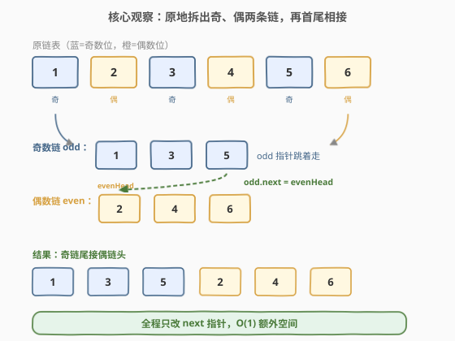
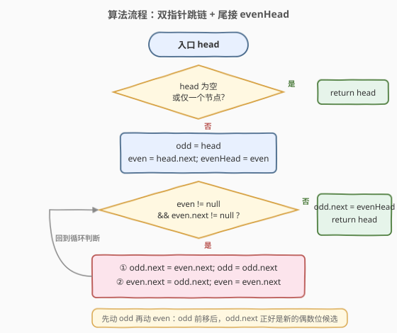
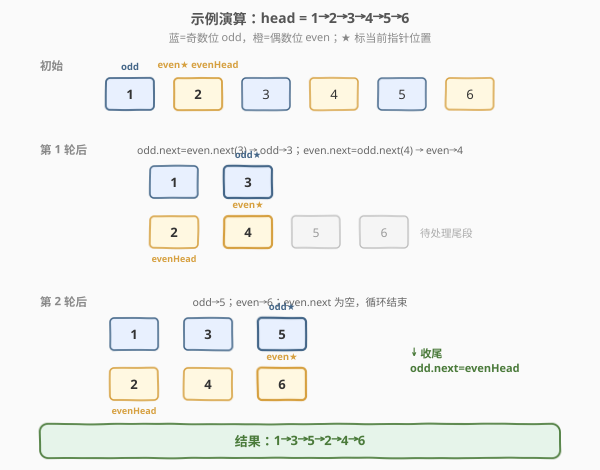

# 奇偶链表

- **题目名称**：奇偶链表
- **链接**：[328. 奇偶链表](https://leetcode.cn/problems/odd-even-linked-list/)
- **难度**：中等
- **标签**：链表、双指针

## 1. 题目概述

给定单链表的头节点 `head`，将所有**索引为奇数**的节点放在一起，**索引为偶数**的节点放在一起，返回重排后的链表。

- 第 1 个节点视为奇数位（索引 1），第 2 个节点为偶数位（索引 2），以此类推。
- 两个分组**内部**的相对顺序必须与原链表一致。
- 要求 `O(n)` 时间、`O(1)` 额外空间。

**示例 1**：

```text
输入：head = [1,2,3,4,5]
输出：[1,3,5,2,4]
解释：奇数位节点 1,3,5 在前，偶数位节点 2,4 在后，组内顺序不变。
```

**示例 2**：

```text
输入：head = [2,1,3,5,6,4,7]
输出：[2,3,6,7,1,5,4]
```

**约束条件**：

- 链表中节点数目在范围 `[0, 10^4]` 内
- `-10^6 <= Node.val <= 10^6`

> 💡 「奇偶」指的是**位置**（第几个）而非**节点值**的奇偶。这是审题最常见的坑。

---

## 2. 解题思路

### 2.1 暴力思路

遍历一遍链表，把奇数位节点值、偶数位节点值分别存进两个数组，再遍历原链表按「先奇后偶」的顺序覆写每个节点的 `val`。时间 `O(n)`、空间 `O(n)`，能过但**只改值不改指针**，不满足「真正重排链表结构」的进阶要求，面试中会被追问。

更直白的暴力是新建两条链表分别串起来再拼接，同样 `O(n)` 空间。我们需要的是**原地**操作。

### 2.2 核心观察：原地拆出奇、偶两条链，再首尾相接



关键直觉是：奇数位节点和偶数位节点在原链表里是**交替**出现的，我们用两个指针 `odd`、`even` 各自「跳着走」：

- `odd` 从第 1 个节点出发，每次跳到「下一个奇数位」= 当前 `even` 的下一个。
- `even` 从第 2 个节点出发，每次跳到「下一个偶数位」= 更新后 `odd` 的下一个。
- 用 `evenHead` 记住偶数链的头（第 2 个节点），最后把奇数链的尾接到 `evenHead` 上。

> 💡 **为什么循环条件是 `even != null && even.next != null`？** 因为 `odd` 的下一个候选是 `even.next`，`even` 的下一个候选是 `odd.next`（即新的 `even.next`）。当 `even` 或 `even.next` 为空时，说明偶数链已走到头，奇数链也随之处理完毕，可以收尾连接。

### 2.3 算法流程图



每一轮迭代做两件事：「奇数指针跨一格」「偶数指针跨一格」，二者**交替推进**，互为对方的跳板。循环结束后奇数链的尾节点 `odd.next` 指向 `evenHead`，即完成「奇链 + 偶链」的拼接。

### 2.4 示例演算



以 `1→2→3→4→5→6` 为例（为清楚展示两轮跳链，比示例多一个节点）：

- **初始**：`odd=1`、`even=2`、`evenHead=2`，原链 `1→2→3→4→5→6`。
- **第 1 轮**：`odd.next = even.next(3)`，`odd` 移到 `3`；`even.next = odd.next(4)`，`even` 移到 `4`。此时奇链 `1→3`，偶链 `2→4`，剩余 `5→6` 挂在 `4` 后。
- **第 2 轮**：`odd.next = even.next(5)`，`odd` 移到 `5`；`even.next = odd.next(6)`，`even` 移到 `6`。奇链 `1→3→5`，偶链 `2→4→6`。
- **结束**：`even.next` 为空，退出循环。`odd.next = evenHead(2)`，得到 `1→3→5→2→4→6`。

---

## 3. 参考代码

### C++

```cpp
/**
 * Definition for singly-linked list.
 * struct ListNode {
 *     int val;
 *     ListNode *next;
 *     ListNode() : val(0), next(nullptr) {}
 *     ListNode(int x) : val(x), next(nullptr) {}
 *     ListNode(int x, ListNode *next) : val(x), next(next) {}
 * };
 */
class Solution {
  public:
    ListNode* oddEvenList(ListNode* head) {
        if (head == nullptr || head->next == nullptr) {
            return head;
        }
        ListNode* odd = head;
        ListNode* even = head->next;
        ListNode* evenHead = even;          // 记住偶数链的头，最后要接回来

        while (even != nullptr && even->next != nullptr) {
            odd->next = even->next;         // 奇数指针跨到下一个奇数位
            odd = odd->next;
            even->next = odd->next;         // 偶数指针跨到下一个偶数位
            even = even->next;
        }
        odd->next = evenHead;               // 奇链尾接偶链头
        return head;
    }
};
```

### Python

```python
# Definition for singly-linked list.
# class ListNode:
#     def __init__(self, val=0, next=None):
#         self.val = val
#         self.next = next
class Solution:
    def oddEvenList(self, head: Optional[ListNode]) -> Optional[ListNode]:
        if not head or not head.next:
            return head

        odd = head
        even = head.next
        even_head = even                 # 记住偶数链的头，最后要接回来

        while even and even.next:
            odd.next = even.next         # 奇数指针跨到下一个奇数位
            odd = odd.next
            even.next = odd.next         # 偶数指针跨到下一个偶数位
            even = even.next

        odd.next = even_head             # 奇链尾接偶链头
        return head
```

> ⚠️ **赋值顺序很重要**：必须先 `odd.next = even.next` 并把 `odd` 前移，**再** `even.next = odd.next`。因为更新后的 `odd.next` 正好是「新的偶数位候选」。若先动 `even`，会丢失尚未处理的尾段。另外 `evenHead` 一定要在循环前保存，循环结束后 `even` 已指向偶数链尾部，无法再找回头。

---

## 4. 复杂度分析

| 维度 | 复杂度 | 说明 |
|------|--------|------|
| 时间复杂度 | O(n) | `odd`、`even` 各遍历约一半节点，总共访问每个节点常数次 |
| 空间复杂度 | O(1) | 只用 `odd`、`even`、`evenHead` 三个指针，原地修改指针 |

---

## 5. 扩展：「链表分离 / 重组」是一类通用模板

本题的骨架——**用几个指针把一条链按规则拆成几段，再按新顺序首尾相接**——是一个可迁移的模板：

- **拆成两段再拼接**：本题（按奇偶位置拆）、[86. 分隔链表](https://leetcode.cn/problems/partition-list/)（按值阈值拆）。
- **拆成两段再交错穿插**：[143. 重排链表](https://leetcode.cn/problems/reorder-list/)（找中点→翻转后半→交错合并，[题解](../0101-0200/143_重排链表.md)）。
- **拆成两段再轮转**：[61. 旋转链表](https://leetcode.cn/problems/rotate-list/)（先成环再断开）。

共同要点：**先记住每段的头/尾，调整 `next` 指针完成拆分，最后统一接线**，全程 `O(1)` 额外空间。

> 💡 若题目改成「按节点**值**的奇偶分组」（而非位置），思路类似但分组依据变成 `val % 2`，循环里用 `if` 判定而非固定跳格。

---

## 6. 面试要点

1. **为什么循环条件用 `even && even.next`，而不是 `odd && odd.next`？**

   - `odd` 的下一个候选是 `even.next`，必须保证 `even` 非空且 `even.next` 非空才能安全推进 `odd`。若改用 `odd` 判断，在偶数链已到尾时仍可能误进循环，造成 `even` 解引用空指针。

2. **`evenHead` 为什么必须在循环外保存？**

   - 循环结束后 `even` 指向偶数链的**最后一个**节点，头节点（第 2 个节点）已被「跳过」无法从 `even` 找回。不保存 `evenHead` 就接不回偶数链。

3. **为什么是「先动 odd 再动 even」的顺序，能反吗？**

   - 不能直接反。`even.next = odd.next` 依赖 `odd` 已前移到新位置；若先动 `even`，`odd.next` 还是旧的偶数节点，会把偶数链指向自己、形成环或丢失尾段。正确顺序保证两个指针互为跳板、稳步前进。

4. **空链表或只有一个节点要特判吗？**

   - 需要。`head` 或 `head->next` 为空时直接返回 `head`，否则 `even = head->next` 可能为空，循环条件虽能挡住，但提前返回更清晰、避免无谓赋值。

5. **面试官要求「不能修改指针、只能改值」怎么办？**

   - 那就退回暴力：遍历收集奇/偶位置的值到两个数组，再遍历按序覆写 `val`。但要主动说明这是 `O(n)` 空间、且不满足「真正重排结构」的进阶要求，并给出指针解法作为更优方案。

---

## 7. 同类练习题

- [86. 分隔链表](https://leetcode.cn/problems/partition-list/)：同样是「拆成两段再拼接」，只是分组依据从「位置奇偶」换成「值与 x 的大小」
- [143. 重排链表](https://leetcode.cn/problems/reorder-list/)（[题解](../0101-0200/143_重排链表.md)）：拆链 + 翻转 + 交错合并，是本题模板的进阶组合
- [61. 旋转链表](https://leetcode.cn/problems/rotate-list/)：拆成两段后「成环再断开」实现右旋，接线手法可对照
- [725. 分隔链表](https://leetcode.cn/problems/split-linked-list-in-parts/)：把链表按 k 段均分，拆分与切点计算的又一变体
- [24. 两两交换链表中的节点](https://leetcode.cn/problems/swap-nodes-in-pairs/)（[题解](../0001-0100/24_两两交换链表中的节点.md)）：同样是双指针在链表上「跳着走」改指针，骨架相近
