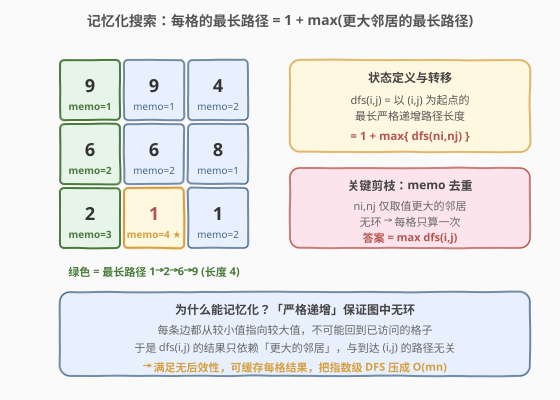
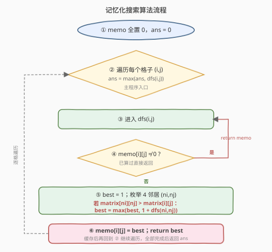
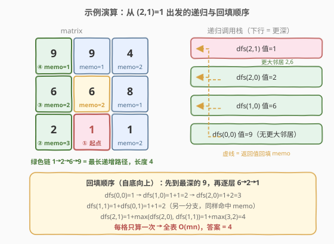
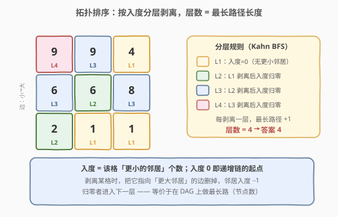

# LeetCode 矩阵中的最长递增路径 题解

## 1. 题目概述

- **标题 / 题号**：矩阵中的最长递增路径（#329，hard）
- **链接**：https://leetcode.cn/problems/longest-increasing-path-in-a-matrix/
- **难度**：困难
- **标签**：深度优先搜索、记忆化搜索、动态规划、拓扑排序、图

**题意**：给定一个 `m x n` 的整数矩阵 `matrix`，找出其中**最长严格递增路径**的长度。从每个格子出发，可以向上、下、左、右四个方向移动，但只能移动到**值严格更大**的相邻格子。可以任意选择起点，路径可以开始于任意格子。

**示例 1**：

```text
输入：matrix = [[9,9,4],[6,6,8],[2,1,1]]
输出：4
解释：最长递增路径为 [1, 2, 6, 9]，长度 4。
```

**示例 2**：

```text
输入：matrix = [[3,4,5],[3,2,6],[2,2,1]]
输出：4
解释：最长递增路径是 [3, 4, 5, 6] 或 [2, 4, 5, 6]，长度 4。
```

**约束**：

- `m == matrix.length`
- `n == matrix[i].length`
- `1 <= m, n <= 200`
- `-10^9 <= matrix[i][j] <= 10^9`

## 2. 解题思路

### 2.1 暴力思路

最直观的做法是**从每个格子出发做一次 DFS**，沿「值严格更大」的邻居不断深入，记录能走到的最大深度，最后取所有起点中的最大值。

问题在于：同一条递增链会被反复探索。例如从 `1` 出发走到 `9`，沿途 `2、6` 的子路径会被多次重复计算；当矩阵较大时，不同起点间共享的子路径呈指数级重叠，朴素 DFS 的时间复杂度退化为 $O(4^{mn})$，必然超时。

> 💡 **关键卡点**：朴素 DFS 之所以爆炸，是因为「从某格出发的最长递增路径长度」**与到达该格的历史路径无关**——无论从哪条路走到 `(i,j)`，`(i,j)` 之后能走多远都是固定的。这正是**无后效性**，意味着每格的结果可以缓存、复用。

### 2.2 核心观察：记忆化搜索



定义状态：

$$\text{dfs}(i,j) = \text{以 } (i,j) \text{ 为起点的最长严格递增路径长度}$$

只朝**值更大**的邻居递归，于是：

$$\text{dfs}(i,j) = 1 + \max_{(ni,nj)\text{ 是更大邻居}} \text{dfs}(ni,nj)$$

若没有更大的邻居，则 $\max$ 取 $0$，$\text{dfs}(i,j)=1$（只有自身一格）。最终答案为 $\max_{i,j} \text{dfs}(i,j)$。

**为什么能记忆化？** 「严格递增」保证整张图**无环**——每条边都从较小值指向较大值，不可能回到已访问的格子。因此 $\text{dfs}(i,j)$ 只依赖「更大的邻居」，与到达 `(i,j)` 的来路无关，满足无后效性。用一张 `memo` 表缓存每格结果，每格只计算一次，指数级 DFS 被压成 $O(mn)$。

> ⚠️ **易错点**：递归条件必须是「**严格更大**」`matrix[ni][nj] > matrix[i][j]`。若写成 `>=`，等值格子会互相递归形成环，DFS 陷入死循环、记忆化也不再成立。

### 2.3 算法流程图



核心骨架是「外层遍历每格 + 内层带缓存的 DFS」：

1. `memo` 全置 `0`（用 `0` 表示「未计算」，因为路径长度至少为 `1`，不会与有效值冲突）。
2. 对每个格子 `(i,j)` 调用 `dfs(i,j)`，用结果更新全局答案 `ans`。
3. `dfs(i,j)`：若 `memo[i][j] != 0` 直接返回（命中缓存）；否则 `best = 1`，枚举四邻居，对**值更大**的邻居递归 `best = max(best, 1 + dfs(ni,nj))`。
4. 写入 `memo[i][j] = best` 后返回。
5. 全部格子处理完，返回 `ans`。

### 2.4 示例演算



以示例 1 `matrix = [[9,9,4],[6,6,8],[2,1,1]]` 为例，观察从 `(2,1)=1` 出发的一次递归如何**自底向上**回填 `memo`：

| 递归层 | 调用 | 更大邻居 | 计算过程 | memo 回填 |
|--------|------|----------|----------|-----------|
| 1 | dfs(2,1)=1 | 左 2、上 6 | 先递归 dfs(2,0)，再 dfs(1,1) | 待回填 |
| 2 | dfs(2,0)=2 | 上 6 | 递归 dfs(1,0) | 待回填 |
| 3 | dfs(1,0)=6 | 上 9 | 递归 dfs(0,0) | 待回填 |
| 4 | dfs(0,0)=9 | 无 | base：返回 1 | memo[0][0]=1 |
| 回填 3 | — | — | 1 + dfs(0,0) = 1+1 = 2 | memo[1][0]=2 |
| 回填 2 | — | — | 1 + dfs(1,0) = 1+2 = 3 | memo[2][0]=3 |
| 另一分支 | dfs(1,1)=6 | 上 9 | 1 + dfs(0,1)=1+1=2 | memo[1][1]=2 |
| 回填 1 | — | — | 1 + max(dfs(2,0), dfs(1,1)) = 1+max(3,2) = 4 | memo[2][1]=4 |

注意第 4 层到达值最大的 `9` 后无更大邻居，作为 base case 返回 `1`；随后逐层返回，每返回一层就把它写入 `memo`。当 `(2,1)` 还要检查另一个分支 `dfs(1,1)=6` 时，`6` 又去查 `9`——但 `9` 已在 `memo` 中，直接命中返回 `1`，不重复展开。这正是记忆化把指数复杂度压平的关键。全表算完后 `max(memo) = 4`，即答案。

## 3. 参考代码

### 方法一：记忆化搜索（推荐）

### C++

```cpp
class Solution {
    int m, n;
    vector<vector<int>> memo;
    int dirs[4][2] = {{0, 1}, {0, -1}, {1, 0}, {-1, 0}};
  public:
    int longestIncreasingPath(vector<vector<int>>& matrix) {
        m = matrix.size();
        n = matrix[0].size();
        memo.assign(m, vector<int>(n, 0));
        int ans = 0;
        for (int i = 0; i < m; ++i)
            for (int j = 0; j < n; ++j)
                ans = max(ans, dfs(matrix, i, j));
        return ans;
    }
    int dfs(vector<vector<int>>& mat, int i, int j) {
        if (memo[i][j] != 0) return memo[i][j];   // 命中缓存
        int best = 1;                              // 至少包含自身
        for (auto& d : dirs) {
            int ni = i + d[0], nj = j + d[1];
            if (ni >= 0 && ni < m && nj >= 0 && nj < n && mat[ni][nj] > mat[i][j])
                best = max(best, 1 + dfs(mat, ni, nj));
        }
        return memo[i][j] = best;
    }
};
```

### Python

```python
class Solution:
    def longestIncreasingPath(self, matrix: List[List[int]]) -> int:
        m, n = len(matrix), len(matrix[0])
        memo = [[0] * n for _ in range(m)]
        dirs = [(0, 1), (0, -1), (1, 0), (-1, 0)]

        def dfs(i: int, j: int) -> int:
            if memo[i][j] != 0:
                return memo[i][j]            # 命中缓存
            best = 1                         # 至少包含自身
            for di, dj in dirs:
                ni, nj = i + di, j + dj
                if 0 <= ni < m and 0 <= nj < n and matrix[ni][nj] > matrix[i][j]:
                    best = max(best, 1 + dfs(ni, nj))
            memo[i][j] = best
            return best

        return max(dfs(i, j) for i in range(m) for j in range(n))
```

> 💡 **细节**：`memo` 初值取 `0` 而非 `-1`，是因为任何有效路径长度都 $\ge 1$，`0` 天然表示「未计算」，省去单独初始化。外层不必关心遍历顺序——无论先访问哪个格子，递归会自动把依赖的「更大邻居」先算好并缓存。

## 4. 复杂度分析

| 维度 | 复杂度 | 说明 |
|------|--------|------|
| 时间复杂度 | $O(mn)$ | 每格只计算一次并缓存；四邻居查询为常数，总计 $4mn$ 次边遍历 |
| 空间复杂度 | $O(mn)$ | `memo` 表 $O(mn)$；递归栈最深 $O(mn)$（整条单调链） |

> ⚠️ 递归深度最坏为整条严格递增链的长度，上界 $mn$（如矩阵严格递增铺满）。$m,n\le 200$ 时 $mn\le 4\times10^4$，远低于 Python 默认递归上限（1000）会超——**Python 实现需手动调大递归栈**：`sys.setrecursionlimit(10**6)`，或改用下方拓扑排序的迭代写法规避。C++ 默认栈足够。

## 5. 扩展：拓扑排序（迭代，规避递归栈）

把矩阵看成一个 **DAG**：每条边从较小格指向相邻的较大格。则「最长递增路径」就是该 DAG 上的**最长路径**，可用 **Kahn 拓扑排序（入度 BFS）** 求解：把入度为 0 的格子（没有更小邻居，即递增链起点）入队，逐层剥离；**剥离的层数即为最长路径长度**。



- 建图时统计每个格子的入度：对 `(i,j)`，若邻居 `(ni,nj)` 值更大，则连边 `(i,j) -> (ni,nj)`，`indeg[ni][nj]++`。
- 入度为 0 的格子全部入队，作为第 1 层。
- 每次 BFS 取出当前层全部节点，沿出边松弛邻居的入度，入度归零者入下一层；**层数计数 +1**。
- BFS 结束时的层数即为答案（最长路径上的节点数）。

### C++

```cpp
class Solution {
  public:
    int longestIncreasingPath(vector<vector<int>>& matrix) {
        int m = matrix.size(), n = matrix[0].size();
        int dirs[4][2] = {{0, 1}, {0, -1}, {1, 0}, {-1, 0}};
        vector<vector<int>> indeg(m, vector<int>(n, 0));

        for (int i = 0; i < m; ++i)
            for (int j = 0; j < n; ++j)
                for (auto& d : dirs) {
                    int ni = i + d[0], nj = j + d[1];
                    if (ni >= 0 && ni < m && nj >= 0 && nj < n
                        && matrix[ni][nj] > matrix[i][j])
                        indeg[ni][nj]++;          // 边 (i,j) -> (ni,nj)
                }

        queue<pair<int,int>> q;
        for (int i = 0; i < m; ++i)
            for (int j = 0; j < n; ++j)
                if (indeg[i][j] == 0) q.push({i, j});

        int ans = 0;
        while (!q.empty()) {
            int sz = q.size();
            ++ans;                                // 又剥掉一层
            while (sz--) {
                auto [i, j] = q.front(); q.pop();
                for (auto& d : dirs) {
                    int ni = i + d[0], nj = j + d[1];
                    if (ni >= 0 && ni < m && nj >= 0 && nj < n
                        && matrix[ni][nj] > matrix[i][j])
                        if (--indeg[ni][nj] == 0) q.push({ni, nj});
                }
            }
        }
        return ans;
    }
};
```

> 💡 **两种方法的关系**：记忆化搜索是「**按起点**自顶向下递归、自底向上回填」；拓扑排序是「**按入度**自底向上迭代、逐层剥离」。二者求的是同一个 DAG 的最长路径，复杂度同为 $O(mn)$。面试中记忆化搜索更短、更贴近直觉，是首选；当语言递归栈受限或题目要求迭代时，拓扑排序是无递归的稳妥替代。

## 6. 面试要点

1. **为什么朴素 DFS 会超时，记忆化后是 $O(mn)$？**
   - 朴素 DFS 不缓存，同一条递增子链被多个起点反复探索，最坏 $O(4^{mn})$。记忆化利用「**严格递增 → 无环 → 无后效性**」，每格结果只算一次并复用，总计 $O(mn)$。

2. **记忆化的状态为什么满足无后效性？**
   - 「严格更大」保证有向边只从小值指向大值，图中无环；`dfs(i,j)` 只依赖更大的邻居，与到达 `(i,j)` 的来路无关，因此可缓存。

3. **递归条件为什么必须严格大于？**
   - 写成 `>=` 会让等值格子互相递归，形成环，DFS 死循环、记忆化失效。`>` 是「无环」成立的前提。

4. **`memo` 初值用 `0` 还是 `-1`？**
   - 用 `0` 即可：任何有效路径长度 $\ge 1$，`0` 天然表示「未计算」，省去额外初始化。若把「未计算」也定义成 `-1` 则需先全表填 `-1`，多一次 $O(mn)$ 初始化。

5. **记忆化搜索 vs 拓扑排序，如何选？**
   - 记忆化代码短、贴近「最长路径 = 1 + 更大邻居」的直觉，面试首选。但 Python 默认递归上限 1000，$mn$ 较大时会爆栈，需 `setrecursionlimit` 或改用迭代的拓扑排序。两者复杂度相同。

6. **能否改写成自底向上的 DP？**
   - 可以。把格子按值**从小到大**排序，依次 `dp[i][j] = 1 + max(dp[更大邻居])`（更大邻居值更大、已先算好）。逻辑等价于拓扑排序（按值排序就是天然拓扑序），但需额外排序 $O(mn\log(mn))$，常数不如记忆化或 Kahn BFS。

## 同类练习题

| # | 题目 | 与本题的关联 |
|---|------|-------------|
| 2328 | [网格图中递增路径的数目](https://leetcode.cn/problems/number-of-increasing-paths-in-a-grid/) | 同一张「严格递增 DAG」，把「最长长度」换成「路径数取模」，记忆化骨架完全一致 |
| 1301 | [最大得分的路径数目](https://leetcode.cn/problems/number-of-paths-with-max-score/) | 在带权 DAG 上同时求最长路径与计数，记忆化搜索维护 (最大值, 方案数) 二元组 |
| 207 | [课程表](https://leetcode.cn/problems/course-schedule/)（[题解](../0201-0300/207_课程表.md)） | 拓扑排序模板题，本题扩展解法的 Kahn BFS 即源于此 |
| 62 | [不同路径](https://leetcode.cn/problems/unique-paths/)（[题解](../0001-0100/62_不同路径.md)） | 网格 DP 入门，对比「无后效性网格 DP」与「带缓存的 DAG 最长路径」 |
| 79 | [单词搜索](https://leetcode.cn/problems/word-search/)（[题解](../0001-0100/79_单词搜索.md)） | 同样在网格上 DFS，但本题靠「无环」可记忆化，单词搜索需回溯（可重复走不同路径），注意区分 |
