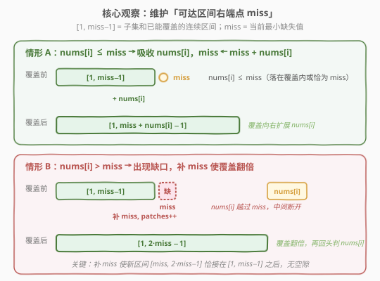
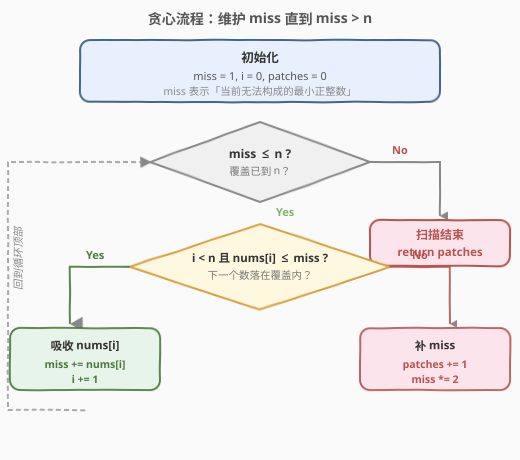

# 按要求补齐数组

- **题目名称**：按要求补齐数组
- **链接**：[330. 按要求补齐数组](https://leetcode.cn/problems/patching-array/)
- **难度**：困难
- **标签**：贪心、数组、数学

## 1. 题目概述

给定一个**升序排序**的正整数数组 `nums` 和一个正整数 `n`。允许向 `nums` 中添加任意正整数（**补丁**），使得添加后 `nums` 的**子集和**（取若干元素求和，每个元素最多用一次）能够覆盖 `[1, n]` 内的每一个整数。

返回**最少需要添加的补丁数**。

**示例 1**：

```text
输入：nums = [1,3], n = 6
输出：1
解释：补 1 个数 2 即可。新数组 [1,2,3] 的子集和：
  1=1, 2=2, 3=3, 1+3=4, 2+3=5, 1+2+3=6 → 覆盖 [1,6]。
```

**示例 2**：

```text
输入：nums = [1,5,10], n = 20
输出：2
解释：补 {2, 4} 两个数。新数组 [1,2,4,5,10] 的子集和可覆盖 [1, 22] ⊇ [1, 20]。
```

**示例 3**：

```text
输入：nums = [1,2,2], n = 5
输出：0
解释：原数组子集和 1, 2, 3(=1+2), 4(=2+2), 5(=1+2+2) 已覆盖 [1, 5]。
```

**约束条件**：

- $1 \leq \text{nums.length} \leq 1000$
- $1 \leq \text{nums}[i] \leq 10^4$
- `nums` 按**升序**排列
- $1 \leq n \leq 2^{31} - 1$

> 💡 关键信号：`n` 可达 $2^{31}-1 \approx 2.1 \times 10^9$，任何"枚举子集和"或"逐个验证"的做法都会爆。题目问"最少补丁"，结构上像**贪心**——能否找到一个"每补一个就最大化覆盖扩展"的策略？

---

## 2. 解题思路

### 2.1 暴力思路：枚举补丁组合

最直觉的做法：枚举所有可能的补丁集合 $P \subseteq [1, n]$，对每个 $P$ 验证 `nums ∪ P` 的子集和是否覆盖 `[1, n]`，取最小的 $|P|$。

- 子集和验证本身是 **NP 完全**的（背包判定），单次验证 $O(2^{|\text{nums}|+|P|})$；
- 补丁集合的枚举又是 $O(2^n)$ 级别。

$n = 2^{31}-1$ 时完全不可行。

> ⚠️ 暴力的瓶颈在于"先选补丁再验证"。换视角：**不枚举补丁，而是扫描 `[1, n]` 找出第一个无法构成的数，针对性地补一个**。这正是贪心的破局点。

### 2.2 核心观察：维护「可达区间右端点 miss」



定义 `miss` = **当前用已处理元素无法通过子集和构成的最小正整数**。等价地，`[1, miss-1]` 都能用子集和构成（连续覆盖），而 `miss` 暂时构不出来。

初始时没处理任何元素，只有空子集和为 0，所以 `miss = 1`。

**关键引理**（覆盖扩展）：若已能覆盖 `[1, miss-1]`，加入一个值 $x \leq \text{miss}$，则新区间为 $[1, \text{miss}+x-1]$。

- 证明：原覆盖 $[1, \text{miss}-1]$；加入 $x$ 后多出 $\{x, x+1, \dots, x+\text{miss}-1\}$（$x$ 加上原覆盖中的每个和）。因 $x \leq \text{miss}$，新区间 $[x, x+\text{miss}-1]$ 与原 $[1, \text{miss}-1]$ **相接或重叠**（$x \leq \text{miss}$ 即 $x \leq (\text{miss}-1)+1$），合起来无空隙，覆盖扩展为 $[1, x+\text{miss}-1]$。

由此得贪心策略（数组已升序）：

- 若 `nums[i] ≤ miss`：**吸收** `nums[i]`，`miss ← miss + nums[i]`，`i += 1`。
- 若 `nums[i] > miss`（或 `i` 已用完）：**出现缺口**，必须补一个数。最优补的就是 `miss` 本身——它让新区间 $[\text{miss}, 2\cdot\text{miss}-1]$ 恰接在 $[1, \text{miss}-1]$ 之后，覆盖翻倍为 $[1, 2\cdot\text{miss}-1]$。`patches += 1`，`miss ← 2 * miss`，`i` 不动（下次再判 `nums[i]`）。

直到 `miss > n` 时停止。

> 💡 **为什么补 `miss` 而不是别的数？** 在"必须补一个数才能跨越 `miss` 这个缺口"的前提下，补 `miss` 让覆盖向右推进得**最远**（翻倍）。补任何更小的数 $y < \text{miss}$ 都不能跨越缺口（$y \leq \text{miss}-1$ 已在覆盖内，补它无用）；补更大的数 $y > \text{miss}$ 则留下 `miss` 这个洞，仍无法覆盖。所以 `miss` 是**唯一**合理选择，且使覆盖扩展最大化。这是贪心选择性质的来源。

### 2.3 算法流程图



三个状态变量：

- `miss`：当前可达区间右端点 + 1（即 `[1, miss-1]` 已覆盖，`miss` 待覆盖），初始 1；
- `i`：`nums` 的扫描下标，初始 0；
- `patches`：补丁计数，初始 0。

每轮判 `miss ≤ n`：是则进一步判 `i < len(nums) && nums[i] ≤ miss`——吸收或补丁；否则结束返回 `patches`。

> ⚠️ 注意 `i` 用完后（`i == len(nums)`）但 `miss ≤ n` 仍成立时，走"补丁"分支继续翻倍，直到 `miss > n`。这对应原数组不足以覆盖 `[1, n]` 时继续补数的情形。

### 2.4 示例演算

![示例演算：nums=[1,5,10], n=20 的逐步决策](../images/patching_array_example_walkthrough.svg)

以 `nums = [1,5,10], n = 20` 为例，跟踪 `miss` 演化：

| 步骤 | miss 变化 | i, nums[i] | 判定 | 动作 | patches |
|------|-----------|------------|------|------|---------|
| 0 | 1 | 0, — | 初始 | — | 0 |
| 1 | 1 → 2 | 0, nums[0]=1 | 1 ≤ 1 ✓ | 吸收 nums[0], i=1 | 0 |
| 2 | 2 → 4 | 1, nums[1]=5 | 5 > 2 ✗ | 补 2, miss×2 | 1 |
| 3 | 4 → 8 | 1, nums[1]=5 | 5 > 4 ✗ | 补 4, miss×2 | 2 |
| 4 | 8 → 13 | 1, nums[1]=5 | 5 ≤ 8 ✓ | 吸收 nums[1], i=2 | 2 |
| 5 | 13 → 23 | 2, nums[2]=10 | 10 ≤ 13 ✓ | 吸收 nums[2], i=3 | 2 |
| 6 | 23 | 3, — | 23 > 20 ✓ | 结束 | **2** |

补了 `{2, 4}` 两个数。验证：`[1,2,4,5,10]` 的子集和可覆盖 $[1, 22] \supseteq [1, 20]$ ✓。

> 💡 注意步骤 2、3 连续补了两次（`nums[1]=5` 一直够不着），每次 `miss` 翻倍。这正是"补 `miss` 让覆盖最大化"的直接体现——一次补丁就把覆盖从 $[1,1]$ 推到 $[1,3]$、再推到 $[1,7]$，两步就追上了 `nums[1]=5`。

---

## 3. 参考代码

### C++

```cpp
class Solution {
  public:
    int minPatches(vector<int>& nums, int n) {
        long long miss = 1;      // 当前无法构成的最小正整数
        int i = 0;
        int patches = 0;
        while (miss <= n) {
            if (i < (int)nums.size() && nums[i] <= miss) {
                miss += nums[i]; // 吸收 nums[i]，覆盖扩展
                ++i;
            } else {
                miss += miss;    // 补 miss 本身，覆盖翻倍
                ++patches;
            }
        }
        return patches;
    }
};
```

### Python

```python
class Solution:
    def minPatches(self, nums: List[int], n: int) -> int:
        miss = 1        # 当前无法构成的最小正整数
        i = 0
        patches = 0
        while miss <= n:
            if i < len(nums) and nums[i] <= miss:
                miss += nums[i]   # 吸收 nums[i]，覆盖扩展
                i += 1
            else:
                miss += miss      # 补 miss 本身，覆盖翻倍
                patches += 1
        return patches
```

> ⚠️ **溢出陷阱**：`n` 可达 $2^{31}-1$，`miss` 在翻倍过程中会超过 `n`，可能达到 $2^{32}$ 量级。C++ 中 `miss` **必须用 `long long`**（`int` 会溢出导致死循环）；Python 无此问题。循环条件 `miss <= n` 在 `miss` 翻倍超过 `n` 后自然终止。

> 💡 `miss += miss` 比 `miss *= 2` 更能体现"补 `miss` 本身使覆盖扩展 `miss` 这么多"的语义，二者等价。

---

## 4. 复杂度分析

| 维度 | 复杂度 | 说明 |
|------|--------|------|
| 时间复杂度 | $O(m + \log n)$ | $m = \text{len(nums)}$：每个 `nums[i]` 至多被吸收一次（$O(m)$）；补丁分支每次 `miss` 翻倍，从 1 到超过 $n$ 最多 $\lceil \log_2 n \rceil$ 次（$O(\log n)$）。两者合计 |
| 空间复杂度 | $O(1)$ | 仅用 `miss`、`i`、`patches` 三个变量 |

> 💡 $n = 2^{31}-1$ 时 $\log_2 n \approx 31$，$m \leq 1000$，总操作约 $10^3$ 量级——这正是贪心"每步最大化覆盖"换来的指数级降本。

---

## 5. 扩展：贪心正确性的交换论证

**命题**：上述贪心策略返回的 `patches` 是最少的补丁数。

**证明思路**（交换论证）：设某最优解 $S^*$ 补的数为 $y_1 < y_2 < \dots < y_k$（$k = |S^*|$），按时间顺序作用。设贪心解补的数为 $x_1 < x_2 < \dots < x_g$（$g$ 为贪心返回值），且每个 $x_j$ 都等于补丁时刻的 `miss` 值。

**关键引理**：在任何时刻 $t$，贪心维护的 `miss_t` 是该时刻（给定已处理的 `nums` 前缀和已补的数）的**最小不可构成数**；任何其他策略在该时刻的可达区间右端点 $\leq \text{miss}_t$（否则就违反了 `miss_t` 的"最小不可构成"定义——可达区间更长意味着 `miss_t` 已被覆盖）。

由此，若某策略在时刻 $t$ 选择补 $y \neq \text{miss}_t$：

- 若 $y < \text{miss}_t$：$y$ 已在 $[1, \text{miss}_t - 1]$ 内（可构成），补它**不扩展覆盖**，浪费一步；
- 若 $y > \text{miss}_t$：补 $y$ 后 `miss_t` 仍不可构成，**缺口未补上**，后续必须再补一个 $\leq \text{miss}_t$ 的数才能跨越。把那个数提前到此刻等价于补 `miss_t`，且补丁数不增。

故任何最优解都可逐步替换为"补 `miss_t`"的策略而不增加补丁数，即 $g \leq k$。又因 $S^*$ 最优有 $k \leq g$，故 $g = k$。$\square$

> 💡 **直观版本**：每补一个数，覆盖右端点最多翻倍（补 `miss` 恰好翻倍，补别的更少）。要把覆盖从 1 推到 $n$，至少需要 $\lceil \log_2 n \rceil$ 次翻倍；贪心每步都翻倍，达到了这个下界（在 `nums` 全部吸收完毕后的纯补丁阶段）。这是**信息论下界**的视角。

**变体**：若允许添加的补丁必须取自某个给定集合 $D$（而非任意正整数），则失去"翻倍自由"，退化为更难的覆盖问题，可能需要 DP 或二分图匹配。本题的简洁性来自"补丁可任取"这一前提。

---

## 6. 面试要点

1. **`miss` 这个状态变量是怎么想到的？**

   - 关键观察：子集和问题中，"能覆盖 `[1, x]`"是一个**单调连续**的可达区间。维护这个区间的**右端点 +1**（即 `miss`），就把"能否构成每个数"的离散判定压缩成了"覆盖到哪里了"的单一标量，贪心决策因此变得清晰。

2. **为什么补 `miss` 而不是补 `miss + 1` 或 `nums[i]`？**

   - `miss` 是当前最小缺口，补它让新区间 $[\text{miss}, 2\cdot\text{miss}-1]$ 恰接在 $[1, \text{miss}-1]$ 后，覆盖翻倍且无空隙。补 `miss+1` 会留下 `miss` 这个洞；补 `nums[i]`（已知 `nums[i] > miss`）同样留下 `miss` 的洞。`miss` 是唯一既补上缺口又最大化扩展的选择。

3. **`miss` 为什么必须用 `long long`？**

   - `n` 可达 $2^{31}-1$，`miss` 翻倍会到 $2^{32}$ 量级，超过 32 位有符号 `int` 上界 $2^{31}-1$。若用 `int`，`miss += miss` 溢出为负数或 0，循环条件 `miss <= n` 永真，**死循环**。Python 整数任意精度无此问题。

4. **数组不是升序怎么办？题目保证了升序，如果没保证呢？**

   - 贪心依赖"按值升序处理 `nums[i]`"——只有先吸收小的再判大的，才能保证"若 `nums[i] > miss` 则后续 `nums[j] ≥ nums[i] > miss` 也都暂时够不着，必须先补丁"。若数组无序，先排序 $O(m \log m)$ 即可，不影响整体复杂度。

5. **这题和「跳跃游戏 II」「零钱兑换」的区别？**

   - [45. 跳跃游戏 II](https://leetcode.cn/problems/jump-game-ii/)：贪心维护"当前一步能到的最远"，每步选跳跃终点最大化覆盖——同样是"维护右端点 + 贪心扩展"，但目标是**到达终点**而非**无空隙覆盖**；[322. 零钱兑换](https://leetcode.cn/problems/coin-change/)（[站内题解](../0301-0400/322_零钱兑换.md)）：求凑成目标金额的最少硬币数，硬币可重复用，是**完全背包 DP**——330 的补丁虽也可"重复用"（每个补丁独立加入数组），但目标是**子集和覆盖整个区间**而非凑单一值，结构不同，贪心而非 DP 适用。

---

## 7. 同类练习题

- [45. 跳跃游戏 II](https://leetcode.cn/problems/jump-game-ii/)：维护"当前能到达的最远位置"贪心扩展，与 330 维护 `miss` 同构
- [322. 零钱兑换](https://leetcode.cn/problems/coin-change/)（[站内题解](../0301-0400/322_零钱兑换.md)）：凑目标值的最少硬币，完全背包 DP；对比 330 的"覆盖区间"目标差异
- [435. 无重叠区间](https://leetcode.cn/problems/non-overlapping-intervals/)（[站内题解](../0401-0500/435_无重叠区间.md)）：按右端点贪心扩展，同为"维护右端点 + 单遍扫描"范式
- [1798. Maximum Number of Consecutive Values You Can Make](https://leetcode.cn/problems/maximum-number-of-consecutive-values-you-can-make/)：330 的对偶题——给定 `coins`，求能连续覆盖 `[1, x]` 的最大 `x`，用同样的 `miss` 贪心
- [2952. 需要添加的硬币的最小数量](https://leetcode.cn/problems/minimum-number-of-coins-to-be-added/)（[站内题解](../2901-3000/2952_需要添加的硬币的最小数量.md)）：330 的同型题（子序列和，每枚硬币至多用一次，需自行排序），目标覆盖 `[1, target]`，贪心思路完全一致
