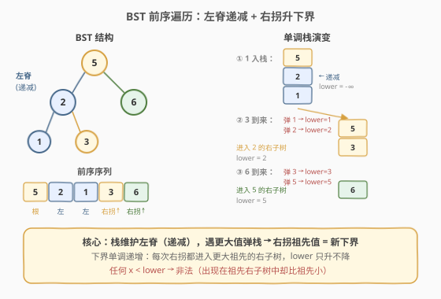
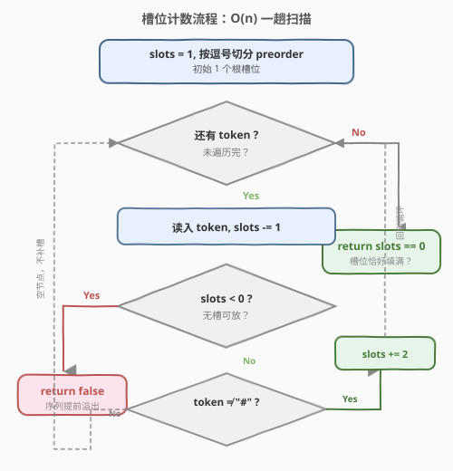
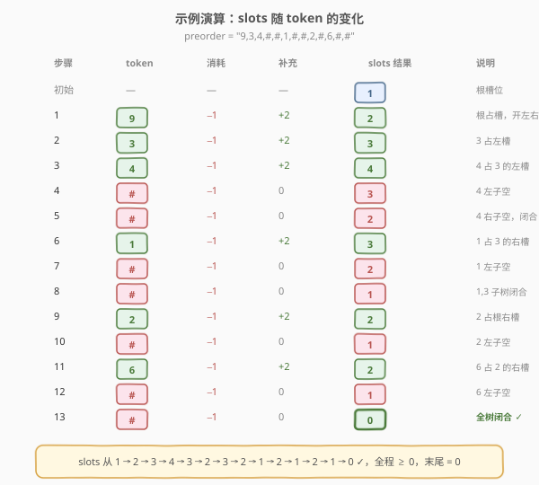

# LeetCode 验证二叉树的前序序列化 题解

## 1. 题目概述

- **标题 / 题号**：验证二叉树的前序序列化（#331，medium）
- **链接**：https://leetcode.cn/problems/verify-preorder-serialization-of-a-binary-tree/
- **难度**：中等
- **标签**：栈、树、字符串、二叉树、二叉树序列化

**题意**：给定一个以逗号分隔的字符串 `preorder`，表示一棵二叉树的**前序遍历**序列化结果。其中：

- **非空节点**用一个整数表示；
- **空节点**用 `"#"` 表示。

例如 `"9,3,4,#,#,1,#,#,2,#,6,#,#"` 序列化的二叉树如下：

```text
        9
       / \
      3   2
     /   / \
    4   #   6
   / \     / \
  #   #   #   #
```

请判定该字符串是否是一棵**合法**二叉树的前序序列化——即**不重建树**，仅凭序列本身判断它能否唯一对应一棵完整二叉树的前序遍历。

**示例 1**：

```text
输入：preorder = "9,3,4,#,#,1,#,#,2,#,6,#,#"
输出：true
解释：如上图，能完整重建一棵二叉树，序列化无多余、无缺失。
```

**示例 2**：

```text
输入：preorder = "1,#"
输出：false
解释：根 1 有左右两个槽位，仅给出左子树 #，右子树缺失。
```

**示例 3**：

```text
输入：preorder = "9,#,#,1"
输出：false
解释：9 的左右子树均已由 "#,#" 填满，根子树已完成，
      序列后续的 "1" 无槽位可放。
```

**约束**：

- $1 \le \text{preorder.length} \le 10^4$
- `preorder` 由逗号分隔的合法 token 组成，token 为 $[1, 1000]$ 内整数或 `"#"`
- 输入不含前导/后导空格，token 数 $n \le 10^4$

> 💡 本题与 [297. 二叉树的序列化与反序列化](../0201-0300/297_二叉树的序列化与反序列化.md) 是一对镜像：297 要求「把树变成串 / 把串变回树」，331 只要求「判定串是否合法」。**不需要真正重建二叉树**——只需在前序遍历的天然结构上做一次扫描，用「槽位计数」即可判定。这种「不重建只判定」的思想在括号匹配、表达式校验中反复出现。

## 2. 解题思路

### 2.1 暴力思路：真正重建二叉树

最直观的做法是按 [297](../0201-0300/297_二叉树的序列化与反序列化.md) 的反序列化逻辑，**真正建一棵二叉树**：

```text
def deserialize(tokens):
    val = tokens.pop(0)
    if val == "#":
        return None
    node = TreeNode(int(val))
    node.left  = deserialize(tokens)
    node.right = deserialize(tokens)
    return node
```

建完之后检查 `tokens` 是否恰好耗尽。时间 $O(n)$、空间 $O(h)$（递归栈），看似可行。

> ⚠️ 暴力法的问题：**把简单判定题做重了**。我们并不关心树长什么样，只关心「序列能否闭合」。重建一棵二叉树需要 $O(n)$ 额外内存存节点对象，且递归实现要小心栈深度。实际上存在一个**纯计数**解法，$O(1)$ 空间即可判定——这就是下面的「槽位法」。

### 2.2 核心观察：槽位计数



把前序遍历想象成**「往空槽里填节点」**的过程：

- 一开始有 **1 个槽位**（留给根）。
- 每读入一个 token，**先消耗 1 个槽位**（占据这个位置）。
  - 若 token 是**非空节点**（整数），它会产生 **2 个新槽位**（左、右孩子的位置）。净效果：$\text{slots} \mathrel{+}= 1$（$-1 + 2$）。
  - 若 token 是 `"#"`（空节点），它不产生新槽位。净效果：$\text{slots} \mathrel{-}= 1$（$-1 + 0$）。

**合法性判据**（两条同时满足）：

1. **过程中** $\text{slots} \ge 0$ 恒成立——一旦 $\text{slots} < 0$，说明某个节点无槽位可放（如示例 3 的 `"9,#,#,1"` 中，`1` 出现时槽位已为 0，再消耗即变 $-1$）。
2. **结束时** $\text{slots} = 0$——所有槽位恰好被填满，不多不少（如示例 2 的 `"1,#"` 结束时 slots $=1$，根的右槽位空缺）。

> 💡 **为什么槽位法等价于树重建？** 前序遍历的递归结构 `根, 左子树, 右子树` 天然对应「先填根槽 → 左子树递归填左槽 → 右子树递归填右槽」。槽位法把递归展开成线性扫描：非空节点把「当前槽」换成「左右两个子槽」（$-1+2$），空节点把「当前槽」直接抹掉（$-1+0$）。树的递归边界（左右都到 `#`）恰好对应槽位归零。整棵树合法 ⟺ 所有槽位被恰好填满，即最终 $\text{slots}=0$ 且中途不为负。

### 2.3 算法流程图



**完整步骤**：

1. **初始化**：`slots = 1`（根槽位），把 `preorder` 按 `','` 切分得到 token 列表。
2. **遍历每个 token**：
   - `slots -= 1`（消耗一个槽位放当前 token）。
   - 若 `slots < 0`：**立即返回 `false`**（无槽位可放，序列提前溢出）。
   - 若 token $\ne$ `"#"`：`slots += 2`（非空节点新增左右两个子槽位）。
3. **遍历结束**：返回 `slots == 0`。

> ⚠️ **先减再判负再补**的顺序很关键：必须先 `slots -= 1` 并检查 `< 0`，再决定是否 `+= 2`。若先 `+= 2` 再 `- 1`，则 `slots` 永不为负，会漏掉示例 3 那种「根子树已完成、后续多余节点」的情况。本质是：**槽位要先被消费掉才看是否超支**，与「先付钱再收货」同理。

### 2.4 示例演算

以示例 1 `preorder = "9,3,4,#,#,1,#,#,2,#,6,#,#"` 为例：



逐 token 追踪 `slots`：

| 步骤 | token | 消耗 | 补充 | slots 变化 | slots 结果 | 说明 |
|------|-------|------|------|-----------|-----------|------|
| 初始 | — | — | — | — | **1** | 根槽位 |
| 1 | 9 | −1 | +2 | +1 | **2** | 根占槽，开左右两槽 |
| 2 | 3 | −1 | +2 | +1 | **3** | 3 占左槽，开 3 的左右两槽 |
| 3 | 4 | −1 | +2 | +1 | **4** | 4 占 3 的左槽，开 4 的左右两槽 |
| 4 | # | −1 | 0 | −1 | **3** | 4 的左子为空 |
| 5 | # | −1 | 0 | −1 | **2** | 4 的右子为空，4 子树闭合 |
| 6 | 1 | −1 | +2 | +1 | **3** | 1 占 3 的右槽，开 1 的左右两槽 |
| 7 | # | −1 | 0 | −1 | **2** | 1 的左子为空 |
| 8 | # | −1 | 0 | −1 | **1** | 1 的右子为空，1 子树闭合，3 子树闭合 |
| 9 | 2 | −1 | +2 | +1 | **2** | 2 占根的右槽，开 2 的左右两槽 |
| 10 | # | −1 | 0 | −1 | **1** | 2 的左子为空 |
| 11 | 6 | −1 | +2 | +1 | **2** | 6 占 2 的右槽，开 6 的左右两槽 |
| 12 | # | −1 | 0 | −1 | **1** | 6 的左子为空 |
| 13 | # | −1 | 0 | −1 | **0** ✓ | 6 的右子为空，全树闭合 |

最终 `slots == 0`，过程中从未为负，返回 `true`。

> 💡 **对照示例 3 `"9,#,#,1"`**：步骤 1 后 `slots=2`，`#` 后 `slots=1`，`#` 后 `slots=0`——此时根子树已完整闭合。再读 `1` 时 `slots` 减 1 变 $-1 < 0$，立即返回 `false`。这正是「先减再判负」顺序捕获的典型场景。

## 3. 参考代码

### C++

```cpp
// 验证二叉树的前序序列化.cpp —— 槽位计数法 O(n) / O(1)
// 编译: g++ -O2 -std=c++17 验证二叉树的前序序列化.cpp -o verify
#include <string>
#include <sstream>
using namespace std;

class Solution {
public:
    bool isValidSerialization(string preorder) {
        int slots = 1;                     // 初始：1 个根槽位
        istringstream iss(preorder);
        string token;
        while (getline(iss, token, ',')) {
            --slots;                       // 当前 token 先消耗 1 个槽位
            if (slots < 0) return false;   // 无槽可放，提前溢出
            if (token != "#") slots += 2;  // 非空节点产生左右两个子槽位
        }
        return slots == 0;                 // 所有槽位恰好填满
    }
};
```

### Python

```python
class Solution:
    def isValidSerialization(self, preorder: str) -> bool:
        slots = 1                          # 初始：1 个根槽位
        for token in preorder.split(","):
            slots -= 1                     # 当前 token 先消耗 1 个槽位
            if slots < 0:                  # 无槽可放，提前溢出
                return False
            if token != "#":               # 非空节点产生左右两个子槽位
                slots += 2
        return slots == 0                  # 所有槽位恰好填满
```

> 💡 **两个细节**：① **先 `-=1` 再判 `< 0` 再 `+=2`**——顺序不能换，否则无法捕获「子树已闭合后多余 token」的非法情形（示例 3）。② C++ 用 `istringstream + getline` 按 `','` 切分，避免一次性 `split` 产生额外字符串数组的内存开销；Python 的 `str.split` 简洁且 $n \le 10^4$ 无性能压力。

## 4. 复杂度分析

| 维度 | 复杂度 | 说明 |
|------|--------|------|
| **时间** | $O(n)$ | 一趟扫描，每个 token 做 $O(1)$ 的减法、判断与加法；$n$ 为 token 数 |
| **空间** | $O(1)$ | 仅维护一个 `slots` 整数（C++ 流式切分）/ $O(n)$（Python `split` 临时数组，可改 `find` 逐段解析降为 $O(1)$） |

> ⚠️ 严格说 Python 的 `preorder.split(",")` 会生成 $O(n)$ 临时数组。若追求极致 $O(1)$ 空间，可改用指针 + `find` 逐段切分。但 $n \le 10^4$ 时临时数组可忽略，可读性优先。C++ 的 `getline` 流式切分天然 $O(1)$ 额外空间。

## 5. 扩展：栈模拟法

除槽位计数外，还有一种**栈模拟**解法——直观模拟前序重建过程，把「已闭合的子树」坍缩成 `#`：

```python
def isValidSerialization(self, preorder: str) -> bool:
    stack = []
    for token in preorder.split(","):
        stack.append(token)
        # 当栈顶是「# # 非空节点」时，说明该非空节点的左右子树都已闭合
        while len(stack) >= 3 and stack[-1] == "#" and stack[-2] == "#" and stack[-3] != "#":
            stack[-3:] = ["#"]   # 把 [node, #, #] 坍缩成 [#]
    return len(stack) == 1 and stack[0] == "#"
```

**思路**：前序遍历中，一个非空节点后紧跟两个 `#`（`node, #, #`）表示该节点的左右子都为空，是一棵「单节点子树」。把它坍缩成一个 `#`（代表「这棵子树已完整」），继续向上归约。最终整个序列应坍缩成单个 `#`。

- 时间 $O(n)$（每个 token 最多入栈、出栈各一次，摊还 $O(1)$）。
- 空间 $O(n)$（栈深最坏可达 $n$，链状退化树）。

> 💡 **两种解法对比**：槽位法是栈模拟的「计数压缩版」——栈里存的本质是「待填的槽位序列」，槽位计数把整条栈压缩成一个整数。两者等价，但槽位法 $O(1)$ 空间更优。这与 [20. 有效括号](../0001-0100/20_有效的括号.md) 的「栈 vs 计数」关系同构：括号匹配中单一括号类型也可用计数替代栈。

## 6. 面试要点

1. **为什么「先减 1 再判负再补 2」的顺序不能换？**

   > 必须先消耗槽位、检查是否超支，再决定补充。若先 `+= 2` 再 `- 1`，则 `slots` 在非空节点处净增 1、永不为负，会漏判示例 3 `"9,#,#,1"` 这类「根子树已闭合、后续多余节点」的情形。本质是：token 出现时必须**先有槽位可放**才能合法，无槽可放即非法，这一判定必须在补充新槽位之前完成。

2. **槽位法为什么等价于树重建？**

   > 前序遍历的递归结构 `根, 左子树, 右子树` 天然对应「填根槽 → 递归填左右子槽」。非空节点把当前槽换成左右两个子槽（$-1+2$），空节点直接抹掉当前槽（$-1+0$）。整棵树合法 ⟺ 所有槽位恰好填满（最终 `slots=0`）且中途无超支（`slots≥0`）。槽位法把递归展开成线性计数，省去了实际建树。

3. **判定条件为什么是两条（过程中 `≥0` 且结束时 `=0`）？**

   > 两条分别捕获两类非法：① 过程中 `slots<0` 捕获「序列提前溢出」——某 token 出现时无槽可放（如示例 3 的 `1`）；② 结束时 `slots≠0` 捕获「序列未闭合」——还有空槽没填（如示例 2 的 `"1,#"`，根的右槽空缺）。缺一不可：只查 `=0` 会漏判中途负值（如 `"#,1"` 消耗后 `slots=-1` 但若继续读 `1` 又 `+=2` 回到 1，结束时 `=1` 也能被 `≠0` 拦下，但更早拦截更安全）；只查 `≥0` 会漏判末尾空槽。

4. **栈模拟法与槽位法的关系？**

   > 栈模拟显式维护「待填槽位序列」，每遇到 `node, #, #` 就坍缩成 `#`；槽位法把整条栈压缩成一个整数计数。两者等价——栈的长度对应 `slots` 的「上界」，坍缩操作对应 `slots` 的减少。槽位法 $O(1)$ 空间更优，是栈模拟的计数压缩版。这与括号匹配中「单类型用计数、多类型用栈」的思想一致。

5. **能否不切分字符串、流式处理？**

   > 可以。用指针 + `find(',', pos)` 逐段切分，或 C++ 的 `istringstream + getline`，避免 `split` 产生临时数组，空间严格 $O(1)$。但 $n \le 10^4$ 时 `split` 的 $O(n)$ 临时数组可忽略，可读性优先。

> 💡 **一句话总结**：331 是「不重建树、只判定合法性」的招牌题——用一个整数 `slots` 记录待填槽位，非空节点 $-1+2$、空节点 $-1$，过程中不为负、结束时归零即合法。这种「递归结构线性计数」的思想可迁移到括号匹配、表达式校验、JSON 合法性判定等所有「结构闭合」类问题。

## 同类练习题

| # | 题目 | 与本题的关联 |
|---|------|-------------|
| 297 | [二叉树的序列化与反序列化](https://leetcode.cn/problems/serialize-and-deserialize-binary-tree/)（[题解](../0201-0300/297_二叉树的序列化与反序列化.md)） | 本题的镜像——真正建树/拆树，理解前序序列化的递归结构后再来看 331 的判定 |
| 20 | [有效的括号](https://leetcode.cn/problems/valid-parentheses/)（[题解](../0001-0100/20_有效的括号.md)） | 同构的「结构闭合」判定，栈 vs 计数的关系与本题槽位法 vs 栈模拟完全对应 |
| 1003 | [检查替换后的词是否有效](https://leetcode.cn/problems/check-if-word-is-valid-after-substitutions/) | 栈模拟 + 坍缩归约，与 331 栈解法的 `node,#,# → #` 归约同构 |
| 1028 | [从先序遍历还原二叉树](https://leetcode.cn/problems/recover-a-tree-from-preorder-traversal/) | 前序遍历的另一种变体，重建而非判定，对比理解前序结构的不同应用 |
| 105 | [从前序与中序遍历序列构造二叉树](https://leetcode.cn/problems/construct-binary-tree-from-preorder-and-inorder-traversal/)（[题解](../0101-0200/105_从前序与中序遍历序列构造二叉树.md)） | 前序遍历的重建应用，与 331 的「只判定不重建」形成对照 |
