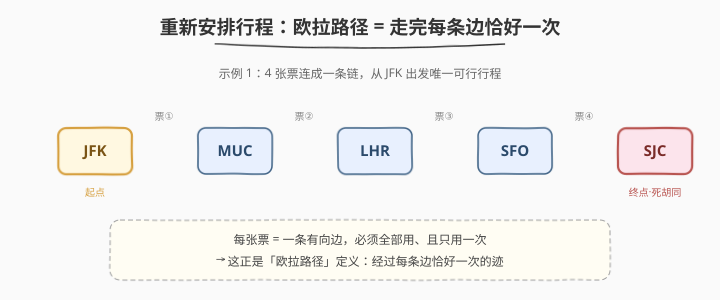
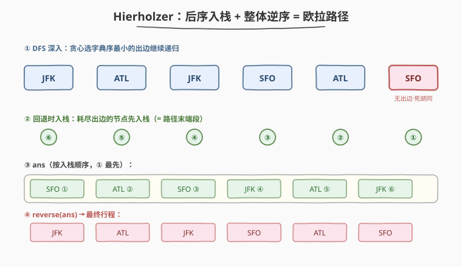
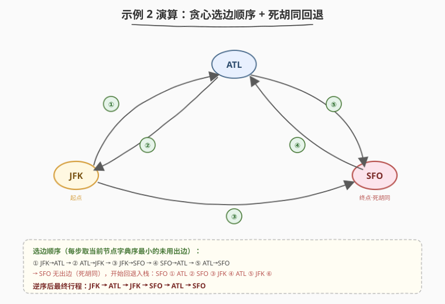

# 重新安排行程

- **题目名称**：重新安排行程
- **链接**：[332. 重新安排行程](https://leetcode.cn/problems/reconstruct-itinerary/)
- **难度**：困难
- **标签**：深度优先搜索、图、欧拉路径、堆

## 1. 题目概述

给你一份航线机票列表 `tickets`，其中 `tickets[i] = [fromi, toi]` 表示飞机从 `fromi` 出发飞往 `toi`。所有机场用 3 个大写字母表示。

请你按这些机票**重新安排行程**，要求：

1. 从 `"JFK"` 出发；
2. **必须用完全部机票**，且每张票**只用一次**；
3. 若存在多种有效行程，返回**字典序最小**的那个。

可以保证至少存在一种有效行程，且所有机票都构成有效行程（即存在从 `"JFK"` 出发的欧拉路径）。

**示例 1**：

```text
输入：tickets = [["MUC","LHR"],["JFK","MUC"],["SFO","SJC"],["LHR","SFO"]]
输出：["JFK","MUC","LHR","SFO","SJC"]
```

**示例 2**：

```text
输入：tickets = [["JFK","SFO"],["JFK","ATL"],["SFO","ATL"],["ATL","JFK"],["ATL","SFO"]]
输出：["JFK","ATL","JFK","SFO","ATL","SFO"]
解释：另一种有效行程是 ["JFK","SFO","ATL","JFK","ATL","SFO"]，但它的字典序更大。
```

**约束条件**：

- `1 <= tickets.length <= 300`
- `tickets[i].length == 2`
- `fromi.length == toi.length == 3`
- `fromi != toi`
- 至少存在一种有效行程

---

## 2. 解题思路

### 2.1 暴力思路：DFS + 回溯

把每张票视作有向边建邻接表，按字典序排序后从 `"JFK"` 出发 DFS：每到一个节点，依次尝试尚未使用的出边，若后续能把所有票用完即得一个解；若走不通则回退换下一条边。

> ⚠️ 最坏情况要尝试 `O(E!)` 种排列（成环密集时尤为严重），即使题目保证有解、借助「字典序最小先返回」可提前终止，仍可能超时。需要更本质的观察。

### 2.2 核心观察：这是求「欧拉路径」



关键洞察：**每张机票 = 一条有向边，要求全部用且只用一次**——这正是「**欧拉路径**」的定义：从起点出发、经过每条边恰好一次的迹。

题目保证至少存在一个有效行程，意味着图**必存在**一条从 `"JFK"` 出发的欧拉路径（`"JFK"` 是出度比入度多 1 的起点，或所有点入度=出度的欧拉回路情形）。于是问题从「搜索所有排列」降维为「**用 Hierholzer 算法 O(E) 构造欧拉路径**」。

> 💡 与普通「图遍历」的区别：BFS/DFS 通常关心「**访问每个点**」，欧拉路径关心「**走完每条边**」。这也是它和 [207. 课程表](../0201-0300/207_课程表.md)（拓扑排序，按点调度）的本质差别。

### 2.3 算法流程：后序入栈 + 整体逆序



Hierholzer 算法的精髓只有两步：

1. **邻接表用最小堆 / 排序栈**：保证每次取当前节点**字典序最小**的未用出边（C++ 用 `priority_queue<string, vector<string>, greater<>>`；Python 用「降序入 `list` + `pop()` 取最小」）。
2. **DFS 后序入栈**：

   ```text
   dfs(u):
       while u 还有未用出边:
           v ← 取 u 的字典序最小出边并删除
           dfs(v)
       ans.append(u)        # 耗尽 u 的所有出边后，才把 u 记入答案
   ```

3. **全部结束后 `reverse(ans)`** 即为最终行程。

**为什么「后序入栈 + 逆序」是对的？**

- 当 `dfs(u)` 走到 `u` 的所有出边都耗尽时，`u` 已「无路可走」——它就是**当前尚未闭合路径的末端段**。此时把它先记入 `ans`，相当于**从路径终点倒着拼**。
- 由于图存在欧拉路径，「提前进入死胡同」的节点恰好是真正的终点（非终点的节点入度=出度，进去后必然还能出来，不会误死）。回退过程中每个节点耗尽出边后依次入栈，逆序后即得从 `"JFK"` 到终点的完整欧拉路径。

**为什么这样就是字典序最小？**

- 每一步都贪心取字典序最小的出边；而逆序后序的构造使**最早做出的贪心选择对应最终路径的最前端**（起点 `"JFK"` 最后入栈 → 逆序后第一个；它第一步走向的最小邻居成为第二个）。因为图保证存在欧拉路径、贪心选小不会导致「误入非终点的死胡同需要回退」，所以**第一次完整构造出的就是字典序最小的欧拉路径**。

### 2.4 示例演算

以示例 2 为例，邻接表（最小堆）为：

```text
JFK → [ATL, SFO]      （ATL 字典序更小，先取）
ATL → [JFK, SFO]
SFO → [ATL]
```



DFS 调用链与入栈顺序如下：

| 步骤 | 当前节点 | 取出最小出边 | 递归进入 | 说明 |
|------|----------|--------------|----------|------|
| ① | JFK | JFK→ATL | ATL | JFK 还剩 SFO 未用 |
| ② | ATL | ATL→JFK | JFK | ATL 还剩 SFO 未用 |
| ③ | JFK | JFK→SFO | SFO | JFK 出边耗尽 |
| ④ | SFO | SFO→ATL | ATL | SFO 出边耗尽 |
| ⑤ | ATL | ATL→SFO | SFO | ATL 出边耗尽 |
| ⑥ | SFO | （无出边） | — | 死胡同，入栈 SFO |

回退阶段依次入栈：`SFO ① ATL ② SFO ③ JFK ④ ATL ⑤ JFK ⑥`，得到

```text
ans = [SFO, ATL, SFO, JFK, ATL, JFK]
```

逆序后：

```text
[JFK, ATL, JFK, SFO, ATL, SFO]
```

正好用完全部 5 张票，且为字典序最小行程。

---

## 3. 参考代码

### C++

```cpp
class Solution {
    unordered_map<string, priority_queue<string, vector<string>, greater<string>>> g;
    vector<string> ans;

    void dfs(const string& u) {
        auto& pq = g[u];
        while (!pq.empty()) {
            string v = pq.top();
            pq.pop();          // 取字典序最小的出边并删除
            dfs(v);
        }
        ans.push_back(u);      // 后序入栈：耗尽出边后再记录
    }

  public:
    vector<string> findItinerary(vector<vector<string>>& tickets) {
        for (const auto& t : tickets)
            g[t[0]].push(t[1]);          // 最小堆保证字典序最小
        dfs("JFK");
        reverse(ans.begin(), ans.end()); // 整体逆序得正序路径
        return ans;
    }
};
```

### Python

```python
class Solution:
    def findItinerary(self, tickets: List[List[str]]) -> List[str]:
        g = defaultdict(list)
        for u, v in sorted(tickets, reverse=True):  # 降序入栈，pop() 取最小
            g[u].append(v)

        ans = []

        def dfs(u: str) -> None:
            while g[u]:
                dfs(g[u].pop())   # 取字典序最小的出边深入
            ans.append(u)         # 后序入栈

        dfs("JFK")
        return ans[::-1]          # 整体逆序得正序路径
```

> 💡 Python 的「`sorted(reverse=True)` 入 `list` + `pop()`」等价于一个最小堆：降序排好后，列表末尾始终是字典序最小的元素，`pop()` 即 O(1) 取出并删除，整体 O(E log E)。

---

## 4. 复杂度分析

| 维度 | 复杂度 | 说明 |
|------|--------|------|
| 时间复杂度 | $O(E \log E)$ | 每条边入堆/出堆各一次，单次 $O(\log E)$；排序栈方案同为 $O(E \log E)$ |
| 空间复杂度 | $O(E)$ | 邻接表存所有边 + DFS 递归栈深度最多 $O(E)$ |

其中 $E$ 为机票数（边数）。若用平衡结构保证每个节点出边有序，理论上可做到 $O(E \log V)$，但本题 $E \le 300$，$O(E \log E)$ 完全够用。

---

## 5. 扩展：欧拉路径存在性判定 与 回溯对比

**欧拉路径 vs 欧拉回路**

| 类型 | 条件（有向图，弱连通前提下） | 起点 |
|------|------------------------------|------|
| 欧拉回路 | 所有顶点入度 = 出度 | 任意顶点均可 |
| 半欧拉路径 | 恰一个顶点 out − in = 1（起点）、恰一个 in − out = 1（终点），其余相等 | out − in = 1 的顶点 |

本题题目**保证有解**，故无需做存在性判定，直接 Hierholzer 构造即可。若需自行判定，按上表检查度数即可。

**与「DFS + 回溯」的对比**

| 方法 | 时间 | 是否回溯 | 适用 |
|------|------|----------|------|
| 贪心 + 回溯 | 最坏 $O(E!)$ | 是（走错就退） | 不保证有欧拉路径、需尝试 |
| Hierholzer | $O(E \log E)$ | 否（有欧拉路径保证，不会误死） | 保证存在欧拉路径 |

> ⚠️ 在**不保证存在欧拉路径**的图上，Hierholzer 的「贪心选小不回退」会失效（可能走进非终点的死胡同）。此时应改用回溯，或先用度数判定存在性。

---

## 6. 面试要点

1. **为什么这道题是欧拉路径问题？**

   - 每张机票是有向边，要求全部用且只用一次 → 即「经过每条边恰好一次的迹」，正是欧拉路径定义。起点固定 `"JFK"`，故为从指定起点出发的半欧拉路径。

2. **为什么「后序入栈 + 逆序」能得到正确路径？**

   - `dfs(u)` 耗尽 `u` 的出边后才把 `u` 入栈，此时 `u` 无路可走，是当前路径的末端段；先入栈的节点位于路径后段。逆序后即得从起点到终点的正序欧拉路径。

3. **如何保证字典序最小？**

   - 邻接表用最小堆/排序栈，每步取字典序最小出边；逆序后序使最早的贪心选择对应最终路径最前端。因图保证存在欧拉路径，贪心选小不会误入非终点死胡同、无需回退，故首次构造即为字典序最小。

4. **为什么不用普通 DFS + 回溯？**

   - 回溯最坏 $O(E!)$（成环密集时指数级）；Hierholzer 利用「存在欧拉路径」的保证，做到 $O(E \log E)$ 且无需回退。

5. **邻接表为什么用堆/排序栈，而不直接排序后正向遍历？**

   - 需要在 $O(\log E)$ 内「取出并删除」当前最小出边。若用排序数组正向遍历，删除某条边要 $O(E)$ 移位，整体退化为 $O(E^2)$；最小堆/栈的 `pop` 是 $O(\log E)$ / $O(1)$。

---

## 7. 同类练习题

- [753. 破解保险箱](https://leetcode.cn/problems/cracking-the-safe/)：欧拉回路，每个 (n−1) 位密码为节点、补一位为边，Hierholzer 直接套用
- [2097. 合法重新排列数对](https://leetcode.cn/problems/valid-arrangement-of-pairs/)：有向图欧拉路径，与本题同模板（题目不保证起点固定，需按度数找起点）
- [207. 课程表](https://leetcode.cn/problems/course-schedule/)（[题解](../0201-0300/207_课程表.md)）：同为有向图遍历，拓扑排序按「点」调度，欧拉路径按「边」调度，可对比理解
