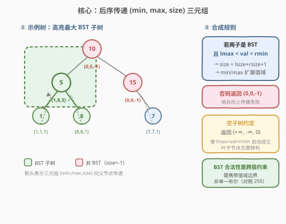
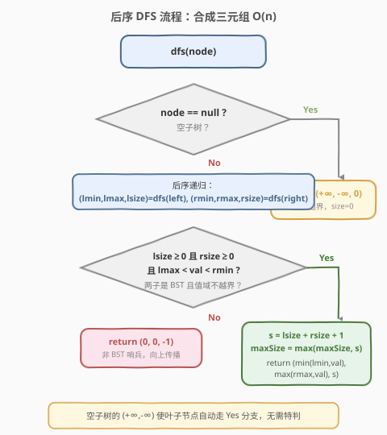
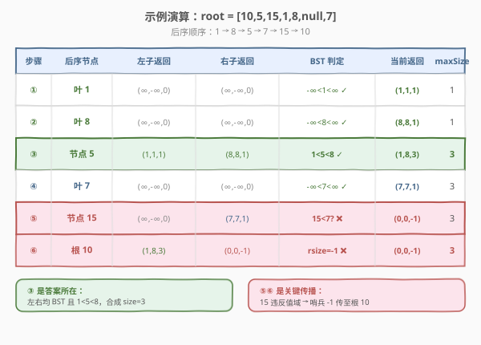

# 最大二叉搜索子树

- **题目名称**：最大二叉搜索子树
- **链接**：[333. 最大二叉搜索子树](https://leetcode.cn/problems/largest-bst-subtree/)
- **难度**：中等
- **标签**：树、二叉树、二叉搜索树、深度优先搜索、后序遍历、动态规划

## 1. 题目概述

给定一棵二叉树的根节点 `root`，找出其**最大的二叉搜索子树**（largest BST subtree），并返回该子树的**节点数**。

> **二叉搜索树（BST）** 性质：对树中每个节点，其左子树中所有节点值**严格小于**该节点值，右子树中所有节点值**严格大于**该节点值。
>
> **子树**：由原树中某节点及其**全部后代**组成的一棵树。

**示例 1**：

```text
输入：root = [10,5,15,1,8,null,7]
输出：3

        10
       /  \
      5    15
     / \     \
    1   8     7
```

最大的 BST 子树以 `5` 为根，包含 `5, 1, 8` 三个节点（`1 < 5 < 8`，满足 BST 性质），大小为 3。

- 以 `15` 为根的子树**不是** BST：右孩子 `7 < 15`，违反「右子树所有值 > 根」。
- 以 `10` 为根的整棵树**不是** BST：其右子树（根 `15`）本身不是 BST，故整树也不是。
- 叶子节点 `1`、`8`、`7` 各自是大小为 1 的 BST。

**示例 2**：

```text
输入：root = [4,2,7,1,3]
输出：5

        4
       / \
      2   7
     / \
    1   3
```

整棵树就是 BST（`1 < 2 < 3`，`2 < 4 < 7`），最大 BST 子树即整树，大小为 5。

**示例 3**：

```text
输入：root = []
输出：0
```

**约束条件**：

- 树中节点数目范围 $[0, 10^4]$
- $-10^4 \le \text{Node.val} \le 10^4$

> 💡 本题是「**后序遍历 + 子结构信息向上传递**」家族的招牌题。一棵子树是否为 BST、其值域 `[min, max]` 与节点数 `size`，都可由左右子树的结果在 $O(1)$ 内合成——这是天然的后序（自底向上）结构。与 [250. 统计同值子树](../0201-0300/250_统计同值子树.md) 的「布尔返回值」相比，本题需要传递**三元组** `(min, max, size)`，因为 BST 合法性依赖于值域边界，而非单一布尔。

---

## 2. 解题思路

### 2.1 暴力思路：逐节点验证 BST

最直观的做法：遍历每个节点，对每个节点调用一次 `isValidBST(node, low, high)` 检查以它为根的子树是否为 BST（需再遍历一次子树，传递 `(low, high)` 区间约束）。若是，再统计其节点数。取所有合法子树的最大节点数。

- **时间复杂度**：$O(n^2)$——每个节点都被其所有祖先重复扫描，退化链状时最坏 $O(n^2)$。
- **空间复杂度**：$O(h)$ 递归栈。

能过约束 $n \le 10^4$ 的数据，但**完全没有利用「子树 BST 性质可由子问题合成」**——一个节点的子树是否为 BST，取决于「左右子树是否为 BST」加上「左子树最大值 < 当前值 < 右子树最小值」。这正是 [250](../0201-0300/250_统计同值子树.md) 暴力解法浪费的同一类信息。

> ⚠️ 突破口：把「子树是否 BST」连同「值域边界」一并压缩成返回值向上传递，父节点直接读取孩子的判定结果，避免重复扫描。

### 2.2 核心观察：后序传递三元组 (min, max, size)



**关键洞察**：判定「以 `node` 为根的子树是否为 BST」只需三件事——

> ① 左子树是 BST；② 右子树是 BST；③ `left.max < node.val < right.min`。

而 ①② 已经在递归左右子树时算出，③ 只需额外知道左右子树的**值域边界** `[min, max]`。因此让 `dfs` 返回一个**三元组** `(min, max, size)`：

| 返回字段 | 含义 |
|---------|------|
| `min` | 该子树的**最小值**（用于父节点比较「左子树 max < 父值」） |
| `max` | 该子树的**最大值**（用于父节点比较「父值 < 右子树 min」） |
| `size` | 该子树的节点数；**`size = 0`** 表示空子树；**`size = -1`** 表示该子树**不是 BST**（哨兵） |

合成规则（后序，先递归左右拿三元组，再处理根）：

$$
\text{若 } \text{lsize} \ge 0 \text{ 且 } \text{rsize} \ge 0 \text{ 且 } \text{lmax} < \text{node.val} < \text{rmin} \implies
\begin{cases}
\text{size} = \text{lsize} + \text{rsize} + 1 \\
\text{min} = \min(\text{lmin}, \text{node.val}) \\
\text{max} = \max(\text{rmax}, \text{node.val})
\end{cases}
$$

否则当前子树不是 BST，返回 `(0, 0, -1)`。每次合成出合法 BST 时，用 `size` 更新全局 `maxSize`。

> 💡 **空子树的巧妙约定**：`null` 节点返回 `(+∞, -∞, 0)`——`min=+∞`、`max=-∞` 是「空集」的自然边界，使得 `lmax < node.val < rmin` 在「左空」或「右空」时**自动成立**（`-∞ < 任意值`、`任意值 < +∞`），无需对叶子节点单独特判。这与 [250](../0201-0300/250_统计同值子树.md) 中「空节点返回 true」是同一思想：空子树不应拖累父节点的判定。

> ⚠️ **哨兵 `size = -1` 的传播性**：一旦某子树不是 BST（返回 `size = -1`），其所有祖先的 `lsize >= 0 && rsize >= 0` 条件都会失败，整条祖先链自动判为非 BST——无需额外标记，一次后序即可完成全部传播。

### 2.3 算法流程图



**`dfs(node)` 完整步骤**：

1. **空节点**：返回 `(+∞, -∞, 0)`（空子树，大小 0）；
2. **递归左右**：`lmin, lmax, lsize = dfs(node.left)`，`rmin, rmax, rsize = dfs(node.right)`；
3. **判定 BST**：若 `lsize >= 0 && rsize >= 0 && lmax < node.val && node.val < rmin`——
   - `s = lsize + rsize + 1`；
   - `maxSize = max(maxSize, s)`；
   - 返回 `(min(lmin, node.val), max(rmax, node.val), s)`；
4. **否则**：返回 `(0, 0, -1)`（非 BST 哨兵，向上传播失败状态）。

### 2.4 示例演算

以 `root = [10,5,15,1,8,null,7]` 为例，后序遍历顺序为 `1 → 8 → 5 → 7 → 15 → 10`：



| 步骤 | 后序节点 | 左子返回 | 右子返回 | BST 判定 | 当前返回 | maxSize |
|------|---------|---------|---------|---------|---------|---------|
| ① | 叶 1 | `(∞,-∞,0)` | `(∞,-∞,0)` | $-\infty < 1 < \infty$ ✓ | `(1, 1, 1)` | 1 |
| ② | 叶 8 | `(∞,-∞,0)` | `(∞,-∞,0)` | $-\infty < 8 < \infty$ ✓ | `(8, 8, 1)` | 1 |
| ③ | 节点 5 | `(1, 1, 1)` | `(8, 8, 1)` | `1 < 5 < 8` ✓ | `(1, 8, 3)` | **3** |
| ④ | 叶 7 | `(∞,-∞,0)` | `(∞,-∞,0)` | $-\infty < 7 < \infty$ ✓ | `(7, 7, 1)` | 3 |
| ⑤ | 节点 15 | `(∞,-∞,0)` | `(7, 7, 1)` | `15 < 7`? ❌ | `(0, 0, -1)` | 3 |
| ⑥ | 根 10 | `(1, 8, 3)` | `(0, 0, -1)` | rsize=-1 ❌ | `(0, 0, -1)` | 3 |

最终 `maxSize = 3` ✓。

> 💡 **步骤 ⑤ 是关键**：节点 `15` 的右子树 `7` 本身是 BST（步骤 ④），但 `7 < 15` 违反「右子树所有值 > 根」——即 `node.val < rmin` 失败。这正体现了「父节点必须综合左右子树的值域边界」的核心：仅知道孩子是 BST 还不够，必须知道孩子的**最小值/最大值**才能判定能否拼接。
>
> ⚠️ **步骤 ⑥ 的传播**：根 `10` 的右子树（`15`）返回 `size = -1`，根节点直接判为非 BST，无需再检查值域——「一假即停」，与 [250](../0201-0300/250_统计同值子树.md) 的短路传播一脉相承。

---

## 3. 参考代码

### C++

```cpp
class Solution {
  public:
    int maxSize = 0;

    int largestBSTSubtree(TreeNode* root) {
        dfs(root);
        return maxSize;
    }

    // 返回 {子树最小值, 子树最大值, 子树大小}
    // size == 0  : 空子树
    // size == -1 : 该子树不是 BST（哨兵，向上传播失败状态）
    tuple<long, long, long> dfs(TreeNode* node) {
        if (!node) return {LONG_MAX, LONG_MIN, 0};   // 空子树：空集边界
        auto [lmin, lmax, lsize] = dfs(node->left);
        auto [rmin, rmax, rsize] = dfs(node->right);
        if (lsize >= 0 && rsize >= 0 && lmax < node->val && node->val < rmin) {
            long s = lsize + rsize + 1;
            maxSize = max(maxSize, (int)s);
            return {min(lmin, (long)node->val), max(rmax, (long)node->val), s};
        }
        return {0, 0, -1};                            // 非 BST 哨兵
    }
};
```

### Python

```python
class Solution:
    def largestBSTSubtree(self, root: Optional[TreeNode]) -> int:
        max_size = 0

        def dfs(node: Optional[TreeNode]):
            nonlocal max_size
            if not node:
                return (float('inf'), float('-inf'), 0)  # (min, max, size)
            lmin, lmax, lsize = dfs(node.left)
            rmin, rmax, rsize = dfs(node.right)
            if lsize >= 0 and rsize >= 0 and lmax < node.val < rmin:
                s = lsize + rsize + 1
                max_size = max(max_size, s)
                return (min(lmin, node.val), max(rmax, node.val), s)
            return (0, 0, -1)                            # 非 BST 哨兵

        dfs(root)
        return max_size
```

> 💡 **为什么用 `long` / `float`？** 空子树返回的 `min=+∞`、`max=-∞` 需要与 `node.val` 比较。C++ 中 `node.val` 可达 `INT_MAX`/`INT_MIN`（虽本题约束 $\pm 10^4$，但模板通用化），用 `long` 与 `LONG_MAX`/`LONG_MIN` 规避边界碰撞。Python 的 `float('inf')` 与任意整数比较都正确，无此问题。
>
> ⚠️ **三元组而非布尔**：与 [250](../0201-0300/250_统计同值子树.md) 的 `dfs` 只返回 `bool` 不同，本题 `dfs` 返回三元组——因为父节点不仅需要知道「孩子是否 BST」，还需要孩子的**值域边界**来验证拼接合法性。这是「BST 类问题」与「同值类问题」的关键差异：BST 的合法性是**跨层约束**（父值必须大于左子树最大值），需要携带值域信息；同值的合法性是**点对约束**（父值等于孩子值），布尔即可。

---

## 4. 复杂度分析

| 维度 | 复杂度 | 说明 |
|------|--------|------|
| 时间复杂度 | $O(n)$ | 每个节点只访问一次，每次做 $O(1)$ 的三元组合成与比较 |
| 空间复杂度 | $O(h)$ | 递归栈深度 = 树高 $h$；平衡树 $O(\log n)$，退化链状 $O(n)$ |
| 最坏情况 | $O(n)$ 空间 | 树退化为单侧链时递归深度达 $n$ |

> ⚠️ 暴力法 $O(n^2)$ 的浪费在于：验证某节点子树是 BST 时已扫描过其子树，但父节点又重新扫描一遍。后序传递法把「子树 BST 性 + 值域边界 + 大小」压缩成一个三元组向上传递，父节点 $O(1)$ 合成，避免了重复扫描——这本质上是**树形动态规划**：子问题（子树）的解聚合为父问题的解。

---

## 5. 扩展：自顶向下传区间法 vs 自底向上传值域法

验证 / 寻找 BST 有两大流派，理解其差异有助于面试时根据场景选择：

### 5.1 自顶向下传区间（top-down range）—— [98. 验证二叉搜索树](https://leetcode.cn/problems/validate-binary-search-tree/)

从根开始，给每个节点传入「合法区间 `(low, high)`」，检查 `low < node.val < high`，再递归下传 `(low, node.val)` 给左、`(node.val, high)` 给右。

- **特点**：父约束向下传递，**只需验证单棵树**是否 BST。
- **局限**：无法直接求「最大 BST 子树」——若当前节点违反区间，不能立即放弃整棵子树（其下方可能藏着一棵合法 BST 子树）。需对每个节点重新设区间 `(-∞, +∞)` 重跑，退化为 $O(n^2)$。

### 5.2 自底向上传值域（bottom-up tuple）—— 本题

后序递归，子树把「`(min, max, size)`」向上传递，父节点合成。

- **特点**：子结论向上聚合，天然求「所有子树中最优者」。
- **优势**：一次遍历 $O(n)$ 同时完成「判定 + 求最值」，且任一子树失败时哨兵 `size=-1` 自动传播，无需重跑。

> 💡 **选择口诀**：验证**整棵树**用 top-down 区间法（代码短、直觉强）；求**子树中最优 BST** 用 bottom-up 三元组法（一次遍历、避免重复）。本题追问「整棵树是否 BST」时可顺手用区间法作 $O(n)$ 验证，但主算法必须是 bottom-up。

### 5.3 进阶变体：最大 BST 子树的**键值和**

[1373. 二叉搜索子树的最大键值和](https://leetcode.cn/problems/maximum-sum-bst-in-binary-tree/) 是本题的「公开版」变体——把「最大节点数」换成「最大键值和」。模板完全一致，只需把三元组中的 `size` 换成 `sum`，并在合法时用 `sum` 更新全局 `maxSum`：

```python
def dfs(node):
    if not node:
        return (float('inf'), float('-inf'), 0)   # (min, max, sum)，空子树和为 0
    lmin, lmax, lsum = dfs(node.left)
    rmin, rmax, rsum = dfs(node.right)
    if lmax < node.val < rmin:                    # 注意：空子树哨兵使其自动成立
        s = lsum + rsum + node.val
        max_sum = max(max_sum, s)                 # 仅此行与本题不同
        return (min(lmin, node.val), max(rmax, node.val), s)
    return (0, 0, -1)                             # 非 BST 哨兵同样传播
```

> ⚠️ 1373 中 `max_sum` 初值设为 `0`（允许「不选任何子树」时答案为 0，应对全树无 BST 的情况）；本题 `maxSize` 初值也是 `0`，含义一致（空树答案为 0）。

---

## 6. 面试要点

1. **为什么用后序遍历而不是前序或中序？**

   > BST 子树的合法性判定依赖子树的结果——只有先知道左右子树是否为 BST 及其值域边界，才能判定当前子树是否为 BST。这是典型的「子问题结果决定父问题」结构，对应后序（左右根）。前序/中序在处理父节点时尚未获取子树信息，无法一次遍历完成。

2. **空子树为什么返回 `(+∞, -∞, 0)`？**

   > 三重作用：① `size=0` 表示空子树不计入节点数；② `min=+∞`、`max=-∞` 是空集的自然值域边界，使得父节点的 `lmax < node.val < rmin` 在「左空」或「右空」时**自动成立**（`-∞ < 任意值 < +∞`），避免对叶子节点特判；③ `size >= 0` 让空子树通过「孩子是 BST 或空」的检查。这与 [250](../0201-0300/250_统计同值子树.md) 的「空节点返回 true」一脉相承。

3. **哨兵 `size = -1` 如何传播失败状态？**

   > 一旦某子树不是 BST，返回 `size = -1`。其父节点的判定条件 `lsize >= 0 && rsize >= 0` 立即失败，父也返回 `size = -1`，逐层向上传播至根。无需额外标记字段，一次后序遍历即可完成「一假即停」的传播——与 [250](../0201-0300/250_统计同值子树.md) 的布尔短路同构。

4. **暴力 $O(n^2)$ 和最优 $O(n)$ 的本质区别是什么？**

   > 暴力法对每个节点独立调用 `isValidBST` 重新扫描子树，子树信息无法复用。最优法把「子树 BST 性 + 值域 + 大小」压缩成三元组向上传递，父节点 $O(1)$ 合成。这是**树形动态规划**的范式——子问题解聚合为父问题解，避免重复扫描。同源思想见 [124. 二叉树最大路径和](https://leetcode.cn/problems/binary-tree-maximum-path-sum/)（传递子树最大贡献）。

5. **与 [98. 验证二叉搜索树](https://leetcode.cn/problems/validate-binary-search-tree/) 的区间法有何异同？**

   > 98 题自顶向下传区间 `(low, high)`，父约束向下传递，只验证**整棵树**是否 BST，$O(n)$。本题求**子树中最优者**，若用区间法需对每个节点重设 `(-∞, +∞)` 重跑，退化为 $O(n^2)$。必须用自底向上传值域的三元组法，一次遍历同时判定所有子树并求最值。详见第 5 节。

> 💡 **一句话总结**：333 的灵魂是「**后序遍历 + 三元组 (min, max, size) 向上传递**」——把子树的 BST 性、值域、大小压缩成一个返回值，父节点 $O(1)$ 合成，哨兵 `size=-1` 自动传播失败状态。这是 [250](../0201-0300/250_统计同值子树.md)「布尔传递」在 BST 场景的升级版：BST 的跨层约束要求携带值域信息，而非单一布尔。

---

## 7. 同类练习题

- [98. 验证二叉搜索树](https://leetcode.cn/problems/validate-binary-search-tree/)（[题解](../0001-0100/98_验证二叉搜索树.md)）：自顶向下传区间 `(low, high)` 验证整棵树，$O(n)$；本题是其「求子树最优」变体，需改为自底向上传值域
- [250. 统计同值子树](https://leetcode.cn/problems/count-univalue-subtrees/)（[题解](../0201-0300/250_统计同值子树.md)）：后序 + 布尔返回值传递子结构结论，是本题「三元组传递」的简化版（无值域约束，布尔即可）
- [1373. 二叉搜索子树的最大键值和](https://leetcode.cn/problems/maximum-sum-bst-in-binary-tree/)：本题的公开版变体，把「最大节点数」换成「最大键值和」，模板完全一致，仅替换 `size → sum`
- [124. 二叉树中的最大路径和](https://leetcode.cn/problems/binary-tree-maximum-path-sum/)：后序传递子树最大贡献值，在节点处聚合路径和，同套「后序 + 返回值传递 + 全局最值」模板
- [543. 二叉树的直径](https://leetcode.cn/problems/diameter-of-binary-tree/)：后序传递子树深度，在节点处聚合直径，经典「后序 + 返回值 + 副作用记录最值」范式
