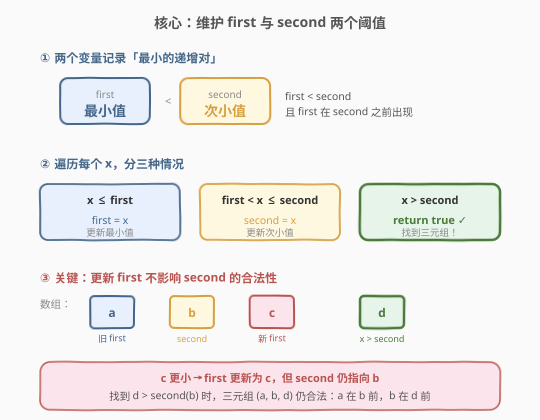
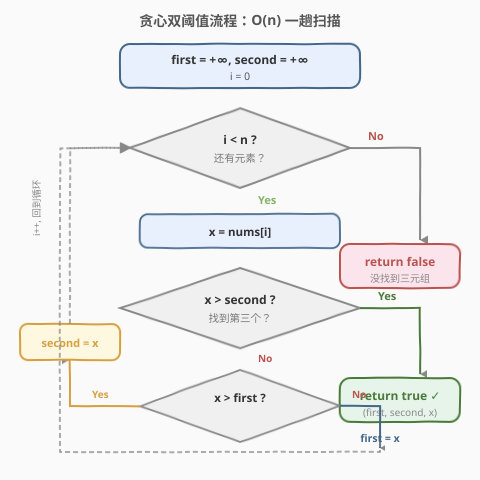
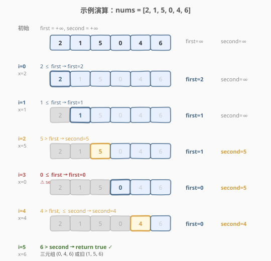

# LeetCode 递增的三元子序列 题解

## 1. 题目概述

- **标题 / 题号**：递增的三元子序列（#334，medium）
- **链接**：https://leetcode.cn/problems/increasing-triplet-subsequence/
- **难度**：中等
- **标签**：数组、贪心

**题意**：给你一个整数数组 `nums`，判断是否存在三元组 `(i, j, k)` 满足 `i < j < k` 且 `nums[i] < nums[j] < nums[k]`。若存在返回 `true`，否则返回 `false`。

**示例 1**：

```text
输入：nums = [1,2,3,4,5]
输出：true
解释：存在至少一个三元组，如 (1, 2, 3) 满足 1 < 2 < 3。
```

**示例 2**：

```text
输入：nums = [5,4,3,2,1]
输出：false
解释：数组严格递减，不存在递增三元组。
```

**示例 3**：

```text
输入：nums = [2,1,5,0,4,6]
输出：true
解释：三元组 (0, 4, 6) 满足 0 < 4 < 6，下标 3 < 4 < 5。
```

**约束**：

- $1 \le \text{nums.length} \le 5 \times 10^5$
- $-2^{31} \le \text{nums}[i] \le 2^{31} - 1$

> 💡 **进阶要求**：实现 $O(n)$ 时间、$O(1)$ 空间的解法。$n$ 高达 $5 \times 10^5$，$O(n^2)$ 会超时。

## 2. 解题思路

### 2.1 暴力思路

- **三重循环**：枚举所有 $(i, j, k)$ 组合，检查 `nums[i] < nums[j] < nums[k]`。时间 $O(n^3)$，完全不可行。
- **左右辅助数组**：预处理 `leftMin[i]`（`nums[0..i]` 最小值）和 `rightMax[i]`（`nums[i..n-1]` 最大值），再遍历 `j` 检查 `leftMin[j-1] < nums[j] < rightMax[j+1]`。时间 $O(n)$，但空间 $O(n)$，不满足进阶的 $O(1)$ 空间。

> ⚠️ 突破口：能否只维护**常数个变量**就判断出是否存在递增三元组？答案是贪心——维护「最小的 first」和「次小的 second」两个阈值即可。

### 2.2 核心观察：贪心双阈值



维护两个变量：

- **`first`**：到目前为止见过的**最小值**（潜在三元组的第一个元素）。
- **`second`**：在 `first` 之后出现的、比 `first` 大的**最小值**（潜在三元组的第二个元素）。

遍历每个 `x = nums[i]`，分三种情况：

| 情况 | 条件 | 操作 | 含义 |
|------|------|------|------|
| ① | $x \le \text{first}$ | `first = x` | 发现更小的值，更新 first |
| ② | $\text{first} < x \le \text{second}$ | `second = x` | 能接在 first 后面，更新更小的 second |
| ③ | $x > \text{second}$ | `return true` | 找到第三个，三元组成立！ |

> 💡 **直觉**：`first` 和 `second` 始终维护着「当前最优的递增对」——`first` 尽量小，`second` 尽量小。这样后面遇到比 `second` 大的数的概率最大。与 [300. 最长递增子序列](../0201-0300/300_最长递增子序列.md) 的 `tails` 数组思想一脉相承，只是这里固定 $k=3$，退化为两个变量。

### 2.3 关键难点：更新 first 为什么不影响 second？

这是本题最容易困惑的点：当 `first` 被更新为更小的值时，这个新 `first` **可能出现在 `second` 之后**——那 `(first, second)` 不就不合法了吗？

**答案是：不影响**。因为 `second` 被设置时，当时一定存在一个比它小的 `first` 在它**之前**。即使后来 `first` 被更新成更小的值（位置在 `second` 之后），`second` 的合法性仍然由**设置它时的那个旧 first** 保证。

所以当后续找到 $x > \text{second}$ 时，三元组 `(旧first, second, x)` 仍然合法——旧 first 在 second 前，second 在 x 前。

> ⚠️ 更新 `first` 的意义是：为**未来**可能出现的新 `second` 准备一个更小的起点，而不是为当前 `second` 服务。

### 2.4 算法流程图



### 2.5 示例演算

以 `nums = [2, 1, 5, 0, 4, 6]` 为例——这个例子专门展示「first 更新后 second 不变」的关键步骤：



| 步骤 | i | x | 判断 | first | second | 说明 |
|------|---|---|------|-------|--------|------|
| 初始 | — | — | — | $+\infty$ | $+\infty$ | 两个阈值初始化为无穷大 |
| 1 | 0 | 2 | $2 \le \text{first}$ | **2** | $+\infty$ | 第一个元素，设为 first |
| 2 | 1 | 1 | $1 \le \text{first}$ | **1** | $+\infty$ | 更小的值，更新 first |
| 3 | 2 | 5 | $5 > \text{first}, \le \text{second}$ | 1 | **5** | 找到递增对 (1, 5) |
| 4 | 3 | 0 | $0 \le \text{first}$ | **0** | 5 | ⚠ first 更新，second 不变 |
| 5 | 4 | 4 | $4 > \text{first}, \le \text{second}$ | 0 | **4** | 更优的 second，旧 first=1 仍保证 (1, 4) 合法 |
| 6 | 5 | 6 | $6 > \text{second}$ | 0 | 4 | ✅ 找到三元组，return true |

> 💡 **步骤 4 是关键**：`first` 从 1 变成 0（位置在 `second=5` 之后），但 `second=5` 仍合法——因为设置它时 `first=1` 在它之前。步骤 5 中 `second` 更新为 4，此时 `first=0` 在 4 之前（下标 3 < 4），(0, 4) 是合法对。最终 (0, 4, 6) 即为答案。

## 3. 参考代码

### C++

```cpp
class Solution {
public:
    bool increasingTriplet(vector<int>& nums) {
        long long first = LLONG_MAX, second = LLONG_MAX;
        for (int x : nums) {
            if (x <= first) {
                first = x;
            } else if (x <= second) {
                second = x;
            } else {
                return true;
            }
        }
        return false;
    }
};
```

### Python

```python
import math

class Solution:
    def increasingTriplet(self, nums: List[int]) -> bool:
        first = math.inf
        second = math.inf
        for x in nums:
            if x <= first:
                first = x
            elif x <= second:
                second = x
            else:
                return True
        return False
```

> 💡 **初始化用 `inf`**：`first` 和 `second` 初始设为正无穷，保证第一个元素一定走 `x <= first` 分支。C++ 中用 `LLONG_MAX` 是因为 `nums[i]` 可达 `INT_MAX`，用 `INT_MAX` 初始化会产生误判。Python 的 `math.inf` 与任意整数比较都正确，无此问题。

> ⚠️ **用 `<=` 而非 `<`**：条件写 `x <= first` 而非 `x < first`，确保相等元素走更新 first 分支而非推进 second——严格递增要求三者不同，相等值不应成为 second。

## 4. 复杂度分析

| 维度 | 复杂度 | 说明 |
|------|--------|------|
| 时间复杂度 | $O(n)$ | 一趟遍历，每个元素 $O(1)$ 比较 + 赋值 |
| 空间复杂度 | $O(1)$ | 仅 `first`、`second` 两个变量 |

> 💡 这是该题的最优解：时间已达下界 $O(n)$（必须至少看一遍所有元素），空间为常数。

## 5. 扩展：左右辅助数组法

若不追求 $O(1)$ 空间，可用左右辅助数组——思路更直观，适合作为面试时的过渡解法：

```python
def increasingTriplet(self, nums: List[int]) -> bool:
    n = len(nums)
    left_min = [0] * n
    right_max = [0] * n
    left_min[0] = nums[0]
    for i in range(1, n):
        left_min[i] = min(left_min[i - 1], nums[i])
    right_max[n - 1] = nums[n - 1]
    for i in range(n - 2, -1, -1):
        right_max[i] = max(right_max[i + 1], nums[i])
    for j in range(1, n - 1):
        if left_min[j - 1] < nums[j] < right_max[j + 1]:
            return True
    return False
```

- `left_min[j-1]`：`j` 左侧的最小值，存在比 `nums[j]` 小的元素。
- `right_max[j+1]`：`j` 右侧的最大值，存在比 `nums[j]` 大的元素。
- 若二者都满足，则以 `j` 为中间元素的三元组存在。

时间 $O(n)$，空间 $O(n)$。面试时先说此解法建立思路，再优化到贪心双阈值 $O(1)$ 空间，展示渐进优化能力。

## 6. 面试要点

1. **更新 `first` 后 `second` 为什么仍然合法？**
   - `second` 被设置时，当时的 `first` 一定在它之前且比它小。后来 `first` 更新成更小的值（可能在 `second` 之后），但 `second` 的合法性由设置时的旧 `first` 保证。找到 `x > second` 时，三元组 `(旧first, second, x)` 仍然合法。

2. **为什么条件用 `<=` 而非 `<`？**
   - 题目要求严格递增（`nums[i] < nums[j] < nums[k]`）。若 `x == first`，用 `<=` 让它走更新 first 分支，避免相等值被当作 second。同理 `x <= second` 也用 `<=`，防止相等值推进到第三个位置。

3. **`first` 和 `second` 初始值为什么用 `inf`？**
   - 保证第一个元素必然满足 `x <= first`，从而正确初始化 `first`。若初始为 `nums[0]`，第二个元素的处理会出错。C++ 注意用 `LLONG_MAX` 而非 `INT_MAX`，因为 `nums[i]` 可达 `INT_MAX`。

4. **与 LIS（300 题）的关系？**
   - 本题是 LIS 的特例：判断 LIS 长度是否 $\geq 3$。300 题用 `tails` 数组 + 二分求通用 LIS，$O(n \log n)$。本题固定 $k=3$，`tails` 数组退化为两个变量 `first`、`second`，无需二分，$O(n)$ 即可。若推广为「递增的 k 元子序列」，则维护 $k-1$ 个阈值。

5. **能否推广到「递增的 k 元子序列」？**
   - 可以。维护 $k-1$ 个阈值 `t[0..k-2]`，对每个 `x` 从左到右找第一个 `x > t[i]` 的位置：若 `i == k-1` 则找到 k 元组返回 true；否则 `t[i] = x`。时间 $O(nk)$，当 $k$ 较大时退化为 $O(n \log n)$（二分查找阈值位置）。

## 同类练习题

| # | 题目 | 与本题的关联 |
|---|------|-------------|
| 300 | [最长递增子序列](https://leetcode.cn/problems/longest-increasing-subsequence/)（[题解](../0201-0300/300_最长递增子序列.md)） | 通用版 LIS，维护 `tails` 数组 + 二分，$O(n \log n)$；本题是其 $k=3$ 特例 |
| 376 | [摆动序列](https://leetcode.cn/problems/wiggle-subsequence/) | 贪心维护峰谷状态，与本题「维护极值阈值」思想类似 |
| 392 | [判断子序列](https://leetcode.cn/problems/is-subsequence/)（[题解](../0301-0400/392_判断子序列.md)） | 双指针判定子序列，另一种「保序匹配」思路 |
| 152 | [乘积最大子数组](https://leetcode.cn/problems/maximum-product-subarray/)（[题解](../0101-0200/152_乘积最大子数组.md)） | 维护 min/max 两个状态变量，与本题双阈值结构相似 |
