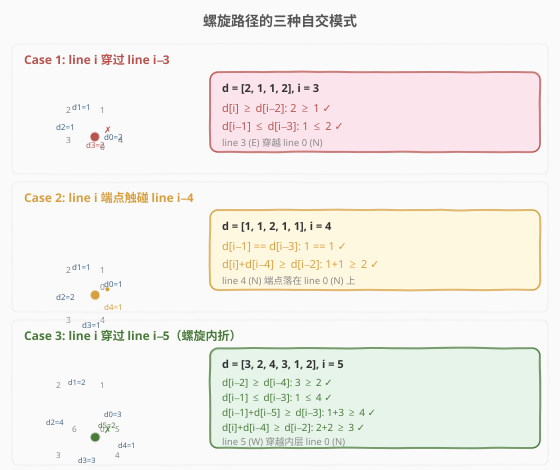
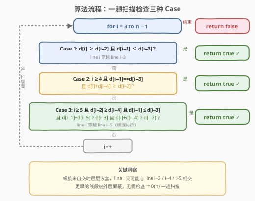
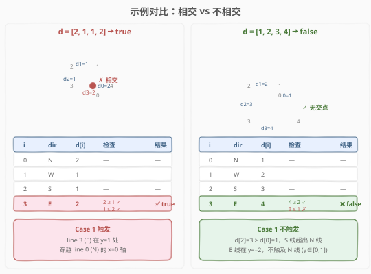

# LeetCode 路径交叉 题解

## 1. 题目概述

- **标题 / 题号**：路径交叉（#335，hard）
- **链接**：https://leetcode.cn/problems/self-crossing/
- **难度**：困难
- **标签**：几何、数组、数学

**题意**：从 X-Y 平面上的点 $(0,0)$ 开始，先向北移动 `distance[0]` 米，然后向西移动 `distance[1]` 米，向南移动 `distance[2]` 米，向东移动 `distance[3]` 米，持续移动。每次移动后方位**逆时针变化**（N→W→S→E→N→…）。判断所经过的路径是否**自交**（相交返回 `true`，否则返回 `false`）。

**示例 1**：

```text
输入：distance = [2,1,1,2]
输出：true
```

**示例 2**：

```text
输入：distance = [1,2,3,4]
输出：false
```

**示例 3**：

```text
输入：distance = [1,1,1,1]
输出：true
```

**约束**：

- $1 \le \text{distance.length} \le 10^5$
- $1 \le \text{distance}[i] \le 10^5$

> 💡 $n$ 高达 $10^5$，两两线段判交的 $O(n^2)$ 会超时。突破口在于路径是**螺旋形**的，利用螺旋结构可将检查范围缩减到常数。

## 2. 解题思路

### 2.1 暴力思路

模拟每一步移动，记录所有已走过的线段。每新增一条线段时，检查它是否与之前**任意**一条线段相交。线段相交判定本身是 $O(1)$（参数方程或跨立实验），但两两比较总共 $O(n^2)$，对于 $n = 10^5$ 必然超时。

> ⚠️ 突破口：路径是**螺旋形**的（逆时针 N→W→S→E 循环）。在螺旋**尚未自交**的前提下，当前第 $i$ 条线段**最多只能**与第 $i{-}3$、$i{-}4$、$i{-}5$ 条线段相交——更早的线段被外层"屏蔽"。因此只需逐位置检查 3 种 case，$O(n)$ 一趟扫描即可。

### 2.2 核心观察：螺旋的三种自交模式



螺旋路径在**未自交时层层嵌套**。第 $i$ 条线段被相邻的 $i{-}1$（垂直）和 $i{-}2$（平行）"包夹"，只能向内层伸展。内层最近的线段依次是 $i{-}3$（垂直）、$i{-}4$（平行）、$i{-}5$（垂直）。再往内的线段被 $i{-}4$ 屏蔽，不可能被触及。

三种自交模式：

| Case | 相交对象 | 条件（$i$ 从 0 起） | 几何含义 |
|------|---------|----------------------|---------|
| **1** | line $i{-}3$ | $d[i] \ge d[i{-}2]$ 且 $d[i{-}1] \le d[i{-}3]$ | 当前线段穿越 3 步前的垂直线段 |
| **2** | line $i{-}4$ | $i \ge 4$, $d[i{-}1] == d[i{-}3]$ 且 $d[i]+d[i{-}4] \ge d[i{-}2]$ | 当前线段端点恰好触碰 4 步前的平行线段 |
| **3** | line $i{-}5$ | $i \ge 5$, $d[i{-}2] \ge d[i{-}4]$ 且 $d[i{-}1] \le d[i{-}3]$ 且 $d[i{-}1]+d[i{-}5] \ge d[i{-}3]$ 且 $d[i]+d[i{-}4] \ge d[i{-}2]$ | 螺旋"内折"，当前线段穿越 5 步前的线段 |

> 💡 **为什么只需检查 $i{-}3$/$i{-}4$/$i{-}5$？** 螺旋在未自交时层层嵌套，外层线段比内层长。一旦某条线段"不够长"（短于 4 步前的平行线段），螺旋就开始**内折**，只可能碰到最近的 3 条内层线段之一。更早的线段被 $i{-}4$ 这条平行线挡住，物理上不可达。

### 2.3 三种 Case 的几何推导

#### Case 1：line $i$ 穿过 line $i{-}3$

以 $i=3$ 为例（line 3 向东 E，line 0 向北 N）：

- line 0 在 $x=0$，$y \in [0,\ d[0]]$
- line 3 在 $y = d[0]-d[2]$，$x \in [-d[1],\ -d[1]+d[3]]$
- 相交条件：line 3 的 $x$ 范围覆盖 $x=0$ → $d[3] \ge d[1]$；line 3 的 $y$ 落在 line 0 的范围内 → $d[2] \le d[0]$

推广到任意 $i$：$d[i] \ge d[i{-}2]$ 且 $d[i{-}1] \le d[i{-}3]$。

#### Case 2：line $i$ 端点触碰 line $i{-}4$

当 Case 1 不成立（$d[i] < d[i{-}2]$，即 line $i$ 不够长，无法穿越 line $i{-}3$），但 line $i{-}1$ **恰好等于** line $i{-}3$ 时，line $i$ 的端点可能恰好落在 line $i{-}4$ 上（触碰而非穿越）。

- $d[i{-}1] == d[i{-}3]$：line $i{-}1$ 与 line $i{-}3$ 等长，使 line $i$ 起点恰在 line $i{-}4$ 的延长线上
- $d[i]+d[i{-}4] \ge d[i{-}2]$：line $i$ 够长，能触及 line $i{-}4$

#### Case 3：line $i$ 穿过 line $i{-}5$

螺旋"内折"——line $i{-}2$ 比 line $i{-}4$ **长**（突出一截），line $i{-}1$ 比 line $i{-}3$ **短**（未顶到外层），line $i$ 可能穿过更内的 line $i{-}5$。

| 条件 | 几何含义 |
|------|---------|
| $d[i{-}2] \ge d[i{-}4]$ | line $i{-}2$ 突出于 line $i{-}4$，使 line $i$ 起点越过内层边界 |
| $d[i{-}1] \le d[i{-}3]$ | line $i$ 的垂直坐标落在 line $i{-}5$ 的范围内（上界） |
| $d[i{-}1]+d[i{-}5] \ge d[i{-}3]$ | line $i$ 的垂直坐标不低于 line $i{-}5$ 的下端点（下界） |
| $d[i]+d[i{-}4] \ge d[i{-}2]$ | line $i$ 够长，能延伸到 line $i{-}5$ 所在位置 |

> ⚠️ Case 2 和 Case 3 都是在 Case 1 **不触发**的前提下才会被检查到。算法按 Case 1 → Case 2 → Case 3 的顺序短路判断，一旦命中即返回 `true`。

### 2.4 算法流程图



### 2.5 示例演算

以 `distance = [2,1,1,2]`（示例 1，相交）和 `distance = [1,2,3,4]`（示例 2，不相交）对比：



**示例 1** $d = [2,1,1,2]$ 的逐步追踪：

| 步骤 | $i$ | 方向 | $d[i]$ | 检查 | 结果 |
|------|-----|------|--------|------|------|
| 0 | — | N | 2 | — | $(0,0) \to (0,2)$ |
| 1 | — | W | 1 | — | $\to (-1,2)$ |
| 2 | — | S | 1 | — | $\to (-1,1)$ |
| 3 | 3 | E | 2 | $d[3]{=}2 \ge d[1]{=}1$ ✓，$d[2]{=}1 \le d[0]{=}2$ ✓ | ✅ Case 1 命中，相交 |

> 💡 line 3（E 方向，$y=1$）穿越 line 0（N 方向，$x=0$，$y \in [0,2]$）于点 $(0,1)$。$d[3] \ge d[1]$ 保证 E 线覆盖 $x=0$，$d[2] \le d[0]$ 保证交点 $y$ 值在 N 线范围内。

**示例 2** $d = [1,2,3,4]$ 在 $i=3$ 处检查：

- Case 1：$d[3]{=}4 \ge d[1]{=}2$ ✓，但 $d[2]{=}3 \le d[0]{=}1$ ✗ → 不触发。
- E 线在 $y = d[0]-d[2] = 1-3 = -2$，而 N 线 $y \in [0,1]$，$y=-2$ 不在范围内 → 螺旋外扩，无相交。

## 3. 参考代码

### C++

```cpp
class Solution {
public:
    bool isSelfCrossing(vector<int>& distance) {
        int n = distance.size();
        for (int i = 3; i < n; ++i) {
            // Case 1: line i 穿过 line i-3
            if (distance[i] >= distance[i - 2] &&
                distance[i - 1] <= distance[i - 3])
                return true;
            // Case 2: line i 端点触碰 line i-4
            if (i >= 4 &&
                distance[i - 1] == distance[i - 3] &&
                distance[i] + distance[i - 4] >= distance[i - 2])
                return true;
            // Case 3: line i 穿过 line i-5（螺旋内折）
            if (i >= 5 &&
                distance[i - 2] >= distance[i - 4] &&
                distance[i - 1] <= distance[i - 3] &&
                distance[i - 1] + distance[i - 5] >= distance[i - 3] &&
                distance[i] + distance[i - 4] >= distance[i - 2])
                return true;
        }
        return false;
    }
};
```

### Python

```python
class Solution:
    def isSelfCrossing(self, distance: List[int]) -> bool:
        n = len(distance)
        for i in range(3, n):
            # Case 1: line i 穿过 line i-3
            if distance[i] >= distance[i - 2] and \
               distance[i - 1] <= distance[i - 3]:
                return True
            # Case 2: line i 端点触碰 line i-4
            if i >= 4 and \
               distance[i - 1] == distance[i - 3] and \
               distance[i] + distance[i - 4] >= distance[i - 2]:
                return True
            # Case 3: line i 穿过 line i-5（螺旋内折）
            if i >= 5 and \
               distance[i - 2] >= distance[i - 4] and \
               distance[i - 1] <= distance[i - 3] and \
               distance[i - 1] + distance[i - 5] >= distance[i - 3] and \
               distance[i] + distance[i - 4] >= distance[i - 2]:
                return True
        return False
```

> 💡 **边界安全**：循环从 $i=3$ 开始，Case 2 要求 $i \ge 4$，Case 3 要求 $i \ge 5$，各自的 `if` 条件已内含下标守卫，不会越界。$n \le 3$ 时循环不执行，直接返回 `false`（至少需要 4 条线段才可能自交）。

## 4. 复杂度分析

| 维度 | 复杂度 | 说明 |
|------|--------|------|
| 时间复杂度 | $O(n)$ | 一趟遍历，每个位置 $O(1)$ 检查三种 case（短路求值） |
| 空间复杂度 | $O(1)$ | 仅循环变量 $i$，原地访问数组 |

> 💡 这是该题的最优解：时间已达下界 $O(n)$（必须至少看一遍所有元素），空间为常数。关键在于利用螺旋几何结构将 $O(n^2)$ 的两两判交压缩为 $O(n)$ 的局部检查。

## 5. 扩展：为什么三种 Case 是完备的？

> 本节回答一个自然疑问：**为什么 line $i$ 不可能与 line $i{-}6$ 或更早的线段相交？**

**归纳论证**：在螺旋未自交的前提下，各层线段按"外层 > 内层"的长度关系嵌套排列。

1. **平行线屏蔽**：line $i$ 与 line $i{-}4$ 平行。若 $d[i{-}2] < d[i{-}4]$（螺旋仍在外扩），line $i$ 被 line $i{-}2$ 包在 line $i{-}4$ 内侧，物理上无法触及 line $i{-}6$（被 line $i{-}4$ 隔开）。
2. **内折触发**：只有当 $d[i{-}2] \ge d[i{-}4]$（line $i{-}2$ 突出），螺旋才开始内折。此时 line $i$ 最多伸到 line $i{-}5$（内层最近垂直线）。line $i{-}6$ 被 line $i{-}4$ 的"突出部分"遮挡。
3. **递推不变**：一旦 line $i$ 检查通过（未自交），后续线段只与更近的邻居比较，归纳关系成立。

因此，**只需检查 $i{-}3$、$i{-}4$、$i{-}5$ 三种 case 即可覆盖所有可能的自交情形**。

## 6. 面试要点

1. **为什么只检查 $i{-}3$ / $i{-}4$ / $i{-}5$ 三种 case？**
   - 螺旋路径在未自交时层层嵌套。第 $i$ 条线段被相邻的 $i{-}1$（垂直）和 $i{-}2$（平行）包夹，只能向内层伸展。内层最近的线段是 $i{-}3$（垂直）、$i{-}4$（平行）、$i{-}5$（垂直）。再往内的线段被 $i{-}4$ 屏蔽，物理上不可达。

2. **Case 2 是 Case 1 和 Case 3 的边界情况吗？**
   - Case 2 处理 line $i{-}1$ **恰好等于** line $i{-}3$ 的"擦边"情形：line $i$ 的端点恰好落在 line $i{-}4$ 上（触碰而非穿越）。此时 Case 1 不触发（因为 $d[i] < d[i{-}2]$），Case 3 也不触发（需要 $d[i{-}1] < d[i{-}3]$ 严格小于，而此处是等于），所以需要单独处理。

3. **Case 3 的四个条件各自几何含义？**
   - $d[i{-}2] \ge d[i{-}4]$：line $i{-}2$ 突出于 line $i{-}4$，使 line $i$ 起点越过内层边界
   - $d[i{-}1] \le d[i{-}3]$：line $i$ 的垂直坐标落在 line $i{-}5$ 范围内（上界）
   - $d[i{-}1]+d[i{-}5] \ge d[i{-}3]$：line $i$ 的垂直坐标不低于 line $i{-}5$ 下端点（下界）
   - $d[i]+d[i{-}4] \ge d[i{-}2]$：line $i$ 够长，能延伸到 line $i{-}5$ 所在位置

4. **能否用线段相交模拟？**
   - 可以但不必。暴力法记录所有线段两两判交，$O(n^2)$，本题 $n = 10^5$ 会超时。螺旋结构是关键——它将"任意线段相交"压缩为"只查 3 条邻近线段"。面试时先说暴力法建立思路，再利用螺旋结构优化到 $O(n)$。

5. **方向顺序对算法有影响吗？**
   - 不影响。方向序列 N→W→S→E（逆时针）保证螺旋的嵌套结构。若改为顺时针（N→E→S→W），三种 case 的条件**完全相同**——因为平行/垂直关系和长度比较不受旋转方向影响。

## 同类练习题

| # | 题目 | 与本题的关联 |
|---|------|-------------|
| 54 | [螺旋矩阵](https://leetcode.cn/problems/spiral-matrix/)（[题解](../0001-0100/54_螺旋矩阵.md)） | 螺旋方向遍历矩阵，方向数组 + 边界收缩，与本题共享"螺旋几何"直觉 |
| 59 | [螺旋矩阵 II](https://leetcode.cn/problems/spiral-matrix-ii/)（[题解](../0001-0100/59_螺旋矩阵II.md)） | 螺旋生成路径，方向数组模拟，对照本题的螺旋判定 |
| 149 | [直线上最多的点数](https://leetcode.cn/problems/max-points-on-a-line/)（[题解](../0101-0200/149_直线上最多的点数.md)） | 几何分类讨论 + 斜率哈希，同为"几何 + case 分析"题型 |
| 201 | [数字范围按位与](https://leetcode.cn/problems/bitwise-and-of-numbers-range/)（[题解](../0201-0300/201_数字范围按位与.md)） | 看似需逐个枚举，实则找规律缩范围，与本题"看似 $O(n^2)$ 实则 $O(n)$"的思想一致 |
