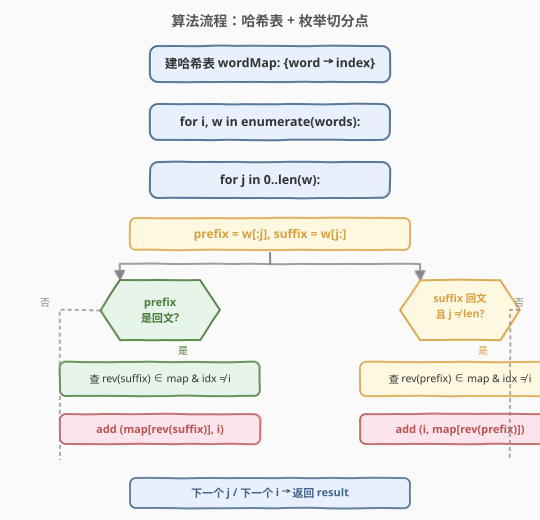
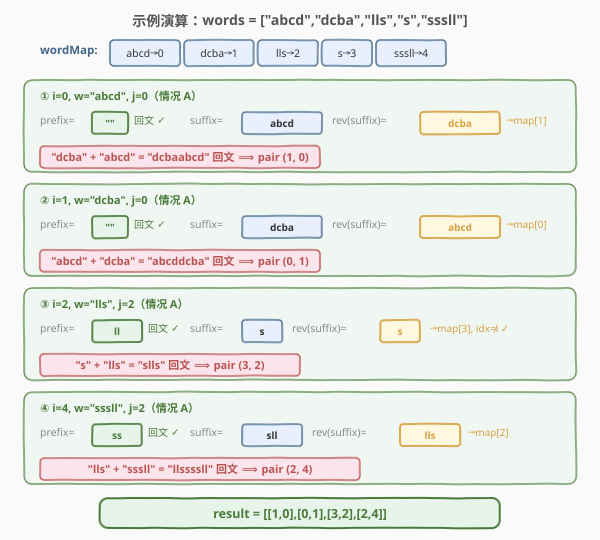
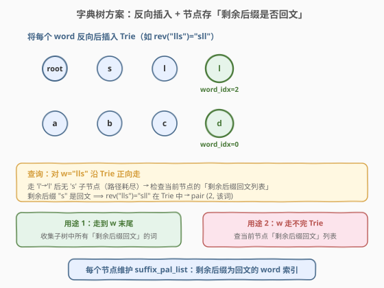

# 回文对

- **题目名称**：回文对
- **链接**：[336. 回文对](https://leetcode.cn/problems/palindrome-pairs/)
- **难度**：困难
- **标签**：字典树、哈希表、字符串、回文

## 1. 题目概述

给定一个**互不相同**的字符串数组 `words`，找出所有下标对 `(i, j)`，使得 `i != j` 且 `words[i] + words[j]`（即 `words[i]` 拼上 `words[j]`）是一个**回文串**。返回所有满足条件的下标对列表，顺序不限。

**示例 1**：

```text
输入：words = ["abcd","dcba","lls","s","sssll"]
输出：[[1,0],[0,1],[3,2],[2,4]]
解释：
  "dcba" + "abcd" = "dcbaabcd"（回文）→ (1, 0)
  "abcd" + "dcba" = "abcddcba"（回文）→ (0, 1)
  "s"    + "lls"  = "slls"    （回文）→ (3, 2)
  "lls"  + "sssll"= "llssssll"（回文）→ (2, 4)
```

**示例 2**：

```text
输入：words = ["bat","tab","cat"]
输出：[[0,1],[1,0]]
解释："bat" + "tab" = "battab"（回文），"tab" + "bat" = "tabbat"（回文）
```

**示例 3**：

```text
输入：words = ["a",""]
输出：[[0,1],[1,0]]
解释：空串与任何回文串拼接仍为回文。"a" + "" = "a"，"" + "a" = "a"
```

**约束条件**：

- `1 <= n <= 5000`
- `0 <= words[i].length <= 300`
- `words[i]` 仅由小写英文字母组成
- `words` 中所有字符串**互不相同**

> ⚠️ 暴力两两拼接判回文是 $O(n^2 \cdot k)$，$n=5000$ 时约 $1.25 \times 10^7$ 次配对、每次还要 $O(k)$ 判回文，必然超时。本题的核心是**把「找配对」从 $O(n^2)$ 降到 $O(n \cdot k^2)$**——不再枚举配对，而是枚举每个词内部的「切分点」。

---

## 2. 解题思路

### 2.1 暴力思路

双重循环枚举所有 $(i, j)$（$i \neq j$），拼接 `words[i] + words[j]` 后判回文。共 $O(n^2)$ 个配对，每次判回文 $O(k)$，总时间 $O(n^2 \cdot k)$。$n = 5000$ 时配对数已达 $2.5 \times 10^7$，再乘 $k$ 必然超时。

> 💡 暴力法的问题：**把每两个词看成独立配对**，完全没利用「回文的结构性」。回文串 `A + B` 意味着 `A` 的某段是 `B` 反转的一部分——我们可以从单个词出发，枚举它内部的切分点，用哈希表 $O(1)$ 查到配对词，而非逐一试错。

### 2.2 核心观察：拆分 w[i] = prefix + suffix，按回文侧查哈希表

![核心观察：拆分 w[i] = prefix + suffix，按回文侧查哈希表](../images/palpairs_concept.svg)

把每个词 `w[i]` 在**每个可能的位置 $j$** 切成两段：`prefix = w[0:j]`、`suffix = w[j:]`。由于我们希望 `words[k] + w[i]` 或 `w[i] + words[k]` 是回文，只有两种拼接方式，对应两个分支：

**情况 A**（`words[k] + w[i]` 是回文）：把 `w[i]` 拆成 `prefix + suffix`，如果 **`prefix` 是回文**，那么 `words[k]` 必须等于 `rev(suffix)`：

$$\text{words}[k] + \text{w}[i] = \underbrace{\text{rev(suffix)}}_{\text{words}[k]} + \underbrace{\text{prefix}}_{\text{回文}} + \text{suffix}$$

整体反转后 = `rev(suffix) + rev(prefix) + suffix`，因为 `prefix` 是回文（`rev(prefix) = prefix`），故与原串相等 → 回文成立。此时配对为 **$(k,\, i)$**。

**情况 B**（`w[i] + words[k]` 是回文）：如果 **`suffix` 是回文**，那么 `words[k]` 必须等于 `rev(prefix)`：

$$\text{w}[i] + \text{words}[k] = \text{prefix} + \underbrace{\text{suffix}}_{\text{回文}} + \underbrace{\text{rev(prefix)}}_{\text{words}[k]}$$

同理可证回文成立。此时配对为 **$(i,\, k)$**。

> 💡 **为什么能避免重复计数？** 情况 A 在 $j = 0$（`prefix = ""`，恒为回文）时会找到「整词反转」配对 $(k, i)$；情况 B 在 $j = \text{len}$（`suffix = ""`，恒为回文）时会找到对称配对 $(i, k)$。如果两个分支都无条件运行，处理 `w[k] = rev(w[i])` 时会把同一对再找一遍。**解决办法**：情况 B 增加 `j != len(w)` 的守卫，把「整词反转」的 $(i, k)$ 交给情况 A 在处理 `w[k]` 时一次性发现。这样每对只产生一次。

### 2.3 算法流程图



整体只有两重循环（外层遍历 $n$ 个词，内层遍历 $k+1$ 个切分点），每次切分做两次 $O(k)$ 的回文判定 + $O(k)$ 的反转 + $O(k)$ 的哈希查表，总时间 $O(n \cdot k^2)$。

### 2.4 示例演算

以 `words = ["abcd","dcba","lls","s","sssll"]` 为例，先建哈希表 `{abcd:0, dcba:1, lls:2, s:3, sssll:4}`，然后逐词枚举切分点。下图展示四个关键命中（省略未命中的切分点）：



| i | w[i] | j | prefix | suffix | 命中情况 | 产出 pair |
|---|------|---|--------|--------|----------|-----------|
| 0 | `abcd` | 0 | `""`(回文) | `abcd` | `rev(abcd)="dcba"` → map[1] | **(1, 0)** |
| 1 | `dcba` | 0 | `""`(回文) | `dcba` | `rev(dcba)="abcd"` → map[0] | **(0, 1)** |
| 2 | `lls`  | 2 | `"ll"`(回文) | `s` | `rev(s)="s"` → map[3], idx≠i | **(3, 2)** |
| 4 | `sssll`| 2 | `"ss"`(回文) | `sll` | `rev(sll)="lls"` → map[2] | **(2, 4)** |

> ⚠️ **注意 `i=3`（`w="s"`）为什么没产出？** $j=0$ 时情况 A 查 `rev("s")="s"` → map[3]，但 `idx == i`（自配对，排除）；$j=1$ 时情况 A 查 `rev("")=""` 不在表中、情况 B 被 `j == len` 守卫跳过。单字符词只能靠配对方（如 `i=2` 的 `lls`）来发现。

---

## 3. 参考代码

### C++

```cpp
class Solution {
  public:
    vector<vector<int>> palindromePairs(vector<string>& words) {
        unordered_map<string, int> wordMap;
        for (int i = 0; i < (int)words.size(); ++i) {
            wordMap[words[i]] = i;
        }

        vector<vector<int>> res;
        for (int i = 0; i < (int)words.size(); ++i) {
            const string& w = words[i];
            int L = (int)w.size();
            for (int j = 0; j <= L; ++j) {
                string prefix = w.substr(0, j);
                string suffix = w.substr(j);

                // 情况 A：prefix 是回文 ⟹ 前接 rev(suffix)
                if (isPalindrome(prefix)) {
                    string revSuffix = suffix;
                    reverse(revSuffix.begin(), revSuffix.end());
                    auto it = wordMap.find(revSuffix);
                    if (it != wordMap.end() && it->second != i) {
                        res.push_back({it->second, i});
                    }
                }

                // 情况 B：suffix 是回文 ⟹ 后接 rev(prefix)
                // j != L 守卫：避免与情况 A 的 j=0 重复发现「整词反转」配对
                if (j != L && isPalindrome(suffix)) {
                    string revPrefix = prefix;
                    reverse(revPrefix.begin(), revPrefix.end());
                    auto it = wordMap.find(revPrefix);
                    if (it != wordMap.end() && it->second != i) {
                        res.push_back({i, it->second});
                    }
                }
            }
        }
        return res;
    }

  private:
    bool isPalindrome(const string& s) {
        int l = 0, r = (int)s.size() - 1;
        while (l < r) {
            if (s[l++] != s[r--]) return false;
        }
        return true;
    }
};
```

### Python

```python
class Solution:
    def palindromePairs(self, words: List[str]) -> List[List[int]]:
        word_map = {w: i for i, w in enumerate(words)}
        res = []

        for i, w in enumerate(words):
            L = len(w)
            for j in range(L + 1):
                prefix = w[:j]
                suffix = w[j:]

                # 情况 A：prefix 是回文 ⟹ 前接 rev(suffix)
                if prefix == prefix[::-1]:
                    rev_suffix = suffix[::-1]
                    k = word_map.get(rev_suffix)
                    if k is not None and k != i:
                        res.append([k, i])

                # 情况 B：suffix 是回文 ⟹ 后接 rev(prefix)
                # j != L 守卫：避免与情况 A 的 j=0 重复发现「整词反转」配对
                if j != L and suffix == suffix[::-1]:
                    rev_prefix = prefix[::-1]
                    k = word_map.get(rev_prefix)
                    if k is not None and k != i:
                        res.append([i, k])

        return res
```

> ⚠️ 两个关键守卫：① `k != i` 排除自配对（题目要求 $i \neq j$）；② 情况 B 的 `j != L` 避免与情况 A 重复发现整词反转对。漏掉任一都会导致重复或错误。

---

## 4. 复杂度分析

| 维度 | 复杂度 | 说明 |
|------|--------|------|
| 时间复杂度 | $O(n \cdot k^2)$ | 外层 $n$ 个词 × 内层 $k+1$ 个切分点；每次切分做 $O(k)$ 回文判定 + $O(k)$ 反转 + $O(k)$ 哈希查表 |
| 空间复杂度 | $O(n \cdot k)$ | 哈希表存 $n$ 个词，每个词最长 $k$ |

> 💡 与暴力 $O(n^2 \cdot k)$ 相比，当 $n \gg k$ 时（本题 $n \le 5000$、$k \le 300$），哈希方案把 $n^2$ 降为 $n \cdot k$，改善约一个数量级。若 $k$ 很大而 $n$ 很小，两者差距缩小，但哈希方案仍不差于暴力。

---

## 5. 扩展：字典树（Trie）解法



哈希表的瓶颈在于每个切分点都要 $O(k)$ 反转字符串再查表。**字典树方案**把「反转后查表」变成「沿树边走」，且把「回文判定」预处理到节点上，单次查询只需 $O(k)$ 而非 $O(k^2)$。

**核心思路**：

1. **反向插入**：把每个 `word` 反转后插入 Trie。这样 `rev(suffix)` 是否存在，等价于「能否沿 Trie 从根走出 `suffix` 的字符序列」。
2. **节点预处理**：每个节点额外维护一个列表 `suffix_pal_list`，记录「从该节点继续走到底、剩余部分是回文」的所有词的索引。插入时沿路径标记：若 `word[j:]` 是回文，就把当前词索引加入该节点的列表。
3. **查询**：对每个 `w[i]`，沿 Trie 正向走（因为树里存的是反转词）：
   - **走到 `w[i]` 末尾仍未耗尽路径**：当前节点的 `word_idx`（若有）对应一个完整匹配词，且 `w[i]` 的剩余后缀是回文 → 配对 $(i, \text{word\_idx})$；
   - **路径提前耗尽**：收集当前节点的 `suffix_pal_list` 中所有索引 $k$ → 配对 $(i, k)$（因为 `w[i]` 是某个反转词的前缀，剩余部分是回文）。

```python
class TrieNode:
    def __init__(self):
        self.children = {}
        self.word_idx = -1        # 以该节点结尾的词索引（-1 表示无）
        self.suffix_pal_list = [] # 从该节点起、剩余后缀为回文的词索引

class Solution:
    def palindromePairs(self, words: List[str]) -> List[List[int]]:
        root = TrieNode()
        for i, w in enumerate(words):
            self._insert(root, w, i)

        res = []
        for i, w in enumerate(words):
            res.extend(self._query(root, w, i))
        return res

    def _is_pal(self, s: str, lo: int, hi: int) -> bool:
        while lo < hi:
            if s[lo] != s[hi]:
                return False
            lo += 1
            hi -= 1
        return True

    def _insert(self, root: TrieNode, word: str, idx: int) -> None:
        node = root
        # 反向插入：从 word 末尾向前走
        for j in range(len(word) - 1, -1, -1):
            ch = word[j]
            if ch not in node.children:
                node.children[ch] = TrieNode()
            # 从当前位置 j 往后（word[j:]）是否回文
            if self._is_pal(word, 0, j):
                node.suffix_pal_list.append(idx)
            node = node.children[ch]
        node.word_idx = idx

    def _query(self, root: TrieNode, word: str, idx: int) -> List[List[int]]:
        res = []
        node = root
        # 情况 B：word 走在 Trie 前面耗尽，收集「剩余后缀回文」的词
        for j, ch in enumerate(word):
            # 路径上遇到完整词，且 word 剩余部分回文 → (该词, idx) 配对
            if node.word_idx >= 0 and node.word_idx != idx and self._is_pal(word, j, len(word) - 1):
                res.append([node.word_idx, idx])
            if ch not in node.children:
                return res  # 路径耗尽
            node = node.children[ch]

        # word 走完，Trie 未耗尽：收集子树中「剩余后缀回文」的词 → (idx, k)
        if node.word_idx >= 0 and node.word_idx != idx:
            res.append([idx, node.word_idx])
        for k in node.suffix_pal_list:
            if k != idx:
                res.append([idx, k])
        return res
```

| 维度 | 哈希表方案 | 字典树方案 |
|------|-----------|-----------|
| 时间复杂度 | $O(n \cdot k^2)$ | $O(n \cdot k^2)$（建树 $O(n \cdot k^2)$ + 查询 $O(n \cdot k^2)$，常数更优） |
| 空间复杂度 | $O(n \cdot k)$ | $O(n \cdot k)$（节点数 $\le n \cdot k$） |
| 实现复杂度 | 低，逻辑直白 | 高，需维护 `suffix_pal_list` |
| 适用场景 | 面试首选，快速写出 | 面试官追问「能否优化回文判定」时给出 |

> 💡 两者渐近复杂度相同（都是 $O(n \cdot k^2)$），但字典树把「反转 + 哈希」的 $O(k)$ 常数换成「沿树边走」的 $O(1)$，且回文判定在插入时预处理，实际运行更快。面试中**先给哈希方案**讲清思路，再口述字典树优化方向即可。

---

## 6. 面试要点

1. **为什么枚举切分点而不是枚举配对？**

   - 枚举配对是 $O(n^2)$，而回文的结构性告诉我们：`A + B` 是回文 ⟺ `A` 的某段前缀（或后缀）是 `B` 反转的一部分，且剩余段是回文。从单个词出发枚举 $k+1$ 个切分点，把「找配对」从 $O(n^2)$ 降到 $O(n \cdot k)$ 次哈希查表。

2. **情况 B 为什么要加 `j != len(w)` 守卫？**

   - 当 $j = \text{len}(w)$ 时，`suffix = ""`（恒为回文），情况 B 会查 `rev(prefix) = rev(w)`，产出 $(i, k)$。但这与情况 A 在 $j = 0$ 处理 `w[k] = rev(w[i])` 时产出的 $(i, k)$ 重复。加守卫把「整词反转」配对统一交给情况 A 在处理反转方时发现，避免重复。

3. **空串如何处理？**

   - 空串 `""` 的 `rev("") = ""`。当 `w[i]` 是回文且 `""` 在表中（索引 $k$）时：$j = \text{len}$ 处情况 A 查 `rev("") = ""` → 产出 $(k, i)$（`"" + w[i]`）；$j = 0$ 处情况 B 查 `rev(w[i])` → 若 `w[i]` 回文则产出 $(i, k)$（`w[i] + ""`）。两个方向都覆盖，无需特判。

4. **`k != i` 的作用是什么？能不能去掉？**

   - 不能。题目要求 $i \neq j$。当 `w[i]` 本身是回文（如 `"aba"`）且切分点使 `rev(suffix) = w[i]`（或 `rev(prefix) = w[i]`）时，哈希表会命中自身索引，必须用 `k != i` 排除自配对。

5. **字典树方案相比哈希表方案的优势在哪？**

   - 哈希表每个切分点要 $O(k)$ 反转字符串 + $O(k)$ 哈希计算；字典树把「反转」变成「建树时一次性反向插入」，把「查表」变成「沿边走 $O(1)$」。此外，回文判定可以在插入时预处理到节点的 `suffix_pal_list` 上，查询时直接收集，避免重复判定。渐近复杂度相同，常数更优。

---

## 7. 同类练习题

- [5. 最长回文子串](https://leetcode.cn/problems/longest-palindromic-substring/)：回文判定的招牌题，中心扩展 / Manacher，理解回文结构性的基础
- [131. 分割回文串](https://leetcode.cn/problems/palindrome-partitioning/)：回文判定 + 回溯，预处理回文表的思想可迁移到字典树的 `suffix_pal_list`
- [214. 最短回文串](https://leetcode.cn/problems/shortest-palindrome/)：在字符串前添加字符使其成为回文，KMP 求「最长回文前缀」，与本题「反转 + 前后缀回文」思路呼应
- [208. 实现 Trie (前缀树)](https://leetcode.cn/problems/implement-trie-prefix-tree/)：字典树模板题，掌握后可平滑迁移到本题的 Trie 解法
- [212. 单词搜索 II](https://leetcode.cn/problems/word-search-ii/)：Trie + DFS 回溯，同样是「在节点上维护额外信息」的典型应用
