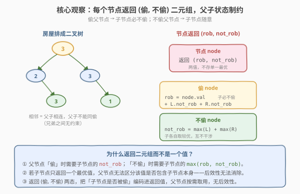
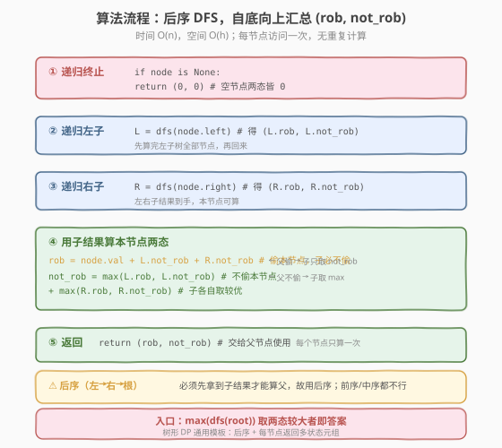

# LeetCode 打家劫舍 III 题解

## 1. 题目概述

- **标题 / 题号**：打家劫舍 III（#337，medium）
- **链接**：https://leetcode.cn/problems/house-robber-iii/
- **难度**：中等
- **标签**：树、深度优先搜索、动态规划、树形 DP

**题意**：小偷又发现了一个新的行窃地点。这个地区的房屋排列类似于一棵**二叉树**，所有房屋通过左右子节点相连。**两个直接相连（父子关系）的房屋在同一晚上被偷会自动报警**。

给定二叉树的根节点 `root`，返回**不触动警报**的情况下，能偷到的最高金额。

二叉树节点定义：

```python
class TreeNode:
    def __init__(self, val=0, left=None, right=None):
        self.val = val
        self.left = left
        self.right = right
```

**示例 1**：

```text
输入：root = [3,2,3,null,3,null,1]
输出：7
解释：偷根节点 3，再偷两个孙节点 3 和 1（与根不相邻），金额 = 3 + 3 + 1 = 7。
```

**示例 2**：

```text
输入：root = [3,4,5,1,3,null,1]
输出：9
解释：偷第 1 层的两个节点 4 和 5（兄弟互不相邻），金额 = 4 + 5 = 9。
     若偷根 3 + 三个叶子 1+3+1 = 8，反不如偷中间层。
```

**约束**：

- 树中节点数在 $[0, 10^4]$ 范围内
- $0 \le \text{Node.val} \le 10^4$

> 💡 这是 [198. 打家劫舍](../0101-0200/198_打家劫舍.md) 的树形变体——房屋从「数组」变成了「二叉树」，约束从「相邻下标」变成了「父子节点」。198 用一维 DP 的「`f(i)=max(f(i-1), f(i-2)+nums[i])`」解决了线性结构；而树形结构**没有线性顺序**，`f(i-1)`/`f(i-2)` 不再适用。突破口是**树形 DP**：后序遍历，每个节点返回「偷 / 不偷」**两个状态**，父节点根据子节点的状态转移。掌握这个「后序 + 多状态返回」模板，就能通杀所有树形 DP 题。

## 2. 解题思路

### 2.1 暴力思路：枚举每个节点偷/不偷

最朴素的 DFS：对每个节点选「偷」或「不偷」，若偷则其子节点不能偷，递归向下。

```text
dfs(node, parent_robbed):
    if node is None: return 0
    # 不偷 node
    best = dfs(node.left, False) + dfs(node.right, False)
    # 偷 node（前提：父节点没偷）
    if not parent_robbed:
        best = max(best,
                   node.val + dfs(node.left, True) + dfs(node.right, True))
    return best
```

时间复杂度 $O(2^n)$（每个节点二选一，$n$ 为节点数），节点数 $10^4$ 时直接超时。

> ⚠️ 暴力法的问题：**重复子问题**。同一个节点在不同上层选择下被反复计算。例如 `dfs(node.left, False)` 会在「父偷」和「父不偷但选择不偷父」两条路径中重复求值。这正是 DP 登场的信号——但树形结构没法像 198 那样用数组下标做记忆化下标，需要换个角度组织状态。

### 2.2 核心观察：每个节点返回 (偷, 不偷) 二元组



**关键定义**：对每个节点 `node`，定义两个值：

- $\text{rob}(node)$ = 在「**偷** `node`」的前提下，以 `node` 为根的子树能偷到的最高金额。
- $\text{not\_rob}(node)$ = 在「**不偷** `node`」的前提下，以 `node` 为根的子树能偷到的最高金额。

**核心思考**——父子状态的制约关系：

- 若**偷** `node`：则 `node` 的左右孩子**必不能偷**，只能取它们的 $\text{not\_rob}$：

$$\text{rob}(node) = \text{node.val} + \text{not\_rob}(node.left) + \text{not\_rob}(node.right)$$

- 若**不偷** `node`：则左右孩子**各自随意**（可偷可不偷），各取较优：

$$\text{not\_rob}(node) = \max\big(\text{rob}(node.left),\ \text{not\_rob}(node.left)\big) + \max\big(\text{rob}(node.right),\ \text{not\_rob}(node.right)\big)$$

最终答案 $= \max\big(\text{rob}(root),\ \text{not\_rob}(root)\big)$。

> 💡 **为什么返回二元组而不是一个值？** 这是本题最关键的洞察。若每个节点只返回「子树最优金额」一个值，父节点无法判断这个最优值是否包含子节点本身——一旦包含，父节点就不能再偷子节点，后效性无法消除。返回 `(rob, not_rob)` 两态，相当于把「子节点是否被偷」的信息**编码进返回值**，父节点按需取用：偷父→取子的 `not_rob`，不偷父→取子的 `max`。状态显式化，后效性消除——这是所有「树形 DP / 选/不选」题的通用手法。

### 2.3 算法流程图



**完整步骤**：

1. **终止**：`node is None` → 返回 `(0, 0)`（空节点两态皆 0）。
2. **递归左子**：`L = dfs(node.left)`，得到 `(L.rob, L.not_rob)`。
3. **递归右子**：`R = dfs(node.right)`，得到 `(R.rob, R.not_rob)`。
4. **算本节点两态**：
   - `rob = node.val + L.not_rob + R.not_rob`
   - `not_rob = max(L.rob, L.not_rob) + max(R.rob, R.not_rob)`
5. **返回** `(rob, not_rob)`。
6. **入口**：`return max(dfs(root))`。

> ⚠️ **必须用后序（左→右→根）**：父节点的两态完全由子节点的两态决定，必须先算完子树再回来算父。前序/中序在访问父节点时还没拿到子结果，无法转移。这与 [124. 二叉树中的最大路径和](../0101-0200/124_二叉树中的最大路径和.md) 的后序汇总同构——树形 DP 的标志就是「自底向上」。

### 2.4 示例演算

以示例 1 `root = [3,2,3,null,3,null,1]` 为例（答案 7：偷根 3 + 左孙叶 3 + 右孙叶 1）：

![示例演算：root=[3,2,3,null,3,null,1]，自底向上算每节点 (rob, not_rob)](../images/robtree_example_walkthrough.svg)

自底向上逐节点计算：

| 节点 | rob 计算 | not_rob 计算 | 结果 (rob, not_rob) |
|------|----------|--------------|---------------------|
| 叶 3（左孙） | $3 + 0 + 0 = 3$ | $0 + 0 = 0$ | **(3, 0)** |
| 叶 1（右孙） | $1 + 0 + 0 = 1$ | $0 + 0 = 0$ | **(1, 0)** |
| 节点 2（左子） | $2 + 0 + 0 = 2$ | $0 + \max(3,0) = 3$ | **(2, 3)** |
| 节点 3（右子） | $3 + 0 + 0 = 3$ | $0 + \max(1,0) = 1$ | **(3, 1)** |
| **根 3** | $3 + 3 + 1 = 7$ | $\max(2,3) + \max(3,1) = 3+3 = 6$ | **(7, 6)** |

答案 $= \max(7, 6) = 7$，对应方案：偷根 3 + 左孙叶 3 + 右孙叶 1 $= 3+3+1=7$。

> 💡 **看根节点的 `rob=7` 怎么来的**：偷根 → 子节点（2、3）都不能偷 → 取它们的 `not_rob`：`node2.not_rob=3`（即偷孙叶 3）、`node3.not_rob=1`（偷孙叶 1）。根与孙叶**不相邻**（中间隔了一层），可以同时偷，于是 $3+3+1=7$。这正是二元组的价值——`not_rob` 把「不偷自己、偷自己子树的最优」这一信息传给了父节点。

## 3. 参考代码

### C++

```cpp
// 打家劫舍III.cpp —— 树形 DP（后序 DFS + 二元组返回）
// 编译: g++ -O2 -std=c++17 打家劫舍III.cpp -o rob3
#include <algorithm>
struct TreeNode {
    int val;
    TreeNode *left, *right;
    TreeNode(int x = 0, TreeNode *l = nullptr, TreeNode *r = nullptr)
        : val(x), left(l), right(r) {}
};

class Solution {
public:
    int rob(TreeNode* root) {
        auto [r, nr] = dfs(root);     // (rob, not_rob)
        return std::max(r, nr);
    }
private:
    // 返回 {rob, not_rob}
    std::pair<int,int> dfs(TreeNode* node) {
        if (!node) return {0, 0};      // 空节点两态皆 0
        auto [lR, lN] = dfs(node->left);   // 左子两态
        auto [rR, rN] = dfs(node->right);  // 右子两态
        int rob     = node->val + lN + rN;               // 偷本节点 → 子必不偷
        int not_rob = std::max(lR, lN) + std::max(rR, rN); // 不偷本节点 → 子各自取较优
        return {rob, not_rob};
    }
};
```

### Python

```python
class Solution:
    def rob(self, root: Optional[TreeNode]) -> int:
        def dfs(node):
            if not node:                       # 空节点两态皆 0
                return (0, 0)
            lR, lN = dfs(node.left)             # 左子 (rob, not_rob)
            rR, rN = dfs(node.right)            # 右子 (rob, not_rob)
            rob = node.val + lN + rN            # 偷本节点 → 子必不偷
            not_rob = max(lR, lN) + max(rR, rN) # 不偷本节点 → 子各自取较优
            return (rob, not_rob)
        return max(dfs(root))
```

> 💡 **两个细节**：① 返回值用 `pair` / `tuple` 而非单一 `int`——这是消除后效性的关键，父节点需要同时知道子节点「偷」和「不偷」两种结果。② 不需要记忆化：后序 DFS 每个节点只访问一次（每个节点的 `(rob, not_rob)` 算完即返回、被父节点消费），天然无重复计算，已是最优。若硬要加 `@cache` 也无妨，但不会更快。

## 4. 复杂度分析

| 维度 | 复杂度 | 说明 |
|------|--------|------|
| **时间** | $O(n)$ | 每个节点访问一次，每次 $O(1)$ 合并子结果；$n$ 为节点数 |
| **空间** | $O(h)$ | 递归栈深度 = 树高 $h$；最坏（链状树）$h=n$ 即 $O(n)$，平衡树 $h=\log n$ |

> ⚠️ 空间复杂度由**递归栈**决定，与节点是否存储额外状态无关——`pair` 返回值在寄存器/栈帧中即用即弃，不随 $n$ 累积。若树退化为链表（每个节点只有右孩子），递归深度达 $n$，空间 $O(n)$；这是树形递归的固有上限，题目 $n \le 10^4$ 时栈深安全。

## 5. 扩展：树形 DP 的通用模板与变体

### 5.1 树形 DP 通用三要素

本题是**树形 DP 的入门模板**，其通用结构为：

1. **后序遍历**：左 → 右 → 根，先算子再算父。
2. **多状态返回**：每个节点返回一个**状态元组**（本题 `(rob, not_rob)`），把「子树在约束下的最优」打包上移。
3. **父节点按需组合**：父节点根据自身选择，从子节点元组中取对应分量做转移。

> 💡 一句话：**线性 DP 用下标 `f(i)` 串联前后；树形 DP 用「后序 + 状态元组」串联父子**。两者本质都是「状态定义 + 转移方程 + 无后效性」，只是数据的拓扑结构从「链」变成了「树」，遍历方式跟着变。

### 5.2 打家劫舍系列横向对比

| 题目 | 结构 | 约束 | 核心做法 | 状态 |
|------|------|------|----------|------|
| [198. 打家劫舍](../0101-0200/198_打家劫舍.md) | 数组 | 相邻下标 | 一维 DP，`f(i)=max(f(i-1), f(i-2)+nums[i])` | `f(i)` 单值 |
| 213. 打家劫舍 II | 环形数组 | 首尾相邻 | 拆环为线，分两段取 max | `f(i)` 单值 |
| **337. 打家劫舍 III** | 二叉树 | 父子相连 | 树形 DP，后序返回 `(rob, not_rob)` | 二元组 |
| 2560. 打家劫舍 IV | 数组 + 数量限制 | 最多偷 k 间 | 二分答案 + 贪心判定 | — |

> 💡 同一个「相邻不能同偷」约束，落在不同数据结构上需要不同的 DP 形态：**线性 → 一维滚动，环形 → 拆环，树形 → 后序多状态**。识别数据结构是选对 DP 形态的第一步。

### 5.3 监控二叉树（968）：树形 DP 三状态

[968. 监控二叉树](https://leetcode.cn/problems/binary-tree-cameras/) 是树形 DP 的进阶——每个节点有**三种状态**（被监控覆盖、装了摄像头、未被覆盖），同样是后序返回三元组、父节点按需转移。把本题的「二元组」升级为「三元组」，就是 968 的解法。掌握了 337 的状态元组思想，968 只需多定义一个状态。

## 6. 面试要点

1. **为什么返回 `(rob, not_rob)` 二元组，而不是直接返回子树最优金额？**

   > 若只返回一个最优值，父节点无法判断该值是否包含了子节点本身。例如子节点返回的最优可能是「偷了自己」，那父节点就不能再偷它；也可能是「没偷自己」，父节点可以偷。一个值无法区分这两种情形，后效性无法消除。返回 `(rob, not_rob)` 把「子节点是否被偷」编码进返回值，父节点按需取用：偷父→取子的 `not_rob`，不偷父→取子的 `max`，状态显式、无后效性。

2. **本题和 198 打家劫舍的联系与区别？**

   > 同一个「相邻不能同偷」约束。198 在**数组**上，有线性顺序，用一维 DP `f(i)=max(f(i-1), f(i-2)+nums[i])`，`f(i)` 依赖前两个下标。337 在**二叉树**上，没有线性顺序，`f(i-1)`/`f(i-2)` 失效，改用后序 DFS 返回二元组。本质都是「选/不选」最优化 DP，区别只在数据结构导致的状态组织方式：线性用下标串联，树形用「后序 + 元组」串联父子。

3. **为什么必须后序遍历？前序不行吗？**

   > 父节点的两态完全由子节点的两态决定：`rob(父)=父.val+not_rob(左)+not_rob(右)`。后序（左→右→根）保证访问父节点时子结果已就绪。前序（根→左→右）先访问父，此时子树还没算，无状态可转移。中序同理也不行。这是树形 DP 的硬性要求——**信息流自底向上**。

4. **需要记忆化（`@cache` / `unordered_map`）吗？会不会超时？**

   > 不需要。后序 DFS 每个节点恰好访问一次（递归返回即被父消费，不会重复进入），时间已是 $O(n)$，记忆化不会变快。198 的暴力会超时是因为同一个 `dfs(i, ...)` 被不同上层路径重复调用；而树的递归结构天然每个节点只走一次，不存在重叠子问题。加 `@cache` 只是多一份内存开销，无收益。

5. **空间复杂度是 $O(n)$ 还是 $O(\log n)$？**

   > 取决于树形。空间由递归栈深度 = 树高 $h$ 决定：平衡树 $h=\log n$，链状退化树 $h=n$。最坏 $O(n)$，平均 $O(\log n)$。返回的 `pair`/`tuple` 在栈帧中即用即弃，不随 $n$ 累积，不计入空间复杂度。面试时回答「$O(h)$，最坏 $O(n)$，平衡时 $O(\log n)$」最严谨。

> 💡 **一句话总结**：337 是树形 DP 的「Hello World」——后序遍历，每个节点返回 `(偷, 不偷)` 二元组，父节点按「偷父取子 `not_rob`、不偷父取子 `max`」转移。掌握这个「后序 + 多状态元组」模板，就能迁移到 968 监控二叉树（三元组）、124 二叉树最大路径和（后序汇总）等所有树形 DP 题。

## 同类练习题

| # | 题目 | 与本题的关联 |
|---|------|-------------|
| 198 | [打家劫舍](https://leetcode.cn/problems/house-robber/)（[题解](../0101-0200/198_打家劫舍.md)） | 一维 DP 原型题，理解「选/不选」最优化转移后再来看树形变体 |
| 213 | [打家劫舍 II](https://leetcode.cn/problems/house-robber-ii/) | 环形结构，「拆环为线」技巧，对比不同数据结构上的 DP 形态 |
| 968 | [监控二叉树](https://leetcode.cn/problems/binary-tree-cameras/) | 树形 DP 进阶，状态从二元组升级为三元组（覆盖/装摄像头/未覆盖） |
| 124 | [二叉树中的最大路径和](https://leetcode.cn/problems/binary-tree-maximum-path-sum/)（[题解](../0101-0200/124_二叉树中的最大路径和.md)） | 同构的后序汇总思想，自底向上算「向下贡献」并更新全局答案 |
| 543 | [二叉树的直径](https://leetcode.cn/problems/diameter-of-binary-tree/) | 后序 DFS + 全局更新，树形递归汇总的入门练习 |
