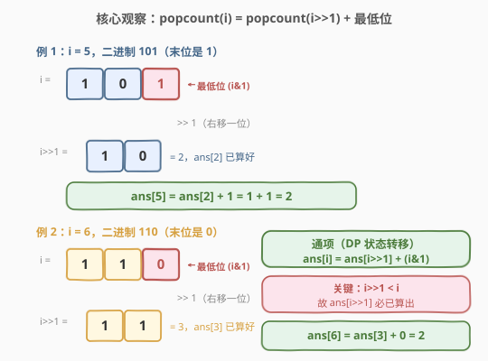
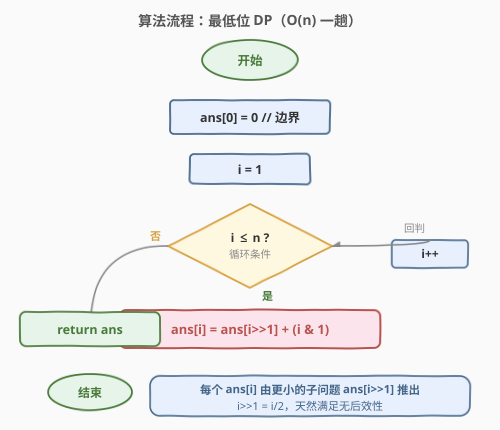
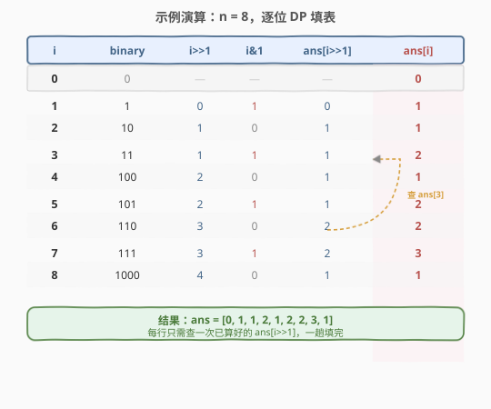
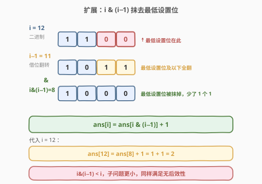

# 比特位计数

- **题目名称**：比特位计数
- **链接**：[338. 比特位计数](https://leetcode.cn/problems/counting-bits/)
- **难度**：简单
- **标签**：位运算、动态规划

## 1. 题目概述

给定一个非负整数 `n`，返回一个长度为 `n + 1` 的数组 `ans`，其中 `ans[i]` 表示 `i` 的二进制表示中 **`1` 的个数**（即「汉明重量 / popcount」）。

**示例 1**：

```text
输入：n = 2
输出：[0,1,1]
解释：0 --> 0(0 个 1)，1 --> 1(1 个 1)，2 --> 10(1 个 1)
```

**示例 2**：

```text
输入：n = 5
输出：[0,1,1,2,1,2]
解释：0→0, 1→1, 2→10, 3→11, 4→100, 5→101
```

**约束条件**：

- `0 <= n <= 10^5`
- **进阶要求**：$O(n)$ 时间、$O(1)$ 额外空间（不计输出数组），且**不使用**语言内置的 `popcount` / `__builtin_popcount` 等函数。

> ⚠️ 暴力对每个数调 `popcount` 虽然能 AC，但面试官一定会追问「能否 $O(n)$ 一趟、不用内置函数」。本题的考点正是**用 DP 复用已算好的子问题**。

---

## 2. 解题思路

### 2.1 暴力思路

对每个 `i ∈ [0, n]`，逐位统计 `1` 的个数。一个数的二进制位数约 $\log_2 n$，故总时间 $O(n \log n)$，空间 $O(1)$（不计输出）。能过但**没有复用任何中间结果**，且依赖逐位移位，不符合进阶的 $O(n)$ 要求。

> 💡 转机在于：`i` 的 `1` 的个数与**更小的数**的 `1` 的个数之间存在递推关系——这正是 DP 的入口。

### 2.2 核心观察：最低位 DP —— `ans[i] = ans[i >> 1] + (i & 1)`



关键直觉是**右移一位**（`i >> 1`，即 `i / 2`）会丢弃最低位，其余各位完全保留：

- `i` 的二进制 = `[高位 ... b1] [b0]`，其中 `b0` 是最低位；
- `i >> 1` 的二进制 = `[高位 ... b1]`，恰好是 `i` 去掉 `b0` 后的部分；
- 所以 `popcount(i) = popcount(i >> 1) + b0 = popcount(i >> 1) + (i & 1)`。

> 💡 **为什么能 DP？** 因为 `i >> 1 = i / 2 < i`（对 `i ≥ 1` 恒成立），处理 `i` 时 `ans[i >> 1]` **必然已经算好**。这正是「无后效性」的体现——当前状态只依赖更小的子问题。

### 2.3 算法流程图



一趟循环 `i = 1 → n`，每个 `ans[i]` 由 `ans[i >> 1]` 加上最低位即可。边界 `ans[0] = 0`（`0` 的二进制没有 `1`）。

### 2.4 示例演算

以 `n = 8` 为例，逐位填表：



| i | binary | i >> 1 | i & 1 | ans[i>>1] | ans[i] |
|---|--------|--------|-------|-----------|--------|
| 0 | 0 | — | — | — | **0** |
| 1 | 1 | 0 | 1 | 0 | **1** |
| 2 | 10 | 1 | 0 | 1 | **1** |
| 3 | 11 | 1 | 1 | 1 | **2** |
| 4 | 100 | 2 | 0 | 1 | **1** |
| 5 | 101 | 2 | 1 | 1 | **2** |
| 6 | 110 | 3 | 0 | 2 | **2** |
| 7 | 111 | 3 | 1 | 2 | **3** |
| 8 | 1000 | 4 | 0 | 1 | **1** |

填完后 `ans = [0,1,1,2,1,2,2,3,1]`。注意 `i=6` 时查 `ans[3]=2`，而 `ans[3]` 在 `i=3` 那一步早已算好——DP 的复用就在此处。

---

## 3. 参考代码

### C++

```cpp
class Solution {
  public:
    vector<int> countBits(int n) {
        vector<int> ans(n + 1, 0);
        for (int i = 1; i <= n; ++i) {
            ans[i] = ans[i >> 1] + (i & 1);
        }
        return ans;
    }
};
```

### Python

```python
class Solution:
    def countBits(self, n: int) -> List[int]:
        ans = [0] * (n + 1)
        for i in range(1, n + 1):
            ans[i] = ans[i >> 1] + (i & 1)
        return ans
```

> ⚠️ 边界 `ans[0] = 0` 由初始化给出，循环从 `i = 1` 开始，避免 `i = 0` 时 `i >> 1 = 0` 产生无意义的自引用。

---

## 4. 复杂度分析

| 维度 | 复杂度 | 说明 |
|------|--------|------|
| 时间复杂度 | $O(n)$ | 一趟循环 `1 → n`，每次 $O(1)$ 的移位 + 按位与 + 加法 |
| 空间复杂度 | $O(1)$ | 仅用常数额外变量；输出数组 `ans` 不计入空间复杂度（题目要求返回它） |

> 💡 与暴力的 $O(n \log n)$ 相比，DP 把「每个数独立统计」变成「每个数 O(1) 续接子问题」，这就是 $O(n)$ 的来源。

---

## 5. 扩展：抹最低设置位 DP —— `ans[i] = ans[i & (i-1)] + 1`

另一种同样优美的 DP 用到 **Brian Kernighan 技巧**：`i & (i - 1)` 会把 `i` 的**最低设置位**（最右边的 `1`）抹成 `0`，其余位不变。



由于抹掉一个 `1`，`i & (i - 1)` 的 `1` 的个数恰比 `i` 少 `1`，故：

$$\text{ans}[i] = \text{ans}[i\ \&\ (i-1)] + 1$$

且 `i & (i - 1) < i`，子问题更小，同样满足无后效性。

```cpp
class Solution {
  public:
    vector<int> countBits(int n) {
        vector<int> ans(n + 1, 0);
        for (int i = 1; i <= n; ++i) {
            ans[i] = ans[i & (i - 1)] + 1;
        }
        return ans;
    }
};
```

| 解法 | 状态转移 | 直觉 | 通用性 |
|------|----------|------|--------|
| 最低位 DP | `ans[i] = ans[i>>1] + (i&1)` | 右移丢最低位 | 直觉最自然，迁移性强 |
| 抹最低设置位 DP | `ans[i] = ans[i&(i-1)] + 1` | 抹掉一个 `1` | `i&(i-1)` 技巧本身可单独用于「统计某数 1 的个数」($O(\text{popcount})$) |

> 💡 `i & (i - 1)` 是位运算题的**万能工具**：单独用它能在 $O(\text{popcount})$ 时间内数清一个数的 `1` 的个数（每次抹掉一个 `1`，计数 +1，直到变为 `0`），比逐位移位的 $O(\log n)$ 更快。

---

## 6. 面试要点

1. **为什么 `ans[i >> 1]` 一定已经算好？**

   - `i >> 1 = i / 2`，对 `i ≥ 1` 严格小于 `i`。循环按 `i` 递增推进，处理 `i` 时所有 `< i` 的下标都已填好，故 `ans[i >> 1]` 必然就绪。这就是 DP 的无后效性。

2. **两种 DP 转移哪个更好？**

   - 复杂度完全相同（$O(n)$ 时间、$O(1)$ 额外空间）。最低位 DP（`i>>1`）直觉最自然，适合首先给出；抹最低设置位 DP（`i&(i-1)`）展示了 Brian Kernighan 技巧，适合作为「更优/更巧妙」的补充，体现位运算功底。

3. **为什么说空间是 $O(1)$ 而不是 $O(n)$？**

   - 输出数组 `ans` 是题目**要求返回**的结果，按惯例不计入空间复杂度。除它之外只用了循环变量 `i`，是常数额外空间。

4. **不限制 $O(n)$ 时，逐位统计为什么是 $O(n \log n)$？**

   - 对每个 `i`，其二进制位数为 $\lfloor \log_2 i \rfloor + 1$。逐位检查需 $O(\log i)$，求和 $\sum_{i=1}^{n} O(\log i) = O(n \log n)$。DP 通过复用把每步降到 $O(1)$，总开销降到 $O(n)$。

5. **Brian Kernighan 技巧还能用在哪？**

   - 单独用于「判断 `i` 是否为 2 的幂」：`i > 0 && (i & (i - 1)) == 0`（2 的幂只有一个 `1`，抹掉后为 `0`）；用于 $O(\text{popcount})$ 统计 `1` 的个数；也是 [191. 位 1 的个数](https://leetcode.cn/problems/number-of-1-bits/) 的最优解法。

---

## 7. 同类练习题

- [136. 只出现一次的数字](https://leetcode.cn/problems/single-number/)：异或（XOR）消除成对元素，位运算入门题，与本题主打同一「位运算」标签
- [191. 位 1 的个数](https://leetcode.cn/problems/number-of-1-bits/)：单数 popcount，直接用 `i & (i - 1)` 抹最低设置位技巧，是本文扩展的「单点版」
- [461. 汉明距离](https://leetcode.cn/problems/hamming-distance/)：两数异或后数 `1`，popcount 的直接应用
- [1356. 根据数字二进制下 1 的数目排序](https://leetcode.cn/problems/sort-integers-by-the-number-of-1-bits/)：先算每个数的 popcount 再排序，可用本题的 DP 预处理
- [89. 格雷编码](https://leetcode.cn/problems/gray-code/)：`G(i) = i ^ (i >> 1)`，同样是「`i` 与 `i>>1`」的位运算关系，思路可对照
