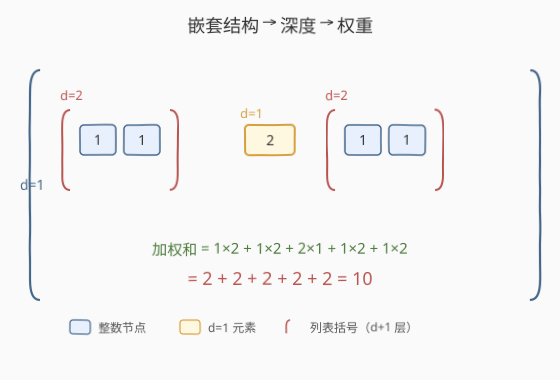
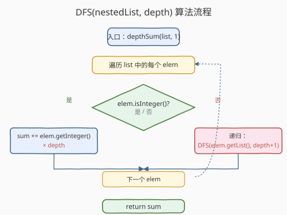

# LeetCode 嵌套列表加权和 题解

## 1. 题目概述

- **标题 / 题号**：嵌套列表加权和（#339，medium）
- **链接**：https://leetcode.cn/problems/nested-list-weight-sum/
- **难度**：中等
- **标签**：深度优先搜索、递归、树

**题意**：给定一个**嵌套列表**，其中每个元素要么是一个**整数**，要么是**另一个嵌套列表**（列表的元素同样可以是整数或列表，可任意嵌套）。整数的「**深度**」定义为其所在列表的层数——**最外层列表深度为 1**，往内每多一层加 1。

要求返回所有整数的**加权和**：每个整数乘以其深度后求和。

`NestedInteger` 接口定义如下：

```python
class NestedInteger:
    def isInteger(self) -> bool: ...
    def getInteger(self) -> int: ...       # 仅当 isInteger() 为 True 时有效
    def getList(self) -> List[NestedInteger]: ...  # 仅当 isInteger() 为 False 时有效
```

**示例 1**：

```text
输入：nestedList = [[1,1],2,[1,1]]
输出：10
解释：四个 1 各在深度 2，贡献 1×2×4 = 8；一个 2 在深度 1，贡献 2×1 = 2；合计 10。
```

**示例 2**：

```text
输入：nestedList = [1,[4,[6]]]
输出：27
解释：1 在深度 1 → 1×1 = 1；4 在深度 2 → 4×2 = 8；6 在深度 3 → 6×3 = 18；合计 27。
```

**示例 3**：

```text
输入：nestedList = [0]
输出：0
```

**约束**：

- $1 \le \text{nestedList.length} \le 50$
- 嵌套列表中整数取值范围 $[-100, 100]$
- 最大深度不超过 $200$

> 💡 本题是「**嵌套结构 + 深度递归**」的入门模板。数据结构本质是一棵**不规则的多叉树**：每个 `NestedInteger` 要么是叶节点（整数），要么是内部节点（列表，孩子即其元素）。深度 = 该节点到根的层数。把它当成树来 DFS，深度作为参数随递归下传即可。掌握这个「**带深度参数的递归 DFS**」模板，就能通吃所有嵌套结构题——如反向加权变体 [364](https://leetcode.cn/problems/nested-list-weight-sum-ii/)、扁平化 [341](https://leetcode.cn/problems/flatten-nested-list-iterator/)、反向解析 [385](https://leetcode.cn/problems/mini-parser/)。

## 2. 解题思路

### 2.1 暴力思路：遍历找整数再算深度？

最直观但低效的想法：先扁平化整个嵌套结构，记录每个整数及其深度，再求加权和。这需要额外的遍历轮次和存储。其实**没必要分两步**——深度信息只在递归下降时才准确，等扁平化完再回头找深度反而麻烦。

> ⚠️ 更糟的是，若每个整数单独再向上回溯数层数来求深度，时间复杂度会退化到 $O(n \cdot d)$（$n$ 为整数个数，$d$ 为最大深度）。正确做法是**让深度随递归下传**，每个节点在访问瞬间就知道自己的深度，一次 DFS 搞定。

### 2.2 核心观察：深度参数随递归下传，自顶向下累加



**关键洞察**：把 `nestedList` 看作一棵**多叉树**——

- **根**是虚拟的「最外层列表」，深度记作 1。
- **叶节点** = 整数，贡献 `val × depth`。
- **内部节点** = 列表，本身不贡献，但对它的每个孩子调用 `dfs(child, depth+1)`。

定义递归函数：

$$\text{dfs}(\text{list},\ \text{depth}) = \sum_{\text{elem} \in \text{list}} \begin{cases} \text{elem.getInteger()} \times \text{depth}, & \text{elem 是整数} \\ \text{dfs}(\text{elem.getList()},\ \text{depth}+1), & \text{elem 是列表} \end{cases}$$

入口调用 $\text{dfs}(\text{nestedList},\ 1)$ 即得答案。

> 💡 **为什么深度要作为参数下传，而不是全局变量？** 深度是「**路径属性**」——同一个整数在不同调用路径上深度不同（理论上同一棵树里路径唯一，但写成参数更显式、更易扩展）。参数下传让递归**无状态、可重入**：每层调用自带自己的深度，互不干扰。这正是 [104. 二叉树的最大深度](../0101-0200/104_二叉树的最大深度.md)「DFS 带 depth 参数」与「全局 maxDepth」两种写法的差别——本题必须带参数，因为深度直接参与权重计算。

### 2.3 算法流程图



**完整步骤**：

1. **入口**：调用 `dfs(nestedList, 1)`。
2. **初始化** `sum = 0`。
3. **遍历** `nestedList` 中每个 `elem`：
   - 若 `elem.isInteger()` 为真：`sum += elem.getInteger() * depth`。
   - 否则：`sum += dfs(elem.getList(), depth + 1)`（递归深入一层）。
4. **返回** `sum`。

> ⚠️ **不要混淆 `getList()` 与列表本身**：`NestedInteger` 对象要么是整数要么是列表，调用 `getList()` 返回的是它**内部那个 `List[NestedInteger]`**。递归时传给下层的是 `elem.getList()`，不是 `elem` 本身——传错了会无限递归。

### 2.4 示例演算

以示例 2 `nestedList = [1,[4,[6]]]` 为例（答案 27）：

![示例演算：[1,[4,[6]]] 逐层递归下降，整数乘以各自深度](../images/nestedlist_weight_walkthrough.svg)

调用栈展开如下：

| 调用 | depth | 遍历到的元素 | 贡献 | 累计 sum |
|------|-------|--------------|------|----------|
| `dfs([1,[4,[6]]], 1)` | 1 | 整数 `1` | $1 \times 1 = 1$ | 1 |
| ↑ 同层继续 | 1 | 列表 `[4,[6]]` → 递归 | 见下 | 1 + ? |
| `dfs([4,[6]], 2)` | 2 | 整数 `4` | $4 \times 2 = 8$ | 1 + 8 = 9 |
| ↑ 同层继续 | 2 | 列表 `[6]` → 递归 | 见下 | 9 + ? |
| `dfs([6], 3)` | 3 | 整数 `6` | $6 \times 3 = 18$ | 9 + 18 = **27** |

答案 $= 1 + 8 + 18 = 27$。

> 💡 **看递归如何「自顶向下」累积深度**：每进入一层 `getList()`，`depth` 加 1；整数节点的贡献在「**到达它的那一刻**」就算定，不再回头。整个过程是一次**先序遍历**——访问到叶节点立即结算，访问到内部节点则下钻。这与 [129. 求根节点到叶节点数字之和](../0101-0200/129_求根节点到叶节点数字之和.md) 的「前缀累积下传」是同一套范式，只不过这里累积的是「深度」而非「路径数字」。

## 3. 参考代码

### C++

```cpp
// 嵌套列表加权和.cpp —— DFS 带深度参数下传
// 编译: g++ -O2 -std=c++17 嵌套列表加权和.cpp -o nested_weight
#include <vector>

class NestedInteger {
public:
    bool isInteger() const;
    int getInteger() const;
    const std::vector<NestedInteger>& getList() const;
};

class Solution {
public:
    int depthSum(std::vector<NestedInteger>& nestedList) {
        return dfs(nestedList, 1);
    }
private:
    int dfs(const std::vector<NestedInteger>& list, int depth) {
        int sum = 0;
        for (const auto& elem : list) {
            if (elem.isInteger()) {
                sum += elem.getInteger() * depth;      // 叶节点：val × depth
            } else {
                sum += dfs(elem.getList(), depth + 1); // 内部节点：下钻一层
            }
        }
        return sum;
    }
};
```

### Python

```python
class Solution:
    def depthSum(self, nestedList: List[NestedInteger]) -> int:
        def dfs(nested, depth):
            total = 0
            for elem in nested:
                if elem.isInteger():
                    total += elem.getInteger() * depth   # 叶节点：val × depth
                else:
                    total += dfs(elem.getList(), depth + 1)  # 内部节点：下钻一层
            return total
        return dfs(nestedList, 1)
```

> 💡 **两个细节**：① `dfs` 的 `depth` 起始为 **1**（最外层列表深度 1），不是 0——这是题目定义，别从 0 开始。② 不需要记忆化：嵌套结构是一棵**树**而非 DAG，每条路径唯一，不存在重复子问题；后序返回值在调用栈中即用即弃，已是最优 $O(n)$。

## 4. 复杂度分析

| 维度 | 复杂度 | 说明 |
|------|--------|------|
| **时间** | $O(n)$ | 每个 `NestedInteger` 节点访问一次，整数节点 $O(1)$ 结算，列表节点 $O(1)$ 转移；$n$ 为节点总数（含列表节点） |
| **空间** | $O(d)$ | 递归栈深度 = 最大嵌套深度 $d$；题目保证 $d \le 200$，远小于栈上限 |

> ⚠️ 时间复杂度里的 $n$ 是**节点总数**而非整数个数——列表节点本身虽不贡献权重，但遍历时也要访问一次。若只数整数 $m$ 个、列表 $k$ 个，则 $n = m + k$。由于每个整数必有一个父列表（最外层也算），$k \le m$，故 $n = O(m)$，渐近意义上二者等价。空间 $O(d)$ 由递归栈决定，与节点总数无关——即便有 1000 个整数，若都平铺在最外层，栈深仍为 1。

## 5. 扩展：BFS 层序遍历与反向加权变体

### 5.1 BFS 层序写法

除 DFS 外，本题也可用**层序遍历（BFS）**：把最外层列表的所有元素入队，每「展开一层」`depth` 加 1，整数即时累加。代码如下：

```python
from collections import deque

class Solution:
    def depthSum(self, nestedList: List[NestedInteger]) -> int:
        queue = deque(nestedList)
        depth, total = 1, 0
        while queue:
            level_size = len(queue)
            for _ in range(level_size):
                elem = queue.popleft()
                if elem.isInteger():
                    total += elem.getInteger() * depth
                else:
                    queue.extend(elem.getList())   # 列表元素入队，下一层处理
            depth += 1
        return total
```

> 💡 **DFS vs BFS**：两者复杂度相同，区别只在**遍历顺序**。DFS 沿一条路径钻到底再回溯，栈深 = 最大深度；BFS 逐层展开，队列宽度 = 当层节点数。本题深度 $\le 200$ 而节点数可能上千，DFS 的栈更省内存；但在**反向加权变体**（下方 5.2）里，BFS 的「逐层 `depth++`」反而更自然，是 364 题的优选写法。

### 5.2 反向加权变体：364. 嵌套列表加权和 II

[364. 嵌套列表加权和 II](https://leetcode.cn/problems/nested-list-weight-sum-ii/) 是本题的镜像——**越深的整数权重越小**，叶节点权重为 1，根列表权重为最大深度。两种解法：

1. **两遍 DFS**：先 DFS 求最大深度 $D$，再 DFS 按 $(D - \text{depth} + 1)$ 加权。
2. **一遍 BFS**：从外向内逐层累加，每进入新层把**之前所有累积值再翻一次**——巧妙实现「深度越大、被翻倍次数越少」。

```python
class Solution:
    def depthSumInverse(self, nestedList: List[NestedInteger]) -> int:
        from collections import deque
        queue = deque(nestedList)
        total, level_sum = 0, 0
        while queue:
            level_size = len(queue)
            for _ in range(level_size):
                elem = queue.popleft()
                if elem.isInteger():
                    level_sum += elem.getInteger()
                else:
                    queue.extend(elem.getList())
            total += level_sum   # 关键：每层都把之前累积值再翻一次
        return total
```

> 💡 **为什么 `total += level_sum` 每层都加能实现反向加权？** 设整数 $v$ 在深度 $d$（从 1 开始），它会在第 $d$ 层首次进入 `level_sum`，并在剩余 $D - d + 1$ 层里每次都被 `total += level_sum` 累加一次。最终 $v$ 被加了 $D - d + 1$ 次——恰好就是「越浅权重越大」的反向权重。一次遍历搞定，无需预求 $D$，是本题最优解。

### 5.3 嵌套结构题家族横向对比

| 题号 | 题目 | 方向 | 核心做法 |
|------|------|------|----------|
| **339** | 嵌套列表加权和 | 正向（深=大权重） | DFS 带 depth 参数下传 |
| 364 | 嵌套列表加权和 II | 反向（深=小权重） | 两遍 DFS 或一遍 BFS 累加翻倍 |
| 341 | 扁平化嵌套列表迭代器 | 遍历输出 | 栈 / 递归生成器 |
| 385 | 迷你解析器 | 字符串 → 嵌套结构 | 栈模拟解析 `[` / `]` / 数字 |

> 💡 四题共享同一个 `NestedInteger` 接口，理解了「嵌套结构 = 多叉树」这一抽象，就能在 DFS / BFS / 栈三种遍历工具间灵活切换。

## 6. 面试要点

1. **为什么深度要作为参数下传，而不是用全局变量？**

   > 深度是**路径属性**，不同调用路径上同一整数（理论上树中路径唯一，但写法上）深度不同。参数下传让递归**无状态、可重入**，每层自带深度，互不干扰；全局变量则需在进入/退出时手动加减，易出错且不可重入。带参数的写法也更能体现「深度是自顶向下累积的」这一语义，与 [104. 二叉树的最大深度](../0101-0200/104_二叉树的最大深度.md) 的 `dfs(node, depth)` 范式一致。

2. **嵌套结构为什么可以看成多叉树？DFS 的终止条件是什么？**

   > 每个 `NestedInteger` 要么是叶节点（整数，无孩子），要么是内部节点（列表，孩子即其元素）——这正是一棵多叉树的定义。DFS 没有显式的「空节点」终止，而是靠 `for elem in list` 循环自然收敛：列表为空时循环体不执行，返回 0。等价于二叉树 DFS 中 `if not node: return 0` 的隐式版本。

3. **DFS 和 BFS 两种写法的取舍？**

   > 时间复杂度都是 $O(n)$。DFS 空间 $O(d)$（递归栈深 = 最大深度），BFS 空间 $O(w)$（队列宽 = 最大层节点数）。本题深度 $\le 200$ 而节点数可能上千，DFS 更省内存，且代码更简洁；但在反向加权变体 364 中，BFS 的「逐层累加翻倍」能一遍搞定，反而优于 DFS 的两遍写法。**按问题需要选工具**，而非按个人喜好。

4. **`getList()` 返回什么？为什么递归传 `elem.getList()` 而非 `elem`？**

   > `getList()` 返回该 `NestedInteger` **内部存储的 `List[NestedInteger]`**（当且仅当 `isInteger()` 为 False 时有效）。递归下钻时必须传 `elem.getList()`——传 `elem` 会导致下次循环仍遍历同一个外层对象，要么类型不匹配要么无限递归。这是 `NestedInteger` 接口最容易踩的坑。

5. **最大深度 $d=200$ 时递归会栈溢出吗？**

   > 不会。Python 默认递归上限 1000，C++ 栈空间通常足够深至数千层。题目保证 $d \le 200$，远在安全范围内。若题目改为 $d \le 10^5$（如某些极端嵌套），则需改写为显式栈的迭代 DFS 或 BFS，避免递归栈溢出。本题无需担心。

> 💡 **一句话总结**：339 是「**嵌套结构 + 深度递归**」的入门模板——把 `NestedInteger` 看成多叉树节点，深度作为参数随 DFS 下传，叶节点贡献 `val × depth`，内部节点递归 `depth+1`。一次先序遍历 $O(n)$ 搞定，是 364 / 341 / 385 嵌套家族的共同基础。

## 同类练习题

| # | 题目 | 与本题的关联 |
|---|------|-------------|
| 364 | [嵌套列表加权和 II](https://leetcode.cn/problems/nested-list-weight-sum-ii/) | 本题的反向加权变体，深=小权重；练习 BFS 逐层累加翻倍的一遍写法 |
| 341 | [扁平化嵌套列表迭代器](https://leetcode.cn/problems/flatten-nested-list-iterator/) | 同一 `NestedInteger` 接口的遍历变体，要求实现 `next()` / `hasNext()`，练习用栈模拟递归 |
| 385 | [迷你语法分析器](https://leetcode.cn/problems/mini-parser/) | 从字符串 `[1,[4,[6]]]` 构造 `NestedInteger`，练习栈解析 `[` / `]` / 数字 |
| 104 | [二叉树的最大深度](../0101-0200/104_二叉树的最大深度.md)（[题解](../0101-0200/104_二叉树的最大深度.md)） | DFS 带 depth 参数的入门题，理解深度下传范式 |
| 129 | [求根节点到叶节点数字之和](../0101-0200/129_求根节点到叶节点数字之和.md)（[题解](../0101-0200/129_求根节点到叶节点数字之和.md)） | 前缀累积下传的同构思想，把「路径数字」换成「深度」就是本题 |
