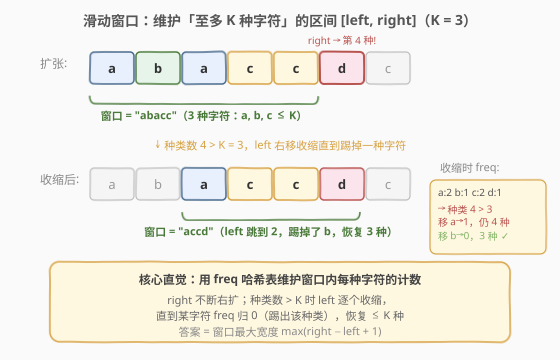
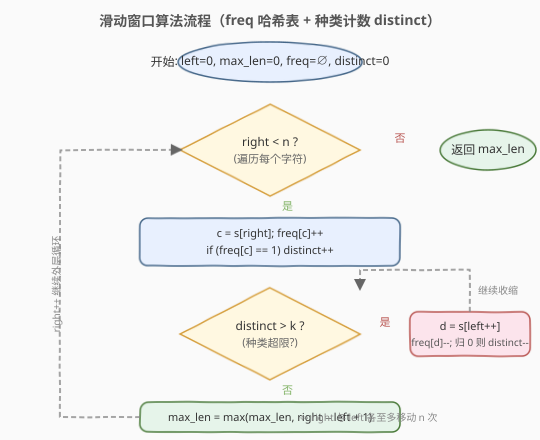
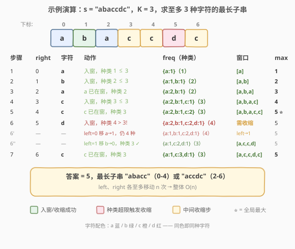

# 至多包含 K 个不同字符的最长子串

- **题目名称**：至多包含 K 个不同字符的最长子串
- **链接**：[340. 至多包含 K 个不同字符的最长子串](https://leetcode.cn/problems/longest-substring-with-at-most-k-distinct-characters/)
- **难度**：中等
- **标签**：哈希表、字符串、滑动窗口

## 1. 题目概述

给定一个字符串 `s` 和一个整数 `k`，找出其中**至多包含 `k` 个不同字符**的最长子串的长度，并返回该长度。

**示例 1**：

```text
输入：s = "eceba", k = 2
输出：3
解释：子串 "ece" 包含 2 种字符（e、c），长度为 3，是满足条件的最长子串。
```

**示例 2**：

```text
输入：s = "aa", k = 1
输出：2
解释：子串 "aa" 包含 1 种字符（a），长度为 2，是满足条件的最长子串。
```

**约束条件**：

- `1 <= s.length <= 5 * 10^4`
- `0 <= k <= 50`
- `s` 由英文字母、数字、符号和空格组成

> 💡 本题是 [159. 至多包含两个不同字符的最长子串](../0101-0200/159_至多包含两个不同字符的最长子串.md) 的泛化版：把阈值 `2` 换成参数 `k` 即是本题。当 `k = 2` 时退化为第 159 题，当 `k = 1` 时退化为「最长同字符子串」（同字符连续段）。

---

## 2. 解题思路

### 2.1 暴力思路

枚举所有子串 `[i, j]`，用集合统计其中不同字符的种类数，若 `≤ k` 则更新答案。时间复杂度 $O(n^2)$（枚举 $O(n^2)$ × 集合判定 $O(1)$ 均摊），对于 $n = 5 \times 10^4$ 会达到 $2.5 \times 10^9$ 量级，必然超时。

### 2.2 核心观察：滑动窗口 + 频率哈希表



关键直觉是维护一个**至多含 `k` 种字符的窗口** `[left, right]`：

- `right` 指针不断右移，把新字符纳入窗口（`freq[c]++`）。
- 一旦窗口内**不同字符种类数 > `k`**，就从 `left` 端逐个收缩（`freq[s[left]]--`，归 0 则该种类被踢出），直到种类数恢复 `≤ k`。
- 窗口在每次收缩后都满足条件，答案就是窗口宽度的最大值 `max(right - left + 1)`。

> **为什么用频率表而不是像第 3 题那样记录「最新下标」直接跳？** 第 3 题的约束是「无重复字符」——窗口内每种字符最多出现 1 次，因此遇到重复时可以精准定位旧位置并跳跃。而本题允许同种字符出现多次，仅靠「最新下标」无法判断「踢掉一个字符后种类数是否降到了 `k`」——必须用频率表计数，直到某字符 `freq` 归 0 才确认该种类被彻底移出窗口。

### 2.3 算法流程图



整体只有一重 `right` 循环，内层 `while` 收缩 `left`。由于 `left`、`right` 都只增不减，二者各自至多移动 `n` 次，总移动次数不超过 `2n`，因此时间复杂度为 $O(n)$。

### 2.4 示例演算



上表逐步展示了 `s = "abaccdc"`、`k = 3` 的完整执行过程：

- 前 5 步窗口不断扩张，`max` 达到 `5`（子串 `"abacc"`，3 种字符 a、b、c）。
- 第 6 步 `right=5` 遇到 `'d'`，种类数升到 4，触发收缩：先移走 `left=0` 的 `'a'`（`a` 频率 2→1，仍 4 种），再移走 `left=1` 的 `'b'`（`b` 归 0，种类降回 3），窗口变为 `"accd"`。
- 第 7 步 `right=6` 遇到 `'c'`，`c` 已在窗内，种类仍 3，窗口变为 `"accdc"`，长度 5 不超过已记录的最大值。
- 最终答案为 `5`（`"abacc"` 或 `"accdc"` 均为合法最长子串）。

---

## 3. 参考代码

### C++（频率哈希表 + 种类计数）

```cpp
class Solution {
  public:
    int lengthOfLongestSubstringKDistinct(string s, int k) {
        unordered_map<char, int> freq; // 字符 -> 窗口内出现次数
        int left = 0, max_len = 0, distinct = 0;

        for (int right = 0; right < s.size(); right++) {
            char c = s[right];
            if (freq[c]++ == 0) {   // 新种类入窗
                distinct++;
            }

            while (distinct > k) {  // 种类超限，收缩 left
                char d = s[left++];
                if (--freq[d] == 0) { // 该种类频率归 0
                    distinct--;
                }
            }

            max_len = max(max_len, right - left + 1);
        }

        return max_len;
    }
};
```

### Python

```python
class Solution:
    def lengthOfLongestSubstringKDistinct(self, s: str, k: int) -> int:
        freq = {}            # 字符 -> 窗口内出现次数
        left = 0
        max_len = 0
        distinct = 0

        for right, c in enumerate(s):
            freq[c] = freq.get(c, 0) + 1
            if freq[c] == 1:         # 新种类入窗
                distinct += 1

            while distinct > k:      # 种类超限，收缩 left
                d = s[left]
                freq[d] -= 1
                if freq[d] == 0:    # 该种类频率归 0
                    distinct -= 1
                left += 1

            max_len = max(max_len, right - left + 1)

        return max_len
```

> ⚠️ **易错点**：`distinct` 的增减必须与 `freq` 归 0 严格绑定——`freq[c]` 从 0→1 时 `distinct++`，从 1→0 时 `distinct--`。若忘记维护 `distinct` 而每次都去数哈希表的大小，单次判定会退化到 $O(|\Sigma|)$，虽然不影响整体复杂度但常数更大。
>
> ⚠️ **边界 `k = 0`**：此时任何字符入窗都会使 `distinct = 1 > 0`，立即触发收缩把该字符踢出，窗口始终为空，`max_len` 保持 `0`。代码无需特判即可正确返回 `0`。

---

## 4. 复杂度分析

| 维度 | 复杂度 | 说明 |
|------|--------|------|
| 时间复杂度 | $O(n)$ | `left`、`right` 各至多遍历一次，哈希表操作 $O(1)$ |
| 空间复杂度 | $O(\min(k, |\Sigma|, n))$ | 哈希表最多存 `k+1` 种字符（刚超限瞬间）；整体受字符集大小与串长双重约束 |

---

## 5. 扩展：收缩加速与「最新下标」跳跃优化

### 5.1 「最新下标」跳跃优化（小 k 场景）

频率表方案在收缩时需要**逐个移动 `left`**，虽然是均摊 $O(n)$ 但单步可能移动多次。另一种思路是用哈希表记录每种字符的**最新下标** `lastPos`，当种类数超限时，找到「最新下标最小的那个字符」直接把 `left` 跳到它之后——一步完成收缩：

```cpp
int lengthOfLongestSubstringKDistinct(string s, int k) {
    unordered_map<char, int> lastPos; // 字符 -> 最新下标
    int left = 0, max_len = 0;
    for (int right = 0; right < s.size(); right++) {
        lastPos[s[right]] = right;
        if ((int)lastPos.size() > k) {
            // 找最新下标最小的字符，踢掉它
            char toRemove;
            int minPos = INT_MAX;
            for (auto& [ch, pos] : lastPos) {
                if (pos < minPos) { minPos = pos; toRemove = ch; }
            }
            lastPos.erase(toRemove);
            left = minPos + 1;
        }
        max_len = max(max_len, right - left + 1);
    }
    return max_len;
}
```

这个版本 `left` 直接跳跃、无需内层 `while`，但每次超限需 $O(k)$ 扫描哈希表找最小值。当 $k$ 很小时（如 $k = 2$）常数极低；当 $k$ 很大时频率表方案更优。两种方案整体都是 $O(n)$。

### 5.2 有序字典 / LRU 式优化（大 k 或流式数据）

当 $k$ 较大且要求每次超限 $O(1)$ 完成踢出时，可把 `lastPos` 升级为**按访问顺序排列的有序字典**（Java 的 `LinkedHashMap` 带 `accessOrder=true`，C++ 可用 `list + unordered_map` 自实现，Python 的 `OrderedDict` 配合 `move_to_end`）：

- 每次访问某字符时把它移到链表尾端（标记为「最近访问」）。
- 超限时，链表**头端**就是「最久未访问」的字符，直接踢出并把 `left` 跳到它的下标之后，$O(1)$ 完成。

这是第 146 题 [LRU 缓存](../0001-0100/146_LRU缓存.md) 的同款结构，也是本题在面试中常见的「follow-up：如果 `s` 是数据流怎么办」的标准答案——流式场景下无法回头读 `s[left]`，必须靠 `lastPos` 记录位置并支持快速淘汰。

---

## 6. 面试要点

1. **本题和第 159 题、第 3 题的关系是什么？**

   - 第 159 题是本题 `k = 2` 的特例，把 `while (distinct > k)` 的阈值换成 `2` 即是 159 的解法。第 3 题（无重复字符的最长子串）则是**不同的约束**——它要求窗口内每种字符至多出现 1 次，并非「至多 1 种字符」；但二者都是「同向滑窗 + 哈希表」家族，第 3 题因约束更强可以用「最新下标」直接跳跃，本题则需用频率表计数。

2. **`distinct` 变量能否省掉，每次直接看哈希表大小？**

   - 可以用 `freq.size()` 判断种类数，但要注意频率归 0 的键需要主动 `erase`（C++）或 `del`（Python），否则 `size()` 会偏大。维护独立的 `distinct` 计数器可以避免频繁删除键，代码更简洁且常数更小。

3. **为什么 `left` 是逐个移动而不是跳跃？**

   - 频率表只记录「窗口内某字符的总数」，不记录每个实例的位置。要知道「踢掉哪种字符后种类数降到 `k`」，必须逐个减少 `left` 端字符的频率，直到某个字符频率归 0。这与第 3 题能跳跃的本质区别在于：第 3 题的「重复」是精确到位置的，而本题的「种类超限」是集合层面的。若改用「最新下标」方案则可跳跃，见第 5 节。

4. **`k = 0` 时会怎样？**

   - 任何字符入窗都使 `distinct = 1 > 0`，立刻被收缩踢出，窗口始终为空，`max_len` 保持 `0`。代码无需特判。若 `s` 为空串则循环不执行，同样返回 `0`。

5. **如果 `s` 是无限数据流，不能回头读 `s[left]`，怎么做？**

   - 用「最新下标」方案代替频率表：`lastPos[c] = right` 记录每种字符最近出现位置；超限时淘汰「最久未访问」的字符并把 `left` 跳到它之后。配合有序字典（LRU 结构）可让每次淘汰 $O(1)$。这是流式场景的标准 follow-up。

---

## 7. 同类练习题

- [159. 至多包含两个不同字符的最长子串](https://leetcode.cn/problems/longest-substring-with-at-most-two-distinct-characters/)（[题解](../0101-0200/159_至多包含两个不同字符的最长子串.md)）：本题 `k = 2` 的特例，频率表滑窗模板的入门版
- [3. 无重复字符的最长子串](https://leetcode.cn/problems/longest-substring-without-repeating-characters/)（[题解](../0001-0100/3_无重复字符的最长子串.md)）：同向滑窗 + 哈希表记录最新下标，约束更强可直接跳跃
- [424. 替换后的最长重复字符](https://leetcode.cn/problems/longest-repeating-character-replacement/)：滑窗 + 频率表变体（允许替换 `k` 次使窗口全同，窗口合法性由「`max_freq + k ≥ 窗口长度`」判定）
- [76. 最小覆盖子串](https://leetcode.cn/problems/minimum-window-substring/)（[题解](../0001-0100/76_最小覆盖子串.md)）：频率表滑窗求「最小」满足条件窗口，对照本题求「最大」
- [395. 至少有 K 个重复字符的最长子串](https://leetcode.cn/problems/longest-substring-with-at-least-k-repeating-characters/)：题面相近但语义不同——要求每种字符**至少**出现 `k` 次，分治或枚举种类数的滑窗求解
