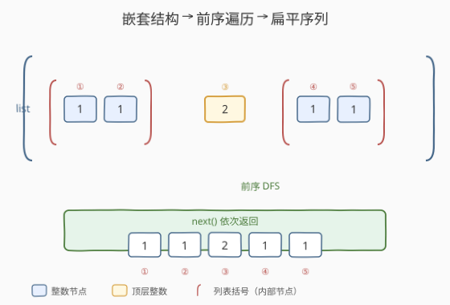
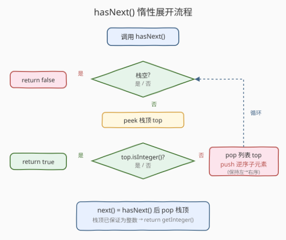

# 扁平化嵌套列表迭代器

- **题目名称**：扁平化嵌套列表迭代器
- **链接**：[341. 扁平化嵌套列表迭代器](https://leetcode.cn/problems/flatten-nested-list-iterator/)
- **难度**：中等
- **标签**：栈、树、深度优先搜索、设计、迭代器

## 1. 题目概述

给定一个**嵌套列表** `nestedList`，其中每个元素要么是一个**整数**，要么是**另一个嵌套列表**（可任意嵌套）。要求实现一个**迭代器** `NestedIterator`，使其能按**从左到右、深度优先**的顺序依次返回其中的所有整数。

`NestedInteger` 接口定义如下：

```python
class NestedInteger:
    def isInteger(self) -> bool: ...
    def getInteger(self) -> int: ...                  # 仅当 isInteger() 为 True 时有效
    def getList(self) -> List[NestedInteger]: ...     # 仅当 isInteger() 为 False 时有效
```

需实现的接口：

- `NestedIterator(List[NestedInteger] nestedList)`：用 `nestedList` 初始化迭代器。
- `int next()`：返回下一个整数。
- `boolean hasNext()`：若仍有整数未返回则返回 `true`，否则 `false`。

调用方式约定为 `while (i.hasNext()) ... i.next()`。

**示例 1**：

```text
输入：nestedList = [[1,1],2,[1,1]]
输出：[1,1,2,1,1]
解释：反复调用 next() 直到 hasNext() 为 false，返回顺序如上。
```

**示例 2**：

```text
输入：nestedList = [1,[4,[6]]]
输出：[1,4,6]
```

**约束条件**：

- $1 \le \text{nestedList.length} \le 500$
- 嵌套列表中整数取值范围 $[-10^6, 10^6]$
- 最大嵌套深度 $\le 500$

> 💡 本题与 [339. 嵌套列表加权和](../0301-0400/339_嵌套列表加权和.md) 共享同一个 `NestedInteger` 接口——把嵌套结构看成**多叉树**：整数是**叶节点**，列表是**内部节点**。339 是「带深度参数的先序 DFS 一次性求加权和」；本题则要求把先序遍历**拆成一问一答的迭代器**：每次 `next()` 只吐出一个整数。难点不在遍历顺序，而在**如何让遍历能「暂停 / 恢复」**——这正是「迭代器」区别于「一次性递归」的核心。本题也是 [173. 二叉搜索树迭代器](../0101-0200/173_二叉搜索树迭代器.md) 在多叉树上的推广，两者都用**栈模拟递归**实现惰性遍历。

---

## 2. 解题思路

### 2.1 直接思路：构造时一次性扁平化

最直接的做法：在构造函数里**递归 DFS** 整棵嵌套树，把所有整数按先序收集到一个数组 / 队列，`next()` / `hasNext()` 退化为对数组的索引访问。

```text
构造：  DFS(nestedList) → 把整数依次塞进 self.flat   O(n)
next：  self.flat[idx]; idx++                         O(1)
hasNext：idx < len(self.flat)                         O(1)
```

写法简单，复杂度也合格。但它**不惰性**——即便调用方只取前两个整数就丢弃迭代器，构造时也已经把全部 $n$ 个整数遍历完、并存了一份 $O(n)$ 的副本。

> ⚠️ 这违背了迭代器的设计意图。迭代器的精髓是「**按需产出**」：调用方要一个我才找一个，不预支、不多存。一次性扁平化把「遍历」和「产出」耦合在构造阶段，丢了惰性。本题期望的解法是**用栈模拟递归的控制流**，让遍历能停在任意一个整数处，下次 `next()` 时再继续。

### 2.2 核心观察：栈模拟递归，惰性展开



**关键洞察**：嵌套结构的先序遍历天然就是扁平输出顺序——「遇到整数就输出，遇到列表就钻进去」。递归版本的调用栈自动管理了「钻入 / 退出」的控制流；要把它改造成迭代器，只需**用显式栈替换递归调用栈**，并把「访问到整数」这一刻作为**暂停点**。

设计要点：**栈顶始终是「下一个候选」**。

| 栈顶类型 | `hasNext()` 动作 |
|----------|------------------|
| 整数 | 就绪，返回 `true`；`next()` 直接弹出并返回该整数 |
| 列表 | 弹出该列表，把它的**子元素按逆序**重新压入栈（保证最左子元素在栈顶），继续循环 |
| 栈空 | 返回 `false` |

> 💡 **为什么要「逆序压入」？** 栈是 LIFO，而我们要的是**从左到右**的顺序。设列表元素为 $[a, b, c]$，若按原序压入（先 $a$ 后 $c$），栈顶是 $c$——错了。必须**逆序**压入（先 $c$ 后 $a$），栈顶才是 $a$。这是栈做「保序遍历」的通用技巧，与 [173. 二叉搜索树迭代器](../0101-0200/173_二叉搜索树迭代器.md) 中「先把整条左脊压栈」是同一思想：**入栈方向与遍历方向相反，出栈时才与遍历方向一致**。

> ⚠️ **`hasNext()` 必须用 `while` 循环而非 `if`**：弹出一个列表后，新栈顶可能是**另一个嵌套列表**（如 `[[[1]]]` 展开一层后栈顶仍是 `[[1]]`）。必须持续展开直到栈顶是整数或栈空。一次 `if` 只展开一层，会漏掉连续嵌套。

把 `hasNext()` 看作「**把栈顶整理成整数**」的规约过程：`next()` 调用前先 `hasNext()` 保证栈顶是整数，再 `pop` 即可。

### 2.3 算法流程图



**构造函数**：把 `nestedList` 的元素**逆序**压入栈（最右元素先进，最左元素在栈顶）。

**`hasNext()`**：

1. 若栈空 → 返回 `false`。
2. `peek` 栈顶 `top`：
   - 若 `top.isInteger()` → 返回 `true`。
   - 否则 `pop` 出 `top`（它是列表），取出 `top.getList()`，**逆序**遍历其子元素依次 `push` 入栈。
3. 回到步骤 1（`while` 循环）。

**`next()`**：先调 `hasNext()` 确保栈顶为整数，`pop` 栈顶，返回 `getInteger()`。

### 2.4 示例演算

以示例 2 `nestedList = [1,[4,[6]]]` 为例（输出 `[1,4,6]`）：

![示例 [1,[4,[6]]] → [1,4,6] 的栈状态演化](../images/nestedlist_iterator_walkthrough.svg)

栈状态（栈顶在上方）逐步演化如下：

| 阶段 | 栈（栈顶→栈底） | 动作 | 产出 |
|------|------------------|------|------|
| 初始 | `1` / `[4,[6]]` | 构造时逆序压入，栈顶为 `1` | — |
| `hasNext` | 同上 | 栈顶 `1` 是整数 → `true` | — |
| `next` ① | `[4,[6]]` | `pop` 出 `1` 并返回 | `1` |
| `hasNext` | `4` / `[6]` | 栈顶 `[4,[6]]` 是列表 → pop，逆序压子元素 `[6]`、`4` → 栈顶变 `4`（整数）→ `true` | — |
| `next` ② | `[6]` | `pop` 出 `4` 并返回 | `4` |
| `hasNext` | `6` | 栈顶 `[6]` 是列表 → pop，逆序压子元素 `6` → 栈顶变 `6`（整数）→ `true` | — |
| `next` ③ | （空） | `pop` 出 `6` 并返回 | `6` |
| `hasNext` | — | 栈空 → `false` | — |

最终输出 `[1, 4, 6]`。

> 💡 **观察「惰性」如何体现**：构造时只压入了最外层 2 个元素，没有触碰 `[4,[6]]` 内部。直到第 2 次 `hasNext()` 被调用，`[4,[6]]` 才被展开；`[6]` 直到第 3 次 `hasNext()` 才被展开。**每一段嵌套都是在「非展开不可」的那一刻才展开**——这正是迭代器相对一次性扁平化的本质优势。

---

## 3. 参考代码

### C++

```cpp
// 扁平化嵌套列表迭代器.cpp —— 栈模拟递归，惰性展开
// 编译: g++ -O2 -std=c++17 扁平化嵌套列表迭代器.cpp -o nested_iter
#include <vector>
#include <stack>

class NestedInteger {
public:
    bool isInteger() const;
    int getInteger() const;
    const std::vector<NestedInteger>& getList() const;
};

class NestedIterator {
    // 每层存 (当前迭代器, 末尾迭代器)，省去拷贝整段子列表
    using It = std::vector<NestedInteger>::const_iterator;
    std::stack<std::pair<It, It>> stk;

public:
    NestedIterator(std::vector<NestedInteger> &nestedList) {
        stk.emplace(nestedList.begin(), nestedList.end());
    }

    int next() {
        hasNext();                       // 保证栈顶位置是整数
        auto &top = stk.top();
        return top.first++->getInteger(); // 取值并前移本层指针
    }

    bool hasNext() {
        while (!stk.empty()) {
            auto &top = stk.top();
            if (top.first == top.second) {
                stk.pop();               // 本层遍历完，退回上层
            } else if (top.first->isInteger()) {
                return true;             // 栈顶已是整数，就绪
            } else {
                auto &child = top.first->getList();
                ++top.first;             // 本层指针前移（跳过刚下钻的列表元素）
                stk.emplace(child.begin(), child.end());  // 下钻子列表
            }
        }
        return false;
    }
};
```

### Python

```python
class NestedIterator:
    def __init__(self, nestedList: List[NestedInteger]):
        # 逆序压入，保证最左元素在栈顶
        self.stack: List[NestedInteger] = list(reversed(nestedList))

    def next(self) -> int:
        self.hasNext()                   # 保证栈顶是整数（幂等，重复调用 O(1)）
        return self.stack.pop().getInteger()

    def hasNext(self) -> bool:
        while self.stack:
            top = self.stack[-1]
            if top.isInteger():
                return True
            self.stack.pop()             # 弹出列表
            # 逆序压入子元素，保持从左到右的访问顺序
            for item in reversed(top.getList()):
                self.stack.append(item)
        return False
```

> 💡 **两种实现的取舍**：
>
> - **C++「迭代器对栈」**：栈里存的是 `(begin, end)` 迭代器对，每层只占 $O(1)$ 空间，总空间 $O(d)$（$d$ 为最大深度）。**不拷贝**任何 `NestedInteger` 对象，只持有指向原容器的迭代器。代价是写法稍绕，且要求原 `nestedList` 在迭代器生命周期内不被销毁。
> - **Python「逆序压对象栈」**：栈里直接存 `NestedInteger` 引用（Python 中是对象引用，拷贝代价小），写法直观。但构造时一次性把最外层全部压入，最坏空间 $O(n)$（如 `[1,2,...,500]` 全是顶层整数时栈持有全部 500 个引用）。两种写法时间复杂度相同，空间差异在题目规模下可忽略；面试中 C++ 给出迭代器对版本能体现对「省拷贝 / 省空间」的考量。

> ⚠️ **`next()` 里调 `hasNext()` 是安全网**：LeetCode 驱动约定 `while (hasNext()) next()`，理论上 `next()` 直接 `pop` 即可。但 `next()` 内部先调一次 `hasNext()` 是幂等的——栈顶已是整数时 `hasNext()` 立即返回 `true`，开销 $O(1)$；万一调用方没先调 `hasNext()`，也能正确展开栈顶。这是防御式编程的常用习惯。

---

## 4. 复杂度分析

| 维度 | 复杂度 | 说明 |
|------|--------|------|
| **构造** | $O(L)$ / $O(1)$ | Python 逆序压入最外层 $L$ 个元素 $O(L)$；C++ 仅压一对迭代器 $O(1)$ |
| **`next` 摊还** | $O(1)$ | 整个生命周期内每个节点最多被压入 / 弹出一次，总操作 $O(n)$，分摊到 $m$ 次 `next` 上为 $O(n/m)$；$m$ 为整数个数，$n = O(m)$ |
| **`hasNext` 摊还** | $O(1)$ | 同上；单次 `hasNext` 可能展开连续嵌套，但所有展开操作在整个生命周期内合计 $O(n)$ |
| **空间** | $O(d)$ / $O(n)$ | C++ 迭代器对栈 = 最大深度 $d$；Python 对象栈最坏 $O(n)$（全平铺时），含深度信息时为 $O(d + L)$ |

> ⚠️ **理解「摊还 $O(1)$」**：单看某次 `hasNext()`，若栈顶是 `[[[[[1]]]]]`，要连续展开 5 层才露出整数，这次调用是 $O(d)$。但展开掉的 5 个列表节点**此后不再入栈**——总展开次数以总节点数 $n$ 为上界。把总开销 $O(n)$ 摊到 $m$ 次 `next()` 上，每次摊还 $O(n/m) = O(1)$（因 $n = O(m)$）。这是「**栈模拟递归的摊还分析**」的标准论证，与 [173. 二叉搜索树迭代器](../0101-0200/173_二叉搜索树迭代器.md) 的摊还论证完全同构。

> 💡 **$n$ 的定义**：节点总数 = 整数节点数 $m$ + 列表节点数 $k$。每个整数必有唯一父列表（最外层也算一个列表节点），故 $k \le m + 1$，$n = m + k = O(m)$。渐近意义上用 $m$ 或 $n$ 等价。

---

## 5. 扩展：两种变体写法

### 5.1 构造时一次性扁平化（朴素版）

最朴素的写法，适合作为对照理解「惰性」的价值：

```python
class NestedIterator:
    def __init__(self, nestedList: List[NestedInteger]):
        self._flat: List[int] = []
        self._idx = 0
        self._flatten(nestedList)

    def _flatten(self, nested: List[NestedInteger]) -> None:
        for elem in nested:
            if elem.isInteger():
                self._flat.append(elem.getInteger())
            else:
                self._flatten(elem.getList())   # 与 339 同一套先序 DFS

    def next(self) -> int:
        val = self._flat[self._idx]
        self._idx += 1
        return val

    def hasNext(self) -> bool:
        return self._idx < len(self._flat)
```

时间 $O(n)$、空间 $O(n)$。在题目规模下能 AC，但面试中若被追问「数据很大、只需前几个元素时怎么办」，就暴露了非惰性的短板——这是引导你切换到栈解法的经典追问。

### 5.2 Python 生成器版（惰性且优雅）

Python 的 `yield` 天生支持「暂停 / 恢复」，可以一行不写显式栈就实现惰性扁平化：

```python
class NestedIterator:
    def __init__(self, nestedList: List[NestedInteger]):
        self._gen = self._gen_flatten(nestedList)
        self._peek: Optional[int] = None

    def _gen_flatten(self, nested):
        for elem in nested:
            if elem.isInteger():
                yield elem.getInteger()
            else:
                yield from self._gen_flatten(elem.getList())  # 委托子生成器

    def next(self) -> int:
        if self._peek is None:
            self.hasNext()          # 保证 _peek 已填好
        val, self._peek = self._peek, None
        return val

    def hasNext(self) -> bool:
        if self._peek is not None:
            return True
        try:
            self._peek = next(self._gen)
            return True
        except StopIteration:
            return False
```

> 💡 **`yield from` 把递归生成器串联起来**：子生成器产出的值直接转发给外层调用者，等价于「递归 DFS + 暂停在每次 `yield` 处」。底层仍由 Python 维护生成器帧栈，本质上与我们手写的显式栈是同一回事——只不过栈帧由解释器托管。这是一种「**用语言特性换代码简洁度**」的取舍：可读性最佳，但失去了对栈深的显式控制（受 `sys.setrecursionlimit` 约束，深度极大时仍可能爆栈）。

### 5.3 嵌套结构题家族横向对比

| 题号 | 题目 | 方向 | 核心做法 |
|------|------|------|----------|
| 339 | 嵌套列表加权和 | 一次性求和 | DFS 带 depth 参数下传 |
| 364 | 嵌套列表加权和 II | 反向加权求和 | 两遍 DFS 或一遍 BFS 累加翻倍 |
| **341** | **扁平化嵌套列表迭代器** | **惰性逐个产出** | **栈模拟递归，hasNext 规约栈顶** |
| 385 | 迷你语法分析器 | 字符串 → 嵌套结构 | 栈解析 `[` / `]` / 数字 |

> 💡 四题共享 `NestedInteger` 接口与「嵌套 = 多叉树」抽象。339 / 364 是「**遍历一遍求聚合值**」，341 是「**遍历拆成迭代器**」，385 是「**从字符串构造树**」。理解了多叉树抽象 + 栈 / DFS / BFS 三种遍历工具，这族题可一通百通。

---

## 6. 面试要点

1. **为什么要用栈？栈和递归是什么关系？**

   > 先序遍历嵌套树本可用递归，但递归的调用栈由编译器 / 解释器托管，**无法在「访问到整数」处暂停**——一旦进入 `dfs(list)` 就会一口气遍历完整个子树才返回。迭代器要求「问一个答一个」，必须把遍历控制权交回调用方。**显式栈就是手动管理的递归调用栈**：每次 `hasNext()` 推进一步，把「下一步该做什么」留在栈里，等下次调用继续。这是「**递归 → 迭代**」的通用改造范式。

2. **`hasNext()` 为什么用 `while` 而不是 `if`？**

   > 弹出一个列表后压入的是它的**直接子元素**，其中可能仍含列表（如 `[[[1]]]` 展开一层后栈顶是 `[[1]]`，还是列表）。`if` 只展开一次，栈顶仍是列表时 `next()` 会试图对一个列表调 `getInteger()`，类型错误。必须用 `while` 持续展开，直到栈顶是整数或栈空——这等价于递归版本中「连续钻入多层列表直到遇到叶子」的过程。

3. **逆序压入子元素的目的？能否原序压入？**

   > 栈是 LIFO。要把列表 $[a,b,c]$ 按从左到右顺序产出，必须让 $a$ 在栈顶，即**最后压入** $a$——所以遍历子元素时按 $c,b,a$ 的逆序压入。若原序压入，栈顶会是 $c$，产出顺序反转。这是「**入栈方向与遍历方向相反**」的通用规则：前序遍历的「左优先」在栈上表现为「左最后压」。

4. **惰性栈解法相对一次性扁平化的优势？何时选哪个？**

   > ① **内存**：数据巨大但只取前几个元素时，惰性栈只展开必要部分，一次性扁平化要 $O(n)$ 副本。② **语义**：迭代器的契约就是「按需产出」，惰性才符合语义；一次性扁平化本质是「伪装成迭代器的列表」。③ **改动友好**：若 `nestedList` 后续被外部修改（增删元素），惰性栈能看到变化（只要还没展开到那一段），扁平化副本则冻结了构造时刻的快照。一次性扁平化仅在「数据量确定且小、或要多次全量遍历」时才有简洁性优势。

5. **C++ 迭代器对栈为何空间是 $O(d)$ 而非 $O(n)$？**

   > 栈里存的是 `(begin, end)` **迭代器对**，每层列表只占一对迭代器（$O(1)$），栈深 = 当前正在遍历的嵌套层数 = $O(d)$。它**不持有任何 `NestedInteger` 对象的副本**，只通过迭代器间接访问原容器。而 Python 的逆序压对象栈把最外层全部元素引用都压进去，全平铺时栈持有 $L = n$ 个引用，故 $O(n)$。代价是 C++ 版本要求原 `nestedList` 在迭代器存活期间不被销毁——这是「用引用换省内存」的常见取舍。

> 💡 **一句话总结**：341 是「**用显式栈把先序递归改造成可暂停的迭代器**」——栈顶永远是下一个候选，`hasNext()` 用 `while` 把栈顶规约成整数，`next()` 弹出即返回。掌握了「入栈逆序、出栈保序」与「栈模拟递归的摊还 $O(1)$」两点，就能通吃 173 / 341 这一脉的惰性迭代器题。

---

## 7. 同类练习题

- [339. 嵌套列表加权和](https://leetcode.cn/problems/nested-list-weight-sum/)（[题解](../0301-0400/339_嵌套列表加权和.md)）：同一 `NestedInteger` 接口的入门题，先序 DFS 带 depth 参数；341 是它的「拆成迭代器」变体
- [173. 二叉搜索树迭代器](https://leetcode.cn/problems/binary-search-tree-iterator/)（[题解](../0101-0200/173_二叉搜索树迭代器.md)）：栈模拟中序递归实现惰性 BST 迭代器，与本题「栈模拟先序递归」完全同构，对比二叉树 vs 多叉树的栈式遍历
- [232. 用栈实现队列](https://leetcode.cn/problems/implement-queue-using-stacks/)（[题解](../0201-0300/232_用栈实现队列.md)）：同样是「入栈逆序、出栈保序」的技巧，双栈倒换实现 FIFO；本题逆序压子元素保左→右序是其多叉树推广
- [385. 迷你语法分析器](https://leetcode.cn/problems/mini-parser/)：从字符串 `[1,[4,[6]]]` 构造 `NestedInteger`，栈解析 `[` / `]` / 数字，与本题共享嵌套树抽象但方向相反（字符串→结构 vs 结构→遍历）
- [364. 嵌套列表加权和 II](https://leetcode.cn/problems/nested-list-weight-sum-ii/)：339 的反向加权变体，配合 339 / 341 理解嵌套家族的三种遍历工具（DFS / BFS / 栈迭代器）
