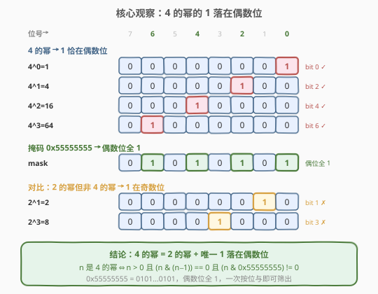
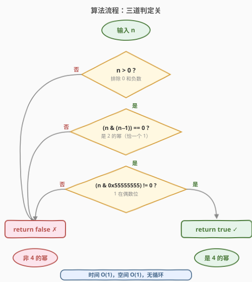
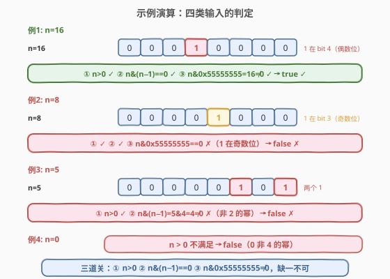

# 4 的幂

- **题目名称**：4 的幂
- **链接**：[342. 4 的幂](https://leetcode.cn/problems/power-of-four/)
- **难度**：简单
- **标签**：位运算、数学

## 1. 题目概述

给定一个整数 `n`，判断它是否为 **4 的幂**——即是否存在整数 `x` 使得 $n = 4^x$。是则返回 `true`，否则返回 `false`。

**示例 1**：

```text
输入：n = 16
输出：true
解释：4^2 = 16
```

**示例 2**：

```text
输入：n = 5
输出：false
```

**示例 3**：

```text
输入：n = 1
输出：true
解释：4^0 = 1
```

**约束条件**：

- $-2^{31} \le n \le 2^{31} - 1$

> 💡 **进阶**：不使用循环 / 递归完成？答案是位掩码 `0x55555555`——在 [231. 2 的幂](../0201-0300/231_2的幂.md) 的 `n & (n-1)` 基础上加一道「唯一 1 落在偶数位」的筛选，$O(1)$ 无循环。它与 231、[326. 3 的幂](326_3的幂.md) 是同一系列题：231 判 2 的幂（位运算 `n & (n-1)`），326 判 3 的幂（最大幂取模 $3^{19} \bmod n$），342 在 231 基础上加掩码筛偶数位——三题层层递进。

---

## 2. 解题思路

### 2.1 暴力思路：反复除 4

4 的幂满足：不断除以 4 最终会到 1，且过程中始终能被 4 整除（除 1 外）。故：

```text
若 n <= 0：返回 false
while n % 4 == 0：
    n //= 4
返回 n == 1
```

时间 $O(\log n)$（除到 1 最多 $\log_4 n$ 次），空间 $O(1)$。能 AC，但**用了循环**——不满足进阶的「无循环」要求，且对大数（如 $n = 4^{15}$）要循环 15 次。

> 💡 转机：4 的幂首先是 2 的幂（$4^x = 2^{2x}$），所以可以复用 [231](../0201-0300/231_2的幂.md) 的位运算判「恰一个 1」。但 2 的幂不一定是 4 的幂（如 $2 = 2^1$、$8 = 2^3$），还需额外筛选——关键就在 $4^x = 2^{2x}$ 这个 $2x$ 上。

### 2.2 核心观察：4 的幂的 1 落在偶数位



列出前几个 4 的幂的二进制：

| n | 二进制 | 设置位位置 | 是否偶数位 |
|---|--------|-----------|-----------|
| $4^0=1$ | `00000001` | bit 0 | ✅ |
| $4^1=4$ | `00000100` | bit 2 | ✅ |
| $4^2=16$ | `00010000` | bit 4 | ✅ |
| $4^3=64$ | `01000000` | bit 6 | ✅ |

规律显而易见：**$4^x = 2^{2x}$，设置位恰在第 $2x$ 位（偶数位）**。对比那些「是 2 的幂但非 4 的幂」的数——$2^1=2$（bit 1，奇）、$2^3=8$（bit 3，奇）、$2^5=32$（bit 5，奇）——设置位都在**奇数位**。

> 💡 **关键转化**：判定「$n$ 是 4 的幂」$\iff$ 判定「$n$ 是 2 的幂 **且** 唯一设置位落在偶数位」。前者用 [231](../0201-0300/231_2的幂.md) 的 `n & (n-1) == 0`，后者用一个偶数位全 1 的掩码做按位与。

### 2.3 核心解法：`n & 0x55555555`

掩码 `0x55555555` 的二进制是 `0101 0101 ... 0101`（32 位，偶数位全 1，奇数位全 0）。用 $n$ 与它做按位与：

- 若 $n$ 的唯一 1 在**偶数位**（$n$ 是 4 的幂），`n & 0x55555555` 保留该 1，结果 $\ne 0$；
- 若 $n$ 的唯一 1 在**奇数位**（$n$ 是 2 的幂但非 4 的幂），`n & 0x55555555` 抹掉该 1，结果 $= 0$。

把三道判定合起来：

1. **`n > 0`**：排除 `0` 和负数（4 的幂恒正，且防 `n & (n-1)` 中 `n-1` 对 `INT_MIN` 的未定义行为）。
2. **`(n & (n-1)) == 0`**：判 2 的幂——恰一个设置位（承接 [231](../0201-0300/231_2的幂.md)）。
3. **`(n & 0x55555555) != 0`**：判设置位在偶数位——筛出 4 的幂。

> ⚠️ **第 3 关为何用 `!= 0` 而非 `== n`？** 因为第 2 关已保证 $n$ 恰一个 1，`n & mask` 要么等于 $n$（1 在偶数位），要么等于 0（1 在奇数位）。两种写法等价，但 `!= 0` 更简洁直观。注意第 3 关**依赖第 2 关**——单独 `n & 0x55555555 != 0` 不能判 4 的幂（如 $n = 5 = 101_2$ 有两个 1，`5 & 0x55555555 = 5 ≠ 0` 但 5 不是 4 的幂）。

### 2.4 算法流程图



算法是**三道串联的判定关**，缺一不可：

1. **第一关 `n > 0`**：排除 `0` 和负数。
2. **第二关 `(n & (n-1)) == 0`**：判定是 2 的幂（恰一个设置位）。
3. **第三关 `(n & 0x55555555) != 0`**：判定设置位在偶数位（是 4 的幂）。

三关都过 → `true`；任一关不过 → `false`。整个判定**无循环、无递归**，一次比较 + 两次按位与即完成。

### 2.5 示例演算

以四类典型输入为例（4 的幂、2 的幂但非 4 的幂、非 2 的幂、零）：



| 输入 | 二进制 | 第一关 `n > 0` | 第二关 `n & (n-1) == 0` | 第三关 `n & 0x55555555 != 0` | 结果 |
|------|--------|---------------|-------------------------|------------------------------|------|
| `n = 16` | `10000` | ✅ | `16 & 15 = 0` ✅ | `16 & 0x55555555 = 16 ≠ 0` ✅ | `true` |
| `n = 8` | `1000` | ✅ | `8 & 7 = 0` ✅ | `8 & 0x55555555 = 0` ✗ | `false` |
| `n = 5` | `101` | ✅ | `5 & 4 = 4 ≠ 0` ✗ | —（短路跳过） | `false` |
| `n = 0` | `0` | ✗ | —（短路跳过） | —（短路跳过） | `false` |

注意 `n = 8 = 2^3`：它是 2 的幂（过第二关），但设置位在 bit 3（奇数位），`8 & 0x55555555 = 0`，第三关被拦——这正是「4 的幂 ⊊ 2 的幂」的体现。

---

## 3. 参考代码

### C++

```cpp
class Solution {
  public:
    bool isPowerOfFour(int n) {
        return n > 0 && (n & (n - 1)) == 0 && (n & 0x55555555) != 0;
    }
};
```

### Python

```python
class Solution:
    def isPowerOfFour(self, n: int) -> bool:
        return n > 0 and (n & (n - 1)) == 0 and (n & 0x55555555) != 0
```

> 💡 **一行即终**。三道关串联：`n > 0` 排除零与负数，`(n & (n-1)) == 0` 判 2 的幂，`(n & 0x55555555) != 0` 筛偶数位。Python 整数无限精度，但题目范围已限定 int32，`0x55555555` 只覆盖低 32 位；若题目改成任意大整数，需动态构造覆盖 $n$ 最高位的掩码。

---

## 4. 复杂度分析

| 维度 | 位掩码法 | 暴力除法 |
|------|---------|---------|
| **时间复杂度** | $O(1)$ | $O(\log n)$ |
| **空间复杂度** | $O(1)$ | $O(1)$ |
| **无循环** | ✅ 满足进阶 | ✗ 用 while 循环 |

> ⚠️ 位掩码法的时间严格是 $O(1)$：一次比较、一次减法、两次按位与、两次等于比较，固定 6 步，与 $n$ 大小无关。对 32 位整数，所有运算都是单条 CPU 指令。

---

## 5. 扩展：其他判定 4 的幂的写法

### 5.1 暴力除法（循环）

最朴素的写法，$O(\log_4 n)$：

```cpp
bool isPowerOfFour(int n) {
    if (n <= 0) return false;
    while (n % 4 == 0) n /= 4;
    return n == 1;
}
```

> 💡 能 AC 但用了循环，不满足进阶。在面试中可作为「先讲暴力再优化」的起点。

### 5.2 取模法：`n % 3 == 1`

数学观察：$4 \equiv 1 \pmod{3}$，故 $4^k \equiv 1^k = 1 \pmod{3}$。而那些「是 2 的幂但非 4 的幂」的数 $2^{2k+1} = 2 \cdot 4^k \equiv 2 \cdot 1 = 2 \pmod{3}$。故：

```cpp
return n > 0 && (n & (n - 1)) == 0 && n % 3 == 1;
```

> 💡 **原理**：在 2 的幂中，$4^k \bmod 3 = 1$，$2^{2k+1} \bmod 3 = 2$。`n % 3 == 1` 恰好筛出 4 的幂。这个写法不依赖掩码，纯整数运算，但需要理解模 3 的数学背景。

### 5.3 最大幂取模法 + 掩码

int32 范围内最大的 4 的幂是 $4^{15} = 2^{30} = 1073741824$（$4^{16} = 2^{32} > 2^{31}-1$ 溢出）。但 $4^{15} = 2^{30}$ 是合数底数的幂，其因数包括所有 $2^k$（$k = 0..30$），含非 4 的幂（如 2、8、32），故**单靠取模不够**，需配掩码：

```cpp
return n > 0 && 1073741824 % n == 0 && (n & 0x55555555) != 0;
```

> ⚠️ **与 [326. 3 的幂](326_3的幂.md) 的差异**：3 是素数，$3^{19}$ 唯一素因子是 3，单靠取模即可；4 是合数（$= 2^2$），$4^{15} = 2^{30}$ 的素因子是 2，所有 2 的幂都能整除它，必须加掩码辅助。这就是 [326](326_3的幂.md) 5.4 节提到的「$b$ 是合数时需额外条件」。

### 5.4 各写法对比

| 写法 | 核心思想 | 时间 | 与其他题的联系 |
|------|---------|------|----------------|
| **`n & 0x55555555`** | 偶数位掩码筛选 | $O(1)$ | [231](../0201-0300/231_2的幂.md) `n & (n-1)` + 掩码 |
| `n % 3 == 1` | 模 3 区分 $4^k$ 与 $2^{2k+1}$ | $O(1)$ | 纯整数，无需掩码 |
| `4^15 % n == 0 + mask` | 最大幂取模 + 掩码 | $O(1)$ | [326](326_3的幂.md) 取模模板（合数需加掩码） |
| 暴力除法 | 反复除 4 到 1 | $O(\log n)$ | [231](../0201-0300/231_2的幂.md) 2.1 暴力同构 |

前三种写法复杂度均为 $O(1)$，面试首推 `n & 0x55555555`——它直接复用 231 的 `n & (n-1)`，加一道掩码即终，体现「2 的幂 → 4 的幂」的层层筛选。

---

## 6. 面试要点

1. **为什么 `n & 0x55555555 != 0` 能区分 4 的幂和其他 2 的幂？**

   - `0x55555555 = 0101...0101`，偶数位（bit 0, 2, 4, ...）全 1，奇数位全 0。
   - $4^x = 2^{2x}$，设置位在第 $2x$ 位（偶数位），`n & mask` 保留该 1，结果 $\ne 0$。
   - $2^{2x+1}$（非 4 的幂）设置位在第 $2x+1$ 位（奇数位），`n & mask` 抹掉该 1，结果 $= 0$。

2. **为什么不能只用 `n & 0x55555555 != 0`，还要加 `(n & (n-1)) == 0`？**

   - `n & 0x55555555 != 0` 只说明 $n$ 在某个偶数位有 1，不保证**恰一个 1**。
   - 如 $n = 5 = 101_2$，`5 & 0x55555555 = 5 ≠ 0`，但 5 不是 4 的幂。
   - 必须先用 `(n & (n-1)) == 0` 保证恰一个 1（2 的幂），掩码才有意义。

3. **为什么 `0x55555555` 恰好是偶数位全 1？**

   - 十六进制 `5 = 0101_2`，每 4 位一组：`5 = 0101`，`5 = 0101`，...，共 8 组。
   - 每组内 bit 0 和 bit 2 为 1（偶数位），bit 1 和 bit 3 为 0（奇数位）。
   - 32 位拼起来就是 `0101 0101 ... 0101`，所有偶数位全 1。

4. **`n % 3 == 1` 为什么也能判 4 的幂？**

   - $4 \equiv 1 \pmod{3}$，故 $4^k \equiv 1 \pmod{3}$。
   - $2^{2k+1} = 2 \cdot 4^k \equiv 2 \pmod{3}$（非 4 的幂的 2 的幂）。
   - 在 2 的幂中，`n % 3 == 1` 恰好筛出 $4^k$，`n % 3 == 2` 筛出 $2^{2k+1}$。

5. **本题和 231、326 的关系是什么？**

   - 三题是「$b$ 的幂」判定系列：231（$b=2$，素数，位运算 `n & (n-1)`）、326（$b=3$，素数，最大幂取模 $3^{19} \bmod n$）、342（$b=4$，合数，231 + 掩码）。
   - 底数是 2 的素数幂（$4 = 2^2$）时可复用 2 的幂位运算，加掩码筛子序列。
   - 底数非 2 的素数（如 3）用最大幂取模；底数是合数（如 4）取模法需额外条件。

> 💡 **一句话总结**：4 的幂 = 2 的幂 + 1 落在偶数位。复用 231 的 `n & (n-1)` 判 2 的幂，加掩码 `0x55555555` 筛偶数位——一行 `n > 0 && (n & (n-1)) == 0 && (n & 0x55555555) != 0` 即终。与 [231. 2 的幂](../0201-0300/231_2的幂.md)、[326. 3 的幂](326_3的幂.md) 构成「$b$ 的幂」判定三题组。

---

## 7. 同类练习题

- [231. 2 的幂](https://leetcode.cn/problems/power-of-two/)（[题解](../0201-0300/231_2的幂.md)）：底数为 2，`n & (n-1)` 判恰一个 1，本题的前置题
- [326. 3 的幂](https://leetcode.cn/problems/power-of-three/)（[题解](326_3的幂.md)）：底数非 2 的素数，改用最大幂取模 $3^{19} \bmod n$，对照本题合数底数需加掩码
- [191. 位 1 的个数](https://leetcode.cn/problems/number-of-1-bits/)（[题解](../0001-0100/191_位1的个数.md)）：`n & (n-1)` 抹最低 1 的 Brian Kernighan 技巧，231 和本题共用
- [338. 比特位计数](https://leetcode.cn/problems/counting-bits/)（[题解](338_比特位计数.md)）：批量求 popcount，`n & (n-1)` 的 DP 复用，本题位运算基础
