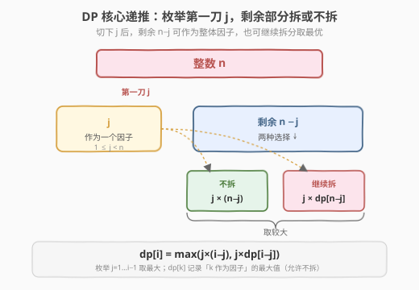
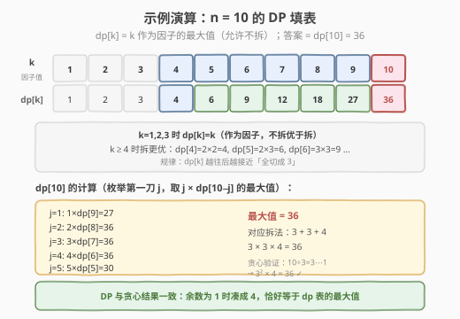
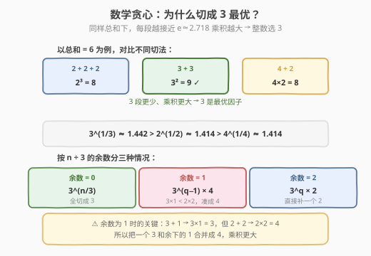

# 整数拆分

- **题目名称**：整数拆分
- **链接**：[343. 整数拆分](https://leetcode.cn/problems/integer-break/)
- **难度**：中等
- **标签**：动态规划、数学、贪心

## 1. 题目概述

给定一个正整数 `n`，将其拆分为 `k` 个**正整数**之和（`k >= 2`），使这些整数的**乘积最大化**。返回你能获得的最大乘积。

**示例 1**：

```text
输入：n = 2
输出：1
解释：2 = 1 + 1, 1 × 1 = 1
```

**示例 2**：

```text
输入：n = 10
输出：36
解释：10 = 3 + 3 + 4, 3 × 3 × 4 = 36
```

**约束条件**：

- `2 <= n <= 58`

> 💡 这是剑指 Offer 14-I「剪绳子」的同题，面试出现频率极高。它有两层魅力：① DP 的「枚举第一刀」思路，是所有「切分型 DP」的母模板；② 一个优美的数学结论——**切成 3 最优**，把 `O(n²)` 的 DP 一步压成 `O(1)`。面试中先讲 DP、再亮数学，能体现「暴力→优化→数学」的完整思维链。

---

## 2. 解题思路

### 2.1 暴力思路：枚举所有拆法

对 `n` 枚举所有「至少两段」的拆分方案，取乘积最大值。但长度为 `n` 的拆分方案数随 `n` 指数增长（整数划分问题），`n=58` 时方案数是天文数字，**严重超时**。

> ⚠️ 暴力法的问题在于：同一个子段 `k` 的「最大乘积」在不同大方案里被反复求值——这是**重叠子问题**的信号，也是 DP 出场的时机。

### 2.2 核心观察：DP —— 第一刀切在哪里

**关键定义**：设 $dp[i]$ = 整数 $i$ **作为因子**时能贡献的最大值（允许不拆，即 $dp[i] \ge i$）。

> 💡 **为什么定义「允许不拆」？** 拆分 $n$ 时切下第一段 $j$，剩余 $i - j$ 可能作为一个整体因子（不再拆），也可能继续拆。如果 $dp[k]$ 只记录「必须拆」的乘积，那 $dp[3]=2$（$1\times2$），但作为因子 $3$ 本身比 $2$ 大——后续计算 $dp[5]=2\times dp[3]$ 会得到 $4$ 而非正确的 $6$。允许不拆后 $dp[3]=3$，$dp[5]=2\times3=6$ 才对。这个「因子视角」的定义是本题最容易踩的坑。

**核心递推**：对 $i$，枚举第一刀 $j$（$1 \le j < i$），剩余 $i-j$ 有两种选择：

- **不拆**：作为整体因子，贡献 $j \times (i-j)$
- **继续拆**：取最优拆法，贡献 $j \times dp[i-j]$

$$dp[i] = \max_{1 \le j < i} \big(\; j \times (i-j),\;\; j \times dp[i-j] \;\big)$$



> 💡 **$j$ 和 $dp[i-j]$ 为什么相乘？** 切下 $j$ 后，$j$ 是一个确定的因子，剩余 $i-j$ 的最优贡献是 $dp[i-j]$（无论它拆不拆），两者**独立**——乘法原理。再对所有 $j$ 取 $\max$（互斥情况取最优）。这与 [96. 不同的二叉搜索树](96_不同的二叉搜索树.md) 的「枚举根 + 左右相乘」是同构的切分思维。

**最终答案**：$n \ge 4$ 时返回 $dp[n]$（此时拆一定不劣于不拆）；$n = 2$ 返回 $1$，$n = 3$ 返回 $2$（题目要求 $k \ge 2$，必须拆，而拆反而变小）。

### 2.3 算法流程图

有了递推关系，按「四步法」自底向上填表：

**四步法**（所有 DP 题通用）：

1. **状态定义**：$dp[i]$ = $i$ 作为因子的最大值（允许不拆）
2. **转移方程**：$dp[i] = \max_{j}\big(j \times (i-j),\; j \times dp[i-j]\big)$，$1 \le j < i$
3. **初始条件**：$dp[1] = 1$（$1$ 只能作为因子，不能再拆）
4. **计算顺序**：从 $i=2$ 到 $n$，**自底向上**

> ⚠️ **小值的特判**：$dp[2]=2$、$dp[3]=3$ 是「因子视角」的值（不拆），但题目要求 $n\ge2$ 时必须拆成至少两段。所以 $n=2$ 答案是 $1$（$1\times1$）、$n=3$ 答案是 $2$（$1\times2$），而非 $dp[2]=2$、$dp[3]=3$。从 $n=4$ 起，拆的乘积 $\ge$ 不拆（$4=2\times2=4$），$dp[n]$ 即为答案。

### 2.4 示例演算

以 $n=10$ 为例，先填 DP 表（$dp[k]$ = $k$ 作为因子的最大值）：

| k | 最优拆法 | dp[k] | 说明 |
|---|---------|-------|------|
| 1 | —（因子） | 1 | 不可拆 |
| 2 | —（因子） | 2 | 拆反变小（$1\times1=1$），作因子留 2 |
| 3 | —（因子） | 3 | 拆反变小（$1\times2=2$），作因子留 3 |
| 4 | 2+2 | 4 | $2\times2=4 \ge 4$，拆与不拆持平 |
| 5 | 2+3 | 6 | $2\times3=6 > 5$ |
| 6 | 3+3 | 9 | $3\times3=9 > 6$ |
| 7 | 3+4 | 12 | $3\times4=12$ |
| 8 | 3+3+2 | 18 | $3\times3\times2=18$ |
| 9 | 3+3+3 | 27 | $3^3=27$ |
| 10 | 3+3+4 | 36 | $3\times3\times4=36$ |



> 💡 观察规律：从 $k=4$ 起，$dp[k]$ 的最优拆法**几乎全是 3**——$dp[6]=3\times3$、$dp[9]=3^3$、$dp[10]=3\times3\times4$。这不是巧合：把一段切成 3 比切成 2 或 4 更「划算」（见第 5 节数学证明）。当余数为 1 时（如 $10 = 3\times3 + 1$），$3\times1=3 < 2\times2=4$，所以把一个 3 和余下的 1 合并成 4。

---

## 3. 参考代码

### C++

```cpp
// 整数拆分.cpp —— DP：枚举第一刀 j
// 编译: g++ -O2 -std=c++17 整数拆分.cpp -o integerbreak
#include <vector>
using namespace std;

class Solution {
  public:
    int integerBreak(int n) {
        if (n <= 3) return n - 1;       // n=2→1, n=3→2（必须拆）
        vector<int> dp(n + 1, 0);
        dp[1] = 1;                       // 1 作为因子
        for (int i = 2; i <= n; ++i) {
            dp[i] = i;                   // 初始化：不拆，作为因子
            for (int j = 1; j < i; ++j) {
                dp[i] = max(dp[i], j * (i - j));      // 剩余不拆
                dp[i] = max(dp[i], j * dp[i - j]);    // 剩余继续拆
            }
        }
        return dp[n];
    }
};
```

### Python

```python
class Solution:
    def integerBreak(self, n: int) -> int:
        if n <= 3:
            return n - 1
        dp = [0] * (n + 1)
        dp[1] = 1
        for i in range(2, n + 1):
            dp[i] = i                    # 不拆，作为因子
            for j in range(1, i):
                dp[i] = max(dp[i], j * (i - j), j * dp[i - j])
        return dp[n]
```

> 💡 内层 `j` 实际只需遍历到 $i/2$（$j$ 与 $i-j$ 对称），但遍历到 $i-1$ 不影响正确性，$O(n^2)$ 在 $n \le 58$ 下绰绰有余。`j*(i-j)` 和 `j*dp[i-j]` 两项可合并成一个 `max` 调用（Python 写法），C++ 拆成两行更清晰。

---

## 4. 复杂度分析

| 维度 | 复杂度 | 说明 |
|------|--------|------|
| **时间复杂度** | `O(n²)` | 双重循环，$dp[i]$ 内层枚举 $j$ 共 $i-1$ 次，总计 $\sum_{i=2}^{n}(i-1) = O(n^2)$ |
| **空间复杂度** | `O(n)` | `dp` 数组长度 $n+1$ |

> ⚠️ $n \le 58$ 时 $dp[58] = 1549681956 \approx 1.5\times10^9$，刚好在 32-bit `int` 范围内（上限约 $2.1\times10^9$），无需 `long long`。但若面试官放宽 $n$ 到几百，$dp$ 值会指数增长，需改 `long long` 或取模。

---

## 5. 扩展：数学贪心 —— 为什么切成 3 最优

### 5.1 核心结论

把 $n$ 拆成若干正整数之和使乘积最大，**最优策略是尽量多切 3**。设 $n = 3q + r$（$r \in \{0,1,2\}$）：

- $r = 0$：答案 $= 3^q$
- $r = 1$：答案 $= 3^{q-1} \times 4$（把一个 3 和余下的 1 合并成 $4$，因为 $3\times1 < 2\times2$）
- $r = 2$：答案 $= 3^q \times 2$

特判 $n \le 3$：返回 $n-1$。

### 5.2 为什么是 3？

将和 $S$ 均分成 $a$ 份、每份大小 $b$（$S = a \cdot b$），乘积 $= b^a = b^{S/b}$。要最大化 $b^{1/b}$，对 $b$ 求导：

$$\frac{d}{db} b^{1/b} = b^{1/b} \cdot \frac{1 - \ln b}{b^2}$$

令导数为零得 $\ln b = 1$，即 $b = e \approx 2.718$。最近整数是 **3**。比较几个候选：

| 每段 b | $b^{1/b}$ | 含义 |
|--------|-----------|------|
| 2 | $\approx 1.414$ | 切成 2 |
| **3** | $\approx 1.442$ | **最优整数** |
| 4 | $\approx 1.414$ | 与 2 相同（$4=2\times2$） |



> 💡 **$4$ 退化为 $2$**：$4^{1/4} = (2^2)^{1/4} = 2^{1/2}$，所以切 4 不比切 2 好——遇到 4 直接当成 $2\times2$ 即可。这就是为什么 $r=1$ 时不留 $3\times1$ 而凑成 $4$。

### 5.3 贪心代码

```python
class Solution:
    def integerBreak(self, n: int) -> int:
        if n <= 3:
            return n - 1
        q, r = divmod(n, 3)
        if r == 0:
            return 3 ** q
        elif r == 1:
            return 3 ** (q - 1) * 4
        else:  # r == 2
            return 3 ** q * 2
```

**复杂度**：时间 $O(\log n)$（快速幂，Python 的 `**` 内置优化），空间 $O(1)$。若用循环连乘则为 $O(n)$。

> ⚠️ **面试策略**：先写 DP（展示思维过程，可迁移到变体），再追问「能否 $O(1)$」时亮数学结论。直接背贪心公式而不懂推导，面试官一问「为什么是 3」就会露馅。

---

## 6. 面试要点

1. **为什么 $dp[k]$ 要定义成「允许不拆」的最大值，而不是「必须拆」的乘积？**

   - 拆 $n$ 时切下 $j$，剩余 $i-j$ 可能整体作为一个因子（不拆），也可能继续拆。若 $dp$ 只记「必须拆」的值，$dp[3]=2$（$1\times2$），但作为因子 $3 > 2$——后续 $dp[5]=2\times dp[3]=4$ 就错了，正确是 $2\times3=6$。允许不拆后 $dp[3]=3$，递推才正确。本质是：**子问题的答案在更大问题里可能「不被采用」而保留原值**。

2. **$n=2,3$ 为什么要特判返回 $n-1$，而 $n\ge4$ 直接返回 $dp[n]$？**

   - 题目要求 $k\ge2$（至少拆两段）。$n=2$ 必须拆成 $1+1$（乘积 $1$），$n=3$ 必须拆成 $1+2$（乘积 $2$），拆反而不优。但 $dp$ 定义允许不拆，$dp[2]=2$、$dp[3]=3$ 是「因子值」不是「拆分值」。从 $n=4$ 起，拆的乘积 $\ge$ 不拆（$4=2\times2$ 持平），$dp[n]$ 即为答案。

3. **为什么切成 3 而不是 2 或 4？**

   - 均分和 $S$ 成每段 $b$，乘积 $= b^{S/b}$，最大化 $b^{1/b}$ 得 $b=e\approx2.718$，最近整数是 3。$3^{1/3}\approx1.442 > 2^{1/2}\approx1.414$。而 $4^{1/4}=2^{1/2}$（因为 $4=2^2$），切 4 不优于切 2，遇 4 直接拆成 $2\times2$。

4. **余数为 1 时为什么凑成 4 而不是留 $3\times1$？**

   - $3\times1=3 < 2\times2=4$。把一个 3 和余下的 1 重新组合成 $2+2$（即因子 4），乘积从 $3^q\times1$ 变成 $3^{q-1}\times4$，多了一个 3 的代价（$\div3$）换来 $\times4$，净增益 $4/3 > 1$，更优。

5. **这道题的 DP 模板能迁移到哪些题？**

   - 所有「把一个整体切成若干段、各段独立贡献再聚合」的切分型 DP：[279. 完全平方数](../0201-0300/279_完全平方数.md)（$dp[i]=\min(dp[i-j^2]+1)$）、[139. 单词拆分](../0101-0200/139_单词拆分.md)（$dp[i]=dp[i-j]\wedge s[j..i]\in dict$）、[343 本题]（$dp[i]=\max(j\times dp[i-j])$）。核心都是「枚举切点 + 子问题最优」。

> 💡 **一句话总结**：343 是「切分型 DP」的母题——$dp[i]=\max(j\times(i-j),\;j\times dp[i-j])$，关键是 $dp$ 定义「允许不拆」。更深一层是数学贪心：切成 3 最优（$e\approx2.718$ 的最近整数），余 1 凑 4、余 2 留 2，$O(1)$ 出答案。先 DP 后数学的讲法，是面试「暴力→优化→数学」思维链的完美示范。

---

## 7. 同类练习题

- [279. 完全平方数](https://leetcode.cn/problems/perfect-squares/)（[题解](../0201-0300/279_完全平方数.md)）：同为切分型 DP，枚举平方数作为「第一刀」求最少段数
- [96. 不同的二叉搜索树](https://leetcode.cn/problems/unique-binary-search-trees/)（[题解](96_不同的二叉搜索树.md)）：同为「枚举切点 + 左右独立」的递推结构，计数而非求极值
- [139. 单词拆分](https://leetcode.cn/problems/word-break/)（[题解](../0101-0200/139_单词拆分.md)）：切分型 DP，枚举切点判定子串是否在字典中
- [剑指 Offer 14-II. 剪绳子 II](https://leetcode.cn/problems/jian-sheng-zi-ii-lcof/)：本题变体，$n$ 很大需取模，DP 会溢出，只能用贪心 + 快速幂
