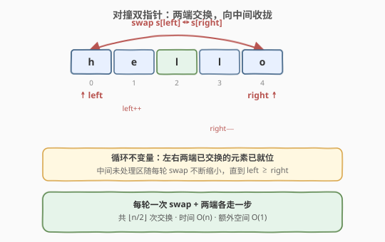
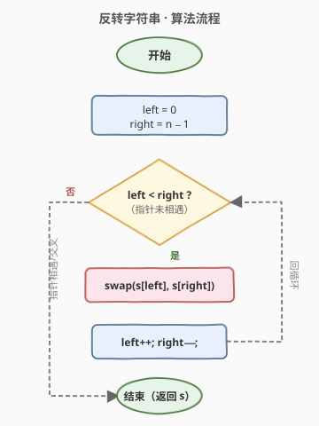
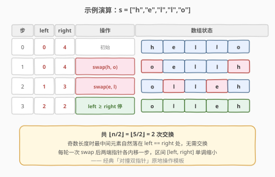

# 反转字符串

- **题目名称**：反转字符串
- **链接**：[344. 反转字符串](https://leetcode.cn/problems/reverse-string/)
- **难度**：简单
- **标签**：数组、双指针

## 1. 题目概述

编写一个函数，其作用是将输入的字符串反转过来。输入字符串以字符数组 `s` 的形式给出。

**不要**给另外的数组分配额外的空间，你必须**原地修改**输入数组、使用 $O(1)$ 的额外空间解决这一问题。

**示例 1**：

```text
输入：s = ["h","e","l","l","o"]
输出：["o","l","l","e","h"]
```

**示例 2**：

```text
输入：s = ["H","a","n","n","a","h"]
输出：["h","a","n","n","a","H"]
```

**约束条件**：

- $1 \le \text{s.length} \le 10^5$
- `s[i]` 都是 ASCII 码表中的可打印字符

> 💡 这是**对撞双指针**（Collision Two Pointers）的母题。题目虽简单，但「两端向中间收拢、原地交换」这一模板是后续一大类题目（345 反转元音、541 反转 II、557 反转单词、151 反转单词中等）的基石。面试中它常作为热身题出现，考点不在能不能写出，而在能否**一气呵成地写对边界**（`left < right` 而非 `left <= right`、原地 $O(1)$ 空间）。

---

## 2. 解题思路

### 2.1 暴力思路：开辟新数组倒序拷贝

最直白的做法是新建一个长度为 $n$ 的数组，从原数组末尾往前逐个拷贝，再写回 `s`。时间 $O(n)$、空间 $O(n)$，能通过提交但**违反题目的 $O(1)$ 空间要求**。

> ⚠️ 暴力法的问题在于「额外数组」——既然只要把序列倒过来，能否**就在原数组上**完成？关键观察：反转操作是**对称**的，第 $i$ 位与第 $n-1-i$ 位成对交换，恰好可以用两个指针从两端向中间走。

### 2.2 核心观察：对撞双指针 —— 两端交换，向中间收拢



设 `left = 0`、`right = n - 1`。每一轮：

1. 交换 `s[left]` 与 `s[right]`；
2. `left` 右移一步、`right` 左移一步；
3. 当 `left >= right` 时停止。

**循环不变量**：每轮结束后，`[0, left)` 与 `(right, n)` 这两段「已处理区」中的元素已经**互为镜像地就位**——左段是原数组右端的元素、右段是原数组左端的元素；而中间未处理区 `[left, right]` 仍是原数组的中间一段，等待继续反转。当 `left >= right` 时，未处理区缩小为空或单个元素（奇数长度时正中间那个元素无需动），整个数组完成反转。

> 💡 **为什么是 `left < right` 而非 `left <= right`？** 当 `left == right` 时两指针指向同一个元素，交换它和它自身是无意义的冗余操作（对结果无影响但多一次写入）。用 `left < right` 既正确又省一步。对偶数长度如 `n=4`，最后一轮 `left=1, right=2` 交换后 `left=2, right=1` 退出；对奇数长度如 `n=5`，`left=2, right=2` 时退出，中间元素原位不动。两种长度统一由 `left < right` 正确处理。

### 2.3 算法流程图



四步法描述：

1. **初始化**：`left = 0`，`right = n - 1`。
2. **判定**：若 `left < right`，继续；否则结束。
3. **交换**：`swap(s[left], s[right])`。
4. **推进**：`left++`，`right--`，回到第 2 步。

两个指针从两端各走一步、合计每轮推进 2 个位置，最多 $\lfloor n/2 \rfloor$ 轮即收拢相遇，总时间 $O(n)$、额外空间 $O(1)$。

### 2.4 示例演算



以 `s = ["h","e","l","l","o"]`（$n=5$）为例：

| 步 | left | right | 操作 | 数组状态 |
|----|------|-------|------|----------|
| 0  | 0    | 4     | 初始 | `[h, e, l, l, o]` |
| 1  | 0    | 4     | swap(h, o) | `[o, e, l, l, h]` |
| 2  | 1    | 3     | swap(e, l) | `[o, l, l, e, h]` |
| 3  | 2    | 2     | left ≥ right，停 | `[o, l, l, e, h]`（完成） |

共 $\lfloor 5/2 \rfloor = 2$ 次交换。奇数长度时最中间的 `'l'`（下标 2）自然落在 `left == right` 处，无需交换。

---

## 3. 参考代码

### C++

```cpp
// 反转字符串.cpp —— 对撞双指针原地交换
// 编译: g++ -O2 -std=c++17 反转字符串.cpp -o reverse_string
#include <vector>
#include <utility>
using namespace std;

class Solution {
  public:
    void reverseString(vector<char>& s) {
        int left = 0, right = (int)s.size() - 1;
        while (left < right) {
            swap(s[left], s[right]);   // 原地交换
            ++left;
            --right;
        }
    }
};
```

### Python

```python
class Solution:
    def reverseString(self, s: List[str]) -> None:
        """
        Do not return anything, modify s in-place instead.
        """
        left, right = 0, len(s) - 1
        while left < right:
            s[left], s[right] = s[right], s[left]   # Pythonic 元组解包交换
            left += 1
            right -= 1
```

> 💡 **两个实现细节**：
> 1. **C++ 用 `std::swap`**：标准库的 `swap` 对字符是 $O(1)$ 的三次赋值，无需手写 `tmp = a; a = b; b = tmp;`，更简洁且对复杂类型有移动语义优化。
> 2. **Python 用元组解包 `a, b = b, a`**：等价于「先求右值元组再赋给左值」，是 Python 原地交换的惯用法，无需临时变量。
>
> ⚠️ Python 中切忌 `s = s[::-1]` 或 `s.reverse()` 后什么都不做——前者创建新列表（空间 $O(n)$，且未修改原对象），后者虽原地但**等于直接调内置方法**，面试官会追问「手写双指针」。展示双指针写法后，可补一句「生产中用 `s.reverse()`」体现工程意识。

---

## 4. 复杂度分析

| 维度 | 复杂度 | 说明 |
|------|--------|------|
| **时间复杂度** | $O(n)$ | 每轮 `left`、`right` 各内移一步，合计每轮推进 2 个位置，最多 $\lfloor n/2 \rfloor$ 轮，总操作 $O(n)$ |
| **空间复杂度** | $O(1)$ | 仅用 `left`、`right` 两个指针变量，原地修改 `s`，无额外数组 |

> ⚠️ 题目要求 $O(1)$ 额外空间，本解法严格满足。$n \le 10^5$ 时 $O(n)$ 时间也远低于时限，无性能压力。

---

## 5. 扩展：对撞双指针模板与变体

### 5.1 模板抽象

本题是「**对撞双指针**」的最简形式：两个指针从序列两端向中间收拢，依据某种条件在两端做操作。抽象模板：

```text
left, right = 0, n - 1
while left < right:
    do_something(left, right)   # 本题是 swap；其他题是比较、判定等
    left, right = left + 1, right - 1
```

### 5.2 三大变体

| 变体 | 题目 | 与 344 的差异 |
|------|------|----------------|
| **条件交换** | [345. 反转字符串中的元音字母](https://leetcode.cn/problems/reverse-vowels-of-a-string/) | 仅当两端都是元音时才交换；指针遇非元音则单侧内移 |
| **分段反转** | [541. 反转字符串 II](https://leetcode.cn/problems/reverse-string-ii/) | 每 $2k$ 长度一段，只反转前 $k$ 个；外层按段推进，内层套 344 的反转 |
| **逐词反转** | [557. 反转字符串中的单词 III](https://leetcode.cn/problems/reverse-words-in-a-string-iii/) | 对每个单词单独套 344 的反转，单词间空格保留 |

更深一层，[151. 反转字符串中的单词](../0101-0200/151_反转字符串中的单词.md)（中等）的 $O(1)$ 空间解法正是「**整体反转 + 逐词反转**」两步套用 344：先整体反转字符数组，再对每个单词单独反转，即得单词顺序反转而单词内部顺序不变。这是 344 作为「原子操作」被组合使用的典型例子。

### 5.3 与其他双指针的关系

| 双指针类型 | 方向 | 代表题 | 适用场景 |
|------------|------|--------|----------|
| **对撞双指针**（本题） | 两端 → 中间 | 344、[11. 盛最多水的容器](../0001-0100/11_盛最多水的容器.md)、[977. 有序数组的平方](../0901-1000/977_有序数组的平方.md) | 序列对称性、两端取极值 |
| **快慢双指针** | 同向不同速 | [27. 移除元素](../0001-0100/27_移除元素.md)、[141. 环形链表](../0101-0200/141_环形链表.md) | 原地覆盖、判环 |
| **归并双指针** | 各扫各的 | [88. 合并两个有序数组](../0001-0100/88_合并两个有序数组.md) | 两个有序序列合并 |

> 💡 **面试策略**：344 是双指针家族的**入门敲门砖**。讲清「对撞」这一方向特征后，自然延伸到 11（对撞+贪心）、977（对撞+反向填）和 345/541/557（条件/分段变体），展示对模板的举一反三能力。

---

## 6. 面试要点

1. **为什么用 `left < right` 而非 `left <= right`？**

   - `left == right` 时两指针指向同一元素，交换它和自身是冗余的（对结果无影响但多一次写入）。`left < right` 既正确又省一步：偶数长度最后一轮交换最内一对后 `left` 越过 `right` 退出；奇数长度正中间元素在 `left == right` 时退出、原位不动。两种长度统一被 `left < right` 正确处理。

2. **为什么是原地 $O(1)$ 空间，而非新建数组？**

   - 反转操作天然对称：第 $i$ 位与第 $n-1-i$ 位成对交换。只需两个指针在原数组上从两端向中间走、逐对 swap，无需任何额外存储。新数组法虽时间同为 $O(n)$ 但空间 $O(n)$，违反题目明确要求，且未利用对称性这一结构性质。

3. **Python 的 `s = s[::-1]` 为什么不算正确解？**

   - `s[::-1]` 创建一个**新列表**再绑定给局部变量 `s`，既未原地修改外层传入的列表对象（调用方看不到变化），又用了 $O(n)$ 额外空间。题目要求修改原数组、$O(1)$ 空间，必须用 `s[left], s[right] = s[right], s[left]` 这种**对原列表下标赋值**的方式。`s.reverse()` 虽原地正确但等于直接调内置方法，面试时应主动手写双指针。

4. **`std::swap` 在 C++ 中是否引入额外开销？**

   - 对 `char` 等基本类型，`std::swap` 内联展开为三次赋值（`tmp = a; a = b; b = tmp;`），编译器优化后与手写无差异，无函数调用开销。对复杂类型（如 `std::string`）则走移动语义，比手写拷贝更高效。生产代码中应优先用 `std::swap` 而非手写三行。

5. **这道题的「对撞双指针」模板能迁移到哪些题？**

   - 一切「序列两端向中间收拢、依据对称性做操作」的场景：[345. 反转元音](https://leetcode.cn/problems/reverse-vowels-of-a-string/)（条件交换）、[11. 盛最多水的容器](../0001-0100/11_盛最多水的容器.md)（对撞+贪心移动短边）、[977. 有序数组的平方](../0901-1000/977_有序数组的平方.md)（两端取大填末尾）、[151. 反转字符串中的单词](../0101-0200/151_反转字符串中的单词.md)（整体反转+逐词反转组合）。核心都是「两端指针 + 单调收拢」。

> 💡 **一句话总结**：344 是「对撞双指针」的母题——`left=0, right=n-1`，每轮 `swap` 后两端各内移一步，`left < right` 时继续。$O(n)$ 时间、$O(1)$ 空间原地完成。这个 swap 收拢模板是 345/541/557/151 等一整族反转题的原子操作，务必一气呵成写对边界。

---

## 7. 同类练习题

- [345. 反转字符串中的元音字母](https://leetcode.cn/problems/reverse-vowels-of-a-string/)：同款对撞双指针，仅当两端都是元音时才交换，遇非元音单侧内移
- [541. 反转字符串 II](https://leetcode.cn/problems/reverse-string-ii/)：每 $2k$ 长度一段反转前 $k$ 个，外层按段推进，内层套 344 反转
- [557. 反转字符串中的单词 III](https://leetcode.cn/problems/reverse-words-in-a-string-iii/)：对每个单词单独套 344 反转，空格保留
- [151. 反转字符串中的单词](https://leetcode.cn/problems/reverse-words-in-a-string/)（[题解](../0101-0200/151_反转字符串中的单词.md)）：$O(1)$ 空间解法 = 整体反转 + 逐词反转，两步组合 344
- [11. 盛最多水的容器](https://leetcode.cn/problems/container-with-most-water/)（[题解](../0001-0100/11_盛最多水的容器.md)）：对撞双指针 + 贪心移动短边，与 344 共享「两端向中间收拢」的方向特征
