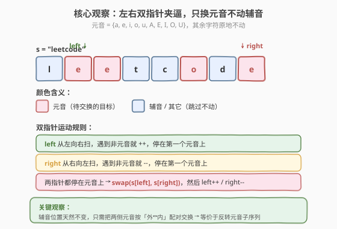
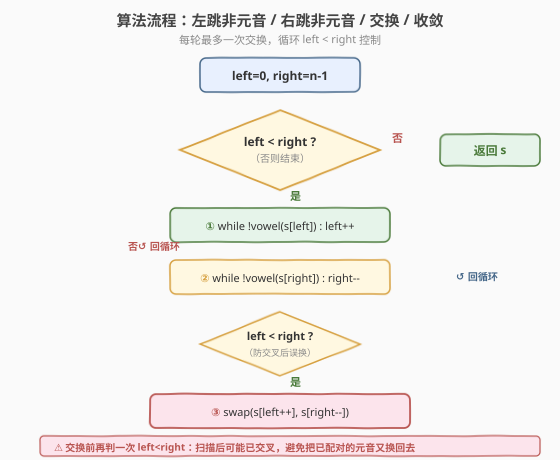
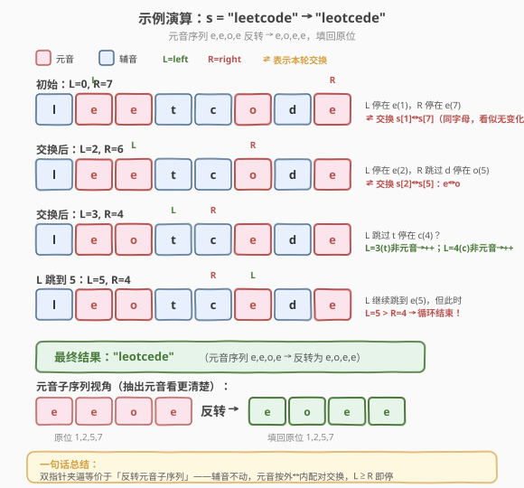

# 反转字符串中的元音字母

- **题目名称**：反转字符串中的元音字母
- **链接**：[345. 反转字符串中的元音字母](https://leetcode.cn/problems/reverse-vowels-of-a-string/)
- **难度**：简单
- **标签**：双指针、字符串

## 1. 题目概述

给你一个字符串 `s`，仅**反转字符串中的所有元音字母**，并返回结果字符串。元音字母包括 `'a'`、`'e'`、`'i'`、`'o'`、`'u'`（大小写均算）。其余字符（辅音、符号等）保持原位不变。

**示例 1**：

```text
输入：s = "hello"
输出："holle"
```

**示例 2**：

```text
输入：s = "leetcode"
输出："leotcede"
```

**约束条件**：

- $1 \le \text{s.length} \le 3 \times 10^5$
- `s` 由 **可打印 ASCII 字符**组成

> 💡 这是 [344. 反转字符串](https://leetcode.cn/problems/reverse-string/) 的「条件版」：344 反转整个字符数组，本题只反转其中的元音。两者共用同一套左右双指针模板，差异仅在「交换前需先判定是否元音」。可以理解为「在元音子序列上做 344」。

---

## 2. 解题思路

### 2.1 暴力思路：抽出元音再填回

最直白的做法分两步：

1. 扫一遍 `s`，把所有元音按出现顺序收集到列表 `vows`；
2. 反转 `vows`，再扫一遍 `s`，遇到元音位置就填入 `vows` 的下一个元素。

```text
vows = [c for c in s if isVowel(c)]      // 正序收集
vows.reverse()                            // 反转
i = 0
for j in range(len(s)):
    if isVowel(s[j]):
        s[j] = vows[i]; i += 1
```

时间 $O(n)$，空间 $O(n)$（`vows` 最坏存满 `n` 个字符）。能 AC，但**多用了 $O(n)$ 额外空间**——而反转本质是「两两配对交换」，完全可以原地完成。

> ⚠️ 暴力法的问题在于：把元音**搬出来**再**填回去」，多了一次拷贝和一个 $O(n)$ 的缓冲区。但「反转」这个操作本身只需要「外↔内」两两交换，无需整体搬运——这是双指针出场的时机。

### 2.2 核心观察：左右双指针原地交换



**关键观察**：反转元音 = 把元音子序列「外↔内」两两配对交换。这和 [344. 反转字符串](https://leetcode.cn/problems/reverse-string/) 的整体反转**完全同构**，只是「待交换位置」从「所有位置」缩小到「元音位置」。

于是沿用 344 的左右双指针模板，**只在「找下一个待交换位置」时多加一层元音判定**：

- `left` 从 `0` 出发向右，**跳过所有非元音**，停在第一个元音上；
- `right` 从 `n-1` 出发向左，**跳过所有非元音**，停在第一个元音上；
- 两者都停住后，`swap(s[left], s[right])`，再 `left++`、`right--` 收敛；
- 当 `left >= right` 时结束。

辅音在「跳过」阶段被原封不动掠过，天然保持原位——**额外空间 $O(1)$**。

> 💡 **关键转化**：判定元音用一个集合 `{'a','e','i','o','u','A','E','I','O','U'}` 即可 $O(1)$ 判定。大小写都要算——题目明确「元音字母包括小写和大写」。常见坑是只判小写漏了大写，导致 `'A'`、`'E'` 等不反转而 WA。

### 2.3 算法流程图



算法是**「扫描—判定—交换」三段循环**：

1. **初始化**：`left = 0`，`right = n - 1`。
2. **循环条件**：`left < right`（指针未相遇）。
3. **步骤①**：`while left < right && !isVowel(s[left]) : left++`——左指针跳过非元音。
4. **步骤②**：`while left < right && !isVowel(s[right]) : right--`——右指针跳过非元音。
5. **二次判定**：再确认 `left < right`（扫描后可能已交叉）。
6. **步骤③**：`swap(s[left], s[right])`，然后 `left++`、`right--`。
7. 回到步骤 2，直到 `left >= right` 结束。

> ⚠️ **两个边界细节**：
>
> - **内层 while 必须带 `left < right` 防越界**：若 `s` 全是辅音（如 `"bcdf"`），不带边界判定会一直 `++`/`--` 到越界。带上后 `left`、`right` 相遇即停，安全。
> - **交换前再判一次 `left < right`**：两个内层 while 结束后，`left` 和 `right` 可能已经交叉（如 `"ae"` 第一轮就换完，第二轮 `left=1, right=0`）。此时不能再换，否则会把刚换好的元音又换回去。

### 2.4 示例演算

以 `s = "leetcode"` 为例，逐步跟踪 `left`、`right` 的运动：



| 阶段 | left | right | 动作 | s 状态 |
|------|------|-------|------|--------|
| 初始 | 0→1 | 7 | L 跳过 `l` 停在 `e(1)`；R 停在 `e(7)` | `"leetcode"` |
| 第 1 次交换 | 1 | 7 | `swap(s[1], s[7])`：`e↔e`（同字母，看似无变化） | `"leetcode"` |
| 推进 | 2 | 6 | `left++→2`，`right--→6` | `"leetcode"` |
| 扫描 | 2 | 6→5 | L 停在 `e(2)`；R 跳过 `d` 停在 `o(5)` | `"leetcode"` |
| 第 2 次交换 | 2 | 5 | `swap(s[2], s[5])`：`e↔o` | `"leotcede"` |
| 推进 | 3 | 4 | `left++→3`，`right--→4` | `"leotcede"` |
| 扫描 | 3→4→5 | 4 | L 跳过 `t(3)`、`c(4)` 停在 `e(5)`；R 停在 `c(4)` | `"leotcede"` |
| 收敛 | 5 | 4 | `left > right` → 循环结束 | `"leotcede"` ✅ |

**元音子序列视角**：原串元音按位抽出来是 `[e, e, o, e]`（位 1,2,5,7），反转后是 `[e, o, e, e]`，填回原位即得 `"leotcede"`。双指针的「外↔内配对交换」与「反转元音子序列」**完全等价**。

> 💡 第 1 次交换 `e↔e` 看似多余，但这是算法统一处理的必然——双指针不关心两个元音是否相同，只关心「都是元音就换」。这种「无脑统一」正是模板的力量：不需要为「同字母」加特判分支。

---

## 3. 参考代码

### C++

```cpp
class Solution {
  public:
    string reverseVowels(string s) {
        auto isVowel = [](char c) {
            static const string vows = "aeiouAEIOU";
            return vows.find(c) != string::npos;
        };
        int left = 0, right = (int)s.size() - 1;
        while (left < right) {
            while (left < right && !isVowel(s[left])) left++;
            while (left < right && !isVowel(s[right])) right--;
            if (left < right) {
                swap(s[left], s[right]);
                left++;
                right--;
            }
        }
        return s;
    }
};
```

### Python

```python
class Solution:
    def reverseVowels(self, s: str) -> str:
        vows = set("aeiouAEIOU")
        lst = list(s)
        left, right = 0, len(lst) - 1
        while left < right:
            while left < right and lst[left] not in vows:
                left += 1
            while left < right and lst[right] not in vows:
                right -= 1
            if left < right:
                lst[left], lst[right] = lst[right], lst[left]
                left += 1
                right -= 1
        return "".join(lst)
```

> 💡 **实现细节**：
>
> - **C++** 中 `string` 可下标修改，直接 `swap(s[left], s[right])` 原地完成。`isVowel` 用 `string::find` 简洁但每次 $O(10)$；高频场景可换成 `unordered_set<char>` 或查表（见 5.1）。
> - **Python** 中 `str` 不可变，需先 `list(s)` 转成字符数组，最后 `"".join(lst)` 拼回。元音集合用 `set` 保证 $O(1)$ 查找。
> - 两版逻辑完全一致：内层 while 带 `left < right` 防越界，交换前 `if (left < right)` 防交叉后误换。

---

## 4. 复杂度分析

| 维度 | 双指针法 | 暴力抽出再填回 |
|------|---------|----------------|
| **时间复杂度** | $O(n)$ | $O(n)$ |
| **空间复杂度** | $O(1)$（原地修改 + 元音集合 $O(1)$） | $O(n)$（元音缓冲区） |
| **修改方式** | 原地交换 | 拷出再填回 |

> ⚠️ 双指针法的时间是 $O(n)$：`left` 全程只向右走，`right` 全程只向左走，两指针合计最多扫过 $n$ 个字符。每个字符至多被「跳过判定」一次或「交换」一次，没有回溯。元音集合大小固定 10，`isVowel` 是 $O(1)$。

---

## 5. 扩展：元音判定的多种写法

### 5.1 查表法（最快）

用长度 128 的布尔数组（覆盖 ASCII）直接查表，避免 `find` / `set` 的查找开销：

```cpp
class Solution {
  public:
    string reverseVowels(string s) {
        bool isVow[128] = {};
        for (char c : string("aeiouAEIOU")) isVow[(int)c] = true;
        int left = 0, right = (int)s.size() - 1;
        while (left < right) {
            while (left < right && !isVow[(int)s[left]]) left++;
            while (left < right && !isVow[(int)s[right]]) right--;
            if (left < right) {
                swap(s[left], s[right]);
                left++;
                right--;
            }
        }
        return s;
    }
};
```

> 💡 查表法 `isVow[(int)c]` 是 $O(1)$ 的数组下标访问，比 `string::find`（$O(10)$）和 `unordered_set`（哈希开销）都快。在 $n = 3 \times 10^5$ 量级下差异可见。竞赛中首选此写法。

### 5.2 位运算判定（炫技）

元音字符的 ASCII 码有一定规律，可用位运算压缩判定——但可读性差，**面试不推荐**：

```cpp
bool isVowel(char c) {
    c |= 0x20;                      // 转小写（仅对字母有效）
    return c == 'a' || c == 'e' || c == 'i' || c == 'o' || c == 'u';
}
```

> ⚠️ `c |= 0x20` 利用「大小写 ASCII 仅差第 5 位（0x20）」把大写转小写，再统一判小写。比查表少一次数组访问，但牺牲可读性。仅当确认输入都是字母时才安全；本题 `s` 含任意可打印 ASCII，`'|= 0x20'` 会把非字母字符也改成别的值（如 `'.'` (0x2e) → 0x2e | 0x20 = 0x2e = `'.'`，恰好不影响；但 `'@'` (0x40) → 0x60 = `'`'`，需确认不在元音集）。**稳妥起见用查表法**。

### 5.3 各写法对比

| 写法 | `isVowel` 复杂度 | 可读性 | 适用场景 |
|------|------------------|--------|---------|
| `string::find` | $O(10)$ | 好 | C++ 简洁写法，面试够用 |
| `unordered_set` | $O(1)$（哈希） | 好 | Python / 通用 |
| 查表法（bool[128]） | $O(1)$（下标） | 中 | 竞赛追求极致性能 |
| 位运算 `c\|=0x20` | $O(1)$ | 差 | 炫技，面试不推荐 |

---

## 6. 面试要点

1. **为什么用双指针而不是「抽出元音再填回」？**

   - 「反转」本质是「外↔内两两配对交换」，无需整体搬运。双指针原地完成，空间 $O(1)$。
   - 暴力法多一个 $O(n)$ 缓冲区，且要扫两遍（抽出一遍、填回一遍）；双指针只扫一遍，常数更小。
   - 这是 [344. 反转字符串](https://leetcode.cn/problems/reverse-string/) 模板的直接迁移——把「所有位置」缩小到「元音位置」即可。

2. **内层 while 为什么要带 `left < right`？**

   - 防止全辅音串（如 `"bcdf"`）越界：不带的话 `left` 会一直 `++` 到 `n`，`right` 一直 `--` 到 `-1`。
   - 带上后指针相遇即停，安全。这是「带边界的扫描 while」的通用写法，凡是在循环内移动指针都要带终止条件。

3. **交换前为什么还要再判一次 `left < right`？**

   - 两个内层 while 结束后，`left` 和 `right` 可能已经交叉。例如 `"ae"`：第一轮 `left=0, right=1` 交换后 `left=1, right=0`；第二轮内层 while 都不进入（`left < right` 为假），但若没有外层 `if (left < right)` 保护就直接 `swap`，会把刚换好的 `ea` 又换回 `ae`。
   - 这一层 `if` 是「防交叉后误换」的最后一道闸门，**不可省略**。

4. **元音集合为什么大小写都要包含？**

   - 题目明确「元音字母包括 `'a','e','i','o','u'`」且「大小写均算」。只判小写会漏掉 `'A','E','I','O','U'`，导致大写元音不反转而 WA。
   - 常见坑：测试用例含 `"aA"`，正确输出 `"Aa"`（两个元音交换），漏判大写会输出 `"aA"`（不变）。

5. **本题与 [344. 反转字符串](https://leetcode.cn/problems/reverse-string/) 的关系？**

   - 344 反转**整个**字符数组，`left`、`right` 直接交换，无需判定。
   - 345 反转**元音子序列**，交换前需先「跳过非元音」定位到元音位置。
   - 两者共用同一套左右双指针模板，345 是 344 的「条件版」。掌握 344 的模板后，345 只需加一层 `isVowel` 判定。

> 💡 **一句话总结**：345 = 344 的左右双指针模板 + 元音判定。`left`/`right` 跳过非元音停在元音上，交换后收敛，`left >= right` 即停。原地 $O(n)/O(1)$，是双指针「条件反转」的招牌题。

---

## 7. 同类练习题

- [344. 反转字符串](https://leetcode.cn/problems/reverse-string/)：本题的母题，整体反转字符数组，无元音判定，纯左右双指针交换
- [125. 验证回文串](https://leetcode.cn/problems/valid-palindrome/)：左右双指针 + 跳过非字母数字，与本题「跳过非元音」同构，只是跳过规则不同
- [917. 仅仅反转字母](https://leetcode.cn/problems/reverse-only-letters/)：左右双指针 + 跳过非字母，本题的「跳过规则」换成 `isalpha` 即可
- [541. 反转字符串 II](https://leetcode.cn/problems/reverse-string-ii/)：在 344 基础上加分段规则（每 $2k$ 个反转前 $k$ 个），双指针 + 区间控制
- [11. 盛最多水的容器](https://leetcode.cn/problems/container-with-most-water/)（[题解](../0001-0100/11_盛最多水的容器.md)）：左右双指针夹逼求最值，与本题同指针结构但目标不同（求最大面积而非交换）
