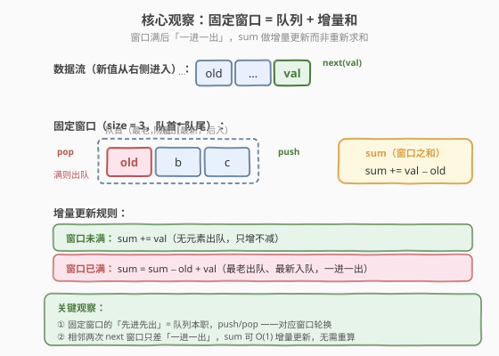
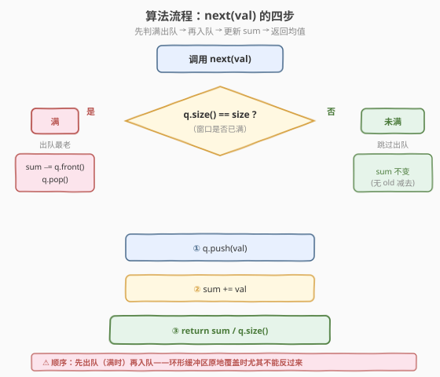
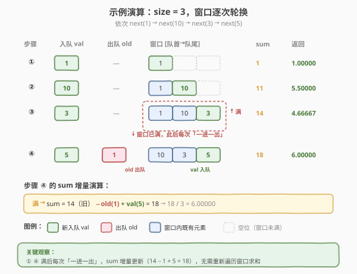

# 数据流中的移动平均值

- **题目名称**：数据流中的移动平均值
- **链接**：[346. 数据流中的移动平均值](https://leetcode.cn/problems/moving-average-from-data-stream/)
- **难度**：简单
- **标签**：队列、设计、滑动窗口、环形数组

## 1. 题目概述

给定一个整数数据流和一个窗口大小 `size`，请实现一个类 `MovingAverage`，能够计算**滑动窗口中所有整数的移动平均值**。

滑动窗口包含最近 `size` 个被加入数据流的整数；当数据流中的整数数量不足 `size` 个时，窗口包含**当前所有**整数。每次调用 `next(val)` 会把 `val` 加入数据流，并返回**当前窗口内所有整数的平均值**。

**接口**：

- `MovingAverage(int size)`：用窗口大小 `size` 初始化对象。
- `double next(int val)`：将 `val` 加入数据流，返回当前窗口内整数的移动平均值。

**示例 1**：

```text
输入：
  MovingAverage m = new MovingAverage(3);
  m.next(1);     // 返回 1.00000  = 1 / 1
  m.next(10);    // 返回 5.50000  = (1 + 10) / 2
  m.next(3);     // 返回 4.66667  = (1 + 10 + 3) / 3
  m.next(5);     // 返回 6.00000  = (10 + 3 + 5) / 3   ← 1 已滑出窗口
```

**约束条件**：

- $1 \le \text{size} \le 1000$
- $-10^4 \le \text{val} \le 10^4$
- 最多调用 `next` 方法 $10^4$ 次

> 💡 这是「**固定大小滑动窗口**」最直白的设计题：窗口大小一旦确定就不再变化，元素**先进先出**（FIFO），与队列的语义天然吻合。它也是 [239. 滑动窗口最大值](https://leetcode.cn/problems/sliding-window-maximum/) 的「退化版」——239 要维护窗口内的最值（单调队列），而本题只需维护窗口内的**和**（普通队列 + 一个 `sum` 变量即可），所以简单得多。

---

## 2. 解题思路

### 2.1 暴力思路：每次重新求和

最直白的做法：用一个数组 `data` 存下所有加入过的值，每次 `next(val)` 时：

1. `data.append(val)`；
2. 取最后 `min(size, len(data))` 个元素求和、除以个数。

```text
next(val):
    data.append(val)
    k = min(size, len(data))
    return sum(data[-k:]) / k      ← 每次重新求和
```

时间 $O(\text{size})$ 每次（最坏要加 `size` 个数），空间 $O(n)$（$n$ 是历史调用总数，全部缓存）。能过，但有两个明显浪费：

- **重复求和**：相邻两次 `next` 的窗口只差一个元素（老的出去、新的进来），却从头加了一遍；
- **无限缓存**：历史数据早已滑出窗口、对当前平均值毫无贡献，却还留在 `data` 里吃内存。

> ⚠️ 暴力法的问题在于：把「窗口」当成「整个历史」的尾段，每次都从历史里截一段重新算——既忽略了窗口元素的**轮换规律**，也浪费了前一次算过的中间结果。这正是「维护一个不变量」出场的时机。

### 2.2 核心观察：队列 + 增量和



**关键观察**：固定大小滑动窗口里，相邻两次 `next` 的窗口**只差两个元素**——新值 `val` 进来、最老的值 `old` 出去。因此不必重新求和，只需在原来的 `sum` 上做**增量更新**：

$$\text{sum}_{\text{new}} = \text{sum}_{\text{old}} + \text{val} - \text{old}$$

（窗口未满时 `old = 0`，即不减。）

而「先进先出、最老的先出去」正是**队列**的本职工作：`val` 从队尾入队，窗口满时队首出队。配一个 `sum` 变量记录当前窗口内所有元素之和，`next` 操作就能做到 $O(1)$。

> 💡 **为什么队列天然适配？** 固定窗口的语义是「最近 `size` 个」，而队列的语义是「先进先出」——最先进来的就是最老的，最先出队。两者一一对应：入队 = 新值进入窗口，出队 = 老值离开窗口。`sum` 则是窗口内容的「浓缩状态」，避免了每次重新遍历队列求和。这是「**用一个变量维护可增量计算的聚合量**」的经典套路，与 [303. 区域和检索](../0301-0400/303_区域和检索 - 数组不可变.md) 的前缀和思路一脉相承——都是用预处理/状态避免重复求和。

### 2.3 算法流程图



`next(val)` 的步骤拆解：

1. **判满**：若 `queue.size() == size`，说明窗口已满，需先把最老的元素请出去——`old = queue.front(); queue.pop(); sum -= old`。
2. **入队**：`queue.push(val); sum += val`。
3. **返回**：`return sum / queue.size()`。

窗口未满时跳过步骤 1，`sum` 只增不减；窗口满后每次「一进一出」，`sum` 做增量更新。`queue.size()` 始终等于当前窗口内元素个数，分母自然正确。

> ⚠️ **顺序细节**：必须**先判满出队、再入队**，不能反过来。若先入队再出队，队会瞬时膨胀到 `size+1`，虽然结果算对但中间状态不符合「窗口最多 `size` 个」的语义。更隐蔽的坑是：若用环形缓冲区（见第 5 节）做原地覆盖，先写后读会把刚写入的新值当成 `old` 减掉——逻辑直接错。养成「先出后入」的顺序习惯，两种实现都不会踩坑。

### 2.4 示例演算

以 `size = 3`，依次调用 `next(1), next(10), next(3), next(5)` 为例，逐步跟踪窗口、`sum` 与返回值：



| 步骤 | 操作 | 入队 val | 出队 old | 窗口（队首→队尾） | sum | size() | 返回值 |
|------|------|---------|---------|-------------------|-----|--------|--------|
| ① | `next(1)` | 1 | —（未满） | [1] | 1 | 1 | 1.00000 |
| ② | `next(10)` | 10 | —（未满） | [1, 10] | 11 | 2 | 5.50000 |
| ③ | `next(3)` | 3 | —（未满） | [1, 10, 3] | 14 | 3 | 4.66667 |
| ④ | `next(5)` | 5 | 1（满则出） | [10, 3, 5] | 18 | 3 | 6.00000 |

关键看步骤 ④：窗口已满，`1` 作为最老元素出队，`sum` 先减 `1` 得 `13`，再入队 `5` 加 `5` 得 `18`。最终窗口 `[10, 3, 5]` 的平均值 $18 / 3 = 6.0$，与示例完全一致。

> 💡 观察分母的变化：①② 时窗口未满，分母是当前元素个数（1、2）；③ 起窗口满，分母恒为 `size=3`。这就是「窗口未满用实际个数、窗口满后用 `size`」的统一处理——`queue.size()` 在两种情形下都自然正确，无需特判分母。

---

## 3. 参考代码

### C++

```cpp
class MovingAverage {
    queue<int> q;
    int size;
    double sum = 0.0;

  public:
    MovingAverage(int size) : size(size) {}

    double next(int val) {
        if ((int)q.size() == size) {   // 窗口已满 → 先出队最老的
            sum -= q.front();
            q.pop();
        }
        q.push(val);                   // 再入队新值
        sum += val;
        return sum / q.size();
    }
};
```

### Python

```python
class MovingAverage:
    def __init__(self, size: int):
        self.q = collections.deque()
        self.size = size
        self.sum = 0.0

    def next(self, val: int) -> float:
        if len(self.q) == self.size:   # 窗口已满 → 先出队最老的
            self.sum -= self.q.popleft()
        self.q.append(val)             # 再入队新值
        self.sum += val
        return self.sum / len(self.q)
```

> 💡 **实现细节**：
>
> - **C++** 用 `std::queue<int>`，`front()` 看队首、`pop()` 出队、`push()` 入队，三件套都是 $O(1)$。`sum` 用 `double` 避免 int 除法截断。
> - **Python** 用 `collections.deque` 而非 `list`——`list.pop(0)` 是 $O(n)$（要整体前移），而 `deque.popleft()` 是 $O(1)$。这是 Python 实现队列的**必备姿势**，凡是用到「队首频繁出队」都该上 `deque`。
> - 两版逻辑完全一致：判满 → 出队减 `sum` → 入队加 `sum` → 返回 `sum / size()`。`sum` 在整个生命周期里始终等于当前队列内所有元素之和，这是算法正确性的**不变量**（invariant）。

---

## 4. 复杂度分析

| 维度 | 队列 + 增量和 | 暴力重求和 |
|------|--------------|-----------|
| **时间（单次 next）** | $O(1)$ | $O(\text{size})$ |
| **空间** | $O(\text{size})$（只存窗口内元素） | $O(n)$（$n$ = 历史调用总数） |
| **每次加法次数** | 1 次加 + 1 次减（满后）或 1 次加（未满） | 最多 `size` 次加 |

> ⚠️ 队列法的 $O(1)$ 是**严格**的，不靠摊还：`push`、`pop`、`front`、`sum += / -=` 都是单次 $O(1)$ 操作。与 [232. 用栈实现队列](../0201-0300/232_用栈实现队列.md) 的「摊还 $O(1)$」不同——那里倒栈偶发 $O(n)$ 靠势能法均摊，这里完全没有偶发大操作。空间上只缓存窗口内的 `size` 个元素，历史数据出队即释放，远优于暴力的 $O(n)$ 全量缓存。

---

## 5. 扩展：环形缓冲区 —— O(1) 严格 + 零动态分配

### 5.1 思路

队列法虽好，但 `std::queue`（底层 `deque`）和 `collections.deque` 都涉及**动态内存分配**——元素进出时偶尔要扩容/搬移。若追求极致性能（如高频交易、嵌入式实时流），可以用**固定大小数组 + 游标**实现**环形缓冲区**（circular buffer）：

- 预分配长度为 `size` 的数组 `buf`；
- 用一个游标 `p` 指向「下一个写入位置」，写完 `p = (p + 1) % size` 循环前进；
- 用 `count` 记录当前窗口内元素个数（未满时递增，满后恒为 `size`）；
- `sum` 同样增量更新：满后写入前先 `sum -= buf[p]`（`buf[p]` 就是最老元素，因为游标循环一圈正好回到它）。

> 💡 **为什么 `buf[p]` 恰好是最老的？** 游标 `p` 每次写入后前进一格，写满一圈后 `p` 回到起点，此时 `buf[p]` 存的正是**最早写入**的那个值（一圈前写的）。下一次写入会覆盖它——而它也恰好是当前窗口里最老的、该被挤出去的那个。游标的循环性与窗口的轮换性完美对齐，无需额外维护队首指针。

### 5.2 代码

```cpp
class MovingAverage {
    vector<int> buf;
    int p = 0, count = 0, size;
    double sum = 0.0;

  public:
    MovingAverage(int size) : buf(size), size(size) {}

    double next(int val) {
        if (count < size) {
            count++;                  // 窗口未满：只增 count，不减 sum
        } else {
            sum -= buf[p];            // 窗口已满：先减最老（buf[p] 即将被覆盖）
        }
        buf[p] = val;                 // 覆盖最老位置 / 写入空位
        sum += val;
        p = (p + 1) % size;           // 游标循环前进
        return sum / count;
    }
};
```

**Python 版**（用 `list` 预分配，避免 `deque` 的动态开销）：

```python
class MovingAverage:
    def __init__(self, size: int):
        self.buf = [0] * size
        self.size = size
        self.p = 0
        self.count = 0
        self.sum = 0.0

    def next(self, val: int) -> float:
        if self.count < self.size:
            self.count += 1
        else:
            self.sum -= self.buf[self.p]
        self.buf[self.p] = val
        self.sum += val
        self.p = (self.p + 1) % self.size
        return self.sum / self.count
```

### 5.3 三种实现对比

| 实现 | 单次 next 时间 | 空间 | 动态分配 | 适用场景 |
|------|---------------|------|---------|---------|
| 队列 + 增量和 | $O(1)$ 严格 | $O(\text{size})$ | 有（偶发扩容） | 通用，代码最简洁 |
| 环形缓冲区 | $O(1)$ 严格 | $O(\text{size})$ | 无（一次性预分配） | 高频流、嵌入式、内存敏感 |
| 暴力重求和 | $O(\text{size})$ | $O(n)$ | 有 | 不推荐 |

> ⚠️ **面试策略**：先讲队列法（最直观、最快写对），再追问「能否避免动态分配 / 极致性能」时亮环形缓冲区。两者复杂度同为 $O(1)/O(\text{size})$，但环形缓冲区展示了「用空间换确定性、用游标代替指针链」的工程思维，是加分项。注意环形缓冲区的 `count` 分支判断（未满只增不减、满后先减后写）是易错点，写完用示例 ④ 验证一遍最稳。

---

## 6. 面试要点

1. **为什么用队列而不是数组 + 偏移？**

   - 固定窗口的核心操作是「先进先出」：最老的先出去、最新的从另一端进来。这正是队列的本职语义，`push`/`pop`/`front` 三件套直接对应，代码无需手动维护偏移或下标。
   - 数组 + 偏移也能做（环形缓冲区就是），但要自己管游标循环和「最老位置」的定位，心智负担更大。队列把这部分复杂性封装掉了，是**首选实现**。环形缓冲区是「优化版」，在需要严格 $O(1)$ 且零动态分配时才登场。

2. **`sum` 变量的作用是什么？为什么不能每次重新求和？**

   - `sum` 是窗口内所有元素之和的**缓存状态**。相邻两次 `next` 的窗口只差一个进、一个出，用 `sum += val - old` 做 $O(1)$ 增量更新，比每次 $O(\text{size})$ 遍历队列求和快得多。
   - 这是「**可增量计算的聚合量**」通用套路：凡是聚合（和、积、最值、计数）且其变化可由「进出元素」增量表达，都该维护一个状态变量而非重算。对比 [303. 区域和检索](../0301-0400/303_区域和检索 - 数组不可变.md) 的前缀和——那里用预处理避免区间求和的 $O(n)$，这里用增量更新避免窗口求和的 $O(\text{size})$，思想同源。

3. **窗口未满时 `sum` 和分母分别怎么处理？**

   - `sum`：未满时只 `+= val`、不 `-= old`（因为没有元素被挤出去）。
   - 分母：用 `queue.size()`（即当前实际元素个数），而非固定 `size`。这样窗口从 1 个元素逐步长到 `size` 个时，分母自然从 1 长到 `size`，平均值始终正确。满后 `queue.size() == size` 恒成立，分母稳定。
   - 环形缓冲区里用 `count` 替代 `queue.size()`，逻辑一致：未满时 `count` 递增，满后恒为 `size`。

4. **环形缓冲区为什么 `buf[p]` 恰好是最老元素？**

   - 游标 `p` 每写一格前进一格，写满一圈后回到起点。此时 `buf[p]` 存的是**一圈前**写入的值——而它也正好是当前窗口里最老的、该被覆盖挤出去的那个。游标的循环周期 = 窗口大小，天然对齐「最老位置」。
   - 这个性质依赖 `p = (p + 1) % size` 的严格循环前进，**不能**跳过或重置 `p`。一旦中途重置游标，循环对应关系就乱了。

5. **本题与 [239. 滑动窗口最大值](https://leetcode.cn/problems/sliding-window-maximum/) 的关系？**

   - 两者都是「固定大小滑动窗口」设计题，窗口轮换机制完全相同（一进一出、先进先出）。
   - 差异在**维护的聚合量**：346 维护**和**（普通队列 + `sum` 即可，$O(1)$）；239 维护**最值**（最值无法用单变量增量更新——出去的可能是最值、也可能是非最值，必须用**单调队列**保留候选，$O(n)$ 均摊）。
   - 掌握 346 的「窗口轮换 + 状态变量」骨架后，239 只需把「状态变量」升级为「单调队列」——这是从「可增量聚合」到「不可增量聚合」的自然进阶。

> 💡 **一句话总结**：346 = 固定窗口 + 队列 + 增量和。窗口满时 `sum += val - old`，未满时 `sum += val`，分母用 `queue.size()` 自然适配。$O(1)/O(\text{size})$，是「维护可增量聚合量」的最简范例，也是通向 239 单调队列窗口题的入门台阶。

---

## 7. 同类练习题

- [239. 滑动窗口最大值](https://leetcode.cn/problems/sliding-window-maximum/)（[题解](../0201-0300/239_滑动窗口最大值.md)）：同为固定大小滑动窗口，但维护最值需单调队列，是 346 的进阶版
- [232. 用栈实现队列](https://leetcode.cn/problems/implement-queue-using-stacks/)（[题解](../0201-0300/232_用栈实现队列.md)）：队列设计题的母模板，双栈倒换实现 FIFO，与 346 共享「队列语义 + 不变量」思维
- [303. 区域和检索 - 数组不可变](https://leetcode.cn/problems/range-sum-query-immutable/)（[题解](../0301-0400/303_区域和检索 - 数组不可变.md)）：同样用预处理/状态避免重复求和，前缀和思想与 346 的 `sum` 缓存同源
- [341. 扁平化嵌套列表迭代器](https://leetcode.cn/problems/flatten-nested-list-iterator/)（[题解](../0301-0400/341_扁平化嵌套列表迭代器.md)）：另一道「设计 + 队列/栈」题，体会不同数据结构在设计题中的选型
- [622. 设计循环队列](https://leetcode.cn/problems/design-circular-queue/)：环形缓冲区的直接应用，本题第 5 节扩展的母题，体会游标循环与窗口轮换的对齐
