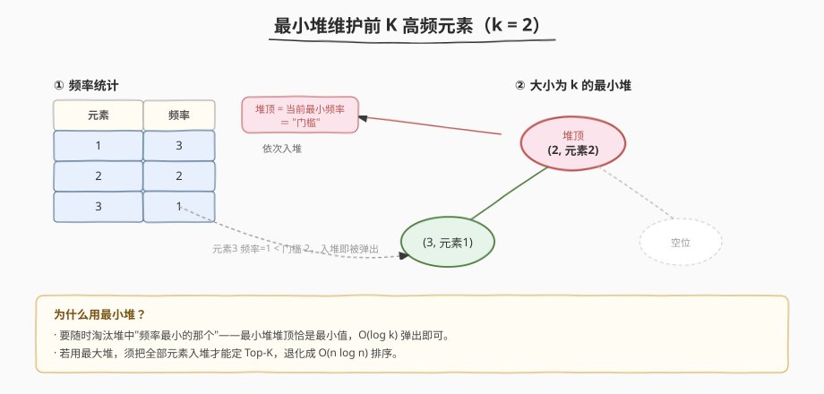
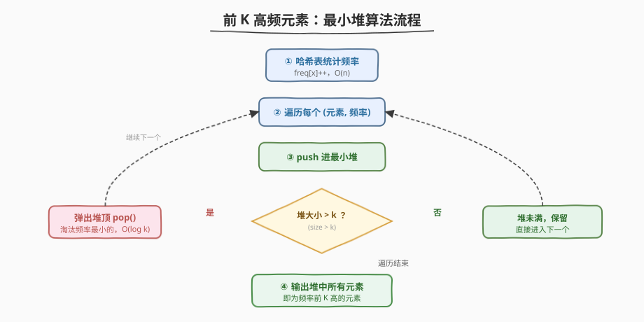
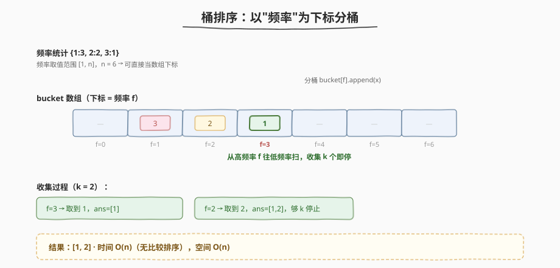
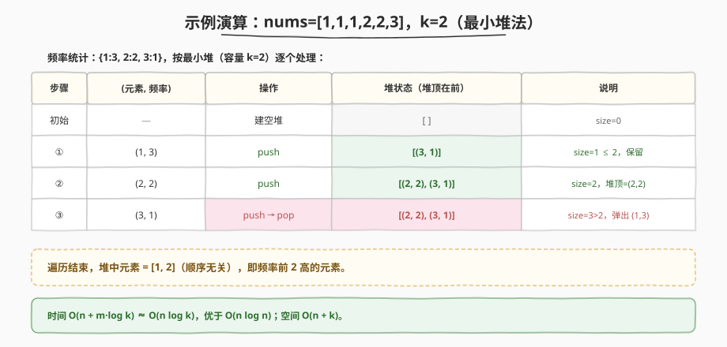

# LeetCode 前 K 个高频元素 题解

## 1. 题目概述

- **标题 / 题号**：前 K 个高频元素（#347，medium）
- **链接**：https://leetcode.cn/problems/top-k-frequent-elements/
- **难度**：中等
- **标签**：数组、哈希表、堆（优先队列）、桶排序

**题意**：给你一个整数数组 `nums` 和一个整数 `k`，请你返回其中出现频率前 `k` 高的元素。答案可以按**任意顺序**返回。

**示例 1**：

```text
输入：nums = [1,1,1,2,2,3], k = 2
输出：[1,2]
解释：1 出现 3 次，2 出现 2 次，3 出现 1 次，前 2 高频元素为 [1,2]。
```

**示例 2**：

```text
输入：nums = [1], k = 1
输出：[1]
```

**约束**：

- `1 <= nums.length <= 10^5`
- `-10^4 <= nums[i] <= 10^4`
- `k` 的取值范围是 `[1, 数组中不同元素的个数]`
- 题目数据保证答案唯一
- **进阶**：所设计算法的时间复杂度必须优于 $O(n \log n)$，其中 `n` 是数组大小

> 💡 这是一道经典的 **Top-K** 模板题。面试中"求前 K 大 / 前 K 高频 / 第 K 大"几乎都套用同一套思路：**堆** 或 **桶排序 / 快速选择**。掌握这一题就能迁移到一整类。

## 2. 解题思路

### 2.1 暴力思路：排序

先用哈希表统计每个元素的出现频率，再把所有 `(元素, 频率)` 按**频率降序排序**，取前 `k` 个。

```text
统计频率：O(n)
排序：    O(m log m)   (m 为不同元素个数，最坏 m = n)
取前 k：  O(k)
```

总时间 $O(n \log n)$，空间 $O(n)$。能 AC，但**不满足进阶要求**（优于 $O(n \log n)$），面试官会追问能否更优。

> ⚠️ 排序的瓶颈在于"对所有 m 个元素排了序"，但我们只需要前 `k` 个，剩下的 `m - k` 个排序纯属浪费。

### 2.2 核心观察：最小堆维护前 K



关键洞察：**只需保留当前频率最高的 k 个**，不必给全体排序。用一个**大小为 k 的最小堆**：

- 堆顶是当前堆中**频率最小**的那个元素（"门槛"）。
- 遍历每个 `(元素, 频率)`：入堆后若堆大小超过 `k`，就弹出堆顶（淘汰当前最不够格的）。
- 遍历结束，堆里剩下的就是频率前 `k` 高的元素。

> 💡 为什么用**最小堆**而不是最大堆？因为我们要随时淘汰"堆里频率最小的那个"。最小堆的堆顶恰好是最小值，$O(\log k)$ 即可弹出。若用最大堆，反而需要先把全部 m 个元素入堆（$O(m \log m)$），退化为排序。

**时间复杂度**：$O(n + m \log k)$，其中 `m` 是不同元素个数。最坏 $m = n$，即 $O(n \log k)$，优于 $O(n \log n)$。**空间**：$O(n)$（哈希表）+ $O(k)$（堆）。

### 2.3 算法流程图



1. 用 `unordered_map` / `Counter` 统计每个元素的频率。
2. 建立以频率为关键字的最小堆（容量 `k`）。
3. 依次把 `(频率, 元素)` 入堆；堆大小 `> k` 时弹出堆顶。
4. 遍历完毕，堆中剩余元素即为答案。

### 2.4 最优解法：桶排序 O(n)



最小堆已经不错，但还能更快到 $O(n)$。观察到：**频率的取值范围是 `[1, n]`**（一个元素最多出现 n 次）。于是可以开一个长度为 `n + 1` 的桶数组，`bucket[f]` 存放所有频率恰为 `f` 的元素。

然后**从高频率往低频率**扫描桶，依次收集元素，凑够 `k` 个即停。

> 💡 这本质是**计数排序**思想：把"频率"当作下标做一次分桶，避免了任何比较排序的 $\log$ 因子。

- **时间复杂度**：$O(n)$——统计 $O(n)$，分桶 $O(m)$，扫描桶 $O(n)$，总计线性。
- **空间复杂度**：$O(n)$——桶数组与哈希表。

### 2.5 示例演算

以 `nums = [1,1,1,2,2,3], k = 2` 为例：



1. 统计频率：`{1: 3, 2: 2, 3: 1}`。
2. 分桶（`n = 6`，下标 `0..6`）：

| 桶下标 f | 0 | 1 | 2 | 3 | 4 | 5 | 6 |
|----------|---|---|---|---|---|---|---|
| bucket[f] | — | [3] | [2] | [1] | — | — | — |

3. 从 `f = 6` 往下扫：`f=3` 取到 `1`，`f=2` 取到 `2`，凑够 `k=2` 停止。
4. 返回 `[1, 2]`。

## 3. 参考代码

### C++（最小堆，$O(n \log k)$）

```cpp
class Solution {
  public:
    vector<int> topKFrequent(vector<int>& nums, int k) {
        unordered_map<int, int> freq;
        for (int x : nums) freq[x]++;

        // 最小堆：按频率升序，堆顶是频率最小的
        auto cmp = [](const pair<int, int>& a, const pair<int, int>& b) {
            return a.second > b.second;
        };
        priority_queue<pair<int, int>, vector<pair<int, int>>, decltype(cmp)>
            pq(cmp);

        for (auto& [num, f] : freq) {
            pq.push({num, f});
            if ((int)pq.size() > k) pq.pop();
        }

        vector<int> ans;
        while (!pq.empty()) {
            ans.push_back(pq.top().first);
            pq.pop();
        }
        return ans;
    }
};
```

### C++（桶排序，$O(n)$）

```cpp
class Solution {
  public:
    vector<int> topKFrequent(vector<int>& nums, int k) {
        unordered_map<int, int> freq;
        for (int x : nums) freq[x]++;

        int n = nums.size();
        vector<vector<int>> bucket(n + 1);
        for (auto& [num, f] : freq) bucket[f].push_back(num);

        vector<int> ans;
        for (int i = n; i >= 0 && (int)ans.size() < k; --i) {
            for (int x : bucket[i]) {
                ans.push_back(x);
                if ((int)ans.size() == k) break;
            }
        }
        return ans;
    }
};
```

### Python

```python
import heapq
from collections import Counter


class Solution:
    def topKFrequent(self, nums: List[int], k: int) -> List[int]:
        freq = Counter(nums)

        # 方法一：最小堆，O(n log k)
        heap = []
        for num, f in freq.items():
            heapq.heappush(heap, (f, num))
            if len(heap) > k:
                heapq.heappop(heap)
        return [num for f, num in heap]

        # 方法二：桶排序，O(n)
        # bucket = [[] for _ in range(len(nums) + 1)]
        # for num, f in freq.items():
        #     bucket[f].append(num)
        # ans = []
        # for i in range(len(nums), 0, -1):
        #     for x in bucket[i]:
        #         ans.append(x)
        #         if len(ans) == k:
        #             return ans
        # return ans
```

> 💡 Python 也可一行 `heapq.nlargest(k, freq.keys(), key=freq.get)`，内部即最小堆实现，复杂度 $O(n \log k)$。面试时手写堆更能体现对原理的掌握。

## 4. 复杂度分析

| 维度 | 最小堆法 | 桶排序法 | 说明 |
|------|----------|----------|------|
| 时间复杂度 | $O(n \log k)$ | $O(n)$ | 堆法每次入堆/出堆 $O(\log k)$，共 $m$ 次；桶排序无比较，纯线性 |
| 空间复杂度 | $O(n)$ | $O(n)$ | 哈希表 $O(m)$；堆 $O(k)$ / 桶数组 $O(n)$ |

> ⚠️ 当 $k$ 较小（如 $k \ll n$）时，堆法的 $O(n \log k)$ 已非常接近线性；当 $k$ 较大或追求理论最优时，桶排序的 $O(n)$ 更佳。面试先讲堆法（通用、可扩展），再用桶排序收尾。

## 5. 扩展：快速选择法

除堆与桶排序外，还可借鉴**快速选择**（Quickselect，[215. 数组中的第 K 个最大元素](https://leetcode.cn/problems/kth-largest-element-in-an-array/) 同款思路）：对频率数组做 partition，期望 $O(n)$，最坏 $O(n^2)$（随机化 pivot 可使最坏情况概率极低）。

三种方法对比：

| 方法 | 平均时间 | 最坏时间 | 空间 | 特点 |
|------|----------|----------|------|------|
| 最小堆 | $O(n \log k)$ | $O(n \log k)$ | $O(n)$ | 稳定，适合**流式数据**（无需全部加载） |
| 桶排序 | $O(n)$ | $O(n)$ | $O(n)$ | 线性，依赖频率范围有限 |
| 快速选择 | $O(n)$ | $O(n^2)$ | $O(n)$ | 原地、不需额外桶，但最坏退化 |

> 💡 面试常问：**如果数据是数据流（实时到达），怎么办？** 此时桶排序失效（频率会变），最小堆是首选——维护一个大小为 `k` 的堆持续更新。

## 6. 面试要点

1. **为什么用最小堆而不是最大堆？**

   - 我们要随时淘汰堆中频率最小的元素。最小堆堆顶即最小值，$O(\log k)$ 弹出即可；若用最大堆，必须把全部 `m` 个元素都入堆才能确定 Top-K，退化成 $O(m \log m)$ 排序。

2. **桶排序为什么是 $O(n)$？**

   - 频率取值范围是 `[1, n]`（某元素最多出现 n 次），桶数组长度 `n + 1` 是有限的。统计 $O(n)$、分桶 $O(m)$、从高到低扫描桶 $O(n)$，每步都是线性，无比较排序的 $\log$ 因子。

3. **堆法和桶排序各适合什么场景？**

   - 堆法适合 `k` 小、或数据是**流式**无法一次性装入、或频率上界未知；桶排序适合数据可全部装入内存且频率范围有限（本题频率 ≤ n，天然适合）。

4. **如果 `k` 接近 `n`，堆法还优吗？**

   - 当 $k \approx n$，$O(n \log k) \approx O(n \log n)$，与排序无异，此时桶排序的 $O(n)$ 优势明显。所以 `k` 大时优先桶排序 / 快速选择。

5. **Top-K 模板能迁移到哪些题？**

   - 任何"前 K 大 / 前 K 高频 / 第 K 大"都是同一套：[215. 第 K 个最大元素](https://leetcode.cn/problems/kth-largest-element-in-an-array/)（快速选择）、[295. 数据流的中位数](https://leetcode.cn/problems/find-median-from-data-stream/)（双堆）、[703. 数据流中的第 K 大元素](https://leetcode.cn/problems/kth-largest-element-in-a-stream/)（小顶堆维护）。

## 同类练习题

| # | 题目 | 与本题的关联 |
|---|------|-------------|
| 215 | [数组中的第 K 个最大元素](https://leetcode.cn/problems/kth-largest-element-in-an-array/) | 快速选择求第 K 大，Top-K 三大方法之一 |
| 295 | [数据流的中位数](https://leetcode.cn/problems/find-median-from-data-stream/) | 大小顶堆配合，堆的进阶用法 |
| 703 | [数据流中的第 K 大元素](https://leetcode.cn/problems/kth-largest-element-in-a-stream/) | 维护大小为 k 的最小堆，本题的流式版本 |
| 451 | [根据字符出现频率排序](https://leetcode.cn/problems/sort-characters-by-frequency/) | 频率统计 + 排序/桶排序，本题的字符串变体 |
