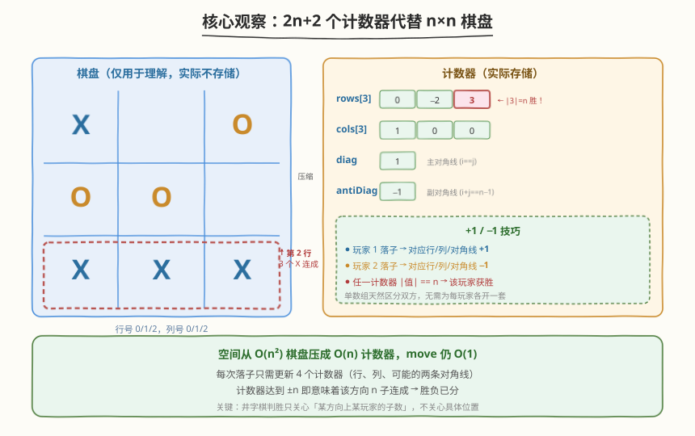
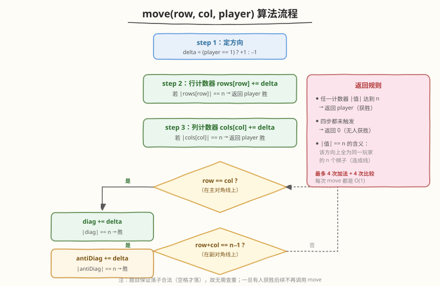

# 设计井字棋

- **题目名称**：设计井字棋
- **链接**：[348. 设计井字棋](https://leetcode.cn/problems/design-tic-tac-toe/)
- **难度**：中等
- **标签**：设计、数组、计数

## 1. 题目概述

设计一个在 $n \times n$ 棋盘上玩的井字棋游戏，支持一个操作：

- `move(row, col, player)`：玩家 `player`（1 或 2）在 `(row, col)` 落子。**保证落子合法**（位置为空）。若落子后该玩家在**水平、垂直或对角线**方向上凑齐 $n$ 个连续棋子，则返回该玩家编号表示获胜；否则返回 `0` 表示无人获胜。一旦有人获胜，后续不再调用 `move`。

**示例 1**：

```text
输入
["TicTacToe", "move", "move", "move", "move", "move", "move", "move"]
[[3], [0, 0, 1], [0, 2, 2], [2, 2, 1], [1, 1, 2], [2, 0, 1], [1, 0, 2], [2, 1, 1]]
输出
[null, 0, 0, 0, 0, 0, 0, 1]

解释
TicTacToe toe = new TicTacToe(3);
toe.move(0, 0, 1);   // → 0
toe.move(0, 2, 2);   // → 0
toe.move(2, 2, 1);   // → 0
toe.move(1, 1, 2);   // → 0
toe.move(2, 0, 1);   // → 0
toe.move(1, 0, 2);   // → 0
toe.move(2, 1, 1);   // → 1，玩家 1 在第 2 行连成 3 子获胜
```

棋盘最终状态（X = 玩家 1，O = 玩家 2）：

```text
X . O
O O .
X X X   ← 玩家 1 的第 2 行三连
```

**约束条件**：

- $2 \leq n \leq 100$
- `player` 取值为 `1` 或 `2`
- $0 \leq \text{row}, \text{col} < n$
- 每次 `(row, col)` 互不相同（落子合法且不重复）
- `move` 的总调用次数最多 $n^2$ 次

> 💡 本题的考点不在「能否判胜」，而在「**每次 `move` 能否做到 $O(1)$**」。暴力法每次扫描全盘是 $O(n)$，关键观察是：井字棋判胜只关心「某方向上某玩家的子数是否达到 $n$」，**与具体位置无关**——于是可以用 $2n+2$ 个计数器代替整个 $n \times n$ 棋盘，把判胜压成 $O(1)$。

---

## 2. 解题思路

### 2.1 暴力思路：每次落子后全盘扫描

最直觉的做法：维护 $n \times n$ 棋盘，每次 `move` 后扫描该子所在的**行、列、两条对角线**，看是否有 $n$ 连。

```text
落子后扫描：
  所在行：O(n)
  所在列：O(n)
  主对角线（若 row == col）：O(n)
  副对角线（若 row+col == n-1）：O(n)
  → 每次 move 最多 O(4n) = O(n)
```

总调用次数最多 $n^2$，整体 $O(n^3)$。当 $n = 100$ 时达到 $10^6$ 级别，看似能过，但**没有利用「每次只多落一子」这一增量信息**——行/列上已有多少子，其实可以在落子时顺手累加，无需重复扫描。

> ⚠️ 暴力法的瓶颈在于「**每次都从零扫描整条线**」。但落子是增量事件：某行新加一子，只需把该行的计数器 +1 即可知道当前该方向上有几子。

### 2.2 核心观察：只维护 2n+2 个计数器



关键洞察：**判胜条件是「某方向上某玩家有 $n$ 子」**，而每次落子只影响它所在的**一行、一列、至多两条对角线**。所以只需为每个方向维护一个计数器，落子时累加，命中 $n$ 即胜。

四个计数器族：

| 计数器 | 大小 | 含义 |
|--------|------|------|
| `rows[n]` | $n$ | `rows[i]` = 当前在「第 `i` 行」上的净子数 |
| `cols[n]` | $n$ | `cols[j]` = 当前在「第 `j` 列」上的净子数 |
| `diag` | $1$ | 主对角线（`row == col`）上的净子数 |
| `antiDiag` | $1$ | 副对角线（`row + col == n-1`）上的净子数 |

> 💡 **+1 / −1 技巧**：用**正负号区分玩家**——玩家 1 落子则对应计数器 `+1`，玩家 2 落子则 `−1`。这样单数组就能同时跟踪双方在某方向上的「净优势」。若某计数器绝对值达到 $n$，说明该方向上 **$n$ 个位置全归同一玩家**（全是 +1 或全是 −1），该玩家获胜。无需为每个玩家各开一套数组。

### 2.3 算法流程图



**`move(row, col, player)`** 四步：

1. **定方向**：`delta = (player == 1) ? +1 : -1`。
2. **行**：`rows[row] += delta`；若 `|rows[row]| == n` → 返回 `player`。
3. **列**：`cols[col] += delta`；若 `|cols[col]| == n` → 返回 `player`。
4. **主对角线**（`row == col` 时）：`diag += delta`；若 `|diag| == n` → 返回 `player`。
5. **副对角线**（`row + col == n-1` 时）：`antiDiag += delta`；若 `|antiDiag| == n` → 返回 `player`。
6. 四步都未触发 → 返回 `0`。

> ⚠️ **两条对角线的判定条件**：
> - 主对角线是 `row == col`（左上到右下，坐标 `(0,0), (1,1), ..., (n-1,n-1)`）。
> - 副对角线是 `row + col == n - 1`（右上到左下，坐标 `(0,n-1), (1,n-2), ..., (n-1,0)`）。
>
> 只在落子位于该对角线上时才更新对应计数器，否则跳过——避免误累加。

### 2.4 示例演算

以题目示例（$n = 3$）完整演算 7 步落子，观察棋盘与四个计数器族的协同演变：


| 步 | `move` | 棋盘（X=1, O=2） | `rows` | `cols` | `diag` | `antiDiag` | 返回 |
|----|--------|------------------|--------|--------|--------|------------|------|
| 1 | `(0,0,1)` | `X . .` / `. . .` / `. . .` | `[1,0,0]` | `[1,0,0]` | `1` | `0` | `0` |
| 2 | `(0,2,2)` | `X . O` / `. . .` / `. . .` | `[0,0,0]` | `[1,0,−1]` | `1` | `−1` | `0` |
| 3 | `(2,2,1)` | `X . O` / `. . .` / `. . X` | `[0,0,1]` | `[1,0,0]` | `2` | `−1` | `0` |
| 4 | `(1,1,2)` | `X . O` / `. O .` / `. . X` | `[0,−1,1]` | `[1,−1,0]` | `1` | `−2` | `0` |
| 5 | `(2,0,1)` | `X . O` / `. O .` / `X . X` | `[0,−1,2]` | `[2,−1,0]` | `1` | `−1` | `0` |
| 6 | `(1,0,2)` | `X . O` / `O O .` / `X . X` | `[0,−2,2]` | `[1,−1,0]` | `1` | `−1` | `0` |
| 7 | `(2,1,1)` | `X . O` / `O O .` / `X X X` | `[0,−2,3]` | `[1,0,0]` | `1` | `−1` | **`1`** |

> 💡 **看第 7 步**：玩家 1 在 `(2,1)` 落子，`rows[2]` 从 `2` 增到 `3`，$|3| = n = 3$ → 命中获胜条件，返回 `1`。此时第 2 行三个位置 `(2,0), (2,1), (2,2)` 全为玩家 1 的子，正是棋盘最后一行的三连。注意 `cols[1]` 也从 `−1` 变 `0`（被 +1 抵消），但 $|0| \neq n$，不触发——这正体现了「同方向上双方子数相互抵消，只有全归一方才能达到 $|n|$」的设计。

---

## 3. 参考代码

### C++

```cpp
class TicTacToe {
    vector<int> rows, cols;
    int diag = 0, antiDiag = 0, n;
public:
    TicTacToe(int n) : rows(n, 0), cols(n, 0), n(n) {}

    int move(int row, int col, int player) {
        int delta = (player == 1) ? 1 : -1;

        rows[row] += delta;
        if (abs(rows[row]) == n) return player;

        cols[col] += delta;
        if (abs(cols[col]) == n) return player;

        if (row == col) {
            diag += delta;
            if (abs(diag) == n) return player;
        }
        if (row + col == n - 1) {
            antiDiag += delta;
            if (abs(antiDiag) == n) return player;
        }
        return 0;
    }
};
```

### Python

```python
class TicTacToe:
    def __init__(self, n: int):
        self.n = n
        self.rows: list[int] = [0] * n
        self.cols: list[int] = [0] * n
        self.diag = 0
        self.anti_diag = 0

    def move(self, row: int, col: int, player: int) -> int:
        delta = 1 if player == 1 else -1

        self.rows[row] += delta
        if abs(self.rows[row]) == self.n:
            return player

        self.cols[col] += delta
        if abs(self.cols[col]) == self.n:
            return player

        if row == col:
            self.diag += delta
            if abs(self.diag) == self.n:
                return player

        if row + col == self.n - 1:
            self.anti_diag += delta
            if abs(self.anti_diag) == self.n:
                return player

        return 0
```

> ⚠️ **两个高频踩坑点**：
> （1）**副对角线条件写成 `row + col == n`**。正确是 `n - 1`（下标从 0 起，最大下标和为 `(n-1) + 0 = n - 1`）。写成 `n` 会漏判副对角线。
> （2）**用 `rows[row] == n` 而非 `abs(rows[row]) == n`**。玩家 2 的计数器是负数，获胜时值为 $-n$，不取绝对值会漏判玩家 2 获胜。
>
> 💡 **不需要存棋盘**：题目保证落子合法（位置为空才落），所以无需用二维数组记录占用情况——计数器已经足够判胜。若题目改为「需检测非法落子」，才需额外维护棋盘。

---

## 4. 复杂度分析

| 维度 | 复杂度 | 说明 |
|------|--------|------|
| **`move` 时间** | $O(1)$ | 最多 4 次加法 + 4 次绝对值比较，全部常数操作 |
| **`TicTacToe(n)` 时间** | $O(n)$ | 初始化两个长度为 $n$ 的数组 |
| **空间复杂度** | $O(n)$ | `rows[n]` + `cols[n]` + 两个标量，共 $2n + 2$ 个整数 |

> 💡 对比暴力法的 $O(n)$ 每次 `move` / $O(n^2)$ 空间，计数器法把**时间从 $O(n)$ 降到 $O(1)$、空间从 $O(n^2)$ 降到 $O(n)$**。提升的根本原因在于：判胜只关心「某方向上某玩家的子数」，而这一信息可以在落子时增量维护，无需回头扫描。

---

## 5. 扩展：每玩家独立计数（更直观的版本）

+1 / −1 技巧把两个玩家的计数器合并成一个，省了一半空间，但要求理解「绝对值为 $n$ 即一方独占」。若面试官对可读性要求更高，可以**为每个玩家各开一套计数器**：

```cpp
class TicTacToe {
    vector<vector<int>> rows, cols;   // rows[player][i], cols[player][j]
    vector<int> diag, antiDiag;       // diag[player], antiDiag[player]
    int n;
public:
    TicTacToe(int n) : rows(2, vector<int>(n, 0)), cols(2, vector<int>(n, 0)),
                       diag(2, 0), antiDiag(2, 0), n(n) {}

    int move(int row, int col, int player) {
        int p = player - 1;                      // 0-indexed
        rows[p][row]++;
        if (rows[p][row] == n) return player;

        cols[p][col]++;
        if (cols[p][col] == n) return player;

        if (row == col) {
            diag[p]++;
            if (diag[p] == n) return player;
        }
        if (row + col == n - 1) {
            antiDiag[p]++;
            if (antiDiag[p] == n) return player;
        }
        return 0;
    }
};
```

> 💡 两者等价：空间 $O(2n) = O(n)$ 同阶，时间仍是 $O(1)$。差别只在**常数与可读性**——`+1/−1` 版更紧凑、空间常数更小；分玩家版更直观、不易在「绝对值」上踩坑。面试时先讲 +1/−1 版展示洞察，再提分玩家版作为可读性备选，能体现取舍意识。

---

## 6. 面试要点

1. **为什么不需要存棋盘？**

   - 判胜只关心「某方向上某玩家的子数是否达到 $n$」，这一信息可由计数器增量维护。题目保证落子合法（不重不冲突），无需查重，所以**计数器已包含判胜所需的全部信息**。若题目改为「需检测非法落子」，才需额外二维数组记录占用。

2. **为什么 +1 / −1 技巧可行？为什么 $|val| == n$ 就意味着获胜？**

   - 同一方向上的 $n$ 个位置，若全归玩家 1，则计数器为 $+n$；若全归玩家 2，则为 $-n$；只要双方都有子，绝对值就 $< n$。所以 $|val| = n$ 当且仅当该方向被单一玩家独占——这正是获胜条件。技巧的本质是「用正负号把两个玩家的计数压缩到一个变量里」。

3. **两条对角线的判定条件分别是什么？为什么？**

   - 主对角线 `row == col`：从左上 `(0,0)` 到右下 `(n-1,n-1)`，所有点行列下标相等。副对角线 `row + col == n - 1`：从右上 `(0,n-1)` 到左下 `(n-1,0)`，行列下标之和恒为 $n-1$（下标从 0 起）。只在落子位于该线时才更新对应计数器，避免误累加。

4. **极端情形：`n = 2` 时对角线判胜是否正确？**

   - $n = 2$ 时主对角线 `(0,0), (1,1)` 与副对角线 `(0,1), (1,0)` 无重叠，两条件互斥（同一格不会同时满足 `row==col` 和 `row+col==1`），逻辑正确。$n$ 为奇数时中心格 `(n/2, n/2)` 同时在两条对角线上，落子时两个计数器都要更新——代码中两个 `if` 是独立的，天然覆盖。

5. **如果要支持「撤销上一步」怎么改？**

   - 把 `move` 改成 `delta = ±1` 的逆操作：`undo(row, col, player)` 用 `-delta` 更新对应计数器即可。因为计数器只存「净子数」，加减是对称的，撤销 = 反向加减。这是 +1/−1 技巧的额外红利——分玩家版需要做减法并判 `== 0`，而 +1/−1 版天然对称。

---

## 7. 同类练习题

- [1275. 找出井字棋的获胜者](https://leetcode.cn/problems/find-winner-on-a-tic-tac-toe-game/)：井字棋判胜的「判题」版（给定落子序列判定胜负），巩固 $n=3$ 下的行/列/对角线判胜逻辑
- [794. 有效的井字棋](https://leetcode.cn/problems/valid-tic-tac-toe-state/)：判给定棋盘是否为合法井字棋状态（含轮次、胜负终止约束），对照本题「只判胜不判合法性」的简化假设
- [1603. 设计停车系统](https://leetcode.cn/problems/design-parking-system/)：简单设计题，用几个计数器响应请求，对照「计数器代替显式存储」的共性
- [304. 二维区域和检索 - 数组不可变](https://leetcode.cn/problems/range-sum-query-2d-immutable/)（[题解](../0301-0400/304_二维区域和检索 - 数组不可变.md)）：同样是「预处理计数器把查询压成 $O(1)$」的思路，对照二维前缀和与一维计数器的差异
- [36. 有效的数独](https://leetcode.cn/problems/valid-sudoku/)：用「行/列/宫」三组哈希集合判重，思想与本题「按方向分组维护状态」同源
