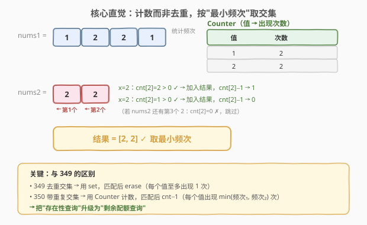
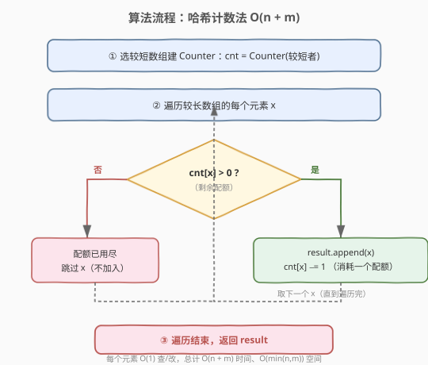

# LeetCode 两个数组的交集 II 题解

## 1. 题目概述

- **标题 / 题号**：两个数组的交集 II（#350，easy）
- **链接**：https://leetcode.cn/problems/intersection-of-two-arrays-ii/
- **难度**：简单
- **标签**：数组、哈希表、双指针、排序

**题意**：给你两个整数数组 `nums1` 和 `nums2`，请你以数组形式返回两数组的交集。返回结果中每个元素出现的次数，应与元素在两个数组中都出现的次数一致（如果出现次数不一致，则考虑取**较小值**）。可以不考虑输出结果的顺序。

**示例 1**：

```text
输入：nums1 = [1,2,2,1], nums2 = [2,2]
输出：[2,2]
```

**示例 2**：

```text
输入：nums1 = [4,9,5], nums2 = [9,4,9,8,4]
输出：[4,9]
解释：[9,4] 也是可通过的
```

**约束**：

- `1 <= nums1.length, nums2.length <= 1000`
- `0 <= nums1[i], nums2[i] <= 1000`

**进阶要求**：

- 如果给定的数组已经排好序呢？你将如何优化你的算法？
- 如果 `nums1` 的大小比 `nums2` 小，哪种方法更优？
- 如果 `nums2` 的元素存储在磁盘上，内存是有限的，并且你不能一次加载所有的元素到内存中，你该怎么办？

> ⚠️ **与 349 的关键区别**：[349. 两个数组的交集](../0301-0400/349_两个数组的交集.md) 要求结果**去重**（每个值至多出现一次），用 `set`；本题要求结果**保留重复**，每个值出现 $\min(\text{频次}_1, \text{频次}_2)$ 次，需用**计数器**而非集合。

## 2. 解题思路

### 2.1 暴力思路：双重循环 + 逐个标记

对 `nums1` 的每个元素，遍历 `nums2` 找一个尚未被匹配的同值元素，匹配上就加入结果并标记 `nums2` 中该位置已用。时间 $O(n \times m)$，空间 $O(m)$（标记数组）。`n=m=1000` 时约 $10^6$ 次操作，能过但效率低，且需要额外维护"已用"状态。问题在于：每次匹配都在线性扫描 `nums2`，这正是哈希表能优化到 $O(1)$ 的环节。

### 2.2 核心观察：哈希计数，按"剩余配额"取交集



关键直觉：要保留重复，就要知道每个值**还能匹配几次**——即"剩余配额"。把较短数组（设为 `A`）的每个值统计频次存入哈希表 `cnt`，然后遍历较长数组 `B` 的每个元素 `x`：

- `cnt[x] > 0`（还有配额）→ `x` 加入结果，`cnt[x] -= 1`（消耗一个配额）
- `cnt[x] == 0`（配额耗尽或本就没有）→ 跳过

最终结果中每个值 `v` 恰好出现 $\min(\text{cnt}_A(v), \text{cnt}_B(v))$ 次，正是题目要求。

> 💡 **为什么选较短数组建表？** 哈希表空间正比于建表数组的大小。把短的存入内存，长的只用逐个流式扫描，空间降到 $O(\min(n,m))$。这也是进阶问"如果 `nums1` 比 `nums2` 小哪种方法更优"的标准答案：**用短的建 Counter**。

> 💡 **从 set 到 Counter 的升级**：349 把"存在性查询"（`x in set`）+ 匹配后 `erase` 解决去重；本题把"存在性查询"升级为"剩余配额查询"（`cnt[x] > 0`）+ 匹配后 `cnt-1`。逻辑结构完全对称，只是把布尔型改为整型。

### 2.3 算法流程图



整个流程是"建表 + 单趟扫描"：建 Counter $O(\min(n,m))$，遍历较长数组每个元素做一次 $O(1)$ 的查改，总计 $O(n+m)$ 时间、$O(\min(n,m))$ 空间。

### 2.4 示例演算

![示例演算 nums1=[4,9,5], nums2=[9,4,9,8,4]](../images/intersect2_example_walkthrough.svg)

以 `nums1=[4,9,5]`, `nums2=[9,4,9,8,4]` 为例（`nums1` 更短，用它建表）：

- **初始** `cnt = {4:1, 9:1, 5:1}`
- **x=9**：`cnt[9]=1 > 0` ✓ 加入 → `cnt[9]: 1→0`，`result=[9]`
- **x=4**：`cnt[4]=1 > 0` ✓ 加入 → `cnt[4]: 1→0`，`result=[9,4]`
- **x=9**：`cnt[9]=0` ✗ 跳过（配额已耗尽）
- **x=8**：`cnt[8]=0` ✗ 跳过（`nums1` 中无 8）
- **x=4**：`cnt[4]=0` ✗ 跳过（配额已耗尽）
- **最终** `result=[9,4]` ✓

验证频次：9 在 `nums1` 出现 1 次、`nums2` 出现 2 次，$\min=1$；4 同理 $\min=1$。结果正确。

## 3. 参考代码

### C++（哈希计数）

```cpp
class Solution {
public:
    vector<int> intersect(vector<int>& nums1, vector<int>& nums2) {
        if (nums1.size() > nums2.size()) {
            return intersect(nums2, nums1); // 始终用较短者建表，优化空间
        }
        unordered_map<int, int> cnt;
        for (int x : nums1) cnt[x]++;            // 建计数表
        vector<int> result;
        for (int x : nums2) {
            if (cnt[x] > 0) {                    // 还有配额
                result.push_back(x);
                cnt[x]--;                        // 消耗一个配额
            }
        }
        return result;
    }
};
```

### Python

```python
from collections import Counter

class Solution:
    def intersect(self, nums1: list[int], nums2: list[int]) -> list[int]:
        if len(nums1) > len(nums2):
            return self.intersect(nums2, nums1)  # 始终用较短者建表
        cnt = Counter(nums1)
        result = []
        for x in nums2:
            if cnt[x] > 0:                       # 还有配额
                result.append(x)
                cnt[x] -= 1
        return result
```

> ⚠️ **`cnt[x]` 在 C++ 中的安全性**：`unordered_map` 的 `operator[]` 会在键不存在时插入默认值 0，所以 `cnt[x] > 0` 不会出错；但要避免对 `nums2` 中从未出现在 `nums1` 的值反复触发插入导致表膨胀。本题数据量小可忽略；若关心，可改用 `auto it = cnt.find(x); if (it != cnt.end() && it->second > 0)`。

## 4. 复杂度分析

| 维度 | 复杂度 | 说明 |
|------|--------|------|
| 时间复杂度 | $O(n + m)$ | 建表 $O(\min(n,m))$ + 遍历较长数组 $O(\max(n,m))$，每个元素 $O(1)$ 查改 |
| 空间复杂度 | $O(\min(n, m))$ | 哈希表只存较短数组的元素频次 |

## 5. 扩展：进阶三问

### 5.1 数组已排序 → 排序 + 双指针 $O(1)$ 额外空间

如果数组**已经有序**，双指针法无需额外空间，且时间降到 $O(n+m)$（省去排序代价）：

```cpp
// 方法二：排序 + 双指针（适合已排序或允许破坏原序）
class Solution {
public:
    vector<int> intersect(vector<int>& nums1, vector<int>& nums2) {
        sort(nums1.begin(), nums1.end());
        sort(nums2.begin(), nums2.end());
        vector<int> result;
        int i = 0, j = 0;
        while (i < nums1.size() && j < nums2.size()) {
            if (nums1[i] == nums2[j]) {
                result.push_back(nums1[i]); // 相等就加入，不跳过重复
                i++; j++;
            } else if (nums1[i] < nums2[j]) {
                i++;
            } else {
                j++;
            }
        }
        return result;
    }
};
```

```python
def intersect_sorted(nums1: list[int], nums2: list[int]) -> list[int]:
    nums1.sort()
    nums2.sort()
    result, i, j = [], 0, 0
    while i < len(nums1) and j < len(nums2):
        if nums1[i] == nums2[j]:
            result.append(nums1[i])
            i += 1; j += 1
        elif nums1[i] < nums2[j]:
            i += 1
        else:
            j += 1
    return result
```

> 💡 **与 349 双指针的唯一区别**：349 加入结果前判断 `result.back() != nums1[i]` 跳过重复；本题**不加这个判断**，相等就直接加入，让重复元素按 $\min$ 频次自然耗尽。

**两种解法对比**：

| 解法 | 时间 | 额外空间 | 适用场景 |
|------|------|----------|----------|
| 哈希计数 | $O(n+m)$ | $O(\min(n,m))$ | 数组无序、需保留原数组、`nums2` 在磁盘上 |
| 排序 + 双指针 | $O(n\log n + m\log m)$（已排序则 $O(n+m)$） | $O(1)$ | 数组已有序、内存敏感、需要结果有序 |

### 5.2 `nums1` 比 `nums2` 小 → 用短的建表

哈希计数法中，建表数组决定空间。把短的存入 `cnt`，长的只流式扫描，空间即 $O(\min(n,m))$。参考代码已通过 `if (nums1.size() > nums2.size()) return intersect(nums2, nums1);` 保证始终用较短者建表。

### 5.3 `nums2` 存在磁盘上、内存有限 → 分块读取 + 内存计数

此时不能把 `nums2` 全载入内存：

1. 把**较小的 `nums1`** 整个读入内存建 `cnt`（题目说 `nums1` 更小，可放下）；
2. 对 `nums2` **分块读取**（每次只读一段进内存），逐块用同样的"查配额 + 消耗"逻辑处理；
3. 各块的结果拼接即最终答案。

由于 `cnt` 只随 `nums1` 增长，与 `nums2` 大小无关，`nums2` 多大都能处理。**双指针法在此场景不适用**——它要求两数组同时有序且能随机访问，磁盘排序代价极高。所以外存场景下**哈希计数 + 分块流式读取是首选**。

## 6. 面试要点

1. **为什么用 Counter 而不是 set？**

   - set 只能记录"是否存在"，无法表达"还能匹配几次"。本题要求每个值出现 $\min(\text{频次}_1, \text{频次}_2)$ 次，必须用计数器跟踪剩余配额。set 会在第一次匹配后就 erase，丢失后续配额信息，导致重复元素只出现 1 次（退化成 349 的行为）。

2. **为什么始终用较短数组建表？**

   - 哈希表空间正比于建表数组大小。用短的建表，空间降到 $O(\min(n,m))$；长的只需 $O(1)$ 流式扫描。面试中这正对应进阶问"`nums1` 比 `nums2` 小哪种方法更优"的答案。

3. **`cnt[x] -= 1` 之后 `cnt[x]` 可能变负吗？**

   - 不会。进入分支前已判定 `cnt[x] > 0`，所以减 1 后最小为 0。后续再遇到同值会因 `cnt[x] == 0` 走跳过分支，天然实现"按最小频次截断"。

4. **哈希计数法和排序 + 双指针各自的优劣？如何选？**

   - 哈希计数：$O(n+m)$ 时间、$O(\min(n,m))$ 空间，不破坏原数组，适合无序、需保留原序、外存场景。排序 + 双指针：$O(n\log n + m\log m)$ 时间（已排序则 $O(n+m)$）、$O(1)$ 额外空间，适合已有序、内存敏感、需要结果有序。**数组已排序**是双指针的关键触发条件。

5. **`nums2` 在磁盘上、内存有限怎么办？**

   - 把较小的 `nums1` 整个读入内存建 `cnt`；`nums2` 分块流式读取，每块用"查配额 + 消耗"逻辑处理，结果拼接。`cnt` 只随 `nums1` 增长，与 `nums2` 规模无关。双指针法因需两数组同时有序且随机访问，磁盘排序代价过大，不适用。

6. **从 349 改到 350，代码改动点在哪？**

   - 两处：(a) 数据结构从 `unordered_set` 改为 `unordered_map<int,int>`（或 `Counter`）；(b) 匹配后的动作从 `erase` 改为 `cnt[x]--`，判定从 `count(x)` 改为 `cnt[x] > 0`。双指针法则是去掉 `result.back() != nums1[i]` 的去重判断。核心都是"把布尔存在性升级为整型配额"。

## 同类练习题

| # | 题目 | 与本题的关联 |
|---|------|-------------|
| 349 | [两个数组的交集](https://leetcode.cn/problems/intersection-of-two-arrays/)（[题解](../0301-0400/349_两个数组的交集.md)） | 去重版交集，用 set 而非 Counter，是本题的"母题" |
| 2215 | [找出两数组的不同](https://leetcode.cn/problems/find-the-difference-of-two-arrays/) | 集合差集，与交集对称，同样用 set 处理存在性 |
| 1 | [两数之和](https://leetcode.cn/problems/two-sum/)（[题解](../0001-0100/1_两数之和.md)） | 哈希表查存在的同类思路，"边查边存"与本题"边查边消耗"同构 |
| 2824 | [统计和小于目标的下标对数目](https://leetcode.cn/problems/count-pairs-whose-sum-is-less-than-target/) | 排序 + 双指针的同类模板，承接 5.1 双指针思路 |
| 1002 | [查找共用字符](https://leetcode.cn/problems/find-common-characters/) | 多字符串取最小频次的泛化版，把"两数组"扩到"多字符串"，Counter 思路直接迁移 |
