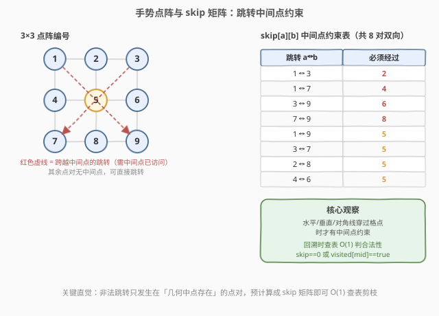
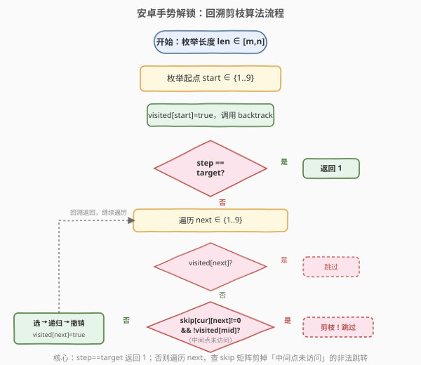
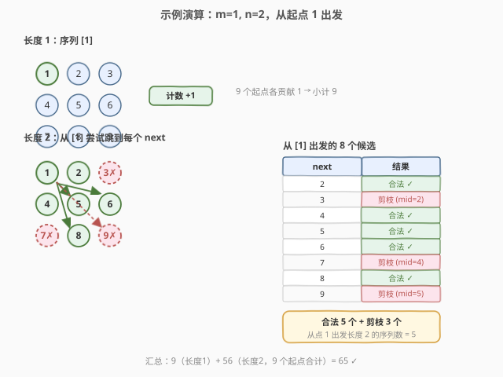
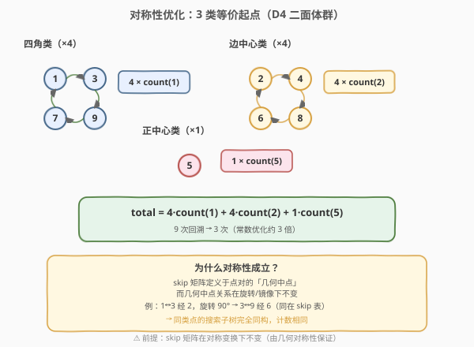

# LeetCode 安卓系统手势解锁 题解

## 1. 题目概述

- **标题 / 题号**：安卓系统手势解锁（#351，medium）
- **链接**：https://leetcode.cn/problems/android-unlock-patterns/
- **难度**：中等
- **标签**：回溯、图、对称性

**题意**：Android 手势解锁屏幕是一个 **3×3 的点阵**，9 个点编号如下：

```text
1 2 3
4 5 6
7 8 9
```

一个合法的手势解锁序列需要满足以下规则：

1. **长度范围**：序列长度在 `[m, n]` 之间（含两端）。
2. **点不重复**：序列中每个点最多出现一次。
3. **不能跨越未访问的中间点**：从点 `a` 直接到点 `b` 时，若它们的**几何中点**存在且尚未被访问过，则该跳转非法。例如 `1 → 3` 必须经过 `2`，除非 `2` 已在序列中；`1 → 9` 必须经过 `5`，除非 `5` 已被访问。

给定整数 `m` 和 `n`，返回长度在 `[m, n]` 范围内的**合法手势解锁序列总数**。

**示例 1**：

```text
输入：m = 1, n = 1
输出：9
解释：长度恰好为 1 的序列有 9 个（任选一个点即可），无跳转约束。
```

**示例 2**：

```text
输入：m = 1, n = 2
输出：65
解释：长度为 1 的有 9 个；长度为 2 的有 56 个，合计 65。
```

**约束**：

- `1 <= m, n <= 9`
- `m <= n`

## 2. 解题思路

### 2.1 暴力思路：枚举全排列 + 合法性校验

最朴素的做法是枚举 `1..9` 的所有长度在 `[m, n]` 之间的排列，对每个排列逐对检查相邻跳转是否合法（中间点是否已访问）。9 个点至多 $9! = 362880$ 个全排列，虽然能跑过，但「先枚举再校验」没有利用回溯的**提前剪枝**能力——一旦某一步跳转非法，后续所有延伸都应直接放弃。

> ⚠️ 这种做法在面试中只能作为引子，面试官会追问：「能不能在搜索过程中就跳过非法跳转，而不是生成完整序列后再校验？」这就引出了下面的 **skip 矩阵 + 回溯剪枝** 方案。

### 2.2 核心观察：skip 矩阵 + 回溯剪枝



关键直觉是：**非法跳转只发生在「几何中点存在」的点对之间**，而这些点对是**有限且固定**的，可以预计算成一张表。

**3×3 点阵的「中间点」约束**（共 8 对，双向）：

| 跳转 | 必须经过 | 跳转 | 必须经过 |
|------|----------|------|----------|
| 1 ↔ 3 | 2 | 1 ↔ 7 | 4 |
| 3 ↔ 9 | 6 | 7 ↔ 9 | 8 |
| 1 ↔ 9 | 5 | 3 ↔ 7 | 5 |
| 2 ↔ 8 | 5 | 4 ↔ 6 | 5 |

其余点对（如 `1 ↔ 2`、`1 ↔ 6`、`2 ↔ 3` 等）要么相邻、要么呈对角但不共线，**没有中间点**，可直接跳转。

> 💡 观察上表：**所有跨越中间点的跳转，中间点要么是边中心（2/4/6/8），要么是正中心 5**。这正是 3×3 网格的几何性质——只有水平/垂直/对角线穿过格点时才有中间点。

据此构造 `skip[a][b]`：表示从 `a` 跳到 `b` 时必须提前访问的中间点编号（`0` 表示无约束）。回溯时，从当前点 `cur` 尝试跳到任意未访问的 `next`，只要 `skip[cur][next] == 0` 或 `visited[skip[cur][next]] == true`，跳转即合法。

### 2.3 算法流程图



流程与经典回溯模板一致，核心在于「选下一个点」时多一步 **skip 矩阵校验**：查 `skip[cur][next]`，若非 0 则要求该中间点已访问。每当序列长度 `≥ m` 时就累加一次计数（不直接返回，因为长度还可以继续延伸到 `n`）。

### 2.4 示例演算



以 `m=1, n=2` 为例，追踪从起点 `1` 出发的关键分支：

- **长度 1**：序列 `[1]`，长度 `1 ≥ m` → 计数 `+1`（共 9 个起点，每个贡献 1，小计 9）。
- **长度 2**（从 `1` 出发）：
  - `1 → 2`：相邻，无中间点 → 合法，`[1,2]` 计数 `+1`。
  - `1 → 3`：`skip[1][3]=2`，`2` 未访问 → **非法，剪枝！**
  - `1 → 4`：相邻 → 合法，`[1,4]` 计数 `+1`。
  - `1 → 5`：对角不共线，无中间点 → 合法，`[1,5]` 计数 `+1`。
  - `1 → 6`：无中间点 → 合法，`[1,6]` 计数 `+1`。
  - `1 → 7`：`skip[1][7]=4`，`4` 未访问 → **非法，剪枝！**
  - `1 → 8`：无中间点 → 合法，`[1,8]` 计数 `+1`。
  - `1 → 9`：`skip[1][9]=5`，`5` 未访问 → **非法，剪枝！**

从 `1` 出发长度为 2 的合法序列有 5 个（`2,4,5,6,8`），被剪掉 3 个（`3,7,9`）。

> 💡 **对称性观察**：起点 `1, 3, 7, 9`（四个角）对称，它们各自的搜索子树**完全同构**；起点 `2, 4, 6, 8`（四条边中心）也对称。利用这一性质可以把 9 次回溯压缩成 3 次，详见第 5 节扩展。

最终汇总（不使用对称性优化时直接跑 9 个起点）：

- 长度 1：9 个
- 长度 2：56 个
- 合计 `9 + 56 = 65`，与示例输出一致。

## 3. 参考代码

### C++（skip 矩阵 + 回溯剪枝）

```cpp
class Solution {
  public:
    int numberOfPatterns(int m, int n) {
        // skip[a][b] = 从 a 跳到 b 必须经过的中间点（0 表示无约束）
        int skip[10][10] = {0};
        skip[1][3] = skip[3][1] = 2;
        skip[1][7] = skip[7][1] = 4;
        skip[3][9] = skip[9][3] = 6;
        skip[7][9] = skip[9][7] = 8;
        skip[1][9] = skip[9][1] = 5;
        skip[3][7] = skip[7][3] = 5;
        skip[2][8] = skip[8][2] = 5;
        skip[4][6] = skip[6][4] = 5;

        vector<bool> visited(10, false);
        int ans = 0;
        for (int len = m; len <= n; ++len) {
            for (int start = 1; start <= 9; ++start) {
                visited[start] = true;
                ans += backtrack(start, 1, len, skip, visited);
                visited[start] = false;
            }
        }
        return ans;
    }

  private:
    // 从 cur 出发，已走 step 步，目标长度为 target
    int backtrack(int cur, int step, int target,
                  int skip[10][10], vector<bool>& visited) {
        if (step == target)
            return 1;
        int count = 0;
        for (int next = 1; next <= 9; ++next) {
            if (visited[next])
                continue;
            int mid = skip[cur][next];
            if (mid != 0 && !visited[mid])
                continue; // 中间点未访问，剪枝
            visited[next] = true;
            count += backtrack(next, step + 1, target, skip, visited);
            visited[next] = false;
        }
        return count;
    }
};
```

### Python（对称性优化版）

```python
class Solution:
    def numberOfPatterns(self, m: int, n: int) -> int:
        # skip[a][b] = 从 a 跳到 b 必须经过的中间点
        skip = [[0] * 10 for _ in range(10)]
        skip[1][3] = skip[3][1] = 2
        skip[1][7] = skip[7][1] = 4
        skip[3][9] = skip[9][3] = 6
        skip[7][9] = skip[9][7] = 8
        skip[1][9] = skip[9][1] = 5
        skip[3][7] = skip[7][3] = 5
        skip[2][8] = skip[8][2] = 5
        skip[4][6] = skip[6][4] = 5

        visited = [False] * 10

        def backtrack(cur: int, step: int, target: int) -> int:
            if step == target:
                return 1
            count = 0
            for nxt in range(1, 10):
                if visited[nxt]:
                    continue
                mid = skip[cur][nxt]
                if mid != 0 and not visited[mid]:
                    continue  # 中间点未访问，剪枝
                visited[nxt] = True
                count += backtrack(nxt, step + 1, target)
                visited[nxt] = False
            return count

        ans = 0
        for length in range(m, n + 1):
            # 对称性：1/3/7/9 同构，2/4/6/8 同构，5 独立
            visited[1] = True
            ans += 4 * backtrack(1, 1, length)
            visited[1] = False

            visited[2] = True
            ans += 4 * backtrack(2, 1, length)
            visited[2] = False

            visited[5] = True
            ans += 1 * backtrack(5, 1, length)
            visited[5] = False
        return ans
```

> ⚠️ Python 版的对称性优化把 9 次回溯压成 3 次（`4×count(1) + 4×count(2) + 1×count(5)`），常数优化约 3 倍。但要注意：**对称性成立的前提是 skip 矩阵本身在对称变换下不变**——3×3 网格的旋转/镜像对称确实保持中间点关系，故优化合法。

## 4. 复杂度分析

| 维度 | 复杂度 | 说明 |
|------|--------|------|
| 时间复杂度 | $O(\sum_{k=m}^{n} P(9, k))$ | 最坏枚举所有长度 $k$ 的排列；skip 剪枝大幅减少实际分支，对称性优化再降 3 倍常数 |
| 空间复杂度 | $O(9)$ | `skip` 矩阵 $10 \times 10$ 定常、`visited` 数组 $10$、递归栈深至多 9 |

> 💡 理论上界 $\sum_{k=1}^{9} P(9,k) = \sum_{k=1}^{9} \frac{9!}{(9-k)!} \approx 986409$，但 skip 剪枝后实际搜索节点远少于此（长度 9 的合法序列仅约 $140704$ 个）。对称性优化后单次回溯量再除以约 $9/3 = 3$。

## 5. 扩展：对称性优化



3×3 点阵在 **D4 二面体群**（8 个对称变换：4 次旋转 + 4 次镜像）作用下，9 个点分为 3 个等价类：

| 等价类 | 点 | 数量 | 代表 |
|--------|----|----|------|
| 四角 | 1, 3, 7, 9 | 4 | 1 |
| 边中心 | 2, 4, 6, 8 | 4 | 2 |
| 正中心 | 5 | 1 | 5 |

**为什么对称性成立？** skip 矩阵定义于点对的几何中点，而几何中点关系在旋转/镜像下不变（例如 `1↔3` 经 `2`，旋转 90° 后变成 `3↔9` 经 `6`，同样存在于 skip 矩阵）。因此从任一四角点出发的搜索子树，经适当旋转即可映射到从点 `1` 出发的子树，计数相同。

> ⚠️ 对称性优化是**常数优化**（约 3 倍），不改变渐近复杂度。面试中可作为亮点提及，但务必说明「前提是 skip 矩阵在对称变换下不变」——这是几何对称性保证的，不是显而易见的。

## 6. 面试要点

1. **skip 矩阵是什么？为什么要预计算？**

   - `skip[a][b]` 表示从点 `a` 直接跳到点 `b` 时必须先经过的中间点。3×3 网格中只有 8 对点有中间点约束（共 16 个有向条目）。预计算后，回溯时只需 $O(1)$ 查表判断跳转合法性，避免每步重复计算几何中点。

2. **回溯的终止条件和计数时机？**

   - 终止条件是 `step == target`（当前序列长度等于目标长度），返回 1。外层枚举所有目标长度 `[m, n]` 并累加。注意：达到 `m` 后**不立即返回**，因为序列可以继续延伸到 `n`，所以代码中对每个 `target` 独立调用回溯。

3. **为什么不能直接枚举全排列再校验？**

   - 全排列枚举是「先生成再过滤」，无法利用提前剪枝。例如序列 `[1, 3, ...]` 第一步就非法（中间点 2 未访问），回溯能立刻放弃整棵子树，而全排列枚举会继续生成所有以 `[1,3]` 开头的排列再逐一判废，浪费大量计算。

4. **对称性优化的原理和前提？**

   - 3×3 点阵的旋转/镜像对称（D4 群）把 9 个点分为 3 个等价类（四角/边中心/正中心）。同类点出发的搜索子树同构，只需算代表点再乘以类大小。前提是 skip 矩阵在对称变换下不变——由几何中点的旋转不变性保证。

5. **skip 矩阵可以推广到更大的网格吗？**

   - 可以。对 $k \times k$ 网格，任意两点 $(r_1,c_1) \to (r_2,c_2)$ 的中间点为 $\left(\frac{r_1+r_2}{2}, \frac{c_1+c_2}{2}\right)$，仅当两坐标和均为偶数（即两点行列差同奇偶）时存在整数中间点。推广后 skip 矩阵规模 $O(k^4)$，但仍可预计算。

## 同类练习题

| # | 题目 | 与本题的关联 |
|---|------|-------------|
| 46 | [全排列](https://leetcode.cn/problems/permutations/)（[题解](../0001-0100/46_全排列.md)） | 回溯模板母题，本题的选-递归-撤销骨架即源于此 |
| 22 | [括号生成](https://leetcode.cn/problems/generate-parentheses/)（[题解](../0001-0100/22_括号生成.md)） | 回溯 + 合法性剪枝，与本题「跳转合法性约束」思想同构 |
| 79 | [单词搜索](https://leetcode.cn/problems/word-search/)（[题解](../0001-0100/79_单词搜索.md)） | 网格上的 DFS 回溯 + visited 标记，对比本题的点阵跳转 |
| 526 | [优美的排列](https://leetcode.cn/problems/beautiful-arrangement/)（[题解](../0501-0600/526_优美的排列.md)） | 回溯 + 条件剪枝（位置约束），与本题的 skip 约束剪枝思路一致 |
