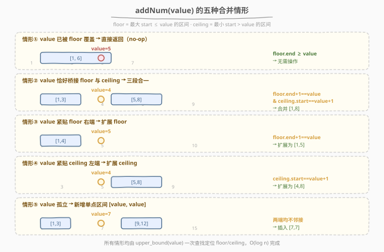
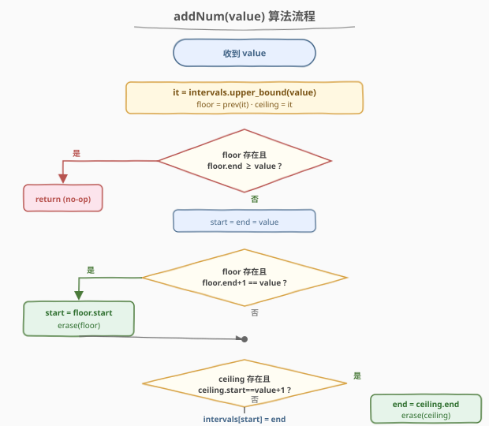
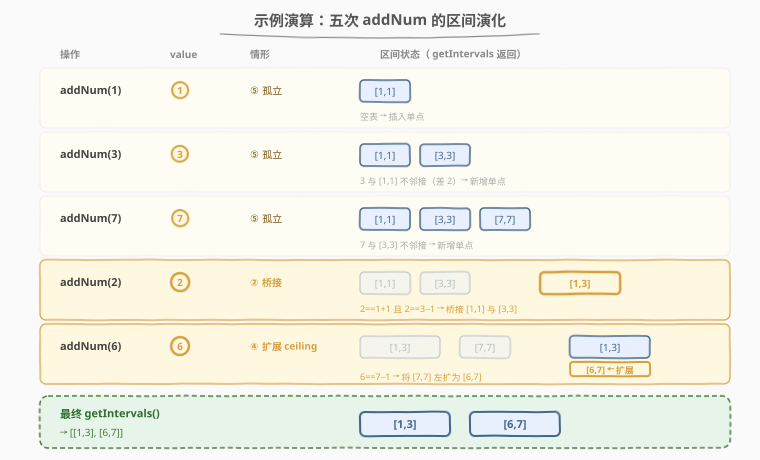

# LeetCode 将数据流变为多个不相交区间 题解

## 1. 题目概述

- **标题 / 题号**：将数据流变为多个不相交区间（#352，hard）
- **链接**：https://leetcode.cn/problems/data-stream-as-disjoint-intervals/
- **难度**：困难
- **标签**：设计、二分查找、有序集合

**题意**：给定一个由非负整数组成的数据流，要求将**目前为止看到的数字**汇总为一组**不相交的区间**列表。实现 `SummaryRanges` 类：

- `SummaryRanges()`：初始化空的数据流对象。
- `void addNum(int value)`：将整数 `value` 加入数据流。
- `int[][] getIntervals()`：返回当前数据流中整数汇总而成的不相交区间列表 `[start_i, end_i]`，按 `start_i` 升序排列。

**示例 1**：

```text
输入
["SummaryRanges", "addNum", "getIntervals", "addNum", "getIntervals",
 "addNum", "getIntervals", "addNum", "getIntervals", "addNum", "getIntervals"]
[[], [1], [], [3], [], [7], [], [2], [], [6], []]
输出
[null, null, [[1, 1]], null, [[1, 1], [3, 3]], null, [[1, 1], [3, 3], [7, 7]],
 null, [[1, 3], [7, 7]], null, [[1, 3], [6, 7]]]

解释
addNum(1) → [1,1]
addNum(3) → [1,1], [3,3]        （3 与 1 不相邻，新增单点）
addNum(7) → [1,1], [3,3], [7,7]
addNum(2) → [1,3], [7,7]        （2 桥接 [1,1] 与 [3,3]）
addNum(6) → [1,3], [6,7]        （6 紧贴 [7,7] 左端，左扩）
```

**约束**：

- $0 \leq \text{value} \leq 10^4$
- `addNum` 与 `getIntervals` 的总调用次数最多 $3 \times 10^4$ 次
- `getIntervals` 最多调用 $10^2$ 次

**进阶**：若存在大量合并，且不相交区间的数量远小于数据流规模，如何优化？

> 💡 本题是**区间合并 + 数据结构选型**的综合题。直觉上的「收集所有数再排序合并」能过但浪费；真正的考点在于维护一个**有序的区间集合**，让每次 `addNum` 仅做 $O(\log n)$ 的定位与局部合并——这正是「进阶」所问的场景。与 [57. 插入区间](../0001-0100/57_插入区间.md) 同源，只是把「一次性插入」改成了「流式插入」。

## 2. 解题思路

### 2.1 暴力思路：每次查询排序合并

最直觉的做法：用一个集合收集所有出现过的数字，`getIntervals` 时把集合排序，再线性扫描合并相邻连续段。

```text
addNum(value)：set.add(value)             → O(1)
getIntervals()：sort(set) + 扫描合并       → O(n log n)，n = 已出现数字总数
```

问题：`getIntervals` 每次都全量排序，即便区间结构几乎没变也要重算。当数字规模大、查询频繁时效率差。

> ⚠️ 暴力法在 $n = 10^4$、查询 $10^2$ 次时约 $10^7$ 量级，本题约束下尚可 AC，但未利用「区间数远小于数字数」的结构——这正是进阶问要优化的方向。

### 2.2 核心观察：有序映射维护不相交区间



关键洞察：**维护区间本身**而非维护裸数字。用一个**按区间起点排序的有序映射** `intervals: start → end`，则每次 `addNum(value)` 只需关注**至多两个相邻区间**——`value` 左侧的 `floor`（最大 `start ≤ value` 的区间）与右侧的 `ceiling`（最小 `start > value` 的区间）。一次 `upper_bound(value)` 即可同时定位二者。

加入 `value` 时仅有五种情形：

| 情形 | 判定 | 操作 |
|------|------|------|
| **① 已覆盖** | `floor.end ≥ value` | `value` 已落在 `floor` 内部，直接返回 |
| **② 桥接两端** | `floor.end + 1 == value` 且 `ceiling.start == value + 1` | 删除 floor/ceiling，插入 `[floor.start, ceiling.end]` |
| **③ 扩展 floor** | `floor.end + 1 == value`（ceiling 不邻接） | 删除 floor，插入 `[floor.start, value]` |
| **④ 扩展 ceiling** | `ceiling.start == value + 1`（floor 不邻接） | 删除 ceiling，插入 `[value, ceiling.end]` |
| **⑤ 孤立新点** | 两端均不邻接 | 插入 `[value, value]` |

> 💡 **为什么只需查 floor/ceiling 两个邻居？** 因为区间集合**始终不相交且按起点有序**，`value` 只可能与左邻或右邻发生关系——不可能跳过它们影响更远的区间。这是「不相交 + 有序」不变式带来的局部性，与 [57. 插入区间](../0001-0100/57_插入区间.md) 的「三阶段扫描」一脉相承：57 在已排序列表上插入一个区间只影响一段连续区，352 把这个过程搬进有序映射里做 $O(\log n)$ 定位。

**数据结构选型**：

| 语言 | 结构 | 关键操作 | 复杂度 |
|------|------|----------|--------|
| C++ | `std::map<int, int>` | `upper_bound` / `erase` / `insert` | $O(\log n)$ |
| Python | `sortedcontainers.SortedDict` | `bisect_right` / `del` / `__setitem__` | $O(\log n)$ |

> ⚠️ **Python 环境说明**：标准库无平衡树，`SortedDict` 来自 `sortedcontainers`（LeetCode Python3 环境预装）。若环境不支持，可退化为「set + 排序合并」的暴力版（见第 5 节扩展）。

### 2.3 算法流程图



**`addNum(value)`**：

1. `it = intervals.upper_bound(value)` → `it` 指向 `ceiling`，`prev(it)` 指向 `floor`。
2. 若 `floor` 存在且 `floor.end ≥ value` → 已覆盖，直接 `return`。
3. 初始化 `start = end = value`。
4. 若 `floor` 存在且 `floor.end + 1 == value` → `start = floor.start`，删除 `floor`。
5. 若 `ceiling` 存在且 `ceiling.start == value + 1` → `end = ceiling.end`，删除 `ceiling`。
6. `intervals[start] = end`。

**`getIntervals()`**：遍历有序映射，按序输出 `[start, end]`。

### 2.4 示例演算



以题给示例完整推演：

| 操作 | value | 情形 | floor / ceiling | 区间状态 |
|------|-------|------|-----------------|----------|
| `addNum(1)` | 1 | ⑤ 孤立 | 无 / 无 | `[1,1]` |
| `addNum(3)` | 3 | ⑤ 孤立 | `[1,1]` / 无（3−1=2 ≠ 1） | `[1,1], [3,3]` |
| `addNum(7)` | 7 | ⑤ 孤立 | `[3,3]` / 无 | `[1,1], [3,3], [7,7]` |
| `addNum(2)` | 2 | ② 桥接 | `[1,1]` / `[3,3]`（2==1+1 且 2==3−1） | `[1,3], [7,7]` |
| `addNum(6)` | 6 | ④ 扩展 ceiling | `[1,3]` / `[7,7]`（6==7−1，floor 不邻接） | `[1,3], [6,7]` |

关键看点在第 4 步：`value=2` 同时满足 `floor.end+1==value` 与 `ceiling.start==value+1`，触发**三段合一**——删除 `[1,1]` 和 `[3,3]`，插入合并后的 `[1,3]`。第 5 步 `value=6` 仅满足 `ceiling.start==value+1`，把 `[7,7]` 左扩为 `[6,7]`。

## 3. 参考代码

### C++

```cpp
class SummaryRanges {
    map<int, int> intervals;  // start → end，按 start 有序

public:
    SummaryRanges() {}

    void addNum(int value) {
        // upper_bound 返回第一个 start > value 的迭代器（ceiling）
        auto it = intervals.upper_bound(value);
        int start = value, end = value;

        // 检查左邻 floor = prev(it)
        if (it != intervals.begin()) {
            auto left = prev(it);
            if (left->second >= value) return;          // ① 已被 floor 覆盖
            if (left->second + 1 == value) {            // ③/② 扩展左端
                start = left->first;
                intervals.erase(left);
            }
        }

        // 检查右邻 ceiling = it
        if (it != intervals.end() && it->first == value + 1) {  // ④/② 扩展右端
            end = it->second;
            intervals.erase(it);
        }

        intervals[start] = end;                          // 插入合并后的新区间
    }

    vector<vector<int>> getIntervals() {
        vector<vector<int>> res;
        for (auto& [s, e] : intervals) {
            res.push_back({s, e});
        }
        return res;
    }
};
```

### Python

```python
from sortedcontainers import SortedDict


class SummaryRanges:
    def __init__(self):
        self.intervals = SortedDict()  # start → end，按 start 有序

    def addNum(self, value: int) -> None:
        # bisect_right 返回 value 应插入位置：左侧均为 start <= value
        idx = self.intervals.bisect_right(value)
        start, end = value, value

        # 左邻 floor：idx > 0 时取 keys[idx-1]
        if idx > 0:
            floor_key = self.intervals.peekitem(idx - 1)[0]
            floor_end = self.intervals[floor_key]
            if floor_end >= value:                      # ① 已被 floor 覆盖
                return
            if floor_end + 1 == value:                 # ③/② 扩展左端
                start = floor_key
                del self.intervals[floor_key]

        # 右邻 ceiling：idx < len 时取 keys[idx]
        if idx < len(self.intervals):
            ceiling_key = self.intervals.peekitem(idx)[0]
            if ceiling_key == value + 1:               # ④/② 扩展右端
                end = self.intervals[ceiling_key]
                del self.intervals[ceiling_key]

        self.intervals[start] = end                    # 插入合并后的新区间

    def getIntervals(self) -> list[list[int]]:
        return [[s, e] for s, e in self.intervals.items()]
```

> ⚠️ **`upper_bound` 的妙用**：`upper_bound(value)` 返回**首个 `start > value`** 的位置，因此 `prev(it)` 恰好是**最大的 `start ≤ value`**——一次调用同时锁定 floor 与 ceiling，无需两次查找。Python 的 `SortedDict.bisect_right` 等价。
>
> **迭代器安全性**：C++ 中先检查 floor 再检查 ceiling，删除 floor 后 `it`（ceiling）仍有效（`std::map` 的 `erase` 不影响其他迭代器）。注意删除 floor 时用的是 `left` 而非 `it`，避免误删 ceiling。

## 4. 复杂度分析

| 维度 | 复杂度 | 说明 |
|------|--------|------|
| **`addNum` 时间** | $O(\log n)$ | 一次 `upper_bound` + 至多两次 `erase` + 一次 `insert`，均为红黑树 $O(\log n)$；$n$ = 区间数 |
| **`getIntervals` 时间** | $O(k)$ | 有序遍历 $k$ 个区间即可输出；$k$ = 当前不相交区间数 |
| **空间复杂度** | $O(k)$ | 仅存区间，$k \leq n$；最坏 $k = n$（全孤立） |

> 💡 对比暴力法：暴力 `getIntervals` 是 $O(n \log n)$（$n$ = 数字总数）；本方案 `addNum` $O(\log k)$、`getIntervals` $O(k)$。当「区间数 $k$ 远小于数字总数 $n$」（即进阶场景）时，本方案优势极大——这正是维护区间而非裸数字的收益。题设 $n \leq 10^4$、$k$ 最多约 $5 \times 10^3$，但调用比例上 `addNum` 远多于 `getIntervals`，把代价从查询端搬到插入端且总代价更小。

## 5. 扩展：标准库退化解与并查集思路

### 5.1 标准库 Python 退化版（set + 排序合并）

若环境无 `sortedcontainers`，可用最简版——`addNum` 仅 `set.add`，`getIntervals` 排序后扫描合并：

```python
class SummaryRanges:
    def __init__(self):
        self.nums = set()

    def addNum(self, value: int) -> None:
        self.nums.add(value)

    def getIntervals(self) -> list[list[int]]:
        res = []
        for v in sorted(self.nums):
            if res and v == res[-1][1] + 1:
                res[-1][1] = v
            else:
                res.append([v, v])
        return res
```

`addNum` $O(1)$，`getIntervals` $O(n \log n)$。题设 `getIntervals` 最多 $10^2$ 次、$n \leq 10^4$，总开销约 $10^7$，可 AC。适合面试时先给出再优化。

### 5.2 并查集思路

由于 `value ∈ [0, 10^4]` 取值范围有限，可用**并查集**维护连通分量：每个数字是一个节点，`addNum(value)` 时若 `value-1` 已存在则 `union(value, value-1)`，若 `value+1` 已存在则 `union(value, value+1)`。每个连通分量的**根**代表一段连续区间，`getIntervals` 时对每个根记录 `(min, max)`。

- `addNum`：两次 `union`，近 $O(\alpha)$。
- `getIntervals`：遍历所有已出现数字找根，$O(n \alpha)$。

> 💡 并查集版本把「连续相邻」编码为连通关系，适合**值域有界**的场景；若 `value` 范围无界（如 `10^9`），并查集需配合哈希压缩，不如有序映射通用。本题 `value ≤ 10^4`，三种方案均可行——选型时关注：**查询多还是插入多？值域是否有界？区间数是否远小于数字数？**

## 6. 面试要点

1. **为什么用有序映射而不是哈希集合？**

   - 哈希集合只能 $O(1)$ 判定「某数是否存在」，但无法快速定位 `value` 在区间序列中的**位置邻居**——找 floor/ceiling 需 $O(n)$ 扫描。
   - 有序映射（红黑树）支持 $O(\log n)$ 的 `upper_bound`，一次调用同时锁定 floor 与 ceiling，把合并决策局部化到两个邻居。

2. **`upper_bound(value)` 为什么能同时定位 floor 和 ceiling？**

   - `upper_bound` 返回首个 `start > value` 的位置，即 `ceiling`；其前驱 `prev(it)` 即最大的 `start ≤ value`，即 `floor`。
   - 这是「上界」语义的精准利用：左闭右开地把序列分成「`start ≤ value`」与「`start > value`」两段，分界点两侧恰为所需邻居。

3. **五种合并情形中，最容易漏掉哪种？**

   - **情形② 桥接两端**最易漏。若只分别处理「扩展 floor」和「扩展 ceiling」而未考虑两者同时成立，会先删 floor 插入 `[floor.start, value]`，再因 `ceiling.start == value+1` 又删 ceiling 插入 `[value, ceiling.end]`——产生两个相邻接触区间 `[floor.start, value]` 与 `[value, ceiling.end]`，违反不相交。正确做法是把 `start/end` 分别记录，**最后统一插入一次** `[start, end]`，让两次扩展自然合并。

4. **`getIntervals` 为什么是 $O(k)$ 而不是 $O(n)$？**

   - 有序映射中存的是**区间**而非裸数字，元素个数 $k$ = 不相交区间数。遍历 $k$ 个键值对即得结果。当数字密集合并后 $k \ll n$（如 $10^4$ 个连续数字只有 $1$ 个区间），对比暴力版遍历 $10^4$ 个数字优势明显。这是「维护区间」相对「维护数字」的核心收益。

5. **进阶问「大量合并、区间数很少」如何应对？**

   - 正是本方案的目标场景：`addNum` $O(\log k)$（$k$ = 区间数，很小），`getIntervals` $O(k)$。区间越少，映射越小，操作越快——与「区间数远小于数字数」的结构天然契合。若值域有界还可选并查集（5.2），但有序映射更通用且能处理无界值域。

## 同类练习题

| # | 题目 | 与本题的关联 |
|---|------|-------------|
| 57 | [插入区间](https://leetcode.cn/problems/insert-interval/)（[题解](../0001-0100/57_插入区间.md)） | 在已排序不重叠区间中插入一个新区间并合并，三阶段线性扫描——本题的「一次性版」，把流式插入退化成单次插入 |
| 56 | [合并区间](https://leetcode.cn/problems/merge-intervals/)（[题解](../0001-0100/56_合并区间.md)） | 无序区间的排序 + 合并母题，理解合并逻辑 `end = max(end1, end2)` 的基础 |
| 435 | [无重叠区间](https://leetcode.cn/problems/non-overlapping-intervals/)（[题解](../0401-0500/435_无重叠区间.md)） | 贪心移除最少区间使无重叠，对比「维护不相交区间」的另一面——删而非并 |
| 327 | [区间和的个数](https://leetcode.cn/problems/count-of-range-sum/)（[题解](../0301-0400/327_区间和的个数.md)） | 同样借助有序映射做 $O(\log n)$ 定位，对比「有序映射用于计数」与「用于维护区间」的选型差异 |
| 981 | [基于时间的键值存储](https://leetcode.cn/problems/time-based-key-value-store/)（[题解](../0901-1000/981_基于时间的键值存储.md)） | HashMap + 有序数组二分找右界，对比「有序数组 + 二分」与「有序映射 + upper_bound」两种有序定位方案的选型取舍 |
