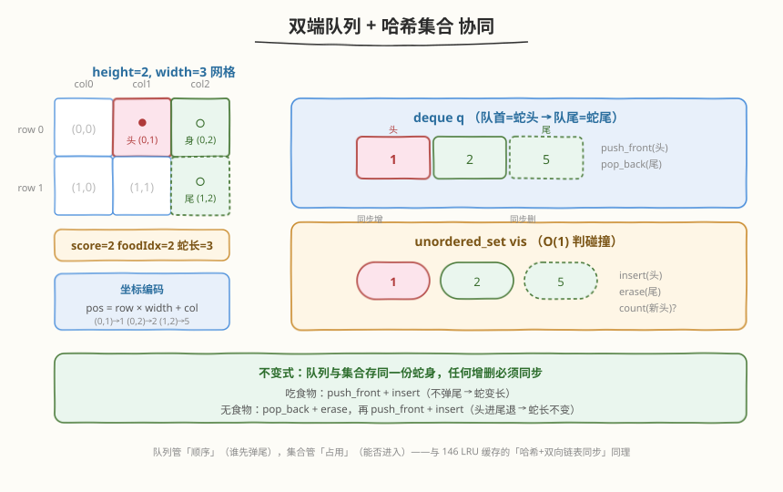
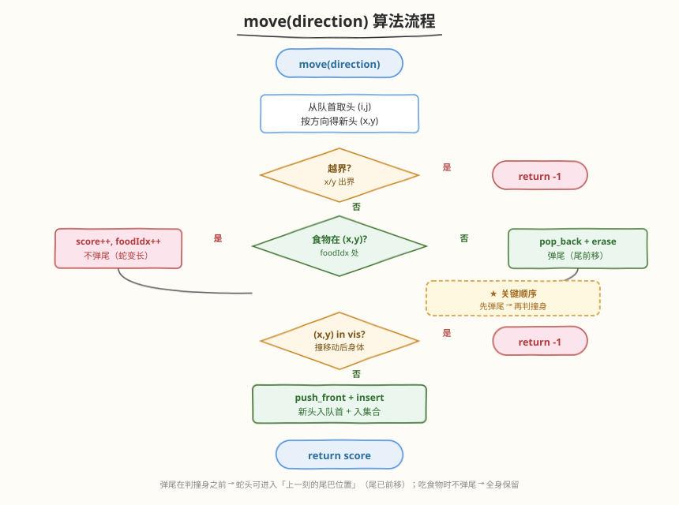
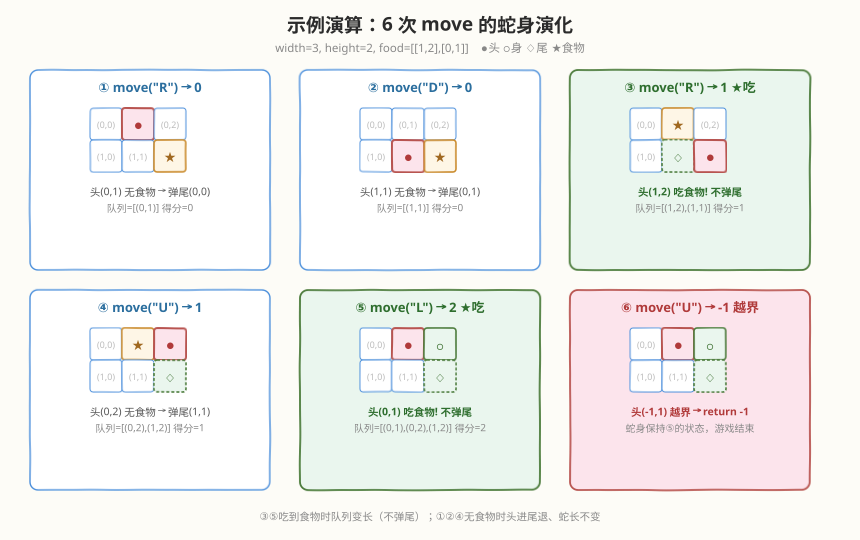

# 贪吃蛇

- **题目名称**：贪吃蛇
- **链接**：[353. 贪吃蛇](https://leetcode.cn/problems/design-snake-game/)
- **难度**：中等
- **标签**：设计、队列、哈希表、模拟

## 1. 题目概述

设计一个在 **`height × width`** 屏幕上运行的贪吃蛇游戏。实现 `SnakeGame` 类：

- `SnakeGame(int width, int height, int[][] food)`：初始化屏幕大小与食物位置序列 `food`，其中 `food[i] = (r_i, c_i)`。蛇初始位于左上角 `(0, 0)`，身长为 1。
- `int move(String direction)`：让蛇朝 `direction`（`"U"/"D"/"L"/"R"`）移动一格，返回移动后的得分；若游戏结束返回 `-1`。

**规则**：

- 食物按 `food` 数组顺序逐一出现，被吃掉后才出现下一个，且保证不会出现在蛇身占据的格子里。
- 蛇吃到食物时身长与得分各 `+1`（蛇尾不动 → 蛇变长）。
- 蛇头**越界**或撞上**移动后的身体** → 游戏结束。

**示例 1**：

```text
输入
["SnakeGame", "move", "move", "move", "move", "move", "move"]
[[3, 2, [[1, 2], [0, 1]]], ["R"], ["D"], ["R"], ["U"], ["L"], ["U"]]
输出
[null, 0, 0, 1, 1, 2, -1]

解释
width=3, height=2, food=[[1,2],[0,1]]，蛇从 (0,0) 出发
move("R") → 0   头到 (0,1)，无食物，尾前移
move("D") → 0   头到 (1,1)，无食物，尾前移
move("R") → 1   头到 (1,2)，吃到 food[0]，尾不动，身长变 2
move("U") → 1   头到 (0,2)，无食物，尾前移
move("L") → 2   头到 (0,1)，吃到 food[1]，尾不动，身长变 3
move("U") → -1  头到 (-1,1)，越界，游戏结束
```

**约束条件**：

- $1 \leq \text{width}, \text{height} \leq 10^4$
- $1 \leq \text{food.length} \leq 50$
- `direction.length == 1`，取值为 `"U"` / `"D"` / `"L"` / `"R"`
- `move` 最多调用 $10^4$ 次

> 💡 本题是经典的**模拟 + 数据结构选型**题。难点不在规则本身，而在于如何 $O(1)$ 地判定「头是否撞身」。若用数组线性扫描身体判重，单次 `move` 退化为 $O(L)$（$L$ = 蛇长）；真正高效的解法是用**双端队列 + 哈希集合**双结构协同——队列维护蛇身顺序（头在队首、尾在队尾），集合提供 $O(1)$ 碰撞查询。与 [355. 设计推特](../0301-0400/355_设计推特.md) 的「哈希 + 堆」双结构设计同源。

---

## 2. 解题思路

### 2.1 暴力思路：数组存蛇身 + 线性扫描判重

用一个 `vector<pair<int,int>>` 存蛇身所有坐标，每次 `move`：

1. 算新头位置。
2. 越界检查。
3. 遍历整个蛇身判断新头是否撞上某节身体 → $O(L)$。
4. 若没撞：头部前插；若没吃到食物则尾部长度不变（弹尾 + 插头）。

问题：判重是 $O(L)$，当蛇很长（理论上 $L$ 可达 `width × height`）且 `move` 调用 $10^4$ 次时效率差。更重要的是，**判重的时机**容易写错——蛇尾会随移动前移，所以「新头能否占据当前尾巴位置」是一个经典的边界陷阱。

> ⚠️ 暴力法最常犯的 bug：先判撞身再弹尾。这样蛇头朝尾巴方向移动时会被误判为「撞身」而结束，但实际上尾巴此时已经前移、原位置已空出。

### 2.2 核心观察：双端队列 + 哈希集合



关键洞察：蛇身是一条**有顺序的序列**，移动时只有**头部前插 + 尾部弹出**两处变化——这恰好是**双端队列**的操作模型。同时，碰撞判定需要 $O(1)$ 查「某格是否被身体占据」，这需要**哈希集合**。两结构协同维护同一份蛇身：

| 结构 | 类型 | 作用 |
|------|------|------|
| `q` | `deque<int>` | 蛇身坐标序列，**队首=蛇头**，**队尾=蛇尾**；前插头/弹尾均为 $O(1)$ |
| `vis` | `unordered_set<int>` | 蛇身占据的格子集合，$O(1)$ 判碰撞 |
| `score` / `foodIdx` | `int` | 得分 / 下一个食物在 `food` 数组中的下标 |

**坐标编码**：把 `(row, col)` 编码为单个整数 `pos = row * width + col`，这样 `unordered_set<int>` 即可，无需手写 `pair` 的哈希函数。解码时 `row = pos / width`，`col = pos % width`。

> 💡 **为什么队列与集合必须同步？** 队列维护「顺序」（谁先弹尾），集合维护「占用」（能否进入）。任何对队列的增删都要同步作用到集合，否则两结构会不一致——这是双结构设计的关键不变式，与 [146. LRU 缓存](../0101-0200/146_LRU缓存.md) 的「哈希 + 双向链表同步」同理。

### 2.3 算法流程图：move 的关键顺序



**`move(direction)` 的五步**（顺序至关重要）：

1. **算新头**：从队首取出当前头 `(i,j)`，按方向得到新头 `(x,y)`。
2. **越界检查**：`x < 0 || x >= height || y < 0 || y >= width` → 返回 `-1`。
3. **食物判定 → 决定是否弹尾**：
   - 若 `foodIdx < food.size()` 且 `(x,y) == food[foodIdx]`：吃到食物，`score++`，`foodIdx++`，**不弹尾**（蛇变长）。
   - 否则：**先弹出队尾**并从 `vis` 中移除（蛇尾前移，原格子释放）。
4. **碰撞检查**：若 `(x,y)` 编码后 **在 `vis` 中** → 返回 `-1`。
5. **入头**：把 `(x,y)` 编码后 `push_front` 到队列、`insert` 到集合，返回 `score`。

> ⚠️ **第 3 步与第 4 步的顺序是本题的灵魂**。必须「先弹尾、后判撞身」：
> - **没吃食物时**，蛇尾前移 → 尾巴原格子被释放 → 蛇头可以安全进入「上一刻的尾巴位置」。若先判撞身再弹尾，这一合法移动会被误判为游戏结束。
> - **吃到食物时**，尾巴不动 → 蛇身整体保留 → 此时若新头落在身体任一格（含原尾巴）都是真碰撞，第 3 步不弹尾，第 4 步自然能查出。
>
> 这个「尾先动」的语义，正是题目「头与**移动后**的身体相撞」的精确实现。

### 2.4 示例演算



以题给示例在 `height=2, width=3` 网格上完整推演（`food=[[1,2],[0,1]]`，蛇头用 ●、身体用 ○、食物用 ★）：

| 步 | 方向 | 新头 | 食物? | 队列（头→尾） | 动作 | 得分 |
|----|------|------|-------|----------------|------|------|
| 初始 | — | (0,0) | — | `[(0,0)]` | 起点，foodIdx=0，food=(1,2) | 0 |
| 1 | R | (0,1) | 否 | `[(0,1)]` | 弹尾(0,0)，入头(0,1) | 0 |
| 2 | D | (1,1) | 否 | `[(1,1)]` | 弹尾(0,1)，入头(1,1) | 0 |
| 3 | R | (1,2) | **是** | `[(1,2),(1,1)]` | 吃 food[0]，不弹尾，入头，foodIdx=1 | 1 |
| 4 | U | (0,2) | 否 | `[(0,2),(1,2)]` | 弹尾(1,1)，入头(0,2) | 1 |
| 5 | L | (0,1) | **是** | `[(0,1),(0,2),(1,2)]` | 吃 food[1]，不弹尾，入头，foodIdx=2 | 2 |
| 6 | U | (-1,1) | — | — | 越界，返回 -1 | -1 |

关键看点：

- **第 3 步**：吃到 `(1,2)` 时**不弹尾**，队列长度从 1 变 2（蛇变长），`vis` 中同时保留 `(1,1)` 与 `(1,2)`。
- **第 5 步**：吃到 `(0,1)` 时同样不弹尾，队列长度变 3。注意此时 `(0,1)` 在吃之前**不在 `vis`** 中（第 4 步已把旧尾 `(1,1)` 弹出），所以第 4 步碰撞检查通过。
- **第 6 步**：新头 `(-1,1)` 越界，直接返回 `-1`，不进入后续步骤。

---

## 3. 参考代码

### C++

```cpp
class SnakeGame {
    int m, n;                       // height, width
    vector<vector<int>> food;
    int score = 0, foodIdx = 0;
    deque<int> q;                   // 队首=蛇头，队尾=蛇尾，存编码后的坐标
    unordered_set<int> vis;         // 蛇身占据的格子，O(1) 判碰撞

    inline int enc(int r, int c) { return r * n + c; }  // (row,col) → int

public:
    SnakeGame(int width, int height, vector<vector<int>>& food) {
        n = width; m = height;
        this->food = food;
        q.push_back(0);             // 初始头在 (0,0)
        vis.insert(0);
    }

    int move(string direction) {
        int p = q.front();
        int i = p / n, j = p % n;
        int x = i, y = j;
        if      (direction == "U") --x;
        else if (direction == "D") ++x;
        else if (direction == "L") --y;
        else                       ++y;   // "R"

        // 1. 越界
        if (x < 0 || x >= m || y < 0 || y >= n) return -1;

        // 2. 食物判定 → 决定是否弹尾（关键顺序：先弹尾再判撞身）
        if (foodIdx < (int)food.size() && x == food[foodIdx][0] && y == food[foodIdx][1]) {
            ++score;
            ++foodIdx;              // 吃到食物，不弹尾，蛇变长
        } else {
            int tail = q.back();
            q.pop_back();
            vis.erase(tail);        // 尾前移，释放原格子
        }

        // 3. 撞身判定
        int cur = enc(x, y);
        if (vis.count(cur)) return -1;

        // 4. 入头
        q.push_front(cur);
        vis.insert(cur);
        return score;
    }
};
```

### Python

```python
from collections import deque


class SnakeGame:
    def __init__(self, width: int, height: int, food: list[list[int]]):
        self.m = height
        self.n = width
        self.food = food
        self.score = 0
        self.food_idx = 0
        self.q = deque([(0, 0)])    # 队首=蛇头，队尾=蛇尾
        self.vis = {(0, 0)}         # 蛇身占据的格子

    def move(self, direction: str) -> int:
        i, j = self.q[0]
        x, y = i, j
        if direction == "U":
            x -= 1
        elif direction == "D":
            x += 1
        elif direction == "L":
            y -= 1
        else:                        # "R"
            y += 1

        # 1. 越界
        if x < 0 or x >= self.m or y < 0 or y >= self.n:
            return -1

        # 2. 食物判定 → 决定是否弹尾（关键顺序：先弹尾再判撞身）
        if (self.food_idx < len(self.food)
                and x == self.food[self.food_idx][0]
                and y == self.food[self.food_idx][1]):
            self.score += 1
            self.food_idx += 1       # 吃到食物，不弹尾，蛇变长
        else:
            self.vis.remove(self.q.pop())  # 尾前移，释放原格子

        # 3. 撞身判定
        if (x, y) in self.vis:
            return -1

        # 4. 入头
        self.q.appendleft((x, y))
        self.vis.add((x, y))
        return self.score
```

> ⚠️ **Python 版用元组 `(row, col)` 直接存集合**：Python 的 `set` 原生支持元组哈希，无需编码。C++ 的 `unordered_set` 不支持 `pair` 哈希（需自定义 hasher），所以用 `row * n + col` 编码成 `int` 更简洁。
>
> **`vis.remove(self.q.pop())` 的原子性**：`pop()` 弹出队尾并返回该坐标，再传给 `vis.remove()`——一行完成「队列弹尾 + 集合移除」的同步，保证两结构一致。

---

## 4. 复杂度分析

| 维度 | 复杂度 | 说明 |
|------|--------|------|
| **`move` 时间** | $O(1)$ | 队首/队尾操作均 $O(1)$；集合 insert / erase / count 均 $O(1)$ 平均；方向判断与编码 $O(1)$ |
| **构造时间** | $O(1)$ | 仅初始化单格蛇身 |
| **空间复杂度** | $O(L)$ | $L$ = 蛇长；队列与集合各存一份蛇身坐标，$L \leq \text{width} \times \text{height}$，且 $L \leq \text{food.length} + 1$ |

> 💡 对比暴力法：暴力 `move` 是 $O(L)$（线性扫描判重）；本方案 $O(1)$。题设 `move` 调用 $10^4$ 次、蛇长最多约 `food.length + 1 ≤ 51`，暴力尚可 AC，但本方案在蛇长极大时（如 `width=height=10^4` 的极端场景）优势显著——这正是「双结构协同」的收益。

---

## 5. 扩展：边界陷阱与生产化思路

### 5.1 「先判撞身」的错误版本

若把第 3、4 步颠倒——先判撞身再弹尾，会发生什么？考虑蛇身 `[(1,2),(1,1)]`（头在 `(1,2)`），执行 `move("D")`：新头 `(2,2)`，无食物。若先判撞身：`(2,2)` 不在 `vis={(1,2),(1,1)}` 中，碰巧通过。但若蛇头朝尾巴方向走（如身长 ≥ 4 时头追尾），**当前尾巴位置在 `vis` 中**，先判撞身会误判为撞身而结束——可实际上尾巴马上要前移、该格已空出。

正确做法永远是**先弹尾（释放格子）再判撞身**，这精确对应题目「头与**移动后**的身体相撞」的措辞。

### 5.2 循环利用蛇身的环形缓冲

当 `width × height` 极大、`move` 调用极多时，`deque` 的内存会随蛇长增长。由于蛇长上界是 `food.length + 1`（每次只吃一颗食物），实际占用有限。但在生产级实现中，可把蛇身坐标存入**固定大小的环形数组**（容量 = 最大蛇长），用头/尾指针代替 `deque`，避免动态扩容——这与 [346. 数据流中的移动平均值](../0301-0400/346_数据流中的移动平均值.md) 的定长窗口环形数组同思路。

> 💡 真实贪吃蛇游戏还会处理「食物不刷新在蛇身上」「方向反转防抖（不能 180° 掉头）」等细节。本题已假设食物不落在蛇身，且方向由外部输入保证，故无需额外处理。

---

## 6. 面试要点

1. **为什么用双端队列 + 哈希集合两个结构，而不是只用一个？**

   - 双端队列擅长**队首前插 + 队尾弹出**（$O(1)$），完美匹配蛇「头进尾退」的移动模型，但线性查找某格是否被占需 $O(L)$。
   - 哈希集合擅长 $O(1)$ **判存在**，但无法维护顺序、也无法知道该弹哪个尾。
   - 两者协同：队列管顺序、集合管占用，增删时同步——用 $O(L)$ 额外空间换取 `move` 的 $O(1)$ 时间。

2. **`move` 中「先弹尾再判撞身」的顺序为什么不能反？**

   - 蛇没吃食物时尾巴会前移，**原尾巴格子被释放**，蛇头可以进入这一格。若先判撞身，该格仍在 `vis` 中，会误判为撞身 → 游戏错误结束。
   - 先弹尾（从 `vis` 移除原尾）再判撞身，精确实现题目「头与**移动后**的身体相撞」的语义。吃到食物时不弹尾，身体整体保留，撞身判定自然覆盖全身。

3. **坐标为什么编码成 `row * width + col`？**

   - 让 `unordered_set<int>` 替代 `unordered_set<pair<int,int>>`，免去为 `pair` 手写哈希函数。`row * width + col` 是双射（因为 `col ∈ [0, width)`），解码 `row = pos / width`、`col = pos % width`。Python 的 `set` 原生支持元组，可直接存 `(row, col)` 无需编码。

4. **吃到食物时蛇变长，队列与集合分别怎么变？**

   - 队列：只 `push_front` 新头，**不 `pop_back` 尾** → 长度 +1。
   - 集合：只 `insert` 新头，**不 `erase` 旧尾** → 大小 +1。
   - 两结构同步增长，蛇长 = 队列长度 = `score + 1`。

5. **食物用完（`foodIdx == food.size()`）后蛇还能继续移动吗？**

   - 能。此时第 2 步食物判定恒为否，每次 `move` 都走「弹尾 + 入头」分支，蛇长保持不变，直到越界或撞身才结束。代码无需特判 `foodIdx` 越界——`foodIdx < food.size()` 的守卫已覆盖。

---

## 7. 同类练习题

- [355. 设计推特](https://leetcode.cn/problems/design-twitter/)（[题解](../0301-0400/355_设计推特.md)）：同区间的设计题，「哈希 + 堆」双结构协同，对比 `move` 的「队列 + 集合」选型差异
- [348. 设计井字棋](https://leetcode.cn/problems/design-tic-tac-toe/)（[题解](../0301-0400/348_设计井字棋.md)）：网格上的设计题，用计数数组 $O(1)$ 判胜，对比「网格 + 状态维护」的设计套路
- [346. 数据流中的移动平均值](https://leetcode.cn/problems/moving-average-from-data-stream/)（[题解](../0301-0400/346_数据流中的移动平均值.md)）：定长窗口的双端队列设计，与本题「头进尾退」的队列操作同源，对比「定长滑动」与「变长贪吃蛇」
- [146. LRU 缓存](https://leetcode.cn/problems/lru-cache/)（[题解](../0101-0200/146_LRU缓存.md)）：「哈希 + 双向链表」双结构同步的经典设计，与本题「队列 + 集合」同步同思想——两结构协同维护同一份状态
- [352. 将数据流变为多个不相交区间](https://leetcode.cn/problems/data-stream-as-disjoint-intervals/)（[题解](../0301-0400/352_将数据流变为多个不相交区间.md)）：流式数据结构设计题，对比「有序映射维护区间」与「队列维护蛇身」的选型取舍
