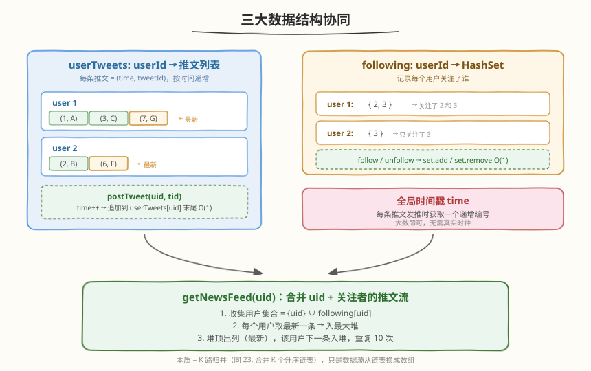
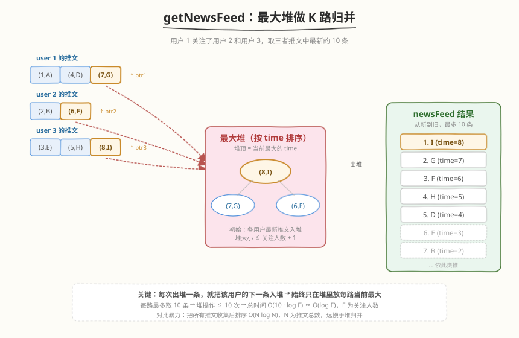

# 设计推特

- **题目名称**：设计推特
- **链接**：[355. 设计推特](https://leetcode.cn/problems/design-twitter/)
- **难度**：中等
- **标签**：设计、哈希表、堆（优先队列）

## 1. 题目概述

设计一个简化版的推特，支持以下四个操作：

- `postTweet(userId, tweetId)`：发布一条推文。
- `getNewsFeed(userId)`：获取该用户的**最近 10 条推文** ID，推文来自**用户自己**及其**关注的人**，按从新到旧排列。
- `follow(followerId, followeeId)`：`followerId` 关注 `followeeId`。
- `unfollow(followerId, followeeId)`：`followerId` 取消关注 `followeeId`。

**示例 1**：

```text
输入
["Twitter", "postTweet", "getNewsFeed", "follow", "getNewsFeed", "unfollow", "getNewsFeed"]
[[], [1, 5], [1], [1, 2], [1], [1, 2], [1]]
输出
[null, null, [5], null, [5, 2], null, [5]]

解释
Twitter twitter = new Twitter();
twitter.postTweet(1, 5);     // 用户 1 发推 5
twitter.getNewsFeed(1);      // → [5]，用户 1 没关注任何人，只有自己的推文
twitter.follow(1, 2);        // 用户 1 关注用户 2
twitter.getNewsFeed(1);      // → [5, 2]，现在信息流包含 1 和 2 的推文
twitter.unfollow(1, 2);      // 用户 1 取消关注用户 2
twitter.getNewsFeed(1);      // → [5]，又只剩自己的推文
```

**约束条件**：

- `1 <= userId, tweetId, followerId, followeeId <= 500`
- 所有方法总调用次数最多 $3 \times 10^4$ 次

> 💡 本题是经典的**系统设计 + 数据结构选型**题。`postTweet`/`follow`/`unfollow` 都是简单 $O(1)$ 操作；真正的考点在 `getNewsFeed`——要把**多个用户各自有序的推文流**合并取 Top-10，本质是 **K 路归并**问题，与 [23. 合并 K 个升序链表](https://leetcode.cn/problems/merge-k-sorted-lists/) 同源。

---

## 2. 解题思路

### 2.1 暴力思路：全量收集 + 排序

`getNewsFeed` 最直觉的做法：把用户自己 + 所有关注者的**全部推文**收集到一个列表，按时间降序排序，取前 10 条。

```text
收集推文：遍历所有关注者 →  O(F) 次，每次拷贝该用户全部推文
排序：    O(N log N)   N = 收集到的推文总数
取前 10： O(10)
```

问题：某用户可能有**上千条推文**，但只需 10 条。全量收集 + 排序浪费巨大——大部分排序结果被丢弃。

> ⚠️ 暴力法的时间复杂度为 $O(N \log N)$，其中 $N$ 是所有相关用户的推文总数。当某个用户推文很多时，效率很差。

### 2.2 核心观察：最大堆做 K 路归并



关键洞察：**每个用户的推文列表天然按时间有序**（因为 `postTweet` 顺序追加），所以 `getNewsFeed` 本质是把 $K$ 个有序列表合并取前 10——这正是**最大堆 K 路归并**的标准场景。

三个数据结构：

| 结构 | 类型 | 作用 |
|------|------|------|
| `userTweets` | `HashMap<userId, List<(time, tweetId)>>` | 每个用户的推文列表，按 `time` 递增（追加即有序） |
| `following` | `HashMap<userId, HashSet<userId>>` | 每个用户关注了谁，$O(1)$ 增删查 |
| `time` | 全局整数计数器 | 每条推文发推时获取递增编号，充当时间戳 |

> 💡 不用真实时间戳——用一个**全局自增整数**即可。推文只关心相对先后，不关心绝对时间。



**`getNewsFeed` 的堆归并**：

1. 收集用户集合 `users = {userId} ∪ following[userId]`。
2. 对每个用户，取其推文列表**最后一条**（最新），入最大堆（按 `time` 排序）。堆元素 = `(time, userId, index)`。
3. 循环最多 10 次：弹出堆顶（当前全局最新），加入结果；若该用户还有更早的推文（`index - 1 ≥ 0`），把下一条入堆。

> 💡 为什么每次只入一条？因为堆里只需维护**每路当前的最大值**。弹出一路的最大值后，该路的次大值才有可能成为新的全局最大——此时才需要入堆。这保证了堆大小始终 $\leq K$（关注人数 + 1），每轮 $O(\log K)$。

### 2.3 算法流程图


**`postTweet(userId, tweetId)`**：
1. `time++`。
2. `userTweets[userId].push_back({time, tweetId})`。

**`follow(followerId, followeeId)`**：`following[followerId].insert(followeeId)`。

**`unfollow(followerId, followeeId)`**：`following[followerId].erase(followeeId)`。

**`getNewsFeed(userId)`**：
1. 收集 `users = {userId} ∪ following[userId]`。
2. 建最大堆，每个有推文的用户取末尾元素入堆。
3. 循环 ≤ 10 次：堆顶出列 → 加入结果；该用户 `index--`，若 ≥ 0 则下一条入堆。
4. 返回结果。

### 2.4 示例演算


以一个完整场景演示：

| 操作 | `userTweets` 变化 | `following` 变化 | 说明 |
|------|-------------------|-------------------|------|
| `postTweet(1, A)` | 1: `[(1,A)]` | — | time=1 |
| `postTweet(2, B)` | 2: `[(2,B)]` | — | time=2 |
| `postTweet(1, D)` | 1: `[(1,A),(3,D)]` | — | time=3 |
| `postTweet(3, E)` | 3: `[(4,E)]` | — | time=4 |
| `follow(1, 2)` | — | 1: `{2}` | 用户 1 关注 2 |
| `follow(1, 3)` | — | 1: `{2, 3}` | 用户 1 关注 3 |
| `postTweet(3, H)` | 3: `[(4,E),(5,H)]` | — | time=5 |
| `postTweet(2, F)` | 2: `[(2,B),(6,F)]` | — | time=6 |
| `postTweet(1, G)` | 1: `[(1,A),(3,D),(7,G)]` | — | time=7 |
| `postTweet(3, I)` | 3: `[(4,E),(5,H),(8,I)]` | — | time=8 |

此时 `getNewsFeed(1)` 的堆归并过程：

| 轮次 | 堆顶 (time) | 出列推文 | 该用户下一条入堆 |
|------|-------------|----------|------------------|
| 1 | 8 | **I** (user 3) | user 3 → (5, H) |
| 2 | 7 | **G** (user 1) | user 1 → (3, D) |
| 3 | 6 | **F** (user 2) | user 2 → (2, B) |
| 4 | 5 | **H** (user 3) | user 3 → (4, E) |
| 5 | 4 | **E** (user 3) | user 3 无更多 |
| 6 | 3 | **D** (user 1) | user 1 → (1, A) |
| 7 | 2 | **B** (user 2) | user 2 无更多 |
| 8 | 1 | **A** (user 1) | user 1 无更多 |

结果 = `[I, G, F, H, E, D, B, A]`（8 条，不足 10）。

---

## 3. 参考代码

### C++

```cpp
class Twitter {
    struct Tweet {
        int time;
        int tweetId;
    };
    int time = 0;
    unordered_map<int, vector<Tweet>> userTweets;   // userId → 推文列表
    unordered_map<int, unordered_set<int>> following; // userId → 关注集合

public:
    Twitter() {}

    void postTweet(int userId, int tweetId) {
        userTweets[userId].push_back({++time, tweetId});
    }

    vector<int> getNewsFeed(int userId) {
        auto cmp = [](const auto& a, const auto& b) {
            return a.time < b.time;   // 最大堆：time 大的优先
        };
        priority_queue<tuple<int, int, int>, vector<tuple<int, int, int>>, decltype(cmp)>
            pq(cmp);
        // tuple = (time, userId, index)

        if (!userTweets[userId].empty()) {
            int idx = userTweets[userId].size() - 1;
            pq.push({userTweets[userId][idx].time, userId, idx});
        }
        for (int f : following[userId]) {
            if (!userTweets[f].empty()) {
                int idx = userTweets[f].size() - 1;
                pq.push({userTweets[f][idx].time, f, idx});
            }
        }

        vector<int> feed;
        while (!pq.empty() && (int)feed.size() < 10) {
            auto [t, uid, idx] = pq.top();
            pq.pop();
            feed.push_back(userTweets[uid][idx].tweetId);
            if (idx > 0) {
                pq.push({userTweets[uid][idx - 1].time, uid, idx - 1});
            }
        }
        return feed;
    }

    void follow(int followerId, int followeeId) {
        if (followerId != followeeId) {
            following[followerId].insert(followeeId);
        }
    }

    void unfollow(int followerId, int followeeId) {
        following[followerId].erase(followeeId);
    }
};
```

### Python

```python
import heapq


class Twitter:
    def __init__(self):
        self.time = 0
        self.user_tweets: dict[int, list[tuple[int, int]]] = {}  # userId → [(time, tweetId)]
        self.following: dict[int, set[int]] = {}                 # userId → {followeeId}

    def postTweet(self, userId: int, tweetId: int) -> None:
        self.time += 1
        self.user_tweets.setdefault(userId, []).append((self.time, tweetId))

    def getNewsFeed(self, userId: int) -> list[int]:
        heap = []  # 最大堆 → 用负 time 模拟
        users = {userId} | self.following.get(userId, set())

        for uid in users:
            tweets = self.user_tweets.get(uid, [])
            if tweets:
                time, _ = tweets[-1]
                heapq.heappush(heap, (-time, uid, len(tweets) - 1))

        feed = []
        while heap and len(feed) < 10:
            neg_time, uid, idx = heapq.heappop(heap)
            feed.append(self.user_tweets[uid][idx][1])
            if idx > 0:
                prev_time = self.user_tweets[uid][idx - 1][0]
                heapq.heappush(heap, (-prev_time, uid, idx - 1))
        return feed

    def follow(self, followerId: int, followeeId: int) -> None:
        if followerId != followeeId:
            self.following.setdefault(followerId, set()).add(followeeId)

    def unfollow(self, followerId: int, followeeId: int) -> None:
        self.following.get(followerId, set()).discard(followeeId)
```

> ⚠️ **Python 最大堆技巧**：`heapq` 是最小堆，用 `-time` 代替 `time` 即可模拟最大堆。C++ 直接用 `priority_queue` + 自定义比较器。
>
> **`follow` 时加 `followerId != followeeId` 守卫**：避免用户关注自己导致 `getNewsFeed` 中同一用户的推文入堆两次（虽然题目不要求，但这是好习惯）。

---

## 4. 复杂度分析

| 维度 | 复杂度 | 说明 |
|------|--------|------|
| **`postTweet` 时间** | $O(1)$ | 计数器自增 + 数组尾插 |
| **`follow` / `unfollow` 时间** | $O(1)$ | 哈希集合 insert / erase |
| **`getNewsFeed` 时间** | $O(10 \log F)$ | $F$ = 关注人数 + 1；初始入堆 $O(F)$，每轮出/入堆 $O(\log F)$，共 ≤ 10 轮 |
| **空间复杂度** | $O(T + R)$ | $T$ = 推文总数，$R$ = 关注关系总数 |

> 💡 `getNewsFeed` 的实际开销几乎恒定——堆大小 $\leq F$（最多 501），循环 ≤ 10 次，单次调用 $O(\log F)$ 级别。对比暴力法的 $O(N \log N)$（$N$ 为推文总数），堆归并在**推文总量大但只需 Top-10** 的场景下优势明显。

---

## 5. 扩展：推文列表截断优化

如果某用户发了**海量推文**（如几万条），`userTweets[userId]` 的数组会无限增长。由于 `getNewsFeed` 每次最多取 10 条、且最多 $F$ 路归并，每个用户**最多被取走 10 条推文**。因此可以给每个用户的推文列表设一个上限：

- 当 `userTweets[userId].size() > MAX_FEED_SIZE`（如 10 × 预估最大关注人数，或直接取一个合理常数如 5000）时，丢弃最早的推文。
- 这不影响 `getNewsFeed` 的正确性——只要列表中保留的推文数 $\geq 10$，归并时能取到的最大条数就是 10。

> 💡 在真实系统中，推文存储在数据库（如 Cassandra），不会把全部推文放在内存。本题的数组模拟是简化版，面试时可以主动提「生产环境推文存在 DB + 缓存热数据」来展示系统设计视野。

---

## 6. 面试要点

1. **`getNewsFeed` 为什么用堆而不是直接排序？**

   - 排序需要把 $F$ 个用户的所有推文（共 $N$ 条）收集后整体排序，$O(N \log N)$。但只需 10 条，绝大部分排序浪费。堆归并只维护每路当前最大值，堆大小 $\leq F$，每轮 $O(\log F)$，总共 10 轮 → $O(10 \log F)$，远优于 $O(N \log N)$。

2. **堆里存什么？为什么要存 `(time, userId, index)` 三元组？**

   - `time` 决定堆的优先级（最大堆，time 越大越优先出堆）。`userId` 和 `index` 用于在弹出后定位「该用户的下一条推文」——`index - 1` 即上一条（更旧的推文）。只有同时知道用户和下标才能继续取该路的后续推文。

3. **为什么用全局自增 `time` 而不用真实时间戳？**

   - 推文只关心**相对先后**，不关心绝对时间。全局自增整数天然保证「后发的 time 更大」，比较简单且无并发问题。真实系统用 `long` 时间戳，面试无需考虑。

4. **用户没关注任何人时 `getNewsFeed` 怎么处理？**

   - `following[userId]` 为空集，用户集合只有 `{userId}`。堆里只入用户自己的最新推文，归并退化为遍历自己的推文列表取前 10 条。代码无需特殊处理，天然覆盖。

5. **如果要求支持「删除推文」功能，怎么改？**

   - 删除推文会破坏推文列表的紧凑性。简单做法是在 `Tweet` 结构中加 `deleted` 标记，`getNewsFeed` 归并时跳过已删除的条目（出堆后检查 `deleted`，若已删则继续出堆不入结果）。更高效的做法是用链表代替数组，删除时 $O(1)$ 摘节点，但归并逻辑更复杂。

---

## 7. 同类练习题

- [23. 合并 K 个升序链表](https://leetcode.cn/problems/merge-k-sorted-lists/)（[题解](../0001-0100/23_合并K个升序链表.md)）：堆做 K 路归并的母题，本题 `getNewsFeed` 即此模板的设计变体
- [146. LRU 缓存](https://leetcode.cn/problems/lru-cache/)（[题解](../0101-0200/146_LRU缓存.md)）：同样是「哈希表 + 另一结构」的 $O(1)$ 设计题，对比选型差异
- [380. O(1) 时间插入、删除和获取随机元素](https://leetcode.cn/problems/insert-delete-getrandom-o1/)（[题解](../0301-0400/380_O1时间插入删除和获取随机元素.md)）：设计题家族，哈希表 + 数组协同
- [347. 前 K 个高频元素](https://leetcode.cn/problems/top-k-frequent-elements/)（[题解](../0301-0400/347_前K个高频元素.md)）：同样是「堆取 Top-K」套路，对比「堆维护前 K」与「堆 K 路归并取前 K」的异同
- [958. 二叉树的完全性检验](https://leetcode.cn/problems/check-completeness-of-a-binary-tree/)（[题解](../0901-1000/958_二叉树的完全性检验.md)）：设计题思维迁移——用队列做层序判定
