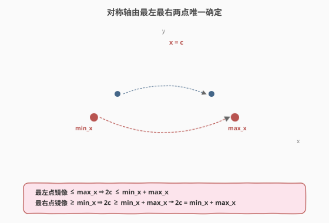
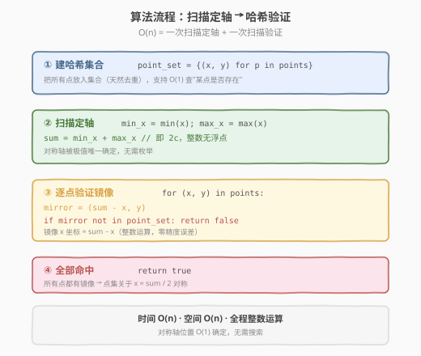
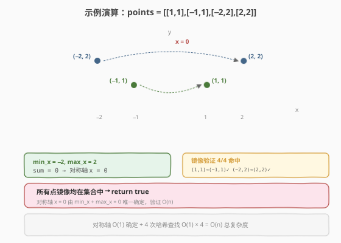

# 直线镜像

- **题目名称**：直线镜像
- **链接**：[356. 直线镜像](https://leetcode.cn/problems/line-reflection/)
- **难度**：中等
- **标签**：哈希表、数学、几何

## 1. 题目概述

给定二维平面上的 `n` 个点 `points`，其中 `points[i] = [xi, yi]`。判断是否存在一条**平行于 y 轴**的直线（即形如 `x = c` 的竖直线），使得这组点关于该直线**对称**。存在返回 `true`，否则返回 `false`。

**示例 1**：

```text
输入：points = [[1,1],[-1,1]]
输出：true
解释：直线 x = 0 为对称轴。点 (1,1) 的镜像 (−1,1) 在集合中，反之亦然。
```

**示例 2**：

```text
输入：points = [[1,1],[-1,1],[-2,2],[2,2]]
输出：true
解释：直线 x = 0 为对称轴。每个点 (x,y) 都有镜像 (−x,y) 在集合中。
```

**约束条件**：

- `n == points.length`
- `1 <= n <= 10^4`
- `points[i].length == 2`
- `-10^8 <= xi, yi <= 10^8`

> 💡 本题是**几何 + 哈希集合**的经典组合。核心洞察是：对称轴的位置**不是搜索出来的，而是被最左与最右两点"钉死"的**——只需一次 min/max 扫描确定候选轴，再用一次哈希查找验证所有点都有镜像即可，全程 $O(n)$。

---

## 2. 解题思路

### 2.1 暴力思路：枚举对称轴

最直觉的做法：枚举所有可能的对称轴位置 `c`（每个 `c = (xi + xj) / 2`），对每个候选轴遍历所有点检查镜像是否存在。

```text
候选轴数量：O(n²) 个 (xi + xj) / 2 组合
每个候选轴验证：O(n) 次哈希查找
总复杂度：O(n³)
```

问题：候选轴过多，且浮点数 `c` 难以作为哈希键（精度问题）。

> ⚠️ 暴力法的根本缺陷在于"不知道对称轴在哪"，盲目枚举所有可能。但其实对称轴的位置是被点集的**极值**唯一决定的——这是本题的关键观察。

### 2.2 核心观察：对称轴被 min_x + max_x 唯一确定



**关键洞察**：若存在对称轴 `x = c`，则对点集中任意点 `(x, y)`，其镜像 `(2c − x, y)` 也必在点集中。特别地：

- 对最左点 `(min_x, y₁)`：其镜像 `(2c − min_x, y₁)` 必在集合中，且 $2c - \min_x \le \max_x$（否则会超出最右）。
- 对最右点 `(max_x, y₂)`：其镜像 `(2c − max_x, y₂)` 必在集合中，且 $2c - \max_x \ge \min_x$（否则会低于最左）。

两式联立：

$$
2c - \min_x \le \max_x \;\Rightarrow\; 2c \le \min_x + \max_x
$$

$$
2c - \max_x \ge \min_x \;\Rightarrow\; 2c \ge \min_x + \max_x
$$

因此：

$$
\boxed{2c = \min_x + \max_x}
$$

即**对称轴位置唯一确定**：$c = (\min_x + \max_x) / 2$。无需枚举，一次扫描即可拿到候选轴。

> 💡 这就把"找对称轴"问题转化成了"验证候选轴"问题——前者搜索空间 $O(n^2)$，后者只需 $O(n)$ 哈希查找。**问题的难度从搜索降到了验证**。

### 2.3 算法流程图



**完整步骤**：

1. **建集合**：把所有点 `(x, y)` 放入哈希集合 `point_set`（去重，题目允许重复点但对称性只关心存在性）。
2. **定轴**：扫描所有点求 `min_x`、`max_x`，计算 `sum = min_x + max_x`（即 `2c`）。
3. **验证**：对集合中每个点 `(x, y)`，检查镜像 `(sum − x, y)` 是否在 `point_set` 中。
4. 全部命中 → `true`；任一缺失 → `false`。

> ⚠️ **避免浮点**：直接用 `2c = min_x + max_x` 作为"加倍的对称轴位置"，镜像公式为 `x_mirror = sum − x`，全程整数运算。若用 $c = (\min_x + \max_x) / 2$，当 `min_x + max_x` 为奇数时 `c` 是 `.5` 小数，哈希键易出错。

### 2.4 示例演算



以 `points = [[1,1],[-1,1],[-2,2],[2,2]]` 为例：

**第 1 步：扫描求 min_x / max_x**

| 点 | x | y |
|----|----|----|
| (1, 1) | 1 | 1 |
| (−1, 1) | −1 | 1 |
| (−2, 2) | −2 | 2 |
| (2, 2) | 2 | 2 |

- `min_x = −2`，`max_x = 2`
- `sum = min_x + max_x = 0` → 对称轴 `x = 0`

**第 2 步：哈希验证每个点**

| 原点 (x, y) | 镜像 (sum−x, y) = (−x, y) | 是否在集合 |
|-------------|---------------------------|------------|
| (1, 1) | (−1, 1) | ✅ |
| (−1, 1) | (1, 1) | ✅ |
| (−2, 2) | (2, 2) | ✅ |
| (2, 2) | (−2, 2) | ✅ |

全部命中 → 返回 `true`。

> 💡 注意镜像关系是**双向**的：点 A 的镜像是 B，则 B 的镜像也是 A。所以验证时每对点会被检查两次，但哈希查找 $O(1)$，不影响复杂度。也可以优化为只检查 $x < c$ 一侧的点，但代码更复杂、收益不大。

---

## 3. 参考代码

### C++

```cpp
#include <vector>
#include <unordered_map>
#include <unordered_set>
#include <algorithm>
using namespace std;

class Solution {
  public:
    bool isReflected(vector<vector<int>>& points) {
        // point_set: x -> 该 x 列上所有 y 的集合
        unordered_map<int, unordered_set<int>> point_set;
        int min_x = points[0][0], max_x = points[0][0];
        for (const auto& p : points) {
            int x = p[0], y = p[1];
            point_set[x].insert(y);
            min_x = min(min_x, x);
            max_x = max(max_x, x);
        }
        int sum = min_x + max_x;  // 2c，范围 [-2*10^8, 2*10^8] 不溢出 int
        for (const auto& p : points) {
            int x = p[0], y = p[1];
            int mirror_x = sum - x;
            auto it = point_set.find(mirror_x);
            if (it == point_set.end() || !it->second.count(y)) return false;
        }
        return true;
    }
};
```

### Python

```python
class Solution:
    def isReflected(self, points: list[list[int]]) -> bool:
        point_set: set[tuple[int, int]] = set()
        min_x = float('inf')
        max_x = float('-inf')
        for x, y in points:
            point_set.add((x, y))
            if x < min_x:
                min_x = x
            if x > max_x:
                max_x = x
        total = min_x + max_x  # 2c
        for x, y in points:
            if (total - x, y) not in point_set:
                return False
        return True
```

> ⚠️ **C++ 哈希键选型**：用 `unordered_map<int, unordered_set<int>>`（x → y 集合）比把 `(x, y)` 编码成 `long long` 更直观可读，且 `int` 范围足够（`min_x + max_x` ∈ $[-2 \times 10^8, 2 \times 10^8]$，`mirror_x` ∈ $[-3 \times 10^8, 3 \times 10^8]$，均不溢出 `int`）。Python 直接用元组 `(x, y)` 作集合元素，最简洁。
>
> **重复点**：C++ 的 `unordered_set` 与 Python 的 `set` 天然去重，验证时查存在性即可，重复点不影响判定。

---

## 4. 复杂度分析

| 维度 | 复杂度 | 说明 |
|------|--------|------|
| **时间复杂度** | $O(n)$ | 一次扫描建集合 + 求 min/max $O(n)$，一次扫描验证 $O(n)$，每次哈希查找均摊 $O(1)$ |
| **空间复杂度** | $O(n)$ | 哈希集合存储所有点 |
| **最优时间** | $O(n)$ | 至少需访问每个点一次，$O(n)$ 为该问题下界 |

> 💡 本题的最优解就是 $O(n)$——对称轴位置被极值唯一确定，无需二分或枚举。任何高于 $O(n)$ 的解法都未充分利用"轴由极值钉死"这一性质。

---

## 5. 扩展：为什么不能用浮点对称轴？

若直接用 $c = (\min_x + \max_x) / 2.0$ 作为对称轴位置，再算镜像 $x_{\text{mirror}} = 2c - x$：

- 当 `min_x + max_x` 为**偶数**时 `c` 是整数，浮点表示精确。
- 当 `min_x + max_x` 为**奇数**时 $c = k + 0.5$，`2 * c - x` 在浮点中可能因舍入误差变成 $k - x + 0.4999\ldots$，哈希查找失败。

**正确做法**：全程用整数 `sum = min_x + max_x`（即 `2c`），镜像公式 $x_{\text{mirror}} = \text{sum} - x$ 全是整数运算，零误差。

> 💡 这是"避免浮点"思想的典型应用——与 [149. 直线上最多的点数](../0101-0200/149_直线上最多的点数.md) 用 GCD 化简分数代替浮点斜率是同一思路：**能用整数精确表示就别用浮点**。

---

## 6. 面试要点

1. **对称轴为什么一定等于 $(\min_x + \max_x) / 2$？**

   - 若对称轴 $x = c$ 存在，最左点 $(\min_x, y_1)$ 的镜像 $(2c - \min_x, y_1)$ 必在集合中，而该镜像 x 坐标不超过 $\max_x$，故 $2c \le \min_x + \max_x$。同理最右点的镜像给出 $2c \ge \min_x + \max_x$。两者联立即得 $2c = \min_x + \max_x$。

2. **为什么用 $2c = \min_x + \max_x$ 而不是 $c = (\min_x + \max_x) / 2$？**

   - 当 `min_x + max_x` 为奇数时 $c$ 是 `.5` 小数，浮点哈希键易出错。直接用整数 `sum = min_x + max_x` 作为"加倍对称轴"，镜像公式 $\text{sum} - x$ 全程整数，零精度风险。

3. **重复点如何处理？**

   - 题目允许重复点，但对称性只关心"某坐标是否有点"。把点放入 `unordered_set` 天然去重，验证时查集合即可。重复点不影响 min/max，也不影响镜像存在性判定。

4. **如果所有点 x 坐标相同（全在一条竖线上）怎么办？**

   - $\min_x = \max_x$，$\text{sum} = 2 \cdot \min_x$，每个点的镜像 $(\text{sum} - x, y) = (\min_x, y)$ 就是自身，必然在集合中 → 返回 `true`。这是合理的：一条竖线关于自身对称。代码无需特判，天然覆盖。

5. **能否只验证一侧（$x < c$）的点来减半工作量？**

   - 可以。只遍历 $x < c$（或 $x > c$）的点，检查镜像是否在集合。但需处理 $x = c$（在轴上）的点——它们自身即镜像，无需检查。优化后常数减半，但代码复杂度增加，面试中提一句即可。

> 💡 **一句话总结**：本题的精髓是"**把搜索问题降为验证问题**"——对称轴位置由极值唯一确定，$O(n)$ 验证即可。配合"整数加倍避免浮点"的技巧，是几何 + 哈希的优雅组合。

---

## 7. 同类练习题

- [149. 直线上最多的点数](https://leetcode.cn/problems/max-points-on-a-line/)（[题解](../0101-0200/149_直线上最多的点数.md)）：同样"几何 + 哈希 + 避免浮点"思想，用 GCD 化简分数代替浮点斜率
- [447. 回旋镖的数量](https://leetcode.cn/problems/number-of-boomerangs/)：固定点按距离分组，哈希表统计几何对称关系
- [1. 两数之和](https://leetcode.cn/problems/two-sum/)（[题解](../0001-0100/1_两数之和.md)）：哈希表"固定一个查匹配"的母题，本题镜像查找是其几何版变体
- [352. 将数据流变为多个不相交区间](https://leetcode.cn/problems/data-stream-as-disjoint-intervals/)（[题解](../0301-0400/352_将数据流变为多个不相交区间.md)）：同样用哈希集合维护点/区间存在性，$O(1)$ 查邻居
