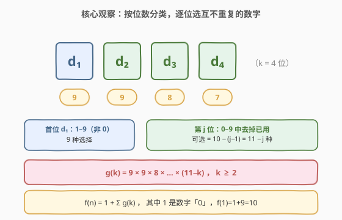
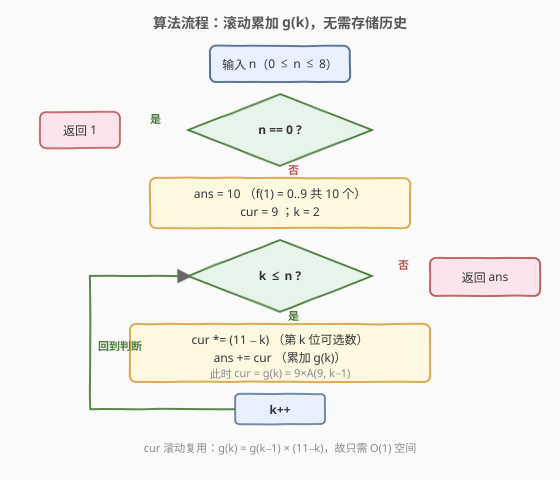
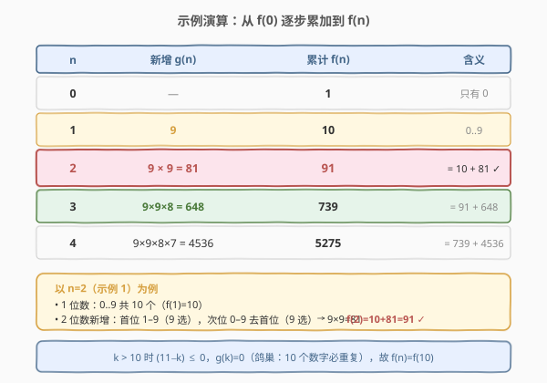

# 统计各位数字都不同的数字个数

- **题目名称**：统计各位数字都不同的数字个数
- **链接**：[357. 统计各位数字都不同的数字个数](https://leetcode.cn/problems/count-numbers-with-unique-digits/)
- **难度**：中等
- **标签**：数学、动态规划、回溯、组合计数

## 1. 题目概述

给你一个整数 `n`，统计并返回各位数字都不同的数字 `x` 的个数，其中 $0 \le x < 10^n$。

**示例 1**：

```text
输入：n = 2
输出：91
解释：答案应为除去 11、22、33、44、55、66、77、88、99 外，在 0 ≤ x < 100 范围内的所有数字。
```

**示例 2**：

```text
输入：n = 0
输出：1
```

**约束条件**：

- $0 \le n \le 8$

---

## 2. 解题思路

### 2.1 暴力思路

最直白的做法：枚举 $x$ 从 $0$ 到 $10^n - 1$，逐个检查十进制各位是否互不相同。检查需要 $O(n)$，总数 $10^n$ 个，总时间 $O(n \cdot 10^n)$。当 $n=8$ 时约 $8 \times 10^8$ 次操作，必然超时。

> ⚠️ 暴力枚举的浪费在于：它把「合法」与「非法」的数字一视同仁地生成，再事后过滤。实际上各位互不相同是一个**结构约束**，可以在生成阶段直接剪枝——这正是组合计数的切入点。

### 2.2 核心观察：按位数分类，逐位选互不重复的数字

把 $[0, 10^n)$ 里的数按**位数** $k$ 分类（$k=1$ 对应 $0$ 到 $9$，$k=2$ 对应 $10$ 到 $99$，依此类推）。数字 $0$ 单独算 1 个。对 $k \ge 1$ 位的正整数，从高位到低位逐位选择：

- **首位** $d_1$：不能是 $0$（否则位数降低），可选 $1$–$9$，共 **9** 种。
- **第 $j$ 位** $d_j$（$j \ge 2$）：可选 $0$–$9$ 中**未被前 $j-1$ 位用过**的，共 $10 - (j-1) = 11 - j$ 种。



由此得到 $k$ 位数（首位非零）各位互不相同的方案数：

$$g(k) = 9 \times \prod_{i=0}^{k-2}(9 - i) = 9 \times 9 \times 8 \times \cdots \times (11 - k), \quad k \ge 2$$

特别地 $g(1) = 9$（即 $1$–$9$；数字 $0$ 不在此列，单独计入总数）。设 $f(n)$ 为题目的答案，则：

$$f(n) = 1 + \sum_{k=1}^{n} g(k)$$

其中常数 $1$ 对应数字 $0$。于是 $f(0) = 1$，$f(1) = 1 + 9 = 10$，$f(2) = 10 + 9\times 9 = 91$，与示例 1 吻合。

> 💡 **为什么按位数分类有效**：位数 $k$ 一旦确定，「首位非零」与「后续位不重复」两个约束天然解耦，每位可选数只依赖已用个数，与具体选了哪些数字无关——这是排列计数的标志特征，直接套 $A(n, r)$ 模型即可，无需 DP 状态记忆。

### 2.3 算法流程图

注意到 $g(k)$ 与 $g(k-1)$ 之间只差一个因子 $(11-k)$：$g(k) = g(k-1) \times (11-k)$。因此不必每轮重算整个乘积，用一个滚动变量 `cur` 即可，空间 $O(1)$。



### 2.4 示例演算

下表从 $f(0)$ 逐位累加到 $f(4)$，重点对照示例 1（$n=2 \Rightarrow 91$）：



| n | 新增 $g(n)$ | 累计 $f(n)$ | 推导 |
|---|------------|------------|------|
| 0 | — | 1 | 只有 $0$ |
| 1 | 9 | 10 | $1$–$9$ |
| 2 | $9 \times 9 = 81$ | 91 | $10 + 81$ |
| 3 | $9 \times 9 \times 8 = 648$ | 739 | $91 + 648$ |
| 4 | $9 \times 9 \times 8 \times 7 = 4536$ | 5275 | $739 + 4536$ |

> ⚠️ **上界提醒**：十进制只有 10 个数字，当 $k > 10$ 时由鸽巢原理各位必出现重复，$g(k) = 0$，故 $f(n) = f(10)$ 对所有 $n \ge 10$ 成立（$f(10) = 8877691$）。本题约束 $n \le 8$，无需处理该边界，但面试时若被问及 $n$ 很大可直接点出。

---

## 3. 参考代码

### C++

```cpp
class Solution {
  public:
    int countNumbersWithUniqueDigits(int n) {
        if (n == 0) return 1;          // f(0) = 1，只有数字 0
        int ans = 10;                  // f(1) = 10（0..9）
        int cur = 9;                   // cur 滚动表示 g(k)，初值 g(2)=9 待乘 9
        for (int k = 2; k <= n; ++k) {
            cur *= (11 - k);           // g(k) = g(k-1) * (11-k)
            ans += cur;                // f(k) = f(k-1) + g(k)
        }
        return ans;
    }
};
```

### Python

```python
class Solution:
    def countNumbersWithUniqueDigits(self, n: int) -> int:
        if n == 0:
            return 1                   # f(0) = 1，只有数字 0
        ans = 10                       # f(1) = 10（0..9）
        cur = 9                        # cur 滚动表示 g(k)，初值待乘
        for k in range(2, n + 1):
            cur *= (11 - k)            # g(k) = g(k-1) * (11-k)
            ans += cur                 # f(k) = f(k-1) + g(k)
        return ans
```

> 💡 若 $n$ 可能超过 10，循环上界加 `min(n, 10)` 即可——超过 10 后 `cur` 会乘到 0 或负数，答案不再增长。

---

## 4. 复杂度分析

| 维度 | 复杂度 | 说明 |
|------|--------|------|
| 时间复杂度 | $O(\min(n, 10))$ | 循环至多 $\min(n, 10)$ 次，每次常数操作 |
| 空间复杂度 | $O(1)$ | 仅 `ans`、`cur` 两个滚动变量 |

---

## 5. 扩展：上界为任意 N 的数位 DP

本题是「上界恰为 $10^n$」的特殊情形，首位无上界限制，故能直接用排列公式。若把上界换成**任意整数 $N$**（如 [2376. 统计特殊整数](https://leetcode.cn/problems/count-special-integers/)），高位可能受 $N$ 的对应数位约束，需用**数位 DP**：从高到低逐位填数，状态记录「已用数字集合」`used`（位掩码，10 位即可）与「当前是否已被上界约束」`tight`。

- `tight=true` 且当前位填到 $N$ 的对应数字时，下一位仍受限；
- 一旦某位填的数字严格小于上界对应位，之后各位 `tight=false`，剩余位自由选取，方案数即排列数 $A(10-\text{已用数}-1, \text{剩余位数})$。
- 时间 $O(\text{位数} \times 2^{10})$，可记忆化。

这正解释了为何 357 限制 $n \le 8$：它把数位 DP 的难点（上界约束）剥离掉，只考察排列计数的核心直觉。

---

## 6. 面试要点

1. **为什么首位不能取 0？**
   - 首位取 0 会使数字退化为更低位数（如 `012` 实际是 2 位数 12），与按位数分类重复。按位数 $k$ 分类时，$k$ 位数的首位必须非零，才能保证 $g(k)$ 只统计「恰为 $k$ 位」的数，不同 $k$ 之间不重不漏。

2. **公式 $g(k) = 9 \times 9 \times 8 \times \cdots \times (11-k)$ 是怎么来的？**
   - 首位 9 种（1–9）；第 $j$ 位可选 $10-(j-1)=11-j$ 种（0–9 去掉前 $j-1$ 个已用）。连乘即得。

3. **为什么 $n \ge 10$ 之后答案不再增长？**
   - 十进制只有 10 个不同数字，位数超过 10 时由鸽巢原理必有重复，$g(k)=0$。所以 $f(n)=f(10)$ 对 $n \ge 10$ 恒成立。

4. **`cur` 为什么能滚动复用？**
   - $g(k) = g(k-1) \times (11-k)$，相邻两项只差一个因子。维护一个变量每轮乘上 $(11-k)$ 即可，无需数组存历史，空间降到 $O(1)$。

5. **如果上界换成任意 $N$ 怎么办？**
   - 转数位 DP：逐位填数，状态 `(pos, used_mask, tight)`，`tight` 标记是否仍受 $N$ 约束。这是 [2376. 统计特殊整数](https://leetcode.cn/problems/count-special-integers/) 的标准解法，357 是其「上界为 $10^n$」的退化特例。

---

## 7. 同类练习题

- [2376. 统计特殊整数](https://leetcode.cn/problems/count-special-integers/)：数位 DP 统计 $[1,N]$ 中各位都不同的数字个数，357 的「上界任意化」版本
- [1012. 至少有 1 位重复的数字](https://leetcode.cn/problems/numbers-with-repeated-digits/)：正难则反，$\text{count(有重复)} = N+1 - \text{count(各位不同)}$，357 的补集转化
- [920. 播放列表的数量](https://leetcode.cn/problems/number-of-music-playlists/)：带「最近 $k$ 首不重复」约束的组合计数 DP，357 排列计数思想的推广
- [96. 不同的二叉搜索树](https://leetcode.cn/problems/unique-binary-search-trees/)（[题解](../0001-0100/96_不同的二叉搜索树.md)）：组合计数 DP（卡塔兰数），同属「按结构计数」一族
