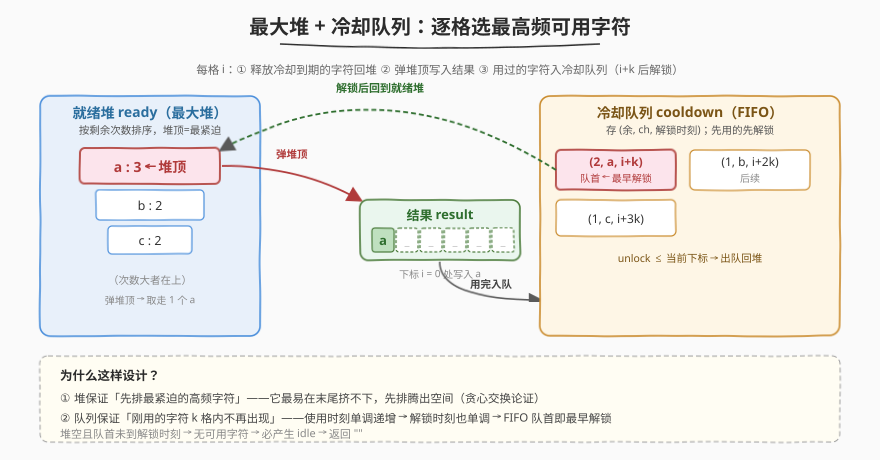
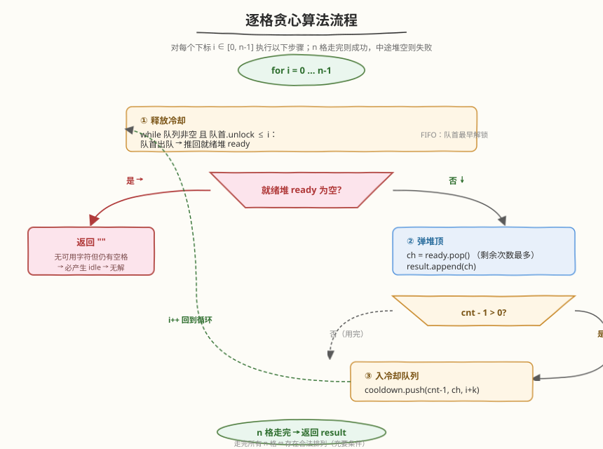
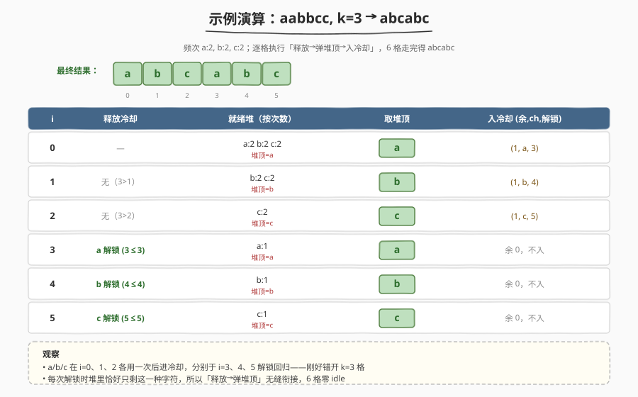

# K 距离间隔重排字符串

- **题目名称**：K 距离间隔重排字符串
- **链接**：[358. K 距离间隔重排字符串](https://leetcode.cn/problems/rearrange-string-k-distance-apart/)
- **难度**：困难
- **标签**：贪心、堆（优先队列）、队列、哈希表、字符串

## 1. 题目概述

给定一个非空字符串 `s` 和一个整数 `k`，重排字符串使得**相同字符之间至少相隔 `k` 个位置**（即若同一字符先后出现在下标 `i`、`j`（`i < j`），则必须 `j - i >= k`）。如果无法重排，返回空串 `""`。

**示例 1**：

```text
输入：s = "aabbcc", k = 3
输出："abcabc"
解释：a 出现在下标 0、3，间距 3；b 在 1、4；c 在 2、5。所有同字符间距 ≥ 3。
```

**示例 2**：

```text
输入：s = "aaabc", k = 3
输出：""
解释：a 出现 3 次，至少需要下标 0、3、6 三个位置，但串长只有 5，无法满足。
```

**示例 3**：

```text
输入：s = "aaadbbcc", k = 2
输出："acbacbd"  （或其他合法排列）
```

**约束条件**：

- `1 <= s.length <= 10^5`
- `s` 由小写英文字母组成
- `0 <= k <= 10^5`

> 💡 本题是 [621. 任务调度器](https://leetcode.cn/problems/task-schedule/) 的**强约束版**：621 只问「最少多少个时间槽」（允许 idle 填空），用公式 $O(n)$ 直接算；358 要求**真正输出一个不含 idle 的排列**，且不可行时要判定 `""`。因此公式法不够用，必须**模拟**「每一格选谁」。

---

## 2. 解题思路

### 2.1 暴力思路：全排列枚举

枚举 `s` 的所有重排，逐一验证同字符间距是否 $\geq k$。排列数是 $n!$ 级别，立刻爆炸。

> ⚠️ 即便用回溯剪枝，最坏仍指数级。需要利用「**频次结构**」来贪心。

### 2.2 核心观察：最大堆 + 冷却队列



关键洞察：**逐格贪心——每个位置都选「当前可用且剩余次数最多」的字符**。理由与 621 一脉相承：剩余次数最多的字符最「危险」（最容易在末尾挤不下），先排它能给后续腾出空间。

但「可用」有约束：刚排过的字符在接下来 $k-1$ 格内不能再出现（间距 $\geq k$）。因此需要两个数据结构协同：

| 结构 | 类型 | 作用 |
|------|------|------|
| **就绪堆** `ready` | 最大堆，按剩余次数排序 | 当前可立即使用的字符池，堆顶 = 剩余次数最多 |
| **冷却队列** `cooldown` | FIFO 双端队列，存 `(剩余次数, 字符, 解锁时刻)` | 刚用过的字符按使用顺序排队，到解锁时刻自动回到就绪堆 |

**冷却时长**：若字符在下标 `i` 被使用，则它最早可在下标 `i + k` 再次使用（保证 $j - i \geq k$）。所以解锁时刻 = `i + k`。

> 💡 用 FIFO 队列而非堆来管冷却，是因为「先用的先解锁」——使用时刻单调递增，解锁时刻也单调递增，队首永远是解锁最早的。

### 2.3 算法流程图



每一格 `i`（从 `0` 到 `n-1`）执行三步：

1. **释放冷却**：队首 `unlock <= i` 则出队，推回就绪堆；重复直到队首未到解锁时刻或队空。
2. **取堆顶**：若就绪堆空 → 无可用字符但仍有空格 → **不可行，返回 `""`**。否则弹堆顶 `ch`，写入结果。
3. **入冷却**：若 `ch` 用完一次后剩余次数 `> 0`，把 `(剩余, ch, i + k)` 推入队尾。

> ⚠️ 第 2 步的判定正是「可行性检查」——若释放完所有可解锁的字符后堆仍空，说明剩下的字符全在冷却中且最近 $k$ 格内都不能用，必然产生 idle，无解。

### 2.4 示例演算

以 `s = "aabbcc", k = 3` 演示：



| 格 `i` | 释放冷却 | 就绪堆（按次数） | 取堆顶 | 结果 | 入冷却 `(余, ch, 解锁)` |
|--------|----------|------------------|--------|------|-------------------------|
| 0 | — | a:2, b:2, c:2 | a | `a` | (1, a, 3) |
| 1 | 无 | b:2, c:2 | b | `ab` | (1, b, 4) |
| 2 | 无 | c:2 | c | `abc` | (1, c, 5) |
| 3 | a 解锁 (3≤3) | a:1 | a | `abca` | 余 0，不入 |
| 4 | b 解锁 (4≤4) | b:1 | b | `abcab` | 余 0，不入 |
| 5 | c 解锁 (5≤5) | c:1 | c | `abcabc` | 余 0，不入 |

输出 `"abcabc"` ✓。

再看不可行例 `s = "aaabc", k = 3`：

| 格 `i` | 释放 | 就绪堆 | 取堆顶 | 结果 | 入冷却 |
|--------|------|--------|--------|------|--------|
| 0 | — | a:3, b:1, c:1 | a | `a` | (2, a, 3) |
| 1 | 无 | b:1, c:1 | b | `ab` | 余 0 |
| 2 | 无 | c:1 | c | `abc` | 余 0；堆空 |
| 3 | a 解锁 | a:2 | a | `abca` | (1, a, 6) |
| 4 | 无（a 解锁时刻 6 > 4） | **空** | — | — | **返回 `""`** |

到第 4 格，堆空且冷却队首未到解锁时刻 → 无解。验证：`a` 出现 3 次，需下标 $0, 3, 6$，但串长 5 → 的确无解。

---

## 3. 参考代码

### C++

```cpp
class Solution {
  public:
    string rearrangeString(string s, int k) {
        if (k <= 1) return s;          // k=0/1：无约束，原串即合法
        unordered_map<char, int> freq;
        for (char c : s) freq[c]++;

        auto cmp = [](const pair<int, char>& a, const pair<int, char>& b) {
            return a.first < b.first;   // 最大堆：剩余次数多的优先
        };
        priority_queue<pair<int, char>, vector<pair<int, char>>, decltype(cmp)>
            ready(cmp);
        for (auto& [ch, cnt] : freq) ready.push({cnt, ch});

        deque<tuple<int, char, int>> cooldown;   // (剩余次数, 字符, 解锁时刻)

        string result;
        for (int i = 0; i < (int)s.size(); ++i) {
            // 1. 释放已冷却完的字符回就绪堆
            while (!cooldown.empty() && get<2>(cooldown.front()) <= i) {
                auto& f = cooldown.front();
                ready.push({get<0>(f), get<1>(f)});
                cooldown.pop_front();
            }
            // 2. 堆空 → 无可用字符 → 不可行
            if (ready.empty()) return "";
            auto [cnt, ch] = ready.top();
            ready.pop();
            result.push_back(ch);
            // 3. 用完一次还有剩余则入冷却队列，i+k 后解锁
            if (cnt - 1 > 0) cooldown.push_back({cnt - 1, ch, i + k});
        }
        return result;
    }
};
```

### Python

```python
import heapq
from collections import Counter, deque


class Solution:
    def rearrangeString(self, s: str, k: int) -> str:
        if k <= 1:
            return s  # k=0/1：无约束，原串即合法

        freq = Counter(s)
        # 最大堆：用负次数模拟（heapq 是最小堆）
        ready = [(-cnt, ch) for ch, cnt in freq.items()]
        heapq.heapify(ready)

        cooldown = deque()  # (负剩余次数, 字符, 解锁时刻)

        result = []
        for i in range(len(s)):
            # 1. 释放已冷却完的字符回就绪堆
            while cooldown and cooldown[0][2] <= i:
                neg_cnt, ch, _ = cooldown.popleft()
                heapq.heappush(ready, (neg_cnt, ch))
            # 2. 堆空 → 无可用字符 → 不可行
            if not ready:
                return ""
            neg_cnt, ch = heapq.heappop(ready)
            result.append(ch)
            # 3. 用完一次还有剩余则入冷却队列，i+k 后解锁
            if -neg_cnt - 1 > 0:
                cooldown.append((neg_cnt + 1, ch, i + k))

        return "".join(result)
```

> ⚠️ **Python 最大堆技巧**：`heapq` 是最小堆，存 `-count` 即可让「次数大」的元素排在堆顶。弹出后 `neg_cnt + 1` 等价于「次数减 1 后的负值」，保持一致性直接推入冷却队列，解锁时原样推回堆。
>
> **`k <= 1` 特判**：`k = 0` 表示无间距约束，原串即合法；`k = 1` 要求 $j - i \geq 1$，不同下标天然满足，同样无约束。特判既省事又避免 `k = 0` 时冷却逻辑退化的边界讨论。

---

## 4. 复杂度分析

| 维度 | 复杂度 | 说明 |
|------|--------|------|
| **时间复杂度** | $O(n \log \Sigma)$ | $n$ 格每格一次堆操作 $O(\log \Sigma)$，$\Sigma$ 为字符种类数（小写字母时 $\Sigma \leq 26$，可视为 $O(n)$） |
| **空间复杂度** | $O(\Sigma)$ | 堆 + 冷却队列总容量不超过字符种类数；结果不计入 |

> 💡 当字符集为小写字母（$\Sigma = 26$），$\log \Sigma \approx 4.7$ 是常数，整体近似 $O(n)$。即便字符集扩大到任意 Unicode，也只需 $O(n \log \Sigma)$，仍远优于暴力枚举。

---

## 5. 扩展：可行性预判公式

模拟前可先做一次 $O(n)$ 的**必要条件预判**，提前剪枝：设最高频字符出现 `max_freq` 次，则它至少需要下标 $0, k, 2k, \dots, (max\_freq-1) \cdot k$，即需要串长

$$
n \geq (max\_freq - 1) \cdot k + 1
$$

若不满足，直接返回 `""`，免去模拟。注意这只是**必要条件**（多字符高频时仍可能无解），充分性仍靠模拟保证。

> 💡 这个式子正是 [621. 任务调度器](https://leetcode.cn/problems/task-schedule/) 公式 $ans = (max\_freq - 1) \times (n+1) + max\_count$ 的镜像：621 用它算「含 idle 的最少时间槽」，358 用它判定「不含 idle 是否可能」。

---

## 6. 面试要点

1. **358 和 621 的区别是什么？为什么 621 的公式法不能直接套用？**

   - 621 求「最少时间槽」，允许 idle 填空，所以可以用框架公式 $O(n)$ 直接算出含 idle 的总数。
   - 358 要求输出**不含 idle 的真实排列**，公式只能算「理论最少槽」，不能告诉你每格放谁；不可行时还要判定 `""`。必须用最大堆 + 冷却队列**逐格模拟**才能既构造排列又检测不可行。

2. **为什么冷却用 FIFO 队列而不是另一个堆？**

   - 字符按使用时刻单调进入冷却，解锁时刻 = 使用时刻 + $k$ 也单调递增。所以**先用的先解锁**，FIFO 队首永远是解锁最早的，$O(1)$ 即可判定是否该释放。用堆反而多此一举（堆顶就是队首）。

3. **为什么「每格选剩余次数最多的字符」是正确的贪心？**

   - 剩余次数最多的字符最「紧迫」——它还需要最多的后续位置，且每次使用后要隔 $k$ 格才能再用。越往后拖，剩余位置越不够排。先用它，给后续留出最大缓冲。交换论证：若最优解在某格选了低频字符而贪心选了高频字符，交换两者后续排列仍合法（低频字符约束更松），故贪心不劣于最优。

4. **堆空但还有空格时为什么一定无解？**

   - 释放完所有可解锁字符后堆仍空，意味着剩下的字符全在冷却中，且最近 $k$ 格内都不能用——这一格必然是 idle。但题目要求排列不含 idle（输出原长字符串），故无解。这是**充要条件**：贪心模拟能走完所有 $n$ 格当且仅当存在合法排列。

5. **`k = 0` 时算法行为如何？为什么要特判？**

   - `k = 0` 时解锁时刻 = $i$，下一格 $i+1$ 时 `unlock <= i+1` 成立，立刻释放。算法退化为「反复取最高频字符」，能跑完但输出按频次排序的串，不一定是原串。虽然合法，但特判 `return s` 更直观、避免讨论边界，也匹配「无约束则原串即可」的直觉。

---

## 7. 同类练习题

- [621. 任务调度器](https://leetcode.cn/problems/task-schedule/)（[题解](../0601-0700/621_任务调度器.md)）：同源问题——求含 idle 的最少时间槽用公式，本题求不含 idle 的真实排列用模拟，对照学习「公式 vs 模拟」的边界
- [767. 重构字符串](https://leetcode.cn/problems/reorganize-string/)：358 的 $k = 2$ 特例（相邻不同），可用同样的堆 + 冷却模板，也可用「奇偶位交替填最高频」的特化解法
- [1054. 距离相等的条形码](https://leetcode.cn/problems/distant-barcodes/)：358 的 $k = 2$ 变体（相邻不同），思路同 767
- [1405. 最长快乐字符串](https://leetcode.cn/problems/longest-happy-string/)：堆 + 贪心构造，约束为「无三个连续相同」，对照不同冷却规则下的贪心策略
- [355. 设计推特](https://leetcode.cn/problems/design-twitter/)（[题解](../0301-0400/355_设计推特.md)）：同样用堆做「多路归并取下一项」，对比堆在「调度」与「归并」两类场景的用法
