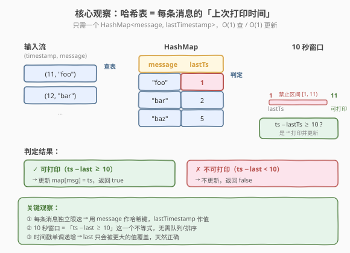
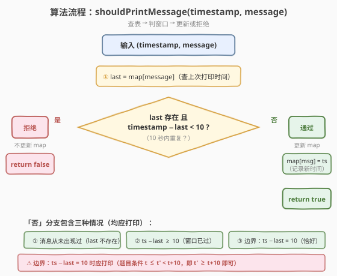
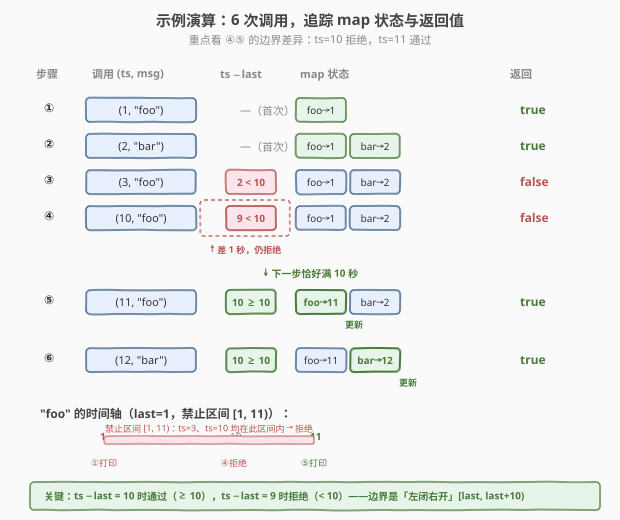

# 日志限速器

- **题目名称**：日志限速器
- **链接**：[359. 日志限速器](https://leetcode.cn/problems/logger-rate-limiter/)
- **难度**：简单
- **标签**：设计、哈希表

## 1. 题目概述

设计一个日志系统，接收消息流（每条消息附带一个整数时间戳 `timestamp`）。**同一条消息在 `10` 秒内最多打印一次**——即如果某条消息在时间戳 `t` 打印过，那么在 $t \le t' < t + 10$ 的时间段内**不得再次打印**，只有当 $t' \ge t + 10$ 时才允许重新打印。

**接口**：

- `Logger()`：初始化日志器对象。
- `bool shouldPrintMessage(int timestamp, string message)`：判断当前时间戳 `timestamp` 下消息 `message` 是否应当被打印。若应打印则返回 `true`，否则返回 `false`。

**示例 1**：

```text
输入
["Logger", "shouldPrintMessage", "shouldPrintMessage", "shouldPrintMessage", "shouldPrintMessage", "shouldPrintMessage", "shouldPrintMessage"]
[[], [1, "foo"], [2, "bar"], [3, "foo"], [8, "bar"], [10, "foo"], [11, "foo"]]

输出
[null, true, true, false, false, false, true]

解释
Logger logger = new Logger();
logger.shouldPrintMessage(1, "foo");  // true  ← "foo" 首次出现，打印，记录 foo→1
logger.shouldPrintMessage(2, "bar");  // true  ← "bar" 首次出现，打印，记录 bar→2
logger.shouldPrintMessage(3, "foo");  // false ← "foo" 上次在 1，3−1=2 < 10，拒绝
logger.shouldPrintMessage(8, "bar");  // false ← "bar" 上次在 2，8−2=6 < 10，拒绝
logger.shouldPrintMessage(10, "foo"); // false ← "foo" 上次在 1，10−1=9 < 10，拒绝
logger.shouldPrintMessage(11, "foo"); // true  ← "foo" 上次在 1，11−1=10 ≥ 10，打印并更新 foo→11
```

**约束条件**：

- `0 <= timestamp <= 10^9`
- `1 <= message.length <= 30`
- `message` 仅由小写英文字母和数字组成
- 每个测试用例中 `timestamp` 按**非递减**顺序传入
- 最多调用 $3 \times 10^4$ 次 `shouldPrintMessage`

> 💡 本题是「**限流（rate limiting）**」的经典设计题。每条消息各自维护一个 10 秒的冷却窗口，互不干扰。核心难点不在于算法复杂度，而在于**数据结构选型**与**边界条件**的正确处理——尤其是 `ts − last = 10` 时到底算「可以打印」还是「仍在禁止区间内」。

---

## 2. 解题思路

### 2.1 暴力思路：全量历史 + 线性扫描

最直觉的做法：用一个列表 `history` 存下所有**已打印**的 `(timestamp, message)` 记录。每次 `shouldPrintMessage` 时遍历 `history`，查找是否存在同 `message` 且 `timestamp` 差值 $< 10$ 的记录。

```text
shouldPrintMessage(ts, msg):
    for (t, m) in history:
        if m == msg and ts - t < 10:
            return false          ← 10 秒内重复，拒绝
    history.append((ts, msg))
    return true
```

问题显而易见：

- **时间**：单次调用 $O(N)$，$N$ 为已打印记录总数。调用 $3 \times 10^4$ 次时总开销 $O(N^2)$，最坏 $9 \times 10^8$ 量级，难以接受。
- **空间**：$O(N)$ 全量缓存，且历史中大量早已过期（`ts − t ≥ 10`）的记录对当前判定毫无贡献，纯属浪费。

> ⚠️ 暴力法的根源在于：把「每条消息的上次打印时间」分散在历史列表里，每次都要从头扫描。而实际上，**判定只依赖每条消息最近一次的打印时间**——更早的记录完全无用。这正是哈希表的用武之地。

### 2.2 核心观察：哈希表记录「上次打印时间」



**关键洞察**：判定 `shouldPrintMessage(ts, msg)` 只需要知道 `msg` **上一次被打印的时间** `last`，然后检查一个不等式：

$$\text{timestamp} - \text{last} \ge 10$$

- 成立 → 窗口已过，可以打印，**同时更新** `map[msg] = timestamp`。
- 不成立 → 仍在 10 秒禁止区间内，拒绝，**不更新** `map`。

而「每条消息 ↔ 一个时间戳」的映射，正是**哈希表**的本职工作：`HashMap<string, int>`，`O(1)` 查询、`O(1)` 更新。

> 💡 **为什么只需记录「最近一次」？** 因为 `timestamp` 按非递减顺序传入。若 `msg` 上次打印于 `last`，则在此之后的所有 `msg` 调用的 `timestamp` 都 $\ge \text{last}$。一旦某次调用满足 `ts − last ≥ 10` 并更新了 `last`，新的 `last` 必然 $\ge$ 旧的 `last`——更早的记录被覆盖后永不丢失有用信息。换句话说，**单调递增的时间戳保证了「最近一次」就包含了判定所需的全部信息**。

### 2.3 算法流程图



`shouldPrintMessage(timestamp, message)` 的步骤拆解：

1. **查表**：`last = map[message]`（若 `message` 不在表中，视为「从未打印过」）。
2. **判窗口**：
   - 若 `last` 存在 **且** `timestamp − last < 10` → 仍在禁止区间内，返回 `false`（**不更新** `map`）。
   - 否则（`last` 不存在，或 `timestamp − last ≥ 10`）→ 窗口已过，执行步骤 3。
3. **更新并返回**：`map[message] = timestamp`，返回 `true`。

> ⚠️ **边界细节**：题目原文为「if a message was printed at timestamp `t`, then the same message should not be printed at timestamp `t'` where $t \le t' < t + 10$」。注意是**左闭右开**区间 $[t, t+10)$。因此 `t' = t + 10` 时**不在**禁止区间内——即 `ts − last = 10` 应当返回 `true`。代码中判定条件是 `timestamp − last < 10` 时拒绝，`≥ 10` 时通过，严格对应这一语义。示例 ④⑤（`ts=10` 拒绝、`ts=11` 通过，`last=1`）正是对此边界的验证。

### 2.4 示例演算



以示例 1 的完整序列演示，逐步追踪 `map` 状态与返回值：

| 步骤 | 调用 `(ts, msg)` | `ts − last` | map 变化 | 返回 | 说明 |
|------|------------------|-------------|----------|------|------|
| ① | `(1, "foo")` | —（首次） | `foo→1` | `true` | 首次出现，记录并打印 |
| ② | `(2, "bar")` | —（首次） | `bar→2` | `true` | 首次出现，记录并打印 |
| ③ | `(3, "foo")` | $3-1=2 < 10$ | 不更新 | `false` | "foo" 仍在 [1,11) 内 |
| ④ | `(10, "foo")` | $10-1=9 < 10$ | 不更新 | `false` | 差 1 秒，仍拒绝 |
| ⑤ | `(11, "foo")` | $11-1=10 \ge 10$ | `foo→11` | `true` | 恰好满 10 秒，打印并更新 |
| ⑥ | `(12, "bar")` | $12-2=10 \ge 10$ | `bar→12` | `true` | "bar" 也满 10 秒，打印并更新 |

**关键看步骤 ④ 与 ⑤ 的对比**：`last=1` 不变，`ts=10` 时差 9（拒绝），`ts=11` 时差 10（通过）。这一秒之差正是左闭右开区间 $[1, 11)$ 的体现——`11` 不在禁止区间内。

> 💡 **步骤 ⑤ 的更新动作**：返回 `true` 的同时**必须**把 `map["foo"]` 从 `1` 更新为 `11`。若忘记更新，后续 `ts=15` 调用 "foo" 时会以旧的 `last=1` 判定（$15-1=14 \ge 10$ → 通过），虽然结果碰巧正确，但 `ts=12` 调用 "foo" 时会以 `last=1` 判定（$12-1=11 \ge 10$ → 通过），而正确语义应以 `last=11` 判定（$12-11=1 < 10$ → 拒绝）——**逻辑直接错误**。更新是正确性的不变量。

---

## 3. 参考代码

### C++

```cpp
class Logger {
    unordered_map<string, int> lastPrinted;  // message → 上次打印的 timestamp

public:
    Logger() {}

    bool shouldPrintMessage(int timestamp, string message) {
        auto it = lastPrinted.find(message);
        if (it != lastPrinted.end() && timestamp - it->second < 10) {
            return false;             // 10 秒内重复，拒绝（不更新）
        }
        lastPrinted[message] = timestamp;  // 更新上次打印时间
        return true;
    }
};
```

### Python

```python
class Logger:
    def __init__(self):
        self.last_printed: dict[str, int] = {}  # message → 上次打印的 timestamp

    def shouldPrintMessage(self, timestamp: int, message: str) -> bool:
        last = self.last_printed.get(message)
        if last is not None and timestamp - last < 10:
            return False            # 10 秒内重复，拒绝（不更新）
        self.last_printed[message] = timestamp  # 更新上次打印时间
        return True
```

> 💡 **实现细节**：
>
> - **C++** 用 `unordered_map<string, int>`，`find` 返回迭代器避免重复哈希。注意 `find` 与 `[]` 的区别：`[]` 会在键不存在时**插入默认值**（`int` 默认为 `0`），可能污染 map；`find` 则只查询不插入。这里用 `find` 更安全。
> - **Python** 用 `dict.get(key)` 返回 `None` 表示不存在，再用 `is not None` 判断——不能写成 `if last and ...`，因为 `last=0`（时间戳可以是 `0`）会被误判为 falsy。
> - 两版逻辑完全一致：先查 `last`，若存在且 `ts − last < 10` 则拒绝，否则更新并返回 `true`。**拒绝时不更新**是易错点——更新会错误地延长禁止区间。

---

## 4. 复杂度分析

| 维度 | 哈希表法 | 暴力线性扫描 |
|------|---------|-------------|
| **时间（单次 shouldPrintMessage）** | $O(1)$ | $O(N)$，$N$ = 已打印记录数 |
| **空间** | $O(M)$，$M$ = 不同消息数 | $O(N)$，$N$ = 已打印记录总数 |
| **总时间（$3 \times 10^4$ 次调用）** | $O(3 \times 10^4)$ | $O(N^2)$，最坏 $\sim 9 \times 10^8$ |

> 💡 哈希表法的 $O(1)$ 是**严格**的——`find`/`get` 与 `insert`/`[]=` 均为均摊 $O(1)$。空间上 $M$ 为不同消息数（$\le$ 调用次数 $3 \times 10^4$），且由于「拒绝时不更新」，`map` 只在真正打印时增长，实际大小 $\le$ 打印次数。对比暴力的 $O(N)$ 全量历史缓存，哈希表在时间和空间上双重碾压。

---

## 5. 扩展：利用时间戳单调性清理过期条目

哈希表法已经 $O(1)$ 时间、$O(M)$ 空间，但 $M$ 会随消息种类无限增长。若系统长时间运行且消息种类极多（如百万级不同日志），`map` 会持续膨胀。好在题目保证 `timestamp` **非递减**，可以利用这一点定期清理过期条目。

### 5.1 思路

用一个队列 `queue` 存放 `(timestamp, message)` 的**打印记录**（按时间顺序）。每次 `shouldPrintMessage` 时：

1. **清理队首**：当 `queue.front().timestamp + 10 <= current_timestamp` 时，说明该记录已过期，从 `queue` 弹出并从 `map` 中删除对应 `message`。
2. 正常查 `map` 判定。

```cpp
class Logger {
    unordered_map<string, int> lastPrinted;
    queue<pair<int, string>> q;   // 打印记录队列（按时间有序）

public:
    bool shouldPrintMessage(int timestamp, string message) {
        // 清理过期条目
        while (!q.empty() && q.front().first + 10 <= timestamp) {
            auto [t, m] = q.front();
            q.pop();
            if (lastPrinted[m] == t) {   // 仅当 map 里的值仍是这条记录时才删
                lastPrinted.erase(m);
            }
        }
        auto it = lastPrinted.find(message);
        if (it != lastPrinted.end() && timestamp - it->second < 10) {
            return false;
        }
        lastPrinted[message] = timestamp;
        q.push({timestamp, message});
        return true;
    }
};
```

### 5.2 为什么需要 `lastPrinted[m] == t` 的守卫？

同一条消息可能被多次打印（每次间隔 $\ge 10$ 秒），队列里会有多条同 `message` 的记录。清理队首旧记录时，`map` 中的值可能已被后续打印更新为更大的 `timestamp`——此时不能误删 `map` 中的新记录。只有当 `map[m] == t`（即 `map` 里存的仍是这条旧记录）时才删除。

> ⚠️ **空间收益**：清理后 `map` 大小始终 $\le$ 最近 10 秒内打印的不同消息数，远小于全量 $M$。代价是引入一个队列，单次清理均摊 $O(1)$（每条记录最多入队、出队各一次）。在实际日志系统中，这种「滚动清理」是限流器的标配。

---

## 6. 面试要点

1. **为什么用哈希表而不是排序/队列？**

   - 判定只依赖每条消息的**最近一次**打印时间，与其它消息无关。哈希表以 `message` 为键、`lastTimestamp` 为值，提供 $O(1)$ 的查询与更新，是最自然的选择。
   - 排序无意义（时间戳已单调），队列虽能清理过期条目但无法 $O(1)$ 查「某条消息上次何时打印」。哈希表是唯一能同时满足「按消息检索」与「$O(1)$ 操作」的结构。

2. **`ts − last = 10` 时应当返回 `true` 还是 `false`？**

   - 返回 `true`。题目原文规定禁止区间为 $[t, t+10)$（左闭右开），即 $t' \ge t + 10$ 时可打印。`ts − last = 10` 即 $t' = t + 10$，恰好落在区间外。代码中用 `timestamp − last < 10` 作为拒绝条件，`≥ 10` 自然通过，严格对应这一语义。示例 ④⑤ 正是验证此边界。

3. **拒绝时为什么不更新 `map`？**

   - 拒绝意味着「仍在禁止区间内」，**上次打印时间 `last` 未变**。若误更新为当前 `timestamp`，会错误地**延长**禁止区间。例如 `last=1`，`ts=3` 拒绝时若更新为 `last=3`，则后续 `ts=11` 会以 `last=3` 判定（$11-3=8 < 10$ → 拒绝），而正确语义应以 `last=1` 判定（$11-1=10 \ge 10$ → 通过）。更新只在**真正打印**时发生。

4. **时间戳单调递增这一条件有什么用？**

   - 保证 `last` 只会被更大的值覆盖，因此「最近一次」始终包含判定所需的全部信息——更早的记录无用，可以安全覆盖或清理。
   - 若时间戳不单调（可能回退），则单靠「最近一次」不够——某条消息可能在未来的 `timestamp` 被打印过，当前调用反而需要检查「未来」记录。此时需要更复杂的数据结构（如按时间戳排序的日志），本题的前提简化了设计。

5. **如何控制 `map` 的无限增长？**

   - 利用时间戳单调性 + 队列滚动清理（见第 5 节）：每次调用时弹出队首已过期记录（`ts + 10 ≤ current`），同步从 `map` 删除。清理后 `map` 大小 $\le$ 最近 10 秒内活跃的不同消息数，空间从 $O(M)$ 降至 $O(\text{活跃 } M)$。
   - 面试中先讲哈希表基础版（$O(1)/O(M)$），追问「长时间运行内存膨胀」时再亮队列清理版，展示工程思维。

> 💡 **一句话总结**：359 = 哈希表 + 一个不等式。`map[message]` 记上次打印时间，`ts − last ≥ 10` 则打印并更新，否则拒绝不更新。$O(1)/O(M)$，边界是左闭右开 $[last, last+10)$。

---

## 7. 同类练习题

- [362. 敲击计数器](https://leetcode.cn/problems/design-hit-counter/)：同样用队列维护时间窗口，但统计窗口内**总敲击数**而非按消息限流，是 359 的「计数版」变体
- [346. 数据流中的移动平均值](https://leetcode.cn/problems/moving-average-from-data-stream/)（[题解](../0301-0400/346_数据流中的移动平均值.md)）：固定大小时间窗口 + 队列滚动，与 359 第 5 节的队列清理同源
- [933. 最近的请求次数](https://leetcode.cn/problems/number-of-recent-calls/)：队列维护 3000 毫秒窗口，统计窗口内请求数，与 359 的窗口清理逻辑完全一致
- [981. 基于时间的键值存储](https://leetcode.cn/problems/time-based-key-value-store/)（[题解](../0301-0400/981_基于时间的键值存储.md)）：哈希表 + 有序时间戳，按时间检索值，对比 359 的「按时间判定是否打印」
- [146. LRU 缓存](https://leetcode.cn/problems/lru-cache/)（[题解](../0101-0200/146_LRU缓存.md)）：同样是「哈希表 + 另一结构」的 $O(1)$ 设计题，对比选型差异与清理策略
