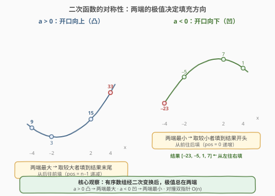
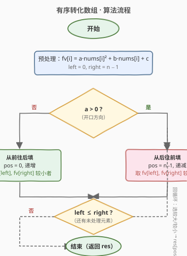
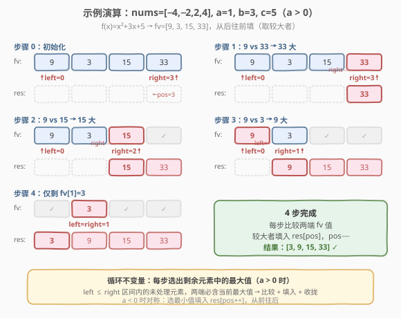

# LeetCode 有序转化数组 题解

## 1. 题目概述

- **标题 / 题号**：有序转化数组（#360，medium）
- **链接**：https://leetcode.cn/problems/sort-transformed-array/
- **难度**：中等
- **标签**：数组、数学、双指针、排序

**题意**：给定一个**已排序**的整数数组 `nums`（升序）和三个整数 `a`、`b`、`c`。对 `nums` 中的每个元素 $x$ 施加二次函数变换：

$$f(x) = ax^2 + bx + c$$

将所有变换后的值按**升序**返回。要求时间复杂度为 $O(n)$。

**示例 1**：

```text
输入：nums = [-4,-2,2,4], a = 1, b = 3, c = 5
输出：[3,9,15,33]

解释：f(x) = x² + 3x + 5
  f(-4) = 16 − 12 + 5 =  9
  f(-2) =  4 −  6 + 5 =  3
  f( 2) =  4 +  6 + 5 = 15
  f( 4) = 16 + 12 + 5 = 33
升序排列 → [3, 9, 15, 33]
```

**示例 2**：

```text
输入：nums = [-4,-2,2,4], a = -1, b = 3, c = 5
输出：[-23,-5,1,7]

解释：f(x) = −x² + 3x + 5
  f(-4) = −16 − 12 + 5 = −23
  f(-2) =  −4 −  6 + 5 =  −5
  f( 2) =  −4 +  6 + 5 =   7
  f( 4) = −16 + 12 + 5 =   1
升序排列 → [−23, −5, 1, 7]
```

**示例 3**：

```text
输入：nums = [-4,-2,2,4], a = 0, b = 1, c = 5
输出：[1,3,7,9]

解释：f(x) = x + 5（线性，b > 0 → 已升序）
  f(-4)=1, f(-2)=3, f(2)=7, f(4)=9
```

**约束**：

- $1 \le \text{nums.length} \le 200$
- $-100 \le \text{nums}[i] \le 100$
- `nums` 已按**升序**排列
- $-100 \le a, b, c \le 100$

> 💡 本题的核心在于利用**二次函数的对称性**与**输入数组已排序**这一性质，避免对变换后的数组重新排序（$O(n \log n)$），转而用**对撞双指针**在 $O(n)$ 时间内直接生成有序结果。关键观察是：抛物线在对称轴两侧单调，因此有序数组的两端映射后必为极值。

## 2. 解题思路

### 2.1 暴力思路：变换 + 排序

最直白的做法：先对每个 `nums[i]` 计算 $f(\text{nums}[i])$，再对结果数组排序。

```text
fv = [f(x) for x in nums]
fv.sort()
return fv
```

问题在于**排序**这一步需要 $O(n \log n)$，而题目要求 $O(n)$。

> ⚠️ 暴力法忽略了两个关键性质：① `nums` **已排序**；② 二次函数具有**对称性**（抛物线）。利用这两点，可以在变换的同时就确定输出的顺序，完全省去排序。

### 2.2 核心观察：抛物线对称性 + 对撞双指针



二次函数 $f(x) = ax^2 + bx + c$ 的图像是一条抛物线，对称轴为 $x = -\frac{b}{2a}$（$a \neq 0$ 时）。关键性质：

| $a$ 的符号 | 开口方向 | 极值位置 | 有序数组两端的关系 |
|-----------|---------|---------|-------------------|
| $a > 0$ | 向上（凸） | 对称轴处取**最小值** | 两端映射值是**最大**的两个候选 |
| $a < 0$ | 向下（凹） | 对称轴处取**最大值** | 两端映射值是**最小**的两个候选 |
| $a = 0$ | 退化为直线 $f(x) = bx + c$ | 无极值 | 两端即最大/最小（取决于 $b$ 的符号） |

**核心洞察**：由于 `nums` 已升序排列，变换后的值在数组两端呈现**极值特性**：

- **$a > 0$（凸）**：两端映射值 $\ge$ 中间，即最大值总在两端之中。用对撞双指针 `left`、`right` 从两端出发，**每次比较 $f(\text{nums}[\text{left}])$ 与 $f(\text{nums}[\text{right}])$，取较大者填入结果末尾**，从后往前填。
- **$a \leq 0$（凹或线性）**：两端映射值 $\leq$ 中间（或线性单调），即最小值总在两端之中。**取较小者填入结果开头**，从前往后填。

> 💡 **为什么两端必含极值？** 抛物线在对称轴两侧分别单调——一侧递减、另一侧递增。已排序的 `nums` 从左到右穿越对称轴，因此数组两端的元素距离对称轴最远，对应的 $f$ 值要么最大（$a > 0$）要么最小（$a < 0$）。中间元素离对称轴近，$f$ 值趋于极值的相反方向。这一单调性保证了对撞双指针的正确性。

### 2.3 算法流程图



算法步骤拆解：

1. **预处理**：计算 `fv[i] = a * nums[i]² + b * nums[i] + c`，初始化 `left = 0`、`right = n − 1`。
2. **判断方向**：
   - 若 $a > 0$：`pos = n − 1`（从后往前填），每轮取 `fv[left]` 和 `fv[right]` 中**较大**者放入 `res[pos]`，较大者一侧的指针内移，`pos--`。
   - 若 $a \leq 0$：`pos = 0`（从前往后填），每轮取**较小**者放入 `res[pos]`，较小者一侧的指针内移，`pos++`。
3. **收拢**：当 `left > right` 时结束，返回 `res`。

> ⚠️ **$a = 0$ 的处理**：线性函数 $f(x) = bx + c$ 没有极值点，但对撞双指针策略仍然成立。$b > 0$ 时 $f$ 单调递增，两端中右端为最大、左端为最小——无论用「取较大从后填」还是「取较小从前填」都能正确生成升序结果。代码中将 $a = 0$ 归入 $a \leq 0$ 分支（从前填，取较小），逻辑简洁且正确。

### 2.4 示例演算



以示例 1（`nums = [-4,-2,2,4]`，`a=1, b=3, c=5`）为例，$a > 0$ 故从后往前填：

| 步骤 | left | right | fv[left] | fv[right] | 比较 | 选出 | res 填入位置 | res 状态 |
|------|------|-------|----------|-----------|------|------|-------------|----------|
| 1 | 0 | 3 | 9 | 33 | 9 < 33 | 33 | res[3] | `[_, _, _, 33]` |
| 2 | 0 | 2 | 9 | 15 | 9 < 15 | 15 | res[2] | `[_, _, 15, 33]` |
| 3 | 0 | 1 | 9 | 3 | 9 > 3 | 9 | res[1] | `[_, 9, 15, 33]` |
| 4 | 1 | 1 | 3 | 3 | left==right | 3 | res[0] | `[3, 9, 15, 33]` |

每步选出的都是**剩余未处理元素中的最大值**，从右往左依次填入，最终得到升序数组。

> 💡 **循环不变量**：在 `left ≤ right` 的未处理区间内，`fv[left]` 和 `fv[right]` 中必含当前最大值（$a > 0$ 时）。因为抛物线开口向上，距对称轴越远的点 $f$ 值越大，而两端元素距对称轴最远。每步取走最大值后，新区间的两端仍含新的最大值——不变量成立。

## 3. 参考代码

### C++

```cpp
class Solution {
    long long trans(int x, int a, int b, int c) {
        return (long long)a * x * x + (long long)b * x + c;
    }
public:
    vector<int> sortTransformedArray(vector<int>& nums, int a, int b, int c) {
        int n = nums.size();
        vector<int> res(n);
        int left = 0, right = n - 1;
        int pos = a > 0 ? n - 1 : 0;     // a>0 从后往前填；a<=0 从前往后填
        int step = a > 0 ? -1 : 1;       // pos 的移动方向

        while (left <= right) {
            long long lv = trans(nums[left], a, b, c);
            long long rv = trans(nums[right], a, b, c);
            bool pickLeft;
            if (a > 0) pickLeft = lv >= rv;   // 取较大者
            else       pickLeft = lv <= rv;   // 取较小者

            if (pickLeft) {
                res[pos] = (int)lv;
                left++;
            } else {
                res[pos] = (int)rv;
                right--;
            }
            pos += step;
        }
        return res;
    }
};
```

### Python

```python
class Solution:
    def sortTransformedArray(self, nums: list[int], a: int, b: int, c: int) -> list[int]:
        def f(x: int) -> int:
            return a * x * x + b * x + c

        n = len(nums)
        res = [0] * n
        left, right = 0, n - 1
        pos = n - 1 if a > 0 else 0      # a>0 从后往前填；a<=0 从前往后填
        step = -1 if a > 0 else 1

        while left <= right:
            lv, rv = f(nums[left]), f(nums[right])
            if a > 0:
                pick_left = lv >= rv     # 取较大者
            else:
                pick_left = lv <= rv     # 取较小者

            if pick_left:
                res[pos] = lv
                left += 1
            else:
                res[pos] = rv
                right -= 1
            pos += step

        return res
```

> 💡 **实现细节**：
>
> - **溢出防护**：`a * x * x` 在 $|x| \le 100$、$|a| \le 100$ 时最大 $10^6$，`int` 足够。但 C++ 中用 `long long` 中间变量做乘法更稳健，避免 `a * x * x` 在 `int` 域溢出的理论风险（本题数据范围下实际不会溢出，但习惯性防御）。
> - **`pos` 与 `step` 统一方向**：用 `pos` 起始位置 + `step` 方向（`-1` 或 `+1`）统一两种填充策略，避免写两个 `while` 循环。也可以拆成 `if (a > 0) { ... } else { ... }` 两个分支，逻辑等价但代码更长。
> - **`a = 0` 归入 `a <= 0`**：线性函数时「取较小者从前填」仍然正确——若 $b > 0$，$f$ 递增，`f(nums[left]) < f(nums[right])`，每步取左端填入开头，等价于直接拷贝；若 $b < 0$，$f$ 递减，每步取右端填入开头，等价于逆序拷贝。两种情况结果都是升序。

## 4. 复杂度分析

| 维度 | 复杂度 | 说明 |
|------|--------|------|
| **时间复杂度** | $O(n)$ | 预处理计算 $f$ 值可在双指针遍历中**懒计算**（每步至多 2 次），总计 $n$ 步，每步 $O(1)$ |
| **空间复杂度** | $O(n)$ | 结果数组 `res` 占 $O(n)$；若不计输出，额外空间 $O(1)$（仅 `left`、`right`、`pos` 三个指针变量） |

> 💡 对比暴力法的 $O(n \log n)$ 排序，双指针法将排序这一步「隐式」融入了遍历——利用抛物线对称性，每步直接确定下一个该填的值，无需比较排序。这正是「**利用问题结构替代通用算法**」的典型范例。

## 5. 扩展：对称轴位置与正确性证明

### 5.1 为什么两端必含极值？

设抛物线对称轴为 $x_0 = -\frac{b}{2a}$（$a \neq 0$）。对任意 $x$，有：

$$f(x) = a\left(x - x_0\right)^2 + f(x_0)$$

- $a > 0$ 时，$f(x) - f(x_0) = a(x - x_0)^2 \geq 0$，即 $f(x_0)$ 是最小值。$|x - x_0|$ 越大，$f(x)$ 越大。
- `nums` 已升序排列，数组两端 `nums[0]` 和 `nums[n-1]` 距对称轴 $x_0$ 最远（或之一最远），因此 $f$ 值最大。
- 同理，$a < 0$ 时两端 $f$ 值最小。

### 5.2 对撞双指针的正确性

**不变量**：在每轮迭代开始时，`fv[left]` 和 `fv[right]` 中包含当前未处理区间 `[left, right]` 内的极值（$a > 0$ 时为最大值，$a < 0$ 时为最小值）。

**证明**（以 $a > 0$ 为例）：

- 区间 `[left, right]` 是 `nums` 的一个连续子段（仍保持升序）。
- 抛物线开口向上，子段两端的 $f$ 值 $\geq$ 子段内部任意点的 $f$ 值。
- 因此 `max(fv[left], fv[right])` 就是整个子段的最大值。
- 每轮取走最大值后，新区间 `[left+1, right]` 或 `[left, right-1]` 仍满足不变量。

**归纳基**：初始 `left=0, right=n-1`，整个数组两端含全局最大值。✓

**归纳步**：取走一端后，新区间两端含新区间的最大值。✓

> ⚠️ **为什么不能用快排/归并？** 它们没有利用「输入已排序 + 二次函数对称性」这一结构信息，对任意数组都能排序，但复杂度 $O(n \log n)$。双指针法利用了问题特有结构，将通用排序降维为线性扫描。

## 6. 面试要点

1. **为什么能做到 $O(n)$？核心观察是什么？**

   - 核心观察：`nums` 已排序 + 二次函数 $f(x) = ax^2+bx+c$ 的图像是抛物线，具有对称性。抛物线在对称轴两侧分别单调，因此有序数组的**两端映射后必为极值**（$a > 0$ 时最大，$a < 0$ 时最小）。用对撞双指针每次从两端选出极值填入结果，$n$ 步完成，无需排序。

2. **$a = 0$ 时怎么处理？**

   - $a = 0$ 时 $f(x) = bx + c$ 退化为线性函数。$b > 0$ 时 $f$ 单调递增（变换后仍升序），$b < 0$ 时单调递减（变换后逆序），$b = 0$ 时为常数。代码中将 $a = 0$ 归入 $a \leq 0$ 分支——「取较小者从前往后填」：$b > 0$ 时每步取左端（较小），等价顺序拷贝；$b < 0$ 时每步取右端（较小），等价逆序拷贝。两种情况结果都是升序，逻辑统一。

3. **$a > 0$ 时为什么取较大者填到末尾，而不是取较小者填到开头？**

   - 两种方式都能正确——$a > 0$ 时两端含最大值，取较大者填末尾（从后往前）直接产出升序；取较小者填开头（从前往后）也行，但此时两端并非最小值候选（最小值在中间），这一策略**不正确**。关键在于：$a > 0$ 时极值（最大）在两端，必须取最大值填末尾；$a < 0$ 时极值（最小）在两端，必须取最小值填开头。方向由 $a$ 的符号决定。

4. **如果 `nums` 未排序怎么办？**

   - 先排序 $O(n \log n)$ 再用双指针 $O(n)$，总复杂度 $O(n \log n)$，与直接变换后排序无异。双指针的 $O(n)$ 优势完全来自输入已排序这一前提。面试中应主动说明这一依赖。

5. **溢出如何处理？**

   - 本题数据范围 $|x|, |a|, |b|, |c| \le 100$，最大 $f$ 值约 $10^6$，`int` 足够。但若数据范围扩大，$a \cdot x^2$ 可能溢出 `int`（如 $x = 10^5, a = 10^5$ 时 $ax^2 = 10^{15}$）。C++ 中应将中间乘法提升为 `long long`，Python 整数无溢出问题。

> 💡 **一句话总结**：360 = 抛物线对称性 + 对撞双指针。$a > 0$（凸）两端最大 → 取较大从后填；$a \leq 0$（凹/线性）两端最小 → 取较小从前填。$O(n)$ 时间、$O(1)$ 额外空间，利用问题结构替代通用排序。

## 同类练习题

| # | 题目 | 与本题的关联 |
|---|------|-------------|
| 977 | [有序数组的平方](https://leetcode.cn/problems/squares-of-a-sorted-array/)（[题解](../0901-1000/977_有序数组的平方.md)） | 本题 $a=1, b=0, c=0$ 的特例，即 $f(x) = x^2$，开口向上的抛物线，对撞双指针从后往前填——360 的最简退化版 |
| 88 | [合并两个有序数组](https://leetcode.cn/problems/merge-sorted-array/)（[题解](../0001-0100/88_合并两个有序数组.md)） | 对撞双指针从后往前填结果，与 360 的 $a > 0$ 分支共享「从后往前」填充模式 |
| 344 | [反转字符串](https://leetcode.cn/problems/reverse-string/)（[题解](../0301-0400/344_反转字符串.md)） | 对撞双指针母题，两端向中间收拢的基础模板，360 在此之上增加了「比较取极值」的判断 |
| 11 | [盛最多水的容器](https://leetcode.cn/problems/container-with-most-water/)（[题解](../0001-0100/11_盛最多水的容器.md)） | 对撞双指针 + 贪心移动，与 360 共享「两端向中间收拢 + 比较决策」的框架 |
| — | [360 → 977 关系](https://leetcode.cn/problems/squares-of-a-sorted-array/) | 977 是 360 在 $f(x)=x^2$（$a=1,b=0,c=0$）时的特例。理解 360 后，977 可直接秒杀——$a > 0$ 取较大从后填，负数平方后可能比正数大，双指针正确处理 |
