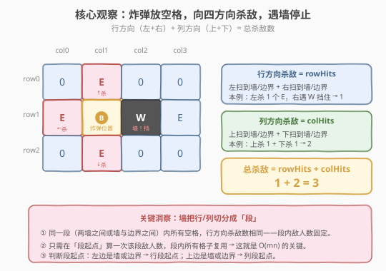
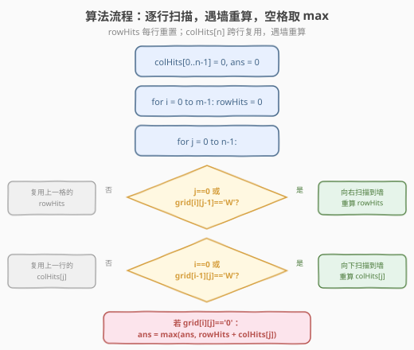
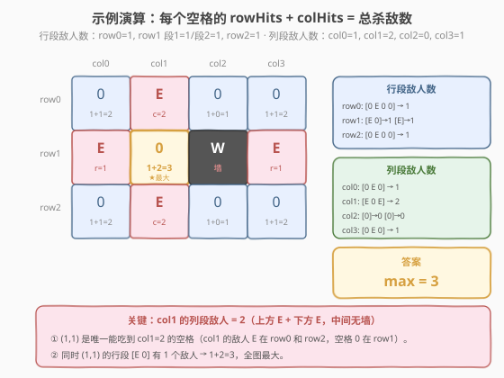

# LeetCode 轰炸敌人 题解

## 1. 题目概述

- **标题 / 题号**：轰炸敌人（#361，medium）
- **链接**：https://leetcode.cn/problems/bomb-enemy/
- **难度**：中等
- **标签**：数组、动态规划、矩阵

**题意**：给定一个二维 `grid`，每个格子是以下三种之一：

- `'0'`（字符零）：空地，可以放炸弹
- `'E'`：敌人
- `'W'`：墙

在**一个空地** `'0'` 上放置一枚炸弹，炸弹会杀死**同一行和同一列**上的所有敌人，直到被**墙**挡住（墙太硬无法摧毁，也不可穿透）。返回**最多能杀死的敌人数**。

**示例 1**：

```text
输入：grid = [["0","E","0","0"],["E","0","W","E"],["0","E","0","0"]]
输出：3
解释：
0 E 0 0
E 0 W E
0 E 0 0
在 (1,1) 放炸弹：左杀 E(1,0)，上杀 E(0,1)，下杀 E(2,1)，右遇 W 挡住 → 共 3 个。
```

**示例 2**：

```text
输入：grid = [["W","W","W"],["0","0","0"],["E","E","E"]]
输出：0
解释：所有空地周围均被墙隔开，无法杀死任何敌人。
```

**约束**：

- $m == \text{grid.length}$
- $n == \text{grid[i].length}$
- $1 \le m, n \le 500$
- $\text{grid[i][j]} \in \{\text{'0'}, \text{'E'}, \text{'W'}\}$

> 💡 本题是「**网格 + 分段复用**」的经典题。暴力法对每个空地四方向扫描 $O(mn(m+n))$，而观察到「墙把行/列切分成段，同段内杀敌数相同」后，只需在段起点计算一次、段内复用，即可降到 $O(mn)$。核心技巧是 `rowHits`（行段敌人计数）+ `colHits[j]`（列段敌人计数数组）的滚动复用。

## 2. 解题思路

### 2.1 暴力思路：每个空地四方向扫描

最直觉的做法：遍历每个空地 `'0'`，向上下左右四个方向扫描，遇到 `'E'` 则计数，遇到 `'W'` 或边界则停止，最后取所有空地的最大值。

```text
ans = 0
for i in range(m):
    for j in range(n):
        if grid[i][j] == '0':
            kills = 0
            # 左
            k = j - 1
            while k >= 0 and grid[i][k] != 'W':
                if grid[i][k] == 'E': kills += 1
                k -= 1
            # 右
            k = j + 1
            while k < n and grid[i][k] != 'W':
                if grid[i][k] == 'E': kills += 1
                k += 1
            # 上
            k = i - 1
            while k >= 0 and grid[k][j] != 'W':
                if grid[k][j] == 'E': kills += 1
                k -= 1
            # 下
            k = i + 1
            while k < m and grid[k][j] != 'W':
                if grid[k][j] == 'E': kills += 1
                k += 1
            ans = max(ans, kills)
return ans
```

- **时间**：每个空地扫描 $O(m+n)$，共 $O(mn)$ 个格子，总 $O(mn(m+n))$。$m=n=500$ 时 $\sim 1.25 \times 10^8$，勉强但低效。
- **空间**：$O(1)$，原地扫描。

> ⚠️ 暴力法的根源在于：**同一个行段/列段内的敌人数被反复扫描**。例如某一行段有 10 个空地，每个空地都要重新扫描整段——而实际上这一段的敌人数是固定的，只需算一次。

### 2.2 核心观察：墙切分行/列为「段」，段内复用杀敌数



**关键洞察**：墙 `'W'` 把每一行和每一列切分成若干**段**（两墙之间或墙与边界之间）。**同一段内的所有空地，其行方向（或列方向）的杀敌数完全相同**——因为段内的敌人数是固定的，与空地在段中的具体位置无关。

因此：

- **`rowHits`**：当前行段的敌人数。只在**行段起点**（$j=0$ 或 $\text{grid}[i][j-1] = \text{'W'}$）时重新扫描计算，段内后续格子直接复用。
- **`colHits[j]`**：第 $j$ 列当前列段的敌人数。只在**列段起点**（$i=0$ 或 $\text{grid}[i-1][j] = \text{'W'}$）时重新扫描计算，段内后续行直接复用。

对于空地 $(i, j)$，总杀敌数 $= \text{rowHits} + \text{colHits}[j]$。

> 💡 **为什么只需 $O(n)$ 空间？** `rowHits` 是单个变量（当前行段），每行开始时重置为 0；`colHits` 是长度为 $n$ 的数组，**跨行复用**——只有遇到墙时才重算对应列。这使得空间从 $O(mn)$（预计算所有行段/列段）降到了 $O(n)$。

### 2.3 算法流程图



**完整步骤**：

1. **初始化**：`colHits[0..n-1] = 0`，`ans = 0`。
2. **逐行扫描**：`for i = 0 to m-1`，每行开始时 `rowHits = 0`。
3. **逐列扫描**：`for j = 0 to n-1`：
   - **行段起点判定**：若 $j = 0$ 或 $\text{grid}[i][j-1] = \text{'W'}$，向右扫描直到墙或边界，统计 `'E'` 个数赋给 `rowHits`；否则复用上一格的 `rowHits`。
   - **列段起点判定**：若 $i = 0$ 或 $\text{grid}[i-1][j] = \text{'W'}$，向下扫描直到墙或边界，统计 `'E'` 个数赋给 `colHits[j]`；否则复用上一行的 `colHits[j]`。
   - **更新答案**：若 $\text{grid}[i][j] = \text{'0'}$，`ans = max(ans, rowHits + colHits[j])`。
4. **返回** `ans`。

> ⚠️ **段起点判定的方向**：行段起点看的是**左边**一格（`grid[i][j-1]`），列段起点看的是**上边**一格（`grid[i-1][j]`）。因为扫描方向是「从左到右、从上到下」，段起点 = 进入新段的第一个格子。边界（$j=0$ 或 $i=0$）天然是段起点。

### 2.4 示例演算



以 `grid = [["0","E","0","0"],["E","0","W","E"],["0","E","0","0"]]` 为例（答案 3）：

**行段分解**：

| 行 | 内容 | 段划分 | 每段敌人数 |
|----|------|--------|-----------|
| row0 | `[0, E, 0, 0]` | 一个段（无墙） | 1 |
| row1 | `[E, 0, W, E]` | `[E, 0]` 和 `[E]`（W 分隔） | 1、1 |
| row2 | `[0, E, 0, 0]` | 一个段（无墙） | 1 |

**列段分解**：

| 列 | 内容 | 段划分 | 每段敌人数 |
|----|------|--------|-----------|
| col0 | `[0, E, 0]` | 一个段（无墙） | 1 |
| col1 | `[E, 0, E]` | 一个段（无墙） | 2 |
| col2 | `[0, W, 0]` | `[0]` 和 `[0]`（W 分隔） | 0、0 |
| col3 | `[0, E, 0]` | 一个段（无墙） | 1 |

**每个空地的总杀敌数**：

| 空地位置 | rowHits | colHits[j] | 总计 | 说明 |
|----------|---------|------------|------|------|
| (0,0) | 1 | 1 | 2 | |
| (0,2) | 1 | 0 | 1 | col2 上段无敌人 |
| (0,3) | 1 | 1 | 2 | |
| **(1,1)** | **1** | **2** | **3** | **★ 最大**：行段 1 + col1 列段 2 |
| (2,0) | 1 | 1 | 2 | |
| (2,2) | 1 | 0 | 1 | col2 下段无敌人 |
| (2,3) | 1 | 1 | 2 | |

> 💡 **看 (1,1) 为何最优**：col1 的列段 `[E, 0, E]` 有 2 个敌人（上方 row0 + 下方 row2，中间无墙隔开），而 (1,1) 恰好是该列段中唯一的空地 `'0'`——只有它能吃到这 2 个列方向杀敌。再加上行段 `[E, 0]` 的 1 个敌人，$1+2=3$ 即为全图最大。

## 3. 参考代码

### C++

```cpp
class Solution {
public:
    int maxKilledEnemies(vector<vector<char>>& grid) {
        if (grid.empty() || grid[0].empty()) return 0;
        int m = grid.size(), n = grid[0].size();
        vector<int> colHits(n, 0);
        int ans = 0;

        for (int i = 0; i < m; i++) {
            int rowHits = 0;
            for (int j = 0; j < n; j++) {
                // 行段起点：左边是边界或墙 → 重算 rowHits
                if (j == 0 || grid[i][j - 1] == 'W') {
                    rowHits = 0;
                    for (int k = j; k < n && grid[i][k] != 'W'; k++) {
                        if (grid[i][k] == 'E') rowHits++;
                    }
                }
                // 列段起点：上边是边界或墙 → 重算 colHits[j]
                if (i == 0 || grid[i - 1][j] == 'W') {
                    colHits[j] = 0;
                    for (int k = i; k < m && grid[k][j] != 'W'; k++) {
                        if (grid[k][j] == 'E') colHits[j]++;
                    }
                }
                // 空地 → 更新答案
                if (grid[i][j] == '0') {
                    ans = max(ans, rowHits + colHits[j]);
                }
            }
        }
        return ans;
    }
};
```

### Python

```python
class Solution:
    def maxKilledEnemies(self, grid: list[list[str]]) -> int:
        if not grid or not grid[0]:
            return 0
        m, n = len(grid), len(grid[0])
        col_hits = [0] * n
        ans = 0

        for i in range(m):
            row_hits = 0
            for j in range(n):
                # 行段起点：左边是边界或墙 → 重算 row_hits
                if j == 0 or grid[i][j - 1] == 'W':
                    row_hits = 0
                    k = j
                    while k < n and grid[i][k] != 'W':
                        if grid[i][k] == 'E':
                            row_hits += 1
                        k += 1
                # 列段起点：上边是边界或墙 → 重算 col_hits[j]
                if i == 0 or grid[i - 1][j] == 'W':
                    col_hits[j] = 0
                    k = i
                    while k < m and grid[k][j] != 'W':
                        if grid[k][j] == 'E':
                            col_hits[j] += 1
                        k += 1
                # 空地 → 更新答案
                if grid[i][j] == '0':
                    ans = max(ans, row_hits + col_hits[j])
        return ans
```

> 💡 **实现细节**：
>
> - **行段重算的内层循环**从 $j$ 开始向右扫到墙或边界，看似每格都可能触发 $O(n)$ 扫描，但实际上**每个行段只在其起点格触发一次**。整行下来，内层扫描的总长度恰好是行长 $n$（每格被扫一次），均摊 $O(1)$。列段同理，$m$ 行下来每列总扫描 $O(m)$。
> - **`colHits` 用数组而非单变量**：因为不同列的列段起点位置不同（取决于各行墙的分布），需要为每列独立维护。
> - **注意 `'0'` 是字符**，不是数字 0。比较时必须用 `== '0'`，不能写成 `== 0`。

## 4. 复杂度分析

| 维度 | DP 复用法 | 暴力四方向扫描 |
|------|----------|--------------|
| **时间** | $O(mn)$ | $O(mn(m+n))$ |
| **空间** | $O(n)$（`colHits` 数组） | $O(1)$ |
| **$m=n=500$ 时** | $\sim 2.5 \times 10^5$ | $\sim 1.25 \times 10^8$ |

> 💡 **$O(mn)$ 的正确性证明**：虽然代码中有两层嵌套的内层 `while`/`for` 循环，但它们只在段起点触发。对于行方向，每一行内各段的重算扫描总长度恰好等于行长 $n$（每个格子恰好被行段扫描覆盖一次）。对于列方向，每一列在各行中触发的重算扫描总长度恰好等于列高 $m$。因此总扫描量为 $mn$（行）$+ mn$（列）$= O(mn)$。

## 5. 扩展：预计算行/列段表 vs 滚动复用

### 5.1 预计算法

另一种等价思路是先预计算两张表：

- `rowSeg[i][j]`：格子 $(i, j)$ 所在行段的敌人数
- `colSeg[i][j]`：格子 $(i, j)$ 所在列段的敌人数

然后对每个空地取 `rowSeg[i][j] + colSeg[i][j]` 的最大值。时间同为 $O(mn)$，但空间 $O(mn)$。

```python
def maxKilledEnemies(self, grid):
    m, n = len(grid), len(grid[0])
    row_seg = [[0] * n for _ in range(m)]
    col_seg = [[0] * n for _ in range(m)]

    for i in range(m):
        for j in range(n):
            if grid[i][j] == 'W': continue
            if j == 0 or grid[i][j-1] == 'W':
                cnt = 0
                k = j
                while k < n and grid[i][k] != 'W':
                    if grid[i][k] == 'E': cnt += 1
                    k += 1
                for t in range(j, k):
                    row_seg[i][t] = cnt
            # 类似处理 col_seg...
```

> ⚠️ 预计算法逻辑更直观（「先算表再查表」），但空间 $O(mn)$，在 $m=n=500$ 时需 $250000 \times 2$ 个 int $\approx 2\text{MB}$，可接受。滚动复用法（本题解法）空间仅 $O(n)$，更优且面试时更显技巧性。

### 5.2 选择建议

| 场景 | 推荐方法 |
|------|---------|
| 面试，追求空间最优 | 滚动复用法（`rowHits` + `colHits[n]`） |
| 快速编码，不易出错 | 预计算法（两张表，先填后查） |
| 多次查询同一网格 | 预计算法（表可复用） |

## 6. 面试要点

1. **为什么是 $O(mn)$ 而不是 $O(mn(m+n))$？**

   > 虽然代码有嵌套内循环，但内循环只在**段起点**触发。每个格子在其所在行被行段扫描恰好覆盖一次（从段起点扫到段尾），在其所在列被列段扫描恰好覆盖一次。因此总扫描量为 $O(mn)$，而非每格独立 $O(m+n)$。

2. **`colHits` 为什么用数组而 `rowHits` 用单变量？**

   > 逐行扫描时，`rowHits` 只需维护当前行的当前段，每行开始时重置为 0。但 `colHits` 需要**跨行复用**——不同列的列段起点位置不同，需要为每列独立存值。若用单变量，跨列时就丢失了其他列的信息。

3. **段起点的判定条件为什么是看左边/上边？**

   > 扫描方向是从左到右、从上到下。进入新段的第一个格子 = 左边（或上边）是墙或边界。若 $\text{grid}[i][j-1] = \text{'W'}$，说明 $j$ 是新行段的起点；若 $\text{grid}[i-1][j] = \text{'W'}$，说明 $i$ 是新列段的起点。边界 $j=0$ / $i=0$ 天然是段起点。

4. **炸弹能放在 `'E'` 或 `'W'` 上吗？**

   > 不能。题目规定只能放在空地 `'0'` 上。代码中 `if (grid[i][j] == '0')` 守卫了这一点。`'E'` 和 `'W'` 格子跳过更新答案，但仍需参与段起点判定和 `rowHits`/`colHits` 的计算（因为它们影响后续空地的杀敌数）。

5. **如果网格全是墙或全无敌人会怎样？**

   > 全是墙：没有空地可放炸弹，`ans` 保持 0。全无敌人（没有 `'0'`）：同样无法放炸弹，`ans` 保持 0。两种情况都被 `if (grid[i][j] == '0')` 自然处理，无需特判。

> 💡 **一句话总结**：361 = 网格分段 + 滚动复用。墙切分行/列为段，`rowHits`（行段，单变量）+ `colHits[n]`（列段，数组）在段起点重算、段内复用，空地取 `rowHits + colHits[j]` 的最大值。$O(mn)/O(n)$。

## 同类练习题

| # | 题目 | 与本题的关联 |
|---|------|-------------|
| 221 | [最大正方形](https://leetcode.cn/problems/maximal-square/) | 网格 DP，`dp[i][j]` 由左/上/左上三格转移，同样是逐行滚动复用 |
| 62 | [不同路径](https://leetcode.cn/problems/unique-paths/) | 网格 DP 基础模板，`dp[i][j] = dp[i-1][j] + dp[i][j-1]`，滚动数组降空间 |
| 348 | [设计井字棋](https://leetcode.cn/problems/design-tic-tac-toe/)（[题解](../0301-0400/348_设计井字棋.md)） | 行/列方向计数判定，与 361 的行/列段计数思想同源 |
| 304 | [二维区域和检索 - 数组不可变](https://leetcode.cn/problems/range-sum-query-2d-immutable/)（[题解](../0301-0400/304_二维区域和检索_数组不可变.md)） | 二维前缀和预计算，对比 361 的行/列段预计算 |
| 767 | [重构字符串](https://leetcode.cn/problems/reorganize-string/) | 同样是「按方向/位置计数 + 贪心放置」的思路，但落在字符串上 |
