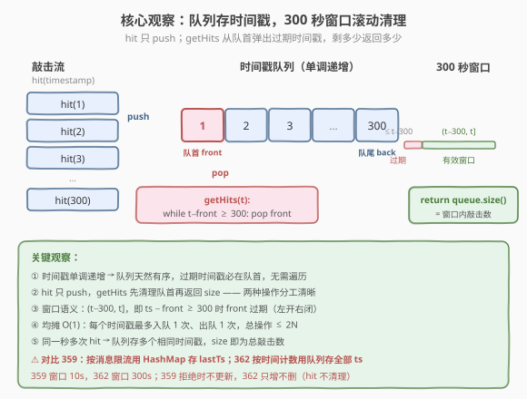
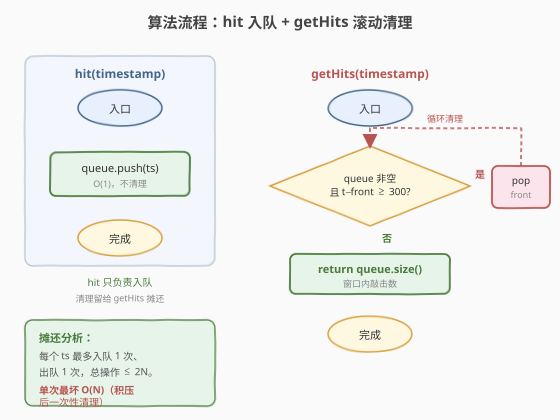
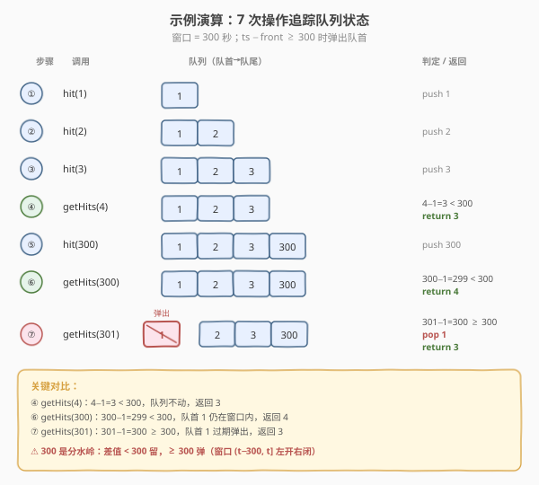
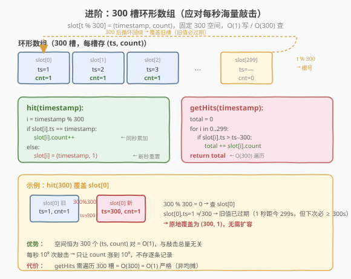

# 敲击计数器

- **题目名称**：敲击计数器
- **链接**：[362. 敲击计数器](https://leetcode.cn/problems/design-hit-counter/)
- **难度**：中等
- **标签**：设计、队列、滑动窗口、数据流

## 1. 题目概述

设计一个敲击计数器，统计**过去 5 分钟**（即过去 `300` 秒）内收到的敲击次数。每次调用接收一个时间戳参数 `timestamp`（秒级粒度），且调用按时间顺序传入（`timestamp` 单调递增）。**同一时间戳可能产生多次敲击**。

**接口**：

- `HitCounter()`：初始化敲击计数器对象。
- `void hit(int timestamp)`：记录在 `timestamp` 时刻发生的一次敲击。同一 `timestamp` 可能被多次调用。
- `int getHits(int timestamp)`：返回过去 `300` 秒内的敲击总数，即满足 $\text{timestamp} - 300 < \text{hit\_ts} \le \text{timestamp}$ 的敲击数。

**示例 1**：

```text
输入：
["HitCounter", "hit", "hit", "hit", "getHits", "hit", "getHits", "getHits"]
[[], [1], [2], [3], [4], [300], [300], [301]]

输出：
[null, null, null, null, 3, null, 4, 3]

解释：
HitCounter counter = new HitCounter();
counter.hit(1);       // 在 timestamp 1 敲击
counter.hit(2);       // 在 timestamp 2 敲击
counter.hit(3);       // 在 timestamp 3 敲击
counter.getHits(4);   // 返回 3（1,2,3 都在窗口内）
counter.hit(300);     // 在 timestamp 300 敲击
counter.getHits(300); // 返回 4（1,2,3,300 都在窗口内，300−1=299 < 300）
counter.getHits(301); // 返回 3（1 已过期：301−1=300 ≥ 300，剩 2,3,300）
```

**约束条件**：

- $1 \le \text{timestamp} \le 2 \times 10^9$
- 调用按时间顺序传入（`timestamp` 严格递增）
- 最多调用 $3 \times 10^4$ 次 `hit` 和 `getHits`

**进阶**：如果每秒敲击次数可能极大（如百万级），你的设计是否仍能扩展？

> 💡 本题是「**时间窗口计数**」的经典设计题，与 [359. 日志限速器](../0301-0400/359_日志限速器.md) 是一对姐妹题：359 按**消息**限流（每条消息 10 秒冷却，用 HashMap），362 按**时间**计数（300 秒窗口内总敲击数，用队列）。核心都是利用**时间戳单调递增**这一前提，把「窗口清理」简化为「队首弹出」。

---

## 2. 解题思路

### 2.1 暴力思路：全量列表 + 线性过滤

最直觉的做法：用一个列表 `hits` 存下所有敲击的时间戳。`hit` 时 append，`getHits` 时遍历列表，统计满足 `timestamp - 300 < t <= timestamp` 的时间戳个数。

```text
hit(ts):
    hits.append(ts)

getHits(ts):
    count = 0
    for t in hits:
        if ts - 300 < t <= ts:
            count++
    return count
```

问题：

- **时间**：`getHits` 单次 $O(N)$，$N$ 为历史敲击总数。调用 $3 \times 10^4$ 次时总开销 $O(N \times Q)$，最坏 $\sim 9 \times 10^8$，难以接受。
- **空间**：$O(N)$ 全量缓存，大量早已过期（`t ≤ timestamp − 300`）的记录对当前计数毫无贡献，纯属浪费。

> ⚠️ 暴力法的根源在于：把「窗口内的敲击」和「全部历史」混为一谈，每次都要从全量里筛出有效部分。而实际上，**时间戳单调递增**保证了过期记录必然集中在列表前端——这正是队列的用武之地。

### 2.2 核心观察：队列存时间戳 + 300 秒滚动清理



**关键洞察**：由于 `timestamp` 单调递增，敲击时间戳入队后**天然有序**。`getHits(t)` 时，所有过期记录（$t - \text{ts} \ge 300$，即 $\text{ts} \le t - 300$）必然集中在**队首**——只需从队首依次弹出，直到队首时间戳落入窗口 $(t-300, t]$ 内，此时队列长度即为窗口内敲击数。

$$\text{过期条件}：\text{timestamp} - \text{queue.front()} \ge 300$$

- `hit(ts)`：`queue.push(ts)`，$O(1)$，不清理（清理留给 `getHits` 摊还）。
- `getHits(t)`：`while` 队列非空且 $t - \text{front} \ge 300$：`pop`；最后 `return queue.size()`。

> 💡 **为什么只需从队首弹？** 时间戳单调递增 → 队列严格有序 → 若队首未过期（$t - \text{front} < 300$），则其后所有时间戳更不可能过期（$t - \text{ts} \le t - \text{front} < 300$）。因此过期记录必是队首的一段连续前缀，逐个弹出即可，无需遍历全队。

### 2.3 算法流程图



`hit` 与 `getHits` 分工清晰：

- **`hit(timestamp)`**：仅 `push`，$O(1)$。不做清理——把过期清理「延迟」到 `getHits` 统一处理，避免每次 `hit` 都扫队首。
- **`getHits(timestamp)`**：`while` 循环弹出过期队首，最后返回 `queue.size()`。每次 `pop` 是 $O(1)$，而每个时间戳最多入队 1 次、出队 1 次，故 $N$ 次操作总清理开销 $\le 2N$，**均摊每次 $O(1)$**。

> ⚠️ **均摊 vs 单次最坏**：虽然 `getHits` 的**均摊**复杂度是 $O(1)$，但**单次最坏**可达 $O(N)$——例如长时间不调用 `getHits`，队列积累了 $N$ 个过期记录后一次 `getHits` 要弹出全部。在实时性要求高的场景（如监控系统每秒查一次），可用第 5 节的环形数组方案保证 `getHits` 严格 $O(300) = O(1)$。

### 2.4 示例演算



以示例 1 的完整序列演示，逐步追踪队列状态与返回值：

| 步骤 | 调用 | 队列（队首→队尾） | 判定 | 动作 / 返回 |
|------|------|-------------------|------|------------|
| ① | `hit(1)` | → `[1]` | — | push 1 |
| ② | `hit(2)` | → `[1, 2]` | — | push 2 |
| ③ | `hit(3)` | → `[1, 2, 3]` | — | push 3 |
| ④ | `getHits(4)` | `[1, 2, 3]` | $4-1=3 < 300$ | 不弹，**return 3** |
| ⑤ | `hit(300)` | → `[1, 2, 3, 300]` | — | push 300 |
| ⑥ | `getHits(300)` | `[1, 2, 3, 300]` | $300-1=299 < 300$ | 不弹，**return 4** |
| ⑦ | `getHits(301)` | `[1, 2, 3, 300]` → `[2, 3, 300]` | $301-1=300 \ge 300$ | **pop 1**，**return 3** |

**关键看步骤 ⑥ 与 ⑦ 的对比**：`getHits(300)` 时 $300-1=299 < 300$，队首 `1` 仍在窗口 $(0, 300]$ 内，返回 4；`getHits(301)` 时 $301-1=300 \ge 300$，队首 `1` 落入过期区（窗口变为 $(1, 301]$，`1` 不满足 $> 1$），弹出后返回 3。

> 💡 **300 是分水岭**：差值 $< 300$ 留，$\ge 300$ 弹。这对应窗口 $(t-300, t]$ 的**左开右闭**语义——$t - 300$ 本身不算在窗口内（因为 $\text{ts} = t - 300$ 时 $t - \text{ts} = 300 \ge 300$，过期）。代码中判定条件 `timestamp − front >= 300` 严格对应这一语义。

---

## 3. 参考代码

### C++

```cpp
class HitCounter {
    queue<int> q;   // 存储每次敲击的时间戳（单调递增）

public:
    HitCounter() {}

    void hit(int timestamp) {
        q.push(timestamp);
    }

    int getHits(int timestamp) {
        while (!q.empty() && timestamp - q.front() >= 300) {
            q.pop();                 // 弹出过期队首
        }
        return q.size();
    }
};
```

### Python

```python
class HitCounter:
    def __init__(self):
        self.q = collections.deque()  # 存储每次敲击的时间戳（单调递增）

    def hit(self, timestamp: int) -> None:
        self.q.append(timestamp)

    def getHits(self, timestamp: int) -> int:
        while self.q and timestamp - self.q[0] >= 300:
            self.q.popleft()          # 弹出过期队首
        return len(self.q)
```

> 💡 **实现细节**：
>
> - **C++** 用 `std::queue<int>`，`front()` 看队首、`pop()` 出队、`push()` 入队，三件套均 $O(1)$。注意 `pop` 前必须检查 `!empty()`，否则 `front()` 是未定义行为。
> - **Python** 用 `collections.deque`，`q[0]` 看队首、`popleft()` 出队（$O(1)$）。切勿用 `list`——`list.pop(0)` 是 $O(n)$（整体前移），在海量敲击下会退化。
> - **同一秒多次 `hit`**：队列里存多个相同时间戳（如 `[5, 5, 5]`），`getHits` 返回时 `size()` 自然统计为 3。无需特殊处理——这是「逐条入队」方案最大的简洁性优势，也是它在「每秒敲击不大」场景下优于环形数组的原因。

---

## 4. 复杂度分析

| 维度 | 队列滚动法 | 暴力线性过滤 |
|------|-----------|-------------|
| **hit（单次）** | $O(1)$ | $O(1)$（append） |
| **getHits（均摊）** | $O(1)$ | $O(N)$，$N$ = 历史敲击总数 |
| **getHits（单次最坏）** | $O(N)$（积压后一次性清理） | $O(N)$ |
| **空间** | $O(N)$（窗口内 + 未清理的过期记录） | $O(N)$（全量历史） |

> 💡 队列法的**均摊 $O(1)$** 来自势能分析：每个时间戳最多入队 1 次、出队 1 次，总操作 $\le 2N$，分摊到 $N$ 次调用每次 $O(1)$。空间上虽然最坏也是 $O(N)$（若从不调 `getHits` 则队列无限增长），但实际使用中 `getHits` 会定期清理过期记录，稳态空间 $\le$ 最近 300 秒内的敲击数。对比暴力的**每次必扫全量** $O(N)$，队列法把「清理」从「每次全扫」变为「按需弹首」，是经典的**惰性清理（lazy eviction）**策略。

---

## 5. 扩展：环形数组 —— 应对每秒海量敲击

### 5.1 问题：逐条入队的瓶颈

队列法把每次敲击作为一个独立时间戳入队。若某秒内有 $10^6$ 次敲击，队列里就有 $10^6$ 个相同时间戳——空间与 `getHits` 的弹出开销都不可忽视。进阶问题「每秒敲击可能极大」正是对此的追问。

### 5.2 思路：300 槽环形数组 + (timestamp, count) 聚合



**核心观察**：窗口只有 300 秒，故同一槽位 $i = \text{ts} \bmod 300$ 在 300 秒后必然指向一个**已过期**的秒——可以原地覆盖，无需保留逐条记录。每个槽位存 `(timestamp, count)`：`timestamp` 标识该槽当前对应哪一秒，`count` 累计该秒的敲击数。

- **`hit(ts)`**：
  - $i = \text{ts} \bmod 300$
  - 若 $\text{slot}[i].\text{ts} == \text{ts}$：$\text{slot}[i].\text{count}{+}{+}$（同秒多次敲击，累加）
  - 否则：$\text{slot}[i] = (\text{ts}, 1)$（新秒，重置——旧值必已过期，因为 300 秒前）
- **`getHits(t)`**：遍历 300 个槽，累加所有 $\text{slot}[i].\text{ts} > t - 300$ 的 `count`。

> 💡 **为什么 $\text{slot}[i].\text{ts} \neq \text{ts}$ 时旧值必过期？** 槽 $i$ 上次写入的 $\text{ts}'$ 满足 $\text{ts}' \bmod 300 = i$ 且 $\text{ts}' < \text{ts}$（单调递增）。若 $\text{ts}' \neq \text{ts}$，则 $\text{ts} - \text{ts}' \ge 300$（同一余数的最小间距是 300）——即 $\text{ts}' \le \text{ts} - 300$，恰好过期。因此「新秒重置」是无损的：被覆盖的旧记录本来就不该留在窗口里。

### 5.3 代码

```cpp
class HitCounter {
    // 槽位：(timestamp, count)，固定 300 个
    pair<int, int> slots[300];

public:
    HitCounter() {
        for (int i = 0; i < 300; i++) slots[i] = {0, 0};
    }

    void hit(int timestamp) {
        int i = timestamp % 300;
        if (slots[i].first == timestamp) {
            slots[i].second++;          // 同秒，累加
        } else {
            slots[i] = {timestamp, 1};  // 新秒，重置
        }
    }

    int getHits(int timestamp) {
        int total = 0;
        for (int i = 0; i < 300; i++) {
            if (slots[i].first > timestamp - 300) {
                total += slots[i].second;
            }
        }
        return total;
    }
};
```

**Python 版**：

```python
class HitCounter:
    def __init__(self):
        self.slots = [(0, 0)] * 300  # (timestamp, count) × 300

    def hit(self, timestamp: int) -> None:
        i = timestamp % 300
        ts, cnt = self.slots[i]
        if ts == timestamp:
            self.slots[i] = (ts, cnt + 1)     # 同秒，累加
        else:
            self.slots[i] = (timestamp, 1)   # 新秒，重置

    def getHits(self, timestamp: int) -> int:
        return sum(
            cnt for ts, cnt in self.slots
            if ts > timestamp - 300
        )
```

### 5.4 两种实现对比

| 实现 | hit | getHits | 空间 | 每秒海量敲击 | 适用场景 |
|------|-----|---------|------|-------------|---------|
| 队列（逐条入队） | $O(1)$ | 均摊 $O(1)$ / 最坏 $O(N)$ | $O(N)$ | 退化（队列爆炸） | 敲击稀疏，代码最简 |
| 环形数组（聚合） | $O(1)$ | $O(300) = O(1)$ 严格 | $O(300) = O(1)$ | 稳定（count 累加） | 敲击密集，空间受限 |
| 暴力（全量列表） | $O(1)$ | $O(N)$ | $O(N)$ | 退化 | 不推荐 |

> ⚠️ **面试策略**：先讲队列法（最直观、最快写对），追问「每秒海量敲击」时亮环形数组。队列法是**计数语义**的最简实现，环形数组是**聚合优化**——用「固定 300 槽 + (ts, count) 聚合」把空间从 $O(N)$ 降到 $O(1)$，代价是 `getHits` 从均摊 $O(1)$ 变为严格 $O(300)$（但 300 是常数，仍为 $O(1)$）。两者的**时间渐进复杂度**相同，差异在**常数项与极端场景的稳定性**。

---

## 6. 面试要点

1. **为什么用队列而不是数组/哈希表？**

   - 敲击只需按时间顺序存取、先进先出（最老的先过期），正是队列的本职语义。`push`/`pop`/`front` 直接对应，无需手动维护下标或哈希键。
   - 哈希表无意义（没有「按键检索」的需求，只需统计窗口内总数）；数组虽能存，但清理过期需遍历找分界点，而单调递增保证了队列的过期段必在队首，`pop` 即可。队列是「单调序列 + 前缀过期」的最自然选择。

2. **`hit` 为什么不做清理，而是留给 `getHits`？**

   - **惰性清理**：`hit` 只 `push`，把过期清理延迟到 `getHits` 统一处理。好处是 `hit` 严格 $O(1)$（无偶发大清理），且 `getHits` 的清理开销可被多次 `hit` 摊还——每个时间戳最多入队 1 次、出队 1 次，总操作 $\le 2N$。
   - 若 `hit` 时也清理，则每次 `hit` 都要 `while` 弹队首，虽然单次均摊仍 $O(1)$，但增加了 `hit` 的最坏延迟，且与 `getHits` 重复清理。分工「`hit` 只写、`getHits` 读写」更清晰。

3. **$t - \text{front} = 300$ 时，队首算过期吗？**

   - 算。窗口是 $(t-300, t]$（左开右闭），即 $\text{ts} > t - 300$ 才在窗口内。$t - \text{front} = 300$ 即 $\text{front} = t - 300$，不满足 $> t - 300$，故过期。代码中判定 `timestamp − front >= 300` 弹出，严格对应。示例 ⑥⑦（$300-1=299$ 留、$301-1=300$ 弹）正是验证此边界。

4. **同一秒多次 `hit` 怎么处理？**

   - **队列法**：直接存多个相同时间戳（如 `hit(5)` 三次 → 队列 `[5, 5, 5]`），`getHits` 时 `size()` 自然统计为 3。无需合并——因为 `getHits` 只关心「窗口内有多少条记录」，不关心它们是否同秒。
   - **环形数组法**：$\text{slot}[\text{ts} \bmod 300]$ 的 `count++`，把同秒敲击聚合为一个计数。这正是环形数组在「每秒海量敲击」下的优势——$10^6$ 次同秒 `hit` 只让 `count` 涨到 $10^6$，而队列法会让队列膨胀 $10^6$ 个元素。

5. **环形数组为什么 $\text{slot}[i].\text{ts} \neq \text{ts}$ 时直接覆盖是安全的？**

   - 槽 $i = \text{ts} \bmod 300$ 上次写入的 $\text{ts}'$ 满足 $\text{ts}' \bmod 300 = i$ 且 $\text{ts}' < \text{ts}$（单调递增）。若 $\text{ts}' \neq \text{ts}$，则 $\text{ts} - \text{ts}' \ge 300$（同一余数的最小间距是 300），即 $\text{ts}' \le \text{ts} - 300$——该记录已过期，本就不该计入当前窗口。覆盖它无损正确性。
   - 这个性质依赖 `timestamp` **严格递增**：若时间戳不单调，同一槽位可能存着未来时间戳，覆盖会丢失有效数据。题目保证了这一前提。

> 💡 **一句话总结**：362 = 单调队列 + 300 秒滚动窗口。`hit` 只 push，`getHits` 弹过期队首后返回 `size()`，均摊 $O(1)/O(N)$。进阶用 300 槽环形数组聚合同秒敲击，空间 $O(1)$。与 359 互为「计数版 vs 限流版」姐妹题。

---

## 7. 同类练习题

- [359. 日志限速器](https://leetcode.cn/problems/logger-rate-limiter/)（[题解](../0301-0400/359_日志限速器.md)）：同为时间窗口设计题，但按消息限流（HashMap 存 lastTs）而非按时间计数（队列存全部 ts），是 362 的「限流版」姐妹题
- [346. 数据流中的移动平均值](https://leetcode.cn/problems/moving-average-from-data-stream/)（[题解](../0301-0400/346_数据流中的移动平均值.md)）：固定大小窗口 + 队列滚动，维护窗口**和**而非计数，与 362 的队列清理同源
- [933. 最近的请求次数](https://leetcode.cn/problems/number-of-recent-calls/)：队列维护 3000 毫秒窗口，统计窗口内请求数，与 362 的队列清理逻辑**完全一致**（窗口大小 3000ms vs 300s）
- [622. 设计循环队列](https://leetcode.cn/problems/design-circular-queue/)：环形缓冲区的直接应用，本题第 5 节扩展的母题，体会游标循环与窗口轮换的对齐
- [239. 滑动窗口最大值](https://leetcode.cn/problems/sliding-window-maximum/)（[题解](../0201-0300/239_滑动窗口最大值.md)）：同为固定窗口 + 队列，但维护**最值**需单调队列，是 362「维护计数」的高阶变体
