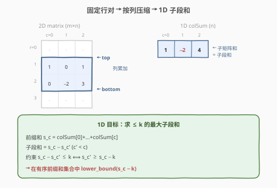
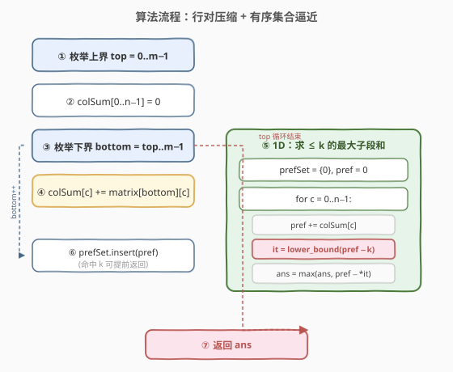

# LeetCode 矩形区域不超过K的最大数值和 题解

## 1. 题目概述

- **标题 / 题号**：矩形区域不超过K的最大数值和（#363，hard）
- **链接**：https://leetcode.cn/problems/max-sum-of-rectangle-no-larger-than-k/
- **难度**：困难
- **标签**：数组、前缀和、有序集合、二分查找

**题意**：给定一个 `m x n` 的矩阵 `matrix` 和一个整数 `k`，找出并返回矩阵内部**矩形区域**的不超过 `k` 的**最大数值和**。

形式化地，求所有非空子矩阵 $(r_1, c_1, r_2, c_2)$（$0 \le r_1 \le r_2 < m$，$0 \le c_1 \le c_2 < n$）的元素和 $S$ 中，满足 $S \le k$ 的最大者。题目保证答案存在。

**示例 1**：

```text
输入：matrix = [[1,0,1],[0,-2,3]], k = 2
输出：2
解释：矩形区域 [[0, 1], [-2, 3]]（即 row 0..1, col 1..2）的数值和是 0 + 1 + (-2) + 3 = 2，
      且 2 是不超过 k=2 的最大数字。
```

**示例 2**：

```text
输入：matrix = [[2,2,-1]], k = 3
输出：3
解释：整行 [2,2,-1] 的和为 3，恰好等于 k。
```

**约束**：

- `m == matrix.length`，`n == matrix[i].length`
- `1 <= m, n <= 100`
- `-100 <= matrix[i][j] <= 100`
- $-10^5 \le k \le 10^5$

> ⚠️ 注意：矩阵元素可正可负，因此**子矩阵和不存在单调性**——不能用普通「最大子数组和」的 Kadane 直接套，因为 Kadane 求的是全局最大（可能 > k），而本题要的是「不超过 k 的最大值」。这一「带约束的最大」正是破题的难点。

## 2. 解题思路

### 2.1 暴力思路：四重循环枚举所有子矩阵

最直观做法：枚举左上角 $(r_1, c_1)$ 与右下角 $(r_2, c_2)$，再双重循环求和。共 $O(m^2 n^2)$ 个子矩阵，每个求和 $O(mn)$，总计 $O(m^3 n^3)$，`m=n=100` 时约 $10^{12}$，必然超时。

即使借助二维前缀和把求和降到 $O(1)$，仍需枚举 $O(m^2 n^2) \approx 2.5 \times 10^7$ 个子矩阵——常数虽小但无法剪枝，且对每个子矩阵和只能逐一与 `k` 比较，最坏依旧偏慢。需要找到「**降维 + 批量逼近**」的方法。

### 2.2 核心观察：行对压缩 + 有序集合逼近



本题是 **[304. 二维区域和检索](304_二维区域和检索 - 数组不可变.md)** 的「求最优子矩阵」版，与 **[327. 区间和的个数](327_区间和的个数.md)** 共享「前缀和 + 有序结构」的内核。分两步把二维问题降到一维：

**第一步：固定上下边界，按列压缩为 1D 数组**。枚举上界 `top` 与下界 `bottom`（$top \le bottom$），把这两行之间**每一列**的元素累加成一个长度为 $n$ 的一维数组 `colSum`：

$$\text{colSum}[c] = \sum_{r=\text{top}}^{\text{bottom}} \text{matrix}[r][c]$$

于是「在 `top..bottom` 行带内选一个子矩阵」等价于「在 `colSum` 上选一段连续子数组」——子矩阵和 = 子数组和。**增量构造**：`bottom` 每下移一行，只需把新行加到 `colSum` 上，无需重算，$O(n)$ 维护。

**第二步：1D 问题——求 ≤ k 的最大子数组和**。这是经典子问题，由于元素可负，**Kadane 失效**，需用「**前缀和 + 有序集合**」：

- 设一维前缀和 $s_c = \sum_{j=0}^{c} \text{colSum}[j]$，则任意子段和 $= s_c - s_{c'}$（$c' < c$）。
- 目标：$\max\{s_c - s_{c'}\}$ 满足 $s_c - s_{c'} \le k$，即 $s_{c'} \ge s_c - k$。
- 在**已见过的前缀和升序集合**中，用 `lower_bound(s_c - k)` 找到**最小**的 $s_{c'} \ge s_c - k$——它使 $s_c - s_{c'}$ 在满足约束下**最大**。
- 哨兵 $s_{-1} = 0$ 预入集合，覆盖「从下标 0 开始的整段」。

> 💡 **为何 `lower_bound(s_c - k)` 给出最大合法差**：满足 $s_{c'} \ge s_c - k$ 的集合元素构成升序数组的**后缀**；要使 $s_c - s_{c'}$ 最大，就要让 $s_{c'}$ 最小，恰好是后缀首元素——即 `lower_bound` 返回值。若该差 $\le k$（必满足，因 $s_{c'} \ge s_c - k \Rightarrow s_c - s_{c'} \le k$），即得一个候选答案。

> ⚠️ **与 [327. 区间和的个数](327_区间和的个数.md) 的对照**：327 是「**计数**落在区间的数对差」，用归并排序双指针批量统计；363 是「**求最大**不超过 k 的数对差」，需要逐个查询「最小合法前驱」，**在线**结构 `std::set` / `SortedList` 更直观。两者都是「前缀和 + 有序结构」家族。

### 2.3 算法流程图



**完整步骤**：

1. **枚举上界** `top` 从 `0` 到 `m-1`：
2. 每次重置 `colSum[c] = 0`（长度 $n$）。
3. **枚举下界** `bottom` 从 `top` 到 `m-1`（增量）：
   - 把 `matrix[bottom][c]` 累加到 `colSum[c]`（$O(n)$）。
   - **1D 求解**：维护有序集合 `prefSet`（初始含 `0`）、前缀和 `pref = 0`、答案 `ans = -∞`。
     - 对 `c` 从 `0` 到 `n-1`：
       - `pref += colSum[c]`
       - `it = prefSet.lower_bound(pref - k)`
       - 若 `it != end()`：`cand = pref - *it`，若 `cand > ans` 则 `ans = cand`
       - `prefSet.insert(pref)`
4. 返回 `ans`。

> 💡 **提前命中剪枝**：若某次 `cand == k`，已是最优，可直接返回 `k`。因为不可能存在比 `k` 更大且仍 $\le k$ 的值。

### 2.4 示例演算

以 `matrix = [[1,0,1],[0,-2,3]], k = 2` 为例，演示行对压缩与 1D 有序集合查询。

![示例演算：[[1,0,1],[0,-2,3]], k=2 → 2](../images/msrn_example_walkthrough.svg)

**top=0**：

| bottom | colSum（累加 row bottom） | 1D 前缀和序列 | prefSet 查询命中 | 候选 | ans |
|--------|---------------------------|---------------|------------------|------|-----|
| 0 | `[1, 0, 1]` | 1, 1, 2 | c=0: lb(−1)→0, 1−0=1；c=1: lb(−1)→0, 1−0=1；c=2: lb(0)→0, 2−0=2 | 2 | **2** |
| 1 | `[1,−2,4]`（加 row1） | 1, −1, 3 | c=0: lb(−1)→0, 1；c=1: lb(−3)→0, −1；c=2: lb(1)→1, 3−1=2 | 2 | 2 |

**top=1**：

| bottom | colSum | 1D 前缀和序列 | prefSet 查询命中 | 候选 | ans |
|--------|--------|---------------|------------------|------|-----|
| 1 | `[0,−2,3]` | 0, −2, 1 | c=0: lb(−2)→0, 0；c=1: lb(−4)→0, −2；c=2: lb(−1)→0, 1 | 1 | 2 |

最终 `ans = 2`，对应矩形 `row 0..1, col 1..2`（即 `[[0,1],[-2,3]]`，和为 `0+1+(−2)+3 = 2`）。

> 💡 **bottom=1（top=0）的 c=2 关键命中**：`pref=3`，`pref-k=1`，`prefSet` 此时含 `{0,1,−1}`（有序为 `{−1,0,1}`），`lower_bound(1)` 返回迭代器指向 `1`，`cand = 3 − 1 = 2`。这个 `1` 来自 `c=0` 时的前缀和——意味着子段从 `c=1` 开始（去掉 `c=0` 那段），即 `colSum[1..2] = −2 + 4 = 2`，恰对应原矩阵 `col 1..2`。

## 3. 参考代码

### C++

```cpp
class Solution {
  public:
    int maxSumSubmatrix(vector<vector<int>>& matrix, int k) {
        int m = matrix.size(), n = matrix[0].size();
        int ans = INT_MIN;
        for (int top = 0; top < m; ++top) {
            vector<int> colSum(n, 0);
            for (int bottom = top; bottom < m; ++bottom) {
                for (int c = 0; c < n; ++c) colSum[c] += matrix[bottom][c];
                set<int> prefSet{0};
                int pref = 0;
                for (int c = 0; c < n; ++c) {
                    pref += colSum[c];
                    auto it = prefSet.lower_bound(pref - k);
                    if (it != prefSet.end()) {
                        int cand = pref - *it;
                        if (cand > ans) ans = cand;
                    }
                    prefSet.insert(pref);
                }
            }
        }
        return ans;
    }
};
```

### Python

```python
import bisect

class Solution:
    def maxSumSubmatrix(self, matrix: List[List[int]], k: int) -> int:
        m, n = len(matrix), len(matrix[0])
        ans = float('-inf')
        for top in range(m):
            col_sum = [0] * n
            for bottom in range(top, m):
                for c in range(n):
                    col_sum[c] += matrix[bottom][c]
                prefs = [0]
                pref = 0
                for c in range(n):
                    pref += col_sum[c]
                    idx = bisect.bisect_left(prefs, pref - k)
                    if idx < len(prefs):
                        cand = pref - prefs[idx]
                        if cand > ans:
                            ans = cand
                    bisect.insort(prefs, pref)
        return ans
```

> ⚠️ **Python 的 `bisect.insort` 是 $O(n)$ 插入**（底层 list 元素后移），故 1D 部分为 $O(n^2)$，整体 $O(m^2 n^2)$。`m,n ≤ 100` 时约 $2.5 \times 10^7$ 量级可过。若追求 $O(n \log n)$，可用 `sortedcontainers.SortedList`（LeetCode 环境已预装）：`sl = SortedList([0])`、`idx = sl.bisect_left(pref - k)`、`sl.add(pref)`。

> 💡 **`long long` 不是必需**：$m,n \le 100$，$|\text{matrix}[i][j]| \le 100$，故 $|\text{pref}| \le 100 \times 100 \times 100 = 10^6$，`int`（≥ $2 \times 10^9$）足够。对比 [327](327_区间和的个数.md) 的 $n \le 10^5$ 必须 `long long`，本题规模小得多。

## 4. 复杂度分析

| 维度 | 复杂度 | 说明 |
|------|--------|------|
| **时间复杂度** | $O(m^2 \cdot n \log n)$ | 行对 $O(m^2)$；每对做 1D 有序集合求解 $O(n \log n)$（C++ `std::set`）；Python `bisect` 版为 $O(m^2 n^2)$ |
| **空间复杂度** | $O(n)$ | `colSum` $O(n)$ + `prefSet` 至多 $n+1$ 个元素 $O(n)$；不计输入矩阵 |

> 💡 **进阶：行数远大于列数时**。若 $m \gg n$，把外层双重循环改为枚举**列对**（左/右边界），压缩成「行方向」的 1D 数组，复杂度变为 $O(n^2 \cdot m \log m)$。一般地，令 $d = \min(m, n)$、$D = \max(m, n)$，总复杂度 $O(d^2 \cdot D \log D)$——始终对**较小维度**做平方枚举。实现上可在 $m > n$ 时对矩阵做一次转置再套用同一逻辑（见第 5 节）。

## 5. 扩展：行数远大于列数——转置优化

题目的「进阶」问：如果行数远大于列数该如何设计？答案是**把较小维度作为外层枚举维度**。实现上最简洁的做法是在 $m > n$ 时先转置矩阵，再套用同一套「枚举行对」逻辑：

```cpp
class Solution {
  public:
    int maxSumSubmatrix(vector<vector<int>>& matrix, int k) {
        int m = matrix.size(), n = matrix[0].size();
        // 若行多于列，转置后让外层枚举维度更小
        if (m > n) {
            vector<vector<int>> t(n, vector<int>(m));
            for (int i = 0; i < m; ++i)
                for (int j = 0; j < n; ++j) t[j][i] = matrix[i][j];
            return maxSumSubmatrix(t, k);
        }
        int ans = INT_MIN;
        for (int top = 0; top < m; ++top) {
            vector<int> colSum(n, 0);
            for (int bottom = top; bottom < m; ++bottom) {
                for (int c = 0; c < n; ++c) colSum[c] += matrix[bottom][c];
                set<int> prefSet{0};
                int pref = 0;
                for (int c = 0; c < n; ++c) {
                    pref += colSum[c];
                    auto it = prefSet.lower_bound(pref - k);
                    if (it != prefSet.end() && pref - *it > ans) ans = pref - *it;
                    prefSet.insert(pref);
                }
            }
        }
        return ans;
    }
};
```

> ⚠️ 转置花费 $O(mn)$，相对 $O(d^2 D \log D)$ 可忽略。递归调用仅一层（转置后必然 $n' \le m'$，不再转置），不会无限递归。

| 维度选取 | 外层平方维度 | 内层压缩维度 | 总复杂度 |
|----------|--------------|--------------|----------|
| 枚举行对（默认） | $m$ | $n$ | $O(m^2 n \log n)$ |
| 枚举列对（转置后） | $n$ | $m$ | $O(n^2 m \log m)$ |
| **自适应（取较小）** | $\min(m,n)$ | $\max(m,n)$ | $O(\min(m,n)^2 \max(m,n) \log \max(m,n))$ |

## 6. 面试要点

1. **为什么不能用 Kadane 直接求最大子矩阵和再裁剪到 k？**

   - Kadane 求**全局最大**子段和，可能 $> k$；而本题要的是「$\le k$ 的最大」，是一个**带约束的最优化**。Kadane 的「累加或重启」贪心无法在累加过程中判断「裁掉一段前缀后是否更接近 k」——负数存在时，保留一个暂时更小的前缀和反而可能在后续减出更优解。必须用「前缀和 + 有序集合」逐位置查询最优前驱。

2. **为什么 `lower_bound(pref - k)` 给出的是「不超过 k 的最大子段和」？**

   - 我们要最大化 $pref - s'$ 满足 $pref - s' \le k$，等价于 $s' \ge pref - k$。在升序集合中，满足该条件的 $s'$ 是一个后缀，**后缀首元素最小**——它使被减数最小，从而差最大。`lower_bound(pref - k)` 恰好返回后缀首元素的迭代器。该差必 $\le k$（由 $s' \ge pref - k$ 保证）。

3. **哨兵 `0` 预入集合的作用？**

   - 让「从下标 0 开始的整段子数组」也纳入 $(c' = -1, s' = 0)$ 的配对形式。否则需要特判 $pref$ 本身（即整段和）是否 $\le k$。哨兵统一处理，与 [327](327_区间和的个数.md) 的 `pref[0]=0` 同理。

4. **行对压缩为什么要用「增量」而不是每次重算？**

   - 固定 `top` 后，`bottom` 从 `top` 递增时，新 `colSum` = 旧 `colSum` + `matrix[bottom]`，$O(n)$ 增量即可。若每对 `(top, bottom)` 都从零累加 $O((bottom-top+1) \cdot n)$，总复杂度升到 $O(m^3 n \log n)$，浪费了一半。

5. **`m > n` 时为什么转置更优？**

   - 外层双重循环枚举行对是 $O(m^2)$，内层 1D 是 $O(n \log n)$。当 $m \gg n$ 时 $m^2$ 主导。转置后外层变成 $O(n^2)$、内层 $O(m \log m)$，把平方项压到较小维度。令 $d = \min(m,n)$，最优复杂度 $O(d^2 D \log D)$。

6. **与 [327. 区间和的个数](327_区间和的个数.md) 的核心区别？**

   - 327 是**计数**「区间和落在 `[lower, upper]`」的对数，用归并排序在合并阶段双指针批量统计，$O(n \log n)$ 一次搞定。363 是**求最大**「子段和 $\le k$」，需要逐位置查询「最小合法前驱」，更适合**在线**有序集合 `std::set`。两者共享「前缀和 + 有序结构」思想，但任务形态（计数 vs 求最值）决定了不同实现。

## 同类练习题

| # | 题目 | 与本题的关联 |
|---|------|-------------|
| 327 | [区间和的个数](https://leetcode.cn/problems/count-of-range-sum/)（[题解](327_区间和的个数.md)） | 前缀和 + 有序结构家族的「计数」版，用归并排序双指针统计区间和落 `[lower, upper]` 的对数，本题是其「求最大值」姊妹题 |
| 304 | [二维区域和检索 - 数组不可变](https://leetcode.cn/problems/range-sum-query-2d-immutable/)（[题解](304_二维区域和检索 - 数组不可变.md)） | 二维前缀和母题，掌握「四角容斥」后再看本题的「行对压缩」会更直观 |
| 53 | [最大子数组和](https://leetcode.cn/problems/maximum-subarray/)（[题解](../0001-0100/53_最大子数组和.md)） | Kadane 母题，对照理解「为何带 $\le k$ 约束后 Kadane 失效、必须改用前缀和 + 有序集合」 |
| 862 | [和至少为 K 的最短子数组](https://leetcode.cn/problems/shortest-subarray-with-sum-at-least-k/) | 同为「前缀和 + 有序结构（单调队列）」的带约束子段问题，对比 `lower_bound` 用 `set` 还是单调队列的取舍 |
| 209 | [长度最小的子数组](https://leetcode.cn/problems/minimum-size-subarray-sum/)（[题解](../0201-0300/209_长度最小的子数组.md)） | 正数单调场景下的滑动窗口解法，对照本题因负数存在而失效的原因 |
