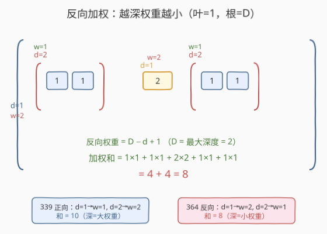
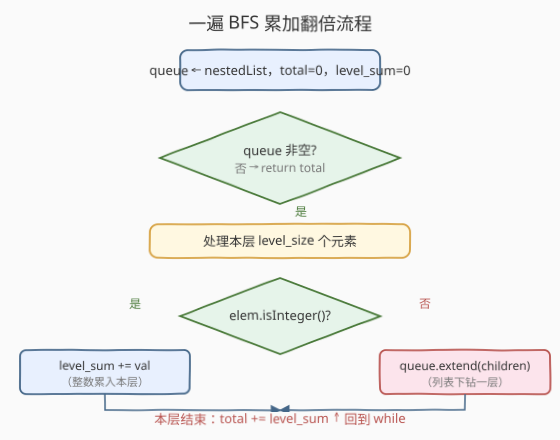

# LeetCode 嵌套列表加权和 II 题解

## 1. 题目概述

- **标题 / 题号**：嵌套列表加权和 II（#364，medium）
- **链接**：https://leetcode.cn/problems/nested-list-weight-sum-ii/
- **难度**：中等
- **标签**：深度优先搜索、广度优先搜索、递归、树

**题意**：给定一个**嵌套列表**，其中每个元素要么是一个**整数**，要么是**另一个嵌套列表**（可任意嵌套）。整数的「**深度**」定义为其所在列表的层数——**最外层列表深度为 1**，往内每多一层加 1。

与 [339. 嵌套列表加权和](../0301-0400/339_嵌套列表加权和.md) 不同，本题的**权重方向反转**：**越深的整数权重越小**——叶层整数权重为 1，根层整数权重为最大深度 $D$。换言之，深度为 $d$ 的整数权重为 $D - d + 1$。

要求返回所有整数的**反向加权和**。

`NestedInteger` 接口定义如下（与 339 / 341 共享）：

```python
class NestedInteger:
    def isInteger(self) -> bool: ...
    def getInteger(self) -> int: ...       # 仅当 isInteger() 为 True 时有效
    def getList(self) -> List[NestedInteger]: ...  # 仅当 isInteger() 为 False 时有效
```

**示例 1**：

```text
输入：nestedList = [[1,1],2,[1,1]]
输出：8
解释：最大深度 D=2。四个 1 各在深度 2，反向权重 1，贡献 1×1×4 = 4；一个 2 在深度 1，反向权重 2，贡献 2×2 = 4；合计 8。
```

**示例 2**：

```text
输入：nestedList = [1,[4,[6]]]
输出：17
解释：最大深度 D=3。1 在深度 1，反向权重 3，贡献 1×3 = 3；4 在深度 2，反向权重 2，贡献 4×2 = 8；6 在深度 3，反向权重 1，贡献 6×1 = 6；合计 17。
```

**约束**：

- $1 \le \text{nestedList.length} \le 50$
- 嵌套列表中整数取值范围 $[-100, 100]$
- 最大深度不超过 $200$

> 💡 本题是 [339. 嵌套列表加权和](../0301-0400/339_嵌套列表加权和.md) 的镜像——数据结构仍是「嵌套列表 = 多叉树」，只是权重从「**深=大**」翻转为「**深=小**」。难点不在遍历，而在**权重依赖最大深度 $D$，而 $D$ 要遍历完才知道**。朴素做法是两遍 DFS（先求 $D$ 再加权求和），但存在一个**一遍 BFS 累加翻倍**的优雅解法——让 `level_sum` 跨层不重置，每层 `total += level_sum` 自然实现反向加权，无需预求 $D$。这是「**用遍历顺序的对称性换掉对全局信息的依赖**」的典型技巧。

## 2. 解题思路

### 2.1 直接思路：两遍 DFS

最直观的想法：反向权重 $= D - d + 1$ 依赖最大深度 $D$，而 $D$ 必须遍历完整棵嵌套树才能确定。那就分两步走：

```text
第一遍 DFS：求最大深度 D                   O(n)
第二遍 DFS：按 (D − depth + 1) 加权求和      O(n)
```

```python
class Solution:
    def depthSumInverse(self, nestedList: List[NestedInteger]) -> int:
        D = self.maxDepth(nestedList)
        return self.dfs(nestedList, 1, D)

    def maxDepth(self, nested):
        depth = 1
        for elem in nested:
            if not elem.isInteger():
                depth = max(depth, 1 + self.maxDepth(elem.getList()))
        return depth

    def dfs(self, nested, depth, D):
        total = 0
        for elem in nested:
            if elem.isInteger():
                total += elem.getInteger() * (D - depth + 1)   # 反向权重
            else:
                total += self.dfs(elem.getList(), depth + 1, D)
        return total
```

写法清晰，复杂度 $O(n)$ 也能 AC。但**遍历了两遍**——能否一遍搞定？

> ⚠️ 直觉上「权重依赖 $D$，$D$ 又要遍历完才知道」似乎是天然的两遍问题。但仔细想：反向权重的本质是「**越浅的整数被计入越多次**」。如果我们能让浅层整数在**后续每一层都被重新累加一次**，就等价于实现了反向加权——而 BFS 的「逐层推进」天然提供了「后续每一层」这个节奏。这引出下面的核心观察。

### 2.2 核心观察：一遍 BFS，level_sum 跨层不重置



**关键洞察**：把「权重」重新解读为「**被加的次数**」。

设整数 $v$ 在深度 $d$（从 1 开始），最大深度为 $D$，则反向权重 $= D - d + 1$。这恰等于「**从第 $d$ 层到第 $D$ 层的层数**」——即 $v$ 从它所在层起，到遍历结束为止，还要经历 $D - d + 1$ 层。

于是设计：维护一个**跨层不重置**的 `level_sum`（累积所有已见整数之和），每处理完一层就执行 `total += level_sum`。这样：

- $v$ 在第 $d$ 层首次进入 `level_sum`；
- 此后第 $d, d+1, \dots, D$ 层每层都执行一次 `total += level_sum`，共 $D - d + 1$ 次；
- 即 $v$ 被加了 $D - d + 1$ 次——**恰好就是反向权重**。

$$\text{total} = \sum_{\text{层 } l=1}^{D} \text{level\_sum}_l \quad\text{其中}\quad \text{level\_sum}_l = \sum_{\text{整数 } v,\ \text{depth}(v) \le l} v$$

> 💡 **为什么 `level_sum` 不能重置？** 若每层重置 `level_sum`，则 `total += level_sum` 只会把本层整数加一次——退化成「**正向加权，权重恒为 1**」，毫无意义。`level_sum` 跨层累积是让浅层整数「**被反复计入**」的唯一机制。这一步是整个解法的「点睛之笔」，也是面试中最容易被追问的关键设计。

> ⚠️ **与 339 BFS 写法的唯一区别**：339 的 BFS 每层 `level_sum` **重置**为 0（只累加本层整数，乘以 `depth`）；本题 `level_sum` **不重置**（累积所有已见整数，每层整体翻倍）。同样的 BFS 框架，仅凭「重置 / 不重置」一个开关，就从正向加权切到反向加权——这是理解两题关系的最佳切入点。

### 2.3 算法流程图



**完整步骤**：

1. **初始化**：`queue ← nestedList`（最外层元素入队），`total = 0`，`level_sum = 0`。
2. **层循环** `while queue 非空`：
   - 记 `level_size = len(queue)`（本层待处理元素数）。
   - 循环 `level_size` 次：`elem = queue.popleft()`。
     - 若 `elem.isInteger()`：`level_sum += elem.getInteger()`。
     - 否则：`queue.extend(elem.getList())`（子元素入队，下一层处理）。
   - **层末**：`total += level_sum`（关键步——把所有已见整数再整体加一次）。
3. **返回** `total`。

> ⚠️ **`level_size = len(queue)` 必须在层首快照**：层循环中 `queue.extend(...)` 会向队尾添加下一层元素，若不先快照本层大小，会把下一层元素也算进本层处理，破坏「逐层」语义。这与 [102. 二叉树的层序遍历](../0101-0200/102_二叉树的层序遍历.md) 的 `level_size` 快照技巧完全一致。

### 2.4 示例演算

以示例 2 `nestedList = [1,[4,[6]]]` 为例（最大深度 $D=3$，答案 17）：

![示例 [1,[4,[6]]] 一遍 BFS 演算：level_sum 跨层累积 1→5→11，total 逐层 1→6→17](../images/nestedlist_weight2_walkthrough.svg)

逐层演化如下：

| 层（深度 $d$） | queue 内容 | 本层整数 | `level_sum`（累积） | 层末 `total += level_sum` |
|----------------|------------|----------|---------------------|---------------------------|
| 1 | `1, [4,[6]]` | `+1` | $0 + 1 = 1$ | $0 + 1 = 1$ |
| 2 | `4, [6]` | `+4` | $1 + 4 = 5$ | $1 + 5 = 6$ |
| 3 | `6` | `+6` | $5 + 6 = 11$ | $6 + 11 = 17$ |

验证「被加次数」：整数 `1`（$d=1$）从第 1 层起进入 `level_sum`，被 `total +=` 计入 3 次（$D - 1 + 1 = 3$）→ $1 \times 3 = 3$；`4`（$d=2$）被计入 2 次 → $4 \times 2 = 8$；`6`（$d=3$）被计入 1 次 → $6 \times 1 = 6$。合计 $3 + 8 + 6 = 17$。✓

> 💡 **观察 `level_sum` 如何「滚雪球」**：它从不归零，每层只增不减。第 1 层的 `1` 在第 2、3 层仍留在 `level_sum` 里被反复加进 `total`——这正是「浅层整数权重更大」的物理解释。整张表只遍历一遍，**无需预求 $D$**，$D$ 在遍历自然结束时隐式确定。

## 3. 参考代码

### C++

```cpp
// 嵌套列表加权和 II.cpp —— 一遍 BFS，level_sum 跨层不重置
// 编译: g++ -O2 -std=c++17 嵌套列表加权和II.cpp -o nested_weight2
#include <vector>
#include <queue>

class NestedInteger {
public:
    bool isInteger() const;
    int getInteger() const;
    const std::vector<NestedInteger>& getList() const;
};

class Solution {
public:
    int depthSumInverse(std::vector<NestedInteger>& nestedList) {
        std::queue<NestedInteger> q;
        for (const auto& e : nestedList) q.push(e);
        int total = 0, levelSum = 0;
        while (!q.empty()) {
            int levelSize = q.size();            // 快照本层大小
            for (int i = 0; i < levelSize; ++i) {
                auto elem = q.front(); q.pop();
                if (elem.isInteger()) {
                    levelSum += elem.getInteger();          // 累入跨层累积器
                } else {
                    for (const auto& child : elem.getList())
                        q.push(child);                      // 子元素入队，下一层处理
                }
            }
            total += levelSum;                // 关键：每层把已见整数再整体加一次
        }
        return total;
    }
};
```

### Python

```python
from collections import deque

class Solution:
    def depthSumInverse(self, nestedList: List[NestedInteger]) -> int:
        queue = deque(nestedList)
        total, level_sum = 0, 0
        while queue:
            level_size = len(queue)                 # 快照本层大小
            for _ in range(level_size):
                elem = queue.popleft()
                if elem.isInteger():
                    level_sum += elem.getInteger()  # 累入跨层累积器
                else:
                    queue.extend(elem.getList())    # 子元素入队，下一层处理
            total += level_sum          # 关键：每层把已见整数再整体加一次
        return total
```

> 💡 **三个细节**：① `level_sum` 在 `while` 外初始化为 0 且**层内不重置**——它是跨层累积器，不是本层小计。② `level_size = len(queue)` 必须在 `for` 循环前快照，避免 `extend` 添加的下一层元素污染本层计数。③ `queue.extend(elem.getList())` 把列表的**直接子元素**入队（而非 `elem` 本身），与 339 / 341 的 `getList()` 用法一致。

> ⚠️ **C++ 中 `auto elem = q.front()` 是值拷贝**：`NestedInteger` 在 LeetCode C++ 驱动里通常按值语义提供，拷贝安全。若接口返回 `const&` 且对象很大，可改用 `std::queue<NestedInteger>::const_reference` 配合 `getList()` 的引用返回避免拷贝——本题规模下无需纠结。

## 4. 复杂度分析

| 维度 | 复杂度 | 说明 |
|------|--------|------|
| **时间** | $O(n)$ | 每个 `NestedInteger` 节点（整数 + 列表）入队 / 出队一次；整数节点 $O(1)$ 累加，列表节点 $O(1)$ 转移；$n$ 为节点总数 |
| **空间** | $O(n)$ | 队列最宽持有「最大层」的全部节点；最坏全平铺时队列持有 $L = n$ 个元素 |

> ⚠️ **空间与 339 DFS 的对比**：339 用 DFS 递归栈空间 $O(d)$（$d$ 为最大深度，$\le 200$）；本题 BFS 队列空间 $O(w)$（$w$ 为最大层宽，最坏 $O(n)$）。在「宽而浅」的结构上 BFS 比 DFS 更费内存，反之「窄而深」时 BFS 更省。本题规模 $n \le 50$ 两者均可，但若追求最省空间，可改用下方 5.2 的「一遍 DFS + unweighted 累积」写法，空间回到 $O(d)$。

> 💡 **$n$ 的定义**：节点总数 = 整数节点数 $m$ + 列表节点数 $k$。每个整数必有唯一父列表，故 $k \le m + 1$，$n = O(m)$。渐近意义上用 $m$ 或 $n$ 等价。

## 5. 扩展：两种变体写法

### 5.1 两遍 DFS（朴素版）

即 2.1 的直接思路——先求 $D$ 再加权求和。代码完整版如下，作为对照理解「为什么一遍 BFS 更优雅」：

```python
class Solution:
    def depthSumInverse(self, nestedList: List[NestedInteger]) -> int:
        D = self._max_depth(nestedList)
        return self._dfs(nestedList, 1, D)

    def _max_depth(self, nested):
        depth = 1
        for elem in nested:
            if not elem.isInteger():
                depth = max(depth, 1 + self._max_depth(elem.getList()))
        return depth

    def _dfs(self, nested, depth, D):
        total = 0
        for elem in nested:
            if elem.isInteger():
                total += elem.getInteger() * (D - depth + 1)   # 反向权重
            else:
                total += self._dfs(elem.getList(), depth + 1, D)
        return total
```

> 💡 **两遍 DFS 的取舍**：思路最直白（直接套公式 $D - d + 1$），但遍历两遍 $O(2n)$，且第一遍求 $D$ 时遍历的节点信息在第二遍要重新获取——浪费了一半工作。面试中可作为「朴素解法」先抛出，再优化到一遍 BFS，展示「**消除对全局信息的提前依赖**」的优化思路。

### 5.2 一遍 DFS + unweighted 累积（空间 $O(d)$）

BFS 队列最宽 $O(n)$，若要压到 $O(d)$ 可回到 DFS。关键观察：一遍 DFS 中维护两个累积量——

- `weighted`：已见整数按「当前深度」加权的和（沿途累加）；
- `unweighted`：已见整数的无权的和（不乘深度）。

每深入一层（`depth` 增大）时，把本层新见整数加进 `unweighted`，再把整个 `unweighted` 加进 `weighted`——等价于「之前所有整数权重再 +1」。最终 `weighted` 即为反向加权和。

```python
class Solution:
    def depthSumInverse(self, nestedList: List[NestedInteger]) -> int:
        weighted, unweighted = 0, 0
        queue = [nestedList]                       # 用「待处理列表」栈模拟
        while queue:
            level = queue.pop()
            for elem in level:
                if elem.isInteger():
                    unweighted += elem.getInteger()
                else:
                    queue.append(elem.getList())
            weighted += unweighted                  # 每层把已见整数再整体加一次
        return weighted
```

> ⚠️ 这里用栈 `pop()` 取「最后入队的列表」做 DFS 顺序（LIFO），但「每处理完一个列表层就 `weighted += unweighted`」的语义与 BFS 一致——只要保证「一个列表的所有直接子元素处理完后再 `+=`」即可。最终复杂度 $O(n)$ 时间、$O(d)$ 空间（栈深 = 最大深度）。本质上仍是「`level_sum` 跨层不重置 + 每层 `total += level_sum`」，只是遍历顺序从层序换成深度优先。

### 5.3 嵌套结构题家族横向对比

| 题号 | 题目 | 方向 | 核心做法 |
|------|------|------|----------|
| 339 | 嵌套列表加权和 | 正向（深=大权重） | DFS 带 depth 参数下传，`val × depth` |
| **364** | **嵌套列表加权和 II** | **反向（深=小权重）** | **一遍 BFS，level_sum 不重置 + 每层 total += level_sum** |
| 341 | 扁平化嵌套列表迭代器 | 遍历输出 | 栈模拟递归，惰性产出 |
| 385 | 迷你语法分析器 | 字符串 → 嵌套结构 | 栈解析 `[` / `]` / 数字 |

> 💡 四题共享同一个 `NestedInteger` 接口与「嵌套 = 多叉树」抽象。339 / 364 是「遍历一遍求聚合值」的镜像对——正向用 DFS 深度下传，反向用 BFS 累加翻倍；341 是「遍历拆成迭代器」；385 是「从字符串构造树」。理解了多叉树抽象 + DFS / BFS / 栈三种遍历工具，这族题可一通百通。

## 6. 面试要点

1. **为什么 `level_sum` 不能在每层重置？**

   > 反向权重的本质是「**越浅的整数被计入越多次**」。`level_sum` 跨层累积，使得浅层整数从它所在层起，在后续每一层的 `total += level_sum` 中都被重新加一次——这正是「被加 $D - d + 1$ 次」的实现机制。若每层重置，`total += level_sum` 退化为只加本层整数一次，等价于权重恒为 1，毫无意义。`level_sum` 不重置是整个解法的「点睛之笔」。

2. **如何证明一遍 BFS 的结果等于反向加权和？**

   > 设整数 $v$ 在深度 $d$，最大深度 $D$。$v$ 在第 $d$ 层首次进入 `level_sum`，此后第 $d, d+1, \dots, D$ 层每层执行 `total += level_sum` 时 $v$ 都在 `level_sum` 中被计入——共 $D - d + 1$ 次。而 $D - d + 1$ 正是反向权重。故 `total` $= \sum_v v \times (D - d(v) + 1)$，即反向加权和。关键是 $D$ 无需提前知道——遍历自然结束时累积次数自动正确。

3. **一遍 BFS 和两遍 DFS 的取舍？**

   > 两者时间都是 $O(n)$。两遍 DFS 思路最直白（直接套 $D - d + 1$），但遍历两遍、且第一遍求 $D$ 的信息在第二遍要重新获取。一遍 BFS 巧妙地用「`level_sum` 不重置」消除了对 $D$ 的提前依赖，一遍搞定。面试中先抛两遍 DFS 展示思路，再优化到一遍 BFS 展示洞察力，是经典「朴素 → 优化」的答题节奏。

4. **BFS 队列空间 $O(n)$ 能否优化？**

   > 可以改用 5.2 的「一遍 DFS + unweighted 累积」写法，用栈替代队列，空间回到 $O(d)$（栈深 = 最大深度）。在「宽而浅」的嵌套结构上（如 `[1,2,...,50]` 全平铺），BFS 队列要持有 50 个元素，DFS 栈只 1 层——此时 DFS 版明显更省。但本题 $n \le 50$，两种写法内存差异可忽略，按可读性选 BFS 即可。

5. **本题与 339 的 BFS 写法只差一个开关，具体差在哪？**

   > 339 的 BFS 每层 `level_sum` **重置**为 0（只累加本层整数，乘以 `depth`，`depth` 每层 +1）——实现「深=大权重」；本题 `level_sum` **不重置**（累积所有已见整数，每层整体 `total += level_sum`）——实现「深=小权重」。同样的 BFS 框架，仅凭「重置 / 不重置」一个开关，就在正反两种加权间切换。这是理解两题关系的最佳切入点，也是面试中展示「同一框架多种变体」的好素材。

> 💡 **一句话总结**：364 是 339 的反向加权镜像——核心技巧是「**`level_sum` 跨层不重置，每层 `total += level_sum`**」，让浅层整数被反复计入，自然实现「越深权重越小」，无需预求最大深度 $D$。一遍 BFS $O(n)$ 搞定，是「用遍历顺序的对称性换掉对全局信息的依赖」的典范。

## 同类练习题

| # | 题目 | 与本题的关联 |
|---|------|-------------|
| 339 | [嵌套列表加权和](https://leetcode.cn/problems/nested-list-weight-sum/)（[题解](../0301-0400/339_嵌套列表加权和.md)） | 本题的正向加权原型，DFS 带 depth 参数下传；对比理解「BFS level_sum 重置 vs 不重置」如何在正反加权间切换 |
| 341 | [扁平化嵌套列表迭代器](https://leetcode.cn/problems/flatten-nested-list-iterator/)（[题解](../0301-0400/341_扁平化嵌套列表迭代器.md)） | 同一 `NestedInteger` 接口的遍历变体，用栈模拟递归实现惰性迭代器，练习嵌套结构的第三种遍历工具 |
| 102 | [二叉树的层序遍历](https://leetcode.cn/problems/binary-tree-level-order-traversal/)（[题解](../0101-0200/102_二叉树的层序遍历.md)） | BFS 层序 + `level_size` 快照技巧的入门题，本题的 `len(queue)` 快照即源于此 |
| 107 | [二叉树的层序遍历 II](https://leetcode.cn/problems/binary-tree-level-order-traversal-ii/)（[题解](../0101-0200/107_二叉树的层序遍历II.md)） | 层序遍历的「反向输出」变体，与本题「反向加权」同属「在层序框架上做方向反转」的练习 |
| 385 | [迷你语法分析器](https://leetcode.cn/problems/mini-parser/) | 从字符串 `[1,[4,[6]]]` 构造 `NestedInteger`，栈解析 `[` / `]` / 数字，与本题共享嵌套树抽象但方向相反（字符串→结构 vs 结构→求和） |
