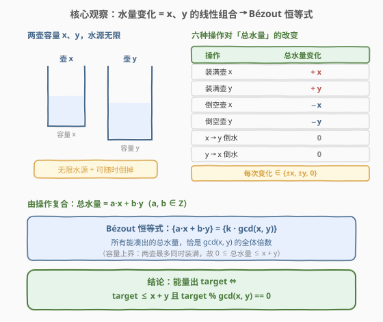
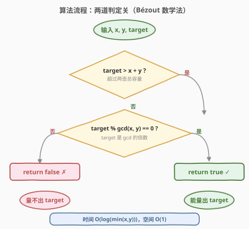
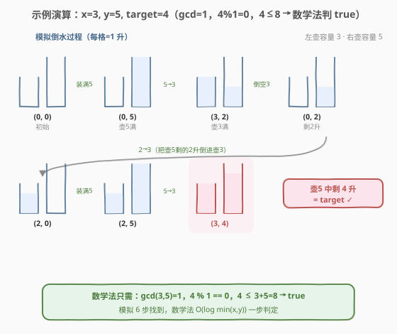

# 水壶问题

- **题目名称**：水壶问题
- **链接**：[365. 水壶问题](https://leetcode.cn/problems/water-and-jug-problem/)
- **难度**：中等
- **标签**：数学、深度优先搜索、广度优先搜索

## 1. 题目概述

给定两个容量分别为 `jug1Capacity` 和 `jug2Capacity` 的水壶，以及无限的水源。你可以执行以下六种操作：

1. 把任意一个壶**装满**；
2. 把任意一个壶**倒空**；
3. 把一个壶里的水**倒进另一个壶**，直到源壶倒空或目标壶装满。

判断能否通过上述操作量出恰好 `targetCapacity` 升水。

**示例 1**：

```text
输入：jug1Capacity = 3, jug2Capacity = 5, targetCapacity = 4
输出：true
解释：著名的「die-hard 3 升 / 5 升量 4 升」谜题，详见 2.4 示例演算。
```

**示例 2**：

```text
输入：jug1Capacity = 2, jug2Capacity = 6, targetCapacity = 5
输出：false
```

**示例 3**：

```text
输入：jug1Capacity = 1, jug2Capacity = 2, targetCapacity = 3
输出：true
解释：两壶都装满，总水量恰为 3。
```

**约束条件**：

- $1 \le \text{jug1Capacity}, \text{jug2Capacity}, \text{targetCapacity} \le 2^{31} - 1$

> 💡 **关键线索**：操作只对「两壶总水量」做 $+x$、$+y$、$-x$、$-y$、$0$ 五种改变，且总量被夹在 $[0, x+y]$ 之间。这是典型的**线性组合 + Bézout 恒等式**问题，不必真去模拟倒水。

---

## 2. 解题思路

### 2.1 暴力思路：BFS 搜索所有状态

把「壶1当前水量 $a$，壶2当前水量 $b$」看作一个状态 $(a, b)$，从 $(0,0)$ 出发，每次对当前状态施加六种操作，得到新状态。用 BFS/DFS 遍历所有可达状态，看是否存在某个壶的水量等于 `target`，或两壶之和等于 `target`。

- 状态空间大小：$(x+1) \times (y+1)$，当 $x, y$ 都到 $2^{31}-1$ 时**直接爆炸**，不可行。
- 适合小数据验证思路，不适合 AC。

> 💡 转机：题目只问「能不能」，不问「怎么倒」。问能不能凑出一个数，且操作是线性加减——这是**数论**信号。换个角度：每次操作改变的总水量都是 $x$ 或 $y$ 的整数倍，那么**所有可达总水量**是 $x, y$ 的整系数线性组合。

### 2.2 核心观察：Bézout 恒等式



把目光从「单壶水量」抬到「**两壶总水量** $S = a + b$」。逐条审视六种操作对 $S$ 的影响：

| 操作 | 总水量 $S$ 的变化 |
|------|------------------|
| 装满壶 $x$ | $+x$ |
| 装满壶 $y$ | $+y$ |
| 倒空壶 $x$ | $-x$ |
| 倒空壶 $y$ | $-y$ |
| $x \to y$ 倒水 | $0$（水只在两壶间转移） |
| $y \to x$ 倒水 | $0$ |

> ⚠️ 注意：倒水操作本身不改变总量，但它**改变了两个壶的分布**，从而「解锁」后续的装满/倒空。例如先倒满 $y$ 再把 $y$ 倒进 $x$，等价于净操作「往系统里加了 $y - x$」（当 $y > x$）。所以只要操作序列设计得当，任意 $ax + by$ 形式的总量都能凑出来。

于是经过任意操作序列后，总水量形如：

$$S = a \cdot x + b \cdot y, \quad a, b \in \mathbb{Z}$$

**容量约束**：两壶最多同时装满，故 $0 \le S \le x + y$。

**Bézout 恒等式**：集合 $\{ax + by \mid a,b \in \mathbb{Z}\}$ 恰好等于 $\{k \cdot \gcd(x, y) \mid k \in \mathbb{Z}\}$。也就是说，**能凑出的总水量全是 $\gcd(x, y)$ 的倍数，且 $\gcd(x, y)$ 的任意倍数（在容量允许范围内）都能凑出**。

> 💡 **关键转化**：判定「能量出 `target`」$\iff$ 判定「`target` 是 $\gcd(x, y)$ 的倍数 且 `target` 不超过 $x + y$」。前者用一次取模，后者用一次比较，$O(\log \min(x, y))$ 求 gcd 即终。

### 2.3 为什么「任意 $k \cdot \gcd$ 都能凑」是充要的

- **必要性**（凑得出 $\Rightarrow$ 是 $\gcd$ 的倍数）：每次操作改变总量 $\pm x$ 或 $\pm y$，而 $\gcd \mid x$、$\gcd \mid y$，故 $\gcd$ 整除任意线性组合。`target` 若能凑出，必被 $\gcd$ 整除。
- **充分性**（是 $\gcd$ 的倍数 $\Rightarrow$ 凑得出）：Bézout 恒等式保证存在整数 $u, v$ 使 $ux + vy = \gcd(x, y)$。把 $u, v$ 的正负解读为「装满/倒空」的次数，配合倒水操作即可逐步凑出 $\gcd$ 的任意正倍数（细节见 5.1 节扩展欧几里得构造）。再叠加 $0 \le S \le x + y$ 的容量界即可。

### 2.4 算法流程图



算法是**两道串联的判定关**，缺一不可：

1. **第一关 `target > x + y`**：超过两壶总容量，物理上装不下 → `false`。
2. **第二关 `target % gcd(x, y) == 0`**：判定 `target` 是否为 $\gcd$ 的倍数。

两关都过 → `true`；任一关不过 → `false`。整个判定无循环、无递归（gcd 除外），一次比较 + 一次取模即完成。

### 2.5 示例演算

以 $x=3, y=5, \text{target}=4$ 为例（经典 die-hard 谜题）：



模拟倒水过程：

| 步骤 | 操作 | 状态 $(a, b)$ | 说明 |
|------|------|---------------|------|
| 0 | — | $(0, 0)$ | 初始 |
| 1 | 装满壶5 | $(0, 5)$ | 总量 $S=5$ |
| 2 | $5 \to 3$ | $(3, 2)$ | 壶3满，壶5剩2 |
| 3 | 倒空壶3 | $(0, 2)$ | 总量 $S=2$ |
| 4 | $2 \to 3$ | $(2, 0)$ | 把2升移到壶3 |
| 5 | 装满壶5 | $(2, 5)$ | 总量 $S=7$ |
| 6 | $5 \to 3$ | $(3, 4)$ | 壶3满（只接1升），壶5剩 **4 = target** ✓ |

数学法一眼判定：$\gcd(3, 5) = 1$，$4 \bmod 1 = 0$，$4 \le 3 + 5 = 8$ → `true`。

再看反例 $x=2, y=6, \text{target}=5$：$\gcd(2, 6) = 2$，$5 \bmod 2 = 1 \ne 0$ → `false`。所有可达总量都是 $2$ 的倍数（$0,2,4,6,8$），永远凑不出奇数 $5$。

---

## 3. 参考代码

### C++

```cpp
class Solution {
  public:
    bool canMeasureWater(int jug1Capacity, int jug2Capacity, int targetCapacity) {
        if (targetCapacity > jug1Capacity + jug2Capacity) return false;
        return targetCapacity % gcd(jug1Capacity, jug2Capacity) == 0;
    }
};
```

### Python

```python
import math

class Solution:
    def canMeasureWater(self, jug1Capacity: int, jug2Capacity: int, targetCapacity: int) -> bool:
        if targetCapacity > jug1Capacity + jug2Capacity:
            return False
        return targetCapacity % math.gcd(jug1Capacity, jug2Capacity) == 0
```

> 💡 **两行即终**。`target > x + y` 排除超容量，`target % gcd == 0` 判定整除性。C++17 起 `std::gcd` 在 `<numeric>` 中（无需 `using namespace std` 的隐式包含，提交时编译器自动链接）。Python 的 `math.gcd` 自 3.5 起支持任意参数顺序且对 $0$ 友好，但本题约束保证 $x, y \ge 1$，无需处理 $\gcd(0, 0)$。

---

## 4. 复杂度分析

| 维度 | 数学法（Bézout） | BFS 状态搜索 |
|------|------------------|-------------|
| **时间复杂度** | $O(\log \min(x, y))$ | $O(x \cdot y)$ |
| **空间复杂度** | $O(1)$ | $O(x \cdot y)$ |
| **能否 AC** | ✅ 支持 $2^{31}$ 量级 | ✗ 状态空间爆炸 |

> ⚠️ 数学法的时间复杂度由欧几里得求 gcd 主导，为 $O(\log \min(x, y))$（辗转相除每轮至少折半）。之后的比较与取模都是 $O(1)$。对 $2^{31}-1$ 量级的输入也只需约 30 余次迭代。

---

## 5. 扩展：BFS 写法与裴蜀定理构造

### 5.1 BFS 状态搜索（小数据可 AC）

把每个状态 $(a, b)$ 作为节点，六种操作产生转移。用队列 + visited 集合做 BFS：

```cpp
bool canMeasureWater(int x, int y, int target) {
    if (target > x + y) return false;
    queue<pair<int,int>> q;
    set<pair<int,int>> vis;
    q.push({0, 0});
    vis.insert({0, 0});
    while (!q.empty()) {
        auto [a, b] = q.front(); q.pop();
        if (a == target || b == target || a + b == target) return true;
        vector<pair<int,int>> nxt = {
            {x, b}, {a, y},              // 装满
            {0, b}, {a, 0},              // 倒空
            {a - min(a, y - b), b + min(a, y - b)},  // a -> b
            {a + min(b, x - a), b - min(b, x - a)}   // b -> a
        };
        for (auto& s : nxt) {
            if (!vis.count(s)) { vis.insert(s); q.push(s); }
        }
    }
    return false;
}
```

> ⚠️ 状态数 $(x+1)(y+1)$，对 $2^{31}$ 量级输入必爆。仅在 $x, y$ 较小时可作为兜底/教学用。它的价值在于**可验证**数学结论：把数学法的结果与 BFS 对照跑一遍，确认充要性无误。

### 5.2 用扩展欧几里得构造具体倒水方案

数学法只回答「能不能」。若面试官追问「具体怎么倒」，可用扩展欧几里得求出 $u, v$ 使 $ux + vy = \gcd(x, y)$，再按 $u, v$ 的符号决定「装满/倒空」次数，配合倒水操作即可凑出 $\gcd$ 的倍数。本题只需判可行性，构造留作拓展。

### 5.3 各解法对比

| 解法 | 核心思想 | 时间 | 适用场景 |
|------|---------|------|---------|
| **Bézout 数学法** | 总量 = $ax+by$，整除 $\gcd$ | $O(\log \min(x,y))$ | 首选，支持大数 |
| BFS 状态搜索 | 遍历所有 $(a,b)$ 状态 | $O(xy)$ | 小数据 / 验证用 |
| 扩展欧几里得 | 构造具体倒水步骤 | $O(\log \min(x,y))$ | 需要方案时 |

面试首推 Bézout 数学法——一行取模判定，$O(\log)$ 时间，直接 AC。

---

## 6. 面试要点

1. **为什么「能量出 target」等价于 `target % gcd == 0`？**

   - 每种操作改变总水量 $\pm x$ 或 $\pm y$（或 $0$），故任意操作序列后的总量 $S = ax + by$。
   - 由 $\gcd \mid x$ 且 $\gcd \mid y$，得 $\gcd \mid S$。能凑出的总量必是 $\gcd$ 的倍数——**必要性**。
   - Bézout 恒等式保证存在 $u, v$ 使 $ux + vy = \gcd$，进而 $\gcd$ 的任意倍数 $k \cdot \gcd$ 都能写成 $(ku)x + (kv)y$，配合倒水操作可实际凑出——**充分性**。

2. **为什么要加 `target <= x + y` 这一关？**

   - 两壶总容量上限是 $x + y$（同时装满）。即便 `target` 是 $\gcd$ 的倍数，若超过 $x + y$ 也装不下。
   - 例：$x=3, y=5, \text{target}=9$。$\gcd=1$，$9 \bmod 1 = 0$，但 $9 > 3+5=8$，物理不可能 → `false`。

3. **倒水操作（$x \to y$）改变总量为 $0$，为什么它是必不可少的？**

   - 装满/倒空只能增减 $x$ 或 $y$ 的整数倍，但「想在壶里凑出特定的单壶水量」需要在水壶间搬运。
   - 倒水本身不改变总量，但改变分布，从而**解锁新的装满/倒空**：例如先装满 $y$ 再倒进 $x$，净效果是往系统加了 $y - x$（当 $y > x$）。
   - 严格说，倒水操作的存在才让「任意 $ax+by$ 都可达」成立；没有倒水，只能单独往壶里加减，凑不出如 $y - x$ 这种差值。

4. **BFS 解法在什么情况下会失败？**

   - 状态空间 $(x+1)(y+1)$，当 $x, y \ge 10^5$ 时已超时，$2^{31}$ 量级直接内存爆炸。
   - 故大输入必须用数学法。小输入下 BFS 可作为「先讲暴力再优化」的面试起手式，并用于验证数学结论。

5. **如何向面试官解释 Bézout 恒等式与本题的对应？**

   - Bézout 恒等式：对任意整数 $x, y$，存在整数 $u, v$ 使 $ux + vy = \gcd(x, y)$；且 $\{ax+by\}$ 的全体恰为 $\gcd$ 的全体整数倍。
   - 本题「凑水量」=「找一组操作使总量 = target」=「找整数 $a, b$ 使 $ax + by = \text{target}$ 且 $0 \le \text{target} \le x+y$」。
   - 由 Bézout，前者有解 $\iff \gcd \mid \text{target}$；后者由容量约束补充。两条件合一即代码中的两道关。

> 💡 **一句话总结**：把「倒水操作」抽象成「对总水量的 $\pm x, \pm y$ 线性组合」，立刻落到 Bézout 恒等式——能凑出的量恰是 $\gcd(x,y)$ 的倍数，叠加容量上界 $x+y$，两道判定关一行代码收尾。与 [258. 各位相加](../0201-0300/258_各位相加.md) 的「数学归纳一步到位」、[204. 计数质数](../0201-0300/204_计数质数.md) 的「数论降维」同属「问能不能 → 找数论不变量」的范式。

---

## 7. 同类练习题

- [258. 各位相加](https://leetcode.cn/problems/add-digits/)（[题解](../0201-0300/258_各位相加.md)）：问「能到什么数」→ 用 $D(n) = n \bmod 9$ 的数论不变量一步判定，与本题「找 $\gcd$ 不变量」同属数学降维范式
- [204. 计数质数](https://leetcode.cn/problems/counting-primes/)（[题解](../0201-0300/204_计数质数.md)）：数论题代表，埃氏筛 / 线性筛，对照本题对 $\gcd$ 与整除性的运用
- [1071. 字符串的最大公因子](https://leetcode.cn/problems/greatest-common-divisor-of-strings/)：直接对字符串长度求 $\gcd$ 判定能否循环拼接，与本题共享「$\gcd$ 是可达性的尺子」这一思想
- [914. 卡牌分组](https://leetcode.cn/problems/x-of-a-kind-in-a-deck-of-cards/)：统计各数字频次后求全体 $\gcd$，$\gcd \ge 2$ 即可分组，本题 $\gcd$ 整除判定的镜像应用
