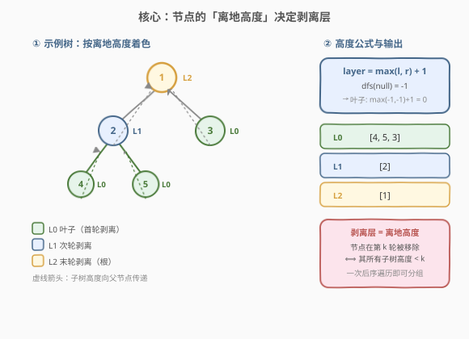
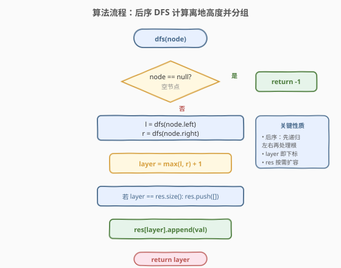
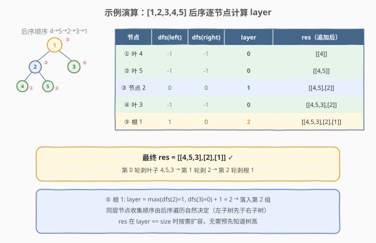

# LeetCode 寻找二叉树的叶子节点 题解

## 1. 题目概述

- **标题 / 题号**：寻找二叉树的叶子节点（#366，medium）
- **链接**：https://leetcode.cn/problems/find-leaves-of-binary-tree/
- **难度**：中等
- **标签**：树、二叉树、深度优先搜索、后序遍历

**题意**：给定一棵二叉树的根节点 `root`，按如下方式逐轮收集节点：

- 收集当前树中**所有叶子节点**（值列表）；
- 移除这些叶子节点；
- 重复上述步骤，直到树为空。

返回一个**列表的列表** `res`，其中 `res[k]` 是第 `k` 轮被移除的节点值集合。

**示例 1**：

```text
输入：root = [1,2,3,4,5]
输出：[[4,5,3],[2],[1]]

        1
       / \
      2   3
     / \
    4   5
```

- 第 0 轮：叶子为 `4, 5, 3`，移除后剩 `1 - 2`；
- 第 1 轮：叶子为 `2`，移除后剩 `1`；
- 第 2 轮：叶子为 `1`，移除后树空。

**示例 2**：

```text
输入：root = [1,2,3,4,5,6,7]
输出：[[4,5,6,7],[2,3],[1]]

          1
        /   \
       2     3
      / \   / \
     4   5 6   7
```

**约束**：

- 树中节点数目范围 $[0, 1000]$
- $-1000 \le \text{Node.val} \le 1000$

> 💡 本题是「**后序遍历 + 返回值传递**」家族的招牌题。一个节点在哪一轮被剥离，等于它**离最底层叶子的高度**——这个高度由「左右子树高度取较大者 +1」合成，正是天然的后序（自底向上）结构。与 [250. 统计同值子树](../0201-0300/250_统计同值子树.md) 的「布尔传递」、[333. 最大二叉搜索子树](333_最大二叉搜索子树.md) 的「三元组传递」同源，只是这里向上传递的是一个**整数高度**，并以其为下标分桶收集节点。

## 2. 解题思路

### 2.1 暴力思路：逐轮扫描剥离

最直观的做法：循环「扫描整棵树收集所有叶子 → 删除叶子 → 重复直到根也为空」。每轮需 $O(n)$ 遍历整棵残树，最多剥 $h$ 轮（$h$ 为树高）。

- **时间复杂度**：$O(n \cdot h)$，退化链状时 $h = n$，退化为 $O(n^2)$；
- **空间复杂度**：$O(h)$ 递归栈。

能过约束 $n \le 1000$ 的数据，但**完全没有利用「剥离层可由子树高度一次性算出」**——节点的剥离轮次等于它到最底层叶子的距离，这个信息在后序遍历中可以一遍算出，无需反复扫描。

> ⚠️ 突破口：把「子树高度」作为返回值向上传递，父节点直接 `max(l, r) + 1` 合成自己的高度，一次后序遍历即可完成所有节点的分层。

### 2.2 核心观察：剥离层 = 节点的「离地高度」



**关键洞察**：一个节点在第 $k$ 轮被移除，当且仅当它所有子树的高度都 $< k$。因此节点的**剥离层**就是它的**离地高度**（到最底层叶子的边数）：

$$
\text{layer}(node) = \max\bigl(\text{layer}(\text{left}),\ \text{layer}(\text{right})\bigr) + 1
$$

约定 `dfs(null) = -1`，于是叶子节点 $\max(-1, -1) + 1 = 0$，即叶子在第 0 轮被剥离——与题意吻合。每个节点的 `layer` 值就是它在结果列表中的**下标**：`res[layer].append(node.val)`。

> 💡 **为什么空节点返回 `-1` 而非 `0`？** 这是为了让叶子自动落在第 0 层：`max(-1, -1) + 1 = 0`。若返回 `0`，叶子会算成 `max(0, 0) + 1 = 1`，所有下标整体偏移且第 0 层永远为空，还需事后修正。`-1` 是「空集高度」的自然约定，与 [333](333_最大二叉搜索子树.md) 中空子树返回 `(∞, -∞, 0)` 是同一思想——空结构不应拖累父节点的合成。

> ⚠️ **layer 既是返回值又是下标**：与 [250](../0201-0300/250_统计同值子树.md) 的「布尔返回 + 副作用计数」、[333](333_最大二叉搜索子树.md) 的「三元组返回 + 副作用更新最值」不同，本题的返回值本身就是**结果列表的下标**——`dfs` 返回 `layer`，调用方据此 `res[layer].append(val)`。这种「返回值即分桶下标」的设计极其简洁，是本题的灵魂。

### 2.3 算法流程图



**`dfs(node)` 完整步骤**：

1. **空节点**：返回 `-1`（空集高度，使叶子落在第 0 层）；
2. **递归左右**：`l = dfs(node.left)`，`r = dfs(node.right)`；
3. **合成高度**：`layer = max(l, r) + 1`；
4. **按需扩容**：若 `layer == len(res)`（首次遇到该层），`res.append([])`；
5. **分桶收集**：`res[layer].append(node.val)`；
6. **返回高度**：`return layer`（供父节点合成）。

> 💡 **按需扩容**：由于后序遍历自底向上，首次遇到的 `layer` 一定是当前最大值 +1（即 `len(res)`），因此 `if layer == len(res): res.append([])` 即可，无需预先计算树高。同一 `layer` 的节点会在后序遍历中按「左子树先于右子树」的顺序依次落入同一桶，自然满足题意「同轮收集的叶子无顺序要求」。

### 2.4 示例演算

以 `root = [1,2,3,4,5]` 为例，后序遍历顺序为 `4 → 5 → 2 → 3 → 1`：



| 步骤 | 后序节点 | dfs(left) | dfs(right) | layer | res（追加后） |
|------|---------|-----------|------------|-------|---------------|
| ① | 叶 4 | -1 | -1 | `max(-1,-1)+1 = 0` | `[[4]]` |
| ② | 叶 5 | -1 | -1 | `max(-1,-1)+1 = 0` | `[[4,5]]` |
| ③ | 节点 2 | 0 | 0 | `max(0,0)+1 = 1` | `[[4,5],[2]]` |
| ④ | 叶 3 | -1 | -1 | `max(-1,-1)+1 = 0` | `[[4,5,3],[2]]` |
| ⑤ | 根 1 | 1 | 0 | `max(1,0)+1 = 2` | `[[4,5,3],[2],[1]]` |

最终 `res = [[4,5,3],[2],[1]]` ✓。

> 💡 **步骤 ⑤ 是关键**：根 `1` 的左子树高度为 `1`（节点 2 在第 1 层）、右子树高度为 `0`（节点 3 在第 0 层），`max(1, 0) + 1 = 2`——根必须等到左右子树都被剥光后才会成为叶子，故落在第 2 层。这正体现了「剥离层 = 离地高度」的核心：高度由**更深的那棵子树**决定，较浅的子树早已在前几轮被剥完。
>
> ⚠️ **同桶顺序**：步骤 ①②④ 都落入第 0 桶，顺序为 `4, 5, 3`——这是后序遍历「左→右→根」的自然结果。题意对同轮内顺序无要求，故无需额外排序。

## 3. 参考代码

### C++

```cpp
class Solution {
  public:
    vector<vector<int>> findLeaves(TreeNode* root) {
        vector<vector<int>> res;
        dfs(root, res);
        return res;
    }

    // 返回 node 的「离地高度」；同时把 node.val 追加到 res[高度]
    int dfs(TreeNode* node, vector<vector<int>>& res) {
        if (!node) return -1;                       // 空集高度，叶子落在第 0 层
        int l = dfs(node->left, res);               // 后序：先递归左右
        int r = dfs(node->right, res);
        int layer = max(l, r) + 1;                  // 合成高度
        if (layer == (int)res.size()) res.push_back({});  // 按需扩容
        res[layer].push_back(node->val);            // 分桶收集
        return layer;                               // 供父节点合成
    }
};
```

### Python

```python
class Solution:
    def findLeaves(self, root: Optional[TreeNode]) -> List[List[int]]:
        res: List[List[int]] = []

        def dfs(node: Optional[TreeNode]) -> int:
            if not node:
                return -1                          # 空集高度，叶子落在第 0 层
            l = dfs(node.left)                      # 后序：先递归左右
            r = dfs(node.right)
            layer = max(l, r) + 1                   # 合成高度
            if layer == len(res):                   # 按需扩容
                res.append([])
            res[layer].append(node.val)             # 分桶收集
            return layer                            # 供父节点合成

        dfs(root)
        return res
```

> 💡 两版等价。`dfs` 一肩三职：① 返回子树高度供父节点合成；② 用 `layer` 作下标把节点值追加到对应桶；③ 通过 `layer == len(res)` 触发按需扩容。这种「返回值即下标 + 副作用收集」是树形分桶题的通用模板，比 [250](../0201-0300/250_统计同值子树.md) 的「布尔 + 计数」更紧凑——因为本题的返回值本身就能直接当作结果索引。

> ⚠️ **扩容条件的正确性**：`layer == len(res)` 仅在后序自底向上时成立——首次遇到某个 `layer` 值时，它一定等于当前 `res` 的长度（之前的最大层 +1）。若改成 `layer >= len(res)` 虽然也正确（最多多扩一个空桶），但 `==` 更精确地表达了「首次遇到该层」的语义，且不会产生多余空桶。

## 4. 复杂度分析

| 维度 | 复杂度 | 说明 |
|------|--------|------|
| 时间复杂度 | $O(n)$ | 每个节点只访问一次，每次做 $O(1)$ 的 `max + 1` 与追加操作 |
| 空间复杂度 | $O(n)$ | 结果列表存所有节点值 $O(n)$；递归栈 $O(h)$，平衡树 $O(\log n)$，退化链状 $O(n)$ |
| 最坏情况 | $O(n)$ 空间 | 树退化为单侧链时递归深度达 $n$；结果列表恒为 $O(n)$ |

> ⚠️ 暴力法 $O(n \cdot h)$ 的浪费在于：每轮重新扫描残树收集叶子，而节点的剥离轮次其实只需一遍后序即可确定。最优法把「子树高度」压缩成一个整数向上传递，父节点 $O(1)$ 合成——这本质上是**树形动态规划**：子问题（子树高度）聚合为父问题（当前节点高度），与 [543. 二叉树的直径](https://leetcode.cn/problems/diameter-of-binary-tree/)（传递深度）、[124. 二叉树最大路径和](https://leetcode.cn/problems/binary-tree-maximum-path-sum/)（传递贡献）同构。

## 5. 扩展：与树高 / 直径的统一视角

本题的 `layer` 本质是「**从叶子向上数的高度**」，与几个经典量只差一个常数或方向，理解其统一性有助于面试时快速迁移：

### 5.1 与「树高」的关系

传统树高 `height(node)` 定义为「从该节点到最远叶子的边数」，递推式 $\text{height} = \max(\text{lheight}, \text{rheight}) + 1$，空节点高度为 $-1$。本题的 `layer` **就是** `height`——完全相同的递推与基底。区别仅在于：传统树高只关心根的高度（一个数），而本题关心**每个节点的高度**并把它们作为分桶下标。

### 5.2 与「直径」的关系

[543. 二叉树的直径](https://leetcode.cn/problems/diameter-of-binary-tree/) 同样后序传递子树深度，但在节点处用 `ldepth + rdepth` 聚合「经过该节点的最长路径」并更新全局最值。对比：

| 维度 | 543 直径 | 366 剥叶 |
|------|---------|---------|
| 向上传递 | 子树深度 | 子树高度 |
| 节点处聚合 | `l + r` 更新最值 | `max(l, r) + 1` 作下标分桶 |
| 副作用 | 更新全局 `maxDiameter` | 追加到 `res[height]` |

> 💡 **同一骨架，不同聚合**：后序「子树返回一个整数 + 节点处做 $O(1)$ 聚合 + 副作用记录结果」是树形统计的万能模板。换聚合方式即换题：`l + r` 求直径、`max(l, r) + 1` 求高度/剥层、`max(l, r) + node.val` 求最大路径和（[124](https://leetcode.cn/problems/binary-tree-maximum-path-sum/) 的贡献值）。

### 5.3 进阶变体：按层求和

若题目改为「返回每轮被剥离节点的**值之和**列表」，模板几乎不变——把 `res[layer].append(val)` 换成 `res[layer] += val`，`res` 退化为整数数组，`layer == len(res)` 时 `res.append(0)` 即可。这体现了「分桶收集」模板的可扩展性：桶里装什么（节点值 / 和 / 计数）由聚合操作决定。

## 6. 面试要点

1. **为什么用后序遍历而不是前序或中序？**

   > 节点的剥离层（离地高度）依赖于子树的高度——只有先算出左右子树的高度，才能合成当前节点的高度。这是典型的「子问题结果决定父问题」结构，对应后序（左右根）。前序/中序在处理父节点时尚未获取子树高度，无法一次遍历完成分层。

2. **空节点为什么返回 `-1` 而非 `0`？**

   > 让叶子自动落在第 0 层：叶子两子为空，`max(-1, -1) + 1 = 0`，正好作为结果列表的首个下标。若返回 `0`，叶子会算成 `1`，所有下标整体偏移且第 0 桶永远为空，还需事后修正或减一。`-1` 是「空集高度」的自然约定，与 [333](333_最大二叉搜索子树.md) 空子树返回 `(∞, -∞, 0)` 同理——空结构应让父节点的合成自动成立，而非引入特判。

3. **`layer == len(res)` 这个扩容条件为什么一定成立？**

   > 后序遍历自底向上，节点按高度非递减地被处理：首次遇到高度 `k` 的节点时，`res` 中已有 `k` 个桶（高度 `0..k-1`），即 `len(res) == k == layer`。因此 `==` 足够，不会漏扩也不会多扩。即便同一高度有多个节点，后续的都会 `layer < len(res)` 直接落入已有桶。

4. **暴力 $O(n \cdot h)$ 和最优 $O(n)$ 的本质区别是什么？**

   > 暴力法每轮重新扫描残树收集叶子，节点的剥离轮次被反复「重新发现」。最优法把子树高度压缩成一个整数向上传递，父节点 `max + 1` 即得自己的高度，一遍后序完成所有节点的分层。这是**树形动态规划**的范式——子问题解聚合为父问题解，避免重复扫描。同源思想见 [543. 二叉树的直径](https://leetcode.cn/problems/diameter-of-binary-tree/)。

5. **如果要求同轮内节点按从左到右的顺序输出怎么办？**

   > 后序遍历「左→右→根」天然保证：同一高度的节点中，左子树的节点先于右子树的节点被访问并追加，故同桶内已是「相对从左到右」的顺序。若需严格按层从左到右，可改用 BFS 按层收集后再计算高度，但复杂度不变；后序版已满足题意（题目对同轮内顺序无要求）。

> 💡 **一句话总结**：366 的灵魂是「**后序遍历 + 离地高度作下标分桶**」——`dfs` 返回子树高度，父节点 `max(l, r) + 1` 合成，高度值直接作为结果列表下标收集节点。这是 [250](../0201-0300/250_统计同值子树.md)「布尔传递」、[333](333_最大二叉搜索子树.md)「三元组传递」家族的「整数传递」成员：返回值从布尔→三元组→整数，聚合从计数→求最值→分桶，骨架不变。

## 同类练习题

| # | 题目 | 与本题的关联 |
|---|------|-------------|
| 250 | [统计同值子树](https://leetcode.cn/problems/count-univalue-subtrees/)（[题解](../0201-0300/250_统计同值子树.md)） | 后序 + 布尔返回值传递子结构结论，是本题「整数高度传递」的简化版（布尔即可，无需数值合成） |
| 333 | [最大二叉搜索子树](https://leetcode.cn/problems/largest-bst-subtree/)（[题解](333_最大二叉搜索子树.md)） | 后序 + 三元组 `(min, max, size)` 传递，同套「后序 + 返回值 + 副作用」骨架，返回值升级为复合结构 |
| 543 | [二叉树的直径](https://leetcode.cn/problems/diameter-of-binary-tree/) | 后序传递子树深度，在节点处用 `l + r` 聚合直径，对比本题用 `max(l, r) + 1` 聚合高度——同一骨架的不同聚合方式 |
| 124 | [二叉树中的最大路径和](https://leetcode.cn/problems/binary-tree-maximum-path-sum/) | 后序传递子树最大贡献值，在节点处聚合路径和并更新全局最值，经典「后序 + 返回值 + 副作用记录最值」范式 |
| 104 | [二叉树的最大深度](https://leetcode.cn/problems/maximum-depth-of-binary-tree/) | 后序求树高，递推式 `max(l, r) + 1` 与本题的 `layer` 完全相同，只差「分桶收集」这一步——理解 104 即理解 366 的核心递推 |
