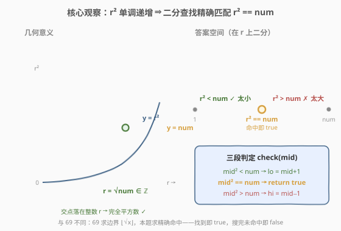
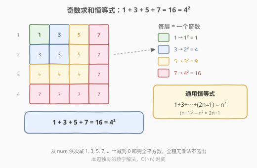

# LeetCode 有效的完全平方数 题解

## 1. 题目概述

- **标题 / 题号**：有效的完全平方数（#367，easy）
- **链接**：https://leetcode.cn/problems/valid-perfect-square/
- **难度**：简单
- **标签**：数学、二分查找

**题意**：给定一个**正整数** `num`，判断它是否为**完全平方数**——即是否存在整数 `r` 使得 $r^2 = \text{num}$。是则返回 `true`，否则返回 `false`。

> ⚠️ **进阶**：**不要**使用任何内置库函数（如 `sqrt`）。

**示例 1**：

```text
输入：num = 16
输出：true
解释：4² = 16。
```

**示例 2**：

```text
输入：num = 14
输出：false
解释：3² = 9 < 14 < 16 = 4²，14 不是完全平方数。
```

**约束**：

- $1 \le \text{num} \le 2^{31} - 1$

> 💡 本题与 [69. x 的平方根](../0001-0100/69_x的平方根.md) 是一对姊妹题：69 求 $\lfloor \sqrt{x} \rfloor$（**边界**搜索——最大的 $r$ 使 $r^2 \le x$），本题判定 $r^2 = \text{num}$ 是否**精确命中**。两者都依赖「$r^2$ 关于 $r$ 单调递增」这一二段性，但本题是经典二分查找的**精确匹配**变体（三段判定：太小 / 命中 / 太大），而非边界搜索。

## 2. 解题思路

### 2.1 暴力思路：线性枚举

从 $r = 1$ 开始逐一递增，检查 $r^2$ 是否等于 `num`：

- 若 $r^2 = \text{num}$ → 返回 `true`；
- 若 $r^2 > \text{num}$ → 超过了还没命中，返回 `false`。

最坏情况下 `num = 2³¹−1` 时 $\sqrt{\text{num}} \approx 46341$，要枚举四万多轮，虽不至于超时，但效率低。

> 💡 暴力法慢在「线性扫描答案空间」。注意到 $r^2$ 关于 $r$ 单调递增后，可用二分把 $O(\sqrt{n})$ 降到 $O(\log n)$。

### 2.2 核心观察：二分查找精确匹配



关键直觉是：**函数 $f(r) = r^2$ 关于 $r$ 单调递增**。在候选区间 $[1, \text{num}]$ 上，每个 `mid` 的 $r^2$ 与 `num` 的关系只有三种：

```text
r² < num  →  r 太小，答案在右半区间 → lo = mid + 1
r² == num →  命中！返回 true
r² > num  →  r 太大，答案在左半区间 → hi = mid - 1
```

这与 [69](../0001-0100/69_x的平方根.md) 的关键区别在于：69 求「最大的可行 $r$」（$r^2 \le x$ 的边界），可行时**记 ans 再向右收缩**；本题求「**精确等于**」，命中即立即返回 `true`，未命中则按大小缩区间——这是经典二分查找的**精确匹配**模板（与 [704. 二分查找](../0701-0800/704_二分查找.md) 同构）。

> 💡 **识别信号**：题目求「是否存在某个值满足等式」+ 值域有序（单调）+ 能 $O(1)$ 验证 → 想「二分查找精确匹配」。

> ⚠️ **溢出**：`num` 可达 $2^{31}-1$，$\sqrt{\text{num}} \approx 46341$，而 $46341^2 \approx 2.15 \times 10^9$ **超过 32 位 `int` 上界**。C++ 中 `mid * mid` 必须用 `long long`，否则溢出变负数会导致误判。

### 2.3 算法流程图


注意三段判定的核心：`mid² == num` 时**立即返回 `true`** 终止搜索；`mid² < num` 向右缩（`lo = mid + 1`）；`mid² > num` 向左缩（`hi = mid - 1`）。若循环正常结束（`lo > hi`，区间空）仍未命中，则 `num` 不是完全平方数，返回 `false`。

### 2.4 示例演算


以 `num = 14` 为例（初始 `lo=1, hi=14`）：

- **第 1 轮** `[1,14]`，`mid=7`，`7²=49 > 14` ✗ → 太大，`hi=6`。
- **第 2 轮** `[1,6]`，`mid=3`，`3²=9 < 14` → 太小，`lo=4`。
- **第 3 轮** `[4,6]`，`mid=5`，`5²=25 > 14` ✗ → 太大，`hi=4`。
- **第 4 轮** `[4,4]`，`mid=4`，`4²=16 > 14` ✗ → 太大，`hi=3`。
- `lo=4 > hi=3`，循环结束，未命中 → 返回 `false`。

> 💡 对比 `num = 16`：第 1 轮 `mid=8, 64>16, hi=7`；第 2 轮 `[1,7], mid=4, 16==16` → 命中，立即返回 `true`。完全平方数只需几轮即可命中，非完全平方数则搜遍区间后落空。

## 3. 参考代码

### C++

```cpp
class Solution {
  public:
    bool isPerfectSquare(int num) {
        long long lo = 1, hi = num;          // long long 防 mid*mid 溢出
        while (lo <= hi) {
            long long mid = lo + (hi - lo) / 2;
            long long sq = mid * mid;        // long long 乘法
            if (sq == num) return true;      // 命中
            else if (sq < num) lo = mid + 1; // 太小，向右找
            else hi = mid - 1;               // 太大，向左找
        }
        return false;                        // 搜完未命中
    }
};
```

### Python

```python
class Solution:
    def isPerfectSquare(self, num: int) -> bool:
        lo, hi = 1, num
        while lo <= hi:
            mid = (lo + hi) // 2
            sq = mid * mid                   # Python 大整数无溢出
            if sq == num:
                return True                  # 命中
            elif sq < num:
                lo = mid + 1                 # 太小，向右找
            else:
                hi = mid - 1                 # 太大，向左找
        return False                         # 搜完未命中
```

> ⚠️ **两个易错点**：
> 1. **溢出**：C++ 中 `mid * mid` 在 `mid ≈ 46341` 时溢出 32 位 `int`。解法是把 `lo/hi/mid` 声明为 `long long`；也可用除法规避 `mid <= num / mid`（但 `mid = 0` 除零需处理，本题 `mid ≥ 1` 无此问题）。
> 2. **三段判定 vs 两段**：不能像 69 那样只写 `sq <= num` 的两分支——`sq == num` 必须单独处理立即返回 `true`，否则会继续搜索最终返回 `false`（漏判完全平方数）。

## 4. 复杂度分析

| 维度 | 复杂度 | 说明 |
|------|--------|------|
| 时间复杂度 | $O(\log \text{num})$ | 在 $[1, \text{num}]$ 上二分，每次 $O(1)$ 验证 $\text{mid}^2 \stackrel{?}{=} \text{num}$ |
| 空间复杂度 | $O(1)$ | 仅用常数额外变量 |

## 5. 扩展：其他判定完全平方数的方法

### 5.1 奇数求和法（数学恒等式）



数学恒等式：**前 $n$ 个正奇数之和等于 $n^2$**：

$$1 + 3 + 5 + 7 + \cdots + (2n-1) = n^2$$

故从 `num` 中依次减去 `1, 3, 5, 7, ...`，若恰好减到 `0` 则是完全平方数，若减到负数则不是：

```cpp
bool isPerfectSquare(int num) {
    int odd = 1;
    while (num > 0) {
        num -= odd;
        odd += 2;
    }
    return num == 0;
}
```

时间 $O(\sqrt{n})$（减 $\sqrt{n}$ 次到 0 或负），空间 $O(1)$。比二分慢但数学优雅，且**完全规避乘法溢出**——这是本题独有的巧妙解法。

> 💡 **原理**：$(n+1)^2 - n^2 = 2n + 1$，即相邻完全平方数之差恰为连续奇数。故从 $0^2 = 0$ 出发不断加奇数，正好遍历所有完全平方数。

### 5.2 牛顿迭代法

求 $r^2 = \text{num}$ 等价于求 $g(r) = r^2 - \text{num} = 0$ 的正根。牛顿迭代：

$$r_{n+1} = \frac{1}{2}\left(r_n + \frac{\text{num}}{r_n}\right)$$

从 $r_0 = \text{num}$ 出发迭代，直到 $r_n^2 \le \text{num}$（越过真实平方根），再判定是否精确命中：

```cpp
bool isPerfectSquare(int num) {
    long long r = num;
    while (r * r > num) {
        r = (r + num / r) / 2;
    }
    return r * r == num;         // 判定是否精确命中
}
```

牛顿法 $O(\log \log n)$ 次收敛，比二分更快，但需理解数值迭代原理。与 [69](../0001-0100/69_x的平方根.md) 第 5 节的牛顿法一脉相承，差异仅在最后一步：69 返回 $\lfloor r \rfloor$，本题判定 $r^2 \stackrel{?}{=} \text{num}$。

### 5.3 各写法对比

| 写法 | 核心思想 | 时间 | 与其他题的联系 |
|------|---------|------|----------------|
| **二分查找** | $r^2$ 单调 → 精确匹配 | $O(\log n)$ | [69](../0001-0100/69_x的平方根.md) 边界搜索 / [704](../0701-0800/704_二分查找.md) 精确匹配模板 |
| 奇数求和 | $1+3+\cdots+(2n-1)=n^2$ | $O(\sqrt{n})$ | 本题独有的数学恒等式 |
| 牛顿迭代 | 切线逼近正根 | $O(\log \log n)$ | [69](../0001-0100/69_x的平方根.md) 5. 牛顿法 |

面试首推二分查找——模板通用、$O(\log n)$ 足够快、逻辑清晰易写对。

## 6. 面试要点

1. **为什么能二分？二段性体现在哪？**

   - $f(r) = r^2$ 关于 $r$ 单调递增。对任意 `mid`，$\text{mid}^2$ 与 `num` 的大小关系唯一确定搜索方向：太小向右、太大向左、命中即终止。这种单调性保证了二分的正确性。

2. **本题和 69（x 的平方根）有什么区别？**

   - 69 求 $\lfloor \sqrt{x} \rfloor$——**边界搜索**，找最大的 $r$ 使 $r^2 \le x$，可行时记 `ans` 再向右收缩，最终返回 `ans`。
   - 本题判定 $r^2 = \text{num}$ 是否成立——**精确匹配**，命中即立即返回 `true`，未命中继续搜索，搜完返回 `false`。
   - 代码差异：69 是两分支（`≤` 记 ans 向右 / `>` 向左），本题是三分支（`<` 向右 / `==` 返回 / `>` 向左）。

3. **`mid * mid` 溢出怎么处理？**

   - `num` 可达 $2^{31}-1$，$\sqrt{\text{num}} \approx 46341$，$46341^2 \approx 2.15 \times 10^9$ 超 `int` 上界。C++ 用 `long long` 声明 `lo/hi/mid`；或用除法 `mid <= num / mid` 规避（本题 `mid ≥ 1` 无除零问题）。Python 整数无上限无此问题。

4. **上界为什么取 `num` 而不是 `num/2`？**

   - 对 `num ≥ 1`，$\sqrt{\text{num}} \le \text{num}$ 恒成立，`hi = num` 合法且最简。可优化为 `hi = num / 2 + 1`（对 `num ≥ 2`，$\sqrt{\text{num}} \le \text{num}/2$），减少约一次二分，但属锦上添花。

5. **奇数求和法的原理是什么？为什么不用乘法也不会溢出？**

   - 恒等式 $1 + 3 + \cdots + (2n-1) = n^2$：相邻完全平方数之差 $(n+1)^2 - n^2 = 2n+1$ 恰为连续奇数。从 `num` 依次减奇数，减到 0 即完全平方数。全程只有减法和加法，无乘法，天然规避溢出——这是本题独有的优雅解法。

> 💡 **一句话总结**：$r^2$ 单调递增 → 在 $[1, \text{num}]$ 上二分精确匹配 $r^2 = \text{num}$，三段判定（太小 / 命中 / 太大），$O(\log n)$。与 [69](../0001-0100/69_x的平方根.md) 共用单调性，差异在「精确匹配」vs「边界搜索」；独有奇数求和法 $1+3+\cdots+(2n-1)=n^2$ 规避乘法溢出。

## 同类练习题

| # | 题目 | 与本题的关联 |
|---|------|-------------|
| 69 | [x 的平方根](https://leetcode.cn/problems/sqrtx/)（[题解](../0001-0100/69_x的平方根.md)） | 姊妹题，求 $\lfloor \sqrt{x} \rfloor$ 的边界搜索，对照本题精确匹配的差异 |
| 704 | [二分查找](https://leetcode.cn/problems/binary-search/)（[题解](../0701-0800/704_二分查找.md)） | 二分精确匹配的母题模板，本题是其数学应用 |
| 278 | [第一个错误的版本](https://leetcode.cn/problems/first-bad-version/)（[题解](../0201-0300/278_第一个错误的版本.md)） | 单调布尔序列找首个 true，对照二分的三种变体（精确匹配 / 边界 / 谓词） |
| 50 | [Pow(x, n)](https://leetcode.cn/problems/powx-n/) | 快速幂实现 $x^n$，与本题「判定是否为幂」互为正逆问题 |
